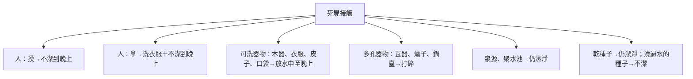
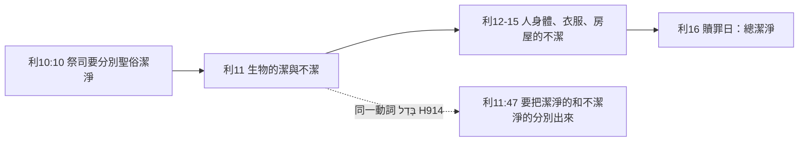

# 利未記 第11章

<!-- chapter-navigation:start -->
| [前一章](../03%20利未記/第10章.md) | [回目錄](../03%20利未記/全書目錄及綱要.md) | [下一章](../03%20利未記/第12章.md) |
| :--- | :---: | ---: |
<!-- chapter-navigation:end -->

1. 耶和華對[[摩西]]、亞倫說：
2. 你們曉諭以色列人說，在地上一切走獸中可吃的乃是這些：
3. 凡[[分蹄倒嚼（潔淨走獸的判準）|蹄分兩瓣]]、[[分蹄倒嚼（潔淨走獸的判準）|倒嚼]]的走獸，你們都可以吃。
4. 但那[[分蹄倒嚼（潔淨走獸的判準）|倒嚼]]或分蹄之中不可吃的乃是：駱駝─因為倒嚼不分蹄，就與你們不潔淨；
5. [[沙番（shaphan）|沙番]]─因為[[分蹄倒嚼（潔淨走獸的判準）|倒嚼]]不分蹄，就與你們不潔淨；
6. 兔子─因為[[分蹄倒嚼（潔淨走獸的判準）|倒嚼]]不分蹄，就與你們不潔淨；
7. [[豬與異教祭祀的關聯|豬]]─因為[[分蹄倒嚼（潔淨走獸的判準）|蹄分兩瓣]]，卻不[[分蹄倒嚼（潔淨走獸的判準）|倒嚼]]，就與你們不潔淨。
8. 這些獸的肉，你們不可吃；死的，你們不可摸，都與你們不潔淨。
9. 水中可吃的乃是這些：凡在水裡、海裡、河裡、[[有翅有鱗（潔淨水族的判準）|有翅有鱗]]的，都可以吃。
10. 凡在海裡、河裡，並一切水裡游動的活物，[[有翅有鱗（潔淨水族的判準）|無翅無鱗]]的，你們都當以為可憎。
11. 這些[[有翅有鱗（潔淨水族的判準）|無翅無鱗]]、以為可憎的，你們不可吃他的肉；死的也當以為可憎。
12. 凡水裡[[有翅有鱗（潔淨水族的判準）|無翅無鱗]]的，你們都當以為可憎。
13. [[不潔淨雀鳥（二十種可憎飛禽）|雀鳥]]中你們當以為可憎、不可吃的乃是：鵰、狗頭鵰、紅頭鵰、
14. 鷂鷹、小鷹與其類；
15. [[潔淨與不潔淨|烏鴉]]與其類；
16. 鴕鳥、夜鷹、魚鷹、鷹與其類；
17. 鴞鳥、鸕鶿、貓頭鷹、
18. 角鴟、鵜鶘、禿鵰、
19. 鸛、鷺鷥與其類；戴鵀與蝙蝠。
20. 凡有翅膀用四足爬行的物，你們都當以為可憎。
21. 只是有翅膀用四足爬行的物中，有足有腿，在地上蹦跳的，你們還可以吃。
22. 其中有[[蹦跳的蝗蟲類（潔淨昆蟲）|蝗蟲]]、螞蚱、蟋蟀與其類；蚱蜢與其類；這些你們都可以吃。
23. 但是有翅膀有四足的爬物，你們都當以為可憎。
24. 這些都能使你們不潔淨。凡摸了死的，必不潔淨到晚上。
25. 凡拿了死的，必不潔淨到晚上，並要洗衣服。
26. 凡走獸分蹄不成兩瓣、也不[[分蹄倒嚼（潔淨走獸的判準）|倒嚼]]的，是與你們不潔淨；凡摸了的就不潔淨。
27. 凡四足的走獸，用掌行走的，是與你們不潔淨；摸其屍的，必不潔淨到晚上。
28. 拿其屍的，必不潔淨到晚上，並要洗衣服。這些是與你們不潔淨的。
29. [[地上爬物（八種不潔爬蟲）|地上爬物]]與你們不潔淨的乃是這些：鼬鼠、鼫鼠、蜥蜴與其類；
30. 壁虎、龍子、守宮、蛇醫、蝘蜓。
31. 這些爬物都是與你們不潔淨的。在他死了以後，凡摸了的，必不潔淨到晚上。
32. 其中死了的，掉在什麼東西上，這東西就不潔淨，無論是木器、衣服、皮子、口袋，不拘是做什麼工用的器皿，須要放在水中，必不潔淨到晚上，到晚上才潔淨了。
33. 若有死了掉在瓦器裡的，其中不拘有什麼，就不潔淨，你們要把這瓦器打破了。
34. 其中一切可吃的食物，沾水的就不潔淨，並且那樣器皿中一切可喝的，也必不潔淨。
35. 其中已死的，若有一點掉在什麼物件上，那物件就不潔淨，不拘是爐子，是鍋臺，就要打碎，都不潔淨，也必與你們不潔淨。
36. 但是泉源或是聚水的池子仍是潔淨；惟挨了那死的，就不潔淨。
37. 若是死的，有一點掉在要種的子粒上，子粒仍是潔淨；
38. 若水已經澆在子粒上，那死的有一點掉在上頭，這子粒就與你們不潔淨。
39. 你們可吃的走獸若是死了，有人摸他，必不潔淨到晚上；
40. 有人吃那死了的走獸，必不潔淨到晚上，並要洗衣服；拿了死走獸的，必不潔淨到晚上，並要洗衣服。
41. 凡地上的爬物是可憎的，都不可吃。
42. 凡用肚子行走的和用四足行走的，或是有許多足的，就是一切爬在地上的，你們都不可吃，因為是可憎的。
43. 你們不可因什麼爬物使自己成為可憎的，也不可因這些使自己不潔淨，以致染了[[污穢]]。
44. 我是耶和華─你們的神；所以你們要成為聖潔，因為我是聖潔的。你們也不可在地上的爬物[[污穢]]自己。
45. 我是把你們從埃及地領出來的耶和華，要作你們的神；所以你們要聖潔，因為我是聖潔的。
46. 這是走獸、飛鳥，和水中游動的活物，並地上爬物的條例。
47. 要把潔淨的和不潔淨的，可吃的與不可吃的活物，都分別出來。

---

## 本章知識節點

### 人物
- [[摩西]]
- [[亞倫和他兒子（祭司）]]

### 神學
- [[潔淨與不潔淨]]
- [[你們要聖潔因為我是聖潔的]]

### 主題
- [[聖潔生活]]
- [[聖潔飲食]]
- [[污穢]]
- [[潔淨與不潔淨的早期區分]]
- [[瓦器打碎銅器擦淨]]
- [[分蹄倒嚼（潔淨走獸的判準）]]
- [[有翅有鱗（潔淨水族的判準）]]
- [[不潔淨雀鳥（二十種可憎飛禽）]]
- [[蹦跳的蝗蟲類（潔淨昆蟲）]]
- [[地上爬物（八種不潔爬蟲）]]

### 原文
- [[沙番（shaphan）]]

### 文化
- [[豬與異教祭祀的關聯]]

### 背景
- [[古代近東飲食潔淨]]

### 解經爭議
- [[摸活的不潔淨動物算不算不潔（法利賽人與撒都該人之爭）]]

---

## 本章整理

### 一章寫給全體百姓的食物條例（v1-2）

前一章的禁令是給祭司的，這一章不是。神同時對[[摩西]]和[[亞倫和他兒子（祭司）|亞倫]]說話（v1），而要傳的對象是「以色列人」。GT 引丁良才說明為什麼並提兩個名字：「這是因為下列的條例與摩西和亞倫都有關係」。GT《串珠聖經註釋》給的理由更具體：「通常神是單獨與摩西說話，較少與摩西及亞倫二人一同說話；這裡卻是二人一起的，可能是因亞倫及祭司們須要分別潔淨的與不潔淨的，並且要教導以色列人遵守（參10:10）。」

這個接點不只在文意上成立，原文也看得見。STEP語言資料顯示，利10:10 吩咐祭司「分別出來」用的動詞是 בָּדַל（H914），本章結尾v47「要把潔淨的和不潔淨的……都分別出來」用的是同一個字。==第十章交代祭司要會分辨，第十一章就是那份分辨清單。==

KC 從另一個角度說明這章為何屬於每個人：「這一章給的是所有以色列人的食物條例，不只是祭司的。」他並把理由接到身分上——申命記十四章重複同一套規定時，摩西稱以色列人為「耶和華的兒女」，「我們作神兒子的地位，決定了我們食物的標準」。

### 走獸：兩個條件，缺一不可（v3-8）

走獸的判準是[[分蹄倒嚼（潔淨走獸的判準）|分蹄又倒嚼]]。原文其實比中文更細：STEP語言資料顯示v3 一口氣用了兩組詞——מַפְרֶסֶת פַּרְסָה（פָּרַס，H6536「分開」＋פַּרְסָה，H6541「蹄」）與 שֹׁסַעַת שֶׁסַע（שָׁסַע，H8156「裂開」＋שֶׁסַע，H8157「裂縫」），描述的是「蹄要分開，而且要裂成兩瓣」；「倒嚼」則是 מַעֲלַת גֵּרָה，動詞 עָלָה（H5927M，逐字解「regurgitate」）配名詞 גֵּרָה（H1625，「cud」），字面是「把反芻物帶上來」——CT 的〔原文字義〕給「嚼」的字義正是「上升，攀登」。

兩個條件必須同時具備。CT 說得直接：「分蹄和倒嚼二者必須相輔——豬分瓣，卻不倒嚼，所以不算潔淨。」KC 說的是同一件事：「潔淨動物的特徵是配套的。兩樣都必須具備。」他並把兩者對到讀經與生活上——倒嚼是把讀進去的東西留時間沉澱、反覆思想，分蹄則是「行走的穩定」，兩者缺一都不成：「怎麼可能有實踐，如果沒有教導、如果人不知道神話語的原則？而知識若不帶出相應的實踐，也一樣不好。兩樣都需要。」

| 動物 | 有的條件 | 缺的條件 | 各家讀出的意思 |
| --- | --- | --- | --- |
| 駱駝 | 倒嚼 | 不分蹄 | CT：「表徵能說不能行的人（參太二十三3）」 |
| 沙番 | 倒嚼 | 不分蹄 | CT：「什麼『道』都吸收進去，不分真假（參詩一百十九128）」 |
| 兔子 | 倒嚼 | 不分蹄 | 同上；口部不停動，看似反芻 |
| 豬 | 分蹄 | 不倒嚼 | CT：「表徵只有敬虔的外貌，卻背了敬虔的實意的人（參提後三5）」 |

> [!note] [[沙番（shaphan）|沙番]]和兔子到底反不反芻？
> 現代生物學說不。GT 收的《聖經難解經文詮釋手冊》（賈斯樂郝威）解釋這個落差：牠們沒有四個胃，但「咀嚼時下顎的動作很像在反芻」，瑞典博物學家林奈起初也把牠們歸為反芻動物；兔子的咀嚼過程另有專名 refection。GT 收的《舊約聖經難題彙編》（艾基斯）補充同一點，並引簡斯度說明野兔會在休息時嚼上次進食剩在口腔中的食物。丁良才給的則是立法原則：「神的律例是為眾百姓設立的，因此本章所記的動物不是按科學的考察分類，乃是按眾目所見的規定，使人容易遵行」——他還舉聖經說「日頭出來，日頭落下」作為同一種寫法。至於沙番是什麼，GT《啟導本》說這個名字「從希伯來文shaphan音譯過來」，一般認為就是今天的蹄兔；STEP語言資料的詞典義是「rock badger」（שָׁפָן，H8227A）。

[[豬與異教祭祀的關聯|豬]]的例子另有一層背景。GT《舊約聖經背景註釋》整理了周邊民族怎麼看豬：亞述的智慧文學以豬為不聖潔、是神明所憎惡的，某些赫人儀式必須獻豬為祭，但米格倫觀察到「這些儀式中的豬不是放在壇上作為神明的食物，而是吸收不潔，然後焚燒或埋葬，獻給冥界神祇為祭」；埃及色特神尤其以豬為聖，而以豬為祭的例證主要來自希臘和羅馬，「獻祭的對象大都是冥界神祇」。同一則註釋並指出以賽亞書六十五4、六十六3、17「清楚反映了以色列人對豬的態度」，前者更提及與崇拜死人的關聯——「故此以豬為祭，很可能就等於是獻祭給鬼魔或死人。」

### 水族、飛鳥、昆蟲：三種不同的立法手法（v9-23）

水族的判準最簡單：[[有翅有鱗（潔淨水族的判準）|有翅有鱗]]就可以吃（v9）。CT 解釋這兩樣的作用：「翅指在水中能行動，鱗是為著與水隔開」；KC 說的一樣：「鰭給魚逆流而游、保持正確方向的力量；鱗保護牠不受周圍環境的錯誤影響。」GT《啟導本》從實用面補了一句：這個分法「重要是容易辨認，非常實用」。

飛鳥的手法完全相反——經文一種可吃的都沒有列，只列了二十種不可吃的（v13-19）。丁良才注意到這個差異：「這幾節中沒有提及什麼指定的記號，使人能知道何等算為潔淨，何等算為不潔淨，像走獸和水族－樣，乃是直接地記二十種不可吃的飛禽。」至於這些鳥有什麼共同點，GT《聖經精讀本》歸納了四項：「①兇猛的鳥……②孤獨悲傷的鳥……③不是生活在正常環境和巢穴中的鳥……④不潔的鳥。」CT 的話中之光另外歸納三點（殘忍、孤獨痛苦、吃不潔污穢的食物），並單獨拿蝙蝠說事：「蝙蝠像鳥而非鳥，像鼠而非鼠的『兩面派』，故被歸類為可憎的鳥。」

昆蟲則是「一律可憎，但有例外」：[[蹦跳的蝗蟲類（潔淨昆蟲）|後腿能蹦跳的蝗蟲類]]可以吃（v21-22）。丁良才提醒「四足爬行」這幾個字「須要活看，不是注重該蟲的足數，乃是注重該蟲的行法」。GT《啟導本》補上一個實際的理由：近東居民數千年來已把蝗蟲當食物，蝗蟲肉蛋白質在五成以上、脂肪達兩成，「沙漠中的貧戶，把蝗蟲與蜂蜜同食，攝取身體所需養料」——新約記載施洗約翰正是以此為食。丁良才另記下一個看似矛盾的細節：蜜蜂有翅又用足爬行，算不潔，但蜂蜜可吃，「因為蜜不是蜜蜂自出的，乃是由潔淨的花草釀成的」。

> [!info] 「不潔淨」和「可憎」是兩個字，不是同一個字的兩種說法
> 丁良才早就點出這個分別：「本章所論之死了的走獸不過是算為不潔，固然是以色列人所不可吃的，卻還沒有說到可憎（4-8、26-28），只是所提一切不淨潔的水族、飛禽和爬蟲等，非但算為不潔，倒是為為可憎的（11-13、20、23、41-43）。」STEP語言資料可以確認他數的是對的：走獸段用的是 טָמֵא（H2931，「unclean」），水族、飛鳥與爬物段另用 שֶׁקֶץ（H8263，詞典義「detestation」）及其動詞 שִׁקֵּץ（H8262，「to detest」）。同一章裡兩個不同的字，對應兩種不同的分量。

### 摸到死的怎麼辦（v24-40）

後半章換了主題：不再是能不能吃，而是碰到了怎麼辦。[[污穢|不潔]]會傳遞，而傳遞有等級——摸了死的，不潔淨到晚上；拿了死的，還要洗衣服（v24-25）。丁良才解釋為什麼多一道手續：「凡拿了死的，不但不潔到晚上，還要洗衣服，因為他所染的不潔，比摸著死的更甚。」CT 說明「到晚上」的意思是「表徵必須有新的開始（猶太人的時間算法是從晚上開始新的一天）」，GT《啟導本》講得更白：晚上「也就是第二天開始時（希伯來人的一天從頭天晚間算起）」。

器物的處理則看材質。可洗的放水中，[[瓦器打碎銅器擦淨|瓦器、爐子、鍋臺就要打碎]]。丁良才給的理由很物理：「這是因為瓦器是能滲透的，－切裡外上了磁釉的器皿大概不必打破。」他並注意到這幾條為什麼排在這裡：「32至35節的條例列在此處，因為29-30節所提之死了的爬蟲類，較比別類死了的動物更容易挨近家中的器具。」

水源和種子是例外。丁良才對泉源的說明兼顧了衛生與常識：「池子裡的水，既是很多的，死物的污毒自然也是最稀薄的……因此池子裡的水不必全然棄了」；GT《聖經精讀本》則指出這條例背後有恩典的考量——若水源也算不潔，「就會帶來飲水困難」。乾種子仍潔淨、澆過水的種子卻不潔，丁良才推測「或者是因子粒－沾了水，就容易吸收毒氣的緣故」。

```mermaid
flowchart TD
    A["死屍接觸"] --> B["人：摸→不潔到晚上"]
    A --> C["人：拿→洗衣服＋不潔到晚上"]
    A --> D["可洗器物：木器、衣服、皮子、口袋→放水中至晚上"]
    A --> E["多孔器物：瓦器、爐子、鍋臺→打碎"]
    A --> F["泉源、聚水池→仍潔淨"]
    A --> G["乾種子→仍潔淨；澆過水的種子→不潔"]
```

這一段也是[[摸活的不潔淨動物算不算不潔（法利賽人與撒都該人之爭）|法利賽人與撒都該人分歧]]的所在。v26 說「凡摸了的就不潔淨」，卻沒說是摸活的還是摸死的。丁良才記下兩派的相反讀法：法利賽人認為只禁摸死的，所以照常使用駱駝、驢子、馬；撒都該人則認為「凡摸著不潔淨之活走獸的人，也都成為不潔」。丁良才並指出這個分歧「是使法利賽人和撒都該人在家庭和社會的風俗人情上，發生好些不同的地方」——同一章律例，讀寬讀嚴，過的是不一樣的日子。

### 為什麼是這些動物？（各家並陳）

這套分類的原理是什麼，本章的來源給了好幾種互不相同的答案，而 GT《舊約聖經背景註釋》自己就先把幾種理論的弱點說了出來：

| 提出的原理 | 出處與說法 |
| --- | --- |
| 衛生與健康 | GT《啟導本》：不潔淨的水生物「大都生活於淺水中，賴腐敗的食物維生，易傳染疾病」 |
| 與異教儀式切割 | GT《啟導本》列為三種說法之一；但《舊約聖經背景註釋》反駁：「其實以色列鄰邦的獻祭習慣和以色列極為相似」 |
| 分類上的「正常」與否 | GT《舊約聖經背景註釋》引人類學家：動物潔與不潔「是視乎牠是否具備在其分類中使之『正常』的所有特徵」 |
| 神的「飲食」模式 | GT《舊約聖經背景註釋》：「一個新近提出的理論可信性頗高：神的『飲食』是以色列飲食的模式。換言之，不能獻給神為祭，就不宜給人作為食物。」 |
| 遠離死亡 | GT 丁良才：「在聖書中死和罪常是關聯的……神就吩咐祂的百姓，須遠離一切死的，也定了－切肉食的獸類為不潔淨」 |

同一則背景註釋並指出這套制度在當時是獨一份的：美索不達米亞有食物短期遭禁的例子，巴比倫也有神祇只肯接受某種牲畜為祭物，「但卻沒有好像本段一般，凌駕一切之上的系統」（見[[古代近東飲食潔淨]]）。丁良才在章末的總論裡也做了同樣的比較，並強調差別在動機：埃及人把動物分潔與不潔，是因為「有類似陰間主神之善性的走獸是潔淨的」；波斯人分潔與不潔，是因為「有的走獸是善神造的……有的走獸是惡鬼造的」；而摩西的條例「絕沒有二元和泛神的意思」，並且是為眾百姓定的，不像埃及的條例只為祭司定。

### 理由寫在最後：因為我是聖潔的（v41-47）

v41-43 把地上一切爬物一律定為可憎，然後v44-45 給出全章的理由（見[[你們要聖潔因為我是聖潔的]]）。這兩節在原文裡有一個對稱，中文不太看得出來：STEP語言資料顯示v43「也不可因這些使自己不潔淨」的 תִטַּמְּאוּ 是 טָמֵא（H2930A）的 **Hithpael**（反身），而v44「你們要成為聖潔」的 וְהִתְקַדִּשְׁתֶּם 是 קָדַשׁ（H6942G）的 **Hithpael**。==一句是「不要把自己弄髒」，下一句是「要把自己分別出來」，兩個動作都由人自己承擔。==

各家對「聖潔」這個字的解釋一致。GT《聖經精讀本》：「『聖潔』原意『分離』。從所有罪和不潔中分離的狀態就是聖潔。」GT《利未記雷氏研讀本》講得更完整：用在以色列人身上是「分別為聖歸給神，而且遠離一切不潔淨的東西」，用在神身上則「不但指祂從一切邪惡分別出來，而且祂是全然純潔，跟所有其它生物有顯著的分別」。CT 補上一個實務上的觀察：「神規定潔淨和不潔淨的食物，旨在讓人通過視覺直接分辨，用以操練生活的聖潔，用外在潔淨表明內在的聖潔。」

丁良才在全章末尾列了十個要點，其中第八點把立法的目的收成四條：「（一）叫他們重看衛生，保全生命，使身體康健；（二）叫他們與外人有分別，保全宗族，堅守神所交托的道理；（三）叫他們知道神的聖潔，又明白人要與神交接，就必須聖潔；（四）要借著這些條例教導百姓明白道義並善和惡的分別。」他為第四條打了一個比方：正如幼稚園的保姆要叫兒童明白數目，得先借他們看得見的指頭或小石塊，神也是先在這些看得見的事上叫百姓分別好歹，「為要引導他們在靈性和道德方面分辨善惡」。

### 這章今天怎麼讀

丁良才的第九與第十個要點正面處理了這個問題。他先說這些條例「曾借著耶穌的十字架都巳經塗抹了，撤去了」，並列出四個理由：入口的不能污穢人（可七15、18-19）、食物不能叫神看中我們（林前八8）、禮節上的潔與不潔已經撤去、人不可因飲食論斷我們（西二16-17）。接著他又說「這些條例雖不能約束我們，內中的精義卻于現今的信徒也是大有益處的」——神所喜悅的聖潔不單與靈魂有關，也與肉體有關，因為肉體「是靈魂辦事的機關，又是借著基督的寶血救贖出來的」，所以人或吃或喝都要為榮耀神而行。

KC 讀的角度不同但方向一致：吃就是把某樣東西納進來、使它成為自己的一部分，所以「我們吃什麼，決定我們表現出什麼」。他甚至把幾種爬物讀成具體的功課——鼴鼠住在地下、與日光隔絕，教我們不做見不得光的事；變色龍隨環境變色，正像人在信徒中間是一個樣子、在世界裡又是另一個樣子。CT 收在同一個原則上：「本章潔淨的和不潔淨的，不當作衛生條例，乃當作屬靈條例看。惟有基督和一切出乎基督的是潔的食物。基督是分蹄倒嚼的，有翅有鱗的，能蹦能跳的，又是有子粒有生命的。」

```mermaid
flowchart LR
    A["利10:10 祭司要分別聖俗潔淨"] --> B["利11 生物的潔與不潔"]
    B --> C["利12-15 人身體、衣服、房屋的不潔"]
    C --> D["利16 贖罪日：總潔淨"]
    B -.->|"同一動詞 בָּדַל H914"| E["利11:47 要把潔淨的和不潔淨的分別出來"]
```

GT《串珠聖經註釋》把這條線標得很清楚：關於潔淨與不潔的律例「是回應10:10，以及作為16章有關贖罪日的背景」——十一章講生物的不潔，十二至十五章講人身體的不潔，十六章則是潔淨這一切不潔的贖罪日。

**參考資料**
https://www.ccbiblestudy.org/Old%20Testament/03Lev/03CT11.htm
https://www.ccbiblestudy.org/Old%20Testament/03Lev/03GT11.htm
https://www.kingcomments.com/en/bible-studies/Lev/11
https://biblehub.com/study/leviticus/11.htm
https://github.com/STEPBible/STEPBible-Data

<!-- chapter-navigation:start -->
| [前一章](../03%20利未記/第10章.md) | [回目錄](../03%20利未記/全書目錄及綱要.md) | [下一章](../03%20利未記/第12章.md) |
| :--- | :---: | ---: |
<!-- chapter-navigation:end -->
