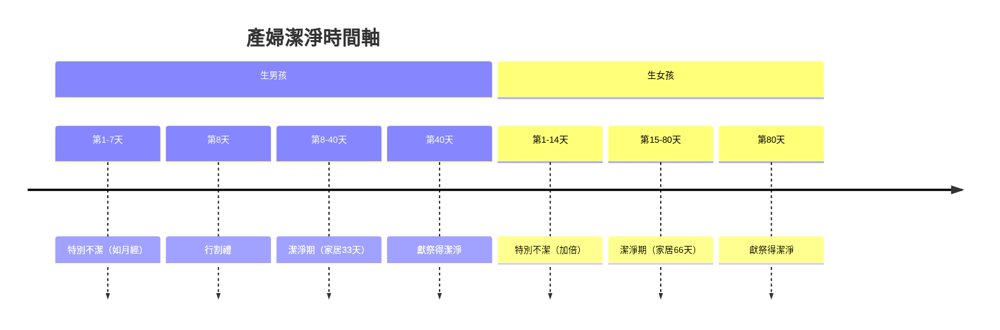
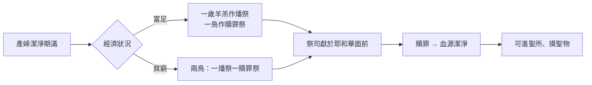

# 利未記 第12章

1. 耶和華對[[摩西]]說：
2. 你曉諭以色列人說：若有婦人懷孕生男孩，他就不潔淨七天，像在月經污穢的日子不潔淨一樣。
3. 第八天，要給嬰孩行[[割禮之約|割禮]]。
4. 婦人在產血不潔之中，要[[產婦生產潔淨條例（男四十女八十天）|家居三十三天]]。他潔淨的日子未滿，不可摸聖物，也不可進入聖所。
5. 他若生女孩，就不潔淨兩個七天，像污穢的時候一樣，要在產血不潔之中，[[產婦生產潔淨條例（男四十女八十天）|家居六十六天]]。
6. 滿了潔淨的日子，無論是為男孩是為女孩，他要把一歲的羊羔為[[燔祭（olah）|燔祭]]，一隻[[雛鴿]]或是一隻[[斑鳩]]為[[贖罪祭]]，帶到會幕門口交給祭司。
7. 祭司要獻在耶和華面前，為他贖罪，他的血源就潔淨了。這條例是為生育的婦人，無論是生男生女。
8. 他的力量若不夠獻一隻羊羔，他就要取兩隻[[斑鳩]]或是兩隻[[雛鴿]]，一隻為[[燔祭（olah）|燔祭]]，一隻為[[贖罪祭]]。祭司要為他贖罪，他就潔淨了。

---

## 本章知識節點

### 神學
- [[產婦不潔原因之爭（原罪說與血液不潔說）]]
- [[割禮之約]]
- [[燔祭（olah）]]
- [[贖罪祭]]

### 人物
- [[摩西]]

### 事件
- [[產婦生產潔淨條例（男四十女八十天）]]

### 原文
- [[斑鳩]]
- [[雛鴿]]

### 文化
- [[燔祭祭牲的貧富分級]]

---

## 本章整理

### 產後潔淨條例概述（v1-5）

本章記載耶和華透過[[摩西]]頒布[[產婦生產潔淨條例（男四十女八十天）]]。經文將產婦的不潔分為兩階段：第一階段為「特別不潔」，生男孩七天、生女孩十四天（v2,5），此期間如同月經污穢，凡接觸她或其臥具者不潔至晚上（參GT 丁良才《利未記註釋》）；第二階段為「潔淨期」，生男孩家居三十三天、生女孩六十六天（v4-5），合計男四十天、女八十天。此期間婦人不可摸聖物、不可進聖所（v4）。

關於不潔原因，來源呈現兩大說法並存：**原罪說**與**血液不潔說**。《啟導本》指出「婦人懷孕生子所以不潔，要獻燔祭贖罪，不是因為生育，而是因為分娩時排出的不潔產血」；《串珠聖經註釋》則引創3:16 女人生產苦楚為神審判墮落之結果，故視為不潔。CT 靈意註解進一步將「生男孩」表徵「生命剛強者」、「不潔淨七天」表徵「完全不潔」；「生女孩」表徵「生命軟弱者」、「加倍不潔」並需「雙倍試煉」。KC 則從人類本質切入：「人生來不潔，只能生出不潔的孩子」，唯獨耶穌是「從不潔者生出的潔淨者」。這些觀點互補而非互斥，共同構成[[產婦不潔原因之爭（原罪說與血液不潔說）]]的神學張力。

| 項目 | 生男孩 | 生女孩 | 來源說明 |
|------|--------|--------|----------|
| 特別不潔天數 | 7 天 | 14 天 | GT《丁良才》：女孩加倍「叫他們紀念，罪惡是借著女人入了世界」（提前2:14） |
| 潔淨期天數 | 33 天 | 66 天 | 《舊約背景註釋》：「產後出血可長至2-6週，估計恰當」 |
| 總計 | 40 天 | 80 天 | KC：「女說話情感、主觀，靠感覺者常需更久接受基督工作」 |
| 割禮 | 第8天行 | 無 | 《聖經精讀本》：「八是復活數字，象徵重新生出成為屬神百姓」 |

> [!quote] 關鍵引文
> - CT：「婦人產後不潔，表徵全人類一出生就是不潔的；『生男孩』表徵生命剛強者；『不潔淨七天』表徵完全不潔。」
> - KC：「在女人身上我們也可以看見以色列的預表，一個不潔的百姓，從他們生出了彌賽亞，那潔淨者。」
> - 《舊約背景註釋》：產後不潔觀念在埃及、巴比倫、波斯等古代文化都很普遍；至於四十日的淨化期，波斯和希臘對於分娩後進入聖潔地區也同樣有四十日的規限，赫人則認為男嬰三個月、女嬰四個月不潔淨。

### 割禮與獻祭儀式（v6-8）

第八天為男嬰行[[割禮之約]]（v3），CT 指出「第八天表徵藉著基督復活的生命；行割禮表徵靠基督十字架除去肉體情慾」（參西2:11）。潔淨期滿，產婦須帶一歲羊羔為[[燔祭（olah）]]、一隻[[斑鳩]]或[[雛鴿]]為[[贖罪祭]]至會幕門口（v6）。祭司獻上贖罪，「血源就潔淨了」（v7），此處「血源」暗示創3:16 生產苦楚之根源。

> [!important] 祭牲次序的神學意義
> CT 指出本章「先燔祭後贖罪祭，與一般次序不同」：燔祭表徵「完全為神而活」（羅12:1），贖罪祭表徵「對付裡面罪性」（羅7:20）。這順序啟示：神的救贖不僅赦罪，更叫人「經過死而復活，解決神人一切問題，能與神相交」。

貧窮條款（v8）體現神的恩典：若力量不足獻羊，可用兩隻[[斑鳩]]或兩隻[[雛鴿]]，一為燔祭一為贖罪祭。這正是[[燔祭祭牲的貧富分級]]的具體展現。路2:24 記載馬利亞獻「一對斑鳩或兩隻雛鴿」，KC 指出「暗示她貧窮，無力獻羊」，應驗林後8:9「祂原為富足，卻為你們成了貧窮」。CT 靈意註解：「表徵人若有願作的心，必蒙神悅納」（林後8:12）。

### 跨章脈絡：從利未記到路加福音的預表應驗

本章條例在新約獲得雙重應驗：(1) **耶穌的割禮與馬利亞的潔淨**（路2:21-24）——KC 指出，馬利亞是這條例唯一的例外：她所生的孩子是完全潔淨的一位，因祂不是由罪人所懷、而是由聖靈所懷（路1:35），但馬利亞自己仍須按條例獻祭，見證「凡經婦人所生的族類，都是污穢的」（CT 引詩51:5）；(2) **屬靈預表**——KC 指出婦人預表以色列，「彌賽亞從不潔百姓生出」；啟12:1-6 「婦人代表以色列，男孩子是主耶穌」。CT 總結：「七天加三十三天，合計四十天，表徵通過神的煉淨」（太4:1-2；彼前1:4）；「不可在肉體裡摸有關神的事物」（羅8:8）。

> [!question] 懸而未決
> - 生女孩不潔期加倍的確切原因，經文未明說，諸說紛紜（女胎較不潔？族長社會地位？預表女性情感軟弱？），仍屬解經爭議。
> - 「血源」一詞（v7）是否專指創3:16 審判，抑或包含更廣的人性墮落根源？各家解經有細微差異。

**參考資料**
https://www.ccbiblestudy.org/Old%20Testament/03Lev/03CT12.htm
https://www.ccbiblestudy.org/Old%20Testament/03Lev/03GT12.htm
https://www.kingcomments.com/en/bible-studies/Lev/12
https://biblehub.com/study/leviticus/12.htm
