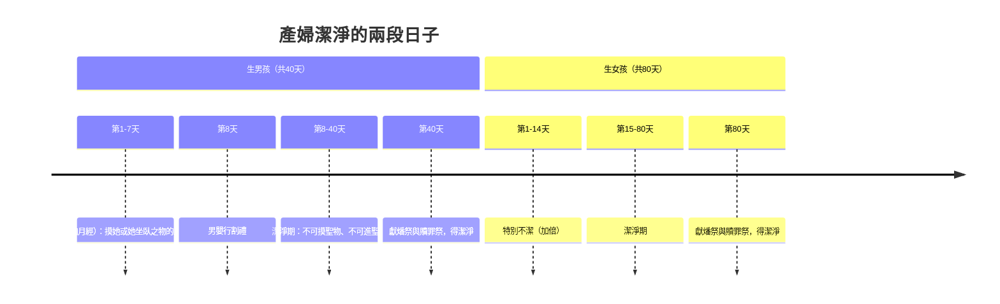
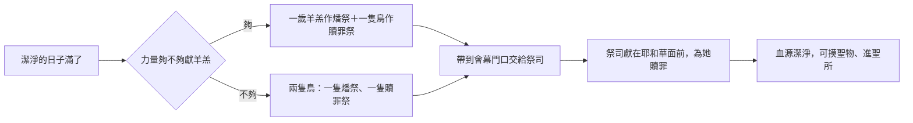

# 利未記 第12章

<!-- chapter-navigation:start -->
| [前一章](../03%20利未記/第11章.md) | [回目錄](../03%20利未記/全書目錄及綱要.md) | [下一章](../03%20利未記/第13章.md) |
| :--- | :---: | ---: |
<!-- chapter-navigation:end -->

1. 耶和華對[[摩西]]說：
2. 你曉諭以色列人說：若有婦人懷孕生男孩，他就不潔淨七天，像在月經污穢的日子不潔淨一樣。
3. 第八天，要給嬰孩行[[割禮之約|割禮]]。
4. 婦人在[[血|產血]]不潔之中，要[[產婦生產潔淨條例（男四十女八十天）|家居三十三天]]。他潔淨的日子未滿，不可摸聖物，也不可進入聖所。
5. 他若生女孩，就不潔淨兩個七天，像污穢的時候一樣，要在[[血|產血]]不潔之中，[[產婦生產潔淨條例（男四十女八十天）|家居六十六天]]。
6. 滿了潔淨的日子，無論是為男孩是為女孩，他要把一歲的羊羔為[[燔祭]]，一隻[[雛鴿]]或是一隻[[斑鳩]]為[[贖罪祭]]，帶到會幕門口交給祭司。
7. 祭司要獻在耶和華面前，為他贖罪，他的[[血源]]就潔淨了。這條例是為生育的婦人，無論是生男生女。
8. 他的力量若不夠獻一隻羊羔，他就要取兩隻[[斑鳩]]或是兩隻[[雛鴿]]，一隻為[[燔祭]]，一隻為[[贖罪祭]]。祭司要為他贖罪，他就潔淨了。

---

## 本章知識節點

### 人物
- [[摩西]]

### 主題
- [[產婦生產潔淨條例（男四十女八十天）]]
- [[血]]
- [[斑鳩]]
- [[雛鴿]]

### 神學
- [[割禮之約]]
- [[燔祭]]
- [[贖罪祭]]
- [[燔祭祭牲的貧富分級]]
- [[潔淨與不潔淨]]
- [[禮儀不潔與道德罪的分別]]

### 原文
- [[血源]]

### 解經爭議
- [[產婦不潔原因之爭（原罪說與血液不潔說）]]

### 背景
- [[古代近東的產後不潔與淨化期]]

### 互文
- [[馬利亞的潔淨禮與獻鳥（路2：22-24）]]

---

## 本章整理

### 兩段不潔，兩個數字（v1-5）

本章只有八節，由[[摩西]]單獨領受（v1）——上一章的食物條例是對摩西和亞倫兩人說的，這一章沒有提亞倫。BH 指出，摩西作為神與百姓之間傳達聖約的中保，本身就是那位終極中保基督的預表（提前2:5）。

KC 把利未記十一到十三章讀成一條線：十一章講的是人從外面沾來的污穢，本章講的是[[禮儀不潔與道德罪的分別|人自己身上的不潔]]，十三章的大痲瘋則是同一件事發作出來。他並提醒，本章的不潔與潔淨期「是我們在聖經裡所能找到最長的」——生男孩四十天，生女孩八十天。

日子分成前後兩段，兩段的嚴格程度並不一樣。前一段是「特別不潔」：生男孩七天、生女孩十四天。GT 丁良才說明這幾天的實際規矩：「凡摸她和摸她所躺或所坐之物件的人參不潔淨到晚上，並要洗衣服，用水洗澡」；GT《串珠聖經註釋》補上一句「期間她的丈夫也不可接近她」。後一段是「潔淨期」，生男孩三十三天、生女孩六十六天，串珠說這時「只是不許接觸聖物而已」。經文自己也是這樣寫的：不可摸聖物，也不可進入聖所（v4）。原文在這裡用了兩個不同的字——「聖物」是 קֹדֶשׁ（H6944G），「聖所」是 מִקְדָּשׁ（H4720），與 CT 和 GT《聖經精讀本》的判斷相合：這個「聖所」不是指會幕裡面那間平常人本來就不能進的聖所，而是指神分別為聖的場所。

兩段要不要相加，丁良才特地回到原文說清楚：v4「原文作仍要家居三十三天，顯明頭七天不在那三十三天之內」，舊文理譯本作「必更待三十三日」。所以是七加三十三等於四十、十四加六十六等於八十。STEP 也顯示原文把數字拆開寫成「三十天和三天」「六十天和六天」。另外還有一個容易錯過的細節：本章把產後不潔比作「月經污穢的日子」，可是月經的條例要到利未記15:19-30 才頒布。丁良才由此推論，「可見傳律法以前以色列人就已經這樣行了」。

原文的用字也值得看一眼。STEP 顯示 v2「懷孕」是 זָרַע（H2232）的使役形，簡要辭典的字義是「to sow」（撒種），本節逐字解作「她要生孩子」——CT〔原文字義〕給的中文正是「被播種，懷孩子」；同一節「污穢的」出自 דָּוָה（H1738），義域是「be sick」，CT 也註「生病，不舒服」。v5 的「兩個七天」是 שָׁבוּעַ（H7620H）的雙數形，字面就是「兩個七日」。至於 v4、v5 的「產血不潔」，原文其實是「血」加上 טֹהַר（H2892A），STEP 逐字解作「潔淨」；和合本把整個片語意譯成「產血不潔之中」，指的是那段還在流血、尚待潔淨的日子。

```mermaid
timeline
    title 產婦潔淨的兩段日子
    section 生男孩（共40天）
        第1-7天 : 特別不潔（如月經）：摸她或她坐臥之物的人不潔到晚上
        第8天 : 男嬰行割禮
        第8-40天 : 潔淨期：不可摸聖物、不可進聖所
        第40天 : 獻燔祭與贖罪祭，得潔淨
    section 生女孩（共80天）
        第1-14天 : 特別不潔（加倍）
        第15-80天 : 潔淨期
        第80天 : 獻燔祭與贖罪祭，得潔淨
```

**生女孩為什麼要加倍？經文沒說，來源給了六種答案，而且彼此不合。** 這正是可以並排看清楚的地方：

| 來源 | 說法 |
|---|---|
| GT 丁良才 | 「我們不得知道」，大概是叫他們紀念「罪惡是借著女人入了世界」（提前2:14） |
| GT《聖經精讀本》 | 可能因為「在原罪上女人的責任比男人重」（提前2:14） |
| GT《啟導本》 | 先否定一種常見說法：有人說因為女胎比男胎更不潔，「但獻祭贖罪的方式完全一樣，可見此說不能成立」；他提出的可能是族長社會中男女地位不同（參利27:2-7），或與女嬰長大後的月經有關 |
| GT《串珠聖經註釋》 | 或許古人以為生女之後母親需要較長時間康復；更可能是這較長的不潔期叫人想起生育的苦楚源自夏娃犯罪 |
| BH | 有學者認為與女嬰將來會有月經、會生育有關；並指出這段日子讓母親得以休息復原，顯出律法對產婦健康的照顧 |
| GT《舊約聖經背景註釋》 | 直接承認「至於淨化期為何因嬰孩性別而有分別，卻沒有肯定的理由」 |

CT 也提到「據聖經學者推測，可能是因為始祖們犯罪時，是女人先受蛇誘惑（參創三6）」，並在靈意註解裡把生女孩讀作「生命軟弱者」、加倍的日子讀作「必須通過雙倍的試煉」。KC 則做了一個屬靈應用：女性說到情感、感覺、主觀的一面，而倚靠感覺的人往往要更久才肯接受基督為他們成就的事。這些說法只有一點是共通的：沒有一家說經文自己給了理由。

把眼光放到以色列之外，這條規定其實不算奇怪。[[古代近東的產後不潔與淨化期|GT《舊約聖經背景註釋》]]指出，分娩造成的不潔「被視為與每月經期的不潔同等，在古代文化中也極之普遍」，埃及、巴比倫、波斯都有案例；「波斯和希臘對於分娩後進入聖潔地區，也同樣有四十日的規限」；赫人則認為男嬰三個月、女嬰四個月是不潔淨的。連四十這個數字都有實際根據：「產後出血可以長至二至六個星期，所以這個估計十分恰當。」真正的分別不在做法而在理由——鄰邦常見的信念是「經血中有鬼魔居住」，以色列的理解卻是：經血這類分泌物與生命密切相關，「它所代表的潛在生命一旦不能實現，就成為死亡的代表，變得不潔」。

### 第八天的割禮（v3）

在四十天的中間，插進來一件只跟男孩有關的事：第八天要行[[割禮之約|割禮]]。原文比中譯本更簡省——STEP 顯示這一節沒有「嬰孩」這個字（CT〔原文字義〕也註明「原文無此字」），字面是「第八天，他包皮的肉要受割禮」，動詞 מוּל（H4135A）是被動語態。

為什麼是第八天？來源給的理由分成很實際的一層和很神學的一層。丁良才給的是實際的：第八天那婦人的特別不潔淨剛好過去，「有人摟她，就不至於沾染不潔」——換句話說，這是全家能夠聚在一起辦這件事的第一天。他並列出這條規矩的幾個要點：割禮出自創世記17:10-14，嬰孩受割禮是「顯明這嬰孩在神與亞伯拉罕所立的約上有份」（創17:13，羅4:11），也表示這約的成功在乎脫去肉體的情慾（西2:10-11）；第八天若剛好是安息日，他們還是照樣行割禮（約7:22-23）；施洗的約翰（路1:59）和主耶穌（路2:21）都是在第八天受的割禮。

神學的一層則集中在「八」這個數字。GT《聖經精讀本》說「八是復活的數字(創17:12)」，在這一天行割禮象徵使孩子重新生出來、成為屬神的百姓（西2:11-13）；BH 的說法相近：八在聖經數字裡指向新的開始與聖約的成全，也與復活相連。CT 靈意註解把兩者合起來：「『第八天』表徵藉著基督復活的生命；『行割禮』表徵靠基督的十字架除去肉體的情慾」（參西2:11）。KC 從另一個角度看同一件事：給男孩行割禮，在屬靈的意義上正是承認這孩子是不潔的；割禮說到基督的死（西2:11），孩子是憑著基督的死被帶到神面前的。BH 另指出新約把這條線收在心裡：保羅講的是「心裡的割禮」（羅2:29）。

### 潔淨期滿要獻的兩樣祭（v6-8）

日子滿了，產婦要帶祭物到會幕門口。常規是一隻一歲的羊羔作[[燔祭]]、一隻[[雛鴿]]或一隻[[斑鳩]]作[[贖罪祭]]（v6）；力量不夠的，就用兩隻鳥，一隻作燔祭、一隻作贖罪祭（v8）。這就是[[燔祭祭牲的貧富分級]]在本章的樣子。

```mermaid
flowchart LR
    A["潔淨的日子滿了"] --> B{"力量夠不夠獻羊羔"}
    B -->|"夠"| C["一歲羊羔作燔祭＋一隻鳥作贖罪祭"]
    B -->|"不夠"| D["兩隻鳥：一隻燔祭、一隻贖罪祭"]
    C --> E["帶到會幕門口交給祭司"]
    D --> E
    E --> F["祭司獻在耶和華面前，為她贖罪"]
    F --> G["血源潔淨，可摸聖物、進聖所"]
```

**為什麼可以斑鳩或雛鴿二選一？** GT《啟導本》給的是一個很具體的理由：「雛鴿與班鳩屬同類，但班鳩為候鳥，在非洲過冬，四至十月分才飛來巴勒斯坦（歌二12）；鴿子則一年四季都有。條例中規定獻祭的人可在二者中選一，是有實際必要的。」也就是說，若只准獻斑鳩，冬天生產的婦人就無祭可獻。

**為什麼這裡燔祭排在贖罪祭前面？** 這與利未記別處的次序相反，四份來源給了四個不同的理由：

- **GT 丁良才**：「因為這贖罪祭不是為什麼指定的罪獻的，乃是禮節上的贖罪祭……這潔淨產婦的禮節，是多注重燔祭，少注重贖罪祭，表示那婦人，因神的慈悲，將自己獻給神。」
- **CT**：「人的不潔，因未完全為神活著，所以先獻燔祭後獻贖罪祭」；他又說「燔祭表明新生命要成聖歸主，為主而活；贖罪祭是為產婦得成潔淨」。
- **KC**：「燔祭排在前面，因此帶有重點。惟有這樣，我們才能明白一點贖罪祭的意思。」
- **GT《聖經精讀本》**：「燔祭是對順利生產表示感謝和奉獻,贖罪祭是為除去伴隨生產的不潔。」

丁良才另外解釋了一個容易被略過的差異：本章只用一隻鳥作贖罪祭，和利未記5:7-10 的條例不同，他給的理由是本章常規已經有羊羔作燔祭了。

原文在這幾節裡也有幾處值得一提。STEP 顯示 v6 的「一歲的羊羔」是 כֶּבֶשׂ（H3532），「一歲」的字面是「牠年歲之子」；到了 v8 換成 שֶׂה（H7716），簡要辭典作「sheep」——丁良才註這裡「無論是綿羊羔，是山羊羔」都可以。v8 的「力量」在原文是「她的手」（CT〔原文字義〕：「力量」手，所擁有的），整句字面是「她的手若找不到夠一隻羊的」。至於「贖罪」，原文動詞是 כִּפֶּר（H3722A）；BH 指出這個字（kaphar）帶有遮蓋或清除的意思。而祭的名稱 חַטָּאת（H2403H）在簡要辭典裡同時列出「罪」與「贖罪祭」兩義——GT《舊約聖經背景註釋》正是據此主張，本章這一類案例證明舊譯的「贖罪祭」其實應該作「潔淨祭」：「這裡並沒有需『贖』之『罪』，只有在壇上被清除的不潔。」

祭司獻上之後，經文說「她的[[血源]]就潔淨了」（v7）。STEP 把這兩個字逐字解作「從……的泉源」與「她的血」：「源」的詞條原形是 מָקוֹר（H4726），簡要義域是「fountain」（泉源）——CT〔原文字義〕給的中文也是「泉源」。CT 由此讀出兩層：文意上，這暗示婦人生產流血受苦的根源在於違背神的命令（參創3:16）；靈意上，「血源」表徵犯罪的源頭。這裡也藏著本章一個耐人尋味的地方：[[血]]在利未記別處是贖罪與潔淨的憑藉（利17:11），在本章卻成了玷污的來源，GT《串珠》在思想問題裡特地把這一點提出來讓人思考。

貧窮條款是這一段最溫暖的部分。CT 話中之光說：「斑鳩只是表明些微的奉獻，似乎無足輕重，但是救恩的享受方面並未減少，不比龐大的公牛差。可見信心的表現不在量一方面，而是其物件。」他在靈意註解裡也說，這「表徵人若有願作的心，必蒙神悅納」（參林後8:12）。BH 的說法是：這條款顯出神體恤人的處境，使敬拜與贖罪不因財力而受限；新約裡耶穌稱讚那投下兩個小錢的寡婦（可12:41-44），是同一種眼光。

這條例在新約留下一次完整的執行紀錄，就是[[馬利亞的潔淨禮與獻鳥（路2：22-24）]]。丁良才在「滿了潔淨的日子」下直接舉馬利亞為例（路2:22），並指出她只獻了兩隻鳥，這就暗示她的貧窮、無力獻羊為燔祭（路2:24），主耶穌降生在貧窮人的家裡更顯明祂的大恩（林後8:9）；GT《啟導本》從約瑟這一邊說同一件事：「耶穌降生後，祂的父母照聖經規定獻祭，所用祭牲為鳥類，說明約瑟當時家貧，無力獻羊只為祭。」KC 則指出一個唯一的例外：就馬利亞所生的那個孩子而言，這條例不適用——祂不是由有罪的人所懷，而是由聖靈所懷（路1:35），是完全潔淨的一位；但馬利亞自己仍舊要照規矩獻祭。

### 「不潔淨」到底是什麼意思：來源的分歧

全章的骨架是[[潔淨與不潔淨]]的往返，這一點在原文裡看得最清楚。STEP 顯示 v2、v5 的「不潔淨」是動詞 טָמֵא（H2930A），v4、v6 的「潔淨的日子」是名詞 טֹהַר（H2892A），v7、v8 的「就潔淨了」是動詞 טָהֵר（H2891）——經文從「成為不潔」走到「成為潔淨」，用的是同一組字根的正反兩面。

但「不潔淨」究竟是什麼意思，來源分成兩個方向，而且分歧就在同一份來源裡也出現，這正是[[產婦不潔原因之爭（原罪說與血液不潔說）]]的內容：

| 立場 | 誰這樣說 | 說了什麼 |
|---|---|---|
| 指向人生來的不潔 | CT 靈意註解 | 「婦人產後不潔，表徵全人類一出生就是不潔的」；並引大衛「我是在罪孽裏生的」（詩51:5） |
| 指向人生來的不潔 | KC | 「人生來不潔，只能生出不潔的孩子」；孩子不潔是因為由有罪的父母所生，源頭不好 |
| 指向人生來的不潔 | GT《利未記雷氏研讀本》 | 生孩子是喜事，但也「讓人記得，罪會遺傳到每個人身上」 |
| 只是禮儀狀態 | CT 話中之光 | 「不潔淨並不是指有罪或污穢」；神造男造女又吩咐人生養眾多，並沒有改變心意說性與生育是不潔淨的 |
| 只是禮儀狀態 | GT《啟導本》 | 不潔「不是因為生育，而是因為分娩時排出的不潔產血」；並反駁另一說：人生下來便不潔的講法「不能解釋何以獻贖罪祭的為產婦，而非新嬰」 |
| 只是禮儀狀態 | GT《舊約聖經背景註釋》 | 「不潔不一定是能夠避免的，不潔的理由往往與犯罪毫無關係……這雖是禮節上而非倫理上的問題」 |
| 只是禮儀狀態 | BH | 這段不潔「不是道德判決，而是需要潔淨的禮儀狀態」；與月經相比的不潔「不是罪，而是受造秩序的一部分」 |

值得注意的是，CT 兩種說法都寫了：靈意註解讀出人一出生就不潔，話中之光卻明說不潔淨不等於有罪。這不是自相矛盾，而是兩個層次——條例本身的觸發點是產血，不是罪；但註釋家從這條例看見了更深的人性處境。GT 賈斯樂郝威《聖經難解經文詮釋手冊》把這兩層分得最清楚：他區分「母親的職責」與「人墮落後母道的情形」，前者是神所造、純潔無瑕的（創1:27-28），後者則與其他人一樣落在罪的權勢之下，因此也需要潔淨。

KC 最後把這條例接到今天的信徒身上。他說潔淨的日子是從「割禮」之後才開始算的，也就是主耶穌在十字架上所成就的事之後——只有在十字架這一邊，人才看得見自己本來是什麼樣子，而「我越認識自己，就越厭惡自己」。他也把「潔淨的日子滿了才能進聖所」應用在接納人到主的桌子前：一個人要等到他的潔淨日子滿了、認識了自己、也為自己接受了主耶穌工作的價值，才被接納。

**參考資料**
https://www.ccbiblestudy.org/Old%20Testament/03Lev/03CT12.htm
https://www.ccbiblestudy.org/Old%20Testament/03Lev/03GT12.htm
https://www.kingcomments.com/en/bible-studies/Lev/12
https://biblehub.com/study/leviticus/12.htm
https://github.com/STEPBible/STEPBible-Data

<!-- chapter-navigation:start -->
| [前一章](../03%20利未記/第11章.md) | [回目錄](../03%20利未記/全書目錄及綱要.md) | [下一章](../03%20利未記/第13章.md) |
| :--- | :---: | ---: |
<!-- chapter-navigation:end -->
