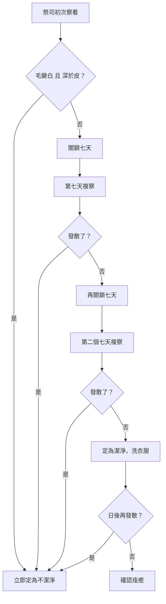

# 利未記 第13章

1. 耶和華曉諭[[摩西]]、亞倫說：
2. 人的肉皮上若長了癤子，或長了癬，或長了火斑，在他肉皮上成了[[大痲瘋（tsara'at，皮膚病診斷條例）|大痲瘋]]的災病，就要將他帶到[[亞倫和他兒子（祭司）|祭司]]亞倫或亞倫作祭司的一個子孫面前。
3. [[亞倫和他兒子（祭司）|祭司]]要察看肉皮上的災病，若災病處的毛已經變白，災病的現象深於肉上的皮，這便是大[[大痲瘋（tsara'at，皮膚病診斷條例）|痲瘋]]的災病。祭司要察看他，定他為不潔淨。
4. 若火斑在他肉皮上是白的，現象不深於皮，其上的毛也沒有變白，[[亞倫和他兒子（祭司）|祭司]]就要將有災病的人關鎖七天。
5. 第七天，[[亞倫和他兒子（祭司）|祭司]]要察看他，若看災病止住了，沒有在皮上發散，祭司還要將他關鎖七天。
6. 第七天，[[亞倫和他兒子（祭司）|祭司]]要再察看他，若災病發暗，而且沒有在皮上發散，祭司要定他為潔淨，原來是癬；那人就要洗衣服，得為潔淨。
7. 但他為得潔淨，將身體給[[亞倫和他兒子（祭司）|祭司]]察看以後，癬若在皮上發散開了，他要再將身體給祭司察看。
8. [[亞倫和他兒子（祭司）|祭司]]要察看，癬若在皮上發散，就要定他為不潔淨，是大[[大痲瘋（tsara'at，皮膚病診斷條例）|痲瘋]]。
9. 人有了大[[大痲瘋（tsara'at，皮膚病診斷條例）|痲瘋]]的災病，就要將他帶到[[亞倫和他兒子（祭司）|祭司]]面前。
10. [[亞倫和他兒子（祭司）|祭司]]要察看，皮上若長了白癤，使毛變白，在長白癤之處有了紅瘀肉，
11. 這是肉皮上的舊大[[大痲瘋（tsara'at，皮膚病診斷條例）|痲瘋]]，[[亞倫和他兒子（祭司）|祭司]]要定他為不潔淨，不用將他關鎖，因為他是不潔淨了。
12. 大[[大痲瘋（tsara'at，皮膚病診斷條例）|痲瘋]]若在皮上四外發散，長滿了患災病人的皮，據[[亞倫和他兒子（祭司）|祭司]]察看，從頭到腳無處不有，
13. [[亞倫和他兒子（祭司）|祭司]]就要察看，全身的肉若長滿了大[[大痲瘋（tsara'at，皮膚病診斷條例）|痲瘋]]，就要定那患災病的為潔淨；全身都變為白，他乃潔淨了。
14. 但紅肉幾時顯在他的身上就幾時不潔淨。
15. [[亞倫和他兒子（祭司）|祭司]]一看那紅肉就定他為不潔淨。紅肉本是不潔淨，是大[[大痲瘋（tsara'at，皮膚病診斷條例）|痲瘋]]。
16. 紅肉若復原，又變白了，他就要來見[[亞倫和他兒子（祭司）|祭司]]。
17. [[亞倫和他兒子（祭司）|祭司]]要察看，災病處若變白了，祭司就要定那患災病的為潔淨，他乃潔淨了。
18. 人若在皮肉上長瘡，卻治好了，
19. 在長瘡之處又起了白癤，或是白中帶紅的火斑，就要給[[亞倫和他兒子（祭司）|祭司]]察看。
20. [[亞倫和他兒子（祭司）|祭司]]要察看，若現象窪於皮，其上的毛也變白了，就要定他為不潔淨，是大[[大痲瘋（tsara'at，皮膚病診斷條例）|痲瘋]]的災病發在瘡中。
21. [[亞倫和他兒子（祭司）|祭司]]若察看，其上沒有白毛，也沒有窪於皮，乃是發暗，就要將他關鎖七天。
22. 若在皮上發散開了，[[亞倫和他兒子（祭司）|祭司]]就要定他為不潔淨，是災病。
23. 火斑若在原處止住，沒有發散，便是瘡的痕跡，[[亞倫和他兒子（祭司）|祭司]]就要定他為潔淨。
24. 人的皮肉上若起了火毒，火毒的瘀肉成了火斑，或是白中帶紅的，或是全白的，
25. [[亞倫和他兒子（祭司）|祭司]]就要察看，火斑中的毛若變白了，現象又深於皮，是大[[大痲瘋（tsara'at，皮膚病診斷條例）|痲瘋]]在火毒中發出，就要定他為不潔淨，是大痲瘋的災病。
26. 但是[[亞倫和他兒子（祭司）|祭司]]察看，在火斑中若沒有白毛，也沒有窪於皮，乃是發暗，就要將他關鎖七天。
27. 到第七天，[[亞倫和他兒子（祭司）|祭司]]要察看他，火斑若在皮上發散開了，就要定他為不潔淨，是大[[大痲瘋（tsara'at，皮膚病診斷條例）|痲瘋]]的災病。
28. 火斑若在原處止住，沒有在皮上發散，乃是發暗，是起的火毒，[[亞倫和他兒子（祭司）|祭司]]要定他為潔淨，不過是火毒的痕跡。
29. 無論男女，若在頭上有災病，或是男人鬍鬚上有災病，
30. [[亞倫和他兒子（祭司）|祭司]]就要察看；這災病現象若深於皮，其間有細黃毛，就要定他為不潔淨，這是頭疥，是頭上或是鬍鬚上的大[[大痲瘋（tsara'at，皮膚病診斷條例）|痲瘋]]。
31. [[亞倫和他兒子（祭司）|祭司]]若察看頭疥的災病，現象不深於皮，其間也沒有黑毛，就要將長頭疥災病的關鎖七天。
32. 第七天，[[亞倫和他兒子（祭司）|祭司]]要察看災病，若頭疥沒有發散，其間也沒有黃毛，頭疥的現象不深於皮，
33. 那人就要剃去鬚髮，但他不可剃頭疥之處。[[亞倫和他兒子（祭司）|祭司]]要將那長頭疥的，再關鎖七天。
34. 第七天，[[亞倫和他兒子（祭司）|祭司]]要察看頭疥，頭疥若沒有在皮上發散，現象也不深於皮，就要定他為潔淨，他要洗衣服，便成為潔淨。
35. 但他得潔淨以後，頭疥若在皮上發散開了，
36. [[亞倫和他兒子（祭司）|祭司]]就要察看他。頭疥若在皮上發散，就不必找那黃毛，他是不潔淨了。
37. [[亞倫和他兒子（祭司）|祭司]]若看頭疥已經止住，其間也長了黑毛，頭疥已然痊癒，那人是潔淨了，就要定他為潔淨。
38. 無論男女，皮肉上若起了火斑，就是白火斑，
39. [[亞倫和他兒子（祭司）|祭司]]就要察看，他們肉皮上的火斑若白中帶黑，這是皮上發出的白癬，那人是潔淨了。
40. 人頭上的髮若掉了，他不過是頭禿，還是潔淨。
41. 他頂前若掉了頭髮，他不過是頂門禿，還是潔淨。
42. 頭禿處或是頂門禿處若有白中帶紅的災病，這就是大[[大痲瘋（tsara'at，皮膚病診斷條例）|痲瘋]]發在他頭禿處或是頂門禿處，
43. [[亞倫和他兒子（祭司）|祭司]]就要察看，他起的那災病若在頭禿處或是頂門禿處有白中帶紅的，像肉皮上大[[大痲瘋（tsara'at，皮膚病診斷條例）|痲瘋]]的現象，
44. 那人就是長大[[大痲瘋（tsara'at，皮膚病診斷條例）|痲瘋]]，不潔淨的，[[亞倫和他兒子（祭司）|祭司]]總要定他為不潔淨，他的災病是在頭上。
45. 身上有長大[[大痲瘋（tsara'at，皮膚病診斷條例）|痲瘋]]災病的，他的衣服要撕裂，也要蓬頭散髮，蒙著上唇，喊叫說：不潔淨了！不潔淨了！
46. 災病在他身上的日子，他便是不潔淨；他既是不潔淨，就要[[患痲瘋者的哀悼記號（獨居營外）|獨居營外]]。
47. [[衣服皮子的黴斑條例|染了大痲瘋災病的衣服]]，無論是羊毛衣服、是麻布衣服，
48. 無論是在經上、在緯上，是麻布的、是羊毛的，是在皮子上，或在皮子做的什麼物件上，
49. 或在衣服上、皮子上，經上、緯上，或在皮子做的什麼物件上，這災病若是發綠，或是發紅，是大[[大痲瘋（tsara'at，皮膚病診斷條例）|痲瘋]]的災病，要給[[亞倫和他兒子（祭司）|祭司]]察看。
50. [[亞倫和他兒子（祭司）|祭司]]就要察看那災病，把染了災病的物件關鎖七天。
51. 第七天，他要察看那災病，災病或在衣服上，經上、緯上，皮子上，若發散，這皮子無論當作何用，這災病是蠶食的大[[大痲瘋（tsara'at，皮膚病診斷條例）|痲瘋]]，都是不潔淨了。
52. 那染了災病的衣服，或是經上、緯上，羊毛上，麻衣上，或是皮子做的什麼物件上，他都要焚燒；因為這是蠶食的大[[大痲瘋（tsara'at，皮膚病診斷條例）|痲瘋]]，必在火中焚燒。
53. [[亞倫和他兒子（祭司）|祭司]]要察看，若災病在衣服上，經上、緯上，或是皮子做的什麼物件上，沒有發散，
54. [[亞倫和他兒子（祭司）|祭司]]就要吩咐他們，把染了災病的物件洗了，再關鎖七天。
55. 洗過以後，[[亞倫和他兒子（祭司）|祭司]]要察看，那物件若沒有變色，災病也沒有消散，那物件就不潔淨，是透重的災病，無論正面反面，都要在火中焚燒。
56. 洗過以後，[[亞倫和他兒子（祭司）|祭司]]要察看，若見那災病發暗，他就要把那災病從衣服上、皮子上、經上、緯上，都撕去。
57. 若仍現在衣服上，或是經上、緯上、皮子做的什麼物件上，這就是災病又發了、必用火焚燒那染災病的物件。
58. 所洗的衣服，或是經，或是緯，或是皮子做的什麼物件，若災病離開了，要再洗，就潔淨了。
59. 這就是大[[大痲瘋（tsara'at，皮膚病診斷條例）|痲瘋]]災病的條例，無論是在羊毛衣服上，麻布衣服上，經上、緯上，和皮子做的什麼物件上，可以定為潔淨或是不潔淨。

---

## 本章知識節點

### 人物
- [[摩西]]
- [[亞倫和他兒子（祭司）]]
- [[米利暗]]

### 神學
- [[手長大痲瘋的神蹟]]

### 原文
- [[大痲瘋（tsara'at，皮膚病診斷條例）]]

### 解經爭議
- [[大痲瘋是否等同於罪的懲罰之爭]]

### 主題
- [[患痲瘋者的哀悼記號（獨居營外）]]
- [[衣服皮子的黴斑條例]]

---

## 本章整理

### 總論：皮膚災病的診斷程序（v1-8）

耶和華同時曉諭[[摩西]]與[[亞倫和他兒子（祭司）]]（v1），規定人肉皮上若長了癤子、癬或火斑，成了[[大痲瘋（tsara'at，皮膚病診斷條例）|大痲瘋]]的災病，就要帶到祭司面前察看（v2）。診斷準則有二：毛是否變白、患處是否深於皮（v3）——兩者皆有即定為不潔淨；若只是白斑而毛未變白、現象不深於皮，就先關鎖七天觀察（v4），必要時再延七天（v5），直到能分辨是癬（潔淨，只需洗衣服）還是大痲瘋（不潔淨）。
CT 原文字義指出：「『災病』的字根的意思是『擊打』，暗示大痲瘋是神的『擊打』，是一些令人厭惡的東西，各人都視其為羞恥和禁忌」。
GT《利未記雷氏研讀本》另外補充：「雖然經文常常形容長大麻風者為禮儀上的不潔，而不是有罪，但大麻風是神的『擊打』……由此可見，它極可能是罪的明證（比較賽一6；詩五一7）」。

啟導本聖經利未記註釋特別提醒：「『痳瘋』一詞的原文可指真正的痳瘋病，也可以指其他皮膚的疾病……故宜取此詞泛指的意義譯為『皮膚病』較妥」。舊約聖經背景註釋更明確指出：「在古代近東，臨床痲瘋病（漢森氏病）要到亞歷山大大帝時代，才有發生的記錄……漢森氏病最主要的病癥一個也沒有在經文中出現，反之所列的症狀卻顯示與漢森氏病無關」，並推測經文描述的其實是牛皮癬、濕疹、癩痢、脂漏性皮膚炎等一系列皮膚病。艾基斯《舊約聖經難題彙編》也持同一立場：「希伯來文 sara'at 並非單指皮膚病，而是一個統稱」。三家背景資料的共識是：本章的「大痲瘋」不能直接等同今日醫學上的漢森氏病。
本章反覆出現同一套診斷邏輯（v3-8、18-23、24-28、29-37 皆同構），可歸納如下：

### 慢性痲瘋、全身變白與紅肉的特殊情況（v9-17）

舊病復發者（皮上長白癤、毛變白、有紅瘀肉）直接定為不潔淨，不必關鎖，因為病症已經明確（v9-11）。本段最耐人尋味的是v12-13：大痲瘋若擴散至全身、無處不有，「全身都變為白」，祭司反倒要定他為潔淨！CT 話中之光對此有深刻的靈意應用：「如果大痲瘋發透的話反而定為潔淨……這個人已經完全徹底的知罪了，神顯明他全身沒有一處不是罪……這樣子的人反而在主面前會降卑，他反而在主的面前會有真心的悔改」。但只要有一點紅肉顯露，就仍是不潔淨（v14-15）；紅肉若復原變白，則重新定為潔淨（v16-17）。KC 就此提出對應的靈意讀法：「凡不再隱藏什麼、卻說出全部真相的人（可五33）……唯有透過完全的認罪，人才能成為潔淨」；但「仍顯出紅肉的完全痲瘋者不會被定為潔淨」，KC 舉法老、巴蘭、掃羅為例——這些人雖然口說「我犯罪了」，卻仍然繼續服事罪。

### 瘡、火毒中發的痲瘋（v18-28）

皮肉上長瘡治好後，若原處又起白癤或白中帶紅的火斑，要照同一套「現象是否深於皮、毛是否變白」的準則診斷（v18-23）；皮肉被火燒傷後留下的火斑也是一樣（v24-28）。這兩段的診斷邏輯與癤癬（v1-8）完全相同，GT 丁良才逐條列出五個判斷層次（現象窪於皮／毛變白定不潔；沒有這些現象則關鎖七天；第七天發散了定不潔；沒有發散定潔淨），顯示無論病灶因何而起（自然生長的癤癬、瘡的舊痕、燒傷的火斑），祭司所憑的判準是一致的。

### 頭疥與鬍鬚上的痲瘋（v29-37）

無論男女，頭上或鬍鬚上有災病，若現象深於皮、其間有細黃毛，就定為不潔淨，稱為「頭疥」（v29-30）。若不確定，先關鎖七天（v31），第七天察看若無發散、無黃毛，患者要剃去患處以外的鬚髮以便對照觀察，再關鎖七天（v32-33）；第七天若仍無發散、不深於皮，定為潔淨，洗衣服即可（v34）。但即使已定潔淨，日後若頭疥再發散，就不必再找黃毛，逕行定為不潔淨（v35-36）；若頭疥止住且長出黑毛，則確認痊癒（v37）。KC 指出，頭上的痲瘋「代表擁有自己的想法……這是把神的事交由人的頭腦去論斷、是理智的驕傲」，因此宣告不潔淨時語氣格外強烈——原文「祭司總要定他為不潔淨」用了加重的疊句寫法（v44）。

### 白癬與禿頭的例外（v38-44）

無論男女，皮肉上若起了白火斑、白中帶黑，這是皮膚自然發出的白癬，不是大痲瘋，是潔淨的（v38-39）。同樣地，頭髮自然脫落（無論頭頂禿或前額禿）也是潔淨的，不算大痲瘋（v40-41）。但如果禿頭處出現白中帶紅的災病，仍要照肉皮上大痲瘋的現象診斷，一旦確認，「他的災病是在頭上」，祭司總要定他為不潔淨（v42-44）。

### 患者的哀悼記號與獨居營外（v45-46）

確診大痲瘋者要執行一組[[患痲瘋者的哀悼記號（獨居營外）|哀悼式記號]]：撕裂衣服、蓬頭散髮、蒙著上唇，並喊叫「不潔淨了！不潔淨了！」（v45），且「災病在他身上的日子，他便是不潔淨；他既是不潔淨，就要獨居營外」（v46）。GT 丁良才解釋，撕裂衣服與蓬頭散髮是猶太人弔喪的標記，蒙上唇同樣與哀悼有關（結24:17,22；彌3:7），猶太俗語稱長大痲瘋的人為「行走的墳墓」。舊約聖經背景註釋則從古代社會習俗的角度補充：「蓬頭散髮、撕裂衣服和蒙面，表示這人是個守喪者。按照當時迷信的看法，守喪者這種打扮能夠保護他免受盤旋於死人之上的邪惡力量所影響。他的喊叫警告人不可接近，因為普遍信念以為他口中的氣也能玷污人」。BibleHub 研經註解則指出，「不潔淨了」的呼喊是公開宣告（哀4:15），而「獨居營外」使人與神的居所隔絕，並將這隔離與希伯來書13:12-13耶穌「在城門外受苦」的圖像相連——祂承擔了人的不潔，好使人得以與神相交。

> [!note] 解經爭議：大痲瘋是否等同於罪的懲罰
> CT 與 KC 傾向把本章幾乎每個症狀都當作信徒裡面某種罪性顯露的圖畫來解讀：癤子表徵驕傲，癬表徵不受約束，火斑表徵自滿（CT）；KC 稱這整章是「罪在信徒身上爆發的圖畫」。但 GT《聖經精讀本》明確提醒：「聖經並沒有說大痲瘋是犯罪的結果。只是有時作為人犯罪的代價（民12:10-15）……並非所有的病都是罪的結果，耶穌對門徒說得非常清楚（約9:1-7）」。GT 丁良才也舉出[[米利暗]]（民12:15）、基哈西（王下5:7,27）、烏西雅王（王下15:5）確實因犯罪染病的例子，但緊接著警告：「不可說一切長大痲瘋的人都是受了神的刑罰」。詳見[[大痲瘋是否等同於罪的懲罰之爭]]——這是「屬靈應用」與「歷史因果判斷」兩個不同層次的問題，四來源並未彼此否定，只是側重不同。

### 衣服、皮子上的黴斑條例（v47-59）

本章最後一段另立一套條例，處理羊毛、麻布、皮子及其製品上發綠、發紅的[[衣服皮子的黴斑條例|黴斑]]（v47-49）：祭司察看後先關鎖七天（v50）；第七天若黴斑發散，無論該皮子作何用途，都要在火中焚燒，因為這是「蠶食的大痲瘋」（v51-52）；若沒有發散，則吩咐洗滌後再關鎖七天（v53-54）；洗過後若顏色未變、災病未消散，稱為「透重的災病」，無論正面反面都要焚燒（v55）；若災病已發暗，就把患處從物件上撕去（v56），若撕去後其他部位又出現，仍要用火焚燒整件物品（v57）；若洗滌後災病完全離開，再洗一次即為潔淨（v58）。啟導本聖經利未記註釋解釋，這是羊毛麻布上的黴菌感染，「經線與緯線上出現綠色或紅色的黴」，在潮濕環境中容易發生；串珠聖經註釋補充，這套「檢驗—隔離—複驗」的程序設計，兼顧了防止黴菌擴散與保全窮苦百姓財產的雙重考量——不是整件衣物立刻銷毀，而是先嘗試撕去患處或洗滌挽救。GT 丁良才在本段末尾的靈訓應用：「聖書所論之不潔的衣服也是不潔之行為的標幟（賽六十四6，亞三3-5），所以信徒應當脫去一切被沾染的衣服，就是舊人和舊人的行為……穿上新人」。

### 跨章脈絡：與出埃及記手生痲瘋神蹟的呼應

本章詳細的皮膚病條例，正是[[手長大痲瘋的神蹟]]（出4:6-8）當年向摩西預示的那套「潔淨體系」的具體展開——摩西的手瞬間長痲瘋又瞬間復原，是神在何烈山向摩西啟示祂對痲瘋（罪的預表）擁有絕對主權的神蹟；利未記11-15章則是這套主權在以色列日常生活中的成文條例。GT 丁良才總結全章時指出，神縱然可以將各樣疾病都定為不潔淨，卻只揀選兩種——下體排泄物（利15章）與大痲瘋——定為不潔，「這些病也是罪惡的標幟」；大痲瘋「可比罪惡有八層」：這傳子孫（本質偏向）、起先隱微、漸漸發散、毒流全身、令人麻木、傳染別人、令人可憎、人法難治。這八層描述，正是CT／KC逐節靈意解經的神學基礎，也呼應了[[大痲瘋是否等同於罪的懲罰之爭|上文的解經爭議]]：大痲瘋作為「罪的標幟」是普遍的屬靈類比，不等於每個病例都指向患者本人的特定罪咎。

**參考資料**
https://www.ccbiblestudy.org/Old%20Testament/03Lev/03CT13.htm
https://www.ccbiblestudy.org/Old%20Testament/03Lev/03GT13.htm
https://www.kingcomments.com/en/bible-studies/Lev/13
https://biblehub.com/study/leviticus/13.htm
