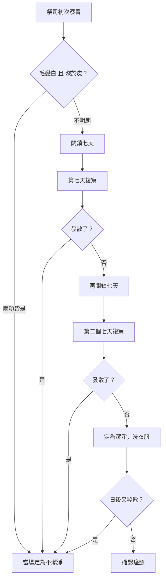

# 利未記 第13章

<!-- chapter-navigation:start -->
| [前一章](../03%20利未記/第12章.md) | [回目錄](../03%20利未記/全書目錄及綱要.md) | [下一章](../03%20利未記/第14章.md) |
| :--- | :---: | ---: |
<!-- chapter-navigation:end -->

1. 耶和華曉諭[[摩西]]、亞倫說：
2. 人的肉皮上若長了癤子，或長了癬，或長了火斑，在他肉皮上成了[[大痲瘋（sara'at）|大痲瘋]]的災病，就要將他帶到[[亞倫和他兒子（祭司）|祭司]]亞倫或亞倫作祭司的一個子孫面前。
3. [[亞倫和他兒子（祭司）|祭司]]要察看肉皮上的災病，若災病處的毛已經變白，災病的現象深於肉上的皮，這便是[[大痲瘋（sara'at）|大痲瘋]]的災病。祭司要察看他，定他為不潔淨。
4. 若火斑在他肉皮上是白的，現象不深於皮，其上的毛也沒有變白，[[亞倫和他兒子（祭司）|祭司]]就要將有災病的人關鎖七天。
5. 第七天，[[亞倫和他兒子（祭司）|祭司]]要察看他，若看災病止住了，沒有在皮上發散，祭司還要將他關鎖七天。
6. 第七天，[[亞倫和他兒子（祭司）|祭司]]要再察看他，若災病發暗，而且沒有在皮上發散，祭司要定他為潔淨，原來是癬；那人就要洗衣服，得為潔淨。
7. 但他為得潔淨，將身體給[[亞倫和他兒子（祭司）|祭司]]察看以後，癬若在皮上發散開了，他要再將身體給祭司察看。
8. [[亞倫和他兒子（祭司）|祭司]]要察看，癬若在皮上發散，就要定他為不潔淨，是[[大痲瘋（sara'at）|大痲瘋]]。
9. 人有了[[大痲瘋（sara'at）|大痲瘋]]的災病，就要將他帶到[[亞倫和他兒子（祭司）|祭司]]面前。
10. [[亞倫和他兒子（祭司）|祭司]]要察看，皮上若長了白癤，使毛變白，在長白癤之處有了紅瘀肉，
11. 這是肉皮上的舊[[大痲瘋（sara'at）|大痲瘋]]，[[亞倫和他兒子（祭司）|祭司]]要定他為不潔淨，不用將他關鎖，因為他是不潔淨了。
12. [[大痲瘋（sara'at）|大痲瘋]]若在皮上四外發散，長滿了患災病人的皮，據[[亞倫和他兒子（祭司）|祭司]]察看，從頭到腳無處不有，
13. [[亞倫和他兒子（祭司）|祭司]]就要察看，全身的肉若長滿了[[大痲瘋（sara'at）|大痲瘋]]，就要定那患災病的為潔淨；全身都變為白，他乃潔淨了。
14. 但紅肉幾時顯在他的身上就幾時不潔淨。
15. [[亞倫和他兒子（祭司）|祭司]]一看那紅肉就定他為不潔淨。紅肉本是不潔淨，是[[大痲瘋（sara'at）|大痲瘋]]。
16. 紅肉若復原，又變白了，他就要來見[[亞倫和他兒子（祭司）|祭司]]。
17. [[亞倫和他兒子（祭司）|祭司]]要察看，災病處若變白了，祭司就要定那患災病的為潔淨，他乃潔淨了。
18. 人若在皮肉上長瘡，卻治好了，
19. 在長瘡之處又起了白癤，或是白中帶紅的火斑，就要給[[亞倫和他兒子（祭司）|祭司]]察看。
20. [[亞倫和他兒子（祭司）|祭司]]要察看，若現象窪於皮，其上的毛也變白了，就要定他為不潔淨，是[[大痲瘋（sara'at）|大痲瘋]]的災病發在瘡中。
21. [[亞倫和他兒子（祭司）|祭司]]若察看，其上沒有白毛，也沒有窪於皮，乃是發暗，就要將他關鎖七天。
22. 若在皮上發散開了，[[亞倫和他兒子（祭司）|祭司]]就要定他為不潔淨，是災病。
23. 火斑若在原處止住，沒有發散，便是瘡的痕跡，[[亞倫和他兒子（祭司）|祭司]]就要定他為潔淨。
24. 人的皮肉上若起了火毒，火毒的瘀肉成了火斑，或是白中帶紅的，或是全白的，
25. [[亞倫和他兒子（祭司）|祭司]]就要察看，火斑中的毛若變白了，現象又深於皮，是[[大痲瘋（sara'at）|大痲瘋]]在火毒中發出，就要定他為不潔淨，是大痲瘋的災病。
26. 但是[[亞倫和他兒子（祭司）|祭司]]察看，在火斑中若沒有白毛，也沒有窪於皮，乃是發暗，就要將他關鎖七天。
27. 到第七天，[[亞倫和他兒子（祭司）|祭司]]要察看他，火斑若在皮上發散開了，就要定他為不潔淨，是[[大痲瘋（sara'at）|大痲瘋]]的災病。
28. 火斑若在原處止住，沒有在皮上發散，乃是發暗，是起的火毒，[[亞倫和他兒子（祭司）|祭司]]要定他為潔淨，不過是火毒的痕跡。
29. 無論男女，若在頭上有災病，或是男人鬍鬚上有災病，
30. [[亞倫和他兒子（祭司）|祭司]]就要察看；這災病現象若深於皮，其間有細黃毛，就要定他為不潔淨，這是頭疥，是頭上或是鬍鬚上的[[大痲瘋（sara'at）|大痲瘋]]。
31. [[亞倫和他兒子（祭司）|祭司]]若察看頭疥的災病，現象不深於皮，其間也沒有黑毛，就要將長頭疥災病的關鎖七天。
32. 第七天，[[亞倫和他兒子（祭司）|祭司]]要察看災病，若頭疥沒有發散，其間也沒有黃毛，頭疥的現象不深於皮，
33. 那人就要剃去鬚髮，但他不可剃頭疥之處。[[亞倫和他兒子（祭司）|祭司]]要將那長頭疥的，再關鎖七天。
34. 第七天，[[亞倫和他兒子（祭司）|祭司]]要察看頭疥，頭疥若沒有在皮上發散，現象也不深於皮，就要定他為潔淨，他要洗衣服，便成為潔淨。
35. 但他得潔淨以後，頭疥若在皮上發散開了，
36. [[亞倫和他兒子（祭司）|祭司]]就要察看他。頭疥若在皮上發散，就不必找那黃毛，他是不潔淨了。
37. [[亞倫和他兒子（祭司）|祭司]]若看頭疥已經止住，其間也長了黑毛，頭疥已然痊癒，那人是潔淨了，就要定他為潔淨。
38. 無論男女，皮肉上若起了火斑，就是白火斑，
39. [[亞倫和他兒子（祭司）|祭司]]就要察看，他們肉皮上的火斑若白中帶黑，這是皮上發出的白癬，那人是潔淨了。
40. 人頭上的髮若掉了，他不過是頭禿，還是潔淨。
41. 他頂前若掉了頭髮，他不過是頂門禿，還是潔淨。
42. 頭禿處或是頂門禿處若有白中帶紅的災病，這就是[[大痲瘋（sara'at）|大痲瘋]]發在他頭禿處或是頂門禿處，
43. [[亞倫和他兒子（祭司）|祭司]]就要察看，他起的那災病若在頭禿處或是頂門禿處有白中帶紅的，像肉皮上[[大痲瘋（sara'at）|大痲瘋]]的現象，
44. 那人就是長[[大痲瘋（sara'at）|大痲瘋]]，不潔淨的，[[亞倫和他兒子（祭司）|祭司]]總要定他為不潔淨，他的災病是在頭上。
45. 身上有長[[大痲瘋（sara'at）|大痲瘋]]災病的，他的衣服要撕裂，也要蓬頭散髮，蒙著上唇，喊叫說：不潔淨了！不潔淨了！
46. 災病在他身上的日子，他便是不潔淨；他既是不潔淨，就要[[患痲瘋者的哀悼記號（獨居營外）|獨居營外]]。
47. [[衣服皮子的黴斑條例|染了大痲瘋災病的衣服]]，無論是羊毛衣服、是麻布衣服，
48. 無論是在經上、在緯上，是麻布的、是羊毛的，是在皮子上，或在皮子做的什麼物件上，
49. 或在衣服上、皮子上，經上、緯上，或在皮子做的什麼物件上，這災病若是發綠，或是發紅，是[[大痲瘋（sara'at）|大痲瘋]]的災病，要給[[亞倫和他兒子（祭司）|祭司]]察看。
50. [[亞倫和他兒子（祭司）|祭司]]就要察看那災病，把染了災病的物件關鎖七天。
51. 第七天，他要察看那災病，災病或在衣服上，經上、緯上，皮子上，若發散，這皮子無論當作何用，這災病是蠶食的[[大痲瘋（sara'at）|大痲瘋]]，都是不潔淨了。
52. 那染了災病的衣服，或是經上、緯上，羊毛上，麻衣上，或是皮子做的什麼物件上，他都要焚燒；因為這是蠶食的[[大痲瘋（sara'at）|大痲瘋]]，必在火中焚燒。
53. [[亞倫和他兒子（祭司）|祭司]]要察看，若災病在衣服上，經上、緯上，或是皮子做的什麼物件上，沒有發散，
54. [[亞倫和他兒子（祭司）|祭司]]就要吩咐他們，把染了災病的物件洗了，再關鎖七天。
55. 洗過以後，[[亞倫和他兒子（祭司）|祭司]]要察看，那物件若沒有變色，災病也沒有消散，那物件就不潔淨，是透重的災病，無論正面反面，都要在火中焚燒。
56. 洗過以後，[[亞倫和他兒子（祭司）|祭司]]要察看，若見那災病發暗，他就要把那災病從衣服上、皮子上、經上、緯上，都撕去。
57. 若仍現在衣服上，或是經上、緯上、皮子做的什麼物件上，這就是災病又發了、必用火焚燒那染災病的物件。
58. 所洗的衣服，或是經，或是緯，或是皮子做的什麼物件，若災病離開了，要再洗，就潔淨了。
59. 這就是[[大痲瘋（sara'at）|大痲瘋]]災病的條例，無論是在羊毛衣服上，麻布衣服上，經上、緯上，和皮子做的什麼物件上，可以定為潔淨或是不潔淨。

---

## 本章知識節點

### 人物
- [[摩西]]
- [[亞倫和他兒子（祭司）]]
- [[米利暗]]

### 神學
- [[手長大痲瘋的神蹟]]
- [[潔淨與不潔淨]]
- [[禮儀不潔與道德罪的分別]]

### 原文
- [[大痲瘋（sara'at）]]

### 主題
- [[患痲瘋者的哀悼記號（獨居營外）]]
- [[衣服皮子的黴斑條例]]

### 解經爭議
- [[大痲瘋是否等同於罪的懲罰之爭]]

### 背景
- [[古代近東的皮膚病與黴斑觀念]]

---

## 本章整理

### 這一章到底在判什麼（v1-8）

本章由[[摩西]]與[[亞倫和他兒子（祭司）|亞倫]]一同領受（v1）。BH 指出這個組合本身有意義：摩西是領受律法的先知與立法者，亞倫是負責執行的大祭司，而接下來的條例正好落在祭司的職責上。事實上摩西在第1節之後幾乎不再出現，全章五十九節反覆出現的只有一句話——「祭司要察看」。

要察看什麼？經文列了三個起始症狀：癤子、癬、火斑。STEP 語言資料顯示這三個詞分別是 שְׂאֵת（H7613，逐字解作 a swelling，腫起）、סַפַּחַת（H5597，flaking skin，脫屑的皮膚）、בַהֶרֶת（H934，a bright spot，發亮的斑點）；而「[[大痲瘋（sara'at）|大痲瘋]]」是 צָרָעַת（H6883，a serious skin disease），「災病」則是另一個字 נֶגַע（H5061），v2 把兩者合起來寫成「大痲瘋的災病」。診斷的兩個指標是毛有沒有變白、患處是不是深於皮（v3）。GT《串珠聖經註釋》解釋了「毛變白」為什麼只是可疑而不是確診：「由於皮膚病是不會使毛的色澤改變，『毛變白』可能是指皮膚因乾燥而皮鱗脫落，黏貼在毛上，毛看來好像變了白色。」

兩項都符合就當場定為不潔淨；只有其中一項或都不明顯，就「關鎖七天」——STEP 顯示這是 סָגַר（H5462）的使役形，逐字解作 he will shut up。第七天再看，還不明朗就再關七天。KC 把這種慢說成刻意的：「調查必須在完全的安靜中進行：兩個七天。若還沒有清楚，我們就得等，每一次都等滿一整段時間。」

這份權柄之所以要慢，是因為它可能出兩種錯，而且兩種都嚴重。GT 丁良才把話講到底：若讓該趕到營外的人仍與會眾同住，「就與神的聖潔不合」；從會眾中若趕出不該出去的人，「就與神的公義和恩典不合」。KC 從另一頭說同一件事：如果那人其實沒有痲瘋，把他趕出營外是一件大罪。

```mermaid
flowchart TD
    A["祭司初次察看"] --> B{"毛變白 且 深於皮？"}
    B -->|"兩項皆是"| C["當場定為不潔淨"]
    B -->|"不明朗"| D["關鎖七天"]
    D --> E["第七天複察"]
    E --> F{"發散了？"}
    F -->|"是"| C
    F -->|"否"| G["再關鎖七天"]
    G --> H["第二個七天複察"]
    H --> I{"發散了？"}
    I -->|"是"| C
    I -->|"否"| J["定為潔淨，洗衣服"]
    J --> K{"日後又發散？"}
    K -->|"是"| C
    K -->|"否"| L["確認痊癒"]
```

GT《串珠聖經註釋》把全章 v1-46 整理成五套檢驗法，每一套處理一種起因：

| 檢驗法 | 經節 | 看什麼 |
|---|---|---|
| 第一套 | v2-8 | 患病處的毛是否變白、患處是否陷入皮膚以下；懷疑就隔離七日或十四日 |
| 第二套 | v9-17 | 患病處是否皮毛變白及長出紅肉 |
| 第三套 | v18-28 | 與皮膚上的疤痕有關（長瘡、火毒），原則與第一套相同 |
| 第四套 | v29-37 | 頭上及鬍鬚上的病：看是否陷入皮層以下及長出細黃毛；第一週後要剃去患處以外的鬚髮 |
| 第五套 | v40-44 | 與禿頭有關；禿頭本身並非不潔淨，但禿頭也會患上嚴重皮膚病 |

### 舊病、全身變白與紅肉（v9-17）

舊病復發的情形不必再關鎖：皮上長白癤、毛變白、又有紅瘀肉，病症已經明確（v9-11）。GT《串珠》說明理由：「毛變白及有紅肉是慢性嚴重皮膚病的明顯病徵，故不用檢疫期。」

本段最違反直覺的是 v12-13：大痲瘋若擴散到全身、從頭到腳無處不有，「全身都變為白」，祭司反倒要定他為**潔淨**。CT 的話中之光給了一個很直接的讀法：「如果大痲瘋發透的話反而定為潔淨。為什麼？基本上講到這個人已經完全徹底的知罪了……他真是覺得自己完全徹底完全的敗壞，因為這樣子的人反而在主面前會降卑。」KC 的說法相近：「凡完全被綁在其中的人，凡從頭到腳都長了痲瘋、又肯去見祭司的，就被宣告為潔淨。已經沒有什麼還能變成痲瘋的了。」GT《聖經精讀本》給的則是醫學面的解釋：「人內部的病毒完全發散到外邊,反而被判明為潔淨。因為其患處已經結痂,痂脫落時,大麻風就完全痊癒。」

但只要有一點紅肉顯露，就仍是不潔淨（v14-15）；紅肉若復原變白，再定為潔淨（v16-17）。KC 用這一點對照上一段：完全承認的人得潔淨，還留著紅肉的人不得潔淨——他舉法老、巴蘭、掃羅為例，這些人都說過「我犯罪了」，卻仍繼續服事罪。

### 瘡、火毒、頭疥與禿頭（v18-44）

皮肉上長瘡治好後原處又起白癤或火斑（v18-23），以及燒傷留下的火毒起了火斑（v24-28），都照同一套判準處理。GT 丁良才把 v18-23 的流程整理成五個層次：先由祭司察看；若現象窪於皮、毛也變白，定為不潔淨；若沒有白毛也不窪於皮、只是發暗，關鎖七天；第七天若發散了，定為不潔；若沒有白毛、現象也不窪於皮、火斑在原處沒有發散，就定為潔淨。

頭上與鬍鬚上的災病叫「頭疥」，判準換成「是否深於皮」與「有沒有細黃毛」（v29-30）。這裡出現一個註釋家之間的小爭論，GT《聖經精讀本》記了下來：「Keil認為『黑毛』可以翻譯成『黃毛』,但Lange反駁道:『如果皮膚病是皮癬而不是疥(大麻風),患處的毛會脫掉。經文提到黑毛,證明並沒有得大麻風。』」BH 從症狀學的角度補充，黃而細的毛「可能指向牛皮癬或黴菌感染這類情形」。v33 要患者剃去患處以外的鬚髮，精讀本說明用意很實際：剃掉黑毛是「為了比較患處和其他地方鬚髮的顏色」。

禿頭一段（v40-44）先立了一條寬鬆的規矩：頭髮自然掉光，無論頂禿或前額禿，都是潔淨的。這句話在當時並非理所當然——丁良才指出「以色列人以頭禿為羞，有時他們也以為頭禿是出於神的刑罰（王下二23，賽三17，耶四十八37）」，經文卻明說那不過是頭禿。原文在這裡用了兩個不同的字，GT《聖經精讀本》說：「根據原文頭禿有兩種:一種是『卡拉哈特』,指掉頭頂的頭髮(40節);另一種是『嘎巴哈特』,指掉了前部頭髮(41節)。」STEP 語言資料確認確實是兩個字：v40 用形容詞 קֵרֵחַ（H7142，逐字解作 bald），v41 用 גִּבֵּחַ（H1371）；它們的名詞形 קָרַחַת（H7146，bald spot）與 גַּבַּחַת（H1372，bald forehead）則出現在 v42 的「頭禿處」與「頂門禿處」。同樣寬鬆的還有 v38-39 的白癬：火斑若白中帶黑，那人是潔淨的——BH 指出這種情形今天可能會被診斷為白斑症（vitiligo）。

但禿頭處若出現白中帶紅的災病，仍要定為不潔淨，而且 v44 的語氣特別重。KC 解釋為什麼：「頭上的痲瘋代表擁有自己的想法，是把神的事交給人的頭腦去論斷，是理智的驕傲」，所以「祭司總要定他為不潔淨」用的是加重的說法。

### 患者的喪服與獨居營外（v45-46）

確診的人要做四件事，[[患痲瘋者的哀悼記號（獨居營外）|每一件都是喪禮的動作]]：撕裂衣服、蓬頭散髮、蒙著上唇、喊叫「不潔淨了！不潔淨了！」。GT 丁良才說撕裂衣服「是表示憂傷自卑的心」，撕裂衣服與蓬頭散髮「乃是弔喪的標號」，蒙著上唇「這也是弔喪的標號（結二十四17、22，彌三7）」，並記下一句猶太俗語：稱長大痲瘋的人為「行走的墳墓」。

STEP 語言資料在這裡提供了一個很硬的佐證：v45 的「撕裂」是 פָּרַם（H6533），「蓬頭散髮」是 פָּרַע（H6544B）——而利10:6 神吩咐亞倫和他兒子「不可蓬頭散髮，也不可撕裂衣裳」，用的正是同樣這兩個字。祭司被禁止做的哀悼動作，痲瘋患者卻被命令要做。「上唇」是 שָׂפָם（H8222，逐字解作 a moustache），KC 說明蒙住它的意思是「再也說不出任何榮耀神的話；這樣的人唯一能宣告的，就是自己的不潔」。

[[古代近東的皮膚病與黴斑觀念|GT《舊約聖經背景註釋》]]把這身打扮放回當時的想像裡：這表示這人是個守喪者，而「按照當時迷信的看法，守喪者這種打扮能夠保護他免受盤旋於死人之上的邪惡力量所影響」；他的喊叫警告人不可接近，「因為普遍信念以為他口中的氣也能玷污人」。GT《串珠》則說明營外是什麼地方：「營外的地方是遠離神的地方，也是罪人及不潔淨的人被放逐之處……以及罪犯被處決的地方。」BH 由此接到來13:12-13——耶穌在城門外受苦，與痲瘋病人被隔在營外相對應。

丁良才另記下一個常被略過的例外：「按猶太人的風俗，長大麻風的婦女，不必撕裂衣服。」

### 衣服上的災病（v47-59）

最後十三節換了對象：羊毛、麻布、經線、緯線、皮子與皮製品上發綠或發紅的[[衣服皮子的黴斑條例|黴斑]]，經文用的是同一個字。GT 賈斯樂郝威《聖經難解經文詮釋手冊》把常見的疑惑挑明：痲瘋病是特定病菌造成的，不會感染沒有生命的衣物，聖經這樣寫是不是弄錯了？他的答案是名詞混淆——這個希伯來字「其實是一種對任何嚴重的皮膚疾患或皮膚感染，或無生命物質遭到污染的通稱」，衣物與房屋的情形「可能是由於黴菌發黴(fungus or mold)所造成的」。GT 艾基斯《舊約聖經難題彙編》講得更細：這是「會損害紡織品、皮革或毛皮的真菌及黴菌，在表面看來，這些菌類與人類皮膚病的病徵頗相似」。GT《啟導本》直接說那是「羊毛或麻布衣服的惡性發黴現象，因為經線與緯線上出現綠色或紅色的黴」。

處理程序是察看、隔離七天、複察，發散就焚燒；沒發散就洗滌後再隔離七天；洗過仍不改就整件燒掉；若已發暗就把患處撕去，撕去後別處再現仍要整件燒掉。GT《串珠》指出這種分段設計是有理由的：「這樣做顯然是為了保全百姓所擁有的財產，如果整件衣服都要毀滅，對窮苦百姓來說，就會產生經濟上嚴重的困難。」

兩個關鍵詞在原文是不同的字。STEP 語言資料顯示 v51-52 的「蠶食的」是 מַמְאֶרֶת（H3992，詞條原形 מָאַר），逐字解作 malignant；v55 的「透重的」則是 פְּחֶתֶת（H6356），簡要辭典作 eating。註釋家給的中文也各有側重：CT〔原文字義〕註「蠶食的」是「使疼痛，刺痛」、「透重」是「侵蝕，孔」；GT《串珠》把「蠶食」解作穿孔之意，「比喻病毒不僅侵蝕表面，而且腐蝕及滲入裡面」。

丁良才在本段末尾指出一件容易錯過的事：人與房屋都有潔淨的禮儀（利14:1-32、48-53），衣物卻沒有——「神沒有定什麼禮節使染大痲瘋的衣服或物件得以潔淨……乃是只憑祭司將那衣服或對像定為潔淨或不潔淨就是了」。KC 則把衣服讀成一個人被別人看見的部分：「人是一個人裡面有什麼，衣服是別人從他身上看見什麼」，並引猶大書1:23「就是那被情慾沾染的衣服也當厭惡」。

### 這是什麼病，又是不是罪的懲罰

兩個問題常被混在一起，其實分屬不同層次，而本章的來源在兩個問題上都有真實分歧。

**第一個問題：這到底是什麼病。** GT《舊約聖經背景註釋》的說法最硬：「在古代近東，臨床痲瘋病（漢森氏病）要到亞歷山大大帝（Alexander the Great）時代，才有發生的記錄」，而且「漢森氏病最主要的病癥一個也沒有在經文中出現，反之所列的症狀卻顯示與漢森氏病無關。經文不把它形容為傳染性的病症。」照經文所記的描述，「現代醫學可以診斷為牛皮癬、濕疹、瘌痢、脂漏性皮膚炎，以及一系列的黴菌感染」；連「白如雪」的印象也被更正——「這病像『雪』的形容最可能是指它像雪花片片，不是指顏色（某些譯本中的『白』字是加上去的）」。艾基斯與賈斯樂郝威同樣主張這是統稱。CT 的說法則不同，他在 v2 註「狹義指皮膚像鱗片那樣剝落或無知覺，類似現代所謂的『漢森氏病(Hansen)』」。

==值得特別留意的是「傳染」這一點==：背景註釋明說經文沒有把它寫成傳染病，而 CT 與丁良才卻把傳染性當作本章最重要的特徵之一——CT 說大痲瘋「最大的特點是傳染的至深至廣」，丁良才把大痲瘋與罪的相似列成一張清單，稱為「可比罪惡有八層」（實際列到第九項「須出營外」），其中第六項正是「傳染別人」。這是本章來源之間一處真實的分歧，不宜壓平。

> [!note] 第二個問題：染病是不是犯了罪
> CT 的靈意註解把癤子、癬、火斑分別讀作高傲、不受約束、自滿，KC 把整章讀成罪在信徒身上爆發的圖畫。但 GT《聖經精讀本》在章首說：「聖經並沒有說大麻風是犯罪的結果。只是有時作為人犯罪的代價(民12:10-15)。很多人認為大麻風是罪的結果,這是從所有的病都是罪之代價的錯誤觀念而來。」BH 在 v46 也說本章的「不潔」指[[禮儀不潔與道德罪的分別|禮儀上的不潔狀態]]，不必然是道德上的罪。
> 分歧甚至出現在同一份來源裡：精讀本在 v3 又寫「判定大麻風不潔,因為大麻風破壞神創造人的原樣,是對罪審判的結果」；KC 也留了退路，說信徒所犯的每一件罪並不都是痲瘋。GT 丁良才則把兩面都說了——他舉[[米利暗]]（民12:15）、基哈西（王下5:7、27）、烏西雅王（王下15:5）為神刑罰的實例，又緊接著警告不可說一切長大痲瘋的人都是受了神的刑罰。詳見[[大痲瘋是否等同於罪的懲罰之爭]]。

這一整章從頭到尾只做一件事：把人和物分進[[潔淨與不潔淨]]兩邊，沒有一節說患者犯了什麼罪。而祭司能做的也只到宣告為止——KC 說得很清楚：「祭司不能醫治，他只能宣告潔淨。唯有神能醫治人。」這正好與[[手長大痲瘋的神蹟]]（出4:6-8）成對照：在何烈山，神在摩西自己手上示範了那個祭司做不到的動作——使痲瘋來，也使痲瘋去。丁良才從歷史面指出這有多罕見：除了藉神蹟得痊癒的以外，舊約再沒有一次記載長大痲瘋的人得了痊癒。

**參考資料**
https://www.ccbiblestudy.org/Old%20Testament/03Lev/03CT13.htm
https://www.ccbiblestudy.org/Old%20Testament/03Lev/03GT13.htm
https://www.kingcomments.com/en/bible-studies/Lev/13
https://biblehub.com/study/leviticus/13.htm
https://github.com/STEPBible/STEPBible-Data

<!-- chapter-navigation:start -->
| [前一章](../03%20利未記/第12章.md) | [回目錄](../03%20利未記/全書目錄及綱要.md) | [下一章](../03%20利未記/第14章.md) |
| :--- | :---: | ---: |
<!-- chapter-navigation:end -->
