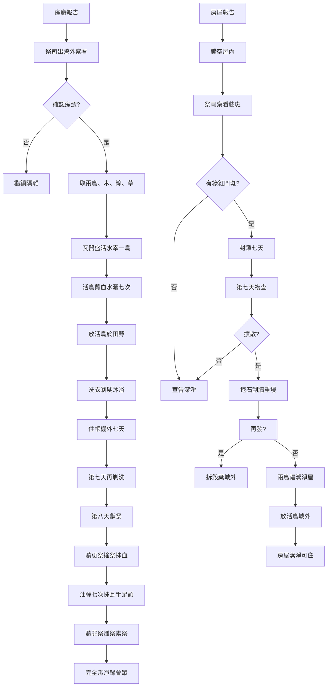

# 利未記 第14章

1. 耶和華曉諭[[摩西]]說：
2. [[大痲瘋得潔淨的條例（人）|長大痲瘋得潔淨的日子]]，其例乃是這樣：要帶他去見[[亞倫和他兒子（祭司）|祭司]]；
3. [[亞倫和他兒子（祭司）|祭司]]要出到營外察看，若見他的[[大痲瘋（tsara'at，皮膚病診斷條例）|大痲瘋]]痊癒了，
4. 就要吩咐人為那[[大痲瘋得潔淨的條例（人）|求潔淨]]的拿[[潔淨痲瘋者的兩鳥儀式|兩隻潔淨的活鳥]]和[[香柏木（潔淨儀式用）|香柏木]]、[[藍色、紫色、朱紅色線（tekhelet, argaman, tola'at shani）|朱紅色線]]，並[[牛膝草]]來。
5. [[亞倫和他兒子（祭司）|祭司]]要吩咐[[瓦器盛活水（潔淨儀式）|用瓦器盛活水]]，把[[潔淨痲瘋者的兩鳥儀式|一隻鳥宰在上面]]。
6. 至於那隻活鳥，[[亞倫和他兒子（祭司）|祭司]]要把他和[[香柏木（潔淨儀式用）|香柏木]]、[[藍色、紫色、朱紅色線（tekhelet, argaman, tola'at shani）|朱紅色線]]並[[牛膝草]]一同蘸於宰在活水上的鳥血中，
7. 用以在那長[[大痲瘋（tsara'at，皮膚病診斷條例）|大痲瘋]][[大痲瘋得潔淨的條例（人）|求潔淨]]的人身上灑七次，就定他為潔淨，又把[[潔淨痲瘋者的兩鳥儀式|活鳥放在田野裡]]。
8. [[大痲瘋得潔淨的條例（人）|求潔淨]]的人當洗衣服，[[剃全身毛髮（潔淨禮）|剃去毛髮]]，用水洗澡，就潔淨了；然後可以進營，只是[[營外七天等候（潔淨禮）|要在自己的帳棚外居住七天]]。
9. 第七天，再[[剃全身毛髮（潔淨禮）|把頭上所有的頭髮與鬍鬚、眉毛，並全身的毛，都剃了]]；又要洗衣服，用水洗身，就潔淨了。
10. [[第八天獻祭（大痲瘋潔淨）|第八天]]，他要取兩隻沒有殘疾的公羊羔和一隻沒有殘疾、一歲的母羊羔，又要把[[伊法十分之三（大痲瘋潔淨素祭）|調油的細麵伊法十分之三]]為素祭，並[[一羅革油（log）|油一羅革]]，一同取來。
11. 行潔淨之禮的[[亞倫和他兒子（祭司）|祭司]]要將那[[大痲瘋得潔淨的條例（人）|求潔淨]]的人和這些東西安置在[[會幕門口]]、耶和華面前。
12. [[亞倫和他兒子（祭司）|祭司]]要取一隻公羊羔獻為[[贖愆祭（asham）|贖愆祭]]，和那[[一羅革油（log）|一羅革油]]一同作[[搖祭（tenufah）|搖祭]]，在耶和華面前搖一搖；
13. 把公羊羔宰於聖地，就是宰贖罪祭牲和燔祭牲之地。[[贖愆祭（asham）|贖愆祭]]要歸[[亞倫和他兒子（祭司）|祭司]]，與贖罪祭一樣，是至聖的。
14. [[亞倫和他兒子（祭司）|祭司]]要取些[[贖愆祭（asham）|贖愆祭]]牲的血，抹在[[大痲瘋得潔淨的條例（人）|求潔淨]]人的[[右耳垂右手大拇指右腳大拇指（抹血抹油潔淨禮）|右耳垂上]]和[[右耳垂右手大拇指右腳大拇指（抹血抹油潔淨禮）|右手的大拇指上]]，並[[右耳垂右手大拇指右腳大拇指（抹血抹油潔淨禮）|右腳的大拇指上]]。
15. [[亞倫和他兒子（祭司）|祭司]]要從那[[一羅革油（log）|一羅革油]]中取些倒在自己的左手掌裡，
16. 把右手的一個指頭蘸在左手的油裡，在耶和華面前[[彈油七次（潔淨禮）|用指頭彈七次]]。
17. 將手裡所剩的油抹在那[[大痲瘋得潔淨的條例（人）|求潔淨]]人的[[右耳垂右手大拇指右腳大拇指（抹血抹油潔淨禮）|右耳垂上]]和[[右耳垂右手大拇指右腳大拇指（抹血抹油潔淨禮）|右手的大拇指上]]，並[[右耳垂右手大拇指右腳大拇指（抹血抹油潔淨禮）|右腳的大拇指上]]，就是抹在[[贖愆祭（asham）|贖愆祭]]牲的血上。
18. [[亞倫和他兒子（祭司）|祭司]]手裡所剩的油要抹在那[[大痲瘋得潔淨的條例（人）|求潔淨]]人的頭上，在耶和華面前為他贖罪。
19. [[亞倫和他兒子（祭司）|祭司]]要獻贖罪祭，為那本不潔淨、[[大痲瘋得潔淨的條例（人）|求潔淨]]的人贖罪；然後要宰燔祭牲，
20. 把燔祭和素祭獻在壇上，為他贖罪，他就潔淨了。
21. [[貧窮人的潔淨條例（大痲瘋）|他若貧窮不能預備夠數]]，就要取一隻公羊羔作[[贖愆祭（asham）|贖愆祭]]，可以搖一搖，為他贖罪；也要把[[伊法十分之三（大痲瘋潔淨素祭）|調油的細麵伊法十分之一]]為素祭，和[[一羅革油（log）|油一羅革]]一同取來；
22. 又[[貧窮人的潔淨條例（大痲瘋）|照他的力量]]取兩隻斑鳩或是兩隻雛鴿，一隻作贖罪祭，一隻作燔祭。
23. [[第八天獻祭（大痲瘋潔淨）|第八天]]，要為潔淨，把這些帶到[[會幕門口]]、耶和華面前，交給[[亞倫和他兒子（祭司）|祭司]]。
24. [[亞倫和他兒子（祭司）|祭司]]要把[[贖愆祭（asham）|贖愆祭]]的羊羔和那[[一羅革油（log）|一羅革油]]一同作[[搖祭（tenufah）|搖祭]]，在耶和華面前搖一搖。
25. 要宰了[[贖愆祭（asham）|贖愆祭]]的羊羔，取些贖愆祭牲的血，抹在那[[大痲瘋得潔淨的條例（人）|求潔淨]]人的[[右耳垂右手大拇指右腳大拇指（抹血抹油潔淨禮）|右耳垂上]]和[[右耳垂右手大拇指右腳大拇指（抹血抹油潔淨禮）|右手的大拇指上]]，並[[右耳垂右手大拇指右腳大拇指（抹血抹油潔淨禮）|右腳的大拇指上]]。
26. [[亞倫和他兒子（祭司）|祭司]]要把些油倒在自己的左手掌裡，
27. 把左手裡的油，在耶和華面前，用右手的一個指頭彈七次，
28. 又把手裡的油抹些在那[[大痲瘋得潔淨的條例（人）|求潔淨]]人的[[右耳垂右手大拇指右腳大拇指（抹血抹油潔淨禮）|右耳垂上]]和[[右耳垂右手大拇指右腳大拇指（抹血抹油潔淨禮）|右手的大拇指上]]，並[[右耳垂右手大拇指右腳大拇指（抹血抹油潔淨禮）|右腳的大拇指上]]，就是抹[[贖愆祭（asham）|贖愆祭]]之血的原處。
29. [[亞倫和他兒子（祭司）|祭司]]手裡所剩的油要抹在那[[大痲瘋得潔淨的條例（人）|求潔淨]]人的頭上，在耶和華面前為他贖罪。
30. 那人又要[[貧窮人的潔淨條例（大痲瘋）|照他的力量]]獻上一隻斑鳩或是一隻雛鴿，
31. 就是他所能辦的，一隻為贖罪祭，一隻為燔祭，與素祭一同獻上；[[亞倫和他兒子（祭司）|祭司]]要在耶和華面前為他贖罪。
32. 這是那有[[大痲瘋（tsara'at，皮膚病診斷條例）|大痲瘋]]災病的人、[[貧窮人的潔淨條例（大痲瘋）|不能將關乎得潔淨之物預備夠數]]的條例。
33. 耶和華曉諭[[摩西]]、亞倫說：
34. 你們到了我賜給你們為業的迦南地，我若使你們所得為業之地的[[房屋大痲瘋的診斷與潔淨條例|房屋中有大痲瘋的災病]]，
35. 房主就要去告訴[[亞倫和他兒子（祭司）|祭司]]說：據我看，房屋中似乎有災病。
36. [[亞倫和他兒子（祭司）|祭司]]還沒有進去察看災病以前，就要吩咐人把房子騰空，免得房子裡所有的都成了不潔淨；然後祭司要進去察看房子。
37. 他要察看那災病，災病若在房子的牆上有發綠或發紅的凹斑紋，現象窪於牆，
38. [[亞倫和他兒子（祭司）|祭司]]就要出到房門外，把[[房屋大痲瘋的診斷與潔淨條例|房子封鎖七天]]。
39. 第七天，[[亞倫和他兒子（祭司）|祭司]]要再去察看，災病若在房子的牆上發散，
40. 就要吩咐人把那有災病的石頭挖出來，扔在[[城外不潔淨之處]]；
41. 也要叫人刮房內的四圍，所刮掉的灰泥要倒在[[城外不潔淨之處]]；
42. 又要用別的石頭代替那挖出來的石頭，要另用灰泥墁房子。
43. 他挖出石頭，刮了房子，墁了以後，災病若在房子裡又發現，
44. [[亞倫和他兒子（祭司）|祭司]]就要進去察看，災病若在房子裡發散，這就是房內[[房屋大痲瘋的診斷與潔淨條例|蠶食的大痲瘋]]，是不潔淨。
45. 他就要[[房屋大痲瘋的診斷與潔淨條例|拆毀房子]]，把石頭、木頭、灰泥都搬到[[城外不潔淨之處]]。
46. 在房子封鎖的時候，進去的人必不潔淨到晚上；
47. 在房子裡躺著的必洗衣服；在房子裡吃飯的也必洗衣服。
48. 房子墁了以後，[[亞倫和他兒子（祭司）|祭司]]若進去察看，見災病在房內沒有發散，就要定房子為潔淨，因為災病已經消除。
49. 要為[[房屋大痲瘋的診斷與潔淨條例|潔淨房子]]取兩隻鳥和[[香柏木（潔淨儀式用）|香柏木]]、[[藍色、紫色、朱紅色線（tekhelet, argaman, tola'at shani）|朱紅色線]]並[[牛膝草]]，
50. [[瓦器盛活水（潔淨儀式）|用瓦器盛活水]]，把一隻鳥宰在上面，
51. 把[[香柏木（潔淨儀式用）|香柏木]]、[[牛膝草]]、[[藍色、紫色、朱紅色線（tekhelet, argaman, tola'at shani）|朱紅色線]]，並那活鳥，都蘸在被宰的鳥血中與[[活水（潔淨儀式用）|活水]]中，用以灑房子七次。
52. 要用鳥血、[[活水（潔淨儀式用）|活水]]、活鳥、[[香柏木（潔淨儀式用）|香柏木]]、[[牛膝草]]，並[[藍色、紫色、朱紅色線（tekhelet, argaman, tola'at shani）|朱紅色線]]，潔淨那房子。
53. 但要把活鳥放在[[城外不潔淨之處|城外田野裡]]。這樣[[房屋大痲瘋的診斷與潔淨條例|潔淨房子]]（原文是為房子贖罪），房子就潔淨了。
54. [[大痲瘋條例總結（利13-14）|這是為各類大痲瘋的災病]]和頭疥，
55. 並衣服與房子的[[大痲瘋（tsara'at，皮膚病診斷條例）|大痲瘋]]，
56. 以及癤子、癬、火斑所立的條例，
57. [[大痲瘋條例總結（利13-14）|指明何時為潔淨，何時為不潔淨]]。[[大痲瘋條例總結（利13-14）|這是大痲瘋的條例]]。

---

## 本章知識節點

### 主題
- [[大痲瘋得潔淨的條例（人）]]
- [[房屋大痲瘋的診斷與潔淨條例]]
- [[大痲瘋條例總結（利13-14）]]
- [[潔淨痲瘋者的兩鳥儀式]]
- [[剃全身毛髮（潔淨禮）]]
- [[彈油七次（潔淨禮）]]
- [[右耳垂右手大拇指右腳大拇指（抹血抹油潔淨禮）]]
- [[營外七天等候（潔淨禮）]]
- [[第八天獻祭（大痲瘋潔淨）]]
- [[貧窮人的潔淨條例（大痲瘋）]]

### 事件
- [[潔淨痲瘋者的兩鳥儀式]]
- [[第八天獻祭（大痲瘋潔淨）]]

### 互文
- [[出29：20|出29：20 承接聖職抹血耳手足]]
- [[承接聖職（分別為聖）]]

### 人物
- [[摩西]]
- [[亞倫和他兒子（祭司）]]

### 原文
- [[一羅革油（log）]]
- [[伊法十分之三（大痲瘋潔淨素祭）]]
- [[活水（潔淨儀式用）]]
- [[瓦器盛活水（潔淨儀式）]]
- [[香柏木（潔淨儀式用）]]
- [[牛膝草]]
- [[藍色、紫色、朱紅色線（tekhelet, argaman, tola'at shani）]]

### 地點
- [[會幕門口]]
- [[城外不潔淨之處]]

### 文化
- [[沒有殘疾的祭牲]]
- [[至聖的供物（聖與至聖之分）]]

### 神學
- [[贖愆祭（asham）]]
- [[搖祭（tenufah）]]
- [[大痲瘋（tsara'at，皮膚病診斷條例）]]

### 解經爭議
- [[大痲瘋是否等同於罪的懲罰之爭]]

---

## 本章整理

### 痲瘋痊癒者的潔淨禮儀（v1-32）

利未記第14章前半段（v1-32）詳細規範[[大痲瘋（tsara'at，皮膚病診斷條例）|大痲瘋]]痊癒者如何重返會眾。整個過程分兩階段：**營外初步潔淨**（v2-9）與 **會幕門口完全潔淨**（v10-32），中間隔七天，第八天獻祭完成。這結構呼應《利未記》「潔淨—聖潔—完全」的遞進邏輯，也預表基督「因我們的過犯被交出，因我們稱義復活」（羅4:25）的雙重工作。

#### 營外儀式：兩鳥、活水、七灑、放飛（v2-7）
祭司出到營外察看（v3），確認痊癒後，吩咐取 **兩隻潔淨活鳥**、**[[香柏木（潔淨儀式用）|香柏木]]**、**[[藍色、紫色、朱紅色線（tekhelet, argaman, tola'at shani）|朱紅色線]]**、**[[牛膝草]]**（v4）。這四樣物品在古代近東淨化禮中常見，但以色列賦予獨特神學意義：CT 指出「兩鳥表徵死而復活的基督；香柏木與牛膝草對比高大與卑微，象徵整個世界（王上4:33）；朱紅色線表徵罪惡（賽1:18）」。祭司用 **[[瓦器盛活水（潔淨儀式）|瓦器盛活水]]**，宰一鳥於水上（v5），將活鳥與木、草、線蘸血水，灑在求潔淨者身上七次（v7），宣告潔淨，再放活鳥於田野。BH 強調「瓦器表徵道成肉身的基督（林後4:7），[[活水（潔淨儀式用）|活水]]象徵聖靈生命（約7:38），血水混合預表十字架流出的血水（約19:34）」。七次灑血表徵完全潔淨；KC引羅8:1-2：「賜生命聖靈的律，在基督耶穌裡釋放了我，使我脫離罪和死的律了」，說明放飛活鳥象徵基督復活生命的釋放。

#### 過渡期：洗剃浸、住帳棚外七天（v8-9）
求潔淨者須洗衣、[[剃全身毛髮（潔淨禮）|剃全身毛髮]]、沐浴（v8），第七天再剃一次並洗衣沐浴（v9）。GT《舊約背景註釋》說明剃髮無象徵意義，純為衛生與確認皮膚復原；但 CT 靈意解經視為「對付肉體一切天然屬性：頭髮表徵驕傲、鬍鬚表徵自尊、眉毛表徵天然美麗、全身毛表徵天然能力」。此期間人可進營卻住帳棚外（v8），防止夫妻同房，象徵雖已蒙恩仍須徹底對付舊習慣。這階段稱為[[營外七天等候（潔淨禮）|營外七天等候]]。

#### 第八天獻祭：贖愆祭、贖罪祭、燔祭、素祭（v10-20）
第八天帶兩隻公羊羔、一隻母羊羔、**[[伊法十分之三（大痲瘋潔淨素祭）|伊法十分之三細麵調油為素祭]]**、**[[一羅革油（log）|一羅革油]]**（v10）。祭司先獻一公羊羔為 **[[贖愆祭（asham）|贖愆祭]]** 並作 **[[搖祭（tenufah）|搖祭]]**，同搖一羅革油（v12）。贖愆祭牲宰於聖地，血抹在求潔淨者[[右耳垂右手大拇指右腳大拇指（抹血抹油潔淨禮）|右耳垂、右手大拇指、右腳大拇指]]（v14），油倒左掌，右指蘸油在耶和華面前 **[[彈油七次（潔淨禮）|彈七次]]**（v16），餘油抹同三處（v17），最後抹頭（v18）。隨後獻贖罪祭、燔祭、素祭（v19-20），完成潔淨。此儀式稱為[[第八天獻祭（大痲瘋潔淨）|第八天獻祭]]。

此儀式極富神學張力：贖愆祭處理「得罪神的行為」（罪行），贖罪祭處理「罪性」；血先於油，表徵「寶血是聖靈工作的基礎」（CT）。抹血抹油於耳、手、足，KC 指出「耳聽神話、手作神工、腳行神路」；CT：先抹血後抹油，「基督的寶血既然潔淨了我們，聖靈的印記就把我們分別出來，顯明我們是屬神的」。搖祭活羊羔（v12）獨特於此，KC 說明「活搖表徵基督復活生命呈獻於神」。值得注意的是，祭司將求潔淨者安置在[[會幕門口]]（v11），贖愆祭牲屬[[至聖的供物（聖與至聖之分）|至聖物]]（v13），祭牲必須是[[沒有殘疾的祭牲|沒有殘疾的]]（v10）。

#### 貧窮人條例：神的體恤與公平（v21-32）
若力不足，可減為一公羊羔贖愆祭、**伊法十分之一素祭**、一羅革油，兩斑鳩雛鴿分作贖罪祭與燔祭（v21-22）。贖愆祭不可減，KC 強調「贖愆祭表徵恢復選民特權，不可替代」。其餘程序同前：抹血、彈油、抹油、獻祭（v24-31）。GT《聖經精讀本》指出「神看獻祭之人的心，而不是看祭物大小、量與質」，體現神對窮人的憐憫。這稱為[[貧窮人的潔淨條例（大痲瘋）|貧窮人條例]]。

| 項目 | 正常條例（v10-20） | 貧窮條例（v21-32） |
|------|-------------------|-------------------|
| 贖愆祭 | 兩公羊羔（一搖祭） | 一公羊羔（必搖祭） |
| 贖罪祭 | 一母羊羔 | 一斑鳩或雛鴿 |
| 燔祭 | 一公羊羔 | 一斑鳩或雛鴿 |
| 素祭 | 伊法十分之三細麵 | 伊法十分之一細麵 |
| 油 | 一羅革 | 一羅革（同） |

### 房屋痲瘋的診斷與潔淨（v33-53）

下半章（v33-53）轉向迦南地房屋發生「痲瘋災病」（黴菌鹽漬），程序與人身痲瘋平行：祭司察看→封鎖七天→複查→挖石刮牆重墁→若復發拆毀→若痊癒行兩鳥禮潔淨。這不僅是衛生條例，更具教會論預表。整體稱為[[房屋大痲瘋的診斷與潔淨條例|房屋大痲瘋條例]]。

#### 診斷流程：從報告到封鎖（v33-38）
房主報告（v35），祭司先騰空屋內物品免染不潔（v36），察看牆上有無綠紅凹斑、窪於牆（v37），若有則封鎖七天（v38）。CT 靈意：「房屋表徵教會，災病表徵明顯罪惡；騰空表徵信徒與犯罪者隔絕；封鎖表徵教會不接納有問題新人」。

#### 處理升級：挖石、刮牆、重墁、拆毀（v39-47）
第七天複查，若擴散（v39），挖出患石棄[[城外不潔淨之處]]（v40），刮牆灰泥同棄（v41），換新石新泥重墁（v42）。若再發（v43-44），認定為「蠶食的大痲瘋」，拆毀全屋材料棄城外（v45）。封鎖期間進屋者不潔至晚上（v46），臥食者必洗衣（v47）。KC 將此應用於地方教會：「石頭表徵信徒（彼前2:5），若在其中發現罪就當受管教；正如石頭可被拆除，活在罪中的人也必須從地方教會中除去（林前5:13b）」。

#### 房屋潔淨禮：簡化版兩鳥儀式（v48-53）
若重墁後無擴散（v48），祭司取兩鳥、香柏木、朱紅線、牛膝草，瓦器盛活水宰一鳥（v49-50），蘸血水灑屋七次（v51），用血、水、活鳥、木、草、線潔淨屋（v52），放活鳥於城外田野（v53）。儀式與人身潔淨同源，但無第八天獻祭，因房屋不直接與神相交。BH 指出「古近東胡利人、巴比倫人也有類似鳥禮，但以色列去除法術成分，純為聖潔教導」。這儀式即[[潔淨痲瘋者的兩鳥儀式|兩鳥儀式]]的房屋版本。

### 條例總結與跨章神學脈絡（v54-57）

v54-57 總結利未記13-14章：涵蓋各類痲瘋災病、頭疥、衣服與房屋痲瘋、癤子癬火斑，指明何時潔淨何時不潔淨。這不只是醫學手冊，更是「教導祭司分辨潔淨不潔淨」（v57）的神學課程，呼應利10:10「分別聖俗、潔淨不潔淨」的祭司核心職責。這稱為[[大痲瘋條例總結（利13-14）|大痲瘋條例總結]]。

#### 預表基督的完整救贖
全章儀式以 **血、水、油、鳥、木、草、線** 多重象徵指向基督：
- **血**：贖愆祭血抹耳手足 → 基督寶血成就完全贖罪（來9:22）
- **水**：活水、沐浴、灑屋 → 聖靈重生洗滌，BH：「washing of regeneration」（多3:5）
- **油**：彈七次、抹耳手足頭 → 聖靈膏抹分別為聖
- **兩鳥**：一死一飛 → 基督死而復活（羅4:25）
- **香柏木牛膝草**：高大與卑微 → 象徵整個世界（王上4:33）
- **朱紅線**：罪如朱紅變白如雪（賽1:18）

#### 祭司職分與信徒祭司體系
CT：祭司出到營外察看，是「從神的居所出來」，「祭司」象徵道成肉身的耶穌基督，「主為救我們，撇天堂離寶座來到地上」。「抹血抹油」儀式與[[出29：20|出29：20 承接聖職抹血耳手足]] 完全平行，暗示 **潔淨者即被分別為聖**。這呼應[[承接聖職（分別為聖）|承接聖職]]的意義。

> [!important] 本章樞紐
> 利未記14章以 **「潔淨禮」為核心**，將 **醫治（神主權）、儀式（人順服）、祭司（中保職分）、群體（聖潔共同體）** 四大面向整合。兩鳥儀式、抹血抹油、第八天獻祭、貧窮條例、房屋管制，層層遞進啟示：神不僅醫治疾病，更要將患者 **完全恢復、得以親近祂**。

**參考資料**
https://www.ccbiblestudy.org/Old%20Testament/03Lev/03CT14.htm
https://www.ccbiblestudy.org/Old%20Testament/03Lev/03GT14.htm
https://www.kingcomments.com/en/bible-studies/Lev/14
https://biblehub.com/study/leviticus/14.htm
