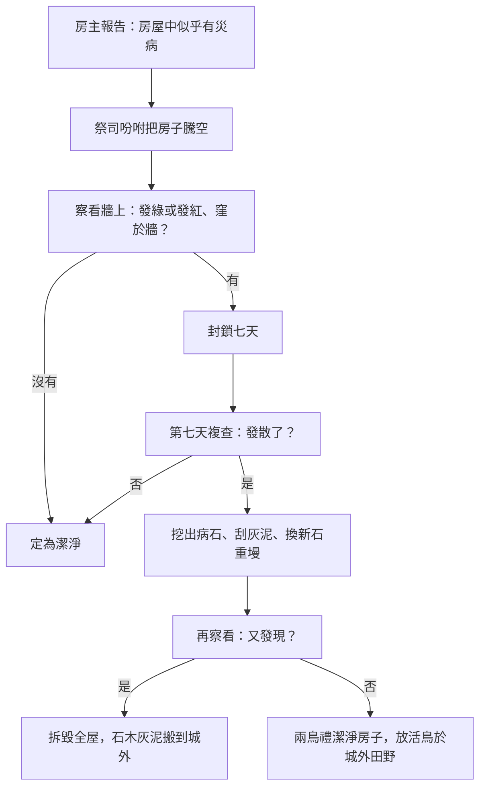

# 利未記 第14章

<!-- chapter-navigation:start -->
| [前一章](../03%20利未記/第13章.md) | [回目錄](../03%20利未記/全書目錄及綱要.md) | [下一章](../03%20利未記/第15章.md) |
| :--- | :---: | ---: |
<!-- chapter-navigation:end -->

1. 耶和華曉諭[[摩西]]說：
2. [[大痲瘋得潔淨的條例（人）|長大痲瘋得潔淨的日子]]，其例乃是這樣：要帶他去見[[亞倫和他兒子（祭司）|祭司]]；
3. [[亞倫和他兒子（祭司）|祭司]]要出到營外察看，若見他的[[大痲瘋（sara'at）|大痲瘋]]痊癒了，
4. 就要吩咐人為那[[大痲瘋得潔淨的條例（人）|求潔淨]]的拿[[潔淨痲瘋者的兩鳥儀式|兩隻潔淨的活鳥]]和[[香柏木（潔淨儀式用）|香柏木]]、[[藍色、紫色、朱紅色線|朱紅色線]]，並[[牛膝草]]來。
5. [[亞倫和他兒子（祭司）|祭司]]要吩咐[[瓦器盛活水（潔淨儀式）|用瓦器盛活水]]，把[[潔淨痲瘋者的兩鳥儀式|一隻鳥宰在上面]]。
6. 至於那隻活鳥，[[亞倫和他兒子（祭司）|祭司]]要把他和[[香柏木（潔淨儀式用）|香柏木]]、[[藍色、紫色、朱紅色線|朱紅色線]]並[[牛膝草]]一同蘸於宰在活水上的鳥血中，
7. 用以在那長[[大痲瘋（sara'at）|大痲瘋]][[大痲瘋得潔淨的條例（人）|求潔淨]]的人身上灑七次，就定他為潔淨，又把[[潔淨痲瘋者的兩鳥儀式|活鳥放在田野裡]]。
8. [[大痲瘋得潔淨的條例（人）|求潔淨]]的人當洗衣服，[[剃全身毛髮（潔淨禮）|剃去毛髮]]，用水洗澡，就潔淨了；然後可以進營，只是[[營外七天等候（潔淨禮）|要在自己的帳棚外居住七天]]。
9. 第七天，再[[剃全身毛髮（潔淨禮）|把頭上所有的頭髮與鬍鬚、眉毛，並全身的毛，都剃了]]；又要洗衣服，用水洗身，就潔淨了。
10. [[第八天獻祭（大痲瘋潔淨）|第八天]]，他要取兩隻沒有殘疾的公羊羔和一隻沒有殘疾、一歲的母羊羔，又要把[[伊法十分之三（大痲瘋潔淨素祭）|調油的細麵伊法十分之三]]為素祭，並[[一羅革油（log）|油一羅革]]，一同取來。
11. [[大痲瘋得潔淨的條例（人）|行潔淨之禮]]的[[亞倫和他兒子（祭司）|祭司]]要將那[[大痲瘋得潔淨的條例（人）|求潔淨]]的人和這些東西安置在[[會幕門口]]、耶和華面前。
12. [[亞倫和他兒子（祭司）|祭司]]要取一隻公羊羔獻為[[贖愆祭（asham）|贖愆祭]]，和那[[一羅革油（log）|一羅革油]]一同作[[搖祭]]，在耶和華面前搖一搖；
13. 把公羊羔宰於聖地，就是宰贖罪祭牲和燔祭牲之地。[[贖愆祭（asham）|贖愆祭]]要歸[[亞倫和他兒子（祭司）|祭司]]，與贖罪祭一樣，是至聖的。
14. [[亞倫和他兒子（祭司）|祭司]]要取些[[贖愆祭（asham）|贖愆祭]]牲的血，抹在[[大痲瘋得潔淨的條例（人）|求潔淨]]人的[[右耳垂右手大拇指右腳大拇指（抹血抹油潔淨禮）|右耳垂上]]和[[右耳垂右手大拇指右腳大拇指（抹血抹油潔淨禮）|右手的大拇指上]]，並[[右耳垂右手大拇指右腳大拇指（抹血抹油潔淨禮）|右腳的大拇指上]]。
15. [[亞倫和他兒子（祭司）|祭司]]要從那[[一羅革油（log）|一羅革油]]中取些倒在自己的左手掌裡，
16. 把右手的一個指頭蘸在左手的油裡，在耶和華面前[[彈油七次（潔淨禮）|用指頭彈七次]]。
17. 將手裡所剩的油抹在那[[大痲瘋得潔淨的條例（人）|求潔淨]]人的[[右耳垂右手大拇指右腳大拇指（抹血抹油潔淨禮）|右耳垂上]]和[[右耳垂右手大拇指右腳大拇指（抹血抹油潔淨禮）|右手的大拇指上]]，並[[右耳垂右手大拇指右腳大拇指（抹血抹油潔淨禮）|右腳的大拇指上]]，就是抹在[[贖愆祭（asham）|贖愆祭]]牲的血上。
18. [[亞倫和他兒子（祭司）|祭司]]手裡所剩的油要[[右耳垂右手大拇指右腳大拇指（抹血抹油潔淨禮）|抹在那求潔淨人的頭上]]，在耶和華面前為他贖罪。
19. [[亞倫和他兒子（祭司）|祭司]]要獻贖罪祭，為那本不潔淨、[[大痲瘋得潔淨的條例（人）|求潔淨]]的人贖罪；然後要宰燔祭牲，
20. 把燔祭和素祭獻在壇上，為他贖罪，他就潔淨了。
21. [[貧窮人的潔淨條例（大痲瘋）|他若貧窮不能預備夠數]]，就要取一隻公羊羔作[[贖愆祭（asham）|贖愆祭]]，可以搖一搖，為他贖罪；也要把[[伊法十分之三（大痲瘋潔淨素祭）|調油的細麵伊法十分之一]]為素祭，和[[一羅革油（log）|油一羅革]]一同取來；
22. 又[[貧窮人的潔淨條例（大痲瘋）|照他的力量]]取兩隻斑鳩或是兩隻雛鴿，一隻作贖罪祭，一隻作燔祭。
23. [[第八天獻祭（大痲瘋潔淨）|第八天]]，要為潔淨，把這些帶到[[會幕門口]]、耶和華面前，交給[[亞倫和他兒子（祭司）|祭司]]。
24. [[亞倫和他兒子（祭司）|祭司]]要把[[贖愆祭（asham）|贖愆祭]]的羊羔和那[[一羅革油（log）|一羅革油]]一同作[[搖祭]]，在耶和華面前搖一搖。
25. 要宰了[[贖愆祭（asham）|贖愆祭]]的羊羔，取些贖愆祭牲的血，抹在那[[大痲瘋得潔淨的條例（人）|求潔淨]]人的[[右耳垂右手大拇指右腳大拇指（抹血抹油潔淨禮）|右耳垂上]]和[[右耳垂右手大拇指右腳大拇指（抹血抹油潔淨禮）|右手的大拇指上]]，並[[右耳垂右手大拇指右腳大拇指（抹血抹油潔淨禮）|右腳的大拇指上]]。
26. [[亞倫和他兒子（祭司）|祭司]]要把些油倒在自己的左手掌裡，
27. 把左手裡的油，在耶和華面前，用右手的一個指頭彈七次，
28. 又把手裡的油抹些在那[[大痲瘋得潔淨的條例（人）|求潔淨]]人的[[右耳垂右手大拇指右腳大拇指（抹血抹油潔淨禮）|右耳垂上]]和[[右耳垂右手大拇指右腳大拇指（抹血抹油潔淨禮）|右手的大拇指上]]，並[[右耳垂右手大拇指右腳大拇指（抹血抹油潔淨禮）|右腳的大拇指上]]，就是抹[[贖愆祭（asham）|贖愆祭]]之血的原處。
29. [[亞倫和他兒子（祭司）|祭司]]手裡所剩的油要[[右耳垂右手大拇指右腳大拇指（抹血抹油潔淨禮）|抹在那求潔淨人的頭上]]，在耶和華面前為他贖罪。
30. 那人又要[[貧窮人的潔淨條例（大痲瘋）|照他的力量]]獻上一隻斑鳩或是一隻雛鴿，
31. 就是他所能辦的，一隻為贖罪祭，一隻為燔祭，與素祭一同獻上；[[亞倫和他兒子（祭司）|祭司]]要在耶和華面前為他贖罪。
32. 這是那有[[大痲瘋（sara'at）|大痲瘋]]災病的人、[[貧窮人的潔淨條例（大痲瘋）|不能將關乎得潔淨之物預備夠數]]的條例。
33. 耶和華曉諭[[摩西]]、亞倫說：
34. 你們到了我賜給你們為業的迦南地，我若使你們所得為業之地的[[房屋大痲瘋的診斷與潔淨條例|房屋中有大痲瘋的災病]]，
35. 房主就要去告訴[[亞倫和他兒子（祭司）|祭司]]說：據我看，房屋中似乎有災病。
36. [[亞倫和他兒子（祭司）|祭司]]還沒有進去察看災病以前，就要吩咐人把房子騰空，免得房子裡所有的都成了不潔淨；然後祭司要進去察看房子。
37. 他要察看那災病，災病若在房子的牆上有發綠或發紅的凹斑紋，現象窪於牆，
38. [[亞倫和他兒子（祭司）|祭司]]就要出到房門外，把[[房屋大痲瘋的診斷與潔淨條例|房子封鎖七天]]。
39. 第七天，[[亞倫和他兒子（祭司）|祭司]]要再去察看，災病若在房子的牆上發散，
40. 就要吩咐人把那有災病的石頭挖出來，扔在[[城外不潔淨之處]]；
41. 也要叫人刮房內的四圍，所刮掉的灰泥要倒在[[城外不潔淨之處]]；
42. 又要用別的石頭代替那挖出來的石頭，要另用灰泥墁房子。
43. 他挖出石頭，刮了房子，墁了以後，災病若在房子裡又發現，
44. [[亞倫和他兒子（祭司）|祭司]]就要進去察看，災病若在房子裡發散，這就是房內[[房屋大痲瘋的診斷與潔淨條例|蠶食的大痲瘋]]，是不潔淨。
45. 他就要[[房屋大痲瘋的診斷與潔淨條例|拆毀房子]]，把石頭、木頭、灰泥都搬到[[城外不潔淨之處]]。
46. 在房子封鎖的時候，進去的人必不潔淨到晚上；
47. 在房子裡躺著的必洗衣服；在房子裡吃飯的也必洗衣服。
48. 房子墁了以後，[[亞倫和他兒子（祭司）|祭司]]若進去察看，見災病在房內沒有發散，就要定房子為潔淨，因為災病已經消除。
49. 要為[[房屋大痲瘋的診斷與潔淨條例|潔淨房子]]取兩隻鳥和[[香柏木（潔淨儀式用）|香柏木]]、[[藍色、紫色、朱紅色線|朱紅色線]]並[[牛膝草]]，
50. [[瓦器盛活水（潔淨儀式）|用瓦器盛活水]]，把一隻鳥宰在上面，
51. 把[[香柏木（潔淨儀式用）|香柏木]]、[[牛膝草]]、[[藍色、紫色、朱紅色線|朱紅色線]]，並那活鳥，都蘸在被宰的鳥血中與[[活水（潔淨儀式用）|活水]]中，用以灑房子七次。
52. 要用鳥血、[[活水（潔淨儀式用）|活水]]、活鳥、[[香柏木（潔淨儀式用）|香柏木]]、[[牛膝草]]，並[[藍色、紫色、朱紅色線|朱紅色線]]，潔淨那房子。
53. 但要把活鳥放在[[城外不潔淨之處|城外田野裡]]。這樣[[房屋大痲瘋的診斷與潔淨條例|潔淨房子]]（原文是為房子贖罪），房子就潔淨了。
54. [[大痲瘋條例總結（利13-14）|這是為各類大痲瘋的災病]]和頭疥，
55. 並衣服與房子的[[大痲瘋（sara'at）|大痲瘋]]，
56. 以及癤子、癬、火斑所立的條例，
57. [[大痲瘋條例總結（利13-14）|指明何時為潔淨，何時為不潔淨]]。[[大痲瘋條例總結（利13-14）|這是大痲瘋的條例]]。

---

## 本章知識節點

### 人物
- [[摩西]]
- [[亞倫和他兒子（祭司）]]

### 主題
- [[大痲瘋得潔淨的條例（人）]]
- [[潔淨痲瘋者的兩鳥儀式]]
- [[剃全身毛髮（潔淨禮）]]
- [[營外七天等候（潔淨禮）]]
- [[第八天獻祭（大痲瘋潔淨）]]
- [[右耳垂右手大拇指右腳大拇指（抹血抹油潔淨禮）]]
- [[彈油七次（潔淨禮）]]
- [[瓦器盛活水（潔淨儀式）]]
- [[貧窮人的潔淨條例（大痲瘋）]]
- [[房屋大痲瘋的診斷與潔淨條例]]
- [[大痲瘋條例總結（利13-14）]]
- [[至聖的供物（聖與至聖之分）]]
- [[藍色、紫色、朱紅色線]]

### 原文
- [[大痲瘋（sara'at）]]
- [[活水（潔淨儀式用）]]
- [[牛膝草]]
- [[贖愆祭（asham）]]
- [[搖祭]]
- [[伊法十分之三（大痲瘋潔淨素祭）]]
- [[一羅革油（log）]]

### 文化
- [[香柏木（潔淨儀式用）]]

### 地點
- [[會幕門口]]
- [[城外不潔淨之處]]

### 神學
- [[沒有殘疾的祭牲]]
- [[承接聖職（分別為聖）]]
- [[潔淨與不潔淨]]
- [[禮儀不潔與道德罪的分別]]

### 解經爭議
- [[大痲瘋是否等同於罪的懲罰之爭]]

### 背景
- [[古代近東的皮膚病與黴斑觀念]]

### 互文
- [[出29：20|出29：20 承接聖職抹血於右耳垂手腳大拇指]]

---

## 本章整理

### 從營外走回營裡（v1-9）

上一章只走到判定為止：確診的人撕裂衣服、獨居營外，經文沒有給他任何回頭的路。本章補上的正是那條路——[[大痲瘋得潔淨的條例（人）|長大痲瘋得潔淨的條例]]。KC 注意到一個開場的小差別：利13:1 與本章 v33 都是對[[摩西]]和[[亞倫和他兒子（祭司）|亞倫]]說的，唯獨 v1 只對摩西說。

第一步是祭司**出到營外**（v3）。GT 丁良才說得很簡短：祭司要到長大痲瘋的人那裡去，正如基督降生在世時與罪人來往一樣。CT 也說「祭司出到營外」是從神的居所出來。GT《聖經精讀本》補上一個現實的細節：即使祭司宣佈他得了醫治，行潔淨禮之前他仍然不能進營，之前的不潔還殘留在他身上。

然後是[[潔淨痲瘋者的兩鳥儀式|兩鳥儀式]]（v4-7）：取兩隻潔淨的活鳥、[[香柏木（潔淨儀式用）|香柏木]]、[[藍色、紫色、朱紅色線|朱紅色線]]、[[牛膝草]]；用[[瓦器盛活水（潔淨儀式）|瓦器盛活水]]，把一隻鳥宰在水上；再把活鳥連同木、線、草蘸在血水中，向求潔淨的人灑七次，宣告潔淨，把活鳥放在田野裡。

STEP 語言資料在這裡幫得上忙：v4 的「鳥」是 צִפּוֹר（H6833），一個通稱，不是利12 用的鴿（יוֹנָה）或斑鳩（תֹּר）。GT 丁良才正是這樣理解——「不論是兩隻班鳩、雛鴿，或麻雀等，只要是潔淨的活鳥就可以」，他並記下主耶穌在世時猶太人行這禮是用麻雀，而按猶太人的遺風，兩隻鳥須是同色等大的。BH 則推測多半是鴿類。至於[[活水（潔淨儀式用）|活水]]，STEP 顯示原文就是「水」加上「活的」（מַיִם חַיִּים）；GT《串珠》說那是「泉水，不是採自水池的」。

**這算不算一個祭？兩家的答案相反。** KC 說得很直接：「其實這不是一個祭。沒有東西被帶到壇上，也沒有血獻給神。祭要到第八天才出現。」GT 丁良才的判斷卻相反——他在 v53 指出「這樣潔淨房子」原文作「為房子贖罪」，並據此認為那兩隻鳥就是一個祭。

兩隻鳥的關係，丁良才說得最清楚：活鳥與死鳥是合而為一的，活鳥完成死鳥所成全的，活鳥一被釋放，就顯明死鳥所成就的已經完全了（羅4:25）。GT《串珠》給的是另一個對照：這「類似第16章贖罪日處理兩隻羊的儀式，其中一隻鳥的血可能顯明了不潔淨者所應得的死罪，另一隻活鳥便背負了這些不潔及罪惡，使之遠離以色列民」；BH 也把放走活鳥比作贖罪日把羊送到曠野（利16:10）。至於瓦器與血水，CT 的靈意註解說瓦器表徵道成肉身的基督、盛活水表徵基督滿有神的生命，KC 的說法相近（來2:14）；BH 則從血與水的組合說：血代表生命、是贖罪所必需（利17:11），水表示潔淨與更新，而這幅圖畫「在新約裡得到回應——耶穌被釘時有血和水從肋旁流出（約19:34）」。CT 話中之光另引羅8:1-2，說放飛活鳥表徵基督復活的生命使人得著釋放。

灑完血之後是[[剃全身毛髮（潔淨禮）|洗衣、剃毛、洗澡]]（v8），然後可以進營，卻要[[營外七天等候（潔淨禮）|在自己的帳棚外住七天]]；第七天再剃一次頭髮、鬍鬚、眉毛和全身的毛，再洗衣洗身（v9）。

> [!note] 剃毛到底有沒有象徵意義：兩種讀法
> GT《舊約聖經背景註釋》說沒有：「毛髮有時代表人的生命或身分，但在本節卻無象徵意義。剃除淨盡的作用是使人人都能看見皮膚已經復原，以及避免有任何殘餘的不潔留在毛髮上。」
> CT 的靈意註解說有：「『頭髮』表徵驕傲和炫耀；『鬍鬚』表徵自尊；『眉毛』表徵天然的美麗；『全身的毛』表徵天然的能力。」KC 的方向與 CT 相近，說剃去所有的毛是捨棄一切天然的榮耀（林前11:15）。
> 至於為什麼還要在帳棚外多住七天，CT 說這「暗示他仍不能恢復正常的夫妻性生活」；GT《聖經精讀本》的說法相同。

### 第八天的四樣祭（v10-20）

[[第八天獻祭（大痲瘋潔淨）|第八天]]要帶兩隻沒有殘疾的公羊羔、一隻沒有殘疾一歲的母羊羔、[[伊法十分之三（大痲瘋潔淨素祭）|調油的細麵伊法十分之三]]為素祭，並[[一羅革油（log）|油一羅革]]，安置在[[會幕門口]]、耶和華面前（v10-11）。四樣祭的分配是：一隻公羊羔作[[贖愆祭（asham）|贖愆祭]]、母羊羔作贖罪祭、另一隻公羊羔作燔祭，加上素祭。

==本章的贖愆祭是全卷最特別的一次。== GT 丁良才把它與利5:14-6:8 的常例逐條對照，列出九點不同：(一)是公羊羔、不必是長成的；(二)不按祭司所估定的價值；(三)有同獻的素祭；(四)與一羅革油同獻；(五)須在耶和華面前作[[搖祭]]；(六)由祭司自己搖，不是祭司同獻祭的人一起搖；(七)搖的是全祭牲而且是**活搖**，不是宰了以後只搖一部分；(八)血有特別的用法；(九)沒有罰金。GT《舊約聖經背景註釋》從典禮史的角度印證了其中一點：本段是唯一使用全隻祭牲的搖祭實例。

這祭為什麼要獻？經文沒說，來源提出兩種可能——GT《串珠》與《舊約聖經背景註釋》都提到：一是補償他被隔離期間無法在聖所獻上的祭，二是萬一他先前患病確實與犯罪有關、以此補過。GT《聖經精讀本》給的說法比較正面：這是他作為選民、為恢復與神所立之約的特權而獻上的。

接著是[[右耳垂右手大拇指右腳大拇指（抹血抹油潔淨禮）|抹血與抹油]]：血抹在右耳垂、右手大拇指、右腳大拇指上（v14），油倒在祭司左手掌，用右手一個指頭在耶和華面前[[彈油七次（潔淨禮）|彈七次]]（v16），再抹在同樣三處、就抹在血上（v17），最後把剩下的抹在他頭上（v18）。這三個部位與[[出29：20|出29：20 承接聖職抹血耳手足]]完全相同——丁良才點出兩者的分別：在分派祭司時抹血是顯明把全身獻給主，在潔淨長大痲瘋者時抹血是顯明全身都潔淨了。CT 的靈意註解則說這表徵「從今以後，耳朵聽從神的話，手作神的工，腳行神的路」，並在話中之光裡把它與[[承接聖職（分別為聖）|承接聖職]]並列：「作祭司完全是神的恩典，同樣大痲瘋得痊癒也是出於神的恩典。」

**次序本身有意思。** 丁良才特別提醒：先抹血、後抹油。「基督的寶血既然潔淨了我們，聖靈的印記就把我們分別出來（弗一13），顯明我們是屬神的。」CT 的說法相同——基督的血是聖靈作工的基礎。他並在 v29 把整套禮儀歸成三樣：血、水、油，預表耶穌的寶血、神的聖道與聖靈的工作。至於那一羅革油，丁良才注意到它原是尋常的橄欖油，卻因祭司在耶和華面前搖過而成聖；GT《聖經精讀本》也說它與膏祭司的聖膏油不一樣，所以要彈七次「為了使油分別為聖」。

獻祭的地點與身分也有規定：贖愆祭牲宰於聖地，也就是宰贖罪祭牲和燔祭牲之地（v13），[[至聖的供物（聖與至聖之分）|贖愆祭要歸祭司，與贖罪祭一樣是至聖的]]；祭牲一律要[[沒有殘疾的祭牲|沒有殘疾]]（v10）。

### 貧窮人的條例（v21-32）

[[貧窮人的潔淨條例（大痲瘋）|力量不夠的人]]可以減：素祭從伊法十分之三減到十分之一，贖罪祭與燔祭的兩隻羊羔改成兩隻斑鳩或兩隻雛鴿。但有一樣不能減——贖愆祭仍舊要一隻公羊羔。丁良才說這條例「顯明神是體恤貧窮人的」；GT《聖經精讀本》說「神看獻祭之人的心,而不是看祭物大小、量與質」，並指貧窮人所獻的雖不同，所行的禮還是一樣的。

| 項目 | 常例（v10-20） | 貧窮條例（v21-32） |
|---|---|---|
| 贖愆祭 | 公羊羔一隻 | 公羊羔一隻（不可減） |
| 贖罪祭 | 一歲母羊羔一隻 | 斑鳩或雛鴿一隻 |
| 燔祭 | 公羊羔一隻 | 斑鳩或雛鴿一隻 |
| 素祭 | 調油細麵伊法十分之三 | 調油細麵伊法十分之一 |
| 油 | 一羅革 | 一羅革（相同） |

順帶一提，「一羅革」到底多少，來源並沒有共識：CT、GT《串珠》與 KC 說約半公升，GT《啟導本》與《聖經精讀本》說約 0.3 公升，BH 一處說約一品脫、另一處說約三分之一公升。GT《舊約聖經背景註釋》乾脆承認測不準：「羅革的分量不大，連一品脫也不足，但卻難以精確估計。聖經只在本章使用這字。」

### 房屋的災病（v33-53）

下半章換了對象：[[房屋大痲瘋的診斷與潔淨條例|房屋的大痲瘋]]。這一段有兩個與前半不同的地方。

第一，它是**預告**而不是現行法。經文自己說「你們到了我賜給你們為業的迦南地」（v34）——丁良才指出本卷有四處條例是要等到了迦南才遵守的（本節與利19:23、23:10、25:2），以色列人此時還住在帳棚裡。第二，它**不必獻祭**：GT《串珠》說「這裡不須要向神獻祭，因為房子不會與神相交」。

程序與人的條例平行：房主報告（v35）→ 祭司先叫人把房子騰空（v36）→ 察看牆上有沒有發綠或發紅的凹斑紋、現象是否窪於牆（v37）→ 封鎖七天（v38）→ 第七天若發散，就挖出病石扔在[[城外不潔淨之處]]、刮掉四圍的灰泥、換新石重新墁牆（v39-42）→ 若再發現就拆毀整棟（v43-45）→ 若沒有再發散，就用與人相同的兩鳥禮潔淨房子（v48-53）。丁良才說騰空房子是神體恤人：祭司一旦定那房子為不潔淨，其中一切所有的也都要成為不潔淨。

```mermaid
flowchart TD
    A["房主報告：房屋中似乎有災病"] --> B["祭司吩咐把房子騰空"]
    B --> C["察看牆上：發綠或發紅、窪於牆？"]
    C -->|"有"| D["封鎖七天"]
    C -->|"沒有"| J["定為潔淨"]
    D --> E["第七天複查：發散了？"]
    E -->|"是"| F["挖出病石、刮灰泥、換新石重墁"]
    E -->|"否"| J
    F --> G["再察看：又發現？"]
    G -->|"是"| H["拆毀全屋，石木灰泥搬到城外"]
    G -->|"否"| I["兩鳥禮潔淨房子，放活鳥於城外田野"]
```

**這災病究竟是什麼，丁良才列了三種解法**：猶太人以為是神特別的刑罰；有人以為是發硝或起毒黴；有人以為是生黴菌或一種寄生動物。他自己傾向後者，並舉當時科學家已查出有六十種微生物能在硬石上生長，一個月內就能在最硬的大理石上蝕出看得見的痕跡。GT《啟導本》與《利未記雷氏研讀本》都說這指的是發黴或腐蝕。

> [!important] 房屋這一段把一個爭議逼到最清楚的地方
> 房子不會犯罪。GT《聖經精讀本》在 v34 直說「並不是神對罪審判,使房屋發生麻風病」，並指出「當時巴勒斯坦地區經常發生黴變的腐蝕,是當地的流行病」；丁良才也說猶太人以為這是神特別的刑罰，「但是未必這樣」，他給的理由很實際——那些房屋原是迦南七族人所住的，而且那地方天氣炎熱。
> 但同一段裡 CT 的靈意註解仍逐項把它讀成教會裡的罪惡：房屋表徵教會、騰空表徵信徒與犯罪者隔絕、封鎖表徵教會不可接納有問題的新人、挖石表徵革除（林前5:5）、刮灰泥表徵清除不合真理的教訓。KC 的方向相同，把石頭讀成信徒（彼前2:5），並說活在罪中的人必須從地方教會中除去（林前5:13）。
> 所以分歧不在「有沒有屬靈教訓」，而在「這件事本身是不是神的審判」。詳見[[大痲瘋是否等同於罪的懲罰之爭]]與[[禮儀不潔與道德罪的分別]]。

### 這一章與鄰邦的異同、以及兩章的收束（v54-57）

[[古代近東的皮膚病與黴斑觀念|GT《舊約聖經背景註釋》]]在本章給的對照比上一章更貼身——鄰邦不只觀念相近，連做法都幾乎一樣。談到房屋潔淨禮，它寫道：「胡利人的儀式使用雀鳥（兩隻獻祭，一隻放生），又焚燒香柏木，和以色列人一樣。巴比倫人則使用烏鴉和鷹隼，後者到野外釋放。」談到人的潔淨禮，它指出「美索不達米亞和赫人的淨化儀式使用雀鳥的原因，是因為雀鳥能夠將不潔帶回天上的本源」，用香柏木則「顯然因為它與線和血一樣，都是紅色的」，而「很多解經家都相信紅色代表生命」。

分別落在兩處。第一是理由：同一份註釋緊接著說「對以色列人來說，這儀式是象徵性的，不是法術（因為人已經痊癒）」——人是先痊癒才行禮，禮不是用來治病的。第二是對象：談到房屋的黴，它指出美索不達米亞相信「發霉的牆壁表示家中有人將要死亡。黴菌是鬼魔及附同之災難將臨的先兆」，然後說「本段並沒有這些成分，需要執行儀式的是房屋，不是在其中居住的人」。GT《啟導本》總結兩章時的話正好呼應：這些條例「十分切合以色列民的生活環境，具體且實際，不帶任何異教邪魔的神秘顏色」。

最後四節是[[大痲瘋條例總結（利13-14）|兩章的總結]]：各類大痲瘋的災病、頭疥、衣服與房子的大痲瘋、癤子、癬、火斑，收在一句「指明何時為潔淨，何時為不潔淨」。GT《串珠》說這幾節的用意是「使祭司自己能分辨又能教導人如何分別潔淨和不潔淨的事物（參10:10-11）」；丁良才加上一句限制：祭司不可隨自己的意思定人、衣服或房屋為潔淨或不潔淨，要照神所曉諭的條例定。KC 則把整段的功用歸在「教導」上，並引提後3:16。

兩章合起來才是完整的一個循環：利13 只走到判定，本章補上恢復，而全章的動作都朝[[潔淨與不潔淨|「就定他為潔淨」]]這句話收——營外灑血之後（v7）、第八天獻完祭之後（v20）、房屋重墁之後（v48），各出現一次。

**參考資料**
https://www.ccbiblestudy.org/Old%20Testament/03Lev/03CT14.htm
https://www.ccbiblestudy.org/Old%20Testament/03Lev/03GT14.htm
https://www.kingcomments.com/en/bible-studies/Lev/14
https://biblehub.com/study/leviticus/14.htm
https://github.com/STEPBible/STEPBible-Data

<!-- chapter-navigation:start -->
| [前一章](../03%20利未記/第13章.md) | [回目錄](../03%20利未記/全書目錄及綱要.md) | [下一章](../03%20利未記/第15章.md) |
| :--- | :---: | ---: |
<!-- chapter-navigation:end -->
