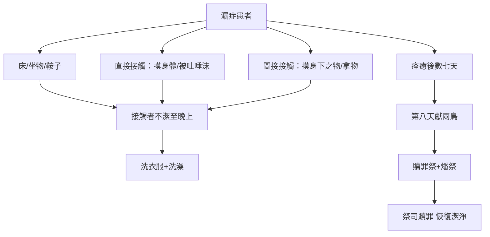
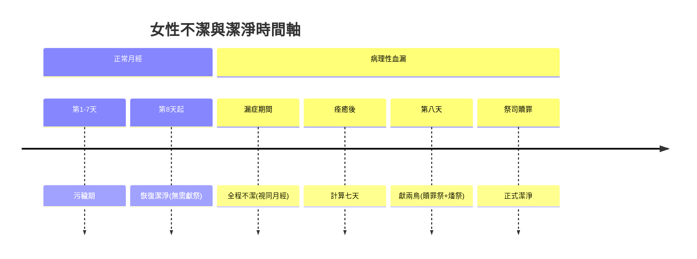

# 利未記 第15章

1. 耶和華對[[摩西]]、亞倫說：
2. 你們曉諭以色列人說：人若身患漏症，他因這漏症就不潔淨了。
3. 他患漏症，無論是下流的，是止住的，都是不潔淨。
4. 他所躺的床都為不潔淨，所坐的物也為不潔淨。
5. 凡摸那床的，必不潔淨到晚上，並要洗衣服，用水洗澡。
6. 那坐患漏症人所坐之物的，必不潔淨到晚上，並要洗衣服，用水洗澡。
7. 那摸患漏症人身體的，必不潔淨到晚上，並要洗衣服，用水洗澡。
8. 若患漏症人吐在潔淨的人身上，那人必不潔淨到晚上，並要洗衣服，用水洗澡。
9. 患漏症人所騎的鞍子也為不潔淨。
10. 凡摸了他身下之物的，必不潔淨到晚上；拿了那物的，必不潔淨到晚上，並要洗衣服，用水洗澡。
11. 患漏症的人沒有用水涮手，無論摸了誰，誰必不潔淨到晚上，並要洗衣服，用水洗澡。
12. 患漏症人所摸的[[瓦器打碎銅器擦淨|瓦器就必打破]]；所摸的一切[[瓦器打碎銅器擦淨|木器也必用水涮洗]]。
13. 患漏症的人痊癒了，就要為潔淨自己計算七天，也必洗衣服，用活水洗身，就潔淨了。
14. 第八天，要取兩隻[[斑鳩]]或是兩隻[[雛鴿]]，來到[[會幕門口]]、耶和華面前，把鳥交給[[亞倫和他兒子（祭司）|祭司]]。
15. [[亞倫和他兒子（祭司）|祭司]]要獻上一隻為贖罪祭，一隻為燔祭；因那人患的漏症，祭司要在耶和華面前為他贖罪。
16. 人若夢遺，他必不潔淨到晚上，並要用水洗全身。
17. 無論是衣服是皮子，被精所染，必不潔淨到晚上，並要用水洗。
18. 若男女交合，兩個人必不潔淨到晚上，並要用水洗澡。
19. 女人行經，必污穢七天；凡摸他的，必不潔淨到晚上。
20. 女人在污穢之中，凡他所躺的物件都為不潔淨，所坐的物件也都不潔淨。
21. 凡摸他床的，必不潔淨到晚上，並要洗衣服，用水洗澡。
22. 凡摸他所坐什麼物件的，必不潔淨到晚上，並要洗衣服，用水洗澡。
23. 在女人的床上，或在他坐的物上，若有別的物件，人一摸了，必不潔淨到晚上。
24. 男人若與那女人同房，染了他的污穢，就要七天不潔淨；所躺的床也為不潔淨。
25. 女人若在經期以外患多日的血漏，或是經期過長，有了漏症，他就因這漏症不潔淨，與他在經期不潔淨一樣。
26. 他在患漏症的日子所躺的床、所坐的物都要看為不潔淨，與他月經的時候一樣。
27. 凡摸這些物件的，就為不潔淨，必不潔淨到晚上，並要洗衣服，用水洗澡。
28. 女人的漏症若好了，就要計算七天，然後才為潔淨。
29. 第八天，要取兩隻[[斑鳩]]或是兩隻[[雛鴿]]，帶到[[會幕門口]]給[[亞倫和他兒子（祭司）|祭司]]。
30. [[亞倫和他兒子（祭司）|祭司]]要獻一隻為贖罪祭，一隻為燔祭；因那人血漏不潔，祭司要在耶和華面前為他贖罪。
31. 你們要這樣使以色列人與他們的污穢隔絕，免得他們玷污我的帳幕，就因自己的污穢死亡。
32. 這是患漏症和夢遺而不潔淨的，
33. 並有月經病的和患漏症的，無論男女，並人與不潔淨女人同房的條例。

---

## 本章知識節點

### 主題
- [[患漏症者接觸物件的傳染條例]]
- [[漏症痊癒的潔淨條例]]
- [[夢遺與交合的潔淨條例]]
- [[女人行經的不潔條例]]
- [[血漏（女人非經期出血的不潔條例）]]
- [[瓦器打碎銅器擦淨]]
- [[斑鳩]]
- [[雛鴿]]

### 人物
- [[摩西]]
- [[亞倫和他兒子（祭司）]]

### 地點
- [[會幕門口]]

### 原文
- [[漏症（身患漏症的條例）]]
- [[隔絕（與污穢分別）]]

### 互文
- [[太9：20-22 血漏婦人摸主衣繸得痊癒]]

### 神學
- [[潔淨與不潔淨]]

---

## 本章整理

### 男人漏症條例：從身體流出的污穢與傳染（v1-15）

本章開篇「耶和華對[[摩西]]、[[亞倫和他兒子（祭司）|亞倫]]說」（v1），確立條例的權威。所謂「[[漏症（身患漏症的條例）|漏症]]」，CT〔原文字義〕指出即「流出、排出」之意，多半指淋病等性病。經文細分兩種狀態：「下流的」與「止住的」——無論持續流出或暫時停止，「都是不潔淨」（v3）。

漏症的不潔具有強烈**傳染性**，形成同心圓擴散：患者本身不潔（v2）→ 所躺之床、所坐之物、所騎之鞍（v4,9）→ 直接接觸者（摸床、坐物、摸身體、被吐唾沫、摸身下之物、未洗手被摸）（v5-8,10-11）→ 間接接觸者（拿了那物）（v10），[[患漏症者接觸物件的傳染條例|傳染條例]]規定所有接觸者「必不潔淨到晚上，並要洗衣服，用水洗澡」（v5-7,11）。器物處理上有區別：「瓦器就必打破；所摸的一切木器也必用水涮洗」（v12），這正是[[瓦器打碎銅器擦淨]]原則第三度出現於利未記（另見六28、十一33）。

[[漏症痊癒的潔淨條例|痊癒後的潔淨程序]]嚴謹：計算七天（v13）→ 第八天帶兩隻[[斑鳩]]或[[雛鴿]]到[[會幕門口]]（v14）→ 祭司獻一隻為贖罪祭、一隻為燔祭，在耶和華面前贖罪（v15）。CT〔文意註解〕指出，兩隻斑鳩或雛鴿原是貧窮人的祭物（參五7），但對於漏症的患者，不論窮富，均以鳥隻為祭物，顯示這潔淨禮的特殊性。

### 精液排泄與性交條例：非因犯罪亦須潔淨（v16-18）

[[夢遺與交合的潔淨條例]]處理**間歇性**排泄：夢遺（v16）、衣物沾染精液（v17）、夫妻同房（v18）。三者同歸「不潔淨到晚上，並要用水洗（澡）」。GT串珠聖經註釋指出，夢遺及性交在巴比倫、埃及、希臘、羅馬、亞拉伯等古代文化中同樣被視為不潔。KingComments指出，這是無罪咎、非因犯罪而生的不潔情況，不需要獻祭，僅須沐浴等候至晚上。

| 情況 | 不潔期限 | 潔淨方式 | 是否獻祭 |
|------|----------|----------|----------|
| 夢遺 | 至晚上 | 洗全身 | 否 |
| 衣物/皮子沾精 | 至晚上 | 用水洗 | 否 |
| 夫妻同房 | 至晚上 | 兩人洗澡 | 否 |

### 女人月經與血漏條例：生理週期與病理延長的平行處理（v19-30）

女性條例分兩層：[[女人行經的不潔條例|正常月經]]（v19-24）與[[血漏（女人非經期出血的不潔條例）|病理性血漏]]（v25-30）。月經期「污穢七天」（v19），接觸床座物件同樣傳染不潔至晚上（v20-23），若男子與經期女子同房，「染了她的污穢，就要七天不潔淨」（v24）。GT丁良才註解指出，本節希伯來文「污穢」原意即「不潔淨」，月經期間不須獻祭，只須用水洗淨。

病理性血漏（v25-26）指「經期以外患多日的血漏，或是經期過長」，視同月經不潔，天數不定，直待漏症止住。潔淨程序與男性漏症平行：痊癒後數七天（v28）→ 第八天獻兩鳥（v29）→ 祭司獻贖罪祭與燔祭贖罪（v30）。[[太9：20-22 血漏婦人摸主衣繸得痊癒]]記載那患十二年血漏的女人，按律法摸耶穌會使主不潔，但GT《啟導本聖經利未記註釋》指出：「耶穌的大愛，象那女人的信心一樣，超越了一切律法的禁忌與限制」。

### 條例總綱：隔絕污穢、護衛會幕（v31-33）

本章以總結收尾：「你們要這樣使以色列人與他們的污穢隔絕，免得他們玷污我的帳幕，就因自己的污穢死亡」（v31）。[[隔絕（與污穢分別）|「隔絕」]]一詞，GT串珠聖經註釋指出希伯來文這字與「拿細耳人」有相同字根，以色列人要與污穢隔絕，正如拿細耳人要遠離清酒濃酒一樣（見民六1-4）。GT丁良才註解深刻闡述：「神的帳幕是聖潔的，凡親近神的人也就必須聖潔……連我們的軟弱和無意發動的情欲也必須有耶穌的寶血洗淨，才得與聖的神接交。」

> [!important] 本章樞紐
> **「免得他們玷污我的帳幕，就因自己的污穢死亡」**（v31）揭示條例核心：神的同在住在會幕中，百姓的不潔若不隔絕，必觸犯神的聖潔而死。GT丁良才指出這章的要訓之一：「有兩種潔淨人的妙法，就是用血和水（可比主的血，約壹一7，和主的道，詩一百十九9，約十五3）。」

> [!quote] 來源關鍵引句
> - CT：「兩隻斑鳩或是兩隻雛鴿原是是貧窮人的祭物，但對於漏症的患者，不論窮富，均以鳥隻為祭物。」
> - GT丁良才《利未記註釋》：「神的帳幕是聖潔的，凡親近神的人也就必須聖潔……連我們的軟弱和無意發動的情欲也必須有耶穌的寶血洗淨，才得與聖的神接交。」
> - GT《啟導本聖經利未記註釋》：「耶穌的大愛，象那女人的信心一樣，超越了一切律法的禁忌與限制。」
> - KingComments：這不潔並非人自己的意願，而是出於人墮落本性所自然流出的（Discharges defile precisely because they originate from the nature of man who has fallen into sin，已譯：這些排泄之所以使人不潔，正是因為它們出於人墮落後的本性）。

> [!note] 解經爭議提示
> 1. **漏症具體病理**：CT 傾向淋病；GT《舊約聖經背景註釋》提出尿道血吸蟲病；GT《聖經精讀本》引傑羅姆（Jerome）及猶太學者觀點，認為是性器官虛弱、尿道疾病而流出黏液。三說並存，經文未明確醫學診斷。
> 2. **新約視角**：GT《聖經精讀本》指出，新約時代舊約儀式因耶穌基督已經廢棄，耶穌教訓從體內流出的液體並不能污穢人，從罪人心中出來的罪惡才能污穢人（太十五11）。

### 跨章脈絡

GT丁良才將利未記11-15章歸為論禮儀不潔的四大類：動物（11）、產婦（12）、大痲瘋（13-14）、漏症（15）。漏症章獨特處在於處理**非自願、持續性、來自生殖器**的污穢。其潔淨禮「七天+第八天獻鳥」模式與大痲瘋潔淨（14:10）平行。

**參考資料**
https://www.ccbiblestudy.org/Old%20Testament/03Lev/03CT15.htm
https://www.ccbiblestudy.org/Old%20Testament/03Lev/03GT15.htm
https://www.kingcomments.com/en/bible-studies/Lev/15
https://biblehub.com/study/leviticus/15.htm
