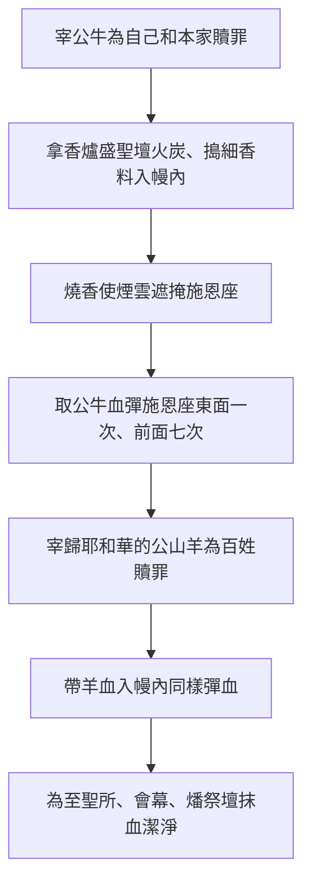

# 利未記 第16章

1. [[亞倫]]的兩個兒子近到耶和華面前死了。死了之後，耶和華曉諭摩西說：
2. 要告訴你哥哥[[亞倫]]，不可隨時進聖所的[[至聖所|幔子內]]、到櫃上的[[施恩座]]前，免得他死亡，因為我要從雲中顯現在施恩座上。
3. [[亞倫]]進聖所，要帶一隻公牛犢為贖罪祭，一隻公綿羊為燔祭。
4. 要穿上[[聖衣（祭司聖服）|細麻布聖內袍]]，把細麻布褲子穿在身上，腰束細麻布帶子，頭戴細麻布冠冕；[[聖衣（祭司聖服）|這都是聖服]]。他要[[洗身（水洗）|用水洗身]]，然後穿戴。
5. 要從以色列會眾取兩隻公山羊為贖罪祭，一隻公綿羊為燔祭。
6. [[亞倫]]要把贖罪祭的公牛奉上，為自己和本家贖罪；
7. 也要把兩隻公山羊安置在[[會幕門口]]、耶和華面前，
8. 為那兩隻羊拈鬮，一鬮歸與耶和華，一鬮歸與阿撒瀉勒。
9. [[亞倫]]要把那拈鬮歸與耶和華的羊獻為贖罪祭，
10. 但那拈鬮歸與阿撒瀉勒的羊要活著安置在耶和華面前，用以贖罪，打發人送到曠野去，歸與阿撒瀉勒。
11. [[亞倫]]要把贖罪祭的公牛牽來宰了，為自己和本家贖罪；
12. 拿香爐，從耶和華面前的壇上盛滿火炭，又拿一捧搗細的香料，都帶入[[至聖所|幔子內]]，
13. 在耶和華面前，把香放在火上，使香的煙雲遮掩法櫃上的[[施恩座]]，免得他死亡；
14. 也要取些公牛的血，用指頭彈在[[施恩座]]的東面，又在施恩座的前面彈血七次。
15. 隨後他要宰那為百姓作贖罪祭的公山羊，把羊的血帶入[[至聖所|幔子內]]，彈在[[施恩座]]的上面和前面，好像彈公牛的血一樣。
16. 他因以色列人諸般的污穢、過犯，就是他們一切的罪愆，當這樣在聖所行贖罪之禮，並因會幕在他們污穢之中，也要照樣而行。
17. 他進聖所贖罪的時候，會幕裡不可有人，直等到他為自己和本家並以色列全會眾贖了罪出來。
18. 他出來，要到耶和華面前的壇那裡，在壇上行贖罪之禮，又要取些公牛的血和公山羊的血，抹在壇上四角的周圍；
19. 也要用指頭把血彈在壇上七次，潔淨了壇，從壇上除掉以色列人諸般的污穢，使壇成聖。
20. [[亞倫]]為聖所和會幕並壇獻完了贖罪祭，就要把那隻活著的公山羊奉上。
21. 兩手按在羊頭上，承認以色列人諸般的罪孽過犯，就是他們一切的罪愆，把這罪都歸在羊的頭上，藉著所派之人的手，送到曠野去。
22. 要把這羊放在曠野，這羊要擔當他們一切的罪孽，帶到無人之地。
23. [[亞倫]]要進會幕，把他進聖所時所穿的細麻布衣服脫下，放在那裡，
24. 又要在聖處[[洗身（水洗）|用水洗身]]，穿上衣服，出來，把自己的燔祭和百姓的燔祭獻上，為自己和百姓贖罪。
25. 贖罪祭牲的脂油要在壇上焚燒。
26. 那放羊歸與阿撒瀉勒的人要洗衣服，[[洗身（水洗）|用水洗身]]，然後進營。
27. 作贖罪祭的公牛和公山羊的血既帶入聖所贖罪，這牛羊就要搬到營外，將皮、肉、糞用火焚燒。
28. 焚燒的人要洗衣服，[[洗身（水洗）|用水洗身]]，然後進營。
29. 每逢七月初十日，你們要刻苦己心，無論是本地人，是寄居在你們中間的外人，什麼工都不可做；這要作你們永遠的定例。
30. 因在這日要為你們贖罪，使你們潔淨。你們要在耶和華面前得以潔淨，脫盡一切的罪愆。
31. 這日你們要守為聖安息日，要刻苦己心；這為永遠的定例。
32. 那受膏、接續他父親承接聖職的祭司要穿上細麻布的[[聖衣（祭司聖服）|聖衣]]，行贖罪之禮。
33. 他要在[[至聖所]]和會幕與壇行贖罪之禮，並要為眾祭司和會眾的百姓贖罪。
34. 這要作你們永遠的定例─就是因以色列人一切的罪，要一年一次為他們贖罪。於是，[[亞倫]]照耶和華所吩咐摩西的行了。

---

## 本章知識節點

### 主題
- [[拈鬮定羊的歸屬]]
- [[按手認罪（承認罪孽轉移）]]
- [[搗細香料遮掩施恩座]]
- [[彈血於施恩座與壇（大祭司一年一度贖罪禮）]]
- [[聖衣（祭司聖服）]]
- [[內幔（隔聖所至聖所的幔子）]]
- [[施恩座]]
- [[刻苦己心（禁食悔改）]]
- [[聖安息日（大贖罪日雙重安息）]]

### 人物
- [[亞倫]]
- [[拿答]]
- [[亞比戶]]

### 地點
- [[曠野無人之地]]
- [[至聖所]]
- [[會幕門口]]

### 神學
- [[洗身（水洗）]]
- [[兩隻公山羊的雙重預表]]

### 歷史
- [[大贖罪日（Yom Kippur）條例]]

### 解經爭議
- [[阿撒瀉勒（Azazel）歸屬之爭]]

### 互文
- [[來9：11-12|來9：11-12 基督進入天上至聖所]]
- [[來10：19-20|來10：19-20 幔子裂開新路]]
- [[來13：11-12|來13：11-12 城外受苦]]
- [[詩103：12|詩103：12 東離西有多遠]]
- [[賽53：6|賽53：6 罪孽歸在祂身上]]
- [[羅3：25|羅3：25 挽回祭]]
- [[出25：17-22|出25：17-22 施恩座造法]]
- [[利10：1-2|利10：1-2 拿答亞比戶獻凡火]]

---

## 本章整理

### 緣起與進入至聖所的嚴格限制（v1-2）

本章開篇即點出立法背景：[[亞倫]]的兩個兒子[[拿答]]、[[亞比戶]]因獻凡火在耶和華面前死亡（參利10：1-2），神隨後曉諭摩西，嚴禁亞倫「不可隨時進聖所的幔子內、到櫃上的[[施恩座]]前」（v2）。[[至聖所]]內有約櫃與施恩座，是神從雲中顯現、與人相會的地方（出25：22），凡未按禮進入者必死。CT 指出此規定「表徵神的僕人不可憑自己的功績進到神面前」；KC 則強調幔子預表基督的身體（來10：19-20），主死時幔子裂開，信徒如今可「坦然無懼地來到施恩的寶座前」（來4：16）。BH 解釋「雲中顯現」代表神的榮耀同在，預表道成肉身的基督（西1：15）。這段經文確立了大贖罪日唯一合法進入至聖所的時機與條件。

### 大祭司預備與獻祭流程（v3-19）

亞倫進入至聖所前須完成嚴謹預備：  
1. **祭牲**：為自己和本家帶一隻公牛犢作贖罪祭、一隻公綿羊作燔祭（v3）；為會眾取兩隻公山羊作贖罪祭、一隻公綿羊作燔祭（v5）。  
2. **聖衣**：換上細麻布[[聖衣（祭司聖服）|聖服]]——內袍、褲子、帶子、冠冕，並[[洗身（水洗）|用水洗身]]（v4）。CT 視此為「自己分別為聖，然後穿戴基督」（羅13：14）；GT 引猶太傳統說大祭司贖罪日當天要五次洗身、十次洗手腳，顯示親近神須全然聖潔。  
3. **拈鬮**：在[[會幕門口]]為兩隻公山羊拈鬮，一歸耶和華（被宰）、一歸阿撒瀉勒（活著送入曠野）（v7-10）。  

隨後進入至聖所的具體步驟（v11-19）可用流程圖概括：

關鍵細節：  
- **香煙遮掩施恩座**（v13）：KC 指出這預表基督代禱的功效，使信徒蒙悅納；BH 說香代表聖徒禱告上達（啟8：3-4）。  
- **彈血七次**（v14,15,19）：「七」表完全。KC 對比：公牛血在施恩座東面只彈一次（神已滿意），前面彈七次（給祭司絕對確據）；山羊血同樣處理。  
- **為聖所與壇贖罪**（v16,18-19）：因百姓污穢使聖所、會幕、壇蒙污，須用血潔淨。CT 解為「蒙恩之人因舊造敗壞，致使聖所在污穢中，故須贖罪」；KC 則強調基督在十字架上滿足神公義，使壇成聖。  
- **獨自進入**（v17）：「會幕裡不可有人」，預表基督獨自成就救贖（來9：12）。

### 代罪羊儀式與罪的完全除去（v20-22）

完成聖所潔淨後，亞倫把活著的公山羊奉上，**兩手按在羊頭上**，承認以色列人「諸般的罪孽、過犯、一切的罪愆」，把罪歸在羊頭上，派人送入曠野「無人之地」（v21-22）。這是全章神學高峰，來源間對「阿撒瀉勒」解讀分歧極大，必須並陳：

| 觀點 | 代表來源 | 核心論據 |
|------|----------|----------|
| 指魔鬼/撒但 | CT、倪柝聲、GT《舊約背景註釋》 | 1. 與耶和華對峙（v8）；2. 羊被「放」給阿撒瀉勒而非「獻」（v26）；3. 向魔鬼顯明罪已完全除去（彌7：19）。 |
| 指基督/罪的完全除去 | 丁良才、KC、GT《啟導本》 | 1. 經文無處稱阿撒瀉勒為魔鬼；2. 兩羊本是「一個祭」（v5）；3. 羊擔當罪孽帶到無人之地，預表基督除去罪（賽53：6、約1：29）。 |
| 字義「完全移去」 | BH、艾基斯 | 希伯來詞根意「移去、分離」；七十士譯本譯「被送走之羊」；後期猶太傳說才人格化為魔鬼。 |

KC 指出兩羊雙重預表：被宰羊滿足神公義（挽回祭，羅3：25）；活羊顯明罪被「東離西有多遠」除去（詩103：12）。GT《精讀本》強調按手象徵轉移，派人送羊確保不返回。這儀式生動宣告：神不再紀念百姓的罪（賽43：25）。

### 善後潔淨與永遠定例（v23-34）

儀式尾聲強調潔淨與制度化：  
1. **亞倫更衣沐浴**（v23-24）：脫下細麻布衣服放在會幕，在聖處[[洗身（水洗）|洗身]]，穿上常服，獻上自己與百姓的燔祭。CT 解為「神的僕人要謹慎自己和教訓」（提前4：16）。  
2. **脂油焚燒**（v25）：贖罪祭公牛、公山羊的脂油在壇上焚燒，表徵基督蒙神悅納。  
3. **相關人員潔淨**（v26,28）：放羊者、焚燒者皆須洗衣、洗身才能進營，顯示接觸罪污須潔淨。  
4. **祭牲營外焚燒**（v27）：贖罪祭牲皮肉糞搬到[[營外焚燒（machutz la-machaneh saraf）|營外焚燒]]，KC、CT 同指這預表信徒「出到營外就了祂，忍受凌辱」（來13：11-13，參[[紅母牛預表基督城外受苦（來13：11-12）|紅母牛預表基督城外受苦]]）。  
5. **永遠定例**（v29-34）：每年七月初十日（提斯利月）守為「聖安息日」，「刻苦己心」（禁食悔改），「什麼工都不可做」，本地人與寄居外人同遵。大祭司世襲承接此職（v32），一年一次為聖所、會幕、壇、祭司、會眾贖罪（v33-34）。BH 指出這日後稱「贖罪日」（Yom Kippur），是猶太曆最莊嚴一日。

### 跨章預表：基督作大祭司成就永遠贖罪

利未記16章是希伯來書9-10章的舊約底本。KC、CT、BH 一致列出關鍵對照：

| 利未記16章（影兒） | 希伯來書/新約（真像） |
|-------------------|----------------------|
| 大祭司有罪，先為自己獻祭（v6,11） | 基督無罪，不須為自己獻祭（來7：26-27） |
| 牛羊血，每年重複進人手所造聖所（v14-15,34） | 基督用自己的血，一次進入天上真聖所（來9：12,24） |
| 血只能遮蓋罪，不能除去（來10：4） | 基督一次獻祭，永遠成全被聖潔的人（來10：14） |
| 祭司站著事奉，工作未完（v17） | 基督獻完祭，坐在神右邊（來10：11-12） |
| 代罪羊帶罪入曠野（v22） | 基督擔當我們罪，釘十字架在城外（來13：12） |
| 幔子阻隔，唯大祭司一年一度可入（v2） | 基督肉身裂開幔子，信徒隨時可進至聖所（來10：19-20） |

CT 總結：「重複證明只是象徵，能力在指向基督的獻祭」；KC 強調「基督的工作是一次完成、永遠有效」。本章儀式每一細節——洗身、聖衣、香煙、彈血、按手、營外焚燒——都在多維度預表基督作大祭司、祭物、代禱者、除罪者的完全工作。信徒今日既藉耶穌的血有坦然進入至聖所的路（來10：19），當「存著誠心和充足的信心來到神面前」（來10：22），並在「營外」與基督同受凌辱，等候祂再顯現。

**參考資料**
https://www.ccbiblestudy.org/Old%20Testament/03Lev/03CT16.htm
https://www.ccbiblestudy.org/Old%20Testament/03Lev/03GT16.htm
https://www.kingcomments.com/en/bible-studies/Lev/16
https://biblehub.com/study/leviticus/16.htm
