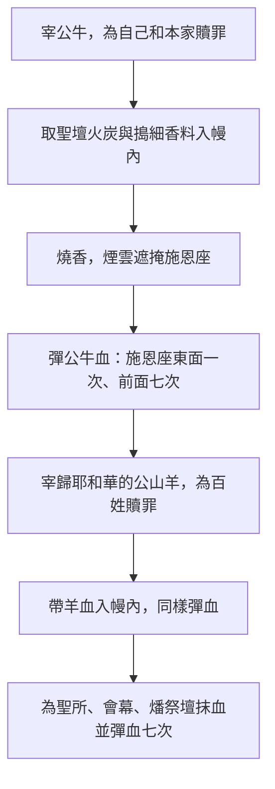

# 利未記 第16章

<!-- chapter-navigation:start -->
| [前一章](../03%20利未記/第15章.md) | [回目錄](../03%20利未記/全書目錄及綱要.md) | [下一章](../03%20利未記/第17章.md) |
| :--- | :---: | ---: |
<!-- chapter-navigation:end -->

1. [[亞倫]]的兩個兒子近到耶和華面前死了。死了之後，耶和華曉諭摩西說：
2. 要告訴你哥哥[[亞倫]]，不可隨時進聖所的[[至聖所|幔子內]]、到櫃上的[[施恩座]]前，免得他死亡，因為我要從雲中顯現在施恩座上。
3. [[亞倫]]進聖所，要帶一隻公牛犢為贖罪祭，一隻公綿羊為燔祭。
4. 要穿上[[聖衣（祭司聖服）|細麻布聖內袍]]，把細麻布褲子穿在身上，腰束細麻布帶子，頭戴細麻布冠冕；[[聖衣（祭司聖服）|這都是聖服]]。他要[[洗身（水洗）|用水洗身]]，然後穿戴。
5. 要從以色列會眾取兩隻公山羊為贖罪祭，一隻公綿羊為燔祭。
6. [[亞倫]]要把贖罪祭的公牛奉上，為自己和本家贖罪；
7. 也要把兩隻公山羊安置在[[會幕門口]]、耶和華面前，
8. 為那兩隻羊[[拈鬮定羊的歸屬|拈鬮]]，一鬮歸與耶和華，一鬮歸與[[阿撒瀉勒（Azazel）歸屬之爭|阿撒瀉勒]]。
9. [[亞倫]]要把那拈鬮歸與耶和華的羊獻為贖罪祭，
10. 但那拈鬮歸與[[阿撒瀉勒（Azazel）歸屬之爭|阿撒瀉勒]]的羊要活著安置在耶和華面前，用以贖罪，打發人送到曠野去，歸與阿撒瀉勒。
11. [[亞倫]]要把贖罪祭的公牛牽來宰了，為自己和本家贖罪；
12. 拿香爐，從耶和華面前的壇上盛滿火炭，又拿一捧[[搗細香料遮掩施恩座|搗細的香料]]，都帶入[[至聖所|幔子內]]，
13. 在耶和華面前，把香放在火上，使[[搗細香料遮掩施恩座|香的煙雲遮掩法櫃上的施恩座]]，免得他死亡；
14. 也要取些公牛的血，[[彈血於施恩座與壇（大祭司一年一度贖罪禮）|用指頭彈在施恩座的東面]]，又在施恩座的前面[[彈血於施恩座與壇（大祭司一年一度贖罪禮）|彈血七次]]。
15. 隨後他要宰那為百姓作贖罪祭的公山羊，把羊的血帶入[[至聖所|幔子內]]，彈在[[施恩座]]的上面和前面，好像彈公牛的血一樣。
16. 他因以色列人諸般的污穢、過犯，就是他們一切的罪愆，當這樣在聖所行贖罪之禮，並因會幕在他們污穢之中，也要照樣而行。
17. 他進聖所贖罪的時候，會幕裡不可有人，直等到他為自己和本家並以色列全會眾贖了罪出來。
18. 他出來，要到耶和華面前的壇那裡，在壇上行贖罪之禮，又要取些公牛的血和公山羊的血，抹在壇上四角的周圍；
19. 也要用指頭把血彈在壇上七次，潔淨了壇，從壇上除掉以色列人諸般的污穢，使壇成聖。
20. [[亞倫]]為聖所和會幕並壇獻完了贖罪祭，就要把那隻活著的公山羊奉上。
21. [[按手認罪（承認罪孽轉移）|兩手按在羊頭上]]，[[按手認罪（承認罪孽轉移）|承認以色列人諸般的罪孽過犯]]，就是他們一切的罪愆，把這罪都歸在羊的頭上，藉著所派之人的手，送到曠野去。
22. 要把這羊放在曠野，這羊要擔當他們一切的罪孽，[[曠野無人之地|帶到無人之地]]。
23. [[亞倫]]要進會幕，把他進聖所時所穿的細麻布衣服脫下，放在那裡，
24. 又要在聖處[[洗身（水洗）|用水洗身]]，穿上衣服，出來，把自己的燔祭和百姓的燔祭獻上，為自己和百姓贖罪。
25. 贖罪祭牲的脂油要在壇上焚燒。
26. 那放羊歸與[[阿撒瀉勒（Azazel）歸屬之爭|阿撒瀉勒]]的人要洗衣服，[[洗身（水洗）|用水洗身]]，然後進營。
27. 作贖罪祭的公牛和公山羊的血既帶入聖所贖罪，這牛羊就要搬到營外，將皮、肉、糞用火焚燒。
28. 焚燒的人要洗衣服，[[洗身（水洗）|用水洗身]]，然後進營。
29. [[大贖罪日（Yom Kippur）條例|每逢七月初十日]]，你們要[[刻苦己心（禁食悔改）|刻苦己心]]，無論是本地人，是寄居在你們中間的外人，什麼工都不可做；這要作你們永遠的定例。
30. 因在這日要為你們贖罪，使你們潔淨。你們要在耶和華面前得以潔淨，脫盡一切的罪愆。
31. 這日你們要守為[[聖安息日（大贖罪日雙重安息）|聖安息日]]，要[[刻苦己心（禁食悔改）|刻苦己心]]；這為永遠的定例。
32. 那受膏、接續他父親承接聖職的祭司要穿上細麻布的[[聖衣（祭司聖服）|聖衣]]，行贖罪之禮。
33. 他要在[[至聖所]]和會幕與壇行贖罪之禮，並要為眾祭司和會眾的百姓贖罪。
34. 這要作你們永遠的定例─就是因以色列人一切的罪，要一年一次為他們贖罪。於是，[[亞倫]]照耶和華所吩咐摩西的行了。

---

## 本章知識節點

### 主題
- [[拈鬮定羊的歸屬]]
- [[按手認罪（承認罪孽轉移）]]
- [[搗細香料遮掩施恩座]]
- [[彈血於施恩座與壇（大祭司一年一度贖罪禮）]]
- [[聖衣（祭司聖服）]]
- [[內幔（隔聖所至聖所的幔子）]]
- [[施恩座]]
- [[刻苦己心（禁食悔改）]]
- [[聖安息日（大贖罪日雙重安息）]]
- [[營外焚燒]]

### 人物
- [[亞倫]]
- [[拿答]]
- [[亞比戶]]

### 地點
- [[曠野無人之地]]
- [[至聖所]]
- [[會幕門口]]

### 神學
- [[洗身（水洗）]]
- [[兩隻公山羊的雙重預表]]

### 歷史
- [[大贖罪日（Yom Kippur）條例]]

### 背景
- [[古代近東的替罪與潔淨儀式]]

### 解經爭議
- [[阿撒瀉勒（Azazel）歸屬之爭]]

### 互文
- [[香壇一年一次的贖罪（出30：10）]]
- [[贖罪日的節期獻祭（民29：7-11）]]
- [[紅母牛預表基督城外受苦（來13：11-12）]]
- [[來9：11-12|來9：11-12 基督進入天上至聖所]]
- [[來10：19-20|來10：19-20 幔子裂開新路]]
- [[來13：11-12|來13：11-12 城外受苦]]
- [[詩103：12|詩103：12 東離西有多遠]]
- [[賽53：6|賽53：6 罪孽歸在祂身上]]
- [[羅3：25|羅3：25 挽回祭]]
- [[出25：17-22|出25：17-22 施恩座造法]]
- [[利10：1-2|利10：1-2 拿答亞比戶獻凡火]]

---

## 本章整理

### 立法的起點：兩個祭司之死（v1-2）

本章不是從條例開始，是從兩具屍體開始。[[亞倫]]的兩個兒子[[拿答]]、[[亞比戶]]因獻凡火死在耶和華面前（利10：1-2），神接著才對摩西說話。KC 把這個次序的意思講得最直白：這兩個人是「地上最有特權的人」，==如果連他們到神面前都免不了一死，人的全然無望就成了定局==——本章要回答的正是「這樣的人怎麼還能親近神」。GT《聖經精讀本》讀出同樣的用意：把這件事放在贖罪日條例之前，是暗示祭司到神面前的事何等重要，人應該按神所指示的律例到神面前。

神給的第一句話是禁令：不可「隨時」進[[至聖所|聖所的幔子內]]。《利未記雷氏研讀本》解釋「隨時」就是「他所選擇的任何時候」——不是完全不准進，是不准照自己的時間進。GT《舊約聖經背景註釋》補上文化背景：古代近東的廟宇本來就不是公開崇拜的場所，「廟宇特區被視為聖地，因此出入受很嚴格的限制。地區愈聖潔，限制就愈嚴格」，一方面保護人，一方面避免神明的居所受褻瀆。

### 大祭司的預備與這一天的實際規模（v3-5）

進去之前，[[亞倫]]要先換衣服、[[洗身（水洗）|用水洗身]]，並備妥祭牲：為自己和本家一隻公牛犢作贖罪祭、一隻公綿羊作燔祭；為會眾兩隻公山羊作贖罪祭、一隻公綿羊作燔祭。他穿的不是平日那套華美的[[聖衣（祭司聖服）|聖服]]，而是單純白色細麻的四件。GT丁良才指出他「須先脫下華美聖服才能穿此簡樸細麻服」；KC 讀這身白衣說的是主耶穌個人的純潔與實際的義。

本章條文只寫至聖所裡的動作，這一天實際上長得多。丁良才依猶太資料復原了主耶穌在世時的全日流程，其中幾個數字最能說明規模：

| 項目 | 本章條文 | 丁良才所記的實況 |
|------|----------|------------------|
| 事前預備 | 未提 | 前七天離家住在聖殿旁屋，練習禮節，公會派長老察看他是否熟悉、是否明白其中的意義；前一夜不得睡覺 |
| 進至聖所次數 | 「一年一次」（來9：7） | 當天前後四次：燒香、彈公牛血、彈公山羊血、取出金香爐 |
| 洗全身 | 兩次（v4、24） | 猶太傳說洗全身換聖服共五次，洗手洗腳共十次 |
| 祭牲總數 | 本章列六隻 | 連同民29：8-11 的節期祭，全日共十六七個祭牲 |
| 平安祭 | 未提 | 當天不獻——「那一天的禮節所注重的是贖百姓的罪，不是注重與神相交」 |

### 拈鬮、燒香與彈血（v6-19）

兩隻公山羊安置在[[會幕門口]]之後，第一個動作不是宰殺，是[[拈鬮定羊的歸屬|拈鬮]]。BH 指出拈鬮在古以色列是分辨神旨意的常見作法，重點在於結果不受人的偏好左右；《舊約聖經背景註釋》一句話說完：「拈鬮給主機會挑選作為祭物的羊。」==本章其他每一步都由人執行，唯獨誰生誰死這一步交給神。==

接著的程序可以照順序排開：

```mermaid
flowchart TD
  A["宰公牛，為自己和本家贖罪"] --> B["取聖壇火炭與搗細香料入幔內"]
  B --> C["燒香，煙雲遮掩施恩座"]
  C --> D["彈公牛血：施恩座東面一次、前面七次"]
  D --> E["宰歸耶和華的公山羊，為百姓贖罪"]
  E --> F["帶羊血入幔內，同樣彈血"]
  F --> G["為聖所、會幕、燔祭壇抹血並彈血七次"]
```

[[搗細香料遮掩施恩座|香的煙雲]]先於血。GT《串珠》說明用意是避免大祭司注視神聖潔的顯現；KC 則指出一個對比——亞倫是罪人，需要香雲才可以不死，主耶穌自己進入聖所卻不需要任何香，因為「祂是憑著自己一切的榮美進去的」，而香說的不是祂做了什麼，是祂是誰。

[[彈血於施恩座與壇（大祭司一年一度贖罪禮）|彈血]]的次數各家都注意到。KC 分得最細：[[施恩座]]上面的血是給神的，一次就夠，因為「祂完全知道這血的價值」；施恩座前面的血是給祭司的，彈七次，「為要給我們絕對的確據」。GT《聖經精讀本》從另一端讀同一個「七」：彈血七次表示動物的血不完全，同時象徵將來「一次完全」灑上的基督寶血。

第18節的「壇」指哪一座，兩家都記下分歧：猶太人依[[香壇一年一次的贖罪（出30：10）|出30：10]]讀成香壇，CT 與丁良才自己則判為燔祭壇，理由是16節已經暗示聖所一切器具包括香壇都行過贖罪之禮。

### 送走的那隻羊：阿撒瀉勒是誰（v8,10,20-22）

聖所潔淨之後，[[亞倫]]把活著的公山羊奉上，[[按手認罪（承認罪孽轉移）|兩手按在羊頭上]]承認以色列人一切的罪，派人送到[[曠野無人之地|無人之地]]。「阿撒瀉勒」這個詞在舊約只出現在本章，==它到底指誰，是全章最大的分歧，而且各家彼此點名互駁==。

| 讀法 | 明確主張的來源 | 主要理由 |
|------|----------------|----------|
| 曠野的鬼魔 | 倪柝聲《聖經問答》、李道生《舊約聖經問題總解》、GT《舊約聖經背景註釋》 | 第8節把牠與耶和華對峙；早期猶太釋經（偽經以諾書）如此理解；羊是「放」給牠而非「獻」給牠（v26），與利17：7 不衝突 |
| 「完全除去」這個動作 | GT《啟導本》、GT《串珠》、丁良才 | 字根是「移去」；啟導本判為「全民罪愆的去除」，屬罕見專用詞，後來才被人格化 |
| 指基督 | 司可福（倪柝聲引述）、CT 列十條理由 | 聖經無一處寫明阿撒瀉勒是魔鬼；20至22節未提撒但；與利14 活鳥放生禮相似而活鳥不歸魔鬼；活羊與被宰羊同屬一祭 |

CT 自己沒有選邊，牠在靈意註解裡兩義都收：「『歸與阿撒瀉勒』有二意：(A)罪被完全除去；(B)罪的本身歸給撒但。」丁良才則從反面列出六個難處質疑鬼魔說。艾基斯《舊約聖經難題彙編》提供了理解這場爭論的鑰匙：「舊約初時只以輔音字母寫成，元音的字母是在主後八百年才加入的」，所以同一串輔音可以有不同讀法；七十士譯本讀作「分離之羊」，譯成希臘文的「被送走之羊」。牠因此判定把替罪羊當成撒但的代稱「實屬錯誤」，理由是那等於讓魔鬼肩負為人類贖罪的功能。

分歧雖大，共識也清楚。GT《聖經精讀本》總結各說：「以上解釋一致的地方，是這只山羊背負以色列的罪遠離他們，神看以色列是無罪的。」KC 從另一個角度補一刀分辨：被送走的羊上面所承認的，是「一切屬神百姓的罪」，也就是接受和好、悔改的人；牠據此讀太20：28——主捨命作「多人」的贖價，「這裡不是『為所有人』，而是『為多人』」。

### 善後、刻苦己心與永遠的定例（v23-34）

儀式收尾同樣講潔淨：[[亞倫]]脫下細麻衣放在會幕、在聖處洗身換回常服，獻上自己和百姓的燔祭，焚燒脂油；放羊的人與焚燒祭牲的人都要洗衣洗身才能進營；贖罪祭的公牛與公山羊則搬到[[營外焚燒]]。KC 讀「營」為掛名基督教裡那種抬舉人、讓人站在神與人中間的組織性宗教，而基督徒的位置是在營外與主一同受凌辱。

百姓這一天要[[刻苦己心（禁食悔改）|刻苦己心]]、什麼工都不可做，並守為[[聖安息日（大贖罪日雙重安息）|聖安息日]]。這裡有一處各家不一致值得留意：CT 讀第29節「無論是本地人，是寄居在你們中間的外人」為「意指沒有人例外」；GT《啟導本》卻分得更細——「寄居的外人不用刻苦己心，但須和以色列人一樣，嚴禁在這天作工」。同一節經文，一家讀成兩件事都適用，一家讀成只有停工適用。

丁良才另提醒「克苦己心不能除掉罪惡，卻能叫人憎惡罪惡」：大祭司雖藉所獻的祭開了赦罪的門，「但各人若不自己悔改，這救贖就於他無益」。至於後期的作法，丁良才與《啟導本》都記下同一件事：猶太人把這羊牽到懸崖上向背後推下去；丁良才並直接判定「這是與神所吩咐的不合」。

### 原文層：STEP Bible 能確認的幾個字

幾處中文讀不出來的細節，原文可以直接核對。

- **「兩手」是原文本來就有的**。丁良才注意到利1：4、3：2、4：4 等處按手用的「手」是單數，本節卻用兩隻手，「是表示越發鄭重的意思」。STEP Bible 顯示第21節的「兩」與「手」都標為雙數詞形，確實是「他的兩隻手」。
- **[[施恩座]]的逐字譯義是「贖罪的蓋子」**。STEP 給的簡要義域是 mercy seat，逐字譯義卻作 atonement cover；而第30節「贖罪」的動詞與它同一字根。GT《啟導本》因此說「譯為『施恩座』並不很恰當……此詞的正確譯法應為『蓋』」。
- **「聖安息日」是兩個不同的字疊起來**：前一個就是一般的「安息日」，後一個的簡要義域作 sabbath observance。中文各家還原成「安息的安息日」是準確的。
- **「刻苦己心」直譯是「苦待你們的性命」**：動詞的簡要義域是 to afflict，受詞是「你們自己」（STEP 的簡要義域作 soul）。BH 說「humble」也可以解作「afflict」，與此一致。
- **利17：7「鬼魔」與本章「公山羊」同一個基本 Strong 編號**，只是分屬兩個變體，一個逐字譯作公山羊、一個逐字譯作羊形偶像。這正是 CT 那條理由——「那裡的鬼魔，原文是『公山羊』」——的語言根據；至於兩者可否互相定義，原文只提供詞彙事實，判斷仍在各家。

### 古代近東有沒有類似的儀式（背景）

有，而且不少。GT《舊約聖經背景註釋》列出[[古代近東的替罪與潔淨儀式|好幾組平行資料]]：赫人有把邪惡轉移到動物身上再送走的儀式；美索不達米亞轉移不潔的儀式「經常視動物為人的代替品，取代這人的地位，成為鬼魔的攻擊對象」，治療熱病的阿薩基馬爾蘇蒂儀式就是把作為病人代替品的山羊遣到曠野；埃卜拉版片記載淨化陵墓時把山羊放到乾草原；巴比倫新年儀式則由祭司宰公綿羊潔淨聖所、唸咒趕鬼，君王陳明自己在位期間沒有犯過一系列罪行，最後把羊屍丟入河中。

同一份來源把差別也標得很清楚：那些儀式靠咒語施行，「這種概念在以色列儀式中絕不存在」；平息鬼神怒火是古代近東大部分儀式的動機，「以色列的慣例卻完全沒有這種用意」。範圍也不同——別處驅邪處理的「邪惡的本質全都是儀式上或屬鬼魔的」，本章的贖罪日卻「包括百姓所有的罪」。

### 跨章脈絡：希伯來書把本章讀成影兒

KC 一句話定位了這一章：「希伯來書其實整卷就是利未記16章的註解。」牠列出四個分別：這裡幔子仍然關著，希伯來書裡入口是敞開的；亞倫是有罪的大祭司，主耶穌是完全的；這裡獻祭一再重複、因而一再提起罪，希伯來書說的是一次獻上永遠有效；這裡祭司站著，希伯來書裡祂坐下了。==「重複本身就證明它不過是象徵；力量在於它所指向的那一次獻祭。」==

丁良才另從七個角度作同一件事的比對：

| 大贖罪日（影兒） | 希伯來書所說的（真像） |
|------------------|------------------------|
| 大祭司必須先為自己的過錯獻祭（來9：7） | 主耶穌聖潔無邪惡，不用為自己獻祭（來7：26-27） |
| 進的是人手所造的聖所 | 進的是天堂，如今為我們顯在神面前（來9：24） |
| 用牛羊的血 | 用自己的血（來9：12） |
| 牛羊的血只能叫身體潔淨（來9：13） | 基督的血洗淨人的心，使良心無虧（來9：14） |
| 每年帶血進地上聖所（來9：25） | 一次進天上聖所，成就永遠贖罪（來9：12） |
| 血斷不能除罪，只叫人想起罪來 | 一次獻祭除掉罪孽，叫得以成聖的人永遠完全（來10：14） |
| 祭司天天站著屢次獻一樣的祭物（來10：11） | 獻了一次永遠的贖罪祭，就在神右邊坐下（來10：12） |

本章最後一句是「於是，[[亞倫]]照耶和華所吩咐摩西的行了」。丁良才指出這句話落在時間裡：以色列人出埃及第二年七月初十日，亞倫初次進了至聖所，行了神所吩咐的一切禮節。

**參考資料**
https://www.ccbiblestudy.org/Old%20Testament/03Lev/03CT16.htm
https://www.ccbiblestudy.org/Old%20Testament/03Lev/03GT16.htm
https://www.kingcomments.com/en/bible-studies/Lev/16
https://biblehub.com/study/leviticus/16.htm
https://github.com/STEPBible/STEPBible-Data

<!-- chapter-navigation:start -->
| [前一章](../03%20利未記/第15章.md) | [回目錄](../03%20利未記/全書目錄及綱要.md) | [下一章](../03%20利未記/第17章.md) |
| :--- | :---: | ---: |
<!-- chapter-navigation:end -->
