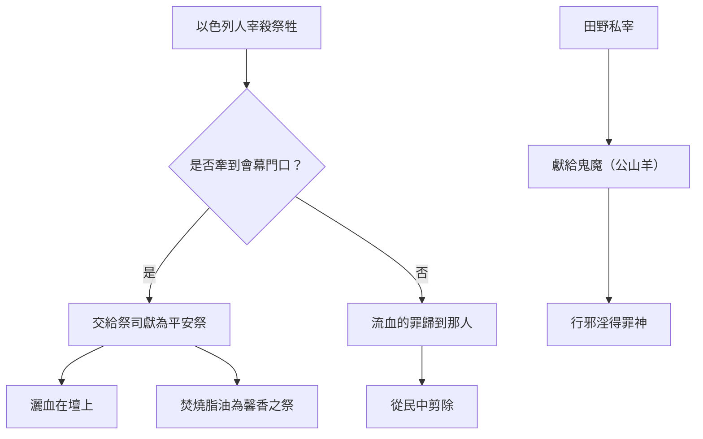

# 利未記 第17章

1. 耶和華對[[摩西]]說：
2. 你曉諭[[亞倫和他兒子（祭司）|亞倫和他兒子]]並以色列眾人說，耶和華所吩咐的乃是這樣：
3. 凡以色列家中的人宰公牛，或是綿羊羔，或是山羊，[[私宰祭牲須獻為平安祭的條例|不拘宰於營內營外]]，
4. 若未曾牽到[[會幕門口]]、耶和華的帳幕前獻給耶和華為供物，[[私宰祭牲須獻為平安祭的條例|流血的罪必歸到那人身上]]。他流了血，要從民中[[剪除（kareth）|剪除]]。
5. 這是為要使以色列人把他們在田野裡所獻的祭帶到[[會幕門口]]、耶和華面前，交給[[亞倫和他兒子（祭司）|祭司]]，獻與耶和華為[[平安祭（shelamim）|平安祭]]。
6. [[亞倫和他兒子（祭司）|祭司]]要把血灑在[[會幕門口]]、耶和華的壇上，把脂油焚燒，獻給耶和華為馨香的祭。
7. 他們不可再獻祭給他們[[鬼魔（se'irim，公山羊）|行邪淫所隨從的鬼魔]]（原文作公山羊）；這要作他們世世代代永遠的定例。
8. 你要曉諭他們說：凡以色列家中的人，或是寄居在他們中間的外人，獻燔祭或是[[平安祭（shelamim）|平安祭]]，
9. 若不帶到[[會幕門口]]獻給耶和華，那人必從民中[[剪除（kareth）|剪除]]。
10. 凡以色列家中的人，或是寄居在他們中間的外人，[[血的尊重|若吃什麼血]]，我必向那吃血的人變臉，把他從民中[[剪除（kareth）|剪除]]。
11. 因為[[血的尊重|活物的生命是在血中]]。我把這血賜給你們，可以在壇上為你們的生命贖罪；[[血的尊重|因血裡有生命，所以能贖罪]]。
12. 因此，我對以色列人說：你們都不可吃血；寄居在你們中間的外人也不可吃血。
13. 凡以色列人，或是寄居在他們中間的外人，若[[打獵放血用土掩蓋|打獵得了可吃的禽獸]]，必放出他的血來，[[打獵放血用土掩蓋|用土掩蓋]]。
14. 論到一切活物的生命，就在血中。所以我對以色列人說：無論什麼活物的血，你們都不可吃，因為一切活物的血就是他的生命。[[血的尊重|凡吃了血的，必被剪除]]。
15. [[吃自死或被撕裂之物的潔淨條例|凡吃自死的，或是被野獸撕裂的]]，無論是本地人，是寄居的，必不潔淨到晚上，都要洗衣服，用水洗身，到了晚上才為潔淨。
16. 但他若不洗衣服，也不洗身，[[吃自死或被撕裂之物的潔淨條例|就必擔當他的罪孽]]。

---

## 本章知識節點

### 神學
- [[血的尊重]]
- [[基督徒是否可吃血]]
- [[剪除（kareth）]]
- [[從民中剪除的含義]]
- [[平安祭（shelamim）]]
- [[馨香之氣]]

### 人物
- [[摩西]]
- [[亞倫和他兒子（祭司）]]

### 地點
- [[會幕門口]]

### 事件
- [[私宰祭牲須獻為平安祭的條例]]
- [[鬼魔（se'irim，公山羊）]]
- [[打獵放血用土掩蓋]]
- [[吃自死或被撕裂之物的潔淨條例]]

---

## 本章整理

### 宰殺祭牲必須在會幕門口（v1-7）
本章開頭，耶和華對 [[摩西]] 說話，吩咐他將命令傳達給 [[亞倫和他兒子（祭司）|亞倫和他兒子]] 並全體以色列人。這命令的核心是：凡宰殺公牛、綿羊羔或山羊，無論在營內或營外，都必須先將牲畜牽到 [[會幕門口]]，獻給耶和華為供物（v3-4）。若有人私自宰殺而不帶到會幕前，==「流血的罪必歸到那人身上」==，那人要從民中 [[剪除（kareth）|剪除]]（v4）。CT 指出，此處「流血的罪」是舊約中通稱殺人罪的用詞，神將妄自流血的罪歸到違命者身上。

這條例的目的，是為了防止百姓在田野間私自獻祭，轉而敬拜偶像。神定意要他們將祭牲帶到會幕門口，交給祭司，獻為 [[平安祭（shelamim）|平安祭]]（v5）。祭司要將血灑在會幕門口的壇上，並把脂油焚燒，成為獻給耶和華的 [[馨香之氣|馨香之祭]]（v6）。CT 解釋，血灑壇上是為贖罪，脂油焚燒是將祭牲的精華全然獻上；這教導屬神的人也當將生命中最上好的奉獻給神。

第7節特別點出這條例的屬靈爭戰背景：==「他們不可再獻祭給他們行邪淫所隨從的鬼魔」==。原文「鬼魔」作「公山羊」（[[鬼魔（se'irim，公山羊）|se'irim]]），是古時埃及、希臘等地敬拜的半人半羊偶像。CT 指出，以色列人在埃及時曾隨從這邪淫風俗，神藉此律例將他們從異教惡習中分別出來。GT（丁良才）補充，這條例僅限於曠野飄流時期，因全會眾集中一處容易執行；進入迦南地後，因居住分散，神另頒新律例取代（申十二20-28），但禁止拜偶像與吃血的核心原則始終不變。

### 禁止在會幕外獻祭與禁止吃血的命令（v8-14）
第8-9節將禁令擴展到寄居的外人：無論是以色列人還是寄居者，若獻燔祭或平安祭而不帶到會幕門口，那人必從民中剪除。這強化了敬拜必須以神所指定的方式與地點進行的原則。

第10節開始進入本章另一個核心主題：==嚴禁吃血==。神宣告：凡吃任何血的，祂必向那人變臉，將他從民中剪除（v10）。「變臉」在希伯來語境中意指發怒（CT 參創四5；彼前三12）。禁令的對象同樣涵蓋以色列人與寄居的外人。

第11節給出禁令的神學根基，也是全章最關鍵的宣告：==「因為活物的生命是在血中。我把這血賜給你們，可以在壇上為你們的生命贖罪；因血裡有生命，所以能贖罪。」==CT 闡明，血就是生命，沒有血就沒有生命；神將血賜給人，唯一用途是在壇上以祭牲的生命代替獻祭者的生命來贖罪。GT（丁良才）進一步指出，血表示贖罪之理最為適宜，祭牲的血預表主耶穌的寶血。BH 則從古代近東文化角度補充，當時人相信生命的精華在血中，但周邊異教並無禁吃血的規條，以色列的禁令顯出其獨特性。

第12-14節反覆重申禁令：無論何種活物的血都不可吃，因為血就是牠的生命；凡吃血的必被剪除。對於打獵所得的禽獸，必須 [[打獵放血用土掩蓋|放出牠的血來，用土掩蓋]]（v13）。CT 解釋，放血後掩埋土裡，免得血被吃掉，也表示生命歸回塵土。GT 補充，神吩咐用土掩蓋，或因留血在地面上使地污穢，且不雅觀、有礙衛生；也有人認為是免得血被野獸吃了。

> [!important] 本章樞紐
> 第11節是全章神學核心：血＝生命，神將血賜人單為贖罪之用。這既解釋了為何血必須灑在壇上歸給神（v1-9），也解釋了為何人不可吃血（v10-14）。兩條禁令同出一源。

| 禁令面向 | 經文範圍 | 對象 | 核心原則 |
|---------|---------|------|---------|
| 宰殺祭牲須在會幕門口 | v3-7 | 以色列人 | 防止私獻鬼魔，血歸神為贖罪 |
| 獻祭須在會幕門口 | v8-9 | 以色列人＋外人 | 統一敬拜，杜絕偶像 |
| 禁止吃血 | v10-12 | 以色列人＋外人 | 血是生命，單為贖罪 |
| 獵物放血掩埋 | v13-14 | 以色列人＋外人 | 尊重生命，血歸塵土 |

### 吃自死或被撕裂之物的潔淨條例（v15-16）
第15-16節處理誤吃未放血之肉的情況。凡吃自死的或被野獸撕裂的動物，無論本地人或寄居者，必不潔淨到晚上，要洗衣服、用水洗身，到了晚上才為潔淨（v15）。CT 指出，這兩類動物的肉可能血未流盡，吃的人因此沾染不潔。[[吃自死或被撕裂之物的潔淨條例|洗衣服]] 表徵潔淨行為，用水洗身表徵潔淨自己，晚上表徵新的起頭。若拒絕洗衣洗身，那人必擔當自己的罪孽（v16）。

GT（丁良才）補充，這條例是指誤吃而言；申十四21 記載，進入迦南後，這等肉可給未受割禮的外邦人吃或賣給他們，但受了割禮歸入猶太教的外人仍須遵守本條例。這顯示律法中對不同身分者的細緻區分。

### 跨章脈絡：血的神聖與基督的預表
本章的血律是利未記獻祭體系的核心支柱之一。從挪亞時代神就已禁止吃血（創九4），本章將這禁令與贖罪制度緊密結合。CT 的靈訓要義指出，血和脂油都是祭牲的精華，全然獻上給神；屬神的人也當將生命中最上好的奉獻給神。凡不是在基督贖罪的立場上享受基督，而是在這立場之外有所歡樂和享受的，都是行邪淫的原則，也都是得罪神的。

關於 [[基督徒是否可吃血]]，CT 明確指出，新約時代耶路撒冷會議仍向外邦教會申明：「禁戒祭偶像的物，和血，並勒死的牲畜和姦淫」（徒十五28-29；二十一25）。禁戒「勒死的牲畜」正是因為含有血在內。可見禁止吃血不僅是舊約的食物規律，在新約教會仍然須要遵守。KC 同樣強調，吃血或血腸之類的食物，對基督徒仍是禁止的。

> [!quote] CT 論血與生命
> 「照神的規定，血是為贖罪；人犯罪當死，所獻上的祭牲，經過獻祭的人按手在它頭上，就跟獻祭的人聯合，以它的生命，代替那人流血死亡……血是應當歸給神，正如脂油必須燒在壇上歸神一樣。脂油代表榮華，人不當自取榮耀，要把榮耀歸給神。血代表生命，人既然不能賜予生命，也不該取去生命，應該歸給神。」

> [!quote] KC 論信徒的交通
> 「平安祭是主耶穌的圖畫。祂是我們交通的中心與根基。我們蒙召進入祂兒子的交通（林前一9）。神不願祂的百姓在祂不在場的情況下彼此交通。對神而言，每一隻宰殺的牲畜都具有平安祭的性質。應用在我們身上：我們是否將每一份喜樂都與神和神的百姓分享？」

**參考資料**
https://www.ccbiblestudy.org/Old%20Testament/03Lev/03CT17.htm
https://www.ccbiblestudy.org/Old%20Testament/03Lev/03GT17.htm
https://www.kingcomments.com/en/bible-studies/Lev/17
https://biblehub.com/study/leviticus/17.htm
