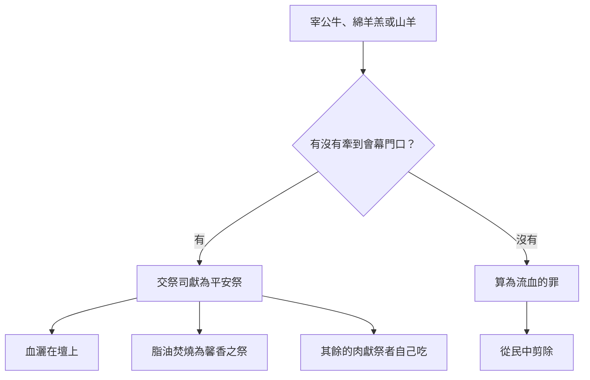

# 利未記 第17章

<!-- chapter-navigation:start -->
| [前一章](../03%20利未記/第16章.md) | [回目錄](../03%20利未記/全書目錄及綱要.md) | [下一章](../03%20利未記/第18章.md) |
| :--- | :---: | ---: |
<!-- chapter-navigation:end -->

1. 耶和華對[[摩西]]說：
2. 你曉諭[[亞倫和他兒子（祭司）|亞倫和他兒子]]並以色列眾人說，耶和華所吩咐的乃是這樣：
3. 凡以色列家中的人宰公牛，或是綿羊羔，或是山羊，[[私宰祭牲須獻為平安祭的條例|不拘宰於營內營外]]，
4. 若未曾牽到[[會幕門口]]、耶和華的帳幕前獻給耶和華為供物，[[私宰祭牲須獻為平安祭的條例|流血的罪必歸到那人身上]]。他流了血，要從民中[[剪除]]。
5. 這是為要使以色列人把他們在田野裡所獻的祭帶到[[會幕門口]]、耶和華面前，交給[[亞倫和他兒子（祭司）|祭司]]，獻與耶和華為[[平安祭]]。
6. [[亞倫和他兒子（祭司）|祭司]]要把血灑在[[會幕門口]]、耶和華的壇上，把脂油焚燒，獻給耶和華為馨香的祭。
7. 他們不可再獻祭給他們[[鬼魔（seirim，公山羊）|行邪淫所隨從的鬼魔]]（原文作公山羊）；這要作他們世世代代永遠的定例。
8. 你要曉諭他們說：凡以色列家中的人，或是寄居在他們中間的外人，獻燔祭或是[[平安祭]]，
9. 若不帶到[[會幕門口]]獻給耶和華，那人必從民中[[剪除]]。
10. 凡以色列家中的人，或是寄居在他們中間的外人，[[血的尊重|若吃什麼血]]，我必向那吃血的人變臉，把他從民中[[剪除]]。
11. 因為[[血的尊重|活物的生命是在血中]]。我把這血賜給你們，可以在壇上為你們的生命贖罪；[[血的尊重|因血裡有生命，所以能贖罪]]。
12. 因此，我對以色列人說：你們都不可吃血；寄居在你們中間的外人也不可吃血。
13. 凡以色列人，或是寄居在他們中間的外人，若[[打獵放血用土掩蓋|打獵得了可吃的禽獸]]，必放出他的血來，[[打獵放血用土掩蓋|用土掩蓋]]。
14. 論到一切活物的生命，就在血中。所以我對以色列人說：無論什麼活物的血，你們都不可吃，因為一切活物的血就是他的生命。[[血的尊重|凡吃了血的，必被剪除]]。
15. [[吃自死或被撕裂之物的潔淨條例|凡吃自死的，或是被野獸撕裂的]]，無論是本地人，是寄居的，必不潔淨到晚上，都要洗衣服，用水洗身，到了晚上才為潔淨。
16. 但他若不洗衣服，也不洗身，[[吃自死或被撕裂之物的潔淨條例|就必擔當他的罪孽]]。

---

## 本章知識節點

### 主題
- [[私宰祭牲須獻為平安祭的條例]]
- [[打獵放血用土掩蓋]]
- [[吃自死或被撕裂之物的潔淨條例]]

### 原文
- [[鬼魔（seirim，公山羊）]]
- [[剪除]]
- [[平安祭]]

### 神學
- [[血的尊重]]
- [[馨香之氣]]

### 解經爭議
- [[基督徒是否可吃血]]
- [[從民中剪除的含義]]

### 背景
- [[古代近東的血觀念與獻祭差異]]

### 人物
- [[摩西]]
- [[亞倫和他兒子（祭司）]]

### 地點
- [[會幕門口]]

---

## 本章整理

### 這一章在利未記裡的位置（v1-2）

丁良才用一句話把前後分開：==「第十六章論會眾稱義，十七至二十章論個人成聖。」== 前一章講的是一年一次為全會眾除罪，從本章起，神轉而吩咐以色列人在平時所行的事上都要聖潔。《啟導本》的定位相近：本章是利未記1至7章條例的補充，和16章緊密相連，講與祭牲和牲血有關的四種情況。

開頭的說話對象也不尋常。丁良才整理過本書神曉諭的八種格式，指出這一次「耶和華卻對摩西說，你曉諭亞倫和他兒子，並以色列眾人」——大祭司、眾祭司、眾百姓三方全被點名，「這樣看來，這些條例與大祭司，眾祭司和眾百姓是都有關係的」。他並注意到「耶和華所吩咐的乃是這樣」這個說法，是耶和華特意叮囑摩西使用的，要讓百姓知道底下的條例是最要緊的。

### 宰牲必須帶到會幕門口（v3-7）

凡宰公牛、綿羊羔或山羊，不拘營內營外，都要牽到 [[會幕門口]] 獻給耶和華，否則==「流血的罪必歸到那人身上」==，那人要從民中 剪除。CT 說明這裡的「流血的罪」是舊約通稱殺人罪的用詞。GT《舊約聖經背景註釋》補上當時的想法：這條禁令「能避免在聖所以外殺牲的血可以視作取悅冥界神祇的想法」。

這條例要防的是什麼，第7節自己說了：==「他們不可再獻祭給他們行邪淫所隨從的鬼魔」==。「鬼魔」原文作 [[鬼魔（seirim，公山羊）|公山羊]]。丁良才指出「這一句顯明以色列人中先前曾有人獻了」，而埃及人敬拜公山羊「多用最醜陋、最邪淫的禮節」。李道生《舊約聖經問題總解》把這個字說得更細：原文字音是 Seirim，「其原意是眾公山羊，乃為希臘，羅馬之林神，或稱為野山羊 Wild Goat（賽十三21，卅四14）」。BH 則點出這類神祇在近東常與生育和混沌相連。

丁良才另處理了一個實務上的疑問：以色列人這麼多，為吃肉所宰的牲畜必定極多，怎麼可能全部牽到會幕？他給了五層理由：

1. 以色列人作埃及人的奴僕多年，難以自己牧養牛羊，因此牛羊不很多。
2. 他們不是每日吃肉的，唯獨逢節期和快樂的時候才吃——曠野裡他們屢次埋怨沒有肉、只有嗎哪。
3. 本段條例只關係牛羊，打獵所得的禽獸不在其內。
4. 這條例是為特別的緣故定的（就是第5、7節所說的私獻鬼魔）。
5. 這條例只為以色列人在曠野的時候定的，到了迦南神就取消了。

《利未記雷氏研讀本》從另一頭支持同一個判斷：這樣做並不是把麻煩加諸百姓身上，「因為肉不是日常食用的食品，而是節日才有的佳餚」。

CT 把這條例的用意列成四項：防止偷吃血、防止私自獻祭給偶像假神、防止被異教邪淫風俗同化、鼓勵獻平安祭感恩（平安祭 的祭肉大部分仍歸獻祭者享用）。CT 並指出，這條例僅限曠野飄流時期全會眾集中一地時容易執行，進入迦南後居所分散礙難執行，故另頒新律例取代（申12:20-28）；《串珠》給的對應經文是申12:20-24。

```mermaid
flowchart TD
  A["宰公牛、綿羊羔或山羊"] --> B{"有沒有牽到會幕門口？"}
  B -- 有 --> C["交祭司獻為平安祭"]
  C --> D["血灑在壇上"]
  C --> E["脂油焚燒為馨香之祭"]
  C --> F["其餘的肉獻祭者自己吃"]
  B -- 沒有 --> G["算為流血的罪"]
  G --> H["從民中剪除"]
```

### 獻祭的地點與吃血的禁令（v8-14）

第8-9節把規定擴及寄居的外人：獻燔祭或平安祭都必須帶到會幕門口。丁良才在這裡提醒一個譯文細節——==原文沒有「平安」兩個字==，所以這兩句其實包括燔祭和一切別的血祭，文理譯本作「或獻燔祭或獻他祭」。他也分清兩段的適用範圍：2至7節是論為吃肉宰牲畜，寄居的外人不必把要吃的牛羊牽到會幕；8至9節論獻祭，外人要獻就必須照以色列人的條例。

第10節起轉入吃血。神說「我必向那吃血的人變臉」——CT 指出「變臉」就是發怒。第11節是全章的樞紐：

> [!important] 本章樞紐
> 「因為活物的生命是在血中。我把這血賜給你們，可以在壇上為你們的生命贖罪；因血裡有生命，所以能贖罪。」（v11）

丁良才由此推出兩件事：一是聖經有時以血和生命互相易位（詩30:9「我被害流血」就是「我被害喪命」的意思）；二是祭牲的血是祭牲的生命，神定這血為代替罪人生命之用，所以來9:22 說若不流血罪就不得赦免。《啟導本》把原則講得更直白：血能贖罪主要是根據以命抵命，血既是生命的代表，祭牲流血是無辜生命的犧牲，以抵償犯罪的人應受的刑罰。同一份來源另從生理層面說明血為何是生命之源——血中含有細胞，供應體肌生長的養料、抗生素、賀爾蒙等等。

各家對「為什麼禁止吃血」給的理由不完全一樣，並排會更清楚：

| 來源 | 給的理由 |
|------|----------|
| GT《靈修版聖經注釋》（CT 背景註解同） | 與周圍各族分別（異教徒以為吃血可吸取動物精華）、保持獻祭的象徵性、免受疾病傳染 |
| GT《舊約聖經背景註釋》 | 食血等於吸取另一生物的生命力、或使生命力消散；生命必須獻回它所從出的神那裡 |
| GT《聖經精讀本》 | 血象徵生命，吃血就是吃生命、消滅生命；一切生命都是神所造、屬於神 |
| KC | 生命在血中，而生命屬於神；我們不吃血，就是承認神對生命的權利 |

### 獵物的血與誤吃自死之物（v13-16）

打獵得的禽獸不能獻祭，血仍不可吃：必須 [[打獵放血用土掩蓋|放出牠的血來，用土掩蓋]]。丁良才列出幾種理解——留血在地面使地被污穢、不雅觀、有礙衛生，或免得血被野獸吃了，也可能是表示歸土的意思；《啟導本》寫成「生命來自塵土，也回到塵土」；BH 則說掩蓋是對所取之生命的敬重，象徵生命歸回人受造所出的塵土。

末兩節處理 [[吃自死或被撕裂之物的潔淨條例|誤吃自死或被撕裂之物]]：要洗衣服、用水洗身，不潔淨到晚上；不洗的就必擔當他的罪孽。丁良才在這裡解開一個表面矛盾：本節的「寄居的」是指受了割禮、入了猶太教的外人，而申14:21 准許把這種肉給外人吃或賣給他們，說的是沒有受割禮、寄居在以色列人中的外人——兩處對象不同，所以不衝突。CT 補一句：這兩類動物的血沒有流盡，吃的人才因此沾染不潔。

### 原文層：STEP Bible 能確認的幾個字

- **「生命」在第11節出現三次，原文是同一個字。**「活物的生命」「你們的生命」「血裡有生命」用的都是 同一個名詞，STEP 的簡要義域作 soul／life。以命抵命這個讀法，在原文層有一個很直接的支點：兩邊的「命」本來就是同一個詞。
- **「贖罪」的動詞在同一節出現兩次**，簡要義域作 to atone。BH 指出這個字「意思是遮蓋或使和好，表示血是罪的遮蓋」。
- **「我必…把他從民中剪除」的動詞是第一人稱、使役語幹**——動作的執行者是神自己。這與 GT《舊約聖經背景註釋》所說「不是說要對犯人採取任何司法或社會性的行動，而是靜待神的作為」相合。
- **第7節的「鬼魔」與利16:8 的「公山羊」同一個基本 Strong 編號**，分屬兩個變體：本章這個逐字譯作「羊形偶像」，利16 那個逐字譯作「公山羊」。CT 在利16 談阿撒瀉勒時所說「那裡的鬼魔，原文是『公山羊』」，指的就是這件事。
- **第10節「變臉」直譯是「我要把我的臉放在那吃血的人身上」**，與 CT 所給的原文字義（雙字：給、置、放＋面、臉）一致。

### 跨章脈絡：從挪亞到耶路撒冷會議

血的禁令不是從本章開始的。《聖經精讀本》指出本章提到的血從挪亞時代就已經出現（創9:4-6），彰顯神視被造物極其寶貴；《串珠》同樣上溯創9:4，並指出正因神使血成為贖罪的工具，連不適宜作祭牲的動物的血都要鄭重處理。

往後看，CT 明確指出新約時代耶路撒冷會議仍向外邦教會申明：「聖靈和我們定意不將別的重擔放在你們身上，惟有幾件事是不可少的，就是禁戒祭偶像的物，和血，並勒死的牲畜和姦淫」（徒15:28-29；21:25），而禁戒「勒死的牲畜」正是因為含有血在內——CT 由此主張[[基督徒是否可吃血|禁止吃血在新約教會仍然須要遵守]]。KC 說法一致：吃血或血腸之類的食物，對基督徒仍是禁止的。丁良才也記下同一件事，並補上一個實際的理由：寄居的外人也不可吃血，「免得以色列人因他們的引誘違背本節的命令」。

獻祭地點的規定則走了相反的路。丁良才指出神有時特准人在別處獻祭（士2:5、6:26、13:19；撒上11:15、16:5；撒下6:12；王上18:22-24、31-32），這條「在一處獻祭」的條例要到所羅門建造聖殿時以色列人才嚴格地守了；而後來所羅門自己受外邦女子引誘干犯主怒，耶羅波安更是違背這條例使以色列人犯罪。同一條律法，一邊延伸到新約仍然有效，一邊在舊約之內就被取消——差別在於前者的根據是「生命屬於神」，後者的根據是當時當地的處境。

KC 從另一個角度收尾：本章要求把每一次宰牲都獻為 平安祭，意思是==神不願祂的百姓在祂不在場的情況下彼此交通==。牠讀林前1:9「我們蒙召進入祂兒子的交通」時強調，正確的譯法不是「與基督交通」而是「基督的交通」——交通的特質由祂決定。牠並舉路加15章的大兒子作反例：他想要一隻山羊羔，好單獨與朋友快樂，卻不要父親在場，「這正是他那種慶祝方式的惡處」。牠又引林前10:18-20，指出保羅正是拿以色列人在壇前吃祭物來提醒哥林多人不要與鬼魔相交。與16章一年一次的贖罪日不同，這種交通是每一天的事。

**參考資料**
https://www.ccbiblestudy.org/Old%20Testament/03Lev/03CT17.htm
https://www.ccbiblestudy.org/Old%20Testament/03Lev/03GT17.htm
https://www.kingcomments.com/en/bible-studies/Lev/17
https://biblehub.com/study/leviticus/17.htm
https://github.com/STEPBible/STEPBible-Data

<!-- chapter-navigation:start -->
| [前一章](../03%20利未記/第16章.md) | [回目錄](../03%20利未記/全書目錄及綱要.md) | [下一章](../03%20利未記/第18章.md) |
| :--- | :---: | ---: |
<!-- chapter-navigation:end -->
