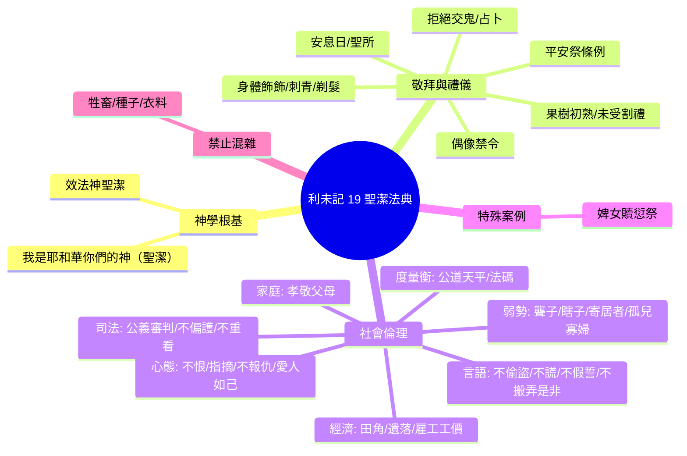

# 利未記 第19章

1. 耶和華對[[摩西]]說：
2. 你曉諭[[以色列全會眾]]說：[[聖潔|你們要聖潔]]，因為我耶和華─你們的神是聖潔的。
3. 你們各人都[[當孝敬父母]]，也要守我的[[安息日]]。我是耶和華─你們的神。
4. 你們不可[[不可偏向虛無的神與鑄造神像|偏向虛無的神]]，也不可為自己鑄造神像。我是耶和華─你們的神。
5. 你們獻平安祭給耶和華的時候，要獻得可蒙悅納。
6. 這祭物要在獻的那一天和第二天吃，若有剩到第三天的，就必用火焚燒。
7. 第三天若再吃，這就為[[可憎（sheqets）|可憎惡的]]，必不蒙悅納。
8. 凡吃的人必擔當他的罪孽；因為他褻瀆了耶和華的聖物，那人必從民中[[剪除（kareth）|剪除]]。
9. 在你們的地收割莊稼，[[留田角與遺落給窮人寄居者|不可割盡田角]]，也不可拾取所[[田角條例|遺落]]的。
10. 不可摘盡葡萄園的果子，也不可拾取葡萄園所掉的果子；要留給窮人和[[寄居的（ger）|寄居的]]。我是耶和華─你們的神。
11. 你們[[不可偷盜欺騙說謊|不可偷盜]]，[[不可偷盜欺騙說謊|不可欺騙]]，也[[不可偷盜欺騙說謊|不可彼此說謊]]。
12. 不可[[不可指神名起假誓褻瀆神名|指著我的名起假誓]]，[[不可指神名起假誓褻瀆神名|褻瀆你神的名]]。我是耶和華。
13. 不可欺壓你的鄰舍，也[[不可欺壓鄰舍搶奪與雇工工價不過夜|不可搶奪]]他的物。[[雇工工價|雇工人的工價]]，不可在你那裡過夜，留到早晨。
14. [[不可咒罵聾子與絆腳石放在瞎子面前|不可咒罵聾子]]，也[[不可咒罵聾子與絆腳石放在瞎子面前|不可將絆腳石放在瞎子面前]]，只要敬畏你的神。我是耶和華。
15. 你們施行審判，不可行不義；[[審判不可行不義偏護窮人重看有勢力|不可偏護窮人]]，也[[審判不可行不義偏護窮人重看有勢力|不可重看有勢力的人]]，只要[[審判不可行不義偏護窮人重看有勢力|按著公義審判]]你的鄰舍。
16. 不可在民中往來搬弄是非，也[[不可搬弄是非與不可與鄰舍為敵置之於死|不可與鄰舍為敵]]，[[不可搬弄是非與不可與鄰舍為敵置之於死|置之於死]]（原文作[[不可搬弄是非與不可與鄰舍為敵置之於死|流他的血]]）。我是耶和華。
17. [[不可心裡恨弟兄要指摘鄰舍免得擔罪|不可心裡恨你的弟兄]]；[[不可心裡恨弟兄要指摘鄰舍免得擔罪|總要指摘你的鄰舍]]，免得因他擔罪。
18. [[不可報仇埋怨要愛人如己|不可報仇]]，也[[不可報仇埋怨要愛人如己|不可埋怨]]你本國的子民，卻要愛人如己。我是耶和華。
19. 你們要守我的律例。不可叫你的牲畜與[[混雜條例|異類配合]]；不可用兩樣[[混雜條例|攙雜的種]]種你的地，也[[禁止混雜條例（牲畜種地衣服）|不可用兩樣攙雜的料做衣服]]穿在身上。
20. [[婢女許配未贖身行淫條例|婢女許配了丈夫]]，[[婢女許配未贖身行淫條例|還沒有被贖、得釋放]]，人若與他行淫，二人要受刑罰，卻不把他們治死，因為婢女還沒有得自由。
21. 那人要把[[婢女許配未贖身行淫條例|贖愆祭]]，就是一隻[[婢女許配未贖身行淫條例|公綿羊]]牽到會幕門口、耶和華面前。
22. 祭司要用[[婢女許配未贖身行淫條例|贖愆祭]]的羊在耶和華面前贖他所犯的罪，他的罪就必蒙赦免。
23. 你們到了[[迦南地]]，栽種各樣結果子的樹木，就要以所結的果子[[未受割禮（arel）|如未受割禮]]的一樣。三年之久，你們要以這些果子，如未受割禮的，是不可吃的。
24. 但第四年所結的果子全要成為聖，用以讚美耶和華。
25. 第五年，你們要吃那樹上的果子，好叫樹給你們結果子更多。我是耶和華─你們的神。
26. 你們[[不可吃帶血的物與法術觀兆|不可吃帶血的物]]；[[不可吃帶血的物與法術觀兆|不可用法術]]，也[[不可吃帶血的物與法術觀兆|不可觀兆]]。
27. 頭的周圍（周圍或作：兩鬢）不可剃，鬍鬚的周圍也不可損壞。
28. [[不可為死人用刀劃身與刺花紋|不可為死人用刀劃身]]，也[[不可為死人用刀劃身與刺花紋|不可在身上刺花紋]]。我是耶和華。
29. [[不可辱沒女兒使為娼妓|不可辱沒你的女兒]]，[[不可辱沒女兒使為娼妓|使他為娼妓]]，恐怕地上的人專向淫亂，地就滿了大惡。
30. 你們要守我的[[安息日]]，敬我的[[聖所]]。我是耶和華。
31. 不可偏向那些交鬼的和行[[占卜|巫術]]的；不可[[不可偏向交鬼行巫術的|求問他們]]，以致被他們玷污了。我是耶和華─你們的神。
32. 在白髮的人面前，你要[[白髮人面前站起尊敬老人|站起來]]；也要[[白髮人面前站起尊敬老人|尊敬老人]]，又要敬畏你的神。我是耶和華。
33. 若有外人在你們國中和你同居，就不可欺負他。
34. 和你們同居的外人，你們要看他如本地人一樣，並要愛他如己，因為你們在[[埃及地]]也作過[[寄居的（ger）|寄居的]]。我是耶和華─你們的神。
35. 你們施行審判，不可行不義；在[[度量衡|尺]]、[[度量衡|秤]]、[[度量衡|升]]、[[度量衡|斗]]上也是如此。
36. 要用公道天平、公道法碼、公道[[度量衡|升]][[度量衡|斗]]、公道[[度量衡|秤]]。我是耶和華─你們的神，曾把你們從[[埃及地]]領出來的。
37. 你們要謹守遵行我一切的[[謹守遵行一切律例典章|律例典章]]。我是耶和華。

---

## 本章知識節點

### 神學
- [[聖潔]]
- [[聖潔生活總綱（利19：1-2）]]
- [[愛人如己]]
- [[公義審判]]
- [[偶像崇拜]]
- [[占卜]]
- [[剪除（kareth）]]
- [[寄居的（ger）]]
- [[未受割禮（arel）]]
- [[安息日]]
- [[聖所]]
- [[迦南地]]
- [[摩西]]
- [[當孝敬父母]]
- [[可憎（sheqets）]]

### 律法與倫理
- [[孝敬父母與守安息日並列]]
- [[不可偏向虛無的神與鑄造神像]]
- [[平安祭獻得可蒙悅納條例]]
- [[不可指神名起假誓褻瀆神名]]
- [[不可欺壓鄰舍搶奪與雇工工價不過夜]]
- [[不可咒罵聾子與絆腳石放在瞎子面前]]
- [[審判不可行不義偏護窮人重看有勢力]]
- [[不可搬弄是非與不可與鄰舍為敵置之於死]]
- [[婢女許配未贖身行淫條例]]
- [[栽種果樹前三年如未受割禮不可吃]]
- [[頭周圍不可剃鬍鬚周圍不可損壞]]
- [[不可為死人用刀劃身與刺花紋]]
- [[不可辱沒女兒使為娼妓]]
- [[不可偏向交鬼行巫術的]]
- [[白髮人面前站起尊敬老人]]
- [[不可欺負寄居者要愛寄居者如己]]
- [[謹守遵行一切律例典章]]
- [[以色列全會眾]]
- [[法術與觀兆]]
- [[田角條例]]
- [[雇工工價]]
- [[指摘鄰舍]]
- [[混雜條例]]
- [[賣淫]]
- [[度量衡]]
- [[留田角與遺落給窮人寄居者]]
- [[不可偷盜欺騙說謊]]
- [[不可心裡恨弟兄要指摘鄰舍免得擔罪]]
- [[不可報仇埋怨要愛人如己]]
- [[禁止混雜條例（牲畜種地衣服）]]
- [[不可吃帶血的物與法術觀兆]]
- [[守安息日敬畏聖所]]
- [[審判度量衡不可行不義]]
- [[埃及地]]
- [[刺青]]

---

## 本章整理

### 聖潔的呼召與核心原則（v1-2）
耶和華透過[[摩西]]向[[以色列全會眾]]宣告[[聖潔生活總綱（利19：1-2）|聖潔生活總綱]]：「你們要聖潔，因為我耶和華─你們的神是聖潔的。」這句話確立了全章的神學基調：[[聖潔]]不僅是禮儀潔淨，更是模倣神屬性的倫理命令，貫徹於敬拜、社會、經濟與個人生活的每一細節。

### 家庭、敬拜與祭儀條例（v3-8）
經文隨即將聖潔具體化：[[孝敬父母與守安息日並列|孝敬父母與守安息日並列]]（v3），並嚴禁[[不可偏向虛無的神與鑄造神像|偏向虛無的神與鑄造神像]]（v4）。關於[[平安祭獻得可蒙悅納條例|平安祭]]，規定必須在獻祭當天與第二天吃盡，第三天剩餘必須焚燒；若第三天吃，便成[[可憎（sheqets）|可憎惡]]之物，吃的人必[[剪除（kareth）|擔當罪孽、從民中剪除]]（v5-8），顯示敬拜態度直接關係立約關係的存續。

### 社會公義與弱勢關懷（v9-18）
這一大段是本章社會倫理的高峰。
- **經濟正義**：[[田角條例|田角條例]]與[[留田角與遺落給窮人寄居者|留田角與遺落給窮人寄居者]]（v9-10），保障[[寄居的（ger）|寄居者]]與窮人的生存權。
- **誠信與言語**：[[不可偷盜欺騙說謊|不可偷盜、欺騙、說謊]]（v11），[[不可指神名起假誓褻瀆神名|不可指神名起假誓褻瀆神名]]（v12）。
- **勞工權益**：[[不可欺壓鄰舍搶奪與雇工工價不過夜|雇工工價不可過夜]]（v13），體現神對弱勢勞工的保護。
- **殘障友善**：[[不可咒罵聾子與絆腳石放在瞎子面前|不可咒罵聾子、不可放絆腳石絆瞎子]]（v14），核心是「要敬畏你的神」。
- **司法公正**：[[審判不可行不義偏護窮人重看有勢力|審判不可行不義、偏護窮人、重看有勢力]]，唯按[[公義審判|公義]]審判鄰舍（v15）。
- **社區關係**：[[不可搬弄是非與不可與鄰舍為敵置之於死|不可搬弄是非、不可與鄰舍為敵置之於死]]（v16）。
- **內心態度與對質**：[[不可心裡恨弟兄要指摘鄰舍免得擔罪|不可心裡恨弟兄，要指摘鄰舍免得擔罪]]（v17）；[[不可報仇埋怨要愛人如己|不可報仇、埋怨，卻要愛人如己]]（v18），這是[[愛人如己]]的經典出處，被耶穌視為律法的總綱。

### 禁止混雜與聖潔分別（v19）
[[禁止混雜條例（牲畜種地衣服）|禁止混雜條例]]涵蓋牲畜配合、田地播種、衣服料料三大領域，象徵以色列作為聖潔子民，在受造秩序中保持獨特身分，不與周圍列國混雜。

### 特殊案例：婢女贖愆祭（v20-22）
針對[[婢女許配未贖身行淫條例|婢女許配未贖身行淫]]的特殊情況，律法規定不處死刑（因非自由身），但犯罪者須帶[[婢女許配未贖身行淫條例|贖愆祭]]到會幕門口，由祭司代贖得赦免，顯示律法在公義與憐憫間的張力。

### 果樹初熟與飲食禁忌（v23-26）
進入[[迦南地]]栽種果樹，前三年視為[[未受割禮（arel）|未受割禮]]不可吃（v23）；第四年果子歸耶和華為聖（v24）；第五年才可食用，以增收成（v25）。隨後重申[[不可吃帶血的物與法術觀兆|不可吃血、不可行法術觀兆]]（v26），強調生命屬神與拒絕異教占卜。

### 身體飾飾與靈性界限（v27-31）
- [[頭周圍不可剃鬍鬚周圍不可損壞|頭周圍不可剃、鬍鬚周圍不可損壞]]（v27）。
- [[不可為死人用刀劃身與刺花紋|不可為死人劃身、不可刺花紋]]（v28），即今之[[刺青]]禁令，切斷哀悼崇拜與異教身份標記。
- [[不可辱沒女兒使為娼妓|不可辱沒女兒使為娼妓]]（v29），防止[[賣淫]]污染全地。
- [[守安息日敬畏聖所|守安息日、敬畏聖所]]（v30）。
- [[不可偏向交鬼行巫術的|不可偏向交鬼行巫術的]]（v31），拒絕[[法術與觀兆|法術與觀兆]]與[[占卜|占卜]]。

### 社會倫理：尊老、愛寄居、誠實度量衡（v32-37）
- [[白髮人面前站起尊敬老人|白髮人面前站起、尊敬老人]]，並敬畏神（v32）。
- [[不可欺負寄居者要愛寄居者如己|不可欺負寄居者，要愛寄居者如己]]，理由是「你們在[[埃及地]]也作過寄居的」（v33-34），以救恩歷史為倫理動力。
- [[審判度量衡不可行不義|審判與度量衡不可行不義]]，要用公道天平、法碼、升斗（v35-36）。
- 總結：[[謹守遵行一切律例典章|謹守遵行一切律例典章]]（v37）。

> [!note] 關鍵神學張力
> 本章將「儀式律」（祭物、割禮、安息日、混雜）與「道德律」（公義、愛鄰舍、誠實、保護弱勢）交織無間。[[聖潔]]的定義由此從「分別為聖」擴展為「模倣神的公義慈愛」，成為新約「愛人如己」與「完全律法」的舊約根基。

### 跨章脈絡：聖潔法典的倫理高峰與新約回響
利未記 19 章是「聖潔法典」（利 17-26 章）的倫理核心。它將西奈之約的十誡內在化、社會化：安息日、孝敬父母、不可殺人（不可置鄰舍於死）、不可姦淫（婢女案）、不可偷盜、不可作假見證、不可貪婪（公道度量衡）皆在此得具體展開。[[愛人如己]]（v18) 與 [[不可欺負寄居者要愛寄居者如己|愛寄居者如己]]（v34) 雙重命令，奠定了聖經「鄰舍神學」的基石，直接被主耶穌引為「律法和先知一切道理的總綱」（太 22:39-40），並成為保羅「愛人的就完全了律法」（羅 13:8）的神學依據。本章展示的聖潔，不是修道院式的隔離，而是在市井、法庭、田地、家庭中活出神公義慈愛屬性的見證人生。

**參考資料**
https://www.ccbiblestudy.org/Old%20Testament/03Lev/03CT19.htm
https://www.ccbiblestudy.org/Old%20Testament/03Lev/03GT19.htm
https://www.kingcomments.com/en/bible-studies/Lev/19
https://biblehub.com/study/leviticus/19.htm
