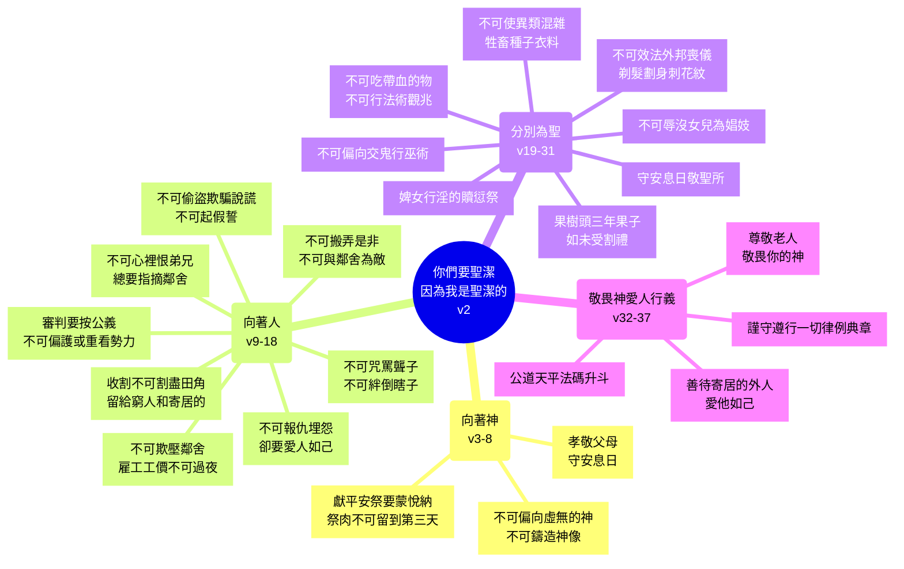

# 利未記 第19章

1. 耶和華對[[摩西]]說：
2. 你曉諭以色列全會眾說：[[你們要聖潔因為我是聖潔的|你們要聖潔，因為我耶和華─你們的神是聖潔的]]。
3. [[當孝敬父母|你們各人都當孝敬父母]]，也要守我的[[安息日]]。我是耶和華─你們的神。
4. [[不可為自己雕刻偶像|你們不可偏向虛無的神]]，[[不可為自己雕刻偶像|也不可為自己鑄造神像]]。我是耶和華─你們的神。
5. 你們獻[[平安祭（shelamim）|平安祭]]給耶和華的時候，要獻得可蒙悅納。
6. 這祭物要在獻的那一天和第二天吃，若有剩到第三天的，就必用火焚燒。
7. 第三天若再吃，這就為可憎惡的，必不蒙悅納。
8. 凡吃的人必擔當他的罪孽；因為他褻瀆了耶和華的聖物，那人必從民中剪除。
9. 在你們的地收割莊稼，[[田角拾穗顧念窮人的條例|不可割盡田角]]，[[田角拾穗顧念窮人的條例|也不可拾取所遺落的]]。
10. 不可摘盡葡萄園的果子，也不可拾取葡萄園所掉的果子；[[田角拾穗顧念窮人的條例|要留給窮人和寄居的]]。我是耶和華─你們的神。
11. [[不可偷盜|你們不可偷盜]]，不可欺騙，也不可彼此說謊。
12. [[不可妄稱耶和華你神的名|不可指著我的名起假誓]]，褻瀆你神的名。我是耶和華。
13. [[不可欺壓鄰舍雇工工價不可過夜|不可欺壓你的鄰舍]]，也不可搶奪他的物。[[不可欺壓鄰舍雇工工價不可過夜|雇工人的工價，不可在你那裡過夜，留到早晨]]。
14. [[不可咒罵聾子絆倒瞎子|不可咒罵聾子]]，也[[不可咒罵聾子絆倒瞎子|不可將絆腳石放在瞎子面前]]，只要敬畏你的神。我是耶和華。
15. [[審判不可行不義按公義審判|你們施行審判，不可行不義]]；不可偏護窮人，也不可重看有勢力的人，[[審判不可行不義按公義審判|只要按著公義審判你的鄰舍]]。
16. [[不可搬弄是非不可與鄰舍為敵|不可在民中往來搬弄是非]]，也不可與鄰舍為敵，置之於死（原文作流他的血）。我是耶和華。
17. [[不可心裡恨弟兄總要指摘鄰舍|不可心裡恨你的弟兄]]；[[不可心裡恨弟兄總要指摘鄰舍|總要指摘你的鄰舍，免得因他擔罪]]。
18. [[利19：18|不可報仇]]，也不可埋怨你本國的子民，[[利19：18|卻要愛人如己]]。我是耶和華。
19. 你們要守我的律例。[[不可使異類混雜（牲畜種子衣料）|不可叫你的牲畜與異類配合]]；不可用兩樣攙雜的種種你的地，也[[不可使異類混雜（牲畜種子衣料）|不可用兩樣攙雜的料做衣服穿在身上]]。
20. [[婢女行淫的贖愆祭條例|婢女許配了丈夫，還沒有被贖、得釋放]]，人若與他行淫，二人要受刑罰，卻不把他們治死，因為婢女還沒有得自由。
21. [[婢女行淫的贖愆祭條例|那人要把贖愆祭，就是一隻公綿羊牽到會幕門口、耶和華面前]]。
22. 祭司要用贖愆祭的羊在耶和華面前贖他所犯的罪，他的罪就必蒙赦免。
23. 你們到了迦南地，栽種各樣結果子的樹木，[[迦南地栽種果樹頭三年果子如未受割禮的條例|就要以所結的果子如未受割禮的一樣]]。三年之久，你們要以這些果子，如未受割禮的，是不可吃的。
24. [[迦南地栽種果樹頭三年果子如未受割禮的條例|但第四年所結的果子全要成為聖，用以讚美耶和華]]。
25. 第五年，你們要吃那樹上的果子，好叫樹給你們結果子更多。我是耶和華─你們的神。
26. [[血的尊重|你們不可吃帶血的物]]；[[不可行法術觀兆|不可用法術，也不可觀兆]]。
27. [[不可效法外邦喪儀習俗（剃髮劃身刺花紋）|頭的周圍]]（周圍或作：兩鬢）不可剃，鬍鬚的周圍也不可損壞。
28. [[不可效法外邦喪儀習俗（剃髮劃身刺花紋）|不可為死人用刀劃身，也不可在身上刺花紋]]。我是耶和華。
29. [[不可辱沒女兒使她為娼妓|不可辱沒你的女兒，使他為娼妓]]，恐怕地上的人專向淫亂，地就滿了大惡。
30. 你們要守我的[[安息日]]，敬我的聖所。我是耶和華。
31. [[不可偏向交鬼行巫術的|不可偏向那些交鬼的和行巫術的]]；不可求問他們，以致被他們玷污了。我是耶和華─你們的神。
32. [[尊敬老人|在白髮的人面前，你要站起來]]；[[尊敬老人|也要尊敬老人]]，又要敬畏你的神。我是耶和華。
33. 若有外人在你們國中和你同居，[[善待寄居的外人愛他如己|就不可欺負他]]。
34. 和你們同居的外人，[[善待寄居的外人愛他如己|你們要看他如本地人一樣，並要愛他如己]]，因為你們在埃及地也作過寄居的。我是耶和華─你們的神。
35. 你們施行審判，不可行不義；在尺、秤、升、斗上也是如此。
36. [[公道天平法碼升斗|要用公道天平、公道法碼、公道升斗、公道秤]]。我是耶和華─你們的神，曾把你們從埃及地領出來的。
37. 你們要謹守遵行我一切的律例典章。我是耶和華。

---

## 本章知識節點

### 主題
- [[你們要聖潔因為我是聖潔的]]
- [[田角拾穗顧念窮人的條例]]
- [[不可欺壓鄰舍雇工工價不可過夜]]
- [[不可咒罵聾子絆倒瞎子]]
- [[審判不可行不義按公義審判]]
- [[不可搬弄是非不可與鄰舍為敵]]
- [[不可心裡恨弟兄總要指摘鄰舍]]
- [[不可使異類混雜（牲畜種子衣料）]]
- [[婢女行淫的贖愆祭條例]]
- [[迦南地栽種果樹頭三年果子如未受割禮的條例]]
- [[不可行法術觀兆]]
- [[不可效法外邦喪儀習俗（剃髮劃身刺花紋）]]
- [[不可辱沒女兒使她為娼妓]]
- [[不可偏向交鬼行巫術的]]
- [[尊敬老人]]
- [[善待寄居的外人愛他如己]]
- [[公道天平法碼升斗]]

### 神學
- [[當孝敬父母]]
- [[安息日]]
- [[不可為自己雕刻偶像]]
- [[平安祭（shelamim）]]
- [[不可偷盜]]
- [[不可妄稱耶和華你神的名]]
- [[利19：18]]
- [[摩西]]
- [[血的尊重]]

---

## 本章整理

### 聖潔生活的總綱（v1-2）
本章是利未記中極獨特的一章：耶和華吩咐摩西「你曉諭以色列全會眾說」，全體百姓都是受話對象，不像前幾章以祭司為主要聽眾。總綱只有一句——「[[你們要聖潔因為我是聖潔的|你們要聖潔，因為我耶和華你們的神是聖潔的]]」（v2）。CT 指出，這節是全章的總綱，點明兩件事：(1)要求的對象是全體神的子民；(2)要求的事是「要聖潔」。理由不在於社會秩序或衛生，而在於神自己的屬性——「因為我耶和華你們的神是聖潔的」。KC 進一步說，利未記18章主要是消極的「不可」，本章則充滿積極的「要」；聖潔不只是遠離邪惡，更是分別出來歸給神、積極向祂委身。GT《串珠聖經註釋》也觀察到，本章「我是耶和華（你們的神）」共出現十六次，是呼籲百姓過聖潔生活的基礎。

### 向著神的聖潔生活（v3-8）
這一段將人對神的責任具體化。v3 把[[當孝敬父母|孝敬父母]]（第五誡）與守[[安息日]]（第四誡）並列，CT 解釋：父母是子女的源頭，正如神是人的源頭，孝敬父母就是尊敬神；守安息日則引導人尋求在基督裡的真正安息。v4 禁止偏向虛無的神、鑄造神像，直接對應第二誡（[[不可為自己雕刻偶像]]），CT 稱偶像為「虛無的神」，因為有神之名卻無神之實。v5-8 轉向獻祭的態度：獻[[平安祭（shelamim）]]必須「獻得可蒙悅納」，祭肉只能在當天和第二天吃，第三天必須焚燒，否則「這就為可憎惡的」。CT 指出，這教導神的子民：與神之間的交通必須保持新鮮；CT〔話中之光〕更直言，陳舊的平安祭「輕看了神聖的事，是嚴重的罪孽」。GT《啟導本》則提醒信徒，敬拜神的方式須完全合乎聖經，不可染上屬世的迷信或人的價值成分。

### 向著人的聖潔生活（v9-18）
這一段是本章倫理教導的核心，從對神的責任轉向對鄰舍的責任，結構上與十誡的第二塊石版遙相呼應。

v9-10 設立了[[田角拾穗顧念窮人的條例]]：收割莊稼不可割盡田角，摘葡萄不可摘盡也不可拾取掉落的果子，要留給窮人和寄居的。CT 說這教訓神的子民三件事：地實際上是神的、不可存貪婪吝嗇的心、快樂時正是施捨的好機會。GT《精讀本》補充，這彰顯了神的慈悲，神以公義堅固其位，但我們不能忘記祂的慈愛。

v11-12 接續第八誡與第三誡：[[不可偷盜]]、不可欺騙、不可彼此說謊、[[不可妄稱耶和華你神的名|不可指著神的名起假誓]]。CT 觀察到一個罪的連鎖效應：吝嗇的心（v9-10）容易導致偷盜欺騙（v11），謊話遮蓋不住就進一步起假誓（v12），「從一樣的罪往往生出許多的罪來」。

v13-14 保護弱勢者：[[不可欺壓鄰舍雇工工價不可過夜|雇工人的工價不可過夜留到早晨]]，[[不可咒罵聾子絆倒瞎子|不可咒罵聾子、不可將絆腳石放在瞎子面前]]。CT 指出，窮人雖抵不住、聾子雖聽不見、瞎子雖看不見，神卻能聽見能看見，所以「只要敬畏你的神」。

v15-16 論司法與社群倫理：[[審判不可行不義按公義審判|施行審判不可行不義，不可偏護窮人也不可重看有勢力的人]]；[[不可搬弄是非不可與鄰舍為敵|不可在民中往來搬弄是非，也不可與鄰舍為敵置之于死]]。GT《啟導本》說，「搬弄是非」就是讒謗中傷，不可對人施予有形或無形的傷害。

v17-18 進入內心層次：[[不可心裡恨弟兄總要指摘鄰舍|不可心裡恨你的弟兄，總要指摘你的鄰舍]]，免得因他擔罪；不可報仇、不可埋怨，卻要愛人如己。v18 的「[[利19：18|愛人如己]]」被耶穌基督引為人倫關係的總綱（太22:39），CT 指出這比孔子「己所不欲勿施於人」的消極教導更高一層——是「己之所欲，施之於人」。KC 補充，在律法中「我」是標準（不害人），在基督裡「基督」是標準（為人捨己）。

### 分別為聖的具體記號（v19-31）
從 v19 開始，一系列條例以「你們要守我的律例」開頭，圍繞「不可混雜」與「不可效法外邦」的主題展開。

v19 的[[不可使異類混雜（牲畜種子衣料）|三項禁令]]——牲畜不可與異類配合、不可用兩樣攙雜的種種地、不可用兩樣攙雜的料做衣服——GT《精讀本》指出其深厚的屬靈真理：不要把耶和華信仰與世俗外邦信仰、屬靈與屬肉體混雜在一起。KC 引用林後6:14-16 說明新約同樣堅持這種純粹性。

v20-22 處理[[婢女行淫的贖愆祭條例|婢女許配後行淫的特殊案例]]：因婢女尚未得自由，二人受刑罰卻不治死，男人要獻贖愆祭。CT 認為這尊重了主人和奴僕雙方的權益。

v23-25 設立[[迦南地栽種果樹頭三年果子如未受割禮的條例]]：頭三年果子如未受割禮不可吃，第四年全歸神為聖，第五年才可吃。CT 解釋「如未受割禮」意指不潔淨；GT《舊約背景註釋》補充，最初三年必須小心栽培修剪，樹木才能正當長成、保證豐收，這背後有健全的園藝知識。

v26-28 嚴禁三類外邦習俗：[[不可行法術觀兆|不可吃帶血的物、不可用法術、不可觀兆]]（v26）；[[不可效法外邦喪儀習俗（剃髮劃身刺花紋）|頭的周圍不可剃、鬍鬚的周圍不可損壞]]（v27）；不可為死人用刀劃身、不可在身上刺花紋（v28）。GT《舊約背景註釋》指出，剃髮與劃身都與迦南宗教的哀悼儀式有關，例如烏加列文獻中巴力神話記載神祇伊勒哀悼巴力之死時「用剃刀自割」；刺青則可能為保護人不受亡魂干擾。CT 總結，這些禁令不但禁止直接敬拜邪神，也禁止隨從一切與敬拜邪神有關連的風俗。

v29-31 進一步保護社群聖潔：[[不可辱沒女兒使她為娼妓]]（v29），免得地上滿了大惡；要守安息日、敬神的聖所（v30）；[[不可偏向交鬼行巫術的]]（v31）。GT《啟導本》指出，v29 針對當時迦南廟妓的惡俗；v31 則嚴禁求問靈媒，GT丁良才警告「人與邪鬼交接，就不能和神交接」。

### 敬畏神、愛人、行公義（v32-37）
本章末段以「敬畏神」為軸心，將尊敬老人、善待外人、公平交易三條線索交織在一起。

v32 命令[[尊敬老人|在白髮的人面前要站起來，也要尊敬老人]]，CT 說這有兩個意思：敬服神所安排的次序，敬重前輩的經歷與功績。v33-34 將愛鄰舍的範圍擴大到[[善待寄居的外人愛他如己|寄居的外人]]——「要看他如本地人一樣，並要愛他如己，因為你們在埃及地也作過寄居的」。GT《精讀本》指出，這是以色列人自身的救贖經歷為基礎的倫理：神愛我們、拯救我們，所以我們也應該愛鄰舍。

v35-36 將公義落實在商業行為上：[[公道天平法碼升斗|要用公道天平、公道法碼、公道升斗、公道秤]]。CT 說，人若在度量衡上不公道，就和不公平的賊官無異；GT《舊約背景註釋》補充，漢摩拉比法典同樣規定必須使用標準的量和衡，違者財物充公甚至處死。v36 特別加上「曾把你們從埃及地領出來的」，CT 解釋這是飲水思源——神拯救我們，並不是要讓我們轉而欺負別人。

v37 以「你們要謹守遵行我一切的律例典章。我是耶和華」作結，CT 注意到「一切」二字，表明神子民的全部生活——在聖殿、在家中、在商店、在田間、與親友鄰舍外人交往、安息日或平日——都不能出乎這些條例的範圍。

### 本章的結構與神學脈絡
本章的編排呈現清晰的同心圓結構：以神的聖潔為圓心（v2），向外依次展開對神的責任（v3-8）、對鄰舍的責任（v9-18）、對社群秩序與分別為聖的責任（v19-31）、對弱勢與外人的責任（v32-36），最後以全面遵行收束（v37）。十六次「我是耶和華（你們的神）」如同鐘聲貫穿全章，GT《串珠聖經註釋》指出這正是呼籲百姓過聖潔生活的基礎。

> [!quote] CT 靈訓要義摘錄
> 聖潔生活總綱：神的子民務必聖潔，因為神是聖潔的。向著神：孝敬父母表徵敬畏神，守安息日表徵享受基督裡的安息，獻平安祭表徵與神交通必須保持新鮮。向著人：不可偷盜欺騙說謊表徵不可用不誠實手段竊取利益；不可報仇埋怨卻要愛人如己表徵彼此和睦。向著財物：不可使異類混雜表徵遵守神「各從其類」的原則。守身敬畏神：嚴禁吃血、行邪術、隨從異教風俗、淫風敗俗、求問鬼媒。愛人敬畏神：尊敬老人、公平對待外人、公平審判與買賣。

> [!important] 本章的樞紐地位
> 利未記19章被猶太學者視為十誡的副產物，包含相對應的條文：第一、二誡見v4，第三誡見v12，四、五誡見v3，第六誡見v16，第七誡見v29，第八、九誡各見v11及v16，第十誡見v18（GT《啟導本》）。它將十誡的抽象原則展開為日常生活的具體規範，涵蓋家庭、農耕、商業、司法、宗教禮儀、對待弱勢等各個層面，是舊約倫理的高峰。主耶穌引用v18「愛人如己」為律法第二大誡命（太22:39），保羅也以此為成全律法的總綱（羅13:9；加5:14），使本章成為連接摩西律法與基督新約倫理的關鍵樞紐。

**參考資料**
https://www.ccbiblestudy.org/Old%20Testament/03Lev/03CT19.htm
https://www.ccbiblestudy.org/Old%20Testament/03Lev/03GT19.htm
https://www.kingcomments.com/en/bible-studies/Lev/19
https://biblehub.com/study/leviticus/19.htm
