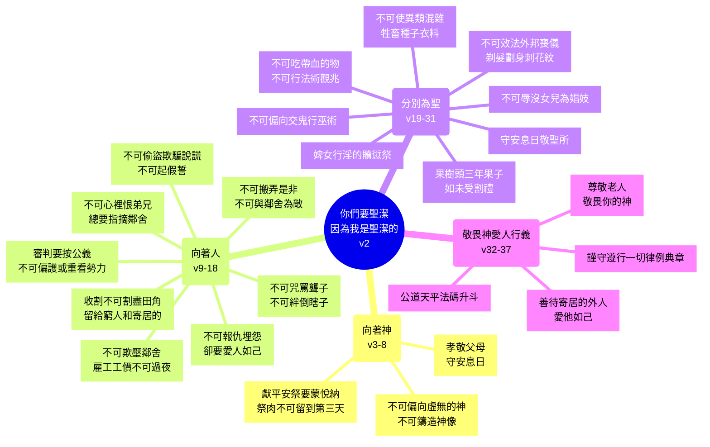

# 利未記 第19章

<!-- chapter-navigation:start -->
| [前一章](../03%20利未記/第18章.md) | [回目錄](../03%20利未記/全書目錄及綱要.md) | [下一章](../03%20利未記/第20章.md) |
| :--- | :---: | ---: |
<!-- chapter-navigation:end -->

1. 耶和華對[[摩西]]說：
2. 你曉諭以色列全會眾說：[[你們要聖潔因為我是聖潔的|你們要聖潔，因為我耶和華─你們的神是聖潔的]]。
3. [[當孝敬父母|你們各人都當孝敬父母]]，也要守我的[[安息日]]。我是耶和華─你們的神。
4. [[不可為自己雕刻偶像|你們不可偏向虛無的神]]，[[不可為自己雕刻偶像|也不可為自己鑄造神像]]。我是耶和華─你們的神。
5. 你們獻[[平安祭]]給耶和華的時候，要獻得可蒙悅納。
6. 這祭物要在獻的那一天和第二天吃，若有剩到第三天的，就必用火焚燒。
7. 第三天若再吃，這就為可憎惡的，必不蒙悅納。
8. 凡吃的人必擔當他的罪孽；因為他褻瀆了耶和華的聖物，[[剪除|那人必從民中剪除]]。
9. 在你們的地收割莊稼，[[田角拾穗顧念窮人的條例|不可割盡田角]]，[[田角拾穗顧念窮人的條例|也不可拾取所遺落的]]。
10. 不可摘盡葡萄園的果子，也不可拾取葡萄園所掉的果子；[[田角拾穗顧念窮人的條例|要留給窮人和寄居的]]。我是耶和華─你們的神。
11. [[不可偷盜|你們不可偷盜]]，不可欺騙，也不可彼此說謊。
12. [[不可妄稱耶和華你神的名|不可指著我的名起假誓]]，褻瀆你神的名。我是耶和華。
13. [[不可欺壓鄰舍雇工工價不可過夜|不可欺壓你的鄰舍]]，也不可搶奪他的物。[[不可欺壓鄰舍雇工工價不可過夜|雇工人的工價，不可在你那裡過夜，留到早晨]]。
14. [[不可咒罵聾子絆倒瞎子|不可咒罵聾子]]，也[[不可咒罵聾子絆倒瞎子|不可將絆腳石放在瞎子面前]]，[[敬畏神|只要敬畏你的神]]。我是耶和華。
15. [[審判不可行不義按公義審判|你們施行審判，不可行不義]]；不可偏護窮人，也不可重看有勢力的人，[[審判不可行不義按公義審判|只要按著公義審判你的鄰舍]]。
16. [[不可搬弄是非不可與鄰舍為敵|不可在民中往來搬弄是非]]，也不可與鄰舍為敵，置之於死（原文作流他的血）。我是耶和華。
17. [[不可心裡恨弟兄總要指摘鄰舍|不可心裡恨你的弟兄]]；[[不可心裡恨弟兄總要指摘鄰舍|總要指摘你的鄰舍，免得因他擔罪]]。
18. [[利19：18|不可報仇]]，也不可埋怨你本國的子民，[[利19：18|卻要愛人如己]]。我是耶和華。
19. 你們要守我的律例。[[不可使異類混雜（牲畜種子衣料）|不可叫你的牲畜與異類配合]]；不可用兩樣攙雜的種種你的地，也[[不可使異類混雜（牲畜種子衣料）|不可用兩樣攙雜的料做衣服穿在身上]]。
20. [[婢女行淫的贖愆祭條例|婢女許配了丈夫，還沒有被贖、得釋放]]，人若與他行淫，二人要受刑罰，卻不把他們治死，因為婢女還沒有得自由。
21. [[婢女行淫的贖愆祭條例|那人要把贖愆祭，就是一隻公綿羊牽到會幕門口、耶和華面前]]。
22. [[贖愆祭（asham）|祭司要用贖愆祭的羊在耶和華面前贖他所犯的罪]]，他的罪就必蒙赦免。
23. 你們到了迦南地，栽種各樣結果子的樹木，[[迦南地栽種果樹頭三年果子如未受割禮的條例|就要以所結的果子如未受割禮的一樣]]。三年之久，你們要以這些果子，如未受割禮的，是不可吃的。
24. [[迦南地栽種果樹頭三年果子如未受割禮的條例|但第四年所結的果子全要成為聖，用以讚美耶和華]]。
25. 第五年，你們要吃那樹上的果子，好叫樹給你們結果子更多。我是耶和華─你們的神。
26. [[血的尊重|你們不可吃帶血的物]]；[[不可行法術觀兆|不可用法術，也不可觀兆]]。
27. [[不可效法外邦喪儀習俗（剃髮劃身刺花紋）|頭的周圍]]（周圍或作：兩鬢）不可剃，鬍鬚的周圍也不可損壞。
28. [[不可效法外邦喪儀習俗（剃髮劃身刺花紋）|不可為死人用刀劃身，也不可在身上刺花紋]]。我是耶和華。
29. [[不可辱沒女兒使她為娼妓|不可辱沒你的女兒，使他為娼妓]]，恐怕地上的人專向淫亂，地就滿了大惡。
30. 你們要守我的[[安息日]]，敬我的聖所。我是耶和華。
31. [[不可偏向交鬼行巫術的|不可偏向那些交鬼的和行巫術的]]；不可求問他們，以致被他們玷污了。我是耶和華─你們的神。
32. [[尊敬老人|在白髮的人面前，你要站起來]]；[[尊敬老人|也要尊敬老人]]，又要敬畏你的神。我是耶和華。
33. 若有外人在你們國中和你同居，[[善待寄居的外人愛他如己|就不可欺負他]]。
34. 和你們同居的外人，[[善待寄居的外人愛他如己|你們要看他如本地人一樣，並要愛他如己]]，[[寄居的|因為你們在埃及地也作過寄居的]]。我是耶和華─你們的神。
35. 你們施行審判，不可行不義；在尺、秤、升、斗上也是如此。
36. [[公道天平法碼升斗|要用公道天平、公道法碼、公道升斗、公道秤]]。我是耶和華─你們的神，曾把你們從埃及地領出來的。
37. 你們要謹守遵行我一切的律例典章。我是耶和華。

---

## 本章知識節點

### 神學
- [[你們要聖潔因為我是聖潔的]]
- [[當孝敬父母]]
- [[安息日]]
- [[不可為自己雕刻偶像]]
- [[平安祭]]
- [[不可偷盜]]
- [[不可妄稱耶和華你神的名]]
- [[血的尊重]]
- [[敬畏神]]

### 主題
- [[田角拾穗顧念窮人的條例]]
- [[不可欺壓鄰舍雇工工價不可過夜]]
- [[不可咒罵聾子絆倒瞎子]]
- [[審判不可行不義按公義審判]]
- [[不可搬弄是非不可與鄰舍為敵]]
- [[不可心裡恨弟兄總要指摘鄰舍]]
- [[不可使異類混雜（牲畜種子衣料）]]
- [[婢女行淫的贖愆祭條例]]
- [[迦南地栽種果樹頭三年果子如未受割禮的條例]]
- [[不可行法術觀兆]]
- [[不可效法外邦喪儀習俗（剃髮劃身刺花紋）]]
- [[不可辱沒女兒使她為娼妓]]
- [[不可偏向交鬼行巫術的]]
- [[尊敬老人]]
- [[善待寄居的外人愛他如己]]
- [[公道天平法碼升斗]]

### 原文
- [[剪除]]
- [[贖愆祭（asham）]]
- [[寄居的]]

### 背景
- [[古代近東法典]]
- [[古代近東的社會契約]]

### 互文
- [[利19：18|利19：18 愛人如己是律法第二大誡命]]

### 人物
- [[摩西]]

---

## 本章整理

### 聖潔生活的總綱（v1-2）

本章開頭一句就把後面三十幾條規定的理由講完了：「[[你們要聖潔因為我是聖潔的|你們要聖潔，因為我耶和華你們的神是聖潔的]]」（v2）。CT 說這節是全章總綱，點出兩件事——要求的對象是全體神的子民，要求的事就是「要聖潔」。理由不在社會秩序，也不在衛生，而在神自己是誰。

受話的範圍不尋常。GT 丁良才說本章開頭那句吩咐「在摩西五經中只記在此處，和出十二3節」——直接對全會眾發令的寫法，五經裡只有這裡和逾越節的條例用過。KC 說得更直接：本章關心的不是祭司的職務，而是神百姓的日常生活，「利未記中沒有別的地方像這裡這樣對全體百姓說話」。他也指出十八章多半是消極的「不可」，本章則兼有積極的一面——聖潔不只是遠離邪惡，也是分別出來歸給神。BH 把「聖潔」的核心意思說成「被分別出來歸神所用」，並提醒它同時包含道德與禮儀兩面。

### 向著神的聖潔生活（v3-8）

v3 把[[當孝敬父母|孝敬父母]]（第五誡）與守[[安息日]]（第四誡）並列。這裡有個中文譯本看不出來的細節：《雷氏研讀本》指出「孝敬」原文作「懼怕」，而且「第30節的『敬』原文也相同」；GT 丁良才更進一步說，本節的「孝敬」與出埃及記20:12 的「孝敬」不是同一個字，反倒和申命記6:2、13 的「敬畏」一樣。KC 另注意到一件事——原文先提母親，後提父親。

v4 禁止偏向虛無的神、鑄造神像（[[不可為自己雕刻偶像]]）。CT 稱偶像為「虛無的神」，因為有神之名卻無神之實。BH 補充，這個字也可以解作「毫無價值的東西」。

v5-8 講獻[[平安祭]]的態度，其中一句話各家讀法不同。CT 說「獻得可蒙悅納」是指務必遵守平安祭的條例，GT 丁良才也說「就是要按神所定的條例而獻」；《雷氏研讀本》卻給了另一個譯法——「更作：『要按自己的意願來獻』」。祭肉只能吃兩天，第三天必須焚燒，否則「這就為可憎惡的」。CT 由此推出一句話：與神之間的交通必須保持新鮮；CT〔話中之光〕更直言，陳舊的平安祭「輕看了神聖的事，是嚴重的罪孽」。

### 向著人的聖潔生活（v9-18）

v9-10 設立[[田角拾穗顧念窮人的條例]]。CT 說這教三件事：地實際上是神的、不可存貪婪吝嗇的心、快樂時正是施捨的好機會。GT 丁良才引一個猶太傳說：收割時至少要留下六十分之一。GT《舊約聖經背景註釋》以「故意低效率的收割」為題提供了外部對照——在古代近東的豐饒祭儀中，留在田間的那一部分是獻給土地神明的祭物，在這裡卻成了照顧窮人的方法；該書並說明證據狀況：「古代近東法典雖然沒有這種規條的例證，來自努斯的文獻卻暗示有類似的習慣。」

v11-12 接續第八誡與第三誡（[[不可偷盜]]、[[不可妄稱耶和華你神的名]]）。GT 丁良才在這裡描出一條罪的連鎖：人若有為己或吝嗇的心（v9-10），就最容易貪圖別人的東西或欺騙人（v11 前半），既欺騙了人自然要撒謊遮蓋（v11 後半），謊話遮蓋不住就再進一步起假誓（v12）——「這樣，從一樣的罪往往生出許多的罪來」。

v13-14 保護沒有還手之力的人：[[不可欺壓鄰舍雇工工價不可過夜|雇工的工價不可過夜]]，[[不可咒罵聾子絆倒瞎子|不可咒罵聾子、不可絆倒瞎子]]。CT 與 GT 丁良才用同一句話說明理由：窮人雖抵不住、聾子雖聽不見、瞎子雖看不見，神卻能抵住、能聽見、也能看見。KC 說得更短：聾子聽不見那咒罵，神卻聽得見。

v15-16 論司法與言語（[[審判不可行不義按公義審判]]、[[不可搬弄是非不可與鄰舍為敵]]）。GT《啟導本》說「搬弄是非」就是譭謗中傷，不可對人施予有形或無形的傷害。GT 丁良才記下猶太人對下半節的兩層解釋：不可用假見證把無辜的人置於死地，也不可明知真情卻不肯為他作見證；他們甚至說，見人遇險而袖手旁觀，與置人於死無異。

v17-18 進入內心（[[不可心裡恨弟兄總要指摘鄰舍]]）。KC 指出容忍弟兄犯罪而不出聲其實就是恨他，並說愛能為別人遮蓋罪、卻不為犯罪的人自己遮蓋。至於「[[利19：18|愛人如己]]」，GT 丁良才記下猶太先師希勒被問「何為律法的要旨」時的回答——「你不願意人怎樣待你，你也就不要怎樣待人」，並提到孔夫子的「己所不欲，勿施於人」。CT 認為本節比中國聖人的說法更高一層，因為它是「己之所欲，施之於人」。KC 補上一個層次：在律法中「我」是標準（不害人），在基督裡「基督」是標準（為人捨己）。

### 不可混雜、不可效法外邦（v19-31）

v19 的[[不可使異類混雜（牲畜種子衣料）|三項禁令]]常被當成純粹的象徵規定，但 GT《舊約聖經背景註釋》給了一個具體的線索：「混合物有時保留作聖用」——聖幕的幔子和大祭司的外衣正是羊毛與細麻攙雜製成的，死海古卷（4QMMT）也這樣解釋。照這個讀法，禁令不是說混紡本身邪惡，而是說那是聖所專用的規格。KC 則認為講到牲畜混合，首先該想到的大概不是育種，而是「不相配的同負一軛」，並引哥林多後書6:14-18 說明新約同樣堅持這種分別。

v20-22 處理[[婢女行淫的贖愆祭條例|許配的婢女被玷污]]的案例。「二人要受刑罰」究竟是什麼，來源之間並不一致：GT 丁良才記下猶太傳說是鞭打四十下，GT《精讀本》與《串珠》則往「賠償」的方向解，BH 說處置方式由審判官按情況決定。那男人另要獻[[贖愆祭（asham）|贖愆祭]]。

v23-25 是[[迦南地栽種果樹頭三年果子如未受割禮的條例]]。CT 給了兩層解釋：果樹早期結的果子小而澀本不宜吃，以及果子如同人一樣、未受割禮的視為不潔。GT《啟導本》說這規定「有健全的園藝知識為根據」，GT《舊約聖經背景註釋》則描述當時的果園——價值極高，以致律法禁止在戰爭時砍伐，大部分種在山邊的梯田上。

v26-28 一連禁了三類外邦習俗（[[不可行法術觀兆]]、[[不可效法外邦喪儀習俗（剃髮劃身刺花紋）]]）。剃髮這一項，GT《舊約聖經背景註釋》舉出頭髮在當時有多重：漢摩拉比法典對作假見證之人的刑罰是剃去他一半的頭髮，中亞述法典容許債奴的主人以拔髮為懲戒，主前九世紀一個腓尼基碑文記載某人奉獻剃下的頭髮向亞施他特還願，馬里君王的先知傳達信息時習慣附上一束頭髮，那頭髮可以用來占卜、斷定信息是否可信。李道生《舊約聖經問題總解》則把動機說得最直白：古時迦南地方的人民為求先祖先父的喜悅、保佑他們，就自割其肉、自落其髮。

v29-31 收在社群的聖潔上：[[不可辱沒女兒使她為娼妓]]、守安息日敬聖所、[[不可偏向交鬼行巫術的]]。GT 丁良才指出 v29 原是針對把女兒獻給亞斯他錄神為娼妓的惡風俗，CT 也說當時拜偶像的廟宇盛行廟妓。GT《舊約聖經背景註釋》分析 v31 那類行為為什麼有吸引力：它是一種「通俗宗教」，在「正規宗教」以外充當不少人的「影子宗教」，為走投無路的人提供另一條出路。

### 敬畏神、愛人、行公義（v32-37）

v32 命令[[尊敬老人|在白髮的人面前站起來]]。KC 在這裡把話說到今天，語氣相當重：現在的社會已經不再把老人看作重要的人，安樂死成了社會可接受的、用來解決老人問題的手段；一個這樣對待老人的國家，會墮落成失序的國家。

v33-34 把愛鄰舍的範圍推到[[善待寄居的外人愛他如己|寄居的外人]]。GT《精讀本》指出這條倫理的根據是以色列人自己的救贖經歷；KC 的說法相近——他們自己作寄居的時候就經歷過神的看顧，所以「我們愛，因為神先愛我們」。

v35-36 落到市場上（[[公道天平法碼升斗]]）。GT 丁良才說，人若在度、量、衡上不公道，就和不公平的賊官無異，而且「倘若有多數的人不公道或無信用，交易就必停頓，社會也不得安定」。BH 給出這兩個單位的實際大小：伊法是乾量，約 22 公升；欣是液量，約 3.7 公升。GT《舊約聖經背景註釋》指出這條命令與 v11-18 的律法有直接關係（見 [[古代近東的社會契約]]），並舉漢摩拉比法典為對照——還債買酒都要用標準的量和衡，違者輕則財物充公，重則處死（見 [[古代近東法典]]）。

v37 以「你們要謹守遵行我一切的律例典章」作結。GT 丁良才要人注意「一切」二字：神子民的全部生活——在聖殿敬拜、在家中為父母兒女、在商店做買賣、在田間作莊稼、與親戚朋友鄰舍外人交往，或安息日或平日——都不能出乎這些條例的範圍。

### 「不可吃帶血的物」到底在禁什麼

v26 上半這一句，四份來源的理解並不一致，值得並排來看。

| 來源 | 讀法 | 依據 |
| --- | --- | --- |
| CT | 飲食與贖罪的規定 | 沒有經過流血而死的牲畜肉裡含血；血中有生命，是為著贖罪之用（參申12:23） |
| BH | 飲食與血的神聖性 | 上承創9:4 對挪亞的吩咐，並與利17:10-14 一致，血代表生命 |
| KC | 異教習俗 | 從上下文看，帶血而吃像是一種外邦人的作法 |
| GT《舊約聖經背景註釋》 | 不是飲食律法 | 「這律法關乎的是將祭牲的血倒在地上或『聖坑』之中，吸引亡魂或冥府的神祇，以便向他們求問未來的作法」（參撒上28:7-19） |

GT 丁良才在這一節也提到「有人以為本句在此處是指著關係古時行邪術或拜偶像的風俗說的」，可見這個讀法在中文註釋裡並非陌生。STEP 顯示原文用的介系詞是「在……之上」，直譯為「不可在血上吃」——這正是後兩種讀法的立足點；而[[血的尊重|血裡有生命]]的神學則承自利未記17章。

### 一個字串起兩三處：原文層的線索

STEP 的資料在這一章有個特別的用處：好幾組看起來不相干的規定，在原文其實是同一個字。

| 同一個字 | 出現在哪裡 | 說明 |
| --- | --- | --- |
| pe.ah（H6285，邊、角） | v9「田角」、v27「頭的周圍」「鬍鬚的周圍」 | GT《舊約聖經背景註釋》已指出這兩處「所用的字眼相同」，並說兩者都和奉獻有關——一個給窮人，一個給神 |
| ha.dar（H1921，尊崇） | v15「重看有勢力的人」、v32「尊敬老人」 | 同一個動作在法庭上被禁止，在白髮人面前卻是本分 |
| cha.lal（H2490H，褻瀆） | v8「褻瀆了耶和華的聖物」、v12「褻瀆你神的名」、v29「辱沒你的女兒」 | 女兒被放進與聖物、與神的名同一個範疇 |
| ya.re（H3372H，敬畏） | v3「孝敬父母」、v30「敬我的聖所」、v32「敬畏你的神」 | 《雷氏研讀本》所說「第30節的『敬』原文也相同」，在字形上可以直接核對 |
| tze.deq（H6664G，公義） | v15「按著公義審判」、v36 四樣器具各一次 | 法庭上的公義和市場上的公道是同一個字 |

另有兩處，原文說明了各家為什麼會有分歧。v5「要獻得可蒙悅納」的原文帶第二人稱複數的「你們的」，所以既可讀成「使你們蒙悅納」，也可讀成《雷氏研讀本》的「按自己的意願來獻」。v20「二人要受刑罰」的名詞在本節的譯義是「賠償」，這正是《精讀本》與《串珠》往賠償方向解、而丁良才記下鞭打傳說的分歧所在。

至於本章的分段，三份來源各數各的：

| 來源 | 分法 |
| --- | --- |
| GT 丁良才 | 十四段——六段以「我是耶和華你們的神」作結，八段以「我是耶和華」作結 |
| GT《啟導本》 | 十六小段，再併為三大部分（v2-10、v11-18、v19-37）；並記猶太學者視本章為十誡的副產物 |
| GT《串珠》 | 不分段，只數次數：「我是耶和華（你們的神）」在本章共出現十六次 |
| CT | 六段綱要：總綱、向著神、向著人、向著財物、守身敬畏神、愛人敬畏神 |

```mermaid
mindmap
  root(("你們要聖潔<br/>因為我是聖潔的<br/>v2"))
    ("向著神<br/>v3-8")
      [孝敬父母<br/>守安息日]
      [不可偏向虛無的神<br/>不可鑄造神像]
      [獻平安祭要蒙悅納<br/>祭肉不可留到第三天]
    ("向著人<br/>v9-18")
      [收割不可割盡田角<br/>留給窮人和寄居的]
      [不可偷盜欺騙說謊<br/>不可起假誓]
      [不可欺壓鄰舍<br/>雇工工價不可過夜]
      [不可咒罵聾子<br/>不可絆倒瞎子]
      [審判要按公義<br/>不可偏護或重看勢力]
      [不可搬弄是非<br/>不可與鄰舍為敵]
      [不可心裡恨弟兄<br/>總要指摘鄰舍]
      [不可報仇埋怨<br/>卻要愛人如己]
    ("分別為聖<br/>v19-31")
      [不可使異類混雜<br/>牲畜種子衣料]
      [婢女行淫的贖愆祭]
      [果樹頭三年果子<br/>如未受割禮]
      [不可吃帶血的物<br/>不可行法術觀兆]
      [不可效法外邦喪儀<br/>剃髮劃身刺花紋]
      [不可辱沒女兒為娼妓]
      [守安息日敬聖所]
      [不可偏向交鬼行巫術]
    ("敬畏神愛人行義<br/>v32-37")
      [尊敬老人<br/>敬畏你的神]
      [善待寄居的外人<br/>愛他如己]
      [公道天平法碼升斗]
      [謹守遵行一切律例典章]
```

> [!important] 本章為什麼重要
> 這一章把十誡的原則展開成日常生活的細目——收割、工資、審判、買賣、喪禮、對待長者與外人。GT《舊約聖經背景註釋》以「社會契約」為題指出，古代近東的鄰邦也相信神明關心社會正義、可被召來作見證，但契約本身是人與人之間的合同，神明只擔任保護者；本章則以神自己為立約的一方，所以每一段都以「我是耶和華」收尾。主耶穌引 v18「愛人如己」為律法第二大誡命（太22:39），保羅也以此為成全律法的總綱（羅13:9；加5:14）。

**參考資料**
https://www.ccbiblestudy.org/Old%20Testament/03Lev/03CT19.htm
https://www.ccbiblestudy.org/Old%20Testament/03Lev/03GT19.htm
https://www.kingcomments.com/en/bible-studies/Lev/19
https://biblehub.com/study/leviticus/19.htm
https://github.com/STEPBible/STEPBible-Data

<!-- chapter-navigation:start -->
| [前一章](../03%20利未記/第18章.md) | [回目錄](../03%20利未記/全書目錄及綱要.md) | [下一章](../03%20利未記/第20章.md) |
| :--- | :---: | ---: |
<!-- chapter-navigation:end -->
