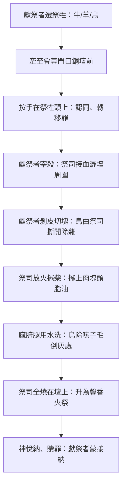

# 利未記 第1章

1. 耶和華從會幕中呼叫摩西，對他說：
2. 你曉諭以色列人說：你們中間若有人獻[[供物（qorban）|供物]]給耶和華，要從牛群羊群中獻牲畜為供物。
3. 他的[[供物（qorban）|供物]]若以牛為[[燔祭]]，就要在[[會幕門口]]獻一隻[[沒有殘疾的祭牲|沒有殘疾]]的公牛，可以在耶和華面前蒙悅納。
4. 他要[[按手（samak）|按手]]在[[燔祭]]牲的頭上，燔祭便蒙悅納，為他贖罪。
5. 他要在耶和華面前宰公牛；[[亞倫和他兒子（祭司）|亞倫子孫]]作祭司的，要奉上[[血的尊重|血]]，把血灑在[[會幕門口]]、[[銅壇（燔祭壇）|壇]]的周圍。
6. 那人要剝去[[燔祭]]牲的皮，把燔祭牲切成塊子。
7. [[亞倫和他兒子（祭司）|祭司亞倫的子孫]]要把火放在[[銅壇（燔祭壇）|壇]]上，把柴擺在火上。
8. [[亞倫和他兒子（祭司）|亞倫子孫]]作祭司的，要把肉塊和頭並脂油擺在[[銅壇（燔祭壇）|壇]]上火的柴上。
9. 但[[燔祭]]的臟腑與腿要用水洗。[[亞倫和他兒子（祭司）|祭司]]就要把一切全燒在[[銅壇（燔祭壇）|壇]]上，當作燔祭，獻與耶和華為[[馨香之氣|馨香]]的火祭。
10. 人的[[供物（qorban）|供物]]若以綿羊或山羊為[[燔祭]]，就要獻上[[沒有殘疾的祭牲|沒有殘疾]]的公羊。
11. 要把羊宰於[[銅壇（燔祭壇）|壇]]的北邊，在耶和華面前；[[亞倫和他兒子（祭司）|亞倫子孫]]作祭司的，要把羊[[血的尊重|血]]灑在壇的周圍。
12. 要把[[燔祭]]牲切成塊子，連頭和脂油，[[亞倫和他兒子（祭司）|祭司]]就要擺在[[銅壇（燔祭壇）|壇]]上火的柴上；
13. 但臟腑與腿要用水洗，[[亞倫和他兒子（祭司）|祭司]]就要全然奉獻，燒在[[銅壇（燔祭壇）|壇]]上。這是[[燔祭]]，是獻與耶和華為[[馨香之氣|馨香]]的火祭。
14. 人奉給耶和華的[[供物（qorban）|供物]]，若以鳥為[[燔祭]]，就要獻斑鳩或是雛鴿為供物。
15. [[亞倫和他兒子（祭司）|祭司]]要把鳥拿到[[銅壇（燔祭壇）|壇]]前，揪下頭來，把鳥燒在壇上；鳥的[[血的尊重|血]]要流在壇的旁邊；
16. 又要把鳥的嗉子和髒物（髒物：或作翎毛）除掉，丟在[[銅壇（燔祭壇）|壇]]的東邊倒灰的地方。
17. 要拿著鳥的兩個翅膀，把鳥撕開，只是不可撕斷；[[亞倫和他兒子（祭司）|祭司]]要在[[銅壇（燔祭壇）|壇]]上、在火的柴上焚燒。這是[[燔祭]]，是獻與耶和華為[[馨香之氣|馨香]]的火祭。

---

## 本章知識節點

### 神學
- [[燔祭]]
- [[馨香之氣]]
- [[血的尊重]]
- [[沒有殘疾的祭牲]]
- [[燔祭祭牲的貧富分級]]

### 原文
- [[按手（samak）]]
- [[供物（qorban）]]

### 主題
- [[銅壇（燔祭壇）]]

### 地點
- [[會幕門口]]

### 人物
- [[亞倫和他兒子（祭司）]]

### 背景
- [[古代近東的獻祭與燔祭習俗]]

---

## 本章整理

### 燔祭條例總綱與獻祭總則（v1-2）

利未記開篇承接出埃及記四十章：會幕落成、榮光充滿，耶和華「從會幕中呼叫摩西」（v1），不再從西奈山頒律法，而是從祂與百姓同住的帳棚說話（CT、GT《丁良才》《啟導本》）。v2 宣告獻祭的三大原則：① **自願性**——「若有人獻[[供物（qorban）|供物]]」，非強迫、非群體同步，而是受感個人的主動回應（CT、GT《靈修版》）；② **代價性**——「供物」（qorban，字根「靠近」）必須從己有牛群羊群中取出，代表獻祭者付上代價、甘心親近神（CT、GT《精讀本》《雷氏》）；③ **分級性**——神按家境容許公牛、綿羊/山羊、斑鳩/雛鴿三等祭牲，富厚者獻牛、小康者獻羊、貧窮者獻鳥，動機誠實即蒙悅納（CT、GT《啟導本》《舊約背景》）。這奠定全章「[[燔祭祭牲的貧富分級]]」架構，也呼應新約「照所有的，並不是照所無的」（林後8:12）。

### 三等祭牲的獻祭流程對照（v3-17）

本章按祭牲體型遞減，三組平行段落（牛 v3-9、羊 v10-13、鳥 v14-17）呈現高度結構化的儀式流程。下表綜合 CT 逐節詳解、GT《丁良才》手續整理、BH 祭司職責說明，展示**獻祭者與祭司的分工**以及**血、火、水、全燒**四大核心動作：

| 步驟 | 公牛（v3-9） | 綿羊/山羊（v10-13） | 斑鳩/雛鴿（v14-17） | 關鍵神學意涵（CT 靈意、KC、BH） |
|------|--------------|---------------------|---------------------|----------------------------------|
| 1. 牽至會幕門口 | 獻祭者牽公牛到[[銅壇（燔祭壇）]]前 | 同左，宰於壇北邊 | 祭司拿鳥到壇前 | **[[會幕門口]]**預表十字架（CT）；北邊空間最寬（GT《舊約背景》） |
| 2. 按手認同 | 獻祭者按手在頭上 | 隱含同樣動作 | 鳥由手帶來已表按手意 | **[[按手（samak）]]**：罪轉移、與祭牲合一、預表信徒與基督聯合（CT、GT《精讀本》、KC） |
| 3. 宰殺流血 | 獻祭者宰牛，祭司接血灑壇周圍 | 獻祭者宰羊，祭司灑血 | 祭司揪頭，血流壇旁 | **[[血的尊重]]**：生命在血中（利17:11），灑血潔淨壇、遮蓋罪（CT、BH、KC） |
| 4. 剝皮切塊 | 獻祭者剝皮、切塊 | 獻祭者切塊 | 祭司撕開不斷、除嗉子毛 | 剝皮：除去外貌虛榮；切塊：接受破碎、徹底獻上（CT、KC） |
| 5. 火與柴 | 祭司放火、擺柴 | 同左 | 同左 | 火：神聖潔試煉；柴：人來的熬煉（CT、GT《丁良才》） |
| 6. 洗淨內臟腿 | 臟腑、腿用水洗 | 同左 | 嗉子毛丟東邊倒灰處 | 水：道與聖靈潔淨裡外（CT、KC）；倒灰：奉獻永不改變（CT） |
| 7. 全燒為馨香 | 祭司把一切全燒在壇上 | 同左 | 同左 | **[[馨香之氣]]**：神滿足、神人相安；預表基督完全獻己（CT、KC、BH、弗5:2） |

### 祭司與獻祭者的分工、血與火的神學意義

來源一致指出：**宰殺、剝皮、切塊、洗臟腑**屬獻祭者（v5-6,9,11-13）；**接血灑血、放火擺柴、擺上壇、全燒**屬[[亞倫和他兒子（祭司）|亞倫子孫祭司]]（v5,7-8,12-13,15,17）。這分工在 CT、GT《丁良才》、BH 皆獲確認，KC 則強調「信徒既是獻祭者也是祭司」（彼前2:5），舊約畫面預表新約屬靈經驗。

血與火的雙重意象貫穿全章：
- **血**：灑在壇周圍（牛、羊）或流壇旁（鳥），象徵「生命獻上換生命」（利17:11），潔淨壇、遮蓋罪，指向基督「更美的血」（來12:24，CT靈訓）。
- **火**：壇上火必常燒不滅（利6:13），代表神聖潔試煉；柴代表人來的苦難。祭物在火中不被燒毀，反升為「[[馨香之氣]]」——神聞而滿足、震怒止息（CT、KC、BH、GT《舊約背景》「擬人化」說法）。

> [!note] 來源差異提示
> - CT、KC、BH 皆將「[[馨香之氣]]」解為神悅納基督工作的隱喻；GT《舊約背景註釋》則指出古代近東普遍視神需食物、香氣喚起食慾，屬擬人化表達，二者視角不同，並非矛盾。
> - 關於「[[按手（samak）]]」：CT、GT《精讀本》、KC 認為轉移罪；GT《舊約背景》引儀式文獻指出非贖罪祭也按手，功用可能為「認同、指認、歸屬」，不單是轉嫁罪責。
> - 利未記的燔祭條例若與周邊民族相比，見[[古代近東的獻祭與燔祭習俗]]：埃及、美索不達米亞至今未見燔祭的考古證據，反而是敘利亞—巴勒斯坦一帶（烏加列、阿拉拉赫）與安那托利亞（赫人）文獻有佐證；利未記自稱為神親自的啟示，這點在古代近東文獻中並不常見。

### 跨章脈絡：燔祭如何預表基督完全的獻己

利未記1章是五祭之首，CT靈訓列出多項預表，KC以約翰福音視角強調「[[燔祭]]＝基督為榮耀父神完全獻上」，兩者高度呼應。關鍵對應如下：

| 燔祭細節 | 基督預表實現（CT、KC、BH、弗5:2、來9:14、10:5-10） |
|------------|--------------------------------------------------------|
| **公牛**（力量、忍耐、忠心僕人） | 基督以大能忍受十字架，成就救贖大工 |
| **綿羊**（柔順、良善） | 「像羊羔被牽到宰殺之地」（賽53:7，徒8:32） |
| **山羊**（為罪人成為罪） | 「神使那無罪的，替我們成為罪」（林後5:21） |
| **斑鳩/雛鴿**（貧窮、卑微、溫柔） | 基督溫柔天真，甘願為我們成為卑賤貧窮（CT） |
| **[[沒有殘疾的祭牲]]** | 基督「無瑕疵、無玷污」（彼前1:19，來9:14） |
| **[[按手（samak）]]** | 信徒與基督聯合，「神在愛子裡悅納我們」（弗1:6，羅6:5） |
| **全燒** | 基督「將自己獻給神，當作馨香的祭物」（弗5:2，見[[馨香之氣]]） |
| **[[馨香之氣]]** | 神所收納所喜悅的極美香氣（腓4:18，賽60:7，弗5:2） |

> [!important] 本章樞紐
> [[燔祭]]不是為特定之罪（那屬贖罪祭/贖愆祭），而是**獻祭者整個人完全、自願、無保留地獻給神**。利未記把燔祭放在五祭之首，神心中最寶貴的是子為榮耀父而完全的順服與獻上（KC導論）。新約信徒應效法，「將身體獻上，當作活祭，是聖潔的，是神所喜悅的」（羅12:1）。

**參考資料**
https://www.ccbiblestudy.org/Old%20Testament/03Lev/03CT01.htm
https://www.ccbiblestudy.org/Old%20Testament/03Lev/03GT01.htm
https://www.kingcomments.com/en/bible-studies/Lev/1
https://biblehub.com/study/leviticus/1.htm
