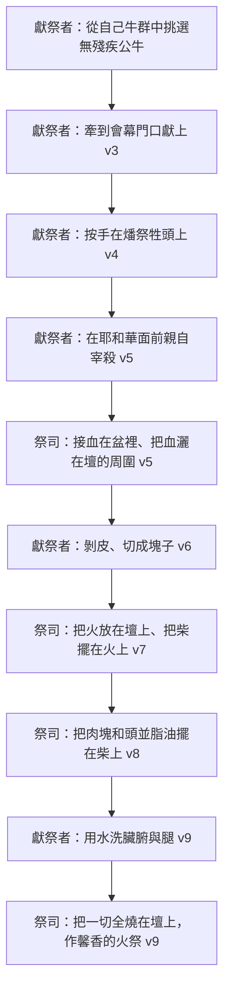

# 利未記 第1章

1. 耶和華[[耶和華呼叫摩西|從會幕中呼叫]]摩西，對他說：
2. 你曉諭以色列人說：你們中間若有人獻供物給耶和華，要從[[牛群羊群]]中獻[[牛群羊群|牲畜]]為供物。
3. 他的供物若以[[公牛|牛]]為[[燔祭（olah）|燔祭]]，就要在會幕門口獻一隻[[無殘疾|沒有殘疾]]的[[公牛]]，可以在耶和華面前[[悅納|蒙悅納]]。
4. 他要[[按手（samak）|按手]]在[[燔祭（olah）|燔祭]]牲的頭上，燔祭便[[悅納|蒙悅納]]，為他[[贖罪]]。
5. 他要在耶和華面前[[宰殺|宰公牛]]；[[亞倫]]子孫作[[亞倫和他兒子（祭司）|祭司]]的，要[[灑血|奉上血]]，[[灑血|把血灑]]在會幕門口、[[銅壇（燔祭壇）|壇]]的周圍。
6. 那人要[[剝皮切塊|剝去燔祭牲的皮]]，把燔祭牲[[剝皮切塊|切成塊子]]。
7. [[亞倫和他兒子（祭司）|祭司]][[亞倫和他兒子（祭司）|亞倫的子孫]]要把火放在[[銅壇（燔祭壇）|壇上]]，把柴擺在火上。
8. [[亞倫]]子孫作[[亞倫和他兒子（祭司）|祭司]]的，要把肉塊和頭並[[脂油]]擺在[[銅壇（燔祭壇）|壇上]]火的柴上。
9. 但[[燔祭（olah）|燔祭]]的[[洗臟腑與腿|臟腑與腿]]要[[洗臟腑與腿|用水洗]]。[[亞倫和他兒子（祭司）|祭司]]就要把一切[[燒在壇上|全燒在壇上]]，當作燔祭，獻與耶和華為[[馨香的火祭]]。
10. 人的供物若以[[綿羊]]或[[山羊]]為[[燔祭（olah）|燔祭]]，就要獻上[[無殘疾|沒有殘疾]]的公羊。
11. 要把[[綿羊|羊]][[宰殺|宰]]於[[銅壇（燔祭壇）|壇]]的北邊，在耶和華面前；[[亞倫]]子孫作[[亞倫和他兒子（祭司）|祭司]]的，要把羊[[血]]灑在壇的周圍。
12. 要把[[燔祭（olah）|燔祭]]牲[[剝皮切塊|切成塊子]]，連頭和[[脂油]]，[[亞倫和他兒子（祭司）|祭司]]就要擺在[[銅壇（燔祭壇）|壇上]]火的柴上；
13. 但[[洗臟腑與腿|臟腑與腿]]要[[洗臟腑與腿|用水洗]]，[[亞倫和他兒子（祭司）|祭司]]就要全然奉獻，[[燒在壇上]]。這是[[燔祭（olah）|燔祭]]，是獻與耶和華為[[馨香的火祭]]。
14. 人奉給耶和華的供物，若以鳥為[[燔祭（olah）|燔祭]]，就要獻[[斑鳩]]或是[[雛鴿]]為供物。
15. [[亞倫和他兒子（祭司）|祭司]]要把鳥拿到[[銅壇（燔祭壇）|壇]]前，[[宰殺|揪下頭來]]，把鳥[[燒在壇上]]；鳥的[[血]]要流在壇的旁邊；
16. 又要把鳥的嗉子和髒物（髒物：或作翎毛）除掉，丟在[[銅壇（燔祭壇）|壇]]的東邊倒灰的地方。
17. 要拿著鳥的兩個翅膀，把鳥撕開，只是不可撕斷；[[亞倫和他兒子（祭司）|祭司]]要在[[銅壇（燔祭壇）|壇上]]、在火的柴上[[燒在壇上|焚燒]]。這是[[燔祭（olah）|燔祭]]，是獻與耶和華為[[馨香的火祭]]。

---

## 本章知識節點

### 神學
- [[悅納]]
- [[贖罪]]
- [[馨香的火祭]]
- [[耶和華呼叫摩西]]

### 原文
- [[按手（samak）]]

### 祭禮
- [[供物]]
- [[牛群羊群]]
- [[無殘疾]]
- [[公牛]]
- [[綿羊]]
- [[山羊]]
- [[斑鳩]]
- [[雛鴿]]
- [[宰殺]]
- [[灑血]]
- [[血]]
- [[剝皮切塊]]
- [[洗臟腑與腿]]
- [[脂油]]
- [[燒在壇上]]

### 祭司
- [[亞倫和他兒子（祭司）]]

### 器物
- [[銅壇（燔祭壇）]]

### 互文
- [[羅12：1|羅12：1 將身體獻上當作活祭]]
- [[來10：5|來10：5 神為我預備了身體]]
- [[話語潔淨（弗5：26）|話語潔淨（弗5：26） 用水藉著道洗淨]]

### 跨章
- [[燔祭（olah）]]
- [[素祭（minchah）]]
- [[贖愆祭（asham）]]
- [[鹽約]]

---

## 本章整理

> [!info] 為什麼神從燔祭講起，而不是從贖罪祭
> 神開口講獻祭，第一個講的不是贖罪祭，而是[[燔祭（olah）]]。KC 認為這個次序本身就是啟示：「For the sinner, the sin offering comes first, because it speaks of the work of the Lord Jesus that is necessary to deliver him from his sins. The burnt offering represents the Lord Jesus in His work on the cross to glorify God. **That is why God begins with it, for this aspect of the work of His Son is most precious to His heart.**」
>
> 對罪人而言贖罪祭在先，因為那是脫罪所必需的；==對神而言燔祭在先，因為那是祂心中最寶貴的一面==。丁良才在本章末尾把兩者的分工說得更直接：「贖罪祭預表耶穌贖人的罪過，燔祭預表耶穌補人的不及。」人單不作惡是不夠的，必須盡力行善才算盡了本分。

### 神從會幕中說話（v1）

[[耶和華呼叫摩西]]是全卷的起點。CT 指出本節首字原文有「又」或「並且」（and），「表示《利未記》乃接續《出埃及記》的結尾，那位以榮光充滿會幕的神（出四十34~38），現在又呼叫摩西，向他說話」。

說話的地點變了，這是 KC 特別看重的一點：

| | 從西奈山說話 | 從會幕說話（本章） |
| --- | --- | --- |
| 出處 | 出20:22「我從天上和你們說話」 | 利1:1「從會幕中呼叫摩西」 |
| 神在哪裡 | 在天上 | 住在百姓中間（出25:8） |
| 說話的內容 | 神的要求與條件 | 敬拜與親近神 |
| KC 的說法 | 「From Sinai, God gives His demands and conditions.」 | 「God desires that His people come to have fellowship with Him.」 |

「會幕」原文直譯是「居所」（dwelling place）。KC：「If that dwelling place is called 'the tent of meeting', it indicates that God desires that His people come to have fellowship with Him, that is, to speak to Him about the Lord Jesus.」

至於這是神第幾次呼叫摩西，各家算法不同，並非同一件事的矛盾，而是計數的角度不同：CT 與丁良才都按經文出現次數計，「聖經上記載神『呼叫摩西』共有四次：(1)出三4；(2)出十九3；(3)出十九20；(4)本節」。KC 則按呼召的目的計為第三次——第一次差遣他作拯救者（出3:4），第二次使他認識神的聖潔（出19:20），第三次即本節，「the LORD calls him to speak with him about worship and drawing near to God」。

### 獻祭總則（v2）

「你們中間若有人」——CT 從這個「若」字讀出三件事：「『若有人獻供物』表示獻祭乃自願而非強迫，是個別而非群體的行為；『若』也表示在人一方面應當主動，因神是施恩者。」KC 也讀出同一點：「God does not assume that the wish to have fellowship with Him lives with all people. He speaks of 'any man of you'.」

[[供物]]原文為 qorban，《啟導本》：「意思是『攜近』聖壇的東西，包括一切獻給神的禮物；獻祭因此是人就近神的途徑。」CT 補充動詞面：「『獻供物（動詞）』原文的意思是就近，指就近祭壇。自從亞當犯罪以後，人不能直接就近神，只能就近祭壇。」

[[牛群羊群]]都是潔淨且馴服的家畜。KC 由此問了一個別家沒問的問題——為什麼不能獻鹿？

> [!quote] KC：為什麼不是鹿
> 「A deer, for example, is a pure animal, and can be eaten from. Yet it is unsuitable as offering, because it is not tame. **It must be hunted.** On the Lord Jesus there was no need to be hunted, so to speak. He has voluntarily come to the service of man.」
>
> 鹿是潔淨的，也可以吃，卻不能作祭物——因為牠必須被獵取。祭牲必須是走到你手邊來的。

### 若以牛為燔祭（v3-9）

[[無殘疾]]的[[公牛]]是最大的一級。CT：「『沒有殘疾』原文是從頭到底（形容詞），就是完全的意思。」丁良才則列出三重資格：「按體格須是沒有殘疾的（二十二17-25），按定例須是潔淨的（十一1-48），按律法須是無辜的。」

KC 強調挑選本身就是代價：「The offeror must look for this in his herd. **That requires effort.** Bringing an offering takes effort, it does not happen by itself.」屬靈的對應是：不先花工夫認識基督，就沒有東西可獻。

> [!note] 一處要修正的說法：按手不等於「把罪轉到祭牲身上」
> 舊版寫[[按手（samak）]]「象徵著將罪惡與刑罰轉移到無辜的代罪牲畜身上……祭牲承擔了人的罪債」，並當作定論。四來源在這一點上其實**明確分歧**，不能壓成一句：
>
> - **丁良才、《精讀本》、《串珠》、靈修版**支持轉移說：丁良才「按手的禮在聖書裡是表示『歸給』的意思……按手在祭牲頭上是表明這祭牲代替獻祭的人，獻祭之人的罪歸於祭牲」。
> - **《舊約聖經背景註釋》明確反對**：「其用意**不是**把罪轉歸給祭牲，因為非贖罪的祭也需要按手。另一個可能是獻祭者在某種程度上與祭牲認同，或作他的替身，或認定祭牲屬他所有。」
> - **KC 認為方向相反**：「By this he identifies himself with the offering. **All the value of the burnt offering is therefore as it were passed on to him, the offeror.** God sees him in this offering.」並指出「**Although the burnt offering is not brought for the sake of sin**, the offeror is a sinner by nature.」
> - **CT 兩面都說**：「這祭牲不但是擔負了罪，也是領人到榮耀的恩典中。基督如何被接納，信徒也是照樣的被接納。」
>
> 分歧的關鍵在於：轉移說是**贖罪祭**的邏輯（利16:21 亞倫按手把會眾的罪歸在羊頭上，經文明說），燔祭經文並沒有這樣說。燔祭裡「按手」帶出的是**聯合**——而聯合是雙向的。贖罪祭把「我的不配」送出去，燔祭把「祂的配得」帶回來。

「為他[[贖罪]]」的 kaphar，CT 給的字義是「遮蓋，抹掉，平息，化解」，並提醒「祭物本身永不能除罪（參來十11），反而叫人想起罪來（參來十3）」。《舊約聖經背景註釋》另提一個近代的修正：「很多學者如今都同意不論在儀式上還是神學上，『贖罪』都不是這個概念最理想的翻譯……近代學者相信『淨化』是更為理想的翻譯」，理由是有時罪雖沒有犯，卻仍有「贖罪」的必要（如女子每月在儀式上的不潔）。

獻祭不是祭司一手包辦。丁良才把分工列得很清楚——本章的節奏是獻祭者與祭司交替動手：

[[宰殺]]是獻祭者自己的事。丁良才：「獻祭的人須自己宰殺祭牲（七30，祭司和利未人不過是幫助）。這是表示獻祭的人將自已的生命獻與主。」KC 指出原文的力度：宰殺字面是「cut the throat」——「This emphasizes that the animal is not only killed, but that blood flows.」

[[灑血]]則是祭司的事。CT：「『奉上血』血中有生命，故能夠贖罪（參利十七11）。」

[[剝皮切塊]]，CT 讀出兩層：「剝皮表示獻祭的人在神面前赤露敞開，沒有掩蓋」；「『切成塊子』指徹底肢解，表示獻祭的人在神面前毫無保留」。丁良才則讀出檢驗的意思：「在獻上的時候還得把祭牲切成塊子，不但便於移動，也是表示仔細檢察的意思，證明這祭牲是十分合格的。」

被擺上的四個部位，三家的對應不完全一樣，這是本章最值得並排看的地方：

| 部位 | 丁良才 | CT | KC |
| --- | --- | --- | --- |
| 頭 | 靈明和思想 | 智慧 | 祂的思想——「All His thoughts are always focused on God」 |
| [[脂油]] | 精神和佳美 | 上好的部位就是靈 | 成就工作的精力 |
| 臟腑 | 意念和愛情 | 魂的各部（心思、情感、意志） | 祂內裡的感覺——福音書屢次記「動了慈心」 |
| 腿 | 行為和榜樣 | 行動 | 祂的行走 |

三家在「頭＝思想」「腿＝行走」上一致，在脂油與臟腑上分歧：丁良才與 KC 讀脂油為精力，CT 讀為靈。

### 若以綿羊或山羊為燔祭（v10-13）

丁良才點出本段為何簡略：「獻綿羊或山羊為燔祭的條例和獻牛為燔祭的條例是一樣的，所以本段只記這條例的大略，沒有重記會幕門口的奉獻（3）、按手（4）、剝皮（6）等事。」真正新增的資訊只有一個——宰殺的位置。

> [!tip] 為什麼偏偏是「壇的北邊」
> 舊版說這是「確立了祭壇周圍的空間秩序」，其實丁良才給的是一個具體的排除法答案——**其餘三面都被佔用了**：
>
> | 方位 | 用途 | 出處 |
> | --- | --- | --- |
> | 東邊 | 倒灰的地方 | 利1:16 |
> | 西邊 | 洗濯盆，且對著會幕 | 出40:7、30 |
> | 南邊 | 上壇的斜坡 | 出27:9-19 會幕院圖 |
> | **北邊** | **所以宰牲在此** | 利1:11 |
>
> 《舊約聖經背景註釋》給的理由較保守：「在此指明使用壇北面的理由，大概是那裡有最多空間可供此用。」丁良才另補一筆：贖罪祭和贖愆祭的祭牲也在此處宰（四24、29、33，六25，七2）。

[[綿羊]]與[[山羊]]的預表，CT 分得很細：「綿羊：預表基督的柔馴和良善」；「山羊：預表罪人，指基督『被列在罪犯之中』，為我們『成為罪』。」

### 若以鳥為燔祭（v14-17）

最小的一級是[[斑鳩]]或[[雛鴿]]。丁良才指出這裡少了一個動作：「人獻鳥為祭的時候就不行按手的禮，這或者是因獻祭之人的鳥原是用手帶來奉上的，已經表示了按手的意思。」

《啟導本》指出這一段對窮人的寬待到什麼程度：「對這些貧窮的人，不但可用鳥來替代，且不限公鳥，也沒有規定必須無殘疾。」但寬待不等於免除代價——「這條例雖然寬待窮苦人，仍舊含有奉獻須付代價的原則在內」。CT 也記下同一個心：「獻祭要論家之有無：富厚之家獻公牛，小康之家獻山羊，貧窮人只能獻一隻班鳩。==只要人的動機存心對，就都蒙主悅納。==」

這裡有一個舊版完全沒提、卻是本章最深的一筆——KC 注意到鳥的燔祭裡有東西是神不能接受、必須除掉的（v16 的嗉子和髒物）：

> [!quote] KC：連獻上的東西裡都有神不能收的
> 「There are even elements in this offering that God cannot accept, which must be taken away. Thus we can speak about the Lord Jesus or His work and say things to God that He cannot accept because they are not right. **But even though someone is young or weak in his faith and comes with an offering of birds in which something is wrong, if the wrong is taken away, the offering is still 'of a soothing aroma to the LORD'.**」

《舊約聖經背景註釋》對 v16 提出一個譯法上的修正，值得備註：「近期研究顯示要除去的不是嗉囊，而是肛周，即尾部、肛門、腸臟。」和合本作「嗉子」，小字另作「翎毛」，本身即反映此處原文有難處。

「把鳥撕開，只是不可撕斷」——CT、丁良才、《精讀本》都指向同一處互文：亞伯拉罕獻祭時「只是鳥沒有劈開」（創15:10）。

### 三級祭物：不是三個選項，是三種深淺

舊版把三級寫成「無論是獻牛還是獻羊」，當作可替換的選項。這正是 KC 花最多篇幅反對的讀法——==三級對應的是獻祭者對基督認識的深淺==：

> [!quote] KC：獻什麼，說出你看見了多少
> 「The various offerings speak of what a believer has understood of the work of the Lord Jesus and of His Person. **Believers who are spiritually rich bring a young bull in a spiritual sense.** Believers who have not yet seen so much of the glory of the Lord Jesus, possibly also because they have not been that busy with it, bring a smaller offering.」

| | [[公牛]] | [[綿羊]]／[[山羊]] | [[斑鳩]]／[[雛鴿]] |
| --- | --- | --- | --- |
| 經文 | v3-9 | v10-13 | v14-17 |
| 家境（啟導本、串珠） | 富厚之家 | 小康之家 | 貧窮人 |
| CT 的預表 | 忍耐、勞苦、忠心的僕人 | 綿羊：柔馴良善／山羊：為我們成為罪 | 溫柔、天真；為我們成為卑賤貧窮 |
| 丁良才的預表 | 能力（箴14:4） | 順服（賽53:7） | 良善（太10:16） |
| KC：認識的深淺 | 看見祂到死忠心、主動成全神旨的意志 | 看見祂的柔和與甘受苦待，但較被動 | 只認得祂從天而來，或只停在「祂除去我的罪」 |
| 是否行按手 | 是（v4） | 是（同v4） | 否（丁良才） |

KC 對最小一級說得很坦白，卻不苛刻：山羊是贖罪祭的代表牲畜，「Many believers who worship the Lord Jesus and who would like to bring a burnt offering do not get any further than to thank Him for taking their sins away through His work on the cross.」但他隨即補上——三級**都是**「馨香的火祭」：「But they both tell the Father about the Lord Jesus what is pleasing to Him.」

### 全燒與馨香

三級的結局相同：[[燒在壇上]]，作[[馨香的火祭]]。丁良才指出這裡的「燒」與別處不同：「本節的燒字按原文是使之上升的意思，和四12、21等節的燒字（是燒毀的意思）不同」——壇上的燒是為著馨香上升，營外的燒毀則表明神的震怒。

[[洗臟腑與腿]]的水，KC 讀為神的話（[[話語潔淨（弗5：26）|話語潔淨（弗5：26） 用水藉著道洗淨]]），並指出一個反差：「There is nothing in the Lord Jesus that should be washed away, as is so often the case with us... **the water is, so to speak, before as pure as after washing, because there is no dirt to remove.**」《舊約聖經背景註釋》則給實務理由：需要水洗的只有內臟和腿，「使壇上不致有糞便」。CT 讀的是我們這一面：「臟腑：在裡頭看不見，卻藏著汙穢」；「洗淨腿：說出潔淨我們外面的行動，裡外都得潔淨。」

> [!warning] 「馨香」不是指烤肉的香味
> 丁良才給了兩個證據：「（一）被燒的肉和脂油本來沒有什麼香氣；（二）在營外所燒之贖罪祭的氣味與馨香祭也是一樣的，卻不稱為馨香祭，可見『馨香』兩個字是借喻詞。」《串珠》：「『馨香』是擬人的說法，描寫神接納子民奉獻的滿足。」
>
> 《舊約聖經背景註釋》把這個分野放到古代近東的對照裡看得更清楚：四圍列國的神明「需要食物維生，香氣能夠勾起他們的食慾」——擬人化的成分只有更重。聖經則「嚴厲譴責誤把創造並擁有萬物的天父當作喜歡吃肉喝血的神」（啟導本，參詩50:7-15）。

燔祭的落點在新約是[[羅12：1|羅12：1 將身體獻上當作活祭]]。丁良才：「燔祭全燒在壇上是預表基督將自己全然獻與神……叫我們也效法主的傍樣，將身體當作活祭全然獻上。」CT 則收在一句對獻祭者的提醒上：「千山的牛，萬山的羊，都是神的。神原不在乎我們獻上多少的祭牲，祂所在乎的是我們是否獻上自己。」而基督之所以能全然獻上，是因為[[來10：5|來10：5 神為我預備了身體]]——CT：「神為主耶穌預備了一個身體，在地上無保留、無瑕疵、無玷污的完全獻給神。」

**參考資料**
https://biblehub.com/study/leviticus/1.htm
https://www.ccbiblestudy.org/Old%20Testament/03Lev/03CT01.htm
https://www.ccbiblestudy.org/Old%20Testament/03Lev/03GT01.htm
https://www.kingcomments.com/en/bible-studies/Lev/1
