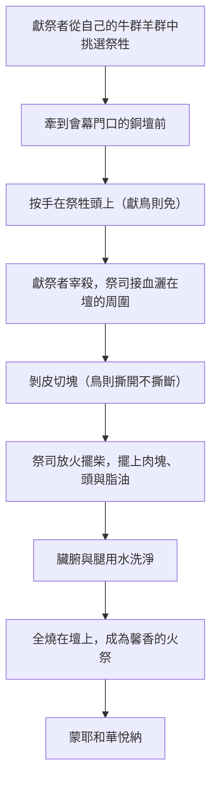

# 利未記 第1章

<!-- chapter-navigation:start -->
|  | [回目錄](../03%20利未記/全書目錄及綱要.md) | [下一章](../03%20利未記/第2章.md) |
| :--- | :---: | ---: |
<!-- chapter-navigation:end -->

1. 耶和華從會幕中呼叫摩西，對他說：
2. 你曉諭以色列人說：你們中間若有人獻[[供物（qorban）|供物]]給耶和華，要從牛群羊群中獻牲畜為供物。
3. 他的[[供物（qorban）|供物]]若以牛為[[燔祭]]，就要在[[會幕門口]]獻一隻[[沒有殘疾的祭牲|沒有殘疾]]的公牛，可以在耶和華面前蒙悅納。
4. 他要[[按手]]在[[燔祭]]牲的頭上，燔祭便蒙悅納，為他贖罪。
5. 他要在耶和華面前宰公牛；[[亞倫和他兒子（祭司）|亞倫子孫]]作祭司的，要奉上[[血的尊重|血]]，把血灑在[[會幕門口]]、[[銅壇（燔祭壇）|壇]]的周圍。
6. 那人要剝去[[燔祭]]牲的皮，把燔祭牲切成塊子。
7. [[亞倫和他兒子（祭司）|祭司亞倫的子孫]]要把火放在[[銅壇（燔祭壇）|壇]]上，把柴擺在火上。
8. [[亞倫和他兒子（祭司）|亞倫子孫]]作祭司的，要把肉塊和頭並脂油擺在[[銅壇（燔祭壇）|壇]]上火的柴上。
9. 但[[燔祭]]的臟腑與腿要用水洗。[[亞倫和他兒子（祭司）|祭司]]就要把一切全燒在[[銅壇（燔祭壇）|壇]]上，當作燔祭，獻與耶和華為[[馨香之氣|馨香]]的[[火祭（isheh）|火祭]]。
10. 人的[[供物（qorban）|供物]]若以綿羊或山羊為[[燔祭]]，就要獻上[[沒有殘疾的祭牲|沒有殘疾]]的公羊。
11. 要把羊宰於[[銅壇（燔祭壇）|壇]]的北邊，在耶和華面前；[[亞倫和他兒子（祭司）|亞倫子孫]]作祭司的，要把羊[[血的尊重|血]]灑在壇的周圍。
12. 要把[[燔祭]]牲切成塊子，連頭和脂油，[[亞倫和他兒子（祭司）|祭司]]就要擺在[[銅壇（燔祭壇）|壇]]上火的柴上；
13. 但臟腑與腿要用水洗，[[亞倫和他兒子（祭司）|祭司]]就要全然奉獻，燒在[[銅壇（燔祭壇）|壇]]上。這是[[燔祭]]，是獻與耶和華為[[馨香之氣|馨香]]的[[火祭（isheh）|火祭]]。
14. 人奉給耶和華的[[供物（qorban）|供物]]，若以鳥為[[燔祭]]，就要獻斑鳩或是雛鴿為供物。
15. [[亞倫和他兒子（祭司）|祭司]]要把鳥拿到[[銅壇（燔祭壇）|壇]]前，揪下頭來，把鳥燒在壇上；鳥的[[血的尊重|血]]要流在壇的旁邊；
16. 又要把鳥的嗉子和髒物（髒物：或作翎毛）除掉，丟在[[銅壇（燔祭壇）|壇]]的東邊倒灰的地方。
17. 要拿著鳥的兩個翅膀，把鳥撕開，只是不可撕斷；[[亞倫和他兒子（祭司）|祭司]]要在[[銅壇（燔祭壇）|壇]]上、在火的柴上焚燒。這是[[燔祭]]，是獻與耶和華為[[馨香之氣|馨香]]的[[火祭（isheh）|火祭]]。

---

## 本章知識節點

### 神學
- [[燔祭]]
- [[馨香之氣]]
- [[血的尊重]]
- [[沒有殘疾的祭牲]]
- [[燔祭祭牲的貧富分級]]

### 原文
- [[按手]]
- [[供物（qorban）]]

### 主題
- [[銅壇（燔祭壇）]]
- [[火祭（isheh）]]

### 地點
- [[會幕門口]]

### 人物
- [[亞倫和他兒子（祭司）]]

### 背景
- [[古代近東的獻祭與燔祭習俗]]

---

## 本章整理

### 神從會幕裡說話（v1-2）

出埃及記結束在會幕落成、榮光充滿；利未記第一句就接著說「耶和華從會幕中呼叫摩西」。GT 丁良才注意到一個容易被中文讀者略過的細節：原文開頭有個連接詞「又」，本書等於是直接接在出埃及記的結尾上。而說話的地點變了——不再是西奈山那個「顯威嚴傳律法之處」，而是施恩座所在的會幕。KC 把這個轉變講得很清楚：從西奈山，神頒下祂的要求和條件；如今祂從自己住在百姓中間的地方說話，講的是獻祭。

神「呼叫摩西」到這裡是第幾次？兩邊算法不同，值得並列：

- CT 與 GT 丁良才都算**四次**：出三4、出十九3、出十九20，加上本節。
- KC 算**三次**：出三4（呼召他作拯救者）、出十九20（讓他認識神的聖潔），第三次就是這裡（與他談敬拜和親近神）。

v2 交代了獻祭最基本的三件事。第一，**這是自願的**。CT 指出，經文說「若有人獻[[供物（qorban）|供物]]」，表示獻祭「乃自願而非強迫，是個別而非群體的行為」；群體性的祭要到贖罪日和節期才出現。第二，**這要付代價**。「供物」的原文 qorban 字根意思是「靠近」，GT《啟導本》譯為「攜近」聖壇的東西——它必須從自己的牛群羊群中取出來，是自己的財產。第三，**這不是全新的制度**。丁良才提醒「這不是神初次把獻祭的條例指示人」，從創世記起亞伯、該隱、挪亞、亞伯拉罕就都獻過祭；《啟導本》說得更直接：「現在的條例只是歷代沿用的崇拜方式的擴充和確立。」

> [!note] 獻祭是要餵飽神嗎？
> GT《啟導本》特別澄清：聖經「嚴厲譴責誤把創造並擁有萬物的天父當作喜歡吃肉喝血的神」，神所喜悅的是人從心靈深處發出的感謝（詩五十7～15）。這一點在[[古代近東的獻祭與燔祭習俗|古代近東的對照]]中格外明顯——周邊民族的神明被認為需要食物維生，以色列的神不是。

### 三級祭牲：按家境分，還是按認識分？（v3-17）

本章按祭牲體型由大到小排成三段：牛（v3-9）、綿羊或山羊（v10-13）、斑鳩或雛鴿（v14-17）。三段走的是同一套程序，差別只在細節。

但**這三級到底按什麼分，是本章最大的一處解讀分歧**：

- **CT 與 GT：按家境分。** CT 說得最白：「獻祭要論家之有無：富厚之家獻公牛，小康之家獻山羊，貧窮人只能獻一隻班鳩。各人要按他所有的存心誠實，只要人的動機存心對，就都蒙主悅納。」GT《串珠》的分法相同。
- **KC：按屬靈認識的深淺分。** 他認為「這幾種不同的祭物，說到一個信徒對主耶穌的工作和祂的位格領會了多少」——獻牛的是看見主許多榮美的年長信徒，獻鳥的則是還沒看見那麼多的人。

兩種讀法的差別不只是角度。按 CT／GT，窮人獻鳥與富人獻牛在神面前完全等值；按 KC，鳥祭確實是「最小的燔祭」，裡面甚至有神不能接受、必須除掉的成分——只是除掉之後，這祭仍然蒙悅納。這整個架構就是[[燔祭祭牲的貧富分級]]這個主題的來源。

還有一個常被忽略的例外：**鳥祭的標準比較寬**。GT《啟導本》指出，對獻鳥的貧窮人「不但可用鳥來替代，且不限公鳥，也沒有規定必須無殘疾」。對照 v3、v10 兩次明寫的[[沒有殘疾的祭牲|沒有殘疾]]，v14-17 確實兩樣都沒要求。

KC 另外給了一個別家沒有的判準——為什麼只能用牛、羊、鳥？因為這三類同時是「潔淨的」和「馴服的」。他舉了個反例：鹿是潔淨的、也可以吃，卻不能作祭物，因為牠不馴服，必須去獵捕；而主耶穌不需要被獵捕，祂是自願來的。

### 一隻祭牲要經過的七個步驟（v3-17）

| 步驟 | 公牛（v3-9） | 綿羊／山羊（v10-13） | 斑鳩／雛鴿（v14-17） |
|------|--------------|---------------------|---------------------|
| 1. 牽到會幕門口 | 獻祭者牽牛到壇前 | 同左，宰於壇的北邊 | 祭司把鳥拿到壇前 |
| 2. 按手在頭上 | 獻祭者親自按手 | 條例從略，同牛 | 不行按手禮 |
| 3. 宰殺、取血 | 獻祭者宰牛，祭司灑血於壇周圍 | 同左 | 祭司揪下頭，血流壇旁 |
| 4. 剝皮、切塊 | 獻祭者剝皮、切成塊子 | 獻祭者切塊 | 祭司撕開但不撕斷 |
| 5. 放火、擺柴 | 祭司放火擺柴，擺上肉塊、頭、脂油 | 同左 | 同左 |
| 6. 洗淨臟腑與腿 | 用水洗 | 用水洗 | 除掉嗉子與翎毛，丟在壇東邊 |
| 7. 全燒為馨香 | 祭司全燒在壇上 | 同左 | 同左 |

```mermaid
flowchart TD
    A["獻祭者從自己的牛群羊群中挑選祭牲"] --> B["牽到會幕門口的銅壇前"]
    B --> C["按手在祭牲頭上（獻鳥則免）"]
    C --> D["獻祭者宰殺，祭司接血灑在壇的周圍"]
    D --> E["剝皮切塊（鳥則撕開不撕斷）"]
    E --> F["祭司放火擺柴，擺上肉塊、頭與脂油"]
    F --> G["臟腑與腿用水洗淨"]
    G --> H["全燒在壇上，成為馨香的火祭"]
    H --> I["蒙耶和華悅納"]
```

第2步的[[按手]]是全章討論最多的動作。它不是輕輕碰一下——丁良才指出同一個原文動詞在詩八十八7譯作「重壓」，原文的意思是倚壓上去。但**它的作用是什麼，四份來源分成三種講法**：CT、丁良才、GT《精讀本》、BH 都認為是把罪轉到祭牲身上；GT《舊約聖經背景註釋》明確反對，理由是「非贖罪的祭也需要按手」，它主張這是認同、替身或宣告所有權；KC 則認為價值是反向流動的——祭牲的價值轉到獻祭的人身上，「神在這祭裡看見他」。

第4步為什麼要剝皮切塊，兩家的讀法不同。CT 讀出屬靈意義：剝皮是「除去我們與世界接觸的部份」，切塊是「接受主的破碎」。丁良才給的是實務理由：切塊「不但便於移動，也是表示仔細檢察的意思，證明這祭牲是十分合格的」。BH 則說剝皮下來的皮歸給祭司（利七8），是百姓對祭司的供養。

### 誰做什麼：獻祭者與祭司的分工

CT 在 v5 下把這條界線劃得很清楚：「本節明確指出宰殺祭牲是獻祭之人的工作，而奉上血和灑血則是祭司的工作。」丁良才把它數成兩張清單——獻祭的人做六件事（獻供物、按手、宰殺、剝皮、切塊、洗臟腑與腿），[[亞倫和他兒子（祭司）|祭司]]做七件事（接血、灑血、整理壇火、擺祭肉、燒素祭、次日倒灰、把灰運到營外）。

值得注意的是，祭司清單的後三件本章都沒寫，要到利未記第六章才交代。**利1只寫了祭司職責的前半。**

獻鳥時分工不一樣。CT 指出因為鳥的體型小，「故幾乎全程由祭司處理，獻祭的人僅擔任除掉內臟和羽毛的工作」——三級祭牲中，獻祭者參與最少的反而是最便宜的那一級。

KC 從新約回看這個分工，得出一個兩者合一的結論：在舊約畫面裡獻祭者和祭司是兩個人，但在新約裡「信徒既是獻祭者，也是祭司」（彼前2:5）。

### 血、火、水、灰：四個動作背後的爭議

**血。** [[血的尊重|血]]能贖罪的理由，CT 與 GT《串珠》都引利十七11：生命在血中。但血究竟洗淨了什麼，三家的落點不同——CT 說是為叫神接納壇上的祭牲，BH 說是潔淨祭壇本身使它成聖，GT《舊約聖經背景註釋》說是洗掉會妨礙祈求的一切污穢。該註釋更進一步主張「贖罪」可能不是最好的譯法：在部分儀式文獻裡，「贖罪」的對象不是罪也不是人，而是祭壇這類聖物，而且有時罪根本沒犯卻仍需「贖罪」，所以它認為譯成「潔淨」或「洗淨」更貼切。

**火。** 壇上的火是不是從不熄滅？兩家講法相反。BH 依利6:13 認為這火要常常燒著，象徵神永在的同在；GT《啟導本》卻從本章 v7「把火放在壇上」讀出相反的做法——每獻一次要重新點火，「應是以色列人在曠野漂泊，會幕隨時遷移的結果」，要到後來停留較久才有火不熄滅的規例。至於火代表什麼，丁良才分成三層（神的喜悅、神的威嚴、神的熬煉）；CT 靈訓則把火與柴讀成兩個方向的熬煉：「表徵耶穌受到從神（火放在壇上）和從人（柴擺在火上）來的熬煉。」

**水。** 臟腑與腿要用水洗。CT 讀作聖靈與真理的潔淨——臟腑「在裡頭看不見，卻藏著汙穢」，洗腿則是「潔淨我們外面的行動」；KC 的角度不同，他說水是神話語的表徵（弗5:26），而主耶穌身上「沒有什麼需要被洗去的」，水在洗之前和之後一樣清。GT《舊約聖經背景註釋》給的是最實際的答案：只有內臟和腿需要洗，「使壇上不致有糞便」。

**灰。** 鳥的嗉子和翎毛要丟在[[銅壇（燔祭壇）|壇]]的東邊倒灰之處。為什麼是東邊，三種說法彼此不合：GT《舊約聖經背景註釋》記下拉比的解釋是「離開聖所最遠」，但補一句「經文並無說明理由」；CT 的推測正相反，說東邊「離外院門口最近的地方，大概方便清理」；BH 則從象徵解，東邊是人親近神時所來的方向，把污穢丟在那裡等於把不潔拋在身後。丁良才另指出，這灰本身帶著蒙悅納的意思——詩二十3的「悅納」二字，按原文有燒成灰的意思。

> [!note] 原文能證明什麼，不能證明什麼
> 這些爭議中，原文資料只能定住語言事實，不能替神學解讀作結。可以直接查證的有：「供物」（qorban）與動詞「獻」確實出自同一字根，動詞用的是使役語態，字面就是「使之靠近」；「宰」的字面是「割斷喉嚨」；「按手」的字面是「倚壓」；「壇的北邊」的「邊」字本義是「大腿」；「灰」這個字兼有「灰燼」與「肥美」兩義。至於按手是否轉移罪、火是否常燒不滅、東邊倒灰有何用意——原文不提供答案，那是註釋之間的判斷差異。

### 馨香的火祭：神真的喜歡那個氣味嗎？（v9,13,17）

三段條例都以同一句話收尾：「獻與耶和華為馨香的火祭。」

「[[馨香之氣|馨香]]」在原文是兩個字。CT 分開註解：「馨」是安靜、舒坦，「香」是氣味、香氣——合起來是「令人安舒的氣味」。GT《精讀本》給的中文對應相同：指「祭物被神悅納、因罪而有的震怒止息、充滿安定平和的氣氛」。

**但神是不是真的喜歡那股氣味，GT 內部四家分成兩邊：**

- **丁良才：是借喻。** 他給兩個證據——「被燒的肉和脂油本來沒有什麼香氣」；「在營外所燒之贖罪祭的氣味與馨香祭也是一樣的，卻不稱為馨香祭」。
- **《啟導本》：同意是借喻。** 「不是說神喜歡聞到祭物燒出的氣味，象偶像那樣食人間煙火。」
- **《串珠》：是擬人的說法**，描寫神接納子民奉獻的滿足。
- **《雷氏研讀本》：取字面。** 「即神喜歡祭物的香味，這香味叫祂喜悅。」

至於「[[火祭（isheh）|火祭]]」，GT《精讀本》提醒它「不是祭的種類，是獻祭的方法」——凡把全部或一部分供物燒在壇上的，都叫火祭。這個詞還有另一層意思：和合本譯作「火祭」是把它連到「火」，但原文詞典給的是「食物之祭」，BH 也譯作 a food offering，並說明這祭雖不由人食用，仍是獻給神的禮物。GT《串珠》的總論正好呼應：燔祭、素祭、平安祭「都是獻與耶和華作為馨香火祭的食物」。

這裡的「燒」字也不是一般的燒。丁良才指出它的原文意思是「使之上升」，和營外焚燒（燒毀）用的是不同的字；GT《精讀本》說「焚燒不是指完全焚毀，而是為了把香氣獻給神而精心的焚燒」。

### 燔祭與基督（全章）

[[燔祭]]之所以排在五祭之首，KC 給的理由是次序上的用意：對罪人來說贖罪祭該排第一，因為那是脫離罪的必需；但神從燔祭開始，因為燔祭說的是主耶穌在十字架上為榮耀神所做的一切，「祂兒子工作的這一面，是神心中最寶貴的」。他並指出約翰福音正是這個角度——那卷書裡沒有被算為罪、沒有三小時的黑暗、沒有客西馬尼，一切都出於主自己。

CT 靈訓則逐項列出對應：公牛預表祂是忍耐勞苦忠心的僕人；綿羊預表柔順良善；山羊預表祂為我們「成為罪」；斑鳩雛鴿預表祂甘願成為卑賤貧窮。全然焚燒表徵祂「一切所有都毫無保留的奉獻給神」，而燒成的灰表示「奉獻永不改變」。

丁良才為全章下的結語，是把兩種祭的分工說清楚：「贖罪祭預表耶穌贖人的罪過，燔祭預表耶穌補人的不及。」人單單不作惡是不夠的，還須盡力行善才算盡了本分；而我們做不到的那一部分，須基督補足。

> [!important] 這一章的重點
> [[燔祭]]不是為某一件特定的罪而獻（那屬贖罪祭與贖愆祭），而是**獻祭者整個人完全、自願、無保留地獻給神**。丁良才說，獻這祭的人應具有三種觀念：他全心全性全意全力事奉神是理所當然的；他既沒有如此事奉便是有罪、也是應當死的，所以用祭牲的生命代替他的生命；而那代替他的祭牲必須完美，才可以蒙神悅納。新約把同一件事交到信徒手上：「將身體獻上，當作活祭，是聖潔的，是神所喜悅的」（羅十二1）。

**參考資料**
https://www.ccbiblestudy.org/Old%20Testament/03Lev/03CT01.htm
https://www.ccbiblestudy.org/Old%20Testament/03Lev/03GT01.htm
https://www.kingcomments.com/en/bible-studies/Lev/1
https://biblehub.com/study/leviticus/1.htm
https://github.com/STEPBible/STEPBible-Data

<!-- chapter-navigation:start -->
|  | [回目錄](../03%20利未記/全書目錄及綱要.md) | [下一章](../03%20利未記/第2章.md) |
| :--- | :---: | ---: |
<!-- chapter-navigation:end -->
