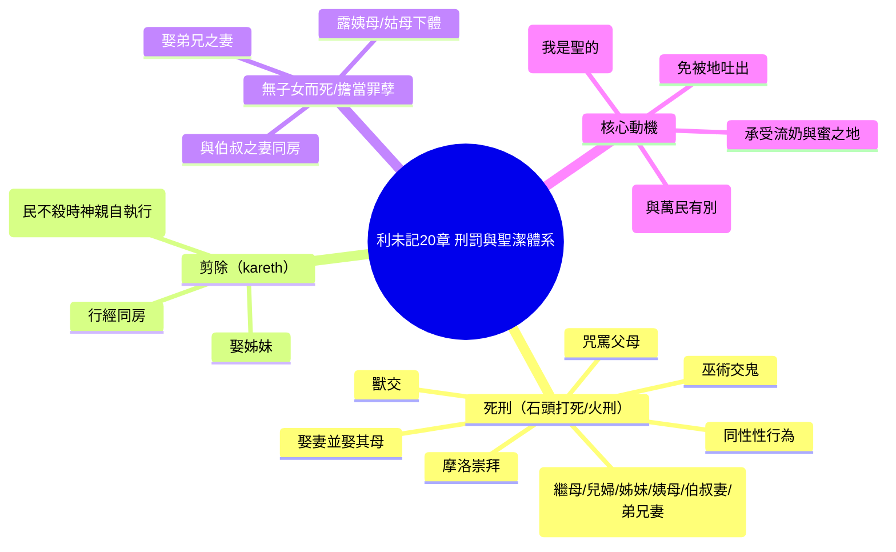

# 利未記 第20章

1. 耶和華對[[摩西]]說：
2. 你還要曉諭[[以色列全會眾|以色列人]]說：凡以色列人，或是在以色列中[[寄居的（ger）|寄居的外人]]，把自己的[[摩洛死刑條例（獻兒女給摩洛）|兒女獻給摩洛]]的，[[咒罵父母死刑條例|總要治死他]]；[[以色列全會眾|本地人]]要用石頭把他打死。
3. 我也要向那人變臉，把他[[剪除（kareth）|從民中剪除]]；因為他把[[摩洛死刑條例（獻兒女給摩洛）|兒女獻給摩洛]]，玷污我的聖所，褻瀆我的聖名。
4. 那人把[[摩洛死刑條例（獻兒女給摩洛）|兒女獻給摩洛]]，[[以色列全會眾|本地人]]若佯為不見，不把他治死，
5. 我就要向這人和他的家變臉，把他和一切隨他[[摩洛死刑條例（獻兒女給摩洛）|與摩洛行邪淫]]的人都[[剪除（kareth）|從民中剪除]]。
6. 人[[偏向交鬼行巫術死刑條例|偏向交鬼的]]和行巫術的，[[偏向交鬼行巫術死刑條例|隨他們行邪淫]]，我要向那人變臉，把他[[剪除（kareth）|從民中剪除]]。
7. 所以你們要[[聖潔|自潔成聖]]，因為我是耶和華─你們的神。
8. 你們要[[律例典章|謹守遵行我的律例]]；我是[[聖潔|叫你們成聖的耶和華]]。
9. 凡[[咒罵父母死刑條例|咒罵父母]]的，[[咒罵父母死刑條例|總要治死他]]；他咒罵了父母，他的罪（罪原文作血；本章同）要歸到他身上。
10. [[姦淫死刑條例（與鄰舍妻行淫）|與鄰舍之妻行淫]]的，[[姦淫死刑條例（與鄰舍妻行淫）|姦夫淫婦]][[姦淫死刑條例（與鄰舍妻行淫）|都必治死]]。
11. [[與繼母行淫死刑條例|與繼母行淫]]的，就是[[與繼母行淫死刑條例|羞辱了他父親]]，總要把他們二人治死，[[交鬼行巫術死刑條例（男女）|罪要歸到他們身上]]。
12. [[與兒婦同房死刑條例|與兒婦同房]]的，總要把他們二人治死；他們行了[[逆倫（tevel）|逆倫]]的事，[[交鬼行巫術死刑條例（男女）|罪要歸到他們身上]]。
13. 人若[[同性戀死刑條例|與男人苟合]]，像與女人一樣，他們二人[[同性戀死刑條例|行了可憎的事]]，總要把他們治死，[[交鬼行巫術死刑條例（男女）|罪要歸到他們身上]]。
14. 人若娶妻，並娶其母，便是[[娶妻並娶其母火刑條例|大惡]]，要把這[[火刑|三人用火焚燒]]，使你們中間免去大惡。
15. 人若[[獸交死刑條例|與獸淫合]]，[[咒罵父母死刑條例|總要治死他]]，也要[[獸交死刑條例|殺那獸]]。
16. 女人若與獸親近，與他淫合，你要殺那女人和那獸，總要把他們治死，[[交鬼行巫術死刑條例（男女）|罪要歸到他們身上]]。
17. 人若[[娶姊妹被剪除條例|娶他的姊妹]]，無論是異母同父的，是異父同母的，[[娶姊妹被剪除條例|彼此見了下體]]，這是[[娶姊妹被剪除條例|可恥的事]]；他們必在本民的眼前[[剪除（kareth）|被剪除]]。他露了姊妹的下體，必[[露姨母姑母下體擔當罪孽條例|擔當自己的罪孽]]。
18. [[行經同房被剪除條例|婦人有月經]]，若與他同房，露了他的下體，就是露了婦人的[[血源（maqor）|血源]]，婦人也露了自己的血源，[[行經同房被剪除條例|二人必從民中剪除]]。
19. 不可露姨母或是姑母的下體，這是露了[[骨肉之親（she'er besaro）|骨肉之親]]的下體；二人必[[露姨母姑母下體擔當罪孽條例|擔當自己的罪孽]]。
20. 人若[[與伯叔之妻同房無子女而死條例|與伯叔之妻同房]]，就[[與伯叔之妻同房無子女而死條例|羞辱了他的伯叔]]；二人要[[與伯叔之妻同房無子女而死條例|擔當自己的罪]]，必無子女而死。
21. 人若[[娶弟兄之妻污穢無子女條例|娶弟兄之妻]]，這本是[[娶弟兄之妻污穢無子女條例|污穢的事]]，[[娶弟兄之妻污穢無子女條例|羞辱了他的弟兄]]；二人必無子女。
22. 所以，你們要謹守遵行我一切的[[律例典章]]，免得我領你們去住的[[地吐出居民審判|那地把你們吐出]]。
23. 我在你們面前所逐出的[[迦南人|國民]]，你們[[地吐出居民審判|不可隨從他們的風俗]]；因為他們行了這一切的事，所以[[地吐出居民審判|我厭惡他們]]。
24. 但我對你們說過，你們要[[承受迦南地流奶與蜜之地|承受他們的地]]，就是我要賜給你們為業、[[承受迦南地流奶與蜜之地|流奶與蜜之地]]。我是耶和華─你們的神，使你們與萬民有分別的。
25. 所以，你們要把潔淨和不潔淨的禽獸分別出來；不可因我給你們分為不潔淨的禽獸，或是滋生在地上的活物，使自己成為[[可憎（sheqets）|可憎惡的]]。
26. [[你們要歸我為聖]]，因為我─耶和華是聖的，並叫你們與萬民有分別，使你們作我的民。
27. 無論男女，是[[交鬼行巫術死刑條例（男女）|交鬼的]]或行巫術的，[[交鬼行巫術死刑條例（男女）|總要治死他們]]。人必用石頭把他們打死，[[交鬼行巫術死刑條例（男女）|罪要歸到他們身上]]。

---

## 本章知識節點

### 神學
- [[聖潔]]
- [[分別為聖]]
- [[你們要歸我為聖]]
- [[地吐出居民審判]]
- [[承受迦南地流奶與蜜之地]]

### 律法條例
- [[摩洛死刑條例（獻兒女給摩洛）]]
- [[偏向交鬼行巫術死刑條例]]
- [[咒罵父母死刑條例]]
- [[姦淫死刑條例（與鄰舍妻行淫）]]
- [[與繼母行淫死刑條例]]
- [[與兒婦同房死刑條例]]
- [[同性戀死刑條例]]
- [[娶妻並娶其母火刑條例]]
- [[獸交死刑條例]]
- [[娶姊妹被剪除條例]]
- [[行經同房被剪除條例]]
- [[露姨母姑母下體擔當罪孽條例]]
- [[與伯叔之妻同房無子女而死條例]]
- [[娶弟兄之妻污穢無子女條例]]
- [[潔淨與不潔淨動物分別]]
- [[交鬼行巫術死刑條例（男女）]]

### 刑罰方式
- [[石頭打死]]
- [[火刑]]
- [[剪除（kareth）]]
- [[無子女而死]]

### 概念用語
- [[逆倫（tevel）]]
- [[血源（maqor）]]
- [[可憎（sheqets）]]
- [[骨肉之親（she'er besaro）]]
- [[寄居的（ger）]]
- [[摩洛（Molech）]]

### 人物
- [[摩西]]
- [[以色列全會眾]]
- [[迦南人]]
- [[亞捫人]]

### 核心律例
- [[律例典章]]

---

## 本章整理

### 死刑與剪除條例：摩洛崇拜與巫術（v1-8）
本章開篇即以極嚴厲的語氣處理兩大屬靈叛逆罪行：[[摩洛死刑條例（獻兒女給摩洛）|獻兒女給摩洛]]與[[偏向交鬼行巫術死刑條例|偏向交鬼行巫術]]。[[摩西]]傳達神命令，凡以色列人或[[寄居的（ger）|寄居的外人]]將兒女獻給[[摩洛（Molech）|摩洛]]，必被[[石頭打死]]；若百姓佯為不見，神必親自向犯罪者及其家變臉，並將他們從民中[[剪除（kareth）|剪除]]。這顯示[[聖潔]]不僅是個人責任，更是共同體的公義義務。緊接著禁止[[偏向交鬼行巫術死刑條例|偏向交鬼行巫術]]，強調「我是叫你們成聖的耶和華」（v7-8），將屬靈忠誠視為[[分別為聖]]的核心。

### 性倫理與家庭純潔的死刑條例（v9-21）
經文隨即列出十項性倫理犯罪，刑罰分級精確：[[咒罵父母死刑條例|咒罵父母]]、[[姦淫死刑條例（與鄰舍妻行淫）|姦淫]]、[[與繼母行淫死刑條例|與繼母行淫]]、[[與兒婦同房死刑條例|與兒婦同房]]、[[同性戀死刑條例|同性性行為]]、[[娶妻並娶其母火刑條例|娶妻並娶其母]]、[[獸交死刑條例|獸交]]均判[[石頭打死]]或[[火刑]]，罪歸自己；[[娶姊妹被剪除條例|娶姊妹]]、[[行經同房被剪除條例|行經同房]]則被[[剪除（kareth）|剪除]]；[[露姨母姑母下體擔當罪孽條例|露姨母/姑母下體]]、[[與伯叔之妻同房無子女而死條例|與伯叔之妻同房]]、[[娶弟兄之妻污穢無子女條例|娶弟兄之妻]]則擔當罪孽、[[無子女而死]]。這些條例以「[[逆倫（tevel）|逆倫]]」（tevel）、「[[骨肉之親（she'er besaro）|骨肉之親]]」、「[[血源（maqor）|血源]]」等術語，界定家庭秩序的神聖界線，保護[[以色列全會眾]]免受[[迦南人]]風俗污染。

### 聖潔分別與承受應許之地（v22-26）
神宣告遵守[[律例典章]]是免被[[地吐出居民審判|那地吐出]]的條件（v22），因[[迦南人]]行這一切事被神厭惡。應許之地[[承受迦南地流奶與蜜之地|流奶與蜜之地]]的賜予，目的是使以色列「與萬民有分別」（v24, 26）。此處引入[[潔淨與不潔淨動物分別|潔淨不潔淨禽獸分別]]（v25），將飲食律法納入聖潔體系，呼應「你們要歸我為聖，因為我耶和華是聖的」（v26），即[[你們要歸我為聖]]。

### 巫術死刑重申（v27）
章末重申[[交鬼行巫術死刑條例（男女）|男女交鬼行巫術]]必死，[[石頭打死]]，罪歸自己，形成與開頭（v6）的首尾呼應，將屬靈奸淫視為社會毒瘤。

### 跨章脈絡：聖潔法典的刑罰體系與新約呼應
利未記20章構建「罪—刑—聖」三角結構：以[[石頭打死]]、[[火刑]]、[[剪除（kareth）|剪除]]、[[無子女而死]]四級刑罰，守護[[聖潔]]邊界。新約雖廢除民事刑罰，保留教會紀律（林前5:13「把那惡人從你們中間趕出去」），[[聖潔]]呼召轉為內在聖靈重生（彼前1:15-16），[[分別為聖]]從禮儀外延轉向生命內質。

**參考資料**
https://www.ccbiblestudy.org/Old%20Testament/03Lev/03CT20.htm
https://www.ccbiblestudy.org/Old%20Testament/03Lev/03GT20.htm
https://www.kingcomments.com/en/bible-studies/Lev/20
https://biblehub.com/study/leviticus/20.htm
