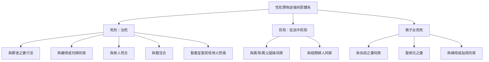

# 利未記 第20章

1. 耶和華對[[摩西]]說：
2. 你還要曉諭以色列人說：凡以色列人，或是在以色列中寄居的外人，把自己的兒女獻給摩洛的，[[摩洛獻兒女治死條例（含知情連坐）|總要治死他；本地人要用石頭把他打死]]。
3. 我也要向那人變臉，把他從民中剪除；因為他把兒女獻給摩洛，玷污我的聖所，褻瀆我的聖名。
4. 那人把兒女獻給摩洛，[[摩洛獻兒女治死條例（含知情連坐）|本地人若佯為不見，不把他治死]]，
5. 我就要向這人和他的家變臉，把他和一切隨他與摩洛行邪淫的人都從民中剪除。
6. [[不可偏向交鬼行巫術的|人偏向交鬼的和行巫術的]]，隨他們行邪淫，我要向那人變臉，把他從民中剪除。
7. [[你們要聖潔因為我是聖潔的|所以你們要自潔成聖]]，因為我是耶和華─你們的神。
8. 你們要謹守遵行我的律例；[[你們要聖潔因為我是聖潔的|我是叫你們成聖的耶和華]]。
9. [[咒罵父母|凡咒罵父母的，總要治死他]]；他咒罵了父母，他的罪（罪原文作血；本章同）要歸到他身上。
10. [[不可姦淫|與鄰舍之妻行淫的，姦夫淫婦都必治死]]。
11. [[近親性關係的十二項條例|與繼母行淫的，就是羞辱了他父親]]，總要把他們二人治死，罪要歸到他們身上。
12. [[近親性關係的十二項條例|與兒婦同房的，總要把他們二人治死]]；他們行了逆倫的事，罪要歸到他們身上。
13. [[不可與男人苟合可憎惡的事|人若與男人苟合，像與女人一樣]]，他們二人行了可憎的事，總要把他們治死，罪要歸到他們身上。
14. [[娶妻並娶其母用火焚燒的大惡條例|人若娶妻，並娶其母，便是大惡]]，[[娶妻並娶其母用火焚燒的大惡條例|要把這三人用火焚燒]]，使你們中間免去大惡。
15. [[不可與獸淫合逆性的事|人若與獸淫合，總要治死他，也要殺那獸]]。
16. 女人若與獸親近，與他淫合，你要殺那女人和那獸，總要把他們治死，罪要歸到他們身上。
17. 人若娶他的姊妹，無論是異母同父的，是異父同母的，彼此見了下體，這是可恥的事；他們必在本民的眼前被剪除。他露了姊妹的下體，必擔當自己的罪孽。
18. [[不可與經期婦人親近|婦人有月經，若與他同房]]，露了他的下體，就是露了婦人的血源，婦人也露了自己的血源，二人必從民中剪除。
19. [[近親性關係的十二項條例|不可露姨母或是姑母的下體]]，這是露了骨肉之親的下體；二人必擔當自己的罪孽。
20. 人若與伯叔之妻同房，就羞辱了他的伯叔；[[無子女而死的刑罰|二人要擔當自己的罪，必無子女而死]]。
21. 人若娶弟兄之妻，這本是污穢的事，羞辱了他的弟兄；[[無子女而死的刑罰|二人必無子女]]。
22. 所以，你們要謹守遵行我一切的律例典章，[[玷污自己也玷污地|免得我領你們去住的那地把你們吐出]]。
23. 我在你們面前所逐出的國民，你們不可隨從他們的風俗；因為他們行了這一切的事，所以我厭惡他們。
24. 但我對你們說過，你們要承受他們的地，就是我要賜給你們為業、流奶與蜜之地。我是耶和華─你們的神，使你們與萬民有分別的。
25. 所以，[[潔淨與不潔淨的早期區分|你們要把潔淨和不潔淨的禽獸分別出來]]；不可因我給你們分為不潔淨的禽獸，或是滋生在地上的活物，使自己成為可憎惡的。
26. [[你們要聖潔因為我是聖潔的|你們要歸我為聖，因為我─耶和華是聖的]]，並叫你們與萬民有分別，使你們作我的民。
27. 無論男女，[[不可偏向交鬼行巫術的|是交鬼的或行巫術的，總要治死他們]]。人必用石頭把他們打死，罪要歸到他們身上。

---

## 本章知識節點

### 主題
- [[你們要聖潔因為我是聖潔的]]
- [[玷污自己也玷污地]]

### 事件
- [[摩洛獻兒女治死條例（含知情連坐）]]
- [[娶妻並娶其母用火焚燒的大惡條例]]
- [[無子女而死的刑罰]]

### 互文
- [[出20：12|出20：12 第五誡當孝敬父母]]
- [[出20：14|出20：14 第七誡不可姦淫]]
- [[利18：21|利18：21 不可使兒女經火歸摩洛]]
- [[利18：22|利18：22 不可與男人苟合]]
- [[利18：23|利18：23 不可與獸淫合]]
- [[申18：10-12|申18：10-12 不可交鬼行巫術]]
- [[申25：5-10|申25：5-10 弟續兄孀的婚姻法]]
- [[林前5：13|林前5：13 教會趕出惡人]]
- [[彼前1：15-16|彼前1：15-16 你們要聖潔]]

### 人物
- [[摩西]]

### 文化
- [[潔淨與不潔淨的早期區分]]

### 神學
- [[分別為聖]]

---

## 本章整理

### 嚴禁拜偶像與行邪術的死刑條例（v1-6, 27）

利未記第二十章緊接著第十八、十九章的禁令，具體列出了違反聖潔條例的刑罰。正如《啟導本》所言，前兩章列述有關人與人間行為的條例，本章則講述違反這些條例的刑罰。若沒有刑罰，律法便形同具文。本章首尾呼應，將宗教性的罪惡置於首尾兩端（v1-6, 27），凸顯其嚴重性。

首段處理將兒女獻給摩洛的罪。摩洛是亞捫人的神，其崇拜涉及將嬰孩獻為火祭。CT指出，無論在舊約或新約時代，神的本性都顯明祂絕不願意獻人為祭，因為祂是慈愛的真神，也是無助者的神。對於犯此罪者，神吩咐本地人必須用石頭將其打死。BH註解提到，用石頭打死是一種團體性的死刑，每個人都參與其中，作為淨化禮，表明整個群體在除罪上有份。

值得注意的是[[摩洛獻兒女治死條例（含知情連坐）]]的連坐規定。若本地人「佯為不見」，神宣告必向這人和他的家變臉，將他與一切隨從者剪除。CT提醒這提出了以色列百姓信仰的連帶責任問題，聖徒不是單數而是複數，不應對罪漠不關心。BH亦指出，這種視而不見的態度證明了對邪惡的冷漠，甚至可能暗示對邪惡的暗中或公開同意。

此外，偏向交鬼和行巫術者同樣面臨被剪除的刑罰。CT強調，交鬼的與行巫術的信息不是來自神，與邪靈相交極其危險；對於未來，信徒不需求助於玄秘之術，聖經的指引才是絕對可靠的。本章第27節進一步對行巫術者本身判處石頭打死之刑，將首尾的宗教罪行完整框起。

### 嚴禁逆倫與性犯罪的刑罰（v7-21）

在宗教性刑罰之後，經文轉入家庭與性倫理的規範。第7-8節先發出總括性的勸勉：「所以你們要自潔成聖，因為我是耶和華你們的神。」CT在解釋時點出，聖潔從神而來，只有神才是人成為聖潔的根源，人不能靠自己達到聖潔。

隨後經文列出一系列逆倫與性犯罪的刑罰。首先是[[咒罵父母]]者必被治死。CT與GT皆指出，孝敬父母是第一條帶應許的誡命，父母在家庭中代表了神的權柄，咒罵父母等於褻瀆神。BH補充，這裡的「咒罵」不僅是言語上的粗鄙，而是以輕藐的態度對待父母，是一種背叛與拒絕神所設立權威的態度。

接著是各種[[不可姦淫]]及[[近親性關係的十二項條例]]的刑罰。這些罪行破壞了婚姻的盟約與家庭的界線。其中，與鄰舍之妻行淫、與繼母或兒婦同房、[[不可與男人苟合可憎惡的事]]，以及[[不可與獸淫合逆性的事]]，皆處以死刑。GT引用《舊約背景註釋》說明，在古代近東，性法例所針對的罪行與拜偶像同等嚴重，因為兩者都能玷污人和地。特別的是[[娶妻並娶其母用火焚燒的大惡條例]]，此罪被定為「大惡」，需用火焚燒三人，以從民中除去這極大的道德腐敗。

然而，並非所有亂倫罪皆處死刑。與姨母、姑母、伯叔之妻或弟兄之妻同房者，經文宣告他們必擔當自己的罪孽，並承受[[無子女而死的刑罰]]。GT說明，在希伯來文化中，生育子女、後代繁盛是神的祝福，無子女而死被視為神莫大的咒詛與審判，意味著家庭被剪除，並有老來死後孤苦的危險。

### 呼召分別為聖與警告被地吐出（v22-26）

本章末段轉向勸勉與警告，將律例的遵守與「地」的命運緊密相連。神警告以色列人若不謹守遵行律例，所居住的迦南地會將他們「吐出」。CT解釋，這意指被擄分散到各國；全本聖經啟示在地與人之間有密切的關係，人若受玷污和敗壞，地就不再為人效力，會把人吐出去。GT亦指出，迦南人被驅逐並非單因神偏愛以色列，而是因迦南人的罪惡滿盈；若以色列人陷在罪中，神也會照樣驅逐他們。

神強調祂將以色列人從萬民中分別出來，使他們承受流奶與蜜之地。這揀選帶有明確目的：[[你們要聖潔因為我是聖潔的]]。KC指出，神將百姓分別出來歸於自己，他們必須維持這分別，在飲食上區分潔淨與不潔淨的動物。這[[潔淨與不潔淨的早期區分]]不僅是衛生規定，更是屬靈界線的日常提醒。KC進一步應用指出，若我們以屬靈的「潔淨食物」餵養自己，思想就會純淨；若吃世界的食物，就會思想如世界、行為如世界。

> [!quote] CT 關於「分別」的尊貴
> 神子民的誇耀，不是屬地的豐富，在地上的成功，也不是科技的發達，文明的進步；甚至不是人怎麼好，包括品德的良好，知識的優越。所應當誇耀的，是「與眾不同」。

### 跨章脈絡與新約預表整理

利未記第二十章的刑罰體系，不僅是舊約以色列民的民事律法，其背後的神學原則在新約中得到了延續與轉化。本章強調「從民中剪除」或「治死」的刑罰，旨在將罪惡從神子民的群體中徹底清除。KC在論及此原則時，將舊約的死刑連結至新約教會的懲戒原則：「在以色列，死刑對教會的意義是：『你們應當把那惡人從你們中間趕出去』（林前5:13）。」這意味著在教會時代，對付罪的方式不再是肉體的消滅，而是屬靈的隔絕與管教，以維持教會的聖潔。

此外，本章關於「不可隨從外邦風俗」與「分別為聖」的呼籲，在彼得前書中得到了明確的呼應。彼得引用利未記的精髓，教導新約信徒：「那召你們的既是聖潔，你們在一切所行的事上也要聖潔」（彼前1:15-16）。舊約以色列人透過飲食條例與刑罰維持外在的聖潔界線，新約信徒則被要求在心思意念與行事為人上，與世俗的價值觀分別出來。本章所揭示「罪導致人與地受咒詛」的因果關係，最終在基督的救贖中得著翻轉——基督親自擔當了律法所定的罪刑，使一切信祂的人得以脫離「被地吐出」的審判，成為真正歸神為聖的子民。

**參考資料**
https://www.ccbiblestudy.org/Old%20Testament/03Lev/03CT20.htm
https://www.ccbiblestudy.org/Old%20Testament/03Lev/03GT20.htm
https://www.kingcomments.com/en/bible-studies/Lev/20
https://biblehub.com/study/leviticus/20.htm
