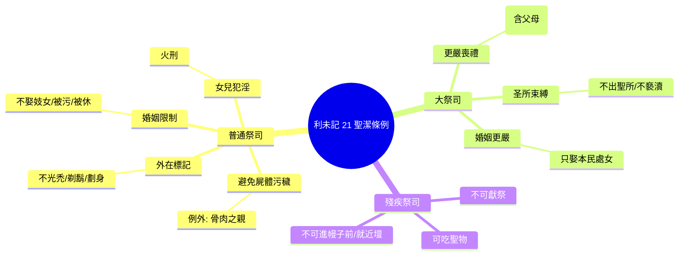

# 利未記 第21章

1. 耶和華對[[摩西]]說：你告訴[[亞倫和他兒子（祭司）|亞倫子孫作祭司的]]說：祭司不可為民中的死人沾染自己，
2. 除非為他骨肉之親的父母、兒女、弟兄，
3. 和未曾出嫁、作[[處女]]的姊妹，才可以沾染自己。
4. [[亞倫和他兒子（祭司）|祭司]]既[[祭司不可從俗沾染自己|在民中為首]]，就[[祭司不可從俗沾染自己|不可從俗沾染自己]]。
5. [[祭司不可使頭光禿剃鬍鬚用刀劃身|不可使頭光禿]]；[[祭司不可使頭光禿剃鬍鬚用刀劃身|不可剃除鬍鬚的周圍]]，也[[祭司不可使頭光禿剃鬍鬚用刀劃身|不可用刀劃身]]。
6. [[祭司聖潔條例總綱|要歸神為聖]]，[[祭司聖潔條例總綱|不可褻瀆神的名]]；因為耶和華的火祭，就是神的食物，是他們獻的，所以他們要成為聖。
7. [[祭司婚姻條例（不可娶妓女被污被休的女人）|不可娶妓女]]或[[被污的女人]]為妻，也[[祭司婚姻條例（不可娶妓女被污被休的女人）|不可娶被休的婦人]]為妻，因為[[亞倫和他兒子（祭司）|祭司]]是[[聖潔|歸神為聖]]。
8. 所以你要使他成聖，因為他奉獻你神的食物；你要以他為聖，因為我─使你們成聖的耶和華─是聖的。
9. [[祭司女兒行淫火刑條例|祭司的女兒若行淫]]辱沒自己，就[[祭司女兒行淫火刑條例|辱沒了父親]]，必用火將他[[火刑|焚燒]]。
10. [[大祭司|在弟兄中作大祭司]]、頭上倒了[[聖膏油|膏油]]、又承接聖職，穿了聖衣的，不可蓬頭散髮，也[[大祭司不可蓬頭散髮撕裂衣服|不可撕裂衣服]]。
11. [[大祭司不可挨近死屍為父母沾染|不可挨近死屍]]，也[[大祭司不可挨近死屍為父母沾染|不可為父母沾染自己]]。
12. 不可出[[聖所]]，也[[大祭司不可出聖所褻瀆聖所|不可褻瀆神的聖所]]，因為神[[聖膏油|膏油]]的[[境界|冠冕]]在他頭上。我是耶和華。
13. 他要娶[[處女]]為妻。
14. [[被休的婦人|寡婦]]或是[[被休的婦人]]，或是[[被污的女人|被污為妓的女人]]，都不可娶；只可娶本民中的[[處女]]為妻。
15. 不可在民中辱沒他的兒女，因為我是叫他成聖的耶和華。
16. 耶和華對[[摩西]]說：
17. 你告訴[[亞倫]]說：你[[世世代代]]的[[世世代代|後裔]]，凡有[[殘疾]]的，都不可近前來獻他神的食物。
18. 因為凡有[[殘疾]]的，無論是[[殘疾|瞎眼]]的、[[殘疾|瘸腿]]的、[[殘疾|塌鼻子]]的、[[殘疾|肢體有餘]]的、
19. [[殘疾|折腳折手]]的、
20. [[殘疾|駝背]]的、[[殘疾|矮矬]]的、[[殘疾|眼睛有毛病]]的、[[殘疾|長癬]]的、[[殘疾|長疥]]的，或是[[殘疾|損壞腎子]]的，都不可近前來。
21. [[亞倫和他兒子（祭司）|祭司]][[亞倫]]的[[世世代代|後裔]]，凡有[[殘疾]]的，都不可近前來，將火祭獻給耶和華。他有殘疾，不可近前來獻神的食物。
22. 神的食物，無論是聖的，至聖的，他都可以吃。
23. 但[[有殘疾祭司可吃神食物但不可進幔子前就近壇前|不可進到幔子前]]，也[[有殘疾祭司可吃神食物但不可進幔子前就近壇前|不可就近壇前]]；因為他有[[殘疾]]，免得褻瀆我的[[聖所]]。我是叫他成聖的耶和華。
24. 於是，[[摩西]]曉諭[[亞倫]]和亞倫的子孫，並[[以色列眾人]]。

---

## 本章知識節點

### 神學
- [[聖潔]]
- [[境界]]
- [[無瑕疵]]
- [[世世代代]]

### 制度
- [[祭司聖潔條例總綱]]
- [[大祭司]]
- [[拿細耳人]]
- [[祭司不可為民中死人沾染自己]]
- [[祭司不可從俗沾染自己]]
- [[祭司不可使頭光禿剃鬍鬚用刀劃身]]
- [[祭司婚姻條例（不可娶妓女被污被休的女人）]]
- [[祭司女兒行淫火刑條例]]
- [[大祭司不可蓬頭散髮撕裂衣服]]
- [[大祭司不可挨近死屍為父母沾染]]
- [[大祭司不可出聖所褻瀆聖所]]
- [[大祭司婚姻條例（只可娶處女）]]
- [[祭司有殘疾不可近前獻神食物]]
- [[有殘疾祭司可吃神食物但不可進幔子前就近壇前]]

### 人物
- [[亞倫]]
- [[摩西]]
- [[亞倫和他兒子（祭司）]]
- [[祭司女兒]]
- [[以色列眾人]]
- [[骨肉之親（she'er besaro）]]

### 物品
- [[聖膏油]]
- [[聖所]]
- [[內幔（隔聖所至聖所的幔子）]]

### 刑罰
- [[火刑]]

### 狀態
- [[褻瀆神的名]]
- [[被污的女人]]
- [[被休的婦人]]
- [[處女]]
- [[殘疾]]

---

## 本章整理

### 祭司避免屍體污穢與外在聖潔標記（v1-6）
耶和華吩咐[[摩西]]傳達給[[亞倫和他兒子（祭司）|亞倫子孫作祭司的]]：祭司不可為民中的死人[[祭司不可為民中死人沾染自己|沾染自己]]，除非為[[骨肉之親（she'er besaro）|骨肉之親]]——父母、兒女、弟兄、未出嫁的姊妹（v1-3）。祭司既在民中為首，就不可[[祭司不可從俗沾染自己|從俗沾染自己]]（v4）。外在身體標記上，不可[[祭司不可使頭光禿剃鬍鬚用刀劃身|使頭光禿、剃除鬍鬚周圍、用刀劃身]]（v5），這與周邊民族喪禮習俗劃清界限。核心動機：「要歸神為聖，不可褻瀆神的名；因為耶和華的火祭，就是神的食物，是他們獻的，所以他們要成為聖」（v6）。

### 祭司婚姻條例與女兒犯淫處置（v7-9）
祭司婚姻受嚴格限制：[[祭司婚姻條例（不可娶妓女被污被休的女人）|不可娶妓女、被污的女人、被休的婦人為妻]]（v7），因祭司歸神為聖。百姓要使祭司成聖，因獻神食物的祭司當被視為聖，耶和華使他們成聖是聖的（v8）。祭司女兒若行淫，[[祭司女兒行淫火刑條例|辱沒父親，必用火焚燒]]（v9），顯示祭司家庭聖潔責任延伸至下一代。

### 大祭司更高標準：喪禮、聖所、婚姻（v10-15）
大祭司頭上倒了[[聖膏油]]、穿聖衣，有三重獨特限制：
1. **喪禮**：不可蓬頭散髮、撕裂衣服（[[大祭司不可蓬頭散髮撕裂衣服]]），不可挨近死屍，甚至為父母也不可沾染（[[大祭司不可挨近死屍為父母沾染]]，v10-11）。
2. **聖所**：不可出[[聖所]]、不可褻瀆聖所，因神膏油的冠冕在他頭上（[[大祭司不可出聖所褻瀆聖所]]，v12）。
3. **婚姻**：[[大祭司婚姻條例（只可娶處女）|只可娶本民中的處女為妻]]，寡婦、被休、被污為妓的都不可娶（v13-14），免得在民中辱沒兒女（v15）。

### 有殘疾祭司：可吃聖物、不可獻祭、不可進幔子前（v16-24）
亞倫世世代代後裔中，[[祭司有殘疾不可近前獻神食物|凡有殘疾的不可近前獻神食物]]（v16-17）。經文列舉十八類殘疾：瞎眼、瘸腿、塌鼻、肢體有餘、折腳折手、駝背、矮矬、眼疾、癬、疥、損壞腎子等（v18-20）。這些[[殘疾]]屬[[無瑕疵]]要求的反面。但[[有殘疾祭司可吃神食物但不可進幔子前就近壇前|有殘疾祭司可吃聖物與至聖物]]（v22），只不可進[[內幔（隔聖所至聖所的幔子）|幔子前]]、不可就近壇前，免得褻瀆聖所（v23）。摩西將這些吩咐亞倫、兒子並[[以色列眾人]]（v24）。

> [!important] 本章樞紐：聖潔分級與恩典張力
> 利未記 21 建立**三級聖潔邊界**：普通祭司 → 大祭司 → 無瑕疵祭司。大祭司因膏油冠冕承擔最高分離；有殘疾祭司雖失去獻祭特權，仍保留吃聖物權利——神的聖潔標準不抹殺恩典供應。

### 跨章脈絡：從祭司聖潔到獻祭無瑕（利 21→22）
本章聚焦**祭司人身聖潔**，下一章（利 22）轉向**祭物無瑕疵**與**聖物飲食條例**——祭司與祭物雙雙要求「無瑕疵」，共同維護耶和華聖名不被褻瀆。大祭司「膏油冠冕」預表基督大祭司「分別為聖、無邪惡、無玷污」（來 7:26），祂以無瑕疵的自己獻上，成就舊約祭司制度指向的終極實體。

**參考資料**
https://www.ccbiblestudy.org/Old%20Testament/03Lev/03CT21.htm
https://www.ccbiblestudy.org/Old%20Testament/03Lev/03GT21.htm
https://www.kingcomments.com/en/bible-studies/Lev/21
https://biblehub.com/study/leviticus/21.htm
