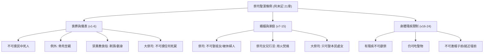

# 利未記 第21章

1. 耶和華對[[摩西]]說：你告訴亞倫子孫作祭司的說：[[祭司不可為死人哀哭（居喪條例）|祭司不可為民中的死人沾染自己]]，
2. 除非為他骨肉之親的父母、兒女、弟兄，
3. 和未曾出嫁、作處女的姊妹，才可以沾染自己。
4. 祭司既在民中為首，就不可從俗沾染自己。
5. 不可使頭光禿；不可剃除鬍鬚的周圍，也不可用刀劃身。
6. 要歸神為聖，不可褻瀆神的名；因為耶和華的火祭，就是神的食物，是他們獻的，所以他們要成為聖。
7. [[祭司不可娶被玷污的婦人為妻|不可娶妓女或被污的女人為妻]]，也不可娶被休的婦人為妻，因為祭司是歸神為聖。
8. 所以你要使他成聖，因為他奉獻你神的食物；你要以他為聖，因為我─使你們成聖的耶和華─是聖的。
9. [[祭司的女兒行淫用火焚燒|祭司的女兒若行淫辱沒自己，就辱沒了父親，必用火將他焚燒]]。
10. 在弟兄中作[[受膏的祭司（mashiach kohen）|大祭司]]、頭上倒了膏油、又承接聖職，穿了聖衣的，不可蓬頭散髮，也不可撕裂衣服。
11. [[祭司不可為死人哀哭（居喪條例）|不可挨近死屍，也不可為父母沾染自己]]。
12. 不可出聖所，也不可褻瀆神的聖所，因為神膏油的冠冕在他頭上。我是耶和華。
13. [[大祭司娶處女為妻的婚姻條例|他要娶處女為妻]]。
14. [[大祭司娶處女為妻的婚姻條例|寡婦或是被休的婦人，或是被污為妓的女人，都不可娶]]；只可娶本民中的處女為妻。
15. 不可在民中辱沒他的兒女，因為我是叫他成聖的耶和華。
16. 耶和華對[[摩西]]說：
17. 你告訴亞倫說：你世世代代的後裔，[[有殘疾的祭司不可近前獻祭|凡有殘疾的，都不可近前來獻他神的食物]]。
18. 因為凡有殘疾的，無論是瞎眼的、瘸腿的、塌鼻子的、肢體有餘的、
19. 折腳折手的、
20. 駝背的、矮矬的、眼睛有毛病的、長癬的、長疥的，或是損壞腎子的，都不可近前來。
21. 祭司亞倫的後裔，凡有殘疾的，都不可近前來，將火祭獻給耶和華。他有殘疾，不可近前來獻神的食物。
22. [[有殘疾的祭司不可近前獻祭|神的食物，無論是聖的，至聖的，他都可以吃]]。
23. [[有殘疾的祭司不可近前獻祭|但不可進到幔子前，也不可就近壇前]]；因為他有殘疾，免得褻瀆我的聖所。我是叫他成聖的耶和華。
24. 於是，[[摩西]]曉諭亞倫和亞倫的子孫，並以色列眾人。

---

## 本章知識節點

### 主題
- [[祭司不可為死人哀哭（居喪條例）]]
- [[祭司不可娶被玷污的婦人為妻]]
- [[祭司的女兒行淫用火焚燒]]
- [[大祭司娶處女為妻的婚姻條例]]
- [[有殘疾的祭司不可近前獻祭]]

### 人物
- [[摩西]]
- [[亞倫]]

### 原文
- [[受膏的祭司（mashiach kohen）]]

### 互文
- [[出28：36-38|出28：36-38 大祭司額上金面牌刻歸耶和華為聖]]
- [[民19：11-13|民19：11-13 接觸死屍不潔七日]]
- [[結44：20-25|結44：20-25 祭司不可剃頭與婚姻聖潔]]
- [[彼前2：9|彼前2:9 信徒為君尊的祭司]]
- [[來7：26|來7：26 大祭司聖潔無邪惡]]
- [[林後6：14|林後6：14 信徒不可與不信同負一軛]]
- [[帖前4：13|帖前4：13 不可像沒指望的人憂傷]]

### 神學
- [[信徒作祭司（彼前2：5,9）]]

### 解經爭議
- [[利21：4「從俗沾染自己」的解釋爭議]]

---

## 本章整理

### 祭司在喪葬與日常儀表上的聖潔（v1-6）

本章開始轉向祭司專屬的聖潔條例。神吩咐[[摩西]]告訴亞倫子孫，[[祭司不可為死人哀哭（居喪條例）]]，不可觸摸民中死人的屍體，因為死亡是罪的工價，接觸死屍會招致不潔。GT《丁良才註釋》指出，祭司「不可為民中的死人沾染自己」是因為死亡被視為不潔，但神體貼祭司的情感，例外允許他們為骨肉之親（父母、兒女、弟兄及未曾出嫁的姊妹）沾染自己。然而，[[受膏的祭司（mashiach kohen）]]即大祭司的要求更為嚴格，連父母的遺體也不可觸碰。

祭司在民中為首，不可「從俗沾染自己」。CT在靈意註解中強調，新約信徒都是君尊的祭司，不可跟隨世俗。GT《啟導本》則指出，第4節的「從俗」可能指參加姻親的喪事而沾染不潔。祭司亦不可效法外邦異教的喪葬風俗，如剃光頭、剃除鬍鬚周圍或用刀劃身。GT《舊約聖經背景註釋》補充，這些損毀身體的行為是迦南人致哀的習俗，會破壞祭司皮膚與鬚髮的完整，有失聖潔見證。祭司必須歸神為聖，因為他們負責獻上耶和華的火祭——就是神的食物。CT指出，這表徵事奉神的人是「神的膳長」，使神得著享受與滿足，故不可使神的名因他們蒙羞。

### 祭司與大祭司的婚姻與家庭聖潔（v7-15）

在婚姻方面，神頒布了[[祭司不可娶被玷污的婦人為妻]]的條例。祭司不可娶妓女、被污的女人或被休的婦人。CT在靈意註解中表明，這表徵事奉神的人必須能管理自己的情感，並在婚姻中保持純潔。GT《精讀本》進一步說明，祭司婚姻的聖潔預表基督接納教會為新婦，教會應當毫無瑕疵。

若[[祭司的女兒行淫用火焚燒]]，因她辱沒了父親，必用火將她燒死。CT指出這表徵事奉神的人必須能管理自己的兒女；KC則強調，女兒的罪會牽連父親的祭司職分，在教會中若兒女服事世界，會成為父母服事的污點。

至於大祭司，標準更為嚴格。他不可蓬頭散髮、撕裂衣服，甚至不可為父母沾染自己，也不可出聖所。KC指出，大祭司的聖潔標準對應拿細耳人的條例，且大祭司被稱為「弟兄中最高的一位」，這特別預表主耶穌。在婚姻上，神頒布了[[大祭司娶處女為妻的婚姻條例]]，他只可娶本民中的處女，不可娶寡婦、被休或被污為妓的女人。KC將此連結於基督與教會的關係，指出大祭司的妻子必須是處女，預表基督看祂的新婦（教會）為貞潔的童女。

### 祭司身體殘疾與事奉資格的限制（v16-24）

本章最後一段論及[[有殘疾的祭司不可近前獻祭]]的條例。神規定亞倫後裔中凡有殘疾的，都不可近前來獻神的食物。GT《丁良才註釋》列舉了三個原因：避免百姓輕看祭禮、一切歸給神的必須純全無疵，以及祭司預表主耶穌必須完全。GT《舊約聖經背景註釋》指出，古代近東要求祭壇人員保持儀式上的潔淨，有缺陷的祭司雖不能獻祭，卻仍有權分享祭司當得的祭物。

CT對各種殘疾進行了深度的靈意解經，將身體缺陷對應到屬靈生命的光景。例如：「瞎眼的」表徵全然沒有屬靈的眼光；「瘸腿的」表徵屬靈行動能力軟弱；「塌鼻子的」表徵屬靈靈敏度遲鈍；「駝背的」表徵事奉僅及於屬地而缺乏屬天；「損壞腎子的」表徵缺少屬靈生命繁殖的能力。CT強調，凡是缺少基督的，都是殘疾，不配作神食物的管家。

KC則提供了不同的應用視角，指出屬靈殘疾不一定是自己的過錯（如錯誤教導導致屬靈瞎眼），但在教會中，主耶穌能改變這種殘缺狀態。GT《啟導本》總結道，有殘疾的祭司雖不可擔任職務，但祭司身分不變，仍可吃聖物；這可供今日教會參考：聖職只交付合資格者，但屬靈身分上，所有信徒都是神的祭司。

> [!quote] CT 靈意註解核心
> 「瞎眼的──屬靈的事第一在於看見。事奉神的人必須有光，明亮。沒有看見，沒有光的，不能獻食物給神。」

> [!question] [[利21：4「從俗沾染自己」的解釋爭議]]
> GT《啟導本》認為此處可能指參加姻親的葬禮而沾染不潔；CT則將「從俗」理解為跟隨一般人或外邦人的習俗，強調事奉神的人不可效法世界。

**參考資料**
https://www.ccbiblestudy.org/Old%20Testament/03Lev/03CT21.htm
https://www.ccbiblestudy.org/Old%20Testament/03Lev/03GT21.htm
https://www.kingcomments.com/en/bible-studies/Lev/21
https://biblehub.com/study/leviticus/21.htm
