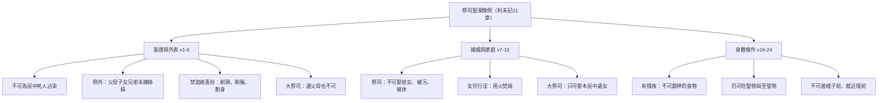

# 利未記 第21章

<!-- chapter-navigation:start -->
| [前一章](../03%20利未記/第20章.md) | [回目錄](../03%20利未記/全書目錄及綱要.md) | [下一章](../03%20利未記/第22章.md) |
| :--- | :---: | ---: |
<!-- chapter-navigation:end -->

1. 耶和華對[[摩西]]說：你告訴亞倫子孫作祭司的說：[[祭司不可為死人哀哭（居喪條例）|祭司不可為民中的死人沾染自己]]，
2. 除非為他骨肉之親的父母、兒女、弟兄，
3. 和未曾出嫁、作處女的姊妹，才可以沾染自己。
4. 祭司既在民中為首，就不可從俗沾染自己。
5. 不可使頭光禿；不可剃除鬍鬚的周圍，也不可用刀劃身。
6. 要歸神為聖，不可褻瀆神的名；因為耶和華的火祭，就是神的食物，是他們獻的，所以他們要成為聖。
7. [[祭司不可娶被玷污的婦人為妻|不可娶妓女或被污的女人為妻]]，也不可娶被休的婦人為妻，因為祭司是歸神為聖。
8. 所以你要使他成聖，因為他奉獻你神的食物；你要以他為聖，因為我─使你們成聖的耶和華─是聖的。
9. [[祭司的女兒行淫用火焚燒|祭司的女兒若行淫辱沒自己，就辱沒了父親，必用火將他焚燒]]。
10. 在弟兄中作[[受膏的祭司|大祭司]]、頭上倒了膏油、又承接聖職，穿了聖衣的，不可蓬頭散髮，也不可撕裂衣服。
11. [[祭司不可為死人哀哭（居喪條例）|不可挨近死屍，也不可為父母沾染自己]]。
12. 不可出聖所，也不可褻瀆神的聖所，因為神膏油的冠冕在他頭上。我是耶和華。
13. [[大祭司娶處女為妻的婚姻條例|他要娶處女為妻]]。
14. [[大祭司娶處女為妻的婚姻條例|寡婦或是被休的婦人，或是被污為妓的女人，都不可娶]]；只可娶本民中的處女為妻。
15. 不可在民中辱沒他的兒女，因為我是叫他成聖的耶和華。
16. 耶和華對[[摩西]]說：
17. 你告訴亞倫說：你世世代代的後裔，[[有殘疾的祭司不可近前獻祭|凡有殘疾的，都不可近前來獻他神的食物]]。
18. 因為凡有殘疾的，無論是瞎眼的、瘸腿的、塌鼻子的、肢體有餘的、
19. 折腳折手的、
20. 駝背的、矮矬的、眼睛有毛病的、長癬的、長疥的，或是損壞腎子的，都不可近前來。
21. 祭司亞倫的後裔，凡有殘疾的，都不可近前來，將火祭獻給耶和華。他有殘疾，不可近前來獻神的食物。
22. [[有殘疾的祭司不可近前獻祭|神的食物，無論是聖的，至聖的，他都可以吃]]。
23. [[有殘疾的祭司不可近前獻祭|但不可進到幔子前，也不可就近壇前]]；因為他有殘疾，免得褻瀆我的聖所。我是叫他成聖的耶和華。
24. 於是，[[摩西]]曉諭亞倫和亞倫的子孫，並以色列眾人。

---

## 本章知識節點

### 主題
- [[祭司不可為死人哀哭（居喪條例）]]
- [[祭司不可娶被玷污的婦人為妻]]
- [[祭司的女兒行淫用火焚燒]]
- [[大祭司娶處女為妻的婚姻條例]]
- [[有殘疾的祭司不可近前獻祭]]

### 人物
- [[摩西]]
- [[亞倫]]
- [[受膏的祭司]]

### 原文
- [[褻瀆（cha.lal）]]

### 神學
- [[聖潔]]
- [[沒有殘疾的祭牲]]

### 互文
- [[出28：36-38|出28：36-38 大祭司額上金面牌刻歸耶和華為聖]]
- [[民19：11-13|民19：11-13 接觸死屍不潔七日]]
- [[結44：20-25|結44：20-25 祭司不可剃頭與婚姻聖潔]]
- [[彼前2：9|彼前2：9 信徒為君尊的祭司]]
- [[來7：26|來7：26 大祭司聖潔無邪惡]]
- [[林後6：14|林後6：14 信徒不可與不信同負一軛]]
- [[帖前4：13|帖前4：13 不可像沒指望的人憂傷]]
- [[信徒作祭司（彼前2：5,9）|彼前2：5,9 信徒被建造成為聖潔的祭司]]

### 解經爭議
- [[利21：4「從俗沾染自己」的解釋爭議]]

---

## 本章整理

### 祭司的喪禮界線與外表（v1-6）

利未記到這裡轉了對象。前面十八到二十章講的是全體以色列人，從本章起講的是祭司。GT 串珠把二十一章到二十二章合起來標為「祭司及祭物的聖潔」，並點出理由：「如果百姓須與一切邪惡隔絕，祭司們更當如此，他們是要歸神為聖的（6），百姓也要以他們為聖（8）。」GT 丁良才則把等級排成三層：「以色列眾人都要歸耶和華為聖（十八1至十九37），祭司更是如此（1-9），大祭司卻還要比眾祭司更聖（10-15）」。GT 啟導本用一句話概括這種加碼：「多給誰，就向誰多取」（路十二48）。

第一條界線畫在死亡上。[[祭司不可為死人哀哭（居喪條例）|祭司不可為民中的死人沾染自己]]，只有父母、兒女、弟兄和未曾出嫁的姊妹例外。==STEP語言資料顯示，v1、v3、v4、v11 的「沾染自己」是同一個字形==（טָמֵא，ta.me，詞典義 to defile），逐字解都是 he will make himself unclean——動作的執行者是祭司本人，不是屍體讓他變髒。

例外名單裡少了一個人：妻子。丁良才注意到這個空缺，並留下兩條線索：迦勒底譯本把「骨肉之親的」五個字譯作「妻子，就是骨肉之親」；而「神特特地禁止祭司以西結為妻子弔喪，或者是因為在尋常的時候，祭司可以為妻子弔喪（結二十四16-18）」。GT 串珠給的解釋是身分特殊：「妻子卻沒有在這裡提及，這可能是因妻子的地位特殊，她已與丈夫同為一體，故毋須提出。」BH 讀第4節時則直接把對象定為姻親，認為祭司連為姻親也不可使自己不潔。第4節「從俗沾染自己」一句歷來讀法不一，本章的解經爭議整理另有並陳。

外表上禁了三件事：使頭光禿、剃除鬍鬚的周圍、用刀劃身。GT《舊約聖經背景註釋》說明這是族群識別的問題：「他們不得參與割傷身體、自拔頭髮、剃除鬍鬚等迦南人致哀的習俗」，因為祭司「如果以任何有失聖潔的姿態出現，都是可恥的」。GT 精讀本補了一個具體的年代對照：「根據歷史學家黑羅多徒司(B.C. 484-425年)考證,古代埃及祭司出席骨肉之親的喪事,剃除頭髮表示哀慟。」BH 則從鬍鬚的社會意義切入，指出鬍鬚在以色列文化中是尊嚴與成熟的象徵，剃去鬍鬚的邊緣是與異教哀悼禮儀相連的作法。丁良才另外提醒，這三條禁令並非祭司專屬：「本節的吩咐，眾百姓也須謹守（十九27-28，申十四1），但屢次有人違背了（耶十六6，結七18，摩八10）。」

第6節給出全部理由：祭司獻上耶和華的火祭，就是神的食物。STEP語言資料顯示「食物」是 לֶחֶם（le.chem，詞典義 food: bread），「火祭」是 אִשֶּׁה（ish.shah，food offering）。CT 由此讀出事奉者的位置：「每一個事奉神的人，都是神的膳長，給神食物，供神享受。」

### 祭司與大祭司的婚姻和家庭（v7-15）

[[祭司不可娶被玷污的婦人為妻|祭司在婚姻上受限]]：妓女、被污的女人、被休的婦人都不可娶。丁良才把這條規定的另一面講清楚了——限制的是對象，不是婚姻本身：「祭司不可娶妓女，或被污穢的女人，或被休的婦人，只可娶處女或寡婦為妻。」GT 串珠認為判準在名聲而不在過去：「這例似乎著重被女子的品格及聲譽多過她過去的性經驗，因為普通祭司可以娶寡婦為妻。」GT《舊約聖經背景註釋》則給了禁娶被休婦人的實務理由：「在離婚訴訟中，不貞是丈夫所持的主要理由。」

第8節的「你要使他成聖」是對誰說的？丁良才的解讀是摩西，並延伸到後世：「卻也是包括接續摩西代表以色列全會眾的眾領袖，叫他們留心監理，不讓祭司娶7節所禁止他們娶的婦女為妻，這監理祭司的責任後來是在代表百姓的公會手中。」BH 補上這份聖潔的來源：祭司的聖潔並非他自身固有，而是出於神的任命與分別，所以百姓對他的敬重其實是對神的敬重。

若[[祭司的女兒行淫用火焚燒|祭司的女兒行淫]]，刑罰是本書最重的一級。KC 先問了一個一般人也會問的問題——「她是怎麼走到這一步的？」——再指出一個在這麼近的距離認識過神的聖潔、卻仍敢如此行的人，被交給焚燒的審判；同時提醒做父母的要問自己失職在哪裡，而敬虔家庭的兒女自己也負有更大的個人責任。

從第10節起是[[受膏的祭司|大祭司]]專屬的條例。STEP語言資料讓兩個中文譯詞的原貌浮出來：「承接聖職」的原文直譯是「他填滿了他的手」（מָלֵא，ma.le，加上「手」יָד，yad）；「不可蓬頭散髮」用的是 פָּרַע（pa.ra，he will let loose），「不可撕裂衣服」用的是 פָּרַם（pa.ram，he will tear）——==這兩個動詞正是利未記十章6節禁止亞倫父子為拿答、亞比戶做的那兩個動作==，本章把當時的一次性吩咐訂成了世世代代的定例。KC 指出大祭司的聖潔標準對應拿細耳人的條例（民6:1-7），並把「在弟兄中作大祭司」這個稱呼連到主耶穌：「在許多弟兄中作長子」（羅8:29）、「從死裡首先復生的」（西1:18）。

不可出聖所並不是要他住在裡面。丁良才：「意思說，不可因骨肉之親去世或出殯，停止供大祭司的職任，但為別的緣故，大祭司可以隨意出入。」他並指出眾祭司與大祭司在這件事上的實際差別——眾祭司得知至親去世可以停止供職到出殯並滿了不潔淨的日期，大祭司則必須離開那房子，「或叫人把那將要死的人抬到別處」。婚姻上，[[大祭司娶處女為妻的婚姻條例|大祭司只可娶本民中的處女]]，連寡婦也不行。

| 項目 | 一般祭司 | 大祭司 |
|---|---|---|
| 為至親屍體沾染 | 可（父母、兒女、弟兄、未嫁的姊妹） | 一律不可，連父母也不可（v11） |
| 喪期停止供職 | 可，直到出殯並滿不潔淨的日期 | 不可出聖所（v12） |
| 蓬頭散髮、撕裂衣服 | 未特別禁止 | 明文禁止（v10） |
| 可娶的對象 | 處女或寡婦 | 只可娶本民中的處女（v13-14） |
| 立規理由 | 歸神為聖、獻神的食物（v6-8） | 神膏油的冠冕在他頭上（v12） |

### 身體殘疾與事奉資格（v16-24）

最後一段處理[[有殘疾的祭司不可近前獻祭|身體條件]]。STEP語言資料顯示 v17、v18、v21（兩次）、v23 共五次用 מוּם（mum，詞典義 blemish）——==這正是祭牲條例所用的那個「殘疾」==。GT 啟導本因此把兩者直接並列：「進入聖所侍奉的祭司，應象所獻的祭牲一樣，在身體上沒有殘疾」，也就是[[沒有殘疾的祭牲|獻上的與獻祭的受同一個標準檢驗]]。

經文列的十二樣不是完整清單。丁良才明說：「本節顯明18至20節所提的十二樣殘疾，不過是舉其大略，用來作代表的，餘可類推。」他並記下第二聖殿時期這條規定實際怎麼執行：猶太人記載使祭司不能獻祭的病共一百四十二種；聖殿院中有一間房子，亞倫的子孫到了二十歲可供職時，公會的代表先在那裡檢驗身體，「凡有殘疾的都被定為不合格，這些人就要穿上黑衣，默默無聲地回去」，合格的則穿上白衣，獻祭承接祭司的職任。

幾家都特別聲明這不是對身障者的輕看。CT：「這並不是瞧不起有殘疾的，乃是表明祂要祭司配得上他們所事奉的神──一位完全的神。」GT 精讀本說得更直接：「要求祭司無殘疾,不是輕視身體殘疾的人,乃是要求人在神面前的聖潔」，並指出這條儀文約束「今天其約束已經廢除」。

真正的關鍵在身分與職務是兩回事。GT 啟導本：「一個人的祭司身分和他擔任的職務有區別，身體有殘疾或瑕疵的亞倫的後裔，祭司的身分無改變，但不可以擔任祭司的職務。」BH 在第22節也強調這項容許顯出祭司制度中的恩典與包容，讓所有祭司無論身體狀況都能分享神所賜的供養。丁良才則細列了吃聖物的三重限制：只有亞倫子孫中的男丁可以吃至聖物、只有潔淨的人可以吃、必須在聖處吃。

GT《舊約聖經背景註釋》把清單放回古代近東：「古代近東每個宗教都要求祭壇的聖潔特區之內保持儀式上的潔淨，祭物和在祭壇主持宗教事務的人員都包括在內」，並把這些缺陷分成三類來源——意外（骨折、睪丸壓壞）、先天因素（侏儒、瘸腿、駝背）、疾病（皮膚病、瘡痂）。同一份註釋還提到，埃及和美索不達米亞文獻裡也有神明與服務他的祭司共享祭筵的記載。

CT 對每一項殘疾都給了靈意對應——「瞎眼的」表徵全然沒有屬靈的眼光、「瘸腿的」表徵屬靈的行動能力軟弱、「塌鼻子的」表徵屬靈的靈敏度遲鈍、「肢體有餘的」表徵事奉的範圍搆到界限之外。KC 的落點不同，他強調責任歸屬：「他所有的缺陷不一定是他自己的過錯」，屬靈上的瞎眼可能來自錯誤的教導；而以色列做不到的事——幫一個人除去他的殘缺——在教會裡是可能的，只要人肯把自己交託給主耶穌。

```mermaid
flowchart TD
    A["祭司聖潔條例（利未記21章）"] --> B["喪禮與外表 v1-6"]
    A --> C["婚姻與家庭 v7-15"]
    A --> D["身體條件 v16-24"]

    B --> B1["不可為民中死人沾染"]
    B --> B2["例外：父母子女兄弟未嫁姊妹"]
    B --> B3["禁迦南喪俗：剃頭、剃鬚、劃身"]
    B --> B4["大祭司：連父母也不可"]

    C --> C1["祭司：不可娶妓女、被污、被休"]
    C --> C2["女兒行淫：用火焚燒"]
    C --> C3["大祭司：只可娶本民中處女"]

    D --> D1["有殘疾：不可獻神的食物"]
    D --> D2["仍可吃聖物與至聖物"]
    D --> D3["不可進幔子前、就近壇前"]
```

### 一個動詞把整章縫起來（跨章脈絡）

讀中文看不出來，但本章有一個希伯來動詞出現了七次，橫跨六節。STEP語言資料顯示那個字是 חָלַל（cha.lal，詞典義 to profane），而和合本依語境把它譯成了三種不同的中文詞：

| 節 | 和合本用詞 | 被弄髒的對象 |
|---|---|---|
| 4 | 從俗沾染自己 | 祭司自己 |
| 6 | 褻瀆神的名 | 神的名 |
| 9 | 辱沒自己、辱沒了父親 | 女兒自己與她父親 |
| 12 | 褻瀆神的聖所 | 聖所 |
| 15 | 辱沒他的兒女 | 大祭司的後代 |
| 23 | 褻瀆我的聖所 | 聖所 |

把[[褻瀆（cha.lal）|這七處]]排在一起，本章四段條例就不是四件事，而是同一件事的四個面向：祭司身上任何一處失守，弄髒的都不會只有他自己。

與它相對的是另一個字。STEP語言資料顯示 קָדַשׁ（qa.dash，詞典義 to consecrate）的 Piel 分詞在第8節出現兩次、第15節與第23節各一次，==主詞每一次都是神==。CT 也數過同一件事：「經文中曾三次提及使人成聖的神(參8，15，23節)，我們必須分別為聖歸給神。」一章之內兩股力量對著拉——神那一邊做的是使人[[聖潔|成聖]]，祭司這一邊要守的是不把它弄髒。

> [!note] 這個字不只在本章
> STEP 在相鄰章節查到同一個 Strong 另有九處：利18:21、利19:8、利19:12、利19:29、利20:3、利22:2、利22:9、利22:15、利22:32。要求的對象是一層一層往內收的——先是全體百姓（利18-20），再是祭司（利21），最後是祭司經手的聖物本身（利22）。

> [!question] 第4節到底在說什麼
> 「祭司既在民中為首，就不可從俗沾染自己」是本章最不明確的一句。STEP 對這節的逐字解是「不可／使自己不潔／בַּעַל（ba.al，逐字解 a husband）／在他的親族中／以致弄髒自己」。GT 啟導本列出兩種可能——參加喪事儀式而沾染，或與姻親接觸而沾染——並明白選了前者：「前一說較可信，因上下文講的都與喪事有關」，還舉《現代中文聖經》的意譯「他也不可因參加姻親的葬禮污辱了自己」為證。GT 雷氏研讀本則說「第4節的意思並不清晰」，可能指不能為一個首領的人沾染自己，或不能為妻子沾染自己。CT 把「從俗」理解為跟隨一般人或外邦人的習俗。BH 讀成姻親。各家並未收斂到同一個答案。

**參考資料**
https://www.ccbiblestudy.org/Old%20Testament/03Lev/03CT21.htm
https://www.ccbiblestudy.org/Old%20Testament/03Lev/03GT21.htm
https://www.kingcomments.com/en/bible-studies/Lev/21
https://biblehub.com/study/leviticus/21.htm
https://github.com/STEPBible/STEPBible-Data

<!-- chapter-navigation:start -->
| [前一章](../03%20利未記/第20章.md) | [回目錄](../03%20利未記/全書目錄及綱要.md) | [下一章](../03%20利未記/第22章.md) |
| :--- | :---: | ---: |
<!-- chapter-navigation:end -->
