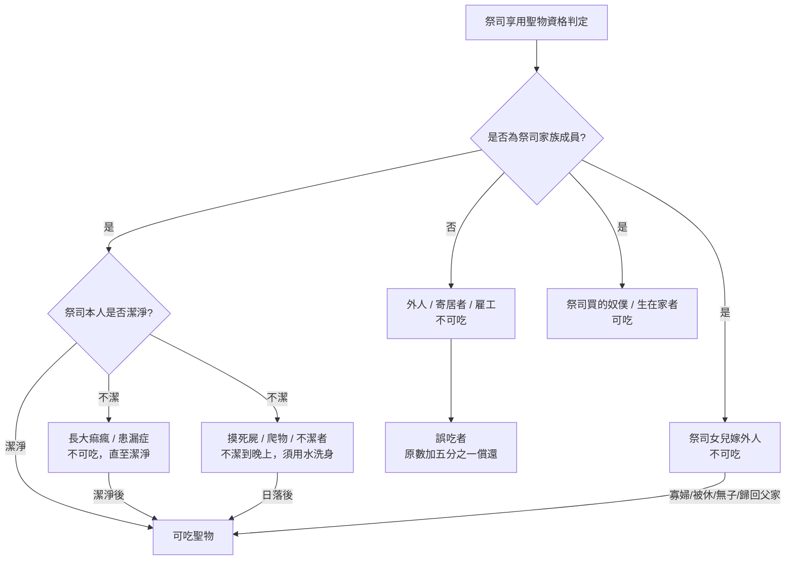

# 利未記 第22章

1. 耶和華對[[摩西]]說：
2. 你吩咐亞倫和他子孫說：[[污穢|要遠離以色列人所分別為聖、歸給我的聖物]]，免得褻瀆我的聖名。我是耶和華。
3. 你要對他們說：你們世世代代的後裔，[[污穢|凡身上有污穢、親近以色列人所分別為聖、歸耶和華聖物的]]，那人必在我面前[[剪除（kareth）|剪除]]。我是耶和華。
4. 亞倫的後裔，凡長大痲瘋的，或是有漏症的，[[污穢|不可吃聖物，直等他潔淨了]]。無論誰摸那因死屍不潔淨的物（物或作：人），或是遺精的人，
5. 或是摸什麼使他不潔淨的爬物，或是摸那使他不潔淨的人（不拘那人有什麼不潔淨），
6. 摸了這些人、物的，必不潔淨到晚上；若不用水洗身，就不可吃聖物。
7. 日落的時候，他就潔淨了，然後可以吃聖物，因為這是他的食物。
8. 自死的或是被野獸撕裂的，他不可吃，因此[[污穢]]自己。我是耶和華。
9. 所以他們要守我所吩咐的，免得輕忽了，因此擔罪而死。我是叫他們成聖的耶和華。
10. [[誰可吃聖物的資格條例|凡外人不可吃聖物]]；寄居在[[亞倫和他兒子（祭司）|祭司]]家的，或是雇工人，都不可吃聖物；
11. 倘若[[亞倫和他兒子（祭司）|祭司]]買人，是他的錢買的，那人就可以吃聖物；生在他家的人也可以吃。
12. [[誰可吃聖物的資格條例|祭司的女兒若嫁外人，就不可吃舉祭的聖物]]。
13. 但[[亞倫和他兒子（祭司）|祭司]]的女兒若是寡婦，或是被休的，沒有孩子，又歸回父家，與他青年一樣，就可以吃他父親的食物；只是外人不可吃。
14. [[誰可吃聖物的資格條例|若有人誤吃了聖物，要照聖物的原數加上五分之一交給祭司]]。
15. [[亞倫和他兒子（祭司）|祭司]]不可褻瀆以色列人所獻給耶和華的聖物，
16. 免得他們在吃聖物上自取罪孽，因為我是叫他們成聖的耶和華。
17. 耶和華對[[摩西]]說：
18. 你曉諭亞倫和他子孫，並以色列眾人說：以色列家中的人，或在以色列中寄居的，凡獻供物，無論是所許的願，是甘心獻的，就是獻給耶和華作燔祭的，
19. [[沒有殘疾的祭牲|要將沒有殘疾的公牛，或是綿羊，或是山羊獻上]]，如此方蒙悅納。
20. [[沒有殘疾的祭牲|凡有殘疾的，你們不可獻上，因為這不蒙悅納]]。
21. 凡從牛群或是羊群中，將[[平安祭（shelamim）|平安祭]]獻給耶和華，為要還特許的願，或是作甘心獻的，所獻的必純全無殘疾的才蒙悅納。
22. [[沒有殘疾的祭牲|瞎眼的、折傷的、殘廢的、有瘤子的、長癬的、長疥的都不可獻給耶和華]]，也不可在壇上作為火祭獻給耶和華。
23. 無論是公牛是綿羊羔，[[肢體有餘或缺少只可作甘心祭|若肢體有餘的，或是缺少的，只可作甘心祭獻上]]；用以還願，卻不蒙悅納。
24. 腎子損傷的，或是壓碎的，或是破裂的，或是騸了的，不可獻給耶和華，在你們的地上也不可這樣行。
25. 這類的物，你們從外人的手，一樣也不可接受作你們神的食物獻上；因為這些都有損壞，有殘疾，不蒙悅納。
26. 耶和華曉諭[[摩西]]說：
27. 才生的公牛，或是綿羊或是山羊，[[才生祭牲七天當跟母第八天蒙悅納|七天當跟著母]]；[[才生祭牲七天當跟母第八天蒙悅納|從第八天以後，可以當供物蒙悅納]]，作為耶和華的火祭。
28. 無論是母牛是母羊，[[不可同日宰母和子]]。
29. 你們獻感謝祭給耶和華，要獻得可蒙悅納。
30. 要當天吃，一點不可留到早晨。我是耶和華。
31. 你們要謹守遵行我的誡命。我是耶和華。
32. 你們不可褻瀆我的聖名；我在以色列人中，卻要被尊為聖。我是叫你們成聖的耶和華，
33. 把你們從埃及地領出來，作你們的神。我是耶和華。

---

## 本章知識節點

### 主題
- [[獻祭條例]]
- [[聖潔]]

### 互文
- [[出12：5|出12：5 逾越節羊羔無殘疾]]
- [[出22：30|出22：30 頭生牛羊八日後獻祭]]
- [[民18：32|民18：32 褻瀆聖物擔罪而死]]
- [[瑪1：8|瑪1：8 責備獻瞎眼瘸腿的祭物]]
- [[來9：14|來9：14 基督藉永遠的靈無瑕疵獻己]]
- [[彼前1：19|彼前1：19 無瑕疵玷污的羔羊之血]]
- [[林前11：27|林前11：27 不按理吃主的餅杯]]

### 人物
- [[摩西]]
- [[亞倫和他兒子（祭司）]]

### 原文
- [[剪除（kareth）]]

### 解經爭議
- [[肢體有餘或缺少只可作甘心祭]]

### 背景
- [[誰可吃聖物的資格條例]]
- [[才生祭牲七天當跟母第八天蒙悅納]]
- [[不可同日宰母和子]]

---

## 本章整理

### 祭司與聖物的潔淨界線（v1-9）

利未記第二十二章延續前一章對祭司聖潔的要求，將焦點轉向祭司如何對待以色列人獻上的聖物。神首先吩咐[[摩西]]警告[[亞倫和他兒子（祭司）]]，必須以戒慎恐懼的態度「遠離」聖物，免得褻瀆神的聖名。CT指出，這種「遠離」並非指祭司不能摸聖物，而是必須在合宜的光景下才能接觸；若不按神的安排摸聖物，便是褻瀆神。GT《啟導本》亦強調，祭司若玷污了自己而招來褻瀆的刑罰，其後果「擔罪而死」比一般百姓犯不潔的罪厲害得多，因為祭司的責任更大。

經文列舉了三種導致祭司不可吃聖物的不潔狀態：長大痲瘋、患漏症，以及因觸摸死屍、不潔爬物或不潔淨的人而沾染的污穢。前兩者屬於長期性的不潔，後者則為外部接觸引起的暫時性不潔。CT在靈意解經上將大痲瘋視為「罪性的流露」，漏症視為「天然生命的流露」，必須對付乾淨才可吃聖物；而外部接觸引起的不潔，則表徵需要「新的起頭」。對於暫時性不潔的祭司，必須用水洗身，且「必不潔淨到晚上」，直到日落之後方可吃聖物。KC對此應用指出，我們無法避免觸摸世界而沾染污穢，但神賜下了潔淨的方法——用水洗身，對新約信徒而言，這代表必須藉著神的話語得著潔淨（弗5:26）。此外，祭司亦不可吃自死或被野獸撕裂的動物，GT《精讀本》解釋此類動物身上還留有血，屬於不潔。神在此重申：「我是叫他們成聖的耶和華」，表明祭司的聖潔地位與其守約的責任緊密相連。

### 誰可吃聖物的資格條例（v10-16）

本段詳細規範了[[誰可吃聖物的資格條例]]，以血緣與產權作為劃分標準。經文明確指出，「凡外人不可吃聖物」，寄居者與雇工皆無份。然而，祭司用錢買的奴僕，以及生在祭司家裡的人，因屬於祭司的家族成員，便可以吃。CT將此靈意化解讀為：用錢買來的人表徵「領受寶血代價得蒙救贖的人」，生在家裡的人表徵「在教會中得重生的人」，兩者皆可享受基督。

至於祭司的女兒，若嫁給非祭司家族的外人，就不可吃舉祭的聖物；但若她成為無兒女的寡婦或被休，又歸回父家，便可恢復享用父親食物的權利。KC對此指出，祭司女兒與外人結婚會失去權利，這可應用於信徒若與不認識祭司事奉的人結合，將會影響其自身的祭司事奉；而寡婦歸回父家，則預表信徒在經歷失敗後，若與世界斷絕瓜葛並重回主的懷抱，仍可恢復對基督的享受。若有人誤吃聖物，必須照原數加上五分之一交給祭司作為賠償。GT《丁良才註釋》指出，這是為了罰他，叫他越發小心。祭司有責任看守聖物，不可讓外人誤吃而自取罪孽。

### 獻祭牲的無殘疾要求（v17-25）

經文場景轉向獻祭者與祭牲的品質要求。神曉諭以色列人，無論是還願或甘心獻的燔祭，必須獻上公的、無殘疾的牛羊，如此方蒙悅納。GT《精讀本》強調，神要求無殘疾的祭物，是因為祭物預表耶穌基督作為毫無瑕疵的祭物代贖人罪。BH亦指出，無殘疾的動物是基督的預表，祂是「無瑕疵、無玷污」的羔羊（彼前1:19）。

對於有殘疾的祭牲，經文列出了詳細的禁獻清單，包括瞎眼、折傷、殘廢、有瘤子、長癬、長疥等。CT將這些殘疾靈意化，對應信徒對基督認識的各種缺漏：瞎眼表徵認識不清楚，折傷表徵認識打折扣，長癬表徵認識有偏見。然而，對於[[肢體有餘或缺少只可作甘心祭]]的規定，存在著解經爭議。CT認為這表徵對基督的認識有所添加或刪減；但GT《丁良才註釋》提供了不同的歷史背景視角，指出第二聖殿時期的猶太人將此解釋為：這類祭牲可獻給祭司，變賣後作修理聖殿之用，但不可獻在壇上。KC則從屬靈應用指出，這代表對基督的認識不平衡，神雖不悅納作為還願之用，但對出於純潔自發心意的甘心祭，神仍能體諒其有限的認識。此外，腎子損傷的祭牲絕不可獻，GT《精讀本》說明這象徵失去繁殖力、破壞生命與神的創造秩序，表徵對基督的生命經歷有根本毛病，不能繁衍。

### 祭牲奉獻的時間與人道關懷（v26-33）

最後一段規範了獻祭的時間與人道原則。對於[[才生祭牲七天當跟母第八天蒙悅納]]的條例，GT《串珠聖經註釋》指出，初生牲口要滿七天才有獨立生存資格；KC則將「第八天」連結於割禮的屬靈意義，表徵在復活裡的新起頭。關於[[不可同日宰母和子]]的禁令，GT《舊約背景註釋》認為這為牲口不多的人提供了保障，避免儀式要求對小群羊構成無法彌補的損失；GT《丁良才註釋》則強調這是為了養成人的憐恤之心，防止外邦人殘忍的殺牲風俗。BH進一步指出，這項禁令與申命記中不可連母帶雛一併取去的立法精神一致，體現了神對受造物的憐憫。

對於感謝祭的祭肉，經文要求「要當天吃，一點不可留到早晨」。CT將此解讀為：表徵要在新鮮的經歷裡享受基督，不可停在陳舊裡。本章結尾，神再次以「我是耶和華」作為總結，強調祂是將以色列人從埃及領出來、叫他們成聖的神。BH指出，這呼召出埃及的救贖歷史，是神要求百姓遵行律法的基礎；這也預表了基督救贖我們，是要我們成為祂的子民，在一切事上彰顯祂的聖潔。

> [!quote] 來源解讀選粹
> - **CT**：「祭司(事奉神的人)應以一種戒慎戒懼『遠離』的態度來對待聖物，以免因自己不潔而招來褻瀆的刑罰。」
> - **GT《舊約背景註釋》**：「不可同日獻母子牲畜的規定，為牲口不多的人提供一定程度的保障。因為若非如此，儀式的要求對他們寥寥幾隻的羊群來說，可能就會構成無法彌補的損失了。」
> - **KC**：「我們無法總是避免觸摸世界和它所造成的污穢。這使我們不潔。但潔淨的方法已經賜下：用水洗身。對我們來說，這意味著我們必須藉著話中之水得著潔淨（弗5:26）。」

**參考資料**
https://www.ccbiblestudy.org/Old%20Testament/03Lev/03CT22.htm
https://www.ccbiblestudy.org/Old%20Testament/03Lev/03GT22.htm
https://www.kingcomments.com/en/bible-studies/Lev/22
https://biblehub.com/study/leviticus/22.htm
