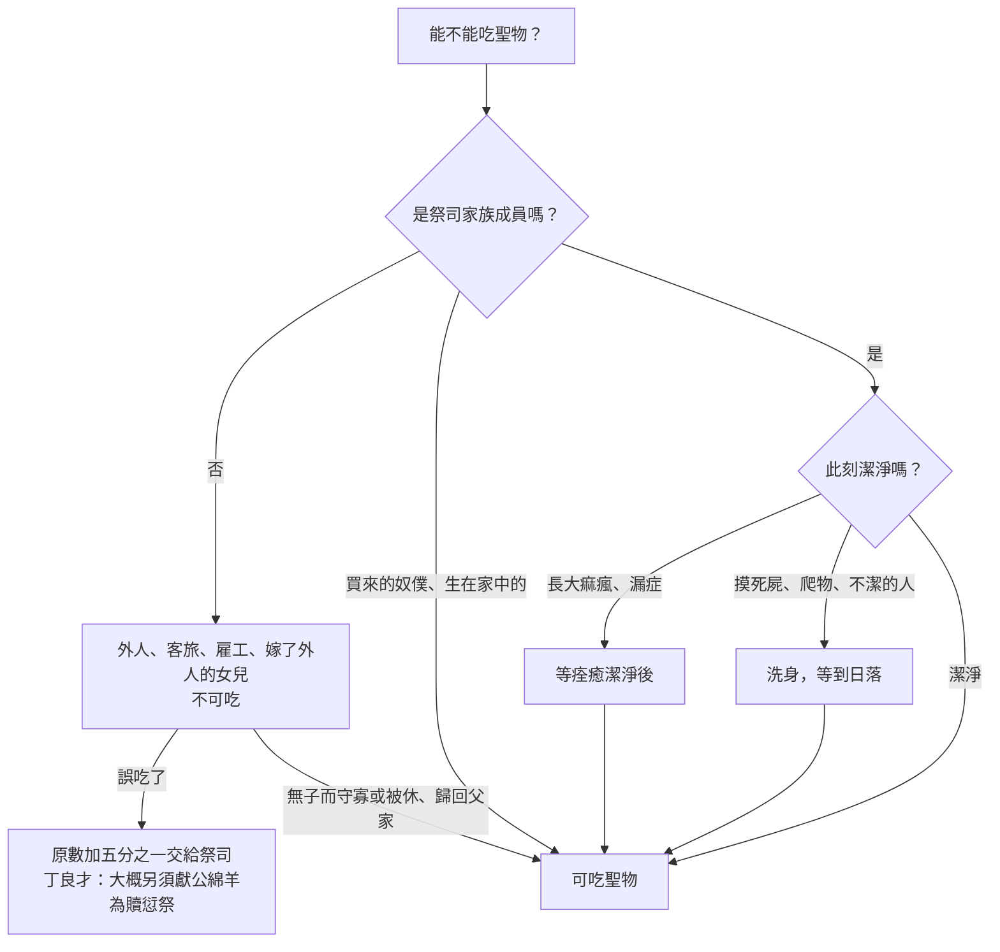

# 利未記 第22章

<!-- chapter-navigation:start -->
| [前一章](../03%20利未記/第21章.md) | [回目錄](../03%20利未記/全書目錄及綱要.md) | [下一章](../03%20利未記/第23章.md) |
| :--- | :---: | ---: |
<!-- chapter-navigation:end -->

1. 耶和華對[[摩西]]說：
2. 你吩咐亞倫和他子孫說：[[污穢|要遠離以色列人所分別為聖、歸給我的聖物]]，免得[[褻瀆（cha.lal）|褻瀆]]我的聖名。我是耶和華。
3. 你要對他們說：你們世世代代的後裔，[[污穢|凡身上有污穢、親近以色列人所分別為聖、歸耶和華聖物的]]，那人必在我面前[[剪除]]。我是耶和華。
4. 亞倫的後裔，凡長大痲瘋的，或是有漏症的，[[污穢|不可吃聖物，直等他潔淨了]]。無論誰摸那因死屍不潔淨的物（物或作：人），或是遺精的人，
5. 或是摸什麼使他不潔淨的爬物，或是摸那使他不潔淨的人（不拘那人有什麼不潔淨），
6. 摸了這些人、物的，必不潔淨到晚上；若不用水洗身，就不可吃[[聖物]]。
7. 日落的時候，他就潔淨了，然後可以吃[[聖物]]，因為這是他的食物。
8. 自死的或是被野獸撕裂的，他不可吃，因此[[污穢]]自己。我是耶和華。
9. 所以他們要守我所吩咐的，免得輕忽了，因此擔罪而死。我是叫他們成聖的耶和華。
10. [[誰可吃聖物的資格條例|凡外人不可吃聖物]]；寄居在[[亞倫和他兒子（祭司）|祭司]]家的，或是雇工人，都不可吃聖物；
11. 倘若[[亞倫和他兒子（祭司）|祭司]]買人，是他的錢買的，那人就可以吃[[聖物]]；生在他家的人也可以吃。
12. [[誰可吃聖物的資格條例|祭司的女兒若嫁外人，就不可吃舉祭的聖物]]。
13. 但[[亞倫和他兒子（祭司）|祭司]]的女兒若是寡婦，或是被休的，沒有孩子，又歸回父家，與他青年一樣，就可以吃他父親的食物；只是外人不可吃。
14. [[誰可吃聖物的資格條例|若有人誤吃了聖物，要照聖物的原數加上五分之一交給祭司]]。
15. [[亞倫和他兒子（祭司）|祭司]]不可[[褻瀆（cha.lal）|褻瀆]]以色列人所獻給[[聖物|耶和華的聖物]]，
16. 免得他們在吃[[聖物]]上自取罪孽，因為我是叫他們成聖的耶和華。
17. 耶和華對[[摩西]]說：
18. 你曉諭亞倫和他子孫，並以色列眾人說：以色列家中的人，或在以色列中寄居的，凡獻供物，無論是所許的願，是甘心獻的，就是獻給耶和華作燔祭的，
19. [[沒有殘疾的祭牲|要將沒有殘疾的公牛，或是綿羊，或是山羊獻上]]，如此方蒙悅納。
20. [[沒有殘疾的祭牲|凡有殘疾的，你們不可獻上，因為這不蒙悅納]]。
21. 凡從牛群或是羊群中，將[[平安祭]]獻給耶和華，為要還特許的願，或是作甘心獻的，所獻的必純全無殘疾的才蒙悅納。
22. [[沒有殘疾的祭牲|瞎眼的、折傷的、殘廢的、有瘤子的、長癬的、長疥的都不可獻給耶和華]]，也不可在壇上作為火祭獻給耶和華。
23. 無論是公牛是綿羊羔，[[肢體有餘或缺少只可作甘心祭|若肢體有餘的，或是缺少的，只可作甘心祭獻上]]；用以還願，卻[[獻祭不蒙悅納|不蒙悅納]]。
24. 腎子損傷的，或是壓碎的，或是破裂的，或是騸了的，不可獻給耶和華，在你們的地上也不可這樣行。
25. 這類的物，你們從外人的手，一樣也不可接受作你們神的食物獻上；因為這些都有損壞，有殘疾，[[獻祭不蒙悅納|不蒙悅納]]。
26. 耶和華曉諭[[摩西]]說：
27. 才生的公牛，或是綿羊或是山羊，[[才生祭牲七天當跟母第八天蒙悅納|七天當跟著母]]；[[才生祭牲七天當跟母第八天蒙悅納|從第八天以後，可以當供物蒙悅納]]，作為耶和華的火祭。
28. 無論是母牛是母羊，[[不可同日宰母和子]]。
29. 你們獻感謝祭給耶和華，要獻得可蒙悅納。
30. 要當天吃，一點不可留到早晨。我是耶和華。
31. 你們要謹守遵行我的誡命。我是耶和華。
32. 你們不可[[褻瀆（cha.lal）|褻瀆]]我的聖名；我在以色列人中，卻要被尊為聖。我是叫你們成聖的耶和華，
33. 把你們從埃及地領出來，作你們的神。我是耶和華。

---

## 本章知識節點

### 主題
- [[聖物]]
- [[污穢]]
- [[誰可吃聖物的資格條例]]
- [[肢體有餘或缺少只可作甘心祭]]
- [[才生祭牲七天當跟母第八天蒙悅納]]
- [[不可同日宰母和子]]

### 神學
- [[聖潔]]
- [[沒有殘疾的祭牲]]
- [[平安祭]]
- [[獻祭不蒙悅納]]

### 原文
- [[剪除]]
- [[褻瀆（cha.lal）]]

### 人物
- [[摩西]]
- [[亞倫和他兒子（祭司）]]

### 事件
- [[獻祭條例]]

### 互文
- [[出12：5|出12：5 逾越節羊羔無殘疾]]
- [[出22：30|出22：30 頭生牛羊八日後獻祭]]
- [[民18：32|民18：32 褻瀆聖物擔罪而死]]
- [[瑪1：8|瑪1：8 責備獻瞎眼瘸腿的祭物]]
- [[來9：14|來9：14 基督藉永遠的靈無瑕疵獻己]]
- [[彼前1：19|彼前1：19 無瑕疵玷污的羔羊之血]]
- [[林前11：27|林前11：27 不按理吃主的餅杯]]

---

## 本章整理

### 祭司與聖物之間的潔淨界線（v1-9）

前一章講祭司這個人要怎樣聖潔，本章換了對象：祭司手上那些[[聖物|以色列人分別為聖歸給神的東西]]。KC 用一句話點出兩章的分工：「在利未記21章，身體的殘疾是不能在聖所中供職的理由；在利未記22章，理由換成了玷污。有殘疾的人並沒有被玷污——他不可獻祭，卻可以吃聖物。」

神吩咐[[摩西]]警告[[亞倫和他兒子（祭司）]]要「遠離」聖物。CT 特別澄清這兩個字的意思：「『遠離聖物』不是說祭司們不能摸這些聖物，乃是必須在合宜的條件底下，合宜的光景底下，他們才能碰這些聖物。」GT 啟導本則指出違例的代價：「這種刑罰是『擔罪而死』，比一般百姓犯不潔的罪厲害得多，因為祭司的責任比百姓大得多。」

==STEP語言資料顯示，「聖物」這個名詞（קֹדֶשׁ，qo.desh，詞典義 holiness）在 1 至 16 節出現了 10 次==——v2 兩次、v3、v4、v6、v7、v10 兩次、v12、v14。整段的重心不在祭司做了什麼，在那些東西是什麼。

第3節有一個容易讀過去的用詞。丁良才停下來數過：「注意『在我面前』四個字，摩西五經中只在此處有這說法，別處是說從民中[[剪除]]。」正因為寫法特殊，這一節怎麼解就分成兩派——他記下一派認為「身上有污穢的祭司若親近聖物，就要革他的職，甚至不能進會幕」，另一派認為「神必親自從祂面前剪除那人，如同剪除拿答、亞比戶一樣」。

不潔分成兩種長度。長大痲瘋與漏症要等痊癒；摸了死屍、爬物或不潔的人只要洗身，到日落就潔淨。CT 把差別歸到起因：前者是「罪性的流露」與「天然生命的流露」，後者是「外面接觸所引起的不潔淨，必須有新的起頭」。KC 的落點在可行性——人活在世上無法完全避開污穢，但神同時給了洗淨的辦法。BH 指出日落之所以是分界，是因為希伯來曆法的一天從日落開始，所以那也是恢復的起點。

### 誰可以吃，誰不可以吃（v10-16）

[[誰可吃聖物的資格條例|這一段用身分與產權劃線]]。丁良才把不得吃的人數成四種：「（一）外人，（二）客旅，（三）雇工，（四）出了嫁的女兒，這些人只可吃平常的食物。」用錢買的奴僕與生在家中的則算家裡人——丁良才註明這些奴僕「是必須受割禮，入以色列民籍的（出十二44）」。

==GT 精讀本由這一點推出一個關鍵結論==：「聖物本身並沒有神秘的力量，是作為事奉的代價賜給祭司的，所以祭司的家人可以自由地吃。」BH 從另一面補上同一件事：這些祭物就是祭司的口糧，因為祭司在以色列諸支派中沒有土地產業。

名單裡沒有列的人也值得注意。丁良才指出這幾節「沒有提到祭司的妻子、兒子和沒有出嫁的女兒，因為他們自然都能吃聖物」，並補上一個張力：「大衛在危急的時候，曾違背了本段的條例（參撒上二十一6）。」

誤吃的處理是照原數加五分之一交給祭司。丁良才說明用意是「罰他，叫他越發小心」，並推測「大概他也得獻一隻公綿羊為贖愆祭」。KC 把它讀成一種可以補救的處境：無心之過造成了虧欠，獻上贖愆祭就能脫離。

> [!info] 古代近東也有同一套顧慮
> GT《舊約聖經背景註釋》列出好幾則平行資料：埃及祭司「要在冗長的淨化禮儀之後，才能走近壇前」；「一處赫人文獻在有關維持祭司和廟宇在儀式上潔淨，以及若沾染不潔如何淨化的事上，記載了長篇大論的指示。後者與第二十二章十分近似」；赫人法律甚至「禁止曾經與馬或騾發生性關係的人成為祭司」。至於誰能吃祭物，同一份註釋引了赫人國君的誓言〈坎圖齊利斯的祈禱〉，他保證自己從來沒有吃過「分別為聖給我神之物」。差別在於：「至少按照以色列的律法，分給祭司的分是可以與家人共享的，但客人和僱工卻不可吃。」

### 祭牲的無殘疾要求（v17-25）

從第17節起，被檢驗的對象從人換成[[沒有殘疾的祭牲|牲畜]]。GT 啟導本把兩章縫在一起：「凡是讓祭司不能供職的殘疾，同樣適用於祭牲。」STEP語言資料證實這不只是類比——==前一章用來排除祭司的「殘疾」מוּם（mum）==，在本章 v20、v21、v25 又出現 3 次；與它相對的「純全」是 תָּמִים（ta.Mim，逐字解 unblemished），出現在 v19 與 v21。第21節同時用了這兩個字，一正一反把標準夾住。

「蒙悅納」這三個字的原文另有玄機。STEP語言資料顯示 רָצוֹן（ra.tson，詞典義 acceptance）在 v19、v20、v21、v29 出現 4 次，其中 v19 與 v29 帶第二人稱複數字尾，逐字解是 for your acceptance。==被悅納的是獻祭的人，不是那頭牲畜。== CT 在第25節註中留下同一個觀察：「『不蒙悅納』的原文作『不為你們蒙悅納』」；丁良才接著就這個「你們」到底指以色列人還是指祭司，列出了兩種讀法。[[獻祭不蒙悅納|祭物被拒]]的後果，落在獻祭的人身上。

第23節是全章解釋最分歧的一節。第21節才說連甘心獻的也「必純全無殘疾的才蒙悅納」，[[肢體有餘或缺少只可作甘心祭|第23節卻放行了一種殘缺的祭牲作甘心祭]]。丁良才直接寫下當時的疑問：「在21節既是說，連作甘心祭的祭牲也必是純全無殘疾的，就有人疑惑本節的原文或有殘缺。」

| 提出者 | 對第23節的處理 |
|---|---|
| 丁良才（讀法一） | 這類牲畜不可作燔祭、贖罪祭、贖愆祭或還願的平安祭，卻可按利17:3-5 獻為平安祭 |
| 丁良才（讀法二，第二聖殿猶太人） | 祭司可以收納，變賣成銀子作修理聖殿之用，「卻不可獻在壇上」 |
| 丁良才（引七十士譯本） | 譯作「公牛犢、或綿羊若割下了耳朵，或失去了尾巴，你就要為自己宰殺，若用以還願，卻不蒙悅納」 |
| CT | 靈意：肢體有餘表徵對基督的認識有所添加，缺少表徵有所刪除 |
| KC | 甘心祭比還願祭自發，剛信主的人所知有限仍憑率真獻上；但神並不設想有人會故意獻殘缺的祭物 |
| BH | 差別在義務層級：還願是對神的鄭重承諾，所獻必須是最好的 |

第24節還藏著一個範圍問題。丁良才讀出的是全面禁令：「神不但禁止以色列人用騸了的牲畜獻祭，也是禁止他們騸牲畜」，並指出經文列的四種狀況「是古時騸牲畜的四種方法」。GT 串珠則把這一點留成開放的：究竟是「禁止閹割任何牲畜，或僅限於那些準備獻上為祭的牲畜」，沒有定論。

### 從第八天起、母子不同日（v26-33）

[[才生祭牲七天當跟母第八天蒙悅納|初生的牛羊要跟著母七天]]。丁良才給的是生存理由：幼畜「在一個禮拜中還是稚弱，人不該用它作食品，所以也不可獻給神為祭物」，並順帶列出整份祭牲年齡表——尋常「從下生第八天以後，到三歲為合格」，公牛犢一至兩歲、公牛三歲、羊羔第八天至一歲。至於第八天的意義，各家講法不同：GT 精讀本連到第八日的割禮，KC 說牲畜當然不受割禮但圖畫相同、「第八天總是說到一個新的起頭」，CT 則說「表徵在復活裡」，BH 從七日對應創造之週、八日標誌新秩序切入。

[[不可同日宰母和子|母與子不可同日被宰]]，而且丁良才指出這不限於獻祭：「或為獻祭，或為吃肉，都是一律。」給的理由各家不一——丁良才說是「叫人想起母子之倫是何等的神聖」並「養成他們一種憐恤的心」；串珠說是「禁止人們肆無忌憚的殘殺牲畜」；啟導本兼取人道與「防止異教殺牲的風俗進入民中」；GT《舊約聖經背景註釋》給的則是經濟保障——對只有寥寥幾隻羊的人，儀式要求「可能就會構成無法彌補的損失」，而且「在已知的外邦祭儀中，並沒有類似的作法，足以和這個規例相抗衡」。BH 連到申命記22:6-7 與詩篇145:9。

```mermaid
flowchart TD
    A["能不能吃聖物？"] --> B{"是祭司家族成員嗎？"}
    B -- 否 --> C["外人、客旅、雇工、嫁了外人的女兒<br>不可吃"]
    B -- "買來的奴僕、生在家中的" --> G
    B -- 是 --> D{"此刻潔淨嗎？"}
    D -- "長大痲瘋、漏症" --> E["等痊癒潔淨後"]
    D -- "摸死屍、爬物、不潔的人" --> F["洗身，等到日落"]
    D -- 潔淨 --> G["可吃聖物"]
    E --> G
    F --> G
    C -- 誤吃了 --> J["原數加五分之一交給祭司<br>丁良才：大概另須獻公綿羊為贖愆祭"]
    C -- "無子而守寡或被休、歸回父家" --> G
```

### 一句話把整章框起來（跨章脈絡）

本章開頭與結尾說的是同一件事。==STEP語言資料顯示 [[褻瀆（cha.lal）|חָלַל（cha.lal，詞典義 to profane）]]在本章出現 4 次==：v2「免得褻瀆我的聖名」、v9、v15、v32「你們不可褻瀆我的聖名」。第2節與第32節是同一句話，一頭一尾把 33 節條例夾在中間——中間所有關於誰能吃、什麼能獻的細節，指向的都是這一件事。

這個字從前一章延續下來。它在利未記21章出現 7 次，在本章 4 次；相鄰的利18:21、19:8、19:12、19:29、20:3 也各有一處。要求的對象一層一層往內收：先是全體百姓，再是祭司，最後是祭司經手的聖物本身。

丁良才把 31 至 33 節讀為前幾章的總結，並數出其中「暗含五種勉勵以色列人聽從神的動機」：

1. 我是耶和華——神的權勢
2. 我在以色列中要被尊為聖——神的聖潔
3. 我是叫你們成聖的耶和華——神的旨意
4. 我把你們從埃及地領出來——神的救恩
5. 我作你們的神——以色列人的利益

> [!note] 為什麼祭司需要這麼多規矩
> GT《靈修版聖經注釋》給了一個歷史處境的答案：以色列人熟悉埃及的祭司，「那些祭司所關心的主要是政治方面的事；他們把宗教看作是爭取權力的途徑」，所以新設立的以色列祭司制度「有可能令人感到懷疑」。分別在於神不准祭司擁有土地、收受金錢，「這一切的規定使百姓放心，也令祭司能全心事奉」。

**參考資料**
https://www.ccbiblestudy.org/Old%20Testament/03Lev/03CT22.htm
https://www.ccbiblestudy.org/Old%20Testament/03Lev/03GT22.htm
https://www.kingcomments.com/en/bible-studies/Lev/22
https://biblehub.com/study/leviticus/22.htm
https://github.com/STEPBible/STEPBible-Data

<!-- chapter-navigation:start -->
| [前一章](../03%20利未記/第21章.md) | [回目錄](../03%20利未記/全書目錄及綱要.md) | [下一章](../03%20利未記/第23章.md) |
| :--- | :---: | ---: |
<!-- chapter-navigation:end -->
