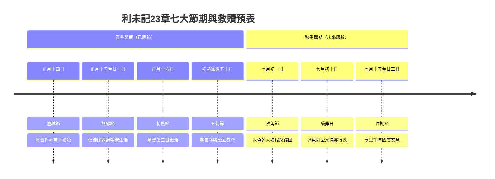

# 利未記 第23章

1. [[摩西|耶和華對摩西說]]：
2. 你曉諭以色列人說：[[聖會|耶和華的節期，你們要宣告為聖會的節期]]。
3. 六日要做工，[[七是節期中最要緊的數目|第七日是聖安息日，當有聖會]]；你們什麼工都不可做。[[宗教曆與民事曆兩種曆法|這是在你們一切的住處向耶和華守的安息日]]。
4. [[聖會|耶和華的節期，就是你們到了日期要宣告為聖會的，乃是這些]]。
5. [[逾越節|正月十四日，黃昏的時候，是耶和華的逾越節]]。
6. [[無酵節|這月十五日是向耶和華守的無酵節；你們要吃無酵餅七日]]。
7. 第一日當有[[聖會]]，什麼勞碌的工都不可做；
8. [[無酵節|要將火祭獻給耶和華七日。第七日是聖會，什麼勞碌的工都不可做]]。
9. 耶和華對[[摩西]]說：
10. 你曉諭以色列人說：你們到了我賜給你們的地，收割莊稼的時候，[[初熟（bikkurim）|要將初熟的莊稼一捆帶給祭司]]。
11. [[搖祭（tenufah）|他要把這一捆在耶和華面前搖一搖]]，[[初熟果子|使你們得蒙悅納]]。[[初熟（bikkurim）|祭司要在安息日的次日把這捆搖一搖]]。
12. 搖這捆的日子，你們要把一歲、沒有殘疾的公綿羊羔獻給耶和華為燔祭。
13. 同獻的素祭，就是調油的細麵伊法十分之二，作為馨香的火祭，獻給耶和華。同獻的奠祭，要酒一欣四分之一。
14. 無論是餅，是烘的子粒，是新穗子，你們都不可吃，直等到把你們獻給神的供物帶來的那一天才可以吃。這在你們一切的住處作為世世代代永遠的定例。
15. [[七七節安息日算法的兩種解讀之爭|你們要從安息日的次日，獻禾捆為搖祭的那日算起，要滿了七個安息日]]。
16. [[五旬節兩個有酵餅的搖祭條例|到第七個安息日的次日，共計五十天，又要將新素祭獻給耶和華]]。
17. 要從你們的住處取出細麵伊法十分之二，[[五旬節兩個有酵餅的搖祭條例|加酵，烤成兩個搖祭的餅，當作初熟之物獻給耶和華]]。
18. 又要將一歲、沒有殘疾的羊羔七隻、公牛犢一隻、公綿羊兩隻，和餅一同奉上。這些與同獻的素祭和奠祭要作為燔祭獻給耶和華，就是作馨香的火祭獻給耶和華。
19. 你們要獻一隻公山羊為贖罪祭，兩隻一歲的公綿羊羔為平安祭。
20. [[亞倫和他兒子（祭司）|祭司]]要把這些和[[初熟（bikkurim）|初熟]]麥子做的餅[[搖祭（tenufah）|一同作搖祭，在耶和華面前搖一搖]]；這是獻與耶和華為聖物歸給祭司的。
21. 當這日，你們要宣告[[聖會]]；什麼勞碌的工都不可做。這在你們一切的住處作為世世代代永遠的定例。
22. 在你們的地收割莊稼，[[田角拾穗條例重申（利23：22與利19：9-10互文）|不可割盡田角，也不可拾取所遺落的；要留給窮人和寄居的]]。我是耶和華─你們的神。
23. 耶和華對[[摩西]]說：
24. 你曉諭以色列人說：[[吹角節（七月初一）|七月初一，你們要守為聖安息日，要吹角作紀念，當有聖會]]。
25. 什麼勞碌的工都不可做；要將火祭獻給耶和華。
26. 耶和華曉諭[[摩西]]說：
27. [[贖罪日聖會條例（利23角度：刻苦己心與剪除刑罰）|七月初十是贖罪日；你們要守為聖會，並要刻苦己心]]，也要將火祭獻給耶和華。
28. 當這日，什麼工都不可做；因為是贖罪日，要在耶和華─你們的神面前贖罪。
29. [[贖罪日聖會條例（利23角度：刻苦己心與剪除刑罰）|當這日，凡不刻苦己心的，必從民中剪除]]。
30. [[贖罪日聖會條例（利23角度：刻苦己心與剪除刑罰）|凡這日做什麼工的，我必將他從民中除滅]]。
31. 你們什麼工都不可做。這在你們一切的住處作為世世代代永遠的定例。
32. 你們要守這日為聖安息日，並要刻苦己心。[[贖罪日禁食起始日的難題（第九日或第十日）|從這月初九日晚上到次日晚上，要守為安息日]]。
33. 耶和華對[[摩西]]說：
34. 你曉諭以色列人說：[[住棚節（利23節期規定）|這七月十五日是住棚節，要在耶和華面前守這節七日]]。
35. 第一日當有[[聖會]]，什麼勞碌的工都不可做。
36. 七日內要將火祭獻給耶和華。[[住棚節（利23節期規定）|第八日當守聖會，要將火祭獻給耶和華。這是嚴肅會]]，什麼勞碌的工都不可做。
37. [[聖會|這是耶和華的節期，就是你們要宣告為聖會的節期]]；[[節期祭物詳情另見民數記28-29章|要將火祭、燔祭、素祭、祭物，並奠祭，各歸各日，獻給耶和華]]。
38. 這是在耶和華的安息日以外，又在你們的供物和所許的願，並甘心獻給耶和華的以外。
39. 你們收藏了地的出產，就從七月十五日起，要守[[逾越節|耶和華的節]]七日。第一日為聖安息；第八日也為聖安息。
40. [[住棚節四種植物|第一日要拿美好樹上的果子和棕樹上的枝子，與茂密樹的枝條並河旁的柳枝]]，在耶和華─你們的神面前歡樂七日。
41. 每年七月間，要向耶和華守這節七日。這為你們世世代代永遠的定例。
42. [[住棚裡是棚或帳的難題|你們要住在棚裡七日；凡以色列家的人都要住在棚裡]]，
43. 好叫你們世世代代知道，我領以色列人出埃及地的時候曾使他們住在棚裡。我是耶和華─你們的神。
44. [[摩西|於是，摩西將耶和華的節期傳給以色列人]]。

---

## 本章知識節點

### 主題
- [[逾越節]]
- [[無酵節]]
- [[初熟果子]]
- [[聖會]]
- [[搖祭（tenufah）]]
- [[住棚節（利23節期規定）]]
- [[吹角節（七月初一）]]

### 事件
- [[耶和華的節期年曆總覽（利未記23章七大節期架構）]]

### 互文
- [[田角拾穗條例重申（利23：22與利19：9-10互文）]]
- [[節期祭物詳情另見民數記28-29章]]

### 人物
- [[摩西]]

### 原文
- [[初熟（bikkurim）]]

### 文化
- [[宗教曆與民事曆兩種曆法]]
- [[住棚節四種植物]]

### 歷史
- [[七是節期中最要緊的數目]]

### 神學
- [[基督預表（逾越節羔羊）]]

### 背景
- [[五旬節兩個有酵餅的搖祭條例]]

### 解經爭議
- [[七七節安息日算法的兩種解讀之爭]]
- [[贖罪日禁食起始日的難題（第九日或第十日）]]
- [[住棚裡是棚或帳的難題]]

---

## 本章整理

### 安息日與節期總綱（v1-4，44）

利未記第二十三章是關於以色列民宗教節期的核心章節，神吩咐[[摩西]]將「耶和華的節期」宣告為[[聖會]]。本章列舉了以色列民一年內要守的七個主要節期，這些節期不僅是農業收成的慶典，更預表了神歷代所施行的救贖大工。GT《啟導本聖經註釋》指出，這張名單是為祭司而準備，但也是給全體百姓的，從守安息日開始，而以住棚節的歡樂結束。

在進入具體節期之前，第3節首先確立了安息日的基礎地位。安息日雖與耶和華的七大節期並論，但在概念上是分開的（v37-38）。CT指出，安息日是「耶和華節期的基礎」，表徵神已經完成了創造之工，人應當放下一切工作，專心享受神裡面的安息。GT《串珠聖經註釋》補充，守安息日是效法神在創造天地時第七日安息，以及紀念神在埃及拯救選民的事蹟。安息日的休息比其他節期的休息更完全，其他節期所禁止的只是「勞碌的工」（日常的事業或身體勞動，不包括預備食物），但在安息日什麼工都不許作。

本章的節期安排蘊含著深刻的神學與歷史意義。GT丁良才《利未記註釋》特別點出，[[七是節期中最要緊的數目]]：每逢第七日是安息日，每年七月是聖月，無酵節與住棚節都是七天的節期，初熟節以後過了七個七天就是七七節。這些節期共同構成了[[耶和華的節期年曆總覽（利未記23章七大節期架構）]]，將全年的時間分別為聖歸給神。

### 逾越節、無酵節與初熟節（v5-14）

全年的節期從春季的逾越節開始。正月（宗教曆一月，又稱亞筆月或尼散月）十四日黃昏是逾越節，紀念神在埃及地越過以色列人，擊殺埃及人長子。CT在靈意註解中指明，逾越節表徵[[基督預表（逾越節羔羊）|基督是神的羔羊]]，被殺流血，拯救人脫離罪的刑罰。

緊接著逾越節的是無酵節，從正月十五日開始，為期七日。以色列人要吃無酵餅七日，第一日和第七日當有聖會，什麼勞碌的工都不可做。GT《靈修版聖經注釋》指出，無酵餅的預表對以色列人意義重大：因為這餅是特殊的，表示以色列民族與萬民有別；由於酵代表罪，無酵餅代表以色列人在道德上的純潔；這餅也使他們記住要立刻服從神的命令。CT進一步將「七日」解讀為表徵完全，意指信徒有生之日應當天天過無罪的生活。

初熟節則在無酵節期間舉行。以色列人到了迦南地收割莊稼時，要將初熟的莊稼一捆帶給祭司，祭司要在安息日的次日把這捆在耶和華面前搖一搖作為[[搖祭（tenufah）|搖祭]]。CT的靈意註解指出，安息日的次日即指第八日，基督是在第八日復活的，因此搖一搖表徵向神獻上復活的基督。同時，獻祭時還要獻上沒有殘疾的公綿羊羔為燔祭、調油的細麵為素祭，以及酒為奠祭。CT將奠祭解讀為表徵基督將性命傾倒、澆奠給神。第14節嚴格規定，在獻給神的供物帶來之前，無論是餅、烘的子粒還是新穗子都不可吃，這表徵「先讓神有所享受，然後人才能享受」。

### 五旬節與田角拾穗條例（v15-22）

從獻禾捆為搖祭的那日算起，滿了七個安息日，共計五十天，就是五旬節（七七節）。這一天要獻上新素祭，即[[五旬節兩個有酵餅的搖祭條例|兩個加酵烤成的搖祭餅]]。CT指出，這兩個餅加酵是見證奉獻的人承認自己有罪（酵），但在復活的基督裡仍可向神奉獻。KC則從預表角度進一步解釋，這兩個餅代表教會，由猶太人和外邦人兩群信徒組成，餅中的酵代表教會中仍有罪的成分，但酵的作用因著基督所受的審判（火烤）而被制止。

關於計算五十天的「安息日的次日」，歷來存在[[七七節安息日算法的兩種解讀之爭]]。GT丁良才《利未記註釋》詳細記錄了這兩種解釋：撒都該人認為這是指尋常的一週安息日，而法利賽人和七十士譯本則認為是指無酵節的第一日（正月十五日），其次日即正月十六日。

在第22節，經文突然插入了一條看似與節期無關的條例：收割莊稼時不可割盡田角，也不可拾取所遺落的，要留給窮人和寄居的。這實際上是[[田角拾穗條例重申（利23：22與利19：9-10互文）|重申了利未記19:9-10的條例]]。KC從預表意義指出，當教會（初熟的莊稼）被提後，地上仍有為神留下的見證，遺落的麥穗留給窮人和外邦人，預表以色列餘民與外邦人將在教會時代後得著恩典。

### 秋季節期：吹角節、贖罪日與住棚節（v23-43）

進入[[宗教曆與民事曆兩種曆法|宗教曆的七月]]（提斯利月），迎來了秋季的三個重要節期。七月初一是[[吹角節（七月初一）]]，要吹角作紀念，當有聖會。GT《舊約聖經背景註釋》指出，這日要以吹公綿羊的角為記，紀念立約的協定以及神給百姓的一切賜與。CT將其靈意解讀為表徵提醒四散的以色列人，招聚他們一同過節，預表神的救贖計畫要從外邦教會回到以色列人。

七月初十是[[贖罪日聖會條例（利23角度：刻苦己心與剪除刑罰）|贖罪日]]，這是一年中最嚴肅的日子。百姓要刻苦己心（通常指禁食、懺悔及禱告），什麼工都不可做。CT指出，贖罪日表徵以色列全家都要得救，放下自己的行為而接受神的救恩。凡不刻苦己心的，必從民中剪除；做什麼工的，神必將他從民中除滅。關於贖罪日的守節時間，經文說「從這月初九日晚上到次日晚上，要守為安息日」，這引發了[[贖罪日禁食起始日的難題（第九日或第十日）|一個解經難題]]：GT賈斯樂郝威《聖經難解經文詮釋手冊》解釋，禁食開始在第九日而延續到第十日，因此在任何兩天之內開始守這聖日都是合宜的。

七月十五日開始是[[住棚節（利23節期規定）|住棚節]]，又稱收藏節，為期七日，第八日還有嚴肅會。以色列人要拿[[住棚節四種植物|美好樹上的果子和棕樹上的枝子，與茂密樹的枝條並河旁的柳枝]]，在神面前歡樂七日，並要住在棚裡七日。GT《舊約聖經背景註釋》指出，這節是紀念曠野的流浪，所羅門聖殿的奉獻典禮也在這節舉行。CT將住棚節解讀為表徵享受國度的安息，但「棚」是暫時的，表徵千年國度的享受並非永遠，其後將與一切蒙恩的人一同進入永世。

關於以色列人出埃及時住在棚裡的記載，GT賈斯樂郝威提出了一個[[住棚裡是棚或帳的難題|難題]]：出埃及記16章說百姓住在帳裡，此處卻說住在棚裡。解答是：百姓在曠野漂泊時確實住在帳裡，但利未記此處的指示是關於在耶路撒冷守住棚節的儀式，因為為期只有一周，他們被指示要住在暫時的棚裡。

### 節期的預表與跨章脈絡

利未記23章的七個節期不僅是以色列的宗教曆法，更構成了一幅完整的救贖歷史預表圖。從逾越節的基督受死、無酵節的除罪生活、初熟節的基督復活，到五旬節的聖靈降臨與教會設立，前四個節期已在新約中應驗。而秋季的三個節期——吹角節、贖罪日與住棚節——則預表了以色列人未來的復興、悔改歸主與國度安息。

值得注意的是，本章主要記載了節期的時間、意義與百姓當守的條例，但關於各節期具體獻祭的祭物與數量細節，則需要參照民數記28-29章的記載。正如GT《啟導本聖經註釋》所言，[[節期祭物詳情另見民數記28-29章|有關各節期獻祭的規例可參《民數記》28～29章]]。這種跨章節的互補結構，顯示了五經律法在編排上的整體性考量。

> [!quote] CT（黃迦勒）對節期預表的總結
> 「耶和華的七個節期，除了各自單獨所預表的要意外，若連貫起來，便可看出也是預表神歷代所施行的救恩：逾越節預表主耶穌為神的羔羊；無酵節預表得救的人必須成聖；初熟節預表基督從死裡復活；七七節預表聖靈降臨設立教會；吹角節預表以色列人將來歸回故土；贖罪節預表以色列眾人將來悔罪歸主；住棚節預表以色列人將來所要得的安樂。」

> [!note] KC（KingComments）對節期預表的補充視角
> 「七個節期描述了神將祂百姓從十字架帶到和平大安息（千禧年國度）的路徑。前四個節期在主耶穌受死與聖靈降臨那年已經精確應驗。第22節作為一個插曲，指出教會在地上時期以色列被分散，當教會時代結束後，以色列的餘民將得救並成為新以色列，外邦人也將透過他們分享祝福。」

**參考資料**
https://www.ccbiblestudy.org/Old%20Testament/03Lev/03CT23.htm
https://www.ccbiblestudy.org/Old%20Testament/03Lev/03GT23.htm
https://www.kingcomments.com/en/bible-studies/Lev/23
https://biblehub.com/study/leviticus/23.htm
