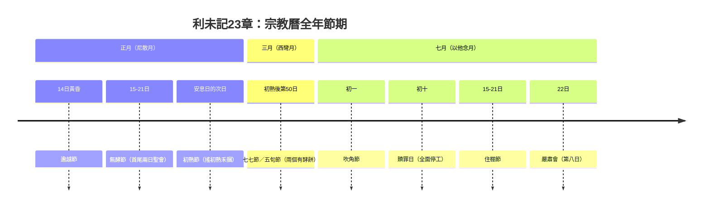

# 利未記 第23章

<!-- chapter-navigation:start -->
| [前一章](../03%20利未記/第22章.md) | [回目錄](../03%20利未記/全書目錄及綱要.md) | [下一章](../03%20利未記/第24章.md) |
| :--- | :---: | ---: |
<!-- chapter-navigation:end -->

1. [[摩西|耶和華對摩西說]]：
2. 你曉諭以色列人說：[[聖會|耶和華的節期，你們要宣告為聖會的節期]]。
3. 六日要做工，第七日是[[聖安息日（大贖罪日雙重安息）|聖安息日]]，當有[[聖會]]；你們什麼工都不可做。[[宗教曆與民事曆兩種曆法|這是在你們一切的住處向耶和華守的安息日]]。
4. [[聖會|耶和華的節期，就是你們到了日期要宣告為聖會的，乃是這些]]。
5. [[逾越節|正月十四日，黃昏的時候，是耶和華的逾越節]]。
6. [[無酵節|這月十五日是向耶和華守的無酵節；你們要吃無酵餅七日]]。
7. 第一日當有[[聖會]]，[[勞碌的工（a.vo.dah）|什麼勞碌的工都不可做]]；
8. [[無酵節|要將火祭獻給耶和華七日。第七日是聖會，什麼勞碌的工都不可做]]。
9. 耶和華對[[摩西]]說：
10. 你曉諭以色列人說：你們到了我賜給你們的地，收割莊稼的時候，[[初熟|要將初熟的莊稼一捆帶給祭司]]。
11. [[搖祭|他要把這一捆在耶和華面前搖一搖]]，[[初熟果子|使你們得蒙悅納]]。[[初熟|祭司要在安息日的次日把這捆搖一搖]]。
12. 搖這捆的日子，你們要把一歲、沒有殘疾的公綿羊羔獻給耶和華為燔祭。
13. 同獻的素祭，就是調油的細麵伊法十分之二，作為馨香的火祭，獻給耶和華。同獻的奠祭，要酒一欣四分之一。
14. 無論是餅，是烘的子粒，是新穗子，你們都不可吃，直等到把你們獻給神的供物帶來的那一天才可以吃。這在你們一切的住處作為世世代代永遠的定例。
15. [[七七節安息日算法的兩種解讀之爭|你們要從安息日的次日，獻禾捆為搖祭的那日算起，要滿了七個安息日]]。
16. [[五旬節兩個有酵餅的搖祭條例|到第七個安息日的次日，共計五十天，又要將新素祭獻給耶和華]]。
17. 要從你們的住處取出細麵伊法十分之二，[[五旬節兩個有酵餅的搖祭條例|加酵，烤成兩個搖祭的餅，當作初熟之物獻給耶和華]]。
18. 又要將一歲、沒有殘疾的羊羔七隻、公牛犢一隻、公綿羊兩隻，和餅一同奉上。這些與同獻的素祭和奠祭要作為燔祭獻給耶和華，就是作馨香的火祭獻給耶和華。
19. 你們要獻一隻公山羊為贖罪祭，兩隻一歲的公綿羊羔為平安祭。
20. [[亞倫和他兒子（祭司）|祭司]]要把這些和[[初熟]]麥子做的餅[[搖祭|一同作搖祭，在耶和華面前搖一搖]]；這是獻與耶和華為聖物歸給祭司的。
21. 當這日，你們要宣告[[聖會]]；什麼[[勞碌的工（a.vo.dah）|勞碌的工]]都不可做。這在你們一切的住處作為世世代代永遠的定例。
22. 在你們的地收割莊稼，[[田角拾穗條例重申（利23：22與利19：9-10互文）|不可割盡田角，也不可拾取所遺落的；要留給窮人和寄居的]]。我是耶和華─你們的神。
23. 耶和華對[[摩西]]說：
24. 你曉諭以色列人說：[[吹角節（七月初一）|七月初一，你們要守為聖安息日，要吹角作紀念，當有聖會]]。
25. 什麼[[勞碌的工（a.vo.dah）|勞碌的工]]都不可做；要將火祭獻給耶和華。
26. 耶和華曉諭[[摩西]]說：
27. [[贖罪日聖會條例（利23角度：刻苦己心與剪除刑罰）|七月初十是贖罪日；你們要守為聖會，並要刻苦己心]]，也要將火祭獻給耶和華。
28. 當這日，什麼工都不可做；因為是贖罪日，要在耶和華─你們的神面前贖罪。
29. [[贖罪日聖會條例（利23角度：刻苦己心與剪除刑罰）|當這日，凡不刻苦己心的，必從民中剪除]]。
30. [[贖罪日聖會條例（利23角度：刻苦己心與剪除刑罰）|凡這日做什麼工的，我必將他從民中除滅]]。
31. 你們什麼工都不可做。這在你們一切的住處作為世世代代永遠的定例。
32. [[聖安息日（大贖罪日雙重安息）|你們要守這日為聖安息日，並要刻苦己心]]。[[贖罪日禁食起始日的難題（第九日或第十日）|從這月初九日晚上到次日晚上，要守為安息日]]。
33. 耶和華對[[摩西]]說：
34. 你曉諭以色列人說：[[住棚節（利23節期規定）|這七月十五日是住棚節，要在耶和華面前守這節七日]]。
35. 第一日當有[[聖會]]，什麼[[勞碌的工（a.vo.dah）|勞碌的工]]都不可做。
36. 七日內要將火祭獻給耶和華。[[住棚節（利23節期規定）|第八日當守聖會，要將火祭獻給耶和華。這是嚴肅會]]，什麼[[勞碌的工（a.vo.dah）|勞碌的工]]都不可做。
37. [[聖會|這是耶和華的節期，就是你們要宣告為聖會的節期]]；[[節期祭物詳情另見民數記28-29章|要將火祭、燔祭、素祭、祭物，並奠祭，各歸各日，獻給耶和華]]。
38. 這是在耶和華的安息日以外，又在你們的供物和所許的願，並甘心獻給耶和華的以外。
39. 你們收藏了地的出產，就從七月十五日起，要守[[逾越節|耶和華的節]]七日。第一日為聖安息；第八日也為聖安息。
40. [[住棚節四種植物|第一日要拿美好樹上的果子和棕樹上的枝子，與茂密樹的枝條並河旁的柳枝]]，在耶和華─你們的神面前歡樂七日。
41. 每年七月間，要向耶和華守這節七日。這為你們世世代代永遠的定例。
42. [[住棚裡是棚或帳的難題|你們要住在棚裡七日；凡以色列家的人都要住在棚裡]]，
43. 好叫你們世世代代知道，我領以色列人出埃及地的時候曾使他們住在棚裡。我是耶和華─你們的神。
44. [[摩西|於是，摩西將耶和華的節期傳給以色列人]]。

---

## 本章知識節點

### 主題
- [[聖會]]
- [[耶和華的節期年曆總覽（利未記23章七大節期架構）]]
- [[七是節期中最要緊的數目]]
- [[五旬節兩個有酵餅的搖祭條例]]
- [[贖罪日聖會條例（利23角度：刻苦己心與剪除刑罰）]]
- [[聖安息日（大贖罪日雙重安息）]]

### 歷史
- [[逾越節]]
- [[無酵節]]
- [[吹角節（七月初一）]]
- [[住棚節（利23節期規定）]]

### 原文
- [[初熟]]
- [[搖祭]]
- [[勞碌的工（a.vo.dah）]]

### 神學
- [[初熟果子]]
- [[基督預表（逾越節羔羊）]]

### 人物
- [[摩西]]
- [[亞倫和他兒子（祭司）]]

### 文化
- [[住棚節四種植物]]

### 背景
- [[宗教曆與民事曆兩種曆法]]
- [[節期祭物詳情另見民數記28-29章]]

### 互文
- [[田角拾穗條例重申（利23：22與利19：9-10互文）]]

### 解經爭議
- [[七七節安息日算法的兩種解讀之爭]]
- [[贖罪日禁食起始日的難題（第九日或第十日）]]
- [[住棚裡是棚或帳的難題]]

---

## 本章整理

### 節期屬於誰，以及安息日為何單獨列出（v1-4）

利未記到二十三章換了題材。前面幾章講聖潔的人、聖潔的衣服、聖潔的祭物、聖潔的地方，本章講的是聖潔的時間。KC 就是這樣開場的：「在前幾章我們讀到聖潔的人、聖潔的衣服、聖潔的禮物和聖潔的地方。本章我們讀到七個聖潔的時候。」

[[耶和華的節期年曆總覽（利未記23章七大節期架構）|全年共七個大節期]]：逾越節、無酵節、收割節（初熟節）、七七節（五旬節）、吹角節、贖罪日、收藏節（住棚節）。名稱本身就是重點。丁良才指出這些節期「在舊約上稱為耶和華的節期，因為是耶和華吩咐百姓遵守的……在新約上稱為猶太人的節期，因為只是猶太人遵守的」。CT 對這個轉變的評語更直接：「本來是『耶和華的節期』，曾幾何時竟變成了『猶太人的節期』；本當讓神歡樂的節期，竟成了人自己享受的節期。」

**安息日不算在七個節期裡面。** 丁良才：「安息日卻在耶和華的節期以外」，並舉代上23:31、代下31:3、尼10:33 為證。串珠說 v4「將安息日與下文的節期分開，成為各種一年一度節期的標題」。KC 注意到編排上的呼應：「本章以安息日開始，也以安息日結束。」

==STEP語言資料顯示「[[聖會]]」在原文是兩個字==——מִקְרָא（miq.ra，詞典義 assembly）與 קֹדֶשׁ（qo.desh，詞典義 holiness），前者在本章出現 11 次、後者 12 次。CT 的原文字義欄拆法相同。GT 雷氏研讀本：「『聖會』。即為了神聖的目的而聚集。『節期』。直譯作：『指定的時間』。」

### 一個中文看不出來的分級：什麼工，還是什麼勞碌的工（v3, 7, 28）

本章講停工講了十次，但不是同一個標準。==[[勞碌的工（a.vo.dah）|中文只差「勞碌的」三個字，原文卻是兩種寫法]]。== STEP語言資料顯示：安息日（v3）與贖罪日（v28、v30、v31）用的是 מְלָאכָה（me.la.khah，詞典義 work）單獨出現的絕對形；而 v7、v8、v21、v25、v35、v36 這六處節期聖會日，前面那個字轉成連綴形，後面再接一個 עֲבֹדָה（a.vo.dah，STEP 逐字解 servitude），直譯是「服役的工」。

兩份 GT 註釋各自獨立把這條線畫在同一個位置。串珠：「安息日的休息比其他節期的休息更完全，其他節期所禁止的只是『勞碌的工』（參7-8, 21, 25, 35-36），即『服役的工作』……但在安息日什麽工都不許作。」丁良才給的清單一致，並補上具體項目：安息日和大贖罪日「連作飯的火也不可生」，別的聖會日只禁「務農，蓋房子，耍手藝等事」，「卻能預備飲食（出十二16）」。他並記下違例的差別：「以色列人犯安息日的必被治死，但猶太人有傳說，犯聖會日的必挨鞭打三十九下。」

也就是說，全年只有兩種日子是全面停工：每週的安息日，和一年一次的贖罪日。

### 春季四節：逾越節、無酵節、初熟、七七節（v5-22）

[[逾越節]]在正月十四日黃昏，[[無酵節|次日起七天吃無酵餅]]。丁良才指出兩個節期的名稱後來變得可以通用，因為「除酵節是接續逾越節，又是完成逾越節的意思」。酵代表什麼，各家一致。GT 丁良才給的說法是「不誠實和假冒為善等罪惡的標幟」；CT 把酵解為罪惡和邪惡的教訓。GT 靈修版則列出無酵餅的三重意義——以色列與萬民有別、道德上的純潔、以及「要立刻服從神的命令」，因為祖宗一點也沒有在麵團裡放酵，不用等麵發起來就能快速離開埃及。KC 把酵在聖經裡的用法整理成五類，從法利賽人的律法主義到婦人藏在三斗麵裡的拜偶像原則。

收割莊稼時要把[[初熟|初熟的一捆]]帶給祭司，由祭司在耶和華面前[[搖祭|搖一搖]]。BH 說明這個動作的意義：搖動是把祭物呈到神面前，承認一切出於神並屬於神。丁良才記下第二聖殿時期的實際流程——公會先派人在城外用繩索束起上好的大麥作記號，十五日日落再派三人各拿鐮刀和籃子去收割，在聖殿院內打出子粒、烘過、磨面、過十三次羅，「唯獨這最細的面是獻給神的」。

**這裡有本章最具體的一處分歧。** v11「祭司要在安息日的次日把這捆搖一搖」的「安息日」到底指哪一天，決定了整組節期的日子。[[七七節安息日算法的兩種解讀之爭|撒都該人認為是無酵節中一週的安息日，法利賽人認為是除酵節的頭一個聖會日]]，七十士譯本與約瑟夫則作正月十六日。丁良才把後果講得很清楚：「七七節若是從正月十六日算起的，正月十六日逢禮拜幾，七七節也必是禮拜幾，但七七節若是從尋常安息日的次日算起的，七七節就必每年逢我們現在的禮拜日。」BH 與 KC 都採一週安息日的讀法，並由此連到主耶穌在七日的第一日復活。

五十天後是七七節，[[五旬節兩個有酵餅的搖祭條例|要用細麵烤成兩個搖祭的餅，而且要加酵]]。加酵在利未記是反常的（利2:11 明文禁止素祭有酵），BH 也點出這個對比。怎麼解則各家不同：CT 讀為奉獻者承認自己有罪，並專立一則問題改正反對「酵表徵聖靈澆灌」的說法；丁良才與啟導本走的是日常食物與酬恩的路。KC 的分法最清楚：「初熟的禾捆代表主耶穌。這兩個搖祭的餅不代表主耶穌，代表教會。」

節期表講到這裡忽然插進一條社會條例：[[田角拾穗條例重申（利23：22與利19：9-10互文）|不可割盡田角，要留給窮人和寄居的]]。串珠給的理由最直接：「守五旬節時要紀念窮人的需要。」丁良才的說法是「單行謝恩的禮是不夠的」。

### 秋季三節：吹角、贖罪、住棚（v23-43）

[[吹角節（七月初一）|七月初一吹角]]。吹的是什麼角，兩家說法相反：丁良才認為是祭司吹銀號，串珠則明確排除——「按猶太人的遺傳，此時所用的角並非民10:2-10提及的銀號，而是公羊的角。」紀念的內容也有兩說（丁良才記「多數的猶太人以為是紀念神創造世界」，GT《舊約聖經背景註釋》說是紀念立約）。各家一致的是它的功能：提醒百姓初十日是大贖罪日，好在這幾天悔罪改過。至於新年，GT《舊約聖經背景註釋》講明了年代：「吹角日後來成為新年慶典，但這是被擄歸回以後的事。」

[[贖罪日聖會條例（利23角度：刻苦己心與剪除刑罰）|七月初十是贖罪日]]。利未記16章已經寫過一次，但角度不同——GT 啟導本：「本書十六章對此有詳細記述，不過是為祭司而寫。此處所記乃為一般百姓而寫，明確述說他們的責任與義務。」丁良才並辨明兩種刑罰的輕重：v30 的「除滅」比 v29 的「剪除」更嚴厲。這一天在新約仍被稱為「禁食的節期」（徒27:9），丁良才特別對照：「其餘的節期都是快樂的節期。」而 v32 說「從這月初九日晚上到次日晚上」，與利16:29 的「初十日」之間的落差，[[贖罪日禁食起始日的難題（第九日或第十日）|GT 收錄的賈斯樂郝威《聖經難解經文詮釋手冊》另立一題處理]]。

[[住棚節（利23節期規定）|七月十五日起住棚七日]]，是全年最後也最長的節期。丁良才列出五種特點，並用四層證據論證第八日的嚴肅會其實在節期以外。他記下第二聖殿時期兩項不見於經文的儀式：每天黎明有祭司提金壺往西羅亞池打水，回來與酒一同倒進祭壇上底部有孔的銀碗；夜間則點亮婦女院四架金燈檯共十六盞大金燈，「甚至滿城都能望得見這燈所發的光亮，這是要叫人紀念那在曠野引導以色列人的火柱」——他並提到有註釋家認為主耶穌正是看見這些燈檯才說「我是世界的光」。

[[住棚節四種植物|第一日要拿的四樣植物]]同樣有兩派用法：撒都該人說是用來搭棚裝飾，法利賽人說是束成紮拿在手中。至於[[住棚裡是棚或帳的難題|「棚」與出16:16 的「帳」]]，丁良才注意到「聖書上論以色列人在曠野的住處，除了本處以外，是單用『帳幕』兩個字」，但認為兩者都是暫時居所並不衝突。他另點出一個反差：紀念曠野的棚，用的卻是迦南美好的樹枝。

| 節期 | 日期（宗教曆） | 停工等級 | 本章特有的重點 |
|---|---|---|---|
| 安息日 | 每週第七日 | 什麼工都不可做 | 在七節期以外，全章的首尾 |
| 逾越節 | 正月十四日黃昏 | —— | 與無酵節名稱後來通用 |
| 無酵節 | 正月十五至二十一日 | 首尾兩日禁勞碌的工 | 除酵是完成逾越節 |
| 初熟節 | 安息日的次日 | —— | 不獻贖罪祭 |
| 七七節 | 五十天後 | 禁勞碌的工 | 兩個餅要加酵 |
| 吹角節 | 七月初一 | 禁勞碌的工 | 預備贖罪日 |
| 贖罪日 | 七月初十 | 什麼工都不可做 | 刻苦己心、剪除與除滅 |
| 住棚節 | 七月十五至二十一日 | 首尾兩日禁勞碌的工 | 第八日嚴肅會在節期以外 |

### 為什麼是七（跨章脈絡）

丁良才在本章特別停下來數了一次：「注意：在耶和華的節期中，『七』是最要緊的數目。」[[七是節期中最要緊的數目|他把這個數字在曆法裡的位置逐層列出]]——第七日是安息日、七月是聖月、第七年是安息年、七個安息年後是禧年、節期共七個、除酵節與住棚節都在月朔後兩個七天開始且各為期七天、初熟節後七個七天是七七節、全章共七個聖會。STEP語言資料可以印證這個密度：שֶׁבַע（she.va，seven）在本章出現 10 次，שְׁבִיעִי（she.vi.i，seventh）8 次。

這套曆法還有另一層。[[宗教曆與民事曆兩種曆法|以色列同時用兩套年曆]]：宗教曆從尼散月起算，民事曆從提斯利月起算。丁良才：「一切敬拜神的事都是按聖曆算定的，其餘諸事仍是按常曆算的。」兩套重疊之處正好解釋了七月為何密集出現三個節期——那同時是宗教曆的第七月與民事曆的正月。GT《舊約聖經背景註釋》另指出古代近東的曆法「大都比以色列的重視日月的運行，因為日月是主要神明的彰顯」，並說明陰曆需要「加插只有幾日長短的第十三個月作為閏月」來對上農時。

本章只說「各歸各日」獻上火祭、燔祭、素祭與奠祭，沒有開列數目——[[節期祭物詳情另見民數記28-29章|丁良才註明詳細數目都在民數記二十八、二十九章]]。KC 把兩處的分工說得最清楚：民28-29「強調的比較是必須獻上的祭物。這裡強調的是那些日子必須舉行的聖會」。

```mermaid
timeline
    title 利未記23章：宗教曆全年節期
    section 正月（尼散月）
        14日黃昏 : 逾越節
        15-21日 : 無酵節（首尾兩日聖會）
        安息日的次日 : 初熟節（搖初熟禾捆）
    section 三月（西彎月）
        初熟後第50日 : 七七節／五旬節（兩個有酵餅）
    section 七月（以他念月）
        初一 : 吹角節
        初十 : 贖罪日（全面停工）
        15-21日 : 住棚節
        22日 : 嚴肅會（第八日）
```

> [!note] KC 讀出的先知性次序（這是他的讀法，不是經文明言）
> KC 把七個節期讀成一條線：「七個節期——七是完全的數目，或一個完整週期的數目——描述神將要領祂的百姓從十字架走到大安息的道路。」逾越節是主的死、無酵節是蒙贖者聖潔的生活、初熟的禾捆是主的復活、七七節是聖靈降臨與教會的出現；v22 是一段間隔；然後吹角節、贖罪日、住棚節分別對應以色列餘民的甦醒、悔改與國度的福分。丁良才給的七層次序大致相同但用語不同。BH 則逐節指出各節期與基督的對應，例如初熟的禾捆對應林前15:20「睡了之人初熟的果子」。

**參考資料**
https://www.ccbiblestudy.org/Old%20Testament/03Lev/03CT23.htm
https://www.ccbiblestudy.org/Old%20Testament/03Lev/03GT23.htm
https://www.kingcomments.com/en/bible-studies/Lev/23
https://biblehub.com/study/leviticus/23.htm
https://github.com/STEPBible/STEPBible-Data

<!-- chapter-navigation:start -->
| [前一章](../03%20利未記/第22章.md) | [回目錄](../03%20利未記/全書目錄及綱要.md) | [下一章](../03%20利未記/第24章.md) |
| :--- | :---: | ---: |
<!-- chapter-navigation:end -->
