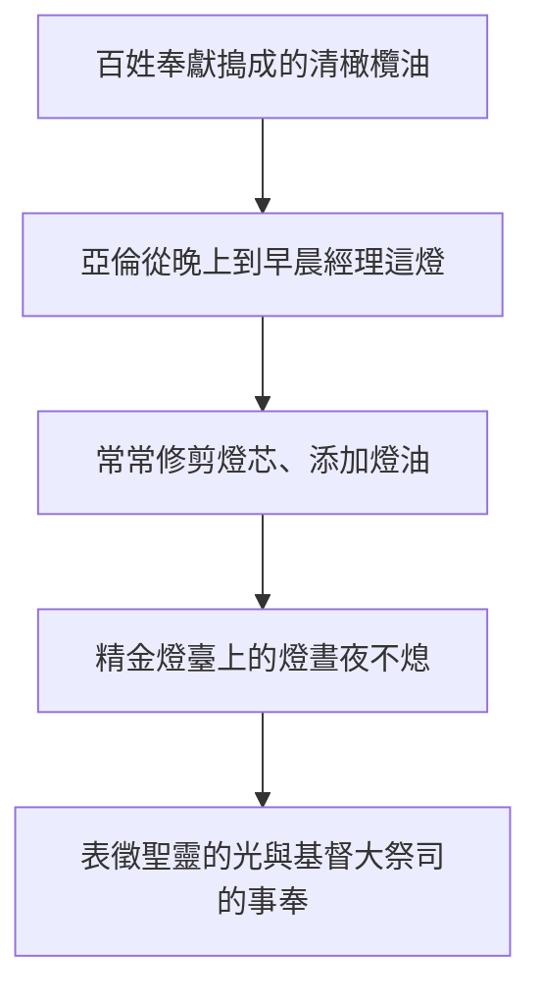
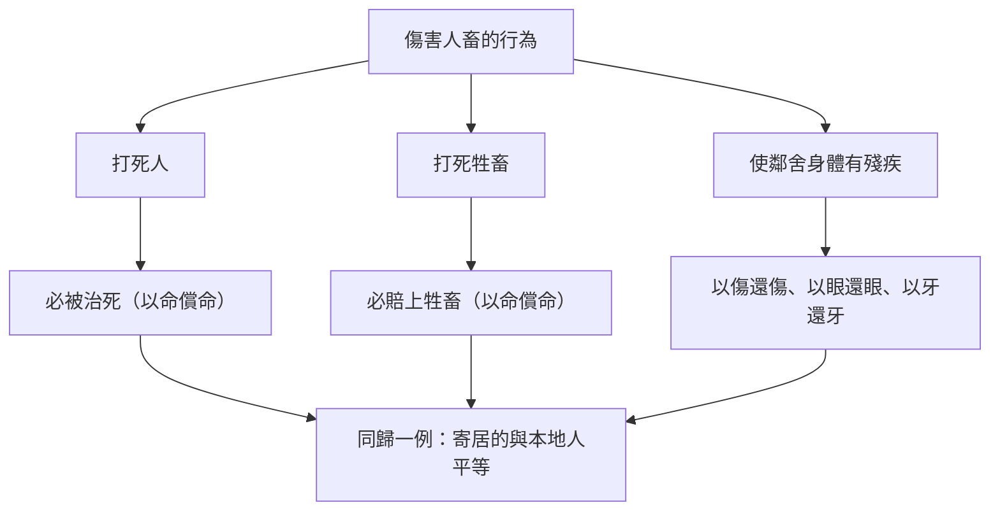

# 利未記 第24章

1. [[摩西|耶和華曉諭摩西說]]：
2. 要吩咐以色列人，[[金燈臺|把那為點燈搗成的清橄欖油拿來給你，使燈常常點著]]。
3. 在會幕中法櫃的幔子外，[[祭司經理燈（亞倫和他兒子）|亞倫從晚上到早晨必在耶和華面前經理這燈]]。這要作你們世世代代永遠的定例。
4. 他要在耶和華面前常收拾精[[金燈臺]]上的燈。
5. [[陳設餅桌子|你要取細麵，烤成十二個餅，每餅用麵伊法十分之二]]。
6. [[陳設餅桌子|要把餅擺列兩行]]（或作：摞；下同），每行六個，在耶和華面前精金的桌子上；
7. 又要把淨乳香放在每行餅上，作為紀念，就是作為火祭獻給耶和華。
8. [[陳設餅桌子|每安息日要常擺在耶和華面前；這為以色列人作永遠的約]]。
9. [[亞倫和他兒子（祭司）|這餅是要給亞倫和他子孫的]]；他們要在聖處吃，為永遠的定例，因為在獻給耶和華的火祭中是至聖的。
10. [[褻瀆聖名案例（利未記唯一記載的具體刑罰執行事件）|有一個以色列婦人的兒子，他父親是埃及人，一日閒遊在以色列人中]]。這以色列婦人的兒子和一個以色列人在營裡爭鬥。
11. [[耶和華聖名的啟示|這以色列婦人的兒子褻瀆了聖名，並且咒詛]]，[[摩西|就有人把他送到摩西那裡]]。（[[示羅密（但支派底伯利的女兒，褻瀆者之母）|他母親名叫示羅密，是但支派底伯利的女兒]]。）
12. [[褻瀆聖名案例（利未記唯一記載的具體刑罰執行事件）|他們把那人收在監裡，要得耶和華所指示的話]]。
13. 耶和華曉諭[[摩西]]說：
14. 把那咒詛聖名的人帶到營外。[[按手在犯人頭上作見證（利24：14）|叫聽見的人都放手在他頭上]]；全會眾就要用石頭打死他。
15. 你要曉諭以色列人說：凡咒詛神的，必擔當他的罪。
16. [[耶和華聖名的啟示|那褻瀆耶和華名的，必被治死]]；全會眾總要用石頭打死他。[[寄居的與本地人同歸一例|不管是寄居的是本地人，他褻瀆耶和華名的時候，必被治死]]。
17. [[打死人與打死牲畜的賠償原則|打死人的，必被治死]]；
18. [[打死人與打死牲畜的賠償原則|打死牲畜的，必賠上牲畜，以命償命]]。
19. 人若使他鄰舍的身體有殘疾，他怎樣行，也要照樣向他行：
20. [[同態復仇法|以傷還傷，以眼還眼，以牙還牙]]。他怎樣叫人的身體有殘疾，也要照樣向他行。
21. 打死牲畜的，必賠上牲畜；打死人的，必被治死。
22. [[寄居的與本地人同歸一例|不管是寄居的是本地人，同歸一例]]。我是耶和華─你們的神。
23. [[褻瀆聖名案例（利未記唯一記載的具體刑罰執行事件）|於是，摩西曉諭以色列人，他們就把那咒詛聖名的人帶到營外，用石頭打死]]。以色列人就照耶和華所吩咐摩西的行了。

---

## 本章知識節點

### 主題
- [[金燈臺]]
- [[陳設餅桌子]]
- [[同態復仇法]]
- [[以眼還眼]]
- [[以眼還眼的適用範圍]]
- [[耶和華聖名的啟示]]
- [[光與燈預表基督（世界的光）]]
- [[寄居的與本地人同歸一例]]
- [[打死人與打死牲畜的賠償原則]]
- [[陳設餅十二個餅預表以色列十二支派]]

### 事件
- [[褻瀆聖名案例（利未記唯一記載的具體刑罰執行事件）]]

### 人物
- [[摩西]]
- [[亞倫和他兒子（祭司）]]
- [[示羅密（但支派底伯利的女兒，褻瀆者之母）]]

### 互文
- [[出27：20-21|出27：20-21 燈常常點著的條例]]
- [[出25：30|出25：30 陳設餅桌子的設立]]
- [[出20：7|出20：7 第三誡不可妄稱神的名]]
- [[出21：23-25|出21：23-25 以眼還眼同態復仇法]]
- [[民15：32-36|民15：32-36 犯安息日者收監求問神]]
- [[來13：12-13|來13：12-13 耶穌在營外受苦]]
- [[太5：38-39|太5：38-39 主耶穌論以眼還眼]]

### 原文
- [[清橄欖油（點燈用）]]

### 文化
- [[祭司經理燈（亞倫和他兒子）]]
- [[按手在犯人頭上作見證（利24：14）]]

---

## 本章整理

### 燈臺與陳設餅：聖所中的常例事奉（v1-9）

利未記第二十四章在二十三章的節期律法之後，轉向會幕聖所中每日、每週持續進行的常例事奉。神吩咐以色列人要將搗成的清橄欖油拿來，使 [[金燈臺]] 上的燈常常點著。CT 在文意註解中指出，這油是由百姓將橄欖搗爛泡在熱水內使油浮起，比一般壓榨出的更精。在靈意上，CT 進一步闡述「橄欖油」表徵聖靈，必須經過「搗」（表徵十字架的對付）並保持「清」（純淨無肉體摻雜），才能在教會中發出亮光。BH 則從新約預表的角度看，認為這持續燃燒的燈預表基督是「世界的光」（約八12），而 [[光與燈預表基督（世界的光）]] 正是這段經文的核心神學意義。

亞倫從晚上到早晨必在耶和華面前經理這燈，這是世世代代永遠的定例。CT 指出「從晚上到早晨」表示夜間燈光不可熄滅，而 [[祭司經理燈（亞倫和他兒子）]] 的工作包括修剪燈芯與添加燈油。KC 提出了一個先知性的視角：百姓雖然在屬靈黑暗中，但大祭司在聖所中維持燈光，預表主耶穌在天上不間斷的大祭司事奉；即使百姓不忠，神在聖所中仍維持對他們的紀念。

接著經文轉向陳設餅的條例。祭司要取細麵烤成十二個餅，[[陳設餅十二個餅預表以色列十二支派]]，每餅用麵伊法十分之二。CT 指出「細麵」表徵經過輾磨而顯明的復活生命，「烤」表徵火煉。關於餅的擺列方式，經文寫作「兩行（或作：摞）」，GT 引述丁良才的註解指出，按桌子的尺寸和猶太歷史學家約瑟夫的記載，這些餅大概是擺列成「兩摞」而非平行的兩行，這也成為本章的一個解經細節。餅上要放淨乳香作為紀念，每安息日更換一次。撤下來的餅歸給 [[亞倫和他兒子（祭司）]]，他們要在聖處吃，因為這是至聖的。KC 認為，祭司吃這餅是與百姓認同，在神面前以祂對百姓的愛為糧。

### 褻瀆聖名的事件與刑罰（v10-16, v23）

第二十四章的後半段記載了一個具體的歷史事件。有一個以色列婦人的兒子，他父親是埃及人，在營中與一個以色列人爭鬥時褻瀆了聖名並且咒詛。GT 指出這人是以色列人與外族通婚所生的閒雜人，並特別記載他母親 [[示羅密（但支派底伯利的女兒，褻瀆者之母）]] 的名字，藉此警戒以色列人不可與外邦人通婚，並提醒母親要負起信仰教育的責任。KC 則將此事件提升為以色列整體屬靈狀態的縮影：這混血兒的心仍與埃及相連，毫不畏懼耶和華，正預表了以色列日後將褻瀆並棄絕主的罪。

由於當時律法尚未明文規定褻瀆神名當如何處置，摩西將那人收在監裡，等候神的指示。GT 引述丁良才的註解說明，摩西每逢不曉得神的旨意便等候求問，這是信徒與教會領袖的榜樣。神隨後指示：要把那咒詛聖名的人帶到營外，叫聽見的人都 [[按手在犯人頭上作見證（利24：14）]]，全會眾要用石頭打死他。BH 指出，帶到營外象徵將罪從社群中分離，而按手在頭上表示見證人將罪責歸於犯人，洗清自己的連累。這 [[褻瀆聖名案例（利未記唯一記載的具體刑罰執行事件）]] 最終在 v23 付諸執行，成為日後律法的判例。神在此確立了原則：不管是寄居的還是本地人，凡褻瀆耶和華名的，必被治死。

### 同態復仇與公平賠償原則（v17-22）

在褻瀆聖名的判決之後，神一併重申了關於傷害人畜的懲罰條例。這段經文確立了 [[打死人與打死牲畜的賠償原則]]：打死人的必被治死，打死牲畜的必賠上牲畜。對於傷害鄰舍的條例，經文提出了著名的 [[同態復仇法]]——「以傷還傷，以眼還眼，以牙還牙」。

GT 的《舊約聖經背景註釋》指出，這種「以眼還眼」的法律觀念在古代近東法典（如漢摩拉比法典）中也可找到，但其實際功用是規限對被告所能作出的懲罰，保證合法賠償並避免私自尋仇。CT 補充說明，在猶太人歷史中通常少有人按字面施行報復，而是在雙方同意下給予對等相稱的懲罰。BH 進一步從新約視角說明，耶穌在馬太福音中引用此原則，是為了引導信徒超越報復，走向加倍的饒恕與愛（太五38-39）。

本章最後以一句總結收尾：「不管是寄居的是本地人，同歸一例。我是耶和華你們的神。」這確立了 [[寄居的與本地人同歸一例]] 的法律平等原則。BH 指出，這在古代近東 context 中是革命性的，因為許多周圍文化對不同階級有不同法律，但神命令一個統一標準，反映了祂的公正與不偏待人。

### 跨章脈絡：聖所事奉與曠野現實的張力

利未記第二十四章在結構上呈現了強烈的對比：前半段（v1-9）是聖所內完美、有序、持續的常例事奉，後半段（v10-23）則是營外混亂、衝突、褻瀆的曠野現實。KC 特別點出這種張力：聖所中的燈光與陳設餅預表了神對百姓不間斷的紀念，但營外的褻瀆事件卻暴露了百姓屬靈狀態的失敗。這兩段經文並非隨意編排，而是互相解釋：正因為百姓在現實中失敗，聖所中大祭司持續的事奉才更顯必要。KC 認為，神在歷史中先賜下聖所事奉的應許，再揭示百姓的失敗，這順序本身就是恩典的展現。

**參考資料**
https://www.ccbiblestudy.org/Old%20Testament/03Lev/03CT24.htm
https://www.ccbiblestudy.org/Old%20Testament/03Lev/03GT24.htm
https://www.kingcomments.com/en/bible-studies/Lev/24
https://biblehub.com/study/leviticus/24.htm
