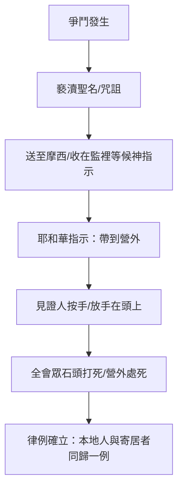

# 利未記 第24章

1. [[摩西|耶和華曉諭摩西說]]：
2. 要吩咐[[以色列|以色列人]]，把那為點燈搗成的[[金燈臺|清橄欖油]]拿來給你，[[金燈臺|使燈常常點著]]。
3. 在[[金燈臺|會幕中法櫃的幔子外]]，[[亞倫]]從晚上到早晨必在耶和華面前經理這燈。這要作你們[[金燈臺|世世代代永遠的定例]]。
4. 他要在耶和華面前[[經理這燈（祭司經理燈）|常收拾精金燈臺上的燈]]。
5. 你要取細麵，[[細麵|烤成十二個餅]]，每餅用麵伊法十分之二。
6. 要把餅[[陳設餅桌子|擺列兩行]]（或作：摞；下同），[[陳設餅桌子|每行六個]]，在耶和華面前精金的桌子上；
7. 又要把淨乳香放在每行餅上，[[淨乳香（lebonah zākkāh）|作為紀念]]，就是作為火祭獻給耶和華。
8. [[安息日|每安息日]]要常擺在耶和華面前；這為[[以色列|以色列人]]作永遠的約。
9. 這餅是要給[[亞倫]]和他子孫的；他們要[[聖處（會幕院子）|在聖處吃]]，為[[世世代代|永遠的定例]]，因為在獻給耶和華的火祭中是[[至聖]]的。
10. 有一個[[閒雜人|以色列婦人的兒子]]，他[[閒雜人|父親是埃及人]]，一日閒遊在[[以色列|以色列人]]中。這以色列婦人的兒子和一個以色列人在營裡爭鬥。
11. 這[[閒雜人|以色列婦人的兒子]]褻瀆了聖名，並且咒詛，就有人把他送到[[摩西]]那裡。（他母親名叫[[示羅密（但支派底伯利的女兒）|示羅密]]，是[[示羅密（但支派底伯利的女兒）|但支派底伯利的女兒]]。）
12. 他們把那人收在監裡，要得耶和華所指示的話。
13. [[摩西|耶和華曉諭摩西說]]：
14. 把那咒詛聖名的人帶到營外。叫聽見的人都放手在他頭上；[[以色列全會眾|全會眾]]就要用[[褻瀆聖名條例|石頭打死]]他。
15. 你要曉諭[[以色列|以色列人]]說：凡[[咒詛神的名|咒詛神]]的，必[[從民中剪除（karet）|擔當他的罪]]。
16. 那褻瀆耶和華名的，[[從民中剪除（karet）|必被治死]]；[[以色列全會眾|全會眾]]總要用[[褻瀆聖名條例|石頭打死]]他。不管是[[寄居的（ger）|寄居的是本地人]]，他褻瀆耶和華名的時候，必被治死。
17. 打死人的，[[從民中剪除（karet）|必被治死]]；
18. 打死牲畜的，必賠上牲畜，[[打死牲畜的必賠上牲畜|以命償命]]。
19. 人若使他鄰舍的身體有殘疾，他怎樣行，也要照樣向他行：
20. [[以傷還傷（lex talionis）|以傷還傷]]，[[以傷還傷（lex talionis）|以眼還眼]]，[[以傷還傷（lex talionis）|以牙還牙]]。他怎樣叫人的身體有殘疾，也要照樣向他行。
21. 打死牲畜的，必賠上牲畜；打死人的，[[從民中剪除（karet）|必被治死]]。
22. 不管是[[寄居的（ger）|寄居的是本地人]]，同歸一例。我是耶和華─你們的神。
23. 於是，[[摩西|摩西曉諭以色列人]]，他們就把那咒詛聖名的人帶到營外，用[[褻瀆聖名條例|石頭打死]]。以色列人就照耶和華所吩咐摩西的行了。

---

## 本章知識節點

### 儀式典範
- [[金燈臺]]
- [[陳設餅桌子]]
- [[安息日]]
- [[細麵]]
- [[淨乳香（lebonah zākkāh）]]
- [[陳設餅條例]]
- [[經理這燈（祭司經理燈）]]

### 聖職與聖所
- [[亞倫]]
- [[亞倫和他兒子（祭司）]]
- [[聖所]]
- [[內幔（隔聖所至聖所的幔子）]]
- [[聖處（會幕院子）]]
- [[至聖]]
- [[世世代代]]

### 法例審判
- [[律例]]
- [[褻瀆聖名條例]]
- [[咒詛神的名]]
- [[收在監裡等候神指示]]
- [[放手在頭上（轉移罪責）]]
- [[營外處死]]
- [[以傷還傷（lex talionis）]]
- [[打死人的必被治死]]
- [[打死牲畜的必賠上牲畜]]

### 人物群體
- [[摩西]]
- [[以色列]]
- [[以色列全會眾]]
- [[示羅密（但支派底伯利的女兒）]]
- [[埃及地]]
- [[寄居的（ger）]]
- [[閒雜人]]

---

## 本章整理

### 燈與餅的常設條例（v1-9）
本章開篇確立兩項會幕中 ==世世代代== 的常設儀式。首先，耶和華吩咐 [[摩西]] 叫 [[以色列]] 人獻上搗成的清橄欖油，由 [[亞倫]] 在 [[聖所]] [[內幔（隔聖所至聖所的幔子）|內幔]] 外，從晚上到早晨 [[經理這燈（祭司經理燈）|經理]] [[金燈臺]] 上的燈，象徵神的同在不斷照耀。其次，取 [[細麵]] 烤成十二個餅，擺列兩行於 [[陳設餅桌子]] 上，每行加上 [[淨乳香（lebonah zākkāh）]] 作為紀念火祭。每 [[安息日]] 更換一次，舊餅歸 [[亞倫和他兒子（祭司）]] 在 [[聖處（會幕院子）]] 吃，因為是 [[至聖]] 的。這兩項條例（[[陳設餅條例]] 與燈的條例）共同構建了聖所中「光」與「糧」的雙重供應意象。

### 褻瀆聖名與死刑判例（v10-16）
經文轉入敘事：一個 [[以色列]] 婦人 [[示羅密（但支派底伯利的女兒）]] 的兒子（父親是 [[埃及地]] 人，屬 [[閒雜人]]/[[寄居的（ger）]] 性質）在營中與以色列人爭鬥，竟觸犯 [[褻瀆聖名條例]]、[[咒詛神的名]]。眾人將他 [[收在監裡等候神指示]]。耶和華判斷：帶到 [[營外處死]]，聽見者 [[放手在頭上（轉移罪責）|按手在頭上]]，[[以色列全會眾]] 用石頭打死。此案確立了 [[褻瀆聖名條例]] 的核心原則：無論本地人或 [[寄居的（ger）]]，褻瀆耶和華名必被治死，彰顯神名的獨特聖潔與管轄權。

> [!note] 程序性正義
> 「收在監裡等候神指示」顯示以色列法律程序中保留神聖裁決空間，避免私刑；「按手」儀式將見證人責任與判決連結，強調社群共同參與除惡。

### 以傷還傷的公義原則（v17-22）
緊接著頒布 [[以傷還傷（lex talionis）]] 的公義法則：[[打死人的必被治死]]、[[打死牲畜的必賠上牲畜]]、身體殘疾以傷還傷（眼還眼、牙還牙）。這不是鼓勵私人報復，而是限制報復升級、確保懲罰與罪行相稱的司法原則。經文兩次強調「不管是 [[寄居的（ger）]] 是本地人，同歸一例」，奠定法律面前人人平等的神學基礎——「我是耶和華─你們的神」。

> [!important] 核心神學
> [[律例]] 的頒布將聖潔（前段儀式）與公義（後段審判）結合：敬拜聖潔的神，必然要求社群生活中體現公義的審判。

### 執行與順服（v23）
[[摩西]] 曉諭 [[以色列]] 人，他們照耶和華吩咐將咒詛者帶到營外石頭打死。敘事以完全順服作結，印證 [[以色列全會眾]] 在聖約下的責任共同體身分。

### 跨章脈絡：聖潔與公義的共同體
利未記 24 章作為聖潔法典（利 17-26）的重要一環，以儀式（燈、餅）開啟，以審判（褻瀆、殺人、傷害）收尾。[[金燈臺]] 的常燃與 [[陳設餅條例]] 的常擺，預表神永恆的同在與供應；而 [[褻瀆聖名條例]] 與 [[以傷還傷（lex talionis）]] 則劃定共同體邊界：神的名不可褻瀆，人的生命與肢體不可隨意侵害。[[寄居的（ger）]] 納入同一法律框架，預示新約中「不分猶太人、希臘人」的福音平等（加 3:28）。本章展示聖所崇拜與社會倫理不可分割——真正的敬拜必流露為公義的生活。

**參考資料**
https://www.ccbiblestudy.org/Old%20Testament/03Lev/03CT24.htm
https://www.ccbiblestudy.org/Old%20Testament/03Lev/03GT24.htm
https://www.kingcomments.com/en/bible-studies/Lev/24
https://biblehub.com/study/leviticus/24.htm
