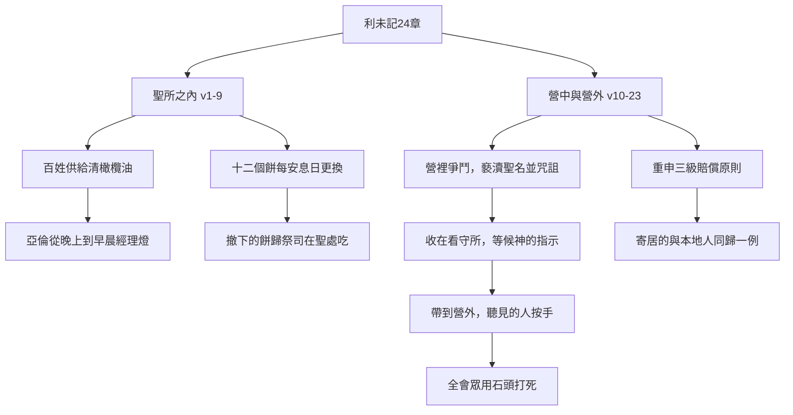

# 利未記 第24章

<!-- chapter-navigation:start -->
| [前一章](../03%20利未記/第23章.md) | [回目錄](../03%20利未記/全書目錄及綱要.md) | [下一章](../03%20利未記/第25章.md) |
| :--- | :---: | ---: |
<!-- chapter-navigation:end -->

1. [[摩西|耶和華曉諭摩西說]]：
2. 要吩咐以色列人，[[金燈臺|把那為點燈搗成的清橄欖油拿來給你，使燈常常點著]]。
3. 在會幕中法櫃的幔子外，[[祭司經理燈（亞倫和他兒子）|亞倫從晚上到早晨必在耶和華面前經理這燈]]。這要作你們世世代代永遠的定例。
4. 他要在耶和華面前常收拾精[[金燈臺]]上的燈。
5. [[陳設餅桌子|你要取細麵，烤成十二個餅，每餅用麵伊法十分之二]]。
6. [[陳設餅桌子|要把餅擺列兩行]]（或作：摞；下同），每行六個，在耶和華面前精金的桌子上；
7. 又要把淨乳香放在每行餅上，作為紀念，就是作為火祭獻給耶和華。
8. [[陳設餅桌子|每安息日要常擺在耶和華面前；這為以色列人作永遠的約]]。
9. [[亞倫和他兒子（祭司）|這餅是要給亞倫和他子孫的]]；他們要在聖處吃，為永遠的定例，因為在獻給耶和華的火祭中是至聖的。
10. [[褻瀆聖名案例（利未記唯一記載的具體刑罰執行事件）|有一個以色列婦人的兒子，他父親是埃及人，一日閒遊在以色列人中]]。這以色列婦人的兒子和一個以色列人在營裡爭鬥。
11. 這以色列婦人的兒子褻瀆了聖名，並且咒詛，[[摩西|就有人把他送到摩西那裡]]。（[[示羅密（但支派底伯利的女兒，褻瀆者之母）|他母親名叫示羅密，是但支派底伯利的女兒]]。）
12. [[褻瀆聖名案例（利未記唯一記載的具體刑罰執行事件）|他們把那人收在監裡，要得耶和華所指示的話]]。
13. 耶和華曉諭[[摩西]]說：
14. 把那咒詛聖名的人帶到營外。[[按手在犯人頭上作見證（利24：14）|叫聽見的人都放手在他頭上]]；全會眾就要用石頭打死他。
15. 你要曉諭以色列人說：凡咒詛神的，必擔當他的罪。
16. 那[[褻瀆聖名（na.qav）|褻瀆耶和華名]]的，必被治死；全會眾總要用石頭打死他。[[寄居的與本地人同歸一例|不管是寄居的是本地人，他褻瀆耶和華名的時候，必被治死]]。
17. [[打死人與打死牲畜的賠償原則|打死人的，必被治死]]；
18. [[打死人與打死牲畜的賠償原則|打死牲畜的，必賠上牲畜，以命償命]]。
19. 人若使他鄰舍的身體有殘疾，他怎樣行，也要照樣向他行：
20. [[同態復仇法|以傷還傷，以眼還眼，以牙還牙]]。他怎樣叫人的身體有殘疾，也要照樣向他行。
21. 打死牲畜的，必賠上牲畜；打死人的，必被治死。
22. [[寄居的與本地人同歸一例|不管是寄居的是本地人，同歸一例]]。我是耶和華─你們的神。
23. [[褻瀆聖名案例（利未記唯一記載的具體刑罰執行事件）|於是，摩西曉諭以色列人，他們就把那咒詛聖名的人帶到營外，用石頭打死]]。以色列人就照耶和華所吩咐摩西的行了。

---

## 本章知識節點

### 主題
- [[金燈臺]]
- [[陳設餅桌子]]
- [[清橄欖油（點燈用）]]
- [[寄居的與本地人同歸一例]]
- [[打死人與打死牲畜的賠償原則]]
- [[按手在犯人頭上作見證（利24：14）]]

### 神學
- [[以眼還眼]]
- [[耶和華聖名的啟示]]
- [[光與燈預表基督（世界的光）]]
- [[陳設餅十二個餅預表以色列十二支派]]

### 原文
- [[同態復仇法]]
- [[按手]]
- [[褻瀆聖名（na.qav）]]

### 人物
- [[摩西]]
- [[亞倫和他兒子（祭司）]]
- [[祭司經理燈（亞倫和他兒子）]]
- [[示羅密（但支派底伯利的女兒，褻瀆者之母）]]

### 事件
- [[褻瀆聖名案例（利未記唯一記載的具體刑罰執行事件）]]

### 背景
- [[石刑]]

### 解經爭議
- [[以眼還眼的適用範圍]]

### 互文
- [[出27：20-21|出27：20-21 燈常常點著的條例]]
- [[出25：30|出25：30 陳設餅桌子的設立]]
- [[出20：7|出20：7 第三誡不可妄稱神的名]]
- [[出21：23-25|出21：23-25 以眼還眼同態復仇法]]
- [[民15：32-36|民15：32-36 犯安息日者收監求問神]]
- [[來13：12-13|來13：12-13 耶穌在營外受苦]]
- [[太5：38-39|太5：38-39 主耶穌論以眼還眼]]

---

## 本章整理

### 每天點的燈，每週換的餅（v1-9）

第二十三章排完一整年的節期，本章掉頭處理另一種時間：不是一年幾次，是天天、週週。丁良才把這個對比說出來了——這兩件事出埃及記早就吩咐過，這裡重述是要讓百姓和祭司「不但逢安息日和節期把燈點著，把餅擺在耶和華面前，乃是叫他們常常這樣」。GT 串珠的觀察一致：利未記23至25章之間的這些聖所條例「叫人注意這些永久不變的儀式，不受上述每年一度的節期和特別的日子所影響」。

點燈用的油有講究。丁良才記下工序：「以色列人將橄欖搗爛泡在熱水內，使油浮起，這樣的油比醡出的更精。」GT 精讀本進一步分辨——日常用油是果子、葉子、枝子一起搗，而清橄欖油「只用橄欖樹的果子搗成」。GT《舊約聖經背景註釋》一句話收束：「只有最上等的橄欖油，才能用在點亮聖幕聖潔特區的聖燈之中。」

==油由誰出，是這一段真正的重點。== 丁良才：這油和陳設的餅「既是為會眾的禮拜，歸會眾供給本是理所當然的」。KC 把它讀成責任：「神以此定規，讓全體百姓確保聖所裡有光。他們的責任就是照著那光而活」——然後他指出，接下來那段事件正好說明他們失敗了。[[祭司經理燈（亞倫和他兒子）|經理這燈]]是大祭司的職任，但眾祭司也能代理。

「常常點著」有一個實際的限定。丁良才：這是指「從安營到起營的時候」，起營時祭司要熄燈，把[[金燈臺|燈臺]]與器具用藍色毯子和海狗皮包好放上抬架（民4:9-10），安營後再點。白天點幾盞則說法不一——丁良才說夜間七盞全點、白天只點中間一盞，但「按約瑟夫說，白日點著三盞燈」。

[[陳設餅桌子|桌子上的餅]]是[[陳設餅十二個餅預表以色列十二支派|十二個]]，各家一致解為十二支派。「擺列兩行」可能其實是兩摞：CT 引約瑟夫作此讀法，理由是「因餅很大，桌面不夠平行擺列」；串珠拿桌子的尺寸支持——約一公尺乘半公尺。乳香放在餅上還是餅旁也有分歧：丁良才說盛在兩個金杯內放在兩摞餅上，串珠認為「餅旁」較適合，雷氏研讀本同此。

丁良才記下了第二聖殿時期的整套作法：管理陳設餅的是哥轄子孫；麵要過十一面羅，放進金模子定規大小，每餅長十掌、寬五掌，烤熟後在餅面正中用油抹成十字；餅在禮拜五下午烤，日落安息日一開始就換。換餅時八個祭司同時進聖所，四個在南邊撤舊餅與乳香，四個在北邊隨即擺上新的——為的是照出埃及記25:30 讓桌上「常有」陳設餅。他並指出撒母耳記上21:6「只有更換新餅」的原文其實是「只有更換熱餅」。

KC 給的圖畫是：餅是百姓，托著餅的桌子是主耶穌，而餅上的純乳香說明那股馨香來自基督，「因為就他們自己而言，他們身上沒有任何討神喜悅的東西」。

### 一件突發的事，和一條臨時求來的律法（v10-16）

接下來[[褻瀆聖名案例（利未記唯一記載的具體刑罰執行事件）|經文換成敘事]]：一個以色列婦人與埃及人所生的兒子，在營裡跟一個以色列人爭鬥，褻瀆了聖名並且咒詛。爭鬥的起因經文沒說，但丁良才記下猶太人的傳說——對方屬但支派，這人因為母親是但支派而想住進以色列人中間，對方不肯，「因為兒子只可以在父親本族的旗號那裡居住（民二2）」，送官之後他輸了，才咒詛了神。

==「褻瀆」在這裡是一個特別的字。== STEP語言資料顯示 v11 與 v16 的[[褻瀆聖名（na.qav）|「褻瀆」是 נָקַב（na.qav），詞典義 to pierce——刺穿]]；CT 的原文字義欄給的正是「褻瀆，咒詛，刺穿」。丁良才提供了理解的背景：「以色列人隱諱神的聖名耶和華」，那個名字平時不宣之於口，把它挑明本身就構成冒犯。同一節還有第二個動詞——「並且咒詛」是另一個字 קָלַל（qa.lal），而 v14 稱這人為「那咒詛聖名的人」用的正是 qa.lal，不是 na.qav。KC 對「那名」的範圍另有說明：「『名』指的是神全部的所是，而不是各個名字所各自呈現的神的某一面。」

收監不是判刑。丁良才特別澄清：「摩西的律法上沒有定什麼坐監的罪，所以本句的『監』字作『看守所』解，是為未曾定案的犯人預備的。」原因很實際——這人犯的是第三條誡命，而出埃及記20:7 只說「必不以他為無罪」，沒有訂刑罰。KC 把這一點放進更大的架構：這是摩西必須等候神親自回答的四個案例之一，另外三個是因死屍不能守逾越節（民9:6-14）、犯安息日（民15:32-36）、西羅非哈女兒求產業（民27:1-11）。丁良才由此推出應用：信徒遇不明白神旨意的事，「也當效法摩西的榜樣求問神，不可專靠自己的聰明智慧」。

判決下來是[[石刑|帶到營外用石頭打死]]，而且要先由[[按手在犯人頭上作見證（利24：14）|聽見的人按手在他頭上]]。==這個「按手」在原文是獻祭那個動詞==——STEP語言資料顯示是 סָמַךְ（sa.makh），與利1:4、利4:4、利8:14 按手在祭牲頭上同一個字。但它在本章代表什麼，各家講法分歧：

| 來源 | 對按手的解讀 |
|---|---|
| CT | 作見證，證明他確實咒詛聖名；顯明這罪原是那人的，見證人在這罪上無份，與洗手表意相似 |
| GT 丁良才 | 同上，並指出見證人先下手、眾民後下手的程序，用意在防止假見證與嚇阻犯罪 |
| GT 串珠 | 方向相反：聽見的人因受連累而有罪，按手是「藉他的死而獲赦罪」 |
| KC | 兼取兩面：按手表示認同，把目睹之罪行的罪責放在犯罪者頭上，藉此使自己脫身 |
| BH | 罪責與責任的轉移，同時要求目擊者確認控訴屬實 |

丁良才在此處另外列了一份清單：全本聖經有七回記載用石頭打死人——褻瀆主名的人（本章）、犯安息日的人（民15:36）、亞幹（書7:24-25）、亞多蘭（王上12:18）、拿伯（王上21:13）、撒迦利亞（代下24:21）、司提反（徒7:58）。頭尾兩件事隔著整本舊約，而 KC 指出後者正是同一條律法被濫用的結果——不敬虔的審判官先用它定了主耶穌的死罪（太26:65-66）。GT《舊約聖經背景註釋》給的古代近東對照是：「亞述文獻對褻瀆者的處罰，是切斷舌頭，並活活剝皮。」

### 三級傷害，一個標準（v17-22）

事件之後接的是[[打死人與打死牲畜的賠償原則|三條賠償規定]]：打死人的必被治死，打死牲畜的必賠上牲畜，使鄰舍有殘疾的[[以眼還眼|以傷還傷、以眼還眼、以牙還牙]]。丁良才指出這些是重申既有律例（v18 是「推廣出二十一33-34節的條例」），放在這裡的用意之一是：會眾雖可按律法用石頭打死人，「但個人卻不可私自打死人」。

==[[同態復仇法|同態復仇法]]的功能是設上限，不是設下限。== GT《舊約聖經背景註釋》說得最清楚：這些法律的根據「是要保證合法的賠償，從而避免私自尋仇對文化所造成的危害」，而且「這作法驟看似乎極端，其實際功用卻是規限對於被告所能作出的懲罰」。GT 串珠同此：「原意是要訂定正確而公平的刑罰條例，強調賠償應與損毀相稱，要避免過分的報復或抵賴。」GT 雷氏研讀本一句話收束：「復仇法的目的是為了公正，而不是報仇，更且是關乎公眾的正義，而不是私人恩怨。」KC 的說法一致——刑罰「應與罪行相稱，不得更高也不得更低」。

實際上很少照字面執行。CT：「據說在猶太人的歷史中，通常少有人按照本條規的字面施行報復，而在雙方同意的原則下，給予對等、相稱的懲罰。」串珠說得更具體：傷人的可用財物補償，「但謀殺別人卻不能以贖價代替填命（民35:31）」。[[以眼還眼的適用範圍|這條界線該推到哪裡]]，各家並未收斂到同一個答案。

全段以一句話收尾：[[寄居的與本地人同歸一例|不管是寄居的是本地人，同歸一例]]。STEP語言資料顯示這句直譯是「一個判決」（מִשְׁפַּט אֶחָד）加「如同寄居的、如同本地人」（כַּגֵּר כָּאֶזְרָח），CT 的原文字義欄拆法相同。BH 指出這在古代近東是革命性的，因為周圍多數文化對不同階層適用不同法律；GT《舊約聖經背景註釋》舉出具體對照——漢摩拉比法典的刑罰「隨犯人和被害者的社會地位（貴族、公民、奴隸）有所不同」。KC 則指出這條宣告是本案催生的：關於傷害與殺人的規定出埃及記21:12-36 早已存在，「這位埃及人之子的案件，正是把這些報復規則同樣宣告適用於外人的緣由」。

### 兩段為什麼放在一起（跨章脈絡）

一邊是聖所裡不熄的燈與桌上不空的餅，一邊是營外的石頭。這兩段看起來毫不相干，KC 卻認為次序本身就是重點：「本章的兩段並不是按時間先後排列的。」在以色列的歷史裡，是先有罪與被棄，然後才進入那段漫長的黑夜；經文把次序倒過來，先讓人看見聖所裡神仍然為百姓留著的光。他並對照兩種事奉——百姓向神的事奉是定期的，「主耶穌作大祭司向百姓的事奉卻不是定期的，而是持續不斷的」。

```mermaid
flowchart TD
    A["利未記24章"] --> B["聖所之內 v1-9"]
    A --> C["營中與營外 v10-23"]
    B --> B1["百姓供給清橄欖油"]
    B1 --> B2["亞倫從晚上到早晨經理燈"]
    B --> B3["十二個餅每安息日更換"]
    B3 --> B4["撤下的餅歸祭司在聖處吃"]
    C --> C1["營裡爭鬥，褻瀆聖名並咒詛"]
    C1 --> C2["收在看守所，等候神的指示"]
    C2 --> C3["帶到營外，聽見的人按手"]
    C3 --> C4["全會眾用石頭打死"]
    C --> C5["重申三級賠償原則"]
    C5 --> C6["寄居的與本地人同歸一例"]
```

> [!note] 一個中文看不出來的分別
> 利未記21章與22章也反覆出現「褻瀆」兩個字，但那裡的原文是另一個動詞，意思是把分別為聖的東西拉回凡俗。STEP 對本章的查詢顯示那個字在利未記24章一次都沒有出現；而本章的 na.qav 也不出現在前面幾章。中文用同一個詞譯了兩件不同的事。

**參考資料**
https://www.ccbiblestudy.org/Old%20Testament/03Lev/03CT24.htm
https://www.ccbiblestudy.org/Old%20Testament/03Lev/03GT24.htm
https://www.kingcomments.com/en/bible-studies/Lev/24
https://biblehub.com/study/leviticus/24.htm
https://github.com/STEPBible/STEPBible-Data

<!-- chapter-navigation:start -->
| [前一章](../03%20利未記/第23章.md) | [回目錄](../03%20利未記/全書目錄及綱要.md) | [下一章](../03%20利未記/第25章.md) |
| :--- | :---: | ---: |
<!-- chapter-navigation:end -->
