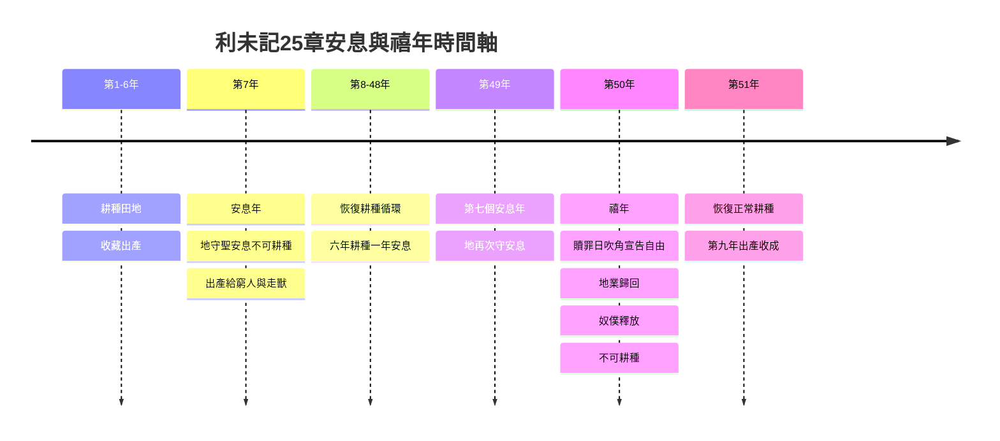

# 利未記 第25章

1. [[摩西|耶和華在西乃山對摩西說]]：
2. 你曉諭以色列人說：你們到了我所賜你們那地的時候，[[安息年律例|地就要向耶和華守安息]]。
3. [[安息年|六年要耕種田地，也要修理葡萄園，收藏地的出產]]。
4. [[安息年律例|第七年，地要守聖安息，就是向耶和華守的安息]]，不可耕種田地，也不可修理葡萄園。
5. 遺落自長的莊稼不可收割；沒有修理的葡萄樹也不可摘取葡萄。這年，地要守聖安息。
6. [[安息年律例|地在安息年所出的，要給你和你的僕人、婢女、雇工人，並寄居的外人當食物]]。
7. 這年的土產也要給你的牲畜和你地上的走獸當食物。
8. [[禧年（yovel，第五十年）|你要計算七個安息年，就是七七年]]。這便為你成了七個安息年，共是四十九年。
9. 當年七月初十日，你要大發角聲；這日就是贖罪日，要在遍地發出角聲。
10. 第五十年，你們要當作聖年，[[禧年宣告自由與地業歸還|在遍地給一切的居民宣告自由]]。[[禧年（yovel，第五十年）|這年必為你們的禧年]]，[[禧年宣告自由與地業歸還|各人要歸自己的產業，各歸本家]]。
11. 第五十年要作為你們的[[禧年（yovel，第五十年）|禧年]]。這年不可耕種；地中自長的，不可收割；沒有修理的葡萄樹也不可摘取葡萄。
12. 因為這是[[禧年（yovel，第五十年）|禧年]]，你們要當作聖年，吃地中自出的土產。
13. 這[[禧年（yovel，第五十年）|禧年]]，你們各人要歸自己的地業。
14. 你若賣什麼給鄰舍，或是從鄰舍的手中買什麼，彼此不可虧負。
15. [[禧年土地贖回計算法（按距禧年年數定價）|你要按禧年以後的年數向鄰舍買；他也要按年數的收成賣給你]]。
16. 年歲若多，要照數加添價值；年歲若少，要照數減去價值，因為他照收成的數目賣給你。
17. 你們彼此不可虧負，只要敬畏你們的神，因為我是耶和華─你們的神。
18. 我的律例，你們要遵行，我的典章，你們要謹守，就可以在那地上安然居住。
19. 地必出土產，你們就要吃飽，在那地上安然居住。
20. 你們若說：[[第六年三倍出產的應許（信心試驗）|這第七年我們不耕種，也不收藏土產，吃什麼呢]]？
21. [[第六年三倍出產的應許（信心試驗）|我必在第六年將我所命的福賜給你們，地便生三年的土產]]。
22. 第八年，你們要耕種，也要吃陳糧，等到第九年出產收來的時候，你們還吃陳糧。
23. [[地不可永賣（地權屬神）|地不可永賣，因為地是我的；你們在我面前是客旅，是寄居的]]。
24. 在你們所得為業的全地，也要准人將地[[救贖goel|贖回]]。
25. 你的弟兄（弟兄是指本國人說；下同）若漸漸窮乏，賣了幾分地業，[[救贖goel|他至近的親屬就要來把弟兄所賣的贖回]]。
26. 若沒有能給他[[救贖goel|贖回]]的，他自己漸漸富足，能夠贖回，
27. [[禧年土地贖回計算法（按距禧年年數定價）|就要算出賣地的年數，把餘剩年數的價值還那買主，自己便歸回自己的地業]]。
28. 倘若不能為自己得回所賣的，仍要存在買主的手裡直到[[禧年（yovel，第五十年）|禧年]]；到了禧年，地業要出買主的手，自己便歸回自己的地業。
29. [[城內住宅與鄉間房屋贖回條例的差異|人若賣城內的住宅，賣了以後，一年之內可以贖回]]；在一整年，必有贖回的權柄。
30. 若在一整年之內不[[救贖goel|贖回]]，這城內的房屋就定準永歸買主，世世代代為業；在[[禧年（yovel，第五十年）|禧年]]也不得出買主的手。
31. [[城內住宅與鄉間房屋贖回條例的差異|但房屋在無城牆的村莊裡，要看如鄉下的田地一樣，可以贖回]]；到了[[禧年（yovel，第五十年）|禧年]]，都要出買主的手。
32. [[利未人城邑房屋隨時贖回|然而利未人所得為業的城邑，其中的房屋，利未人可以隨時贖回]]。
33. 若是一個利未人不將所賣的房屋[[救贖goel|贖回]]，是在所得為業的城內，到了[[禧年（yovel，第五十年）|禧年]]就要出買主的手，因為利未人城邑的房屋是他們在以色列人中的產業。
34. [[利未人城邑房屋隨時贖回|只是他們各城郊野之地不可賣，因為是他們永遠的產業]]。
35. 你的弟兄在你那裡若漸漸貧窮，手中缺乏，你就要幫補他，使他與你同住，像外人和寄居的一樣。
36. [[取利（neshek）|不可向他取利，也不可向他多要]]；只要敬畏你的神，使你的弟兄與你同住。
37. [[取利（neshek）|你借錢給他，不可向他取利]]；借糧給他，也不可向他多要。
38. 我是耶和華─你們的神，曾領你們從埃及地出來，為要把迦南地賜給你們，要作你們的神。
39. 你的弟兄若在你那裡漸漸窮乏，將自己賣給你，[[弟兄賣身為奴不可像奴僕看待|不可叫他像奴僕服事你]]。
40. 他要在你那裡像雇工人和寄居的一樣，要服事你直到[[禧年（yovel，第五十年）|禧年]]。
41. 到了[[禧年（yovel，第五十年）|禧年]]，他和他兒女要離開你，一同出去歸回本家，到他祖宗的地業那裡去。
42. [[弟兄賣身為奴不可像奴僕看待|因為他們是我的僕人，是我從埃及地領出來的，不可賣為奴僕]]。
43. 不可嚴嚴地轄管他，只要敬畏你的神。
44. [[弟兄賣身為奴不可像奴僕看待|至於你的奴僕、婢女，可以從你四圍的國中買]]。
45. 並且那寄居在你們中間的外人和他們的家屬，在你們地上所生的，你們也可以從其中買人；他們要作你們的產業。
46. 你們要將他們遺留給你們的子孫為產業，要永遠從他們中間揀出奴僕；只是你們的弟兄以色列人，你們不可嚴嚴地轄管。
47. 住在你那裡的外人，或是寄居的，若漸漸富足，[[以色列人賣給外人的贖回條例|你的弟兄卻漸漸窮乏，將自己賣給那外人]]，或是寄居的，或是外人的宗族，
48. [[救贖goel|賣了以後，可以將他贖回]]。無論是他的弟兄，
49. 或伯叔、伯叔的兒子，本家的近支，都可以贖他。他自己若漸漸富足，也可以自贖。
50. 他要和買主計算，從賣自己的那年起，算到[[禧年（yovel，第五十年）|禧年]]；所賣的價值照著年數多少，好像工人每年的工價。
51. 若缺少的年數多，就要按著年數從買價中償還他的贖價。
52. 若到[[禧年（yovel，第五十年）|禧年]]只缺少幾年，就要按著年數和買主計算，償還他的贖價。
53. 他和買主同住，要像每年雇的工人，買主不可嚴嚴地轄管他。
54. [[以色列人賣給外人的贖回條例|他若不這樣被贖，到了禧年，要和他的兒女一同出去]]。
55. 因為以色列人都是我的僕人，是我從埃及地領出來的。我是耶和華─你們的神。

---

## 本章知識節點

### 主題
- [[安息年律例]]
- [[禧年宣告自由與地業歸還]]
- [[地不可永賣（地權屬神）]]
- [[禧年土地贖回計算法（按距禧年年數定價）]]
- [[城內住宅與鄉間房屋贖回條例的差異]]
- [[利未人城邑房屋隨時贖回]]
- [[弟兄賣身為奴不可像奴僕看待]]
- [[以色列人賣給外人的贖回條例]]
- [[第六年三倍出產的應許（信心試驗）]]

### 事件
- [[安息年]]
- [[古代近東安息年]]
- [[出23：10-11安息年執行]]

### 人物
- [[摩西]]

### 原文
- [[禧年（yovel，第五十年）]]
- [[取利（neshek）]]

### 神學
- [[救贖goel]]

---

## 本章整理

### 安息年——地向耶和華守安息（v1-7）

利未記第二十五章延續了第二十三章關於節期與聖時間的脈絡，但將焦點從「日」延伸到了「年」。神在西乃山對[[摩西]]曉諭，當以色列人進入迦南地後，地本身必須每七年向耶和華守一次[[安息年律例|安息年]]。在這六年中，百姓可以耕種田地、修理葡萄園並收藏出產；但到了第七年，地必須守聖安息，不可耕種也不可修剪。遺落自長的莊稼與未經修理的葡萄樹所結的果實，地主不可專為自己收割，這些自然生長的土產要給僕人、婢女、雇工人、寄居的外人，甚至牲畜和地上的走獸當食物。

這條律例背後蘊含著深厚的神學與社會意義。CT指出，「地向神守安息」表明安息日是為人，安息年是為地，但最終仍是為了人——只有地得安息，人才能得真正的安息；當地安息不長東西時，人才不再汗流滿面。這是一個「純然恩典，絕對停止人的作為」的時刻。GT的《精讀本》進一步補充，安息年的出產不能據為個人所有，這是全體以色列人的共同財產，特別是窮人的財產，藉此教導百姓共同分享、同甘共苦。BH則從農業與歷史背景指出，讓土地休耕能減低鹽漬化速度，避免土壤養分耗盡，這與美索不達米亞的耕作循環有異曲同工之妙。

### 禧年——宣告自由與贖回的循環（v8-22）

當七個安息年（共四十九年）計算完畢，緊接著的第五十年就是[[禧年（yovel，第五十年）|禧年]]。在當年七月初十日——也就是贖罪日，要在遍地發出角聲，宣告自由。這年有兩大核心特徵：一是各人要歸自己的產業，各歸本家；二是地同樣不可耕種，只能吃地中自出的土產。

[[禧年宣告自由與地業歸還|禧年的宣告]]不僅是社會制度的重置，更具有深刻的預表意義。CT認為，第五十年（五旬年）是完全責任的數字，表徵神的要求完全得著滿足，一切責任卸除，人大得自由。遍地大發角聲宣告自由，預表了恩典時代主耶穌成功救恩後，聖靈藉使徒宣告神的要求已得滿足。KC則將禧年與千年國度連結，指出安息年說的是「安息」，而禧年說的是「恢復」與「自由」，正如彼得在所羅門廊下所傳講的「萬物復興的時候」（徒三21）。

然而，連續兩年（第四十九年安息年與第五十年禧年）不耕種，自然引發百姓對生計的擔憂。神在v20-22預先解答了這個[[第六年三倍出產的應許（信心試驗）|信心試驗]]。神應許必在第六年賜下三年的土產，使百姓在第八年耕種時仍吃陳糧，直到第九年出產收來。CT稱此為「神所命的福」，表徵神的賜福綽綽有餘；BH也指出，這三年的供應是神能力的明證，確保百姓在停止農業活動的期間不致缺乏。

### 地權屬神與不動產贖回條例（v23-34）

禧年制度的根基在於一個核心宣告：「[[地不可永賣（地權屬神）|地不可永賣，因為地是我的]]」。以色列人在神面前不過是客旅和寄居的，這意味著他們只是神土地的管家，而非絕對的所有權人。GT的《精讀本》指出，這條例讓人清楚知道神的主權和公義，也讓人認識到自己的管家身分。

基於地權屬神，神設立了[[禧年土地贖回計算法（按距禧年年數定價）|土地贖回的計算法]]。買賣雙方不可彼此虧負，價格必須按距離下一次禧年的年數計算——年歲多則加添價值，年歲少則減去價值。若弟兄窮乏賣地，至近的親屬（[[救贖goel|goel]]）有責任代贖；若無親屬代贖，本人富足後也可自贖；若始終無力贖回，到了禧年地業必無償歸回原主。

在房屋贖回方面，律法展現了[[城內住宅與鄉間房屋贖回條例的差異|城鄉差異]]。有城牆城內的住宅，賣後一年內可贖回，若逾期不贖則永歸買主，連禧年也不得出買主的手。但無城牆村莊的房屋視如鄉下田地，可隨時贖回，禧年時也要出買主的手。對於沒有地業的利未人，律法給予特別保障：[[利未人城邑房屋隨時贖回|利未人城邑的房屋可隨時贖回]]，即便不贖回，禧年時也要歸回；而他們各城郊野之地更是不可賣的永遠產業。

CT對此提出了嚴肅的靈意解經：城內房屋表徵教會，神在教會見證的恢復上只給「一年」的限期，若不悔改回轉，燈台就有被挪去的可能；而無城牆村莊的房屋表徵開放自由的團契，在享受基督的事上神給予較寬的空間。

### 對待貧窮弟兄與奴僕的條例（v35-55）

本章後半段將焦點轉向社會中最弱勢的群體。若弟兄漸漸貧窮，百姓有責任幫補他，使他同住像外人一樣。借錢或借糧給窮乏的弟兄時，必須遵守不可取利的禁令，不可向他取[[取利（neshek）|利]]或多要。GT的《丁良才註釋》強調，這條例是出於敬畏神的心，因為神曾領以色列人出埃及，蒙憐憫的人也當發憐憫的心。

若弟兄窮乏到需要賣身，律法規定[[弟兄賣身為奴不可像奴僕看待|不可叫他像奴僕服事]]，必須待他如雇工人，到了禧年就要讓他和兒女自由離開，歸回本家。因為以色列人都是神的僕人，是神從埃及領出來的，不可賣為奴僕，也不可嚴嚴轄管。至於外邦奴僕，則可以從四圍的國中買來作為產業遺留給子孫。

最後，律法處理了[[以色列人賣給外人的贖回條例|以色列人賣給外邦人的特殊情況]]。若以色列人因窮乏賣給寄居的外人，他的弟兄、伯叔或本家近支都有權贖他，他自己若富足也可自贖。贖價同樣按距禧年的年數計算。CT指出，這表徵主內的弟兄可能因靈性貧窮軟弱而流落世界，身邊的弟兄應設法將他從世界中挽救回來；KC則將此與耶穌基督的救贖連結——主耶穌是真正的至近親屬，祂將贖回那些屬於祂的弟兄脫離仇敵的手。

> [!quote] CT 靈訓要義摘錄
> 「地不可永賣，因為地是我的。…在你們所得為業的全地，也要准人將地贖回」——表徵每個人從神所得屬靈的產業，是平等且永遠的。無論如何，神所賜屬靈的產業，是永遠屬於我們的。

### 跨章脈絡：安息、救贖與國度

利未記二十五章的安息年與禧年制度，並非孤立的農業法規，而是貫穿聖經救贖歷史的重要軸線。從創世記中神在第七天的安息，到出埃及記二十三10-11的[[出23：10-11安息年執行|安息年執行]]，再到利未記的禧年，神逐步揭示祂對受造之物終極的計畫。

禧年的概念在先知書中被進一步發展。以賽亞書六十一章預言了「耶和華的恩年」與「報仇的日子」，而當耶穌在路加福音四章18-19節宣讀這段經文並宣告「今天這經應驗了」時，祂實質上宣告了屬靈禧年的到來。KC指出，對所有接受主耶穌的人而言，這「悅納的年份」已經開始；而對以色列人與全地而言，最終的禧年將在主再來、萬物復興的千年國度中完全實現。本章的律例不僅是古代以色列的社會保障制度，更是神救贖計畫的縮影——藉著安息彰顯神的供應，藉著贖回彰顯神的恩典，藉著宣告自由預表基督裡終極的釋放。

**參考資料**
https://www.ccbiblestudy.org/Old%20Testament/03Lev/03CT25.htm
https://www.ccbiblestudy.org/Old%20Testament/03Lev/03GT25.htm
https://www.kingcomments.com/en/bible-studies/Lev/25
https://biblehub.com/study/leviticus/25.htm
