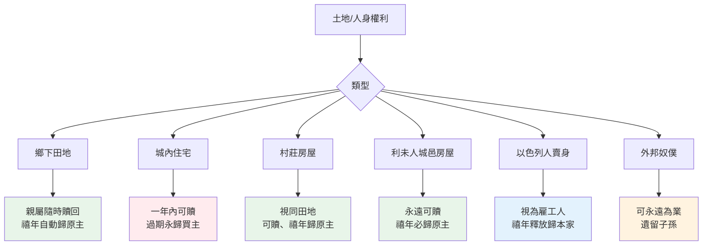

# 利未記 第25章

1. [[摩西|耶和華在西乃山對摩西說]]：
2. 你曉諭[[以色列|以色列人]]說：[[以色列|你們]]到了[[迦南地|我所賜你們那地]]的時候，地就要向耶和華守安息。
3. 六年要耕種田地，也要修理葡萄園，收藏地的出產。
4. 第七年，地要守聖安息，就是向耶和華守的安息，不可耕種田地，也不可修理葡萄園。
5. [[安息年條例|遺落自長的莊稼不可收割]]；沒有修理的葡萄樹也不可摘取葡萄。這年，地要守聖安息。
6. [[安息年條例|地在安息年所出的]]，要給你和你的僕人、婢女、[[雇工人]]，並[[寄居的（ger）|寄居的外人]]當食物。
7. 這年的土產也要給你的牲畜和你地上的走獸當食物。
8. 你要計算七個安息年，就是七七年。這便為你成了七個安息年，共是[[禧年條例|四十九年]]。
9. 當年七月初十日，你要[[禧年條例|大發角聲]]；這日就是[[禧年條例|贖罪日]]，要在遍地發出角聲。
10. 第五十年，[[以色列|你們]]要當作[[至聖|聖年]]，[[宣告自由|在遍地給一切的居民宣告自由]]。這年必為你們的禧年，各人要歸自己的[[產業（nachalah）|產業]]，各歸[[宗族|本家]]。
11. 第五十年要作為[[以色列|你們]]的禧年。這年不可耕種；地中自長的，不可收割；沒有修理的葡萄樹也不可摘取葡萄。
12. 因為這是禧年，[[以色列|你們]]要當作[[至聖|聖年]]，吃地中自出的土產。
13. 這禧年，[[以色列|你們]]各人要歸自己的[[產業（nachalah）|地業]]。
14. 你若賣什麼給鄰舍，或是從鄰舍的手中買什麼，[[虧負|彼此不可虧負]]。
15. 你要按禧年以後的年數向鄰舍買；他也要按年數的收成賣給你。
16. 年歲若多，要照數加添價值；年歲若少，要照數減去價值，因為他照收成的數目賣給你。
17. [[以色列|你們]][[虧負|彼此不可虧負]]，只要[[敬畏神|敬畏你們的神]]，因為[[我是耶和華你們的神|我是耶和華─你們的神]]。
18. [[律例|我的律例]]，[[以色列|你們]]要[[律例|遵行]]，我的[[典章]]，你們要謹守，就可以在那地上[[安然居住]]。
19. [[安然居住|地必出土產]]，[[以色列|你們]]就要[[安然居住|吃飽]]，在那地上[[安然居住]]。
20. [[以色列|你們]]若說：這第七年我們不耕種，也不收藏土產，吃什麼呢？
21. 我必在[[三年土產|第六年]]將我所命的福賜給[[以色列|你們]]，地便生[[三年土產|三年的土產]]。
22. [[三年土產|第八年]]，[[以色列|你們]]要耕種，也要吃[[三年土產|陳糧]]，等到[[三年土產|第九年]]出產收來的時候，你們還吃陳糧。
23. 地不可永賣，[[地不可永賣|因為地是我的]]；[[地不可永賣|你們在我面前是客旅]]，[[地不可永賣|是寄居的]]。
24. 在[[以色列|你們]]所得為業的全地，也要准人將地贖回。
25. [[兄弟|你的弟兄]]（弟兄是指本國人說；下同）若[[貧窮|漸漸窮乏]]，賣了幾分[[產業（nachalah）|地業]]，他至近的親屬就要來把[[至近的親屬贖回地業|弟兄所賣的贖回]]。
26. 若沒有能給他贖回的，他[[自贖|自己漸漸富足]]，[[自贖|能夠贖回]]，
27. 就要算出賣地的年數，把餘剩年數的價值還那買主，自己便歸回自己的[[產業（nachalah）|地業]]。
28. 倘若不能為自己得回所賣的，仍要存在買主的手裡直到禧年；[[自贖|到了禧年]]，[[產業（nachalah）|地業]]要出買主的手，自己便歸回自己的地業。
29. 人若賣[[城內住宅贖回權|城內的住宅]]，賣了以後，[[城內住宅贖回權|一年之內可以贖回]]；在一整年，必有[[城內住宅贖回權|贖回的權柄]]。
30. 若在一整年之內不贖回，這城內的房屋就定準[[城內住宅贖回權|永歸買主]]，[[城內住宅贖回權|世世代代為業]]；在禧年也不得出買主的手。
31. 但房屋在[[無城牆村莊房屋如田地|無城牆的村莊]]裡，要[[無城牆村莊房屋如田地|看如鄉下的田地]]一樣，[[無城牆村莊房屋如田地|可以贖回]]；[[自贖|到了禧年]]，都要出買主的手。
32. 然而利未人所得為業的城邑，其中的房屋，[[利未人城邑房屋永遠可贖回|利未人可以隨時贖回]]。
33. 若是一個利未人不將所賣的房屋贖回，是在所得為業的城內，[[利未人城邑房屋永遠可贖回|到了禧年就要出買主的手]]，因為[[利未人|利未人城邑的房屋]]是他們在[[以色列|以色列人]]中的[[產業（nachalah）|產業]]。
34. 只是他們各城[[利未人城邑房屋永遠可贖回|郊野之地不可賣]]，因為是他們永遠的[[產業（nachalah）|產業]]。
35. [[兄弟|你的弟兄]]在你那裡若[[貧窮|漸漸貧窮]]，[[貧窮|手中缺乏]]，你就要[[幫補窮乏弟兄不可取利|幫補他]]，使他與你同住，像[[外人]]和[[寄居的（ger）|寄居的]]一樣。
36. [[幫補窮乏弟兄不可取利|不可向他取利]]，也[[幫補窮乏弟兄不可取利|不可向他多要]]；只要敬畏你的神，使[[兄弟|你的弟兄]]與你同住。
37. 你借錢給他，[[幫補窮乏弟兄不可取利|不可向他取利]]；借糧給他，也[[幫補窮乏弟兄不可取利|不可向他多要]]。
38. [[我是耶和華你們的神|我是耶和華─你們的神]]，[[埃及地|曾領你們從埃及地出來]]，為要把[[迦南地]]賜給你們，要作你們的神。
39. [[兄弟|你的弟兄]]若在你那裡[[貧窮|漸漸窮乏]]，[[弟兄賣身為雇工人直到禧年|將自己賣給你]]，[[弟兄賣身為雇工人直到禧年|不可叫他像奴僕服事你]]。
40. 他要在你那裡像[[雇工人]]和[[寄居的（ger）|寄居的]]一樣，要[[弟兄賣身為雇工人直到禧年|服事你直到禧年]]。
41. [[自贖|到了禧年]]，[[兒女|他和他兒女]]要離開你，[[歸回本家|一同出去歸回本家]]，到他[[祖宗的地業]]那裡去。
42. [[弟兄賣身為雇工人直到禧年|因為他們是我的僕人]]，[[埃及地|是我從埃及地領出來的]]，[[弟兄賣身為雇工人直到禧年|不可賣為奴僕]]。
43. [[弟兄賣身為雇工人直到禧年|不可嚴嚴地轄管他]]，只要敬畏你的神。
44. 至於你的奴僕、婢女，可以從你[[外人|四圍的國中]]買。
45. 並且那寄居在[[以色列|你們]]中間的[[外人]]和他們的家屬，在你們地上所生的，你們也可以從其中買人；[[外邦奴僕可永遠為業|他們要作你們的產業]]。
46. [[以色列|你們]]要將他們[[外邦奴僕可永遠為業|遺留給你們的子孫為產業]]，要[[外邦奴僕可永遠為業|永遠從他們中間揀出奴僕]]；只是你們的[[兄弟|弟兄]][[以色列|以色列人]]，你們不可嚴嚴地轄管。
47. 住在你那裡的[[外人]]，[[寄居的（ger）|或是寄居的]]，若漸漸富足，[[兄弟|你的弟兄]]卻[[貧窮|漸漸窮乏]]，[[以色列人賣給外人可被贖回|將自己賣給那外人]]，或是寄居的，或是[[宗族|外人的宗族]]，
48. 賣了以後，[[以色列人賣給外人可被贖回|可以將他贖回]]。無論是他的[[兄弟|弟兄]]，
49. 或伯叔、伯叔的兒子，[[宗族|本家]]的[[宗族|近支]]，都可以贖他。他自己若漸漸富足，也可以自贖。
50. 他要[[以色列人賣給外人可被贖回|和買主計算]]，從賣自己的那年起，算到禧年；所賣的價值照著年數多少，好像[[雇工人|工人每年的工價]]。
51. 若缺少的年數多，就要按著年數從買價中償還他的贖價。
52. 若到禧年只缺少幾年，就要按著年數[[以色列人賣給外人可被贖回|和買主計算]]，償還他的贖價。
53. 他和買主同住，要像每年雇的工人，[[以色列人賣給外人可被贖回|買主不可嚴嚴地轄管他]]。
54. 他若[[自贖|不這樣被贖]]，[[自贖|到了禧年]]，要和他的[[兒女]][[兒女|一同出去]]。
55. 因為[[以色列人賣給外人可被贖回|以色列人都是我的僕人]]，[[埃及地|是我從埃及地領出來的]]。[[我是耶和華你們的神|我是耶和華─你們的神]]。

---

## 本章知識節點

### 神學
- [[安息年條例]]
- [[禧年條例]]
- [[地不可永賣]]
- [[至近的親屬贖回地業]]
- [[城內住宅贖回權]]
- [[無城牆村莊房屋如田地]]
- [[利未人城邑房屋永遠可贖回]]
- [[幫補窮乏弟兄不可取利]]
- [[弟兄賣身為雇工人直到禧年]]
- [[外邦奴僕可永遠為業]]
- [[以色列人賣給外人可被贖回]]

### 核心概念
- [[禧年（yobel）]]
- [[產業（nachalah）]]
- [[至近的親屬（goel）]]
- [[利未人]]
- [[虧負]]
- [[宣告自由]]
- [[歸回本家]]
- [[安然居住]]
- [[三年土產]]
- [[兄弟]]
- [[貧窮]]
- [[宗族]]
- [[自贖]]
- [[兒女]]
- [[祖宗的地業]]
- [[我是耶和華你們的神]]

---

## 本章整理

### 安息年：地向耶和華守聖安息（v1-7）
耶和華在[[摩西]]面前吩咐，當以色列人進入[[迦南地]]，地要每七年向耶和華守一次==安息年==。六年耕種收藏，第七年不可耕種田地、修理葡萄園，也不可收割自長的莊稼、摘取未修理葡萄樹的果子。這年的土產要給主人、僕人、婢女、[[雇工人]]、[[寄居的（ger）|寄居的]]與[[外人]]，甚至牲畜走獸當食物。這制度宣示：土地真正的主人是神，人只不過是客旅、寄居的（v23）。

### 禧年：第五十年宣告自由、歸回產業（v8-13）
七個安息年（四十九年）後，第七月初十日大發角聲，第五十年定為==禧年==。這年同樣不耕種、不收割自長莊稼，卻有獨特功能：在遍地給一切居民[[宣告自由]]，各人歸自己的[[產業（nachalah）|產業]]、[[歸回本家]]。禧年將時間、土地、身份三重歸零重置，是神對以色列社會經濟結構的根本保護機制。

### 土地交易與贖回條例（v14-34）
土地買賣實質是「按禧年後年數買收成年限」（v15-16），年數多價高、少價低，彼此不可[[虧負]]，要[[敬畏神]]。核心原則：**[[地不可永賣]]**，因地屬神（v23）。贖回機制分四類：
- **鄉下田地**：[[至近的親屬（goel）|至近的親屬]]可隨時贖回；無人贖則禧年自動歸原主（v25-28）。
- **有城牆城市住宅**：買後一年內可贖（[[城內住宅贖回權]]），過期永歸買主，禧年不出（v29-30）。
- **無城牆村莊房屋**：視同鄉下田地（[[無城牆村莊房屋如田地]]），可贖、禧年出（v31）。
- **[[利未人]]城邑房屋**：永遠可贖（[[利未人城邑房屋永遠可贖回]]），禧年必出；城郊田地不可賣，是永遠產業（v32-34）。

> [!note] 房屋贖回規則對照
> | 房屋類型 | 贖回期限 | 禧年歸屬 |
> |---|---|---|
> | 城內住宅 | 一年內 | 永歸買主 |
> | 村莊房屋 | 隨時 | 歸原主 |
> | 利未人城邑房屋 | 永遠可贖 | 歸原主 |

### 窮乏弟兄的保護：不可取利、不可視為奴僕（v35-43）
弟兄[[貧窮]]手中缺乏，要幫補他像[[外人]]和寄居的一樣與你同住（**[[幫補窮乏弟兄不可取利]]**），**不可向他取利、也不可多要**（v36-37），因為[[我是耶和華你們的神]]，曾領你們出[[埃及地]]。若弟兄賣身給你（**[[弟兄賣身為雇工人直到禧年]]**），**不可叫他像奴僕服事**，要像[[雇工人]]和寄居的，服事到禧年，然後帶兒女[[歸回本家]]、回[[祖宗的地業]]（v39-41）。理由明確：他們是神的僕人，神從埃及領出來的，**不可賣為奴僕**（v42），不可嚴嚴轄管（v43）。

### 外邦奴僕與以色列人賣給外人的贖回（v44-55）
奴僕婢女可從四圍列國買，並可遺留給子孫為永遠產業（v44-46）──這是**[[外邦奴僕可永遠為業]]**的依據。但以色列人若賣給住在境內的外人/寄居者（**[[以色列人賣給外人可被贖回]]**），仍保有贖回權：[[至近的親屬（goel）|伯叔、伯叔兒子、本家近支]]均可贖，或自己[[自贖]]（v47-49）。贖價按「從賣身年起算到禧年」的年數、像雇工人年薪計算（v50-52）。若不被贖，禧年必和[[兒女]]一同出去（v54）。章末再次宣告：==以色列人都是我的僕人==，是我從埃及領出來的（v55）。

### 跨章脈絡：安息─禧年體系的神學架構
利未記 25 章將「時間聖化」（安息日→安息年→禧年）、「空間聖化」（地屬神→產業不可永賣）、「身份聖化」（以色列人屬神→不可為奴）三重維度整合。[[安息年條例]]預表神供應的[[三年土產]]（v21），[[禧年條例]]則是終極救贖圖景：[[宣告自由]]、[[歸回本家]]、[[安然居住]]。[[至近的親屬（goel）|Goel]] 贖回制度預表基督作我們的大贖主；「不可取利」保護[[兄弟]]不致陷入代代貧窮；[[利未人]]產業特例顯示祭司支派完全倚靠神。全章核心宣告——「我是耶和華你們的神」——出現四次（v17, 38, 43, 55），為一切條例的終極依歸。

**參考資料**
https://www.ccbiblestudy.org/Old%20Testament/03Lev/03CT25.htm
https://www.ccbiblestudy.org/Old%20Testament/03Lev/03GT25.htm
https://www.kingcomments.com/en/bible-studies/Lev/25
https://biblehub.com/study/leviticus/25.htm
