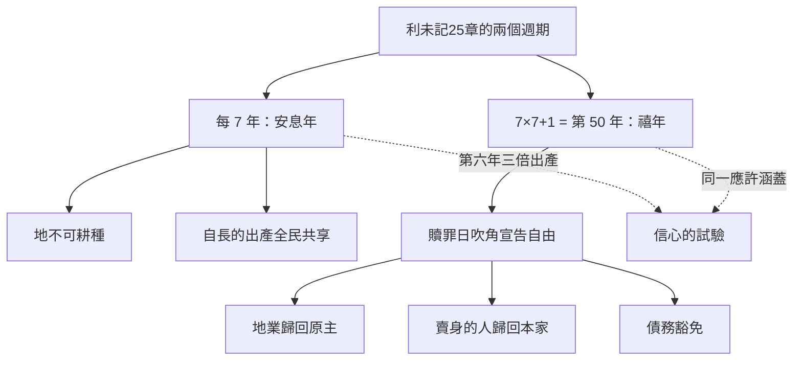

# 利未記 第25章

<!-- chapter-navigation:start -->
| [前一章](../03%20利未記/第24章.md) | [回目錄](../03%20利未記/全書目錄及綱要.md) | [下一章](../03%20利未記/第26章.md) |
| :--- | :---: | ---: |
<!-- chapter-navigation:end -->

1. [[摩西|耶和華在西乃山對摩西說]]：
2. 你曉諭以色列人說：你們到了我所賜你們那地的時候，[[安息年律例|地就要向耶和華守安息]]。
3. [[安息年|六年要耕種田地，也要修理葡萄園，收藏地的出產]]。
4. [[安息年律例|第七年，地要守聖安息，就是向耶和華守的安息]]，不可耕種田地，也不可修理葡萄園。
5. 遺落自長的莊稼不可收割；沒有修理的葡萄樹也不可摘取葡萄。這年，地要守聖安息。
6. [[安息年律例|地在安息年所出的，要給你和你的僕人、婢女、雇工人，並寄居的外人當食物]]。
7. 這年的土產也要給你的牲畜和你地上的走獸當食物。
8. [[禧年（第五十年）|你要計算七個安息年，就是七七年]]。這便為你成了七個安息年，共是四十九年。
9. 當年七月初十日，你要大發角聲；這日就是贖罪日，要在遍地發出角聲。
10. 第五十年，你們要當作聖年，[[禧年宣告自由與地業歸還|在遍地給一切的居民宣告自由]]。[[禧年（第五十年）|這年必為你們的禧年]]，[[禧年宣告自由與地業歸還|各人要歸自己的產業，各歸本家]]。
11. 第五十年要作為你們的[[禧年（第五十年）|禧年]]。這年不可耕種；地中自長的，不可收割；沒有修理的葡萄樹也不可摘取葡萄。
12. 因為這是[[禧年（第五十年）|禧年]]，你們要當作聖年，吃地中自出的土產。
13. 這[[禧年（第五十年）|禧年]]，你們各人要歸自己的地業。
14. 你若賣什麼給鄰舍，或是從鄰舍的手中買什麼，彼此不可虧負。
15. [[禧年土地贖回計算法（按距禧年年數定價）|你要按禧年以後的年數向鄰舍買；他也要按年數的收成賣給你]]。
16. 年歲若多，要照數加添價值；年歲若少，要照數減去價值，因為他照收成的數目賣給你。
17. 你們彼此不可虧負，只要敬畏你們的神，因為我是耶和華─你們的神。
18. 我的律例，你們要遵行，我的典章，你們要謹守，就可以在那地上安然居住。
19. 地必出土產，你們就要吃飽，在那地上安然居住。
20. 你們若說：[[第六年三倍出產的應許（信心試驗）|這第七年我們不耕種，也不收藏土產，吃什麼呢]]？
21. [[第六年三倍出產的應許（信心試驗）|我必在第六年將我所命的福賜給你們，地便生三年的土產]]。
22. 第八年，你們要耕種，也要吃陳糧，等到第九年出產收來的時候，你們還吃陳糧。
23. [[地不可永賣（地權屬神）|地不可永賣，因為地是我的；你們在我面前是客旅，是寄居的]]。
24. 在你們所得為業的全地，也要准人將地[[救贖goel|贖回]]。
25. 你的弟兄（弟兄是指本國人說；下同）若漸漸窮乏，賣了幾分地業，[[救贖goel|他至近的親屬就要來把弟兄所賣的贖回]]。
26. 若沒有能給他[[救贖goel|贖回]]的，他自己漸漸富足，能夠贖回，
27. [[禧年土地贖回計算法（按距禧年年數定價）|就要算出賣地的年數，把餘剩年數的價值還那買主，自己便歸回自己的地業]]。
28. 倘若不能為自己得回所賣的，仍要存在買主的手裡直到[[禧年（第五十年）|禧年]]；到了禧年，地業要出買主的手，自己便歸回自己的地業。
29. [[城內住宅與鄉間房屋贖回條例的差異|人若賣城內的住宅，賣了以後，一年之內可以贖回]]；在一整年，必有贖回的權柄。
30. 若在一整年之內不[[救贖goel|贖回]]，這城內的房屋就定準永歸買主，世世代代為業；在[[禧年（第五十年）|禧年]]也不得出買主的手。
31. [[城內住宅與鄉間房屋贖回條例的差異|但房屋在無城牆的村莊裡，要看如鄉下的田地一樣，可以贖回]]；到了[[禧年（第五十年）|禧年]]，都要出買主的手。
32. [[利未人城邑房屋隨時贖回|然而利未人所得為業的城邑，其中的房屋，利未人可以隨時贖回]]。
33. 若是一個利未人不將所賣的房屋[[救贖goel|贖回]]，是在所得為業的城內，到了[[禧年（第五十年）|禧年]]就要出買主的手，因為利未人城邑的房屋是他們在以色列人中的產業。
34. [[利未人城邑房屋隨時贖回|只是他們各城郊野之地不可賣，因為是他們永遠的產業]]。
35. 你的弟兄在你那裡若漸漸貧窮，手中缺乏，你就要幫補他，使他與你同住，像外人和寄居的一樣。
36. [[取利|不可向他取利，也不可向他多要]]；只要敬畏你的神，使你的弟兄與你同住。
37. [[取利|你借錢給他，不可向他取利]]；借糧給他，也不可向他多要。
38. 我是耶和華─你們的神，曾領你們從埃及地出來，為要把迦南地賜給你們，要作你們的神。
39. 你的弟兄若在你那裡漸漸窮乏，將自己賣給你，[[弟兄賣身為奴不可像奴僕看待|不可叫他像奴僕服事你]]。
40. 他要在你那裡像雇工人和寄居的一樣，要服事你直到[[禧年（第五十年）|禧年]]。
41. 到了[[禧年（第五十年）|禧年]]，他和他兒女要離開你，一同出去歸回本家，到他祖宗的地業那裡去。
42. [[弟兄賣身為奴不可像奴僕看待|因為他們是我的僕人，是我從埃及地領出來的，不可賣為奴僕]]。
43. 不可嚴嚴地轄管他，只要敬畏你的神。
44. [[弟兄賣身為奴不可像奴僕看待|至於你的奴僕、婢女，可以從你四圍的國中買]]。
45. 並且那寄居在你們中間的外人和他們的家屬，在你們地上所生的，你們也可以從其中買人；他們要作你們的產業。
46. 你們要將他們遺留給你們的子孫為產業，要永遠從他們中間揀出奴僕；只是你們的弟兄以色列人，你們不可嚴嚴地轄管。
47. 住在你那裡的外人，或是寄居的，若漸漸富足，[[以色列人賣給外人的贖回條例|你的弟兄卻漸漸窮乏，將自己賣給那外人]]，或是寄居的，或是外人的宗族，
48. [[救贖goel|賣了以後，可以將他贖回]]。無論是他的弟兄，
49. 或伯叔、伯叔的兒子，本家的近支，都可以贖他。他自己若漸漸富足，也可以自贖。
50. 他要和買主計算，從賣自己的那年起，算到[[禧年（第五十年）|禧年]]；所賣的價值照著年數多少，好像工人每年的工價。
51. 若缺少的年數多，就要按著年數從買價中償還他的贖價。
52. 若到[[禧年（第五十年）|禧年]]只缺少幾年，就要按著年數和買主計算，償還他的贖價。
53. 他和買主同住，要像每年雇的工人，買主不可嚴嚴地轄管他。
54. [[以色列人賣給外人的贖回條例|他若不這樣被贖，到了禧年，要和他的兒女一同出去]]。
55. 因為以色列人都是我的僕人，是我從埃及地領出來的。我是耶和華─你們的神。

---

## 本章知識節點

### 事件
- [[安息年律例]]

### 神學
- [[安息年]]
- [[救贖goel]]
- [[禧年宣告自由與地業歸還]]
- [[地不可永賣（地權屬神）]]
- [[第六年三倍出產的應許（信心試驗）]]

### 原文
- [[禧年（第五十年）]]
- [[取利]]

### 主題
- [[禧年土地贖回計算法（按距禧年年數定價）]]
- [[城內住宅與鄉間房屋贖回條例的差異]]
- [[利未人城邑房屋隨時贖回]]
- [[弟兄賣身為奴不可像奴僕看待]]
- [[以色列人賣給外人的贖回條例]]

### 背景
- [[古代近東安息年]]

### 解經爭議
- [[出23：10-11安息年執行]]
- [[出22：25取利禁令的範圍]]

### 人物
- [[摩西]]

---

## 本章整理

### 地也要守安息（v1-7）

利未記25章一開頭就標了地點：「耶和華在西乃山對摩西說」。KC 認為這個細節有意思——前面幾章神多半是從會幕裡說話，而安息年與禧年這一套是在西乃山說的，「就是祂向摩西顯明會幕的同一座山」，因為「百姓與地是連在一起的」。

[[安息年律例|六年耕種，第七年地要守聖安息]]。CT 把人與地的關係講反過來：「安息日是為人，安息年是為地，但仍舊是為人，只有地得安息，人才能得安息；若是地還長東西，人就汗流滿面，地安息才是人真正的安息。」

**這一年不是荒廢，而是共享。** 丁良才：地在安息年所出的，地主和僕婢、雇工、寄居的外人「大家都可食用，卻不可出賣，不可積攢，這樣行是要叫大家發生友誼，有彼此相顧的精神」。串珠指出這裡的規格比平常更寬——不像平常的餘穗只規定給寡婦和孤兒，而是「足夠供應每一個人實際的需要」。連牲畜和走獸都在名單上。

**丁良才另外澄清了一個容易誤解的地方**：原文沒有「耕」字。「神雖禁止以色列人種地，卻未必禁止他們耕地，恐怕野草亂長使地荒蕪」；而逢安息年和禧年，「眾人還是隨意養牲畜，修房屋，耍手藝，做買賣」。他並記下另一件事：安息年的住棚節，男女老幼並寄居的都要到會幕那裡聽祭司念律法（申31:10-12），「就顯明神不是要他們當安息年遊手好閒」。

GT《舊約聖經背景註釋》從農學角度補上實效：讓土地休息可以減低鹽漬化速度，而「土壤養分耗盡和鹽量高而成災，是美索不達米亞田地大幅丟空的原因」；[[古代近東安息年|烏加列文獻也提到七年的耕作循環]]。

### 第五十年：宣告自由（v8-17）

七個安息年之後是[[禧年（第五十年）|禧年]]。==STEP語言資料顯示這個字是 יוֹבֵל（yo.vel，詞典義 jubilee／horn）——同一個字既指這個年份，也指那支角==，而它在本章出現 14 次。BH 說明字源：「『Jubilee』這個詞來自希伯來文 yobel，意思是公羊角。」CT 的說法相同。

宣告的日子不是元旦，是七月初十的贖罪日。丁良才點出這個安排的分量：「禧年從大贖罪日起，是要顯明真實的豁免和自由必須本著贖罪。」GT 精讀本說法一致——先贖罪，恩典才臨到。

==v10 的「自由」在原文也是一個專門的字==：STEP語言資料顯示是 דְּרוֹר（de.ror，詞典義 liberty）。KC 指出這個觀念被以賽亞書61:1 直接引用，下一節就是「耶和華的恩年」。GT 啟導本因此把禧年的三個別名並列：「自由之年」（結46:17）、「救贖之年」（賽63:4）、「耶和華的恩年」（賽61:2）。

丁良才記下猶太人的傳說，讓這一天有了畫面：七月初一到初十這十天，「奴僕不供主人役使，只在主人家中身上帶著花圈吃喝快樂，到宣告禧年的時候，他們就各歸各家」；宣告時各人把角吹九下，宣告自己已經歸還了別人的產業、釋放了奴僕、豁免了一切的債、讓所有的地歇著了。

第五十年到底是哪一年，其實有兩派算法。丁良才並陳：一派認為第四十九年是安息年、第五十年才是禧年，兩年連著不能種地（「猶太人的傳說和約瑟夫的史記都以這解法為是」）；另一派認為第七個安息年本身就算禧年。他判定後者與 v18-22 的意思不合。

[[禧年土地贖回計算法（按距禧年年數定價）|土地買賣按距禧年的年數定價]]——年數多價高，年數少價低。丁良才點破這件事的實質：「賣地的人原非賣地，乃是賣這地到禧年之年數的出產。」KC 給了一個現代讀者好抓的角度：這套結算方式「防止了資本主義（財產越積越多）與共產主義（沒有財產，一切屬於所有人）」。

### 不撒種要吃什麼（v18-22）

神先把百姓心裡的話講了出來：「這第七年我們不耕種，也不收藏土產，吃什麼呢？」然後應許[[第六年三倍出產的應許（信心試驗）|第六年地生三年的土產]]。丁良才算清楚了那「三年」是第七年、第八年、第九年。

串珠說這是一場信心的試驗；KC 講得更直接：「一年不撒種看起來像冒險。理智會盤算：我們要吃什麼呢？信心卻倚靠神的應許。」丁良才把它連回嗎哪——神從前每逢安息日不降嗎哪，卻吩咐第六天加倍收取。

==丁良才另有一段話，把這條律例本身當成它出於神的證據==：「除非神吩咐，沒有首領或君王敢為自己的百姓定這出奇的律法……自古至今除了以色列人以外，再沒有一國有這樣的條例，叫百姓每七年停止務農一年，每五十年就一連停止兩年。這是顯明這條例不是出於摩西，乃是出於神。」

但這條律例並沒有被守住。丁良才：以色列人「將這條例廢棄了（利26:34-35、43），故此神就刑罰他們（代下36:20-21）」。KC 說得更白：「以色列從未慶祝過那些安息年，正如他們從未遵守過神的任何誡命。於是神藉著把百姓擄去，確保祂的地得著安息。」

### 地是我的（v23-38）

全章的地基是一句話：[[地不可永賣（地權屬神）|「地不可永賣，因為地是我的」]]。丁良才把關係說得最白：「神是地主，他們是佃戶。」他並指出這是禧年的第一個要訓，第二個是「以色列人都是耶和華的僕人」。

GT《舊約聖經背景註釋》把它放進古代近東的兩邊對照：一邊與埃及相仿——「擁有土地的『神聖』法老，把地授給子民」；另一邊卻與美索不達米亞的廟宇經濟相對立，那裡「個別公民、君王、各神的廟宇都擁有土地」，漢摩拉比法典中賞賜的土地在臣屬死後歸回君王。同一份註釋的結論是那種制度「與聖經背後的統一觀念並不相符」。這條律法連君王也不能違背——GT 啟導本與 KC 都舉拿伯的葡萄園（王上21:3-4）為例。

贖回有三條路：[[救贖goel|至近的親屬代贖]]、本人自贖、或等到禧年自動歸回。GT 啟導本說明「贖」字希伯來文是 goel，指一個人盡至近親屬本分時的幾種義務——替親屬贖身或贖田、娶無子嗣親屬的遺孀、為受害的親人報仇。丁良才在此處列出這位近親預表基督的四個要件：救主必須是至近的親屬、必須有救贖的能力、必須拿出滿足的贖價，而且贖的不只是人的身體也包括人的基業。KC 舉波阿斯與路得為實例，並指出波阿斯的名字意思是「在他裡面有力量」。

房屋則分兩類：[[城內住宅與鄉間房屋贖回條例的差異|有城牆的城內住宅只有一年贖回期]]，過期永歸買主、禧年也不歸還；無城牆村莊的房屋視同鄉下田地。串珠說明分野在於是否與土地耕耘相連；GT《舊約聖經背景註釋》給出埃施嫩納法律的平行條文——賣掉房屋的欠債者在房屋再次出售時有優先買回權。[[利未人城邑房屋隨時贖回|利未人另有例外]]，因為城中的房屋是他們唯一可居住的產業。

借貸的規矩是[[取利|不可向弟兄取利]]。==STEP語言資料顯示 v36 用了兩個不同的字==：נֶשֶׁךְ（ne.shekh，逐字解 interest）與 תַּרְבִּית（tar.bit，逐字解 profit），和合本以「取利」與「多要」對應，CT 的原文字義欄則作「利息」與「高利貸」。丁良才提醒適用範圍：「這條例是論對待窮人的道理，不是關係借款經商等一切的事」，並舉尼希米斥責官長貴胄（尼5:7-8）為違例的實例。GT《舊約聖經背景註釋》另指出埃施嫩納與漢摩拉比法典都定有利率（20～33.3% 算是常見且合理），但遇氾濫等天災時，不成文的規定是必須免除利息。

### 因為他們是我的僕人（v39-55）

最後一段處理人。KC 把本章四層貧窮排成一條下降線：v25 賣掉一部分產業、v35 手中缺乏需要扶持、v39 把自己賣了、v47 賣給了外人——「本章中貧窮的情況一層比一層難堪」。

[[弟兄賣身為奴不可像奴僕看待|以色列弟兄自賣不可當奴僕看待]]，要像雇工人和寄居的一樣。丁良才特別要人注意「將自己賣給你」這幾個字：「強迫人做奴僕或強取人的兒女做奴婢是不合律法的。」理由寫在 v42——「因為他們是我的僕人。」

[[以色列人賣給外人的贖回條例|賣給外人的情況]]反而有最寬的贖回權。丁良才做了對照：以色列人買的外邦奴僕要終身為奴、律法上沒有贖回的條例；但以色列人被賣與外人，「他本家的弟兄或別的近親都可以隨時將他贖回」。他並由 v51 讀出一個差別——賣給外人的期限不以六年為滿，要到禧年才自由，這是「警誡以色列人，叫他們知道，寧可將自己賣與同族的人，也不將自己賣與外人為奴僕」。

v53 還藏著一個中文沒譯出來的細節。丁良才：原文在「不可」後有「在你們眼前」幾個字——旁觀的以色列人若見弟兄被外邦主人虐待，「就要報與官長，聽官長辦理」。這條規定的對象不只是買主。

| 情況 | 期限 | 贖回權 | 到禧年 |
|---|---|---|---|
| 賣地 | —— | 近親代贖或自贖 | 無償歸回原主 |
| 城內有牆住宅 | 一年 | 僅一年內 | 不歸還 |
| 無牆村莊房屋 | —— | 隨時 | 歸回原主 |
| 利未人城邑房屋 | —— | 隨時 | 歸回原主 |
| 賣身給以色列同胞 | 六年或到禧年 | 可贖 | 全家自由 |
| 賣身給外人 | 到禧年 | 近親隨時可贖 | 全家自由 |
| 外邦奴僕 | 終身 | 律法未定 | 不釋放 |

```mermaid
flowchart TD
    A["利未記25章的兩個週期"] --> B["每 7 年：安息年"]
    A --> C["7×7+1 = 第 50 年：禧年"]
    B --> B1["地不可耕種"]
    B --> B2["自長的出產全民共享"]
    C --> C1["贖罪日吹角宣告自由"]
    C1 --> C2["地業歸回原主"]
    C1 --> C3["賣身的人歸回本家"]
    C1 --> C4["債務豁免"]
    B -.第六年三倍出產.-> D["信心的試驗"]
    C -.同一應許涵蓋.-> D
```

> [!note] 一句話貫串全章
> 本章兩次給出理由，兩次都是所有權的宣告：「地不可永賣，因為地是我的」（v23），以及「因為以色列人都是我的僕人，是我從埃及地領出來的」（v55）。地屬於神，人也屬於神——丁良才稱這兩句為禧年的兩個要訓。BH 指出 v55 的「僕人」不是暴君之下的奴役，而是立約關係中的歸屬。KC 則把安息年與禧年的分工收成一句：「安息年說到安息（來4:9），禧年說到復興（徒3:21）與自由（羅8:21）。」

**參考資料**
https://www.ccbiblestudy.org/Old%20Testament/03Lev/03CT25.htm
https://www.ccbiblestudy.org/Old%20Testament/03Lev/03GT25.htm
https://www.kingcomments.com/en/bible-studies/Lev/25
https://biblehub.com/study/leviticus/25.htm
https://github.com/STEPBible/STEPBible-Data

<!-- chapter-navigation:start -->
| [前一章](../03%20利未記/第24章.md) | [回目錄](../03%20利未記/全書目錄及綱要.md) | [下一章](../03%20利未記/第26章.md) |
| :--- | :---: | ---: |
<!-- chapter-navigation:end -->
