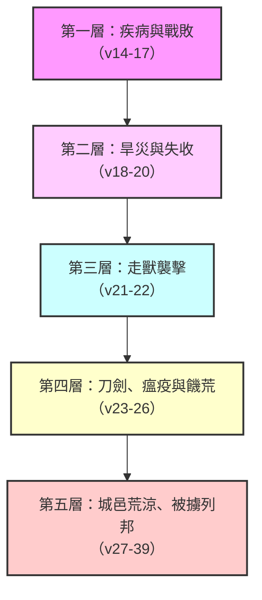

# 利未記 第26章

1. 你們不可做什麼虛無的神像，[[柱像（matsebah）|不可立雕刻的偶像或是柱像]]，也不可在你們的地上安什麼鏨成的石像，向他跪拜，因為我是耶和華─你們的神。
2. [[安息日|你們要守我的安息日，敬我的聖所]]。我是耶和華。
3. [[祝福與咒詛|你們若遵行我的律例，謹守我的誡命]]，
4. 我就給你們降下時雨，叫地生出土產，田野的樹木結果子。
5. 你們打糧食要打到摘葡萄的時候，摘葡萄要摘到撒種的時候；並且要吃得飽足，在你們的地上安然居住。
6. 我要賜平安在你們的地上；你們躺臥，無人驚嚇。我要叫惡獸從你們的地上息滅；刀劍也必不經過你們的地。
7. 你們要追趕仇敵，他們必倒在你們刀下。
8. [[五個人追趕一百人（蒙福的軍事應許）|你們五個人要追趕一百人，一百人要追趕一萬人]]；仇敵必倒在你們刀下。
9. 我要眷顧你們，使你們生養眾多，也要與你們堅定所立的約。
10. 你們要吃陳糧，又因新糧挪開陳糧。
11. [[神的同在|我要在你們中間立我的帳幕；我的心也不厭惡你們]]。
12. [[神的同在|我要在你們中間行走；我要作你們的神，你們要作我的子民]]。
13. 我是耶和華─你們的神，曾將你們從埃及地領出來，使你們不作埃及人的奴僕；我也折斷你們所負的軛，叫你們挺身而走。
14. [[祝福與咒詛|你們若不聽從我，不遵行我的誡命]]，
15. 厭棄我的律例，厭惡我的典章，不遵行我一切的誡命，背棄我的約，
16. 我待你們就要這樣：我必命定驚惶，叫眼目乾癟、精神消耗的癆病熱病轄制你們。你們也要白白地撒種，因為仇敵要吃你們所種的。
17. 我要向你們變臉，你們就要敗在仇敵面前。恨惡你們的，必轄管你們；無人追趕，你們卻要逃跑。
18. 你們因這些事若還不聽從我，我就要為你們的罪[[加七倍懲罰]]你們。
19. 我必斷絕你們因勢力而有的驕傲，[[天如鐵地如銅（乾旱咒詛的意象）|又要使覆你們的天如鐵，載你們的地如銅]]。
20. 你們要白白地勞力；因為你們的地不出土產，其上的樹木也不結果子。
21. 你們行事若與我反對，不肯聽從我，我就要按你們的罪加七倍降災與你們。
22. 我也要打發野地的走獸到你們中間，搶吃你們的兒女，吞滅你們的牲畜，使你們的人數減少，道路荒涼。
23. 你們因這些事若仍不改正歸我，行事與我反對，
24. 我就要行事與你們反對，[[加七倍懲罰|因你們的罪擊打你們七次]]。
25. 我又要使刀劍臨到你們，報復你們背約的仇；聚集你們在各城內，降瘟疫在你們中間，也必將你們交在仇敵的手中。
26. 我要折斷你們的杖，就是斷絕你們的糧。那時，必有十個女人在一個爐子給你們烤餅，按分量秤給你們；你們要吃，也吃不飽。
27. 你們因這一切的事若不聽從我，卻行事與我反對，
28. 我就要發烈怒，行事與你們反對，又因你們的罪懲罰你們七次。
29. 並且[[吃兒女的肉（極端饑荒的咒詛）|你們要吃兒子的肉，也要吃女兒的肉]]。
30. [[邱壇與日像被毀（拜偶像的終極審判）|我又要毀壞你們的邱壇，砍下你們的日像]]，把你們的屍首扔在你們偶像的身上；我的心也必厭惡你們。
31. 我要使你們的城邑變為荒涼，使你們的眾聖所成為荒場；我也不聞你們馨香的香氣。
32. 我要使地成為荒場，住在其上的仇敵就因此詫異。
33. 我要把你們散在列邦中；我也要拔刀追趕你們。你們的地要成為荒場；你們的城邑要變為荒涼。
34. [[安息年律例|你們在仇敵之地居住的時候，你們的地荒涼，要享受眾安息]]；正在那時候，地要歇息，享受安息。
35. 地多時為荒場，就要多時歇息；[[安息年律例|地這樣歇息，是你們住在其上的安息年所不能得的]]。
36. 至於你們剩下的人，我要使他們在仇敵之地心驚膽怯。葉子被風吹的響聲，要追趕他們；他們要逃避，像人逃避刀劍，無人追趕，卻要跌倒。
37. 無人追趕，他們要彼此撞跌，像在刀劍之前。你們在仇敵面前也必站立不住。
38. 你們要在列邦中滅亡；仇敵之地要吞吃你們。
39. 你們剩下的人必因自己的罪孽和祖宗的罪孽在仇敵之地消滅。
40. 他們要承認自己的罪和他們祖宗的罪，就是干犯我的那罪，並且承認自己行事與我反對，
41. 我所以行事與他們反對，把他們帶到仇敵之地。那時，[[未受割禮的心若謙卑（認罪悔改的條件）|他們未受割禮的心若謙卑了，他們也服了罪孽的刑罰]]，
42. [[亞伯拉罕之約|我就要記念我與雅各所立的約，與以撒所立的約，與亞伯拉罕所立的約]]，並要記念這地。
43. 他們離開這地，地在荒廢無人的時候就要享受安息。並且他們要服罪孽的刑罰；因為他們厭棄了我的典章，心中厭惡了我的律例。
44. 雖是這樣，他們在仇敵之地，我卻不厭棄他們，也不厭惡他們，將他們盡行滅絕，也不背棄我與他們所立的約，因為我是耶和華─他們的神。
45. [[亞伯拉罕之約|我卻要為他們的緣故記念我與他們先祖所立的約]]。他們的先祖是我在列邦人眼前、從埃及地領出來的，為要作他們的神。我是耶和華。
46. 這些律例、典章，和法度[[摩西|是耶和華與以色列人在西乃山藉著摩西立的]]。

---

## 本章知識節點

### 主題
- [[祝福與咒詛]]
- [[遵行誡命必蒙福的七重應許（利26：3-13）]]
- [[不聽從神的五層漸進懲罰（利26：14-39）]]

### 事件
- [[加七倍懲罰]]
- [[吃兒女的肉（極端饑荒的咒詛）]]
- [[邱壇與日像被毀（拜偶像的終極審判）]]

### 互文
- [[出20：4-6|出20：4-6 第二誡禁拜偶像]]
- [[申28：1-68|申28：1-68 遵命蒙福與違命受咒詛]]
- [[代下36：21|代下36：21 被擄七十年使地享安息]]
- [[王下6：28-29|王下6：28-29 撒瑪利亞饑荒易子而食]]
- [[耶29：18|耶29：18 刀劍饑荒瘟疫的咒詛]]
- [[結5：1-17|結5：1-17 四大災害的審判]]
- [[尼1：8-9|尼1：8-9 認罪與歸回的禱告]]
- [[羅11：25-26|羅11：25-26 以色列全家得救]]
- [[來4：9-10|來4：9-10 進入安息的預表]]
- [[約15：5|約15：5 離了主不能結果子]]
- [[林後6：16|林後6：16 神在人中間行走]]

### 人物
- [[摩西]]
- [[亞伯拉罕]]
- [[以撒]]
- [[雅各]]

### 原文
- [[柱像（matsebah）]]

### 地點
- [[埃及]]
- [[西乃山]]
- [[迦南地]]

### 神學
- [[安息日]]
- [[安息年律例]]
- [[亞伯拉罕之約]]
- [[神的同在]]
- [[未受割禮的心若謙卑（認罪悔改的條件）]]
- [[神厭惡以色列的難題（利26：30與26：44的張力）]]

### 背景
- [[五個人追趕一百人（蒙福的軍事應許）]]
- [[天如鐵地如銅（乾旱咒詛的意象）]]

---

## 本章整理

### 遵行誡命必蒙神賜福（v1-13）

利未記第二十六章是全書的總結與警戒篇，神在頒布了一切律例典章之後，向百姓宣告順服與悖逆將帶來的截然不同的結局。本章的開篇並非直接宣告賞罰，而是重申兩項最核心的盟約要求：不可拜偶像與守安息日。神首先嚴嚴吩咐：「你們不可做甚麼虛無的神像，不可立雕刻的偶像或是[[柱像（matsebah）|柱像]]」（1節）。《舊約聖經背景註釋》指出，這些柱像可能是代表神明的單塊巨石，或是圍繞祭壇的一套柱子，在基色和夏瑣出土的柱子甚至刻有高舉之手等與神明相關的記號。CT（黃迦勒《基督徒文摘》）對此有深刻的屬靈洞見，指出「為什麼會有偶像？有偶像是因為不信神的人為了保守自己，為了讓自己更加亨通才有的」，因此拜偶像的本質是出自「為己的心」，而只敬拜耶和華，意味著「把自己完全交托給神，把自己的所有問題，甚至把自己的吉凶都交托給神來掌管」。

緊接著偶像禁令之後，神吩咐百姓「要守我的安息日，敬我的聖所」（2節）。這不僅是消極地防阻迦南風俗，更是「有諸內而形於外的愛神表現」。GT《精讀本》指出，遵守安息日和唯一聖所制度，暗示今日信徒應在基督裡以教會和主日為中心過信仰生活。

當百姓履行這些基本條件後，神宣告了[[遵行誡命必蒙福的七重應許（利26：3-13）|遵行誡命必蒙福的七重應許]]。這些福氣涵蓋了物質、軍事與屬靈三個層面。在物質方面，神應許按時降雨，使地生出土產（4節）。《舊約背景註釋》提到，古代近東能否豐饒是經常存在的顧慮，因此很多神祇都和雨及風暴有關；但本章把豐饒包括在祝福之內，是重申耶和華賜給百姓土地和兒女的立約應許。穀物豐收到一個地步，「打糧食要打到摘葡萄的時候，摘葡萄要摘到撒種的時候」（5節），意味著一年到頭田間出產不斷，來不及收割。

在軍事方面，神應許賜平安，叫惡獸息滅，刀劍不經過他們的地（6節）。若遇敵人來犯，將出現[[五個人追趕一百人（蒙福的軍事應許）|五個人追趕一百人]]的奇妙景象（8節）。《舊約背景訽釋》將此稱為「神聖戰士」耶和華為他們打仗的表記，這個「受害人反成勝利者」的主題也重現於申命記三十二30與以賽亞書三十17。CT進一步將此應許連結到新約的屬靈爭戰，指出這「象徵新約時代的信徒，按神的話語與撒旦和它的僕役爭戰，若順服神的話，就有能力得勝」。

在屬靈方面，這是福氣的最高潮——神要在他們中間立帳幕，與他們同行（11-12節）。KC（KingComments）評論道：「除了物質的祝福，還有屬靈的祝福。這是祂住在他們中間的特權，祂要作他們的神，他們要作祂的子民。物質的祝福也是神不斷住在他們中間的證明。」最後，神以出埃及的拯救作為這段應許的基礎：「我也折斷你們所負的軛，叫你們挺身而走」（13節）。KC指出，基督徒也當屢次被提醒自己從罪的權勢中得拯救，這將使感恩之心常存。

### 不遵行誡命必招神厭棄（v14-39）

與順服的祝福相比，悖逆的咒詛更為詳盡且嚴厲，這反映了古代近東條約的典型程式。《舊約背景註釋》指出，古代近東法典和條約都在結尾附有神明祝咒的段落，「咒詛照例遠比祝福為多，並且如同本段，其嚴重性逐步遞增。」GT《串珠聖經註釋》亦言，這種做法「含有很濃的教育作用，讓人清楚知道若沒有神祝福，人會如何受苦，也反映出人類本是罪人，容易傾向邪惡，故此『畏懼』常常比『愛心』更能激發人行善的意志。」

神對不肯聽從的百姓，宣告了[[不聽從神的五層漸進懲罰（利26：14-39）|不聽從神的五層漸進懲罰]]。這五層懲罰並非一次到位，而是隨著百姓硬著頸項的程度逐步加重，每次都以「加七倍懲罰」作為升級的標誌。

第一層懲罰（v14-17）帶來驚惶、癆病、熱病，以及仇敵的轄管。第二層（v18-20）因百姓仍不聽從，神宣告[[天如鐵地如銅（乾旱咒詛的意象）|天如鐵地如銅]]的乾旱咒詛。《舊約背景註釋》指出這個比喻性的咒詛在以撒哈頓條約中也有出現，暗示「天本身的鐵門關閉，不復有雨降於其上」。CT將此連結到屬靈驕傲的對付：「抵擋神、無視神的話語是因驕傲而有。驕傲是認為自己很了不起的錯覺，是罪惡的根源。」

當懲罰進入第四層（v23-26），戰爭引發嚴重的饑荒，十個女人要在一個爐子烤餅，按分量秤給他們。第五層（v27-39）則是終極的毀滅，出現了[[吃兒女的肉（極端饑荒的咒詛）|吃兒女的肉]]的慘況。《舊約背景註釋》說明：「只有在極端絕望和瀕臨饑饉的情況下，才會導致古代近東的人採取食人的下策。」這在歷史中應驗於王下六24-30的撒瑪利亞圍城，以及主後70年羅馬軍隊毀滅耶路撒冷時。

與此同時，神宣告了[[邱壇與日像被毀（拜偶像的終極審判）|邱壇與日像被毀]]的審判（v30）。神要將百姓的屍首扔在他們偶像的身上，CT指出這是「諷刺偶像不能給事奉它的人帶來任何益處，也不能保障生命」。這也引發了一個釋經難題，即[[神厭惡以色列的難題（利26：30與26：44的張力）|神厭惡以色列的難題]]：神在第30節說「我的心也必厭惡你們」，但在第44節卻又說「我卻不厭棄他們，也不厭惡他們」。GT《聖經難解經文詮釋手冊》解答了這個張力：「這兩句經文的不同乃是神在不同的時候對以色列人在不同情況時所說的話。當以色列人對神忠誠時神就不厭棄他們。然而，當他們敬拜其他神時，神對他們說：『把你們的屍首扔在你們偶像的身上』。神恨惡祂的百姓或外邦人崇拜偶像。」

當百姓被分散到列邦，地便得到了它長久被剝奪的安息（v34-35）。GT《丁良才註釋》計算，從以色列人分地起到被擄巴比倫，共應守一百三十六個安息年，神便藉著被擄七十年來追補他們所未守的安息年數。KC對此有深刻的神學評論：「人的墮落也影響到自然界，宇宙萬物也落在人所犯的罪惡痛苦中。自然也盼望著安息和恢復的日子。神通過公義的審判把邪惡的人從土地上趕出，使土地享受安息的喜樂。」

### 若肯悔改必蒙神紀念（v40-46）

儘管咒詛的篇幅漫長且令人不寒而慄，但神的心意並非毀滅，而是管教。在第40-45節，神為悔改留下了恩典的門戶。當百姓在仇敵之地承認自己的罪，並且[[未受割禮的心若謙卑（認罪悔改的條件）|未受割禮的心若謙卑]]下來，神就要紀念祂與亞伯拉罕、以撒、雅各所立的[[亞伯拉罕之約|約]]。

這段經文揭示了悔改的三個階段：首先是「認罪」，GT《精讀本》指出「只有在神的恩典之下，才能明白自己犯罪的事實。從新約聖經可知，只有在聖靈的感動下，才能承認自己的罪」；其次是「謙卑」，神不輕看憂傷痛悔的心靈；最後是「服了罪孽的刑罰」，這是仰望神的公義，承認自己是罪人的態度。

KC將此連結到新約的教導：「悔改意味著他們認為自己有罪，並明白他們行事與神反對。他們定自己的罪，在神面前謙卑自己。他們未受割禮的心（指憑己意和悖逆而行動）來到自審的地步。割禮說到對肉體的審判，這正是神所尋求的（羅2:29）。」

神應許必不背棄祂的約，因為「神的恩賜和選召是沒有後悔的」（羅11:29）。GT《精讀本》總結道：「神所希望的是饒恕、拯救，而不是審判、刑罰；同時也知道神的懲罰並不是咒詛之杖，乃是督促悔改的慈愛鞭打。」第46節作為全章的結語，標明這些律例、典章和法度是耶和華與以色列人在西乃山藉著摩西立的。KC指出，這節經文實際上關閉了利未記全書，摩西是神所賜的中保，透過他的事奉，百姓在安營於西乃山時領受了神的啟示。

### 跨章脈絡與神學主題整理

利未記26章的祝福與咒詛並非孤立的律法條文，而是深深植根於[[亞伯拉罕之約|亞伯拉罕之約]]的框架中。神在第42節特別提到「我與雅各所立的約，與以撒所立的約，與亞伯拉罕所立的約」，GT《丁良才註釋》敏銳地觀察到，此處神是「自下而上說的（就是從雅各到亞伯拉罕）」，與別處經文（如出二24）的順序不同，這強調了神在百姓最軟弱、最不配的時候，首先想到與他們最近的先祖所立的約。

本章也與申命記28章形成了強烈的互文關係。兩章都論及順命蒙福、違命受咒詛，但利未記26章的咒詛呈現出獨特的「五層漸進」結構，每次都以「加七倍」作為警告的升級。這種遞增的管教模式，體現了神極大的忍耐。CT指出：「神對那些悖逆的百姓的管教是一步一步地加重。起初神是輕輕地給他們一點管教，他們不回頭，神就加重一點。」

> [!important] 管教的目的：愛的鞭打
> 神使用罪的後果引領百姓悔改，並不是要撇棄他們。正如GT《串珠聖經註釋》所言：「『懲罰』顯出神的審判帶有管教意味。神懲罰祂的子民不單是因為他們罪有應得，更是因為祂愛他們，想改正他們的錯處。」這也呼應了新約希伯來書十二5-11的教導，主所愛的，祂必管教。

最後，本章關於「地要享受安息」的宣告（v34-35），不僅是對[[安息年律例|安息年律例]]的補贖，更具有深遠的預表意義。BH（BibleHub Study）指出，地的安息「指向信徒在新造中將經歷的最終安息，在那裡神的子民將與祂和祂的創造完美和諧地同住。這未來的安息在啟示錄二十一至二十二章的終末盼望中可以找到。」這表明，物質的安息年終究是影兒，基督才是那安息日的實體（來4:9-10）。

**參考資料**
https://www.ccbiblestudy.org/Old%20Testament/03Lev/03CT26.htm
https://www.ccbiblestudy.org/Old%20Testament/03Lev/03GT26.htm
https://www.kingcomments.com/en/bible-studies/Lev/26
https://biblehub.com/study/leviticus/26.htm
