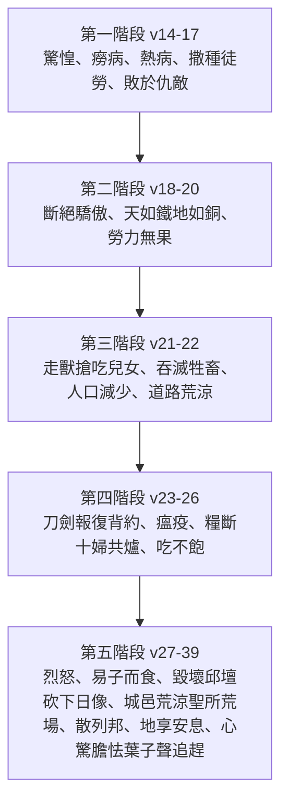

# 利未記 第26章

1. 你們不可做什麼[[虛無的神像]]，不可立[[虛無的神像|雕刻的偶像]]或是[[虛無的神像|柱像]]，也不可在你們的地上安什麼[[虛無的神像|鏨成的石像]]，向他跪拜，因為[[我是耶和華你們的神|我是耶和華─你們的神]]。
2. 你們要守我的[[安息日]]，敬我的[[聖所]]。我是耶和華。
3. 你們若遵行我的[[律例]]，謹守我的[[誡命]]，
4. 我就給你們降下時雨，叫[[順服蒙福條例|地生出土產]]，田野的樹木結果子。
5. 你們打糧食要打到摘葡萄的時候，摘葡萄要摘到撒種的時候；並且要吃得飽足，在你們的地上[[順服蒙福條例|安然居住]]。
6. 我要賜平安在你們的地上；你們躺臥，[[順服蒙福條例|無人驚嚇]]。我要叫惡獸從你們的地上息滅；刀劍也必不經過你們的地。
7. 你們要追趕仇敵，他們必倒在你們刀下。
8. 你們五個人要追趕一百人，一百人要追趕一萬人；仇敵必倒在你們刀下。
9. 我要眷顧你們，使你們[[順服蒙福條例|生養眾多]]，也要與你們堅定所立的[[盟約|約]]。
10. 你們要[[順服蒙福條例|吃陳糧]]，又因新糧挪開陳糧。
11. 我要在你們中間立我的帳幕；我的心也不厭惡你們。
12. 我要在你們中間行走；我要作你們的神，你們要[[至聖|作我的子民]]。
13. [[我是耶和華你們的神|我是耶和華─你們的神]]，曾將你們從[[埃及地]]領出來，使你們不作埃及人的奴僕；我也折斷你們所負的軛，叫你們挺身而走。
14. 你們若不聽從我，不[[誡命|遵行我的誡命]]，
15. 厭棄我的[[律例]]，厭惡我的[[典章]]，[[誡命|不遵行我一切的誡命]]，背棄我的[[盟約|約]]，
16. 我待你們就要這樣：我必命定驚惶，叫眼目乾癟、精神消耗的[[悖逆遭咒詛五階段|癆病熱病]]轄制你們。你們也要白白地撒種，因為仇敵要吃你們所種的。
17. 我要向你們變臉，你們就要[[悖逆遭咒詛五階段|敗在仇敵面前]]。恨惡你們的，必轄管你們；無人追趕，你們卻要逃跑。
18. 你們因這些事若還不聽從我，我就要為你們的[[七倍懲罰|罪加七倍]]懲罰你們。
19. 我必斷絕你們因勢力而有的驕傲，又要使覆你們的天如鐵，載你們的地如銅。
20. 你們要白白地勞力；因為你們的地不出土產，其上的樹木也不結果子。
21. 你們行事若與我反對，不肯聽從我，我就要按你們的[[七倍懲罰|罪加七倍]]降災與你們。
22. 我也要打發野地的走獸到你們中間，搶吃你們的[[兒女]]，吞滅你們的牲畜，使你們的人數減少，道路荒涼。
23. 你們因這些事若仍不改正歸我，行事與我反對，
24. 我就要行事與你們反對，因你們的罪擊打你們七次。
25. 我又要使[[打死人的必被治死|刀劍臨到]]你們，報復你們背[[盟約|約]]的仇；聚集你們在各城內，降[[悖逆遭咒詛五階段|瘟疫]]在你們中間，也必將你們交在仇敵的手中。
26. 我要折斷你們的杖，就是斷絕你們的糧。那時，必有十個女人在一個爐子給你們烤餅，[[貧窮|按分量秤給]]你們；你們要吃，也[[貧窮|吃不飽]]。
27. 你們因這一切的事若不聽從我，卻行事與我反對，
28. 我就要發烈怒，行事與你們反對，又因你們的罪[[七倍懲罰|懲罰你們七次]]。
29. 並且你們要吃兒子的肉，也要吃女兒的肉。
30. 我又要毀壞你們的邱壇，砍下你們的日像，把你們的屍首扔在你們偶像的身上；我的心也必厭惡你們。
31. 我要使你們的城邑變為荒涼，使你們的[[聖所|眾聖所成為荒場]]；我也不聞你們馨香的香氣。
32. 我要使地成為荒場，住在其上的仇敵就因此詫異。
33. 我要把你們散在列邦中；我也要拔刀追趕你們。你們的地要成為荒場；你們的城邑要變為荒涼。
34. 你們在仇敵之地居住的時候，你們的地荒涼，要享受眾安息；正在那時候，地要歇息，[[地享受安息|享受安息]]。
35. 地多時為荒場，就要多時歇息；地這樣歇息，是你們住在其上的安息年所不能得的。
36. 至於你們剩下的人，我要使他們在仇敵之地心驚膽怯。葉子被風吹的響聲，要[[心驚膽怯葉子聲追趕|追趕他們]]；他們要逃避，像人逃避刀劍，無人追趕，卻要跌倒。
37. 無人追趕，他們要彼此撞跌，像在刀劍之前。你們在仇敵面前也必站立不住。
38. 你們要[[從民中剪除（karet）|在列邦中滅亡]]；仇敵之地要吞吃你們。
39. 你們剩下的人必因自己的罪孽和祖宗的罪孽[[從民中剪除（karet）|在仇敵之地消滅]]。
40. 他們要承認自己的罪和他們祖宗的罪，就是干犯我的那罪，並且承認自己行事與我反對，
41. 我所以行事與他們反對，把他們帶到仇敵之地。那時，他們未受割禮的心若謙卑了，他們也服了罪孽的刑罰，
42. 我就要記念我與[[盟約|雅各所立的約]]，與[[盟約|以撒所立的約]]，與[[盟約|亞伯拉罕所立的約]]，並要記念這地。
43. 他們離開這地，地在荒廢無人的時候就要[[地享受安息|享受安息]]。並且他們要[[悔改蒙紀念條例|服罪孽的刑罰]]；因為他們厭棄了我的[[典章]]，心中[[典章|厭惡了我的律例]]。
44. 雖是這樣，他們在仇敵之地，我卻不厭棄他們，也不厭惡他們，將他們盡行滅絕，也不背棄我與他們所立的[[盟約|約]]，因為我是耶和華─他們的神。
45. 我卻要為他們的緣故記念我與他們先祖所立的[[盟約|約]]。他們的先祖是我在列邦人眼前、從[[埃及地]]領出來的，為要作他們的神。我是耶和華。
46. 這些[[律例]]、[[典章]]，和法度是耶和華與[[以色列|以色列人]]在西乃山[[摩西|藉著摩西]]立的。

---

## 本章知識節點

### 神學
- [[順服蒙福條例]]
- [[悖逆遭咒詛五階段]]
- [[悔改蒙紀念條例]]
- [[記念列祖之約]]
- [[不厭棄不滅絕不背約]]
- [[咒詛]]
- [[福分]]
- [[承認罪孽謙卑心]]

### 制度
- [[守安息日敬聖所]]
- [[七倍懲罰]]
- [[地享受安息]]

### 歷史
- [[虛無的神像]]
- [[天如鐵地如銅]]
- [[易子而食]]
- [[毀壞邱壇砍下日像]]
- [[城邑變為荒涼聖所成為荒場]]
- [[心驚膽怯葉子聲追趕]]

---

## 本章整理

### 序言：獨一真神與敬拜根基（v1-2）
本章以兩項根本誡命開篇：嚴禁製造 [[虛無的神像]]、立柱像或鏨成石像跪拜，並命令 [[守安息日敬聖所]]。這兩節經文確立了以色列敬拜的**排他性**（單單事奉耶和華）與**節奏性**（安息日、聖所），是後續順服/悖逆雙軌制的神學基石。神自稱「我是耶和華─你們的神」（v1, 2, 13），以救贖主身分（領你們出 [[埃及地]]）要求獨佔的忠誠。

### 順服蒙福條例：約的正面應許（v3-13）
若以色列「遵行我的律例，謹守我的誡命」（v3），神應許五重豐盛：
1. **物質供應**：時雨、土產、果實、糧食連續不斷（v4-5, 10）。
2. **安全平安**：無惡獸、無刀劍、追趕仇敵以寡擊眾（v6-8）。
3. **生命興旺**：生養眾多、堅定所立的 [[盟約]]（v9）。
4. **神的同在**：帳幕立在中間、心不厭惡、行走其中、作他們的神（v11-12）。
5. **救贖身分**：折斷軛、叫你們挺身而走（v13）。
這段經文將 [[福分]] 具體化為農業、軍事、人口、神臨在四個維度，彰顯約的全人關懷。

### 悖逆遭咒詛五階段：漸進式審判（v14-39）
經文呈現「若……我就……」的嚴密因果鏈，每階段以「七倍懲罰」（v18, 21, 24, 28）為升級標記，形成**五階段遞進**：

| 階段 | 經文 | 核心審判 | 關鍵意象 |
|------|------|----------|----------|
| 1 | v14-17 | 疾病、農業失收、軍事敗北 | 白白撒種、無人追趕卻逃跑 |
| 2 | v18-20 | 自然秩序逆轉 | **[[天如鐵地如銅]]** |
| 3 | v21-22 | 野獸侵害、人口銳減 | 道路荒涼 |
| 4 | v23-26 | 刀劍、瘟疫、糧食斷絕 | 十婦共爐、按分量秤餅 |
| 5 | v27-39 | 終極毀滅、被擄、地得安息 | **[[易子而食]]**、**[[毀壞邱壇砍下日像]]**、**[[城邑變為荒涼聖所成為荒場]]**、**[[地享受安息]]**、**[[心驚膽怯葉子聲追趕]]** |

> [!important] 七倍懲罰的神學意義
> 「七倍」非單指數量，而表**完全、徹底**的審判，對應創世記 4:15, 24 的「七倍報應」傳統，並預表但以理書 9:24-27 「七十個七」的終極審判與復興時間表。

### 悔改蒙紀念條例：約的不可廢棄性（v40-45）
審判並非終點。當以色列 **[[承認罪孽謙卑心]]**（v40-41），神應許 **[[記念列祖之約]]**（v42）、**[[不厭棄不滅絕不背約]]**（v44）。這段經文揭示約的**單邊恩典根基**：雖然以色列違背 [[律例]]、[[典章]]、[[誡命]]，神仍因與亞伯拉罕、以撒、雅各所立的 [[世世代代]] 之約而保留餘民。地在荒廢時享受安息（v34-35, 43），既是對安息年規例的補償，也預表被擄歸回後的復興（參代下 36:21）。

### 結語：西乃山約的正式簽署（v46）
「這些律例、典章、和法度是耶和華與以色列人在西乃山藉著摩西立的。」本節為整卷利未記（特別是 25-26 章的聖年與約之條款）畫上法理句點，確立 **[[摩西]]** 為中保、[[以色列]] 為約民、西乃山為立約地點的歷史錨點。

> [!note] 本章與申命記 28 章的對照
> 利未記 26 章著重**祭司視角**（聖所、安息、潔淨、神的同在），申命記 28 章著重**先知/君王視角**（國度興衰、具體國際政治後果）。兩者共同構成「約之書」的雙重見證。

> [!quote] 關鍵應許經文
> 「我卻要為他們的緣故記念我與他們先祖所立的約……我是耶和華。」（v45） —— 這節經文是整章神學高峰：**審判真實，但恩典更真實；約的破裂在人，約的堅立在神。**

**參考資料**
https://www.ccbiblestudy.org/Old%20Testament/03Lev/03CT26.htm
https://www.ccbiblestudy.org/Old%20Testament/03Lev/03GT26.htm
https://www.kingcomments.com/en/bible-studies/Lev/26
https://biblehub.com/study/leviticus/26.htm
