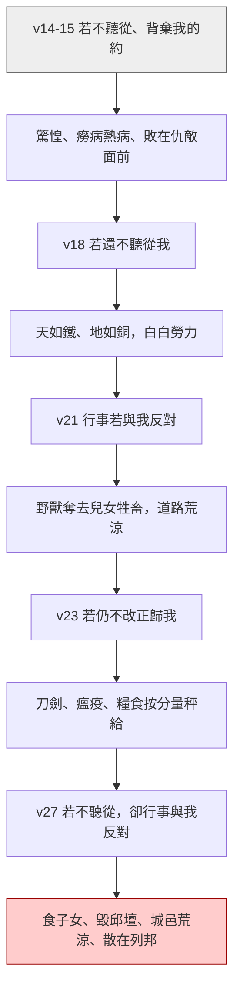

# 利未記 第26章

<!-- chapter-navigation:start -->
| [前一章](../03%20利未記/第25章.md) | [回目錄](../03%20利未記/全書目錄及綱要.md) | [下一章](../03%20利未記/第27章.md) |
| :--- | :---: | ---: |
<!-- chapter-navigation:end -->

1. 你們不可做什麼虛無的神像，[[柱像|不可立雕刻的偶像或是柱像]]，也不可在你們的地上安什麼鏨成的石像，向他跪拜，因為我是耶和華─你們的神。
2. [[安息日|你們要守我的安息日，敬我的聖所]]。我是耶和華。
3. [[祝福與咒詛|你們若遵行我的律例，謹守我的誡命]]，
4. [[遵行誡命必蒙福的七重應許（利26：3-13）|我就給你們降下時雨，叫地生出土產，田野的樹木結果子]]。
5. 你們打糧食要打到摘葡萄的時候，摘葡萄要摘到撒種的時候；並且要吃得飽足，在你們的地上安然居住。
6. 我要賜平安在你們的地上；你們躺臥，無人驚嚇。我要叫惡獸從你們的地上息滅；刀劍也必不經過你們的地。
7. 你們要追趕仇敵，他們必倒在你們刀下。
8. [[五個人追趕一百人（蒙福的軍事應許）|你們五個人要追趕一百人，一百人要追趕一萬人]]；仇敵必倒在你們刀下。
9. 我要眷顧你們，使你們生養眾多，也要與你們堅定所立的約。
10. 你們要吃陳糧，又因新糧挪開陳糧。
11. [[神的同在|我要在你們中間立我的帳幕；我的心也不厭惡你們]]。
12. [[神的同在|我要在你們中間行走；我要作你們的神，你們要作我的子民]]。
13. 我是耶和華─你們的神，曾將你們從埃及地領出來，使你們不作埃及人的奴僕；我也折斷你們所負的軛，叫你們挺身而走。
14. [[祝福與咒詛|你們若不聽從我，不遵行我的誡命]]，
15. [[典章|厭棄我的律例，厭惡我的典章]]，不遵行我一切的誡命，背棄我的約，
16. 我待你們就要這樣：我必命定驚惶，叫眼目乾癟、精神消耗的癆病熱病轄制你們。你們也要白白地撒種，因為仇敵要吃你們所種的。
17. 我要向你們變臉，你們就要敗在仇敵面前。恨惡你們的，必轄管你們；無人追趕，你們卻要逃跑。
18. [[不聽從神的五層漸進懲罰（利26：14-39）|你們因這些事若還不聽從我，我就要為你們的罪加七倍懲罰你們]]。
19. 我必斷絕你們因勢力而有的驕傲，[[天如鐵地如銅（乾旱咒詛的意象）|又要使覆你們的天如鐵，載你們的地如銅]]。
20. 你們要白白地勞力；因為你們的地不出土產，其上的樹木也不結果子。
21. [[行事與我反對（qe.ri）|你們行事若與我反對，不肯聽從我]]，我就要按你們的罪[[加七倍懲罰|加七倍降災]]與你們。
22. 我也要打發野地的走獸到你們中間，搶吃你們的兒女，吞滅你們的牲畜，使你們的人數減少，道路荒涼。
23. [[行事與我反對（qe.ri）|你們因這些事若仍不改正歸我，行事與我反對]]，
24. 我就要行事與你們反對，[[加七倍懲罰|因你們的罪擊打你們七次]]。
25. 我又要使刀劍臨到你們，報復你們背約的仇；聚集你們在各城內，降瘟疫在你們中間，也必將你們交在仇敵的手中。
26. 我要折斷你們的杖，就是斷絕你們的糧。那時，必有十個女人在一個爐子給你們烤餅，按分量秤給你們；你們要吃，也吃不飽。
27. [[不聽從神的五層漸進懲罰（利26：14-39）|你們因這一切的事若不聽從我，卻行事與我反對]]，
28. 我就要發烈怒，行事與你們反對，又因你們的罪懲罰你們七次。
29. 並且[[吃兒女的肉（極端饑荒的咒詛）|你們要吃兒子的肉，也要吃女兒的肉]]。
30. [[邱壇與日像被毀（拜偶像的終極審判）|我又要毀壞你們的邱壇，砍下你們的日像]]，把你們的屍首扔在你們偶像的身上；[[神厭惡以色列的難題（利26：30與26：44的張力）|我的心也必厭惡你們]]。
31. 我要使你們的城邑變為荒涼，使你們的眾聖所成為荒場；我也不聞你們馨香的香氣。
32. 我要使地成為荒場，住在其上的仇敵就因此詫異。
33. 我要把你們散在列邦中；我也要拔刀追趕你們。你們的地要成為荒場；你們的城邑要變為荒涼。
34. [[安息年律例|你們在仇敵之地居住的時候，你們的地荒涼，要享受眾安息]]；正在那時候，地要歇息，享受安息。
35. 地多時為荒場，就要多時歇息；[[安息年律例|地這樣歇息，是你們住在其上的安息年所不能得的]]。
36. 至於你們剩下的人，我要使他們在仇敵之地心驚膽怯。葉子被風吹的響聲，要追趕他們；他們要逃避，像人逃避刀劍，無人追趕，卻要跌倒。
37. 無人追趕，他們要彼此撞跌，像在刀劍之前。你們在仇敵面前也必站立不住。
38. 你們要在列邦中滅亡；仇敵之地要吞吃你們。
39. 你們剩下的人必因自己的罪孽和祖宗的罪孽在仇敵之地消滅。
40. 他們要承認自己的罪和他們祖宗的罪，就是干犯我的那罪，並且承認自己[[行事與我反對（qe.ri）|行事與我反對]]，
41. 我所以行事與他們反對，把他們帶到仇敵之地。那時，[[未受割禮的心若謙卑（認罪悔改的條件）|他們未受割禮的心若謙卑了，他們也服了罪孽的刑罰]]，
42. [[亞伯拉罕之約|我就要記念我與雅各所立的約，與以撒所立的約，與亞伯拉罕所立的約]]，並要記念這地。
43. 他們離開這地，地在荒廢無人的時候就要享受安息。並且他們要服罪孽的刑罰；因為他們厭棄了我的[[典章]]，心中厭惡了我的律例。
44. 雖是這樣，他們在仇敵之地，[[神厭惡以色列的難題（利26：30與26：44的張力）|我卻不厭棄他們，也不厭惡他們]]，將他們盡行滅絕，也不背棄我與他們所立的約，因為我是耶和華─他們的神。
45. [[亞伯拉罕之約|我卻要為他們的緣故記念我與他們先祖所立的約]]。他們的先祖是我在列邦人眼前、從埃及地領出來的，為要作他們的神。我是耶和華。
46. [[典章|這些律例、典章，和法度]][[摩西|是耶和華與以色列人在西乃山藉著摩西立的]]。

---

## 本章知識節點

### 主題
- [[祝福與咒詛]]
- [[遵行誡命必蒙福的七重應許（利26：3-13）]]
- [[不聽從神的五層漸進懲罰（利26：14-39）]]
- [[天如鐵地如銅（乾旱咒詛的意象）]]
- [[吃兒女的肉（極端饑荒的咒詛）]]
- [[邱壇與日像被毀（拜偶像的終極審判）]]

### 原文
- [[柱像]]
- [[加七倍懲罰]]
- [[行事與我反對（qe.ri）]]

### 神學
- [[安息日]]
- [[神的同在]]
- [[亞伯拉罕之約]]
- [[五個人追趕一百人（蒙福的軍事應許）]]
- [[未受割禮的心若謙卑（認罪悔改的條件）]]
- [[典章]]

### 事件
- [[安息年律例]]

### 背景
- [[宗主條約]]

### 解經爭議
- [[神厭惡以色列的難題（利26：30與26：44的張力）]]

### 人物
- [[摩西]]
- [[亞伯拉罕]]
- [[以撒]]
- [[雅各]]

### 地點
- [[埃及]]
- [[西乃山]]
- [[迦南地]]

### 互文
- [[出20：4-6|出20：4-6 第二誡禁拜偶像]]
- [[申28：1-68|申28：1-68 遵命蒙福與違命受咒詛]]
- [[代下36：21|代下36：21 被擄七十年使地享安息]]
- [[王下6：28-29|王下6：28-29 撒瑪利亞饑荒易子而食]]
- [[王下17：7-23|王下17：7-23 北國效法外邦背約亡國被擄]]
- [[耶29：18|耶29：18 刀劍饑荒瘟疫的咒詛]]
- [[結5：1-17|結5：1-17 四大災害的審判]]
- [[結14：21|結14：21 刀劍饑荒惡獸瘟疫四樣大災]]
- [[尼1：8-9|尼1：8-9 認罪與歸回的禱告]]
- [[羅11：25-26|羅11：25-26 以色列全家得救]]
- [[來4：9-10|來4：9-10 進入安息的預表]]
- [[約15：5|約15：5 離了主不能結果子]]
- [[林後6：16|林後6：16 神在人中間行走]]

---

## 本章整理

### 兩條前提：不可造偶像，要守安息日（v1-2）

利未記走到最後兩章，神沒有再頒新的條例，而是把整卷書的賞罰一次講明。開場卻不是賞罰，是兩條老規矩的重申：不可造偶像，要守安息日。

第一節一口氣列了四樣禁止的東西：虛無的神像、雕刻的偶像、[[柱像]]、鏨成的石像。CT 的〔文意註解〕逐項分開解釋：「『虛無的神像』指不存在之物的像；『雕刻的偶像』指將被造物雕刻成可看得見的像；『柱像』指豎立的石柱，被迦南人當作神明。」GT《舊約聖經背景註釋》補上考古的一面：「立起來的聖石和神像，都同樣是遭禁的異教祭儀聖物。這些柱像可能是代表神明的單塊巨石，也可能是圍繞祭壇或神廟的一套柱子。在基色和夏瑣出土的柱子刻有裝飾，如高舉之手，或與某位神明有關的記號等。」

四樣裡最難解的是「鏨成的石像」。GT《舊約聖經背景註釋》坦白說：「這用語只在聖經此處出現，意思非常的隱晦。」它接著提出一個推測：「胡羅維茨（A. Hurowitz）根據一處亞述碑文，提出所指的可能是廟宇門檻上有裝飾或刻字的版子，君王祈求吉兆時俯伏於其上。」STEP語言資料在這裡幫得上忙：這個詞原文其實是兩個字，אֶבֶן（e.ven，石頭）加上 מַשְׂכִּית（H4906，本節 context gloss 作 a carved image），而 CT 的〔原文字義〕正好也把它標成「石像(原文雙字)」石頭(首字)；形像(次字)。

CT 把偶像的問題推到動機上：「為什麼會有偶像？有偶像是因為不信神的人為了保守自己，為了讓自己更加亨通才有的。人們雕刻木像、石像，並去跪拜都是出自『為己的心』。」接著的第二節轉為正面吩咐，要[[安息日|守我的安息日]]、敬我的聖所。GT《串珠聖經註釋》說明這兩件事為什麼並列：「守安息日和尊敬聖所不單可幫助他們遠離偶像，更是有諸內而形於外的愛神表現。」KC 把兩者分工講得更細：守安息日「顯出他們在社會生活中對耶和華的尊重」，敬畏聖所則「顯出他們願意在宗教生活中按神的旨意而活」。

### 順服的七層祝福（v3-13）

條件只有一句：「你們若遵行我的律例，謹守我的誡命。」接下來的十一節，[[遵行誡命必蒙福的七重應許（利26：3-13）|福氣一層層往上加]]，從土地一路加到神自己。

排第一的是雨。GT《舊約聖經背景註釋》解釋為什麼：「地若不持續出產，人就不能存活。因此能否豐饒──即風調雨順，田地、葡萄收穫豐饒──是經常存在的顧慮。因此之故，古代近東很多神祇都和雨及風暴、豐饒、生長季節有關。」GT 丁良才把巴勒斯坦的雨季排得很細：秋雨陽曆九月起頭，十二月到正月最多，「到了四月中旬就全然停止」；三、四月間的春雨落在收割前，這兩季的雨水雖少，「卻于猶太國的莊稼是最關緊要的」。

豐收的程度不用數字，用行事曆來講：「打糧食要打到摘葡萄的時候，摘葡萄要摘到撒種的時候。」GT《啟導本聖經利未記註釋》把月份排出來——大小麥三、五月開始收割，一路打到八月葡萄成熟；葡萄從八月摘起，又摘到十、十一月撒種——結論是「一年到頭，田間出產豐收，來不及收割」。到了第十節，倉庫也塞不下了，丁良才說得直白：「就是為新糧騰地方，顯明陳糧未盡，新糧無地可容。」

安全是第二層。若真有人來犯，會出現[[五個人追趕一百人（蒙福的軍事應許）|五個人追趕一百人]]的場面。GT《舊約聖經背景註釋》稱這是「神聖戰士」耶和華親自出戰的表記，「使他們不論勝算如何渺茫，都可以得勝」，並指出同一個「受害人反成勝利者」的主題重現於申命記三十二30、約書亞記二十三10、以賽亞書三十17，而摩押王米沙的碑文（約主前830年）也有同類保證。BH 的重點放在比例本身：「五人追趕一百人這種不成比例的比率，象徵神所賜的超自然力量與勝利」，說明「成功不取決於人的力量，而取決於神的恩眷」。丁良才則列出實際的例子：珊迦、參孫、約拿單和亞底挪。

最高的一層留到最後——[[神的同在|神要在他們中間立帳幕、在他們中間行走]]。KC 分出兩層祝福的關係：「除了這物質的祝福之外，還有屬靈的祝福。那就是祂住在他們中間、要作他們的神、他們要作祂子民的特權。物質的祝福同時也是神持續住在他們中間的證明。」CT 也注意到第十一、十二節是兩件事：「『行走』含有看顧保護之意；上節是同住，本節是同行。」STEP語言資料支持這個分法——第十二節的「行走」是 הָלַךְ（H1980I）的 Hithpael 詞形，context gloss 作 I will walk about，語態帶著來回走動的意思，接在第十一節「立我的帳幕」（מִשְׁכָּן，H4908，字面「我的居所」）之後。

第十三節用出埃及收尾：「我也折斷你們所負的軛，叫你們挺身而走。」GT《舊約聖經背景註釋》還原了這個畫面：軛是「加諸牲畜後頸上的橫木」，百姓在埃及「肩負重擔，有如負軛的牛」，神打碎了它，使他們「能夠像自由人一般昂然而立，重獲自由和作為人的尊嚴」。

> [!note] 這段福氣的特點：不必付代價
> CT 對整段的評語值得抄下來：「看看神所應許的福，就如空氣充滿人所在的空間一樣，可說是俯仰皆是，涵泳其間而不自知，而且是不必付任何代價。只有當人呼吸困難的時候，才可以體會空氣的可貴。神向人所要的，只是順從聽命。」

### 悖逆的五層咒詛（v14-39）

咒詛的篇幅是祝福的兩倍多。GT《串珠聖經註釋》解釋這個不對稱：「這裡所描述的禍害比所應許的祝福為詳盡，這做法含有很濃的教育作用，讓人清楚知道若沒有神祝福，人會如何受苦，也反映出人類本是罪人，容易傾向邪惡，故此『畏懼』常常比『愛心』更能激發人行善的意志。」

[[不聽從神的五層漸進懲罰（利26：14-39）|這五層災難]]不是一次降下，而是一段一段加碼，每段開頭都重複「若還不聽從我」「若仍不改正歸我」。==串起整段的是一個幾乎專屬於本章的字。== STEP語言資料顯示，和合本反覆出現的[[行事與我反對（qe.ri）|「行事與我反對」]]，原文是 קְרִי（Ke.ri，Strong H7147），context gloss 作 contrariness、簡要詞典義是 hostility；它在本章出現七次（v21、23、24、27、28、40、41），而在 STEP 的摩西五經資料裡，這個字的七次出現全部落在利未記第26章，別章一次也沒有。CT 的〔原文字義〕給它一個字：「相反」。丁良才則點出這一來一往的邏輯：「人越反對神，就越發加增自己的苦難。」

**兩家對五層怎麼切，答案不一樣，這件事本身值得看清楚。**

| 分段者 | 第一層 | 第二層 | 第三層 | 第四層 | 第五層 |
| --- | --- | --- | --- | --- | --- |
| GT 丁良才（v14 註） | 各種疾病 v14-17 | 地無出產 v18-20 | 野獸為害 v21-22 | 真神降災 v23-26 | 全地荒涼 v27-39 |
| CT〔靈訓要義〕 | v16-17 | v18-20 | v21-26 | v27-35 | v36-39 |

差別在中段與末段：丁良才把野獸（v21-22）和刀劍瘟疫（v23-26）分成兩層，CT 把它們併成一層，卻把末尾「心驚膽怯」那幾節（v36-39）獨立出來。兩種切法都數得出五層。丁良才另外標出五次警告各自的位置：起點 v14-15，第二次 v18，第三次 v21，第四次 v23，第五次 v27。

```mermaid
flowchart TD
    W0["v14-15 若不聽從、背棄我的約"] --> P1["驚惶、癆病熱病、敗在仇敵面前"]
    P1 --> W1["v18 若還不聽從我"]
    W1 --> P2["天如鐵、地如銅，白白勞力"]
    P2 --> W2["v21 行事若與我反對"]
    W2 --> P3["野獸奪去兒女牲畜，道路荒涼"]
    P3 --> W3["v23 若仍不改正歸我"]
    W3 --> P4["刀劍、瘟疫、糧食按分量秤給"]
    P4 --> W4["v27 若不聽從，卻行事與我反對"]
    W4 --> P5["食子女、毀邱壇、城邑荒涼、散在列邦"]
    style W0 fill:#eee,stroke:#666
    style P5 fill:#fcc,stroke:#900
```

每一次加碼，經文都用同一句話標記。和合本在 v18、v21 譯「加七倍」，在 v24、v28 譯「[[加七倍懲罰|七次]]」，看起來像兩件事。丁良才早就指出不是：「這『七次』兩個字（24、28），和18、21節的『七倍』兩個字在原文上是一樣的，不是指著受刑罰的回數，乃是形容要受怎樣嚴重的刑罰。」STEP語言資料證實了這一點——四處都是 שֶׁבַע（H7651），詞形一律是數詞的通性單數絕對式，context gloss 四次都作 sevenfold。

至於「七」代表什麼，四家給的答案並不相同，這正是值得並陳的地方。丁良才說是「表示滿足的意思……就是重重懲罰的意思」；GT《串珠聖經註釋》說「『七倍』：有繼續不斷的意思」；GT《聖經精讀本》說「七: 象徵『完全』、『充滿』」；BH 則兼取兩層，說它「意指完整與強烈」，並連到箴言六31 賊要償還七倍的規定，讀出「刑罰與罪行相稱」的原則。

第二層的[[天如鐵地如銅（乾旱咒詛的意象）|天如鐵、地如銅]]是刻意寫來對照第四節的。GT《串珠聖經註釋》說：「『天如鐵 …… 地如銅』：與4節的『天下時雨』及『地出土產』諷刺地相對。」GT《舊約聖經背景註釋》指出這個比喻有外部的對照文獻：「這個比喻性的咒詛，在申命記二十八章的咒詛部分，和以撒哈頓的條約（主前七世紀）中，都有出現。」丁良才則注意到申命記的版本是反過來的：「這借喻在申二十八23節作『你頭上的天要變為銅，腳下的地要變為鐵』。」他還記下猶太人另一種讀法：「猶太人以為『因勢力而有的驕傲』幾個宇，是指著聖所說的……迦勒底的譯本作『我必毀壞你們勢力所誇耀的聖所』。」若按這個讀法，這一節預告的不只是旱災，而是聖殿本身的傾覆——而 v31 果然接著說眾聖所要成為荒場。

第三層的災難有個常被誤讀的地方。第二十二節說野獸「搶吃你們的兒女」，聽起來是被吃掉；STEP語言資料顯示這個動詞是 שָׁכֹל（H7921A，詞典義 be bereaved，本節 context gloss 作 make childless），重點在「使人失去兒女」。CT 的〔原文字義〕給的正是這個方向：「喪失(親人)，使無後」。

第四層寫饑荒的方式很具體：十個女人共用一個爐子，餅按分量秤給。CT 解釋這些數字：「『十個女人』代表十個家庭；『一個爐子』表示需要烤的餅不多；『按分量秤』形容人口眾多，但所能配給的糧食卻少而珍貴。」GT《舊約聖經背景註釋》找到一個古代近東的類似說法：「糧食少到多個女人能用同一爐子烤餅的描繪，在費赫葉遺址（Tell Fekherye）出土的亞蘭塑像亦有提及：一百個女人的餅，也不能裝滿爐子。」

第五層先是[[吃兒女的肉（極端饑荒的咒詛）|吃兒女的肉]]。GT《舊約聖經背景註釋》說明這種描述在當時的文體裡有固定位置：「只有在極端絕望和瀕臨饑饉的情況下，才會導致古代近東的人採取食人的下策。本段和申命記二十八53～57的咒詛部分，以及主前七世紀的亞述條約包括這一點，以求顯示神對悖逆之人的懲罰，是何等的可怕。」KC 的重點在人倫的崩壞：「自私自利大到一個地步，所有天然的親情都消失了」，並補上一句對照——兒女不只被獻給偶像，「在這裡他們純粹是為了活命而被犧牲」。

接著是[[邱壇與日像被毀（拜偶像的終極審判）|邱壇與日像被毀]]。「日像」究竟是什麼，各家並不一致：CT 說是「迦南人所拜象徵太陽的偶像」，GT 李道生順著這條線指出埃及的安城是奉拜日球之地，「其希伯來名伯示麥,意即日球之室」；但 GT《串珠聖經註釋》給的是另一個答案：「『日像』：原指拜偶像的祭壇。」BH 也屬這一派，把它讀作香壇。STEP語言資料兩邊都沾得上——本節這個字是 חַמָּן（H2553），簡要詞典義作 pillar（柱），而本節的 context gloss 卻作 incense altars（香壇），兩派註釋各自靠著這個字義域的一端。

同一節還有一個原文細節可以直接驗證。丁良才說：「本節的『身』和『屍首』幾個字按原文是－樣的，顯明這些偶像是被打倒而破碎的，也暗指這些偶像原是死的。」STEP語言資料確認 v30 出現兩次 פֶּגֶר（H6297，corpse）——先是「你們的屍首」，再是「你們偶像的屍首」。GT《聖經精讀本》把這個諷刺講得最白：把屍首扔在偶像身上，是「諷刺偶像不能給事奉它的人帶來任何益處，也不能保障生命」。

到了第三十八節，經文說「你們要在列邦中滅亡」。丁良才在這裡替讀者踩了煞車：「『滅亡』兩個字不是歸於無有，乃是失喪的意思。」他舉出同一個字在申二十二3譯「失落」、撒上九3譯「丟了」、耶五十6譯「迷失」、結三十四6譯「失喪」，又以下文百姓仍能認罪為證。STEP語言資料顯示這個動詞是 אָבַד（H6），詞典義 to perish、本節 context gloss 作 you will perish；詞典義域確實兩端都有，丁良才取的是「失喪」那一端。

### 地的安息與百姓的認罪（v34-45）

災難講完，經文轉去講地。百姓被擄走之後，這塊地要「享受眾安息」——補回它在有人耕種的年月裡沒能得到的[[安息年律例|安息年]]。

STEP語言資料在這裡露出一個漂亮的對稱：v34、v43「地要享受安息」的動詞是 רָצָה（H7521，詞典義 to accept），而 v41、v43「他們也服了罪孽的刑罰」用的是同一個字。第四十三節一節之內兩次都用到它——地「接受」它的安息，人「接受」他們的罪孽。CT 的〔原文字義〕給「服了」的解釋也在同一方向：「喜愛，滿意」。

至於欠了多少年，丁良才記下一種算法，也記下自己的保留：「有注釋家計算從以色列人分地起到猶太人被據到巴比倫的時候共有九百六十九年，若減去十九個禧年，還有九百五十年，這樣，以色列人通共當守－百三十六個安息年。」但他隨即說「這樣演算法未必可靠」，並認為被擄七十年的「七十也許是囫圇數，用以代替以色列人所未曾守之一切的安息年數，不是確指未守之安息年數的多寡」。GT《聖經精讀本》把這件事放進更大的圖畫：「人的墮落也影響到自然界，宇宙萬物也落在人所犯的罪惡痛苦中。自然也盼望著安息和恢復的日子。」

轉機出現在第四十、四十一節：先承認自己和祖宗的罪，然後是[[未受割禮的心若謙卑（認罪悔改的條件）|未受割禮的心謙卑下來]]。丁良才解釋這個說法：「未受割禮的心就是乖謬剛愎，不肯承認自已罪孽的心。」KC 講得更完整：「他們那未受割禮的心，也就是說他們憑己意悖逆而行的作為，來到了自我審判的地步。割禮說到對肉體的審判。這正是神所尋求的。」BH 指出這不是本章獨創：申命記十16 與耶利米書四4 都有「心的割禮」的呼籲，指向「內在的改變而非僅僅外在的順從」。GT《聖經精讀本》把回轉拆成三步——認罪、尋求神的恩典、從罪中回轉；丁良才則舉出實際照此禱告的人：尼希米、利未人和但以理。

**這一段藏著全章最容易被讀成矛盾的地方。** 第三十節神說「我的心也必厭惡你們」，第四十四節卻說「我卻不厭棄他們，也不厭惡他們」。GT《聖經難解經文詮釋手冊》把它列為[[神厭惡以色列的難題（利26：30與26：44的張力）|一道難題]]（命題9），並給出解答：「這兩句經文的不同乃是神在不同的時候對以色列人在不同情況時所說的話。當以色列人對神忠誠時神就不厭棄他們。」

STEP語言資料另外提供一條線索：這幾節用的是同一組動詞，四處對稱出現。

| 經節 | 誰對誰 | 用的動詞 |
| --- | --- | --- |
| v11 | 神→百姓（祝福） | גָּעַל 加否定：我的心也不厭惡你們 |
| v15 | 百姓→律例典章 | מָאַס 厭棄律例 ＋ גָּעַל 厭惡典章 |
| v30 | 神→百姓（審判） | גָּעַל：我的心也必厭惡你們 |
| v43 | 百姓→典章律例 | מָאַס 厭棄典章 ＋ גָּעַל 厭惡律例（受詞與 v15 對調） |
| v44 | 神→百姓（存留） | מָאַס 與 גָּעַל 並列，前面各加否定 |

מָאַס（H3988A，詞典義 to reject）與 גָּעַל（H1602，詞典義 to abhor）就是這兩個字。語言事實到此為止；四家在結論上倒是一致：KC 說神守約「不是因為祂的百姓，而是因為祂自己」，BH 說第四十四節顯明管教「是為矯正而非毀滅」，GT《聖經精讀本》說「神一定持守與自己百姓所立的約，絕對不會背棄或消滅」，CT 說「神是信實的神，祂仍舊堅守與他們的祖宗所立的約」。

第四十二節的[[亞伯拉罕之約|列祖之約]]是這一切的根據。丁良才注意到名字的次序被倒過來寫：「在此處神是自下而上說的（就是從雅各到亞伯拉罕）。在聖書別處都是亞伯拉罕在先，雅各在後。」他並提醒後半句不要略過：「神的應許不但關係以色列人，也是關係他們所住的猶太地。」STEP語言資料顯示這一節之內「記念」出現三次，都是 זָכַר（H2142）。

### 全書的結語與跨章脈絡（v46）

最後一節把整卷書的來歷交代完：「這些律例、[[典章]]，和法度是耶和華與以色列人在西乃山藉著[[摩西]]立的。」丁良才用它歸納出利未記的五個要點：「（－）是出於誰（出於耶和華），（二）是借著誰（借著摩西），（三）是與誰（達與以色列人），（四）寫於何處（在西奈山），（五）有何內容（有律例，典章和法度）。」STEP語言資料指出「藉著摩西」在原文是介系詞加上「手」（יָד，H3027J）再接摩西的名字，字面是「藉摩西的手」。

這一節出現的三個詞不是同義反覆。丁良才在第十五節下用整段篇幅分辨摩西五經的三種律法用語：「誡命」原是指十條誡，也常作神一切命令的通稱；「典章」的原文「是指著古審判官累集的判語，這些判語漸漸地成了－種普通法，神也選擇了這些判語為自已的典章」；「律例」的原文「是指著律法上的定例，譬如獻祭和潔淨的條例」。他給出的判準相當實用：

| 用語 | 針對什麼 | 文體特徵 |
| --- | --- | --- |
| 誡命 | 神的命令（狹義指十誡） | 簡勁，助人記憶 |
| 典章 | 顯然逆理之行動，人人看為惡的事 | 簡勁，助人記憶 |
| 律例 | 因律法禁止才顯為惡的事 | 描摹，助人明白 |

STEP語言資料確認本章兩處的用字：第十五節依序是 חֻקֹּתַי（H2708，statutes）、מִשְׁפָּטַי（H4941G，judgments）、מִצְוֺתַי（H4687，commandments）；第四十六節則是 חֻקִּים（H2706G）、מִשְׁפָּטִים（H4941G）、תּוֹרֹת（H8451，context gloss 作 legal procedures）。

從更大的範圍看，本章整體的形狀不是以色列獨有的。[[宗主條約|古代近東的條約]]照例把祝咒放在結尾，GT《舊約聖經背景註釋》舉出四份對照文獻：「見：申二十八；漢摩拉比的法典〔主前十八世紀〕；以撒哈頓條約〔主前680～669〕；主前十三世紀埃及法老蘭塞二世和赫人君王哈圖西利斯三世之間的條約」，並指出「咒詛照例遠比祝福為多，並且如同本段，其嚴重性逐步遞增」。BH 用同一個框架描述本章：這是「宗主—藩屬條約」的賞罰結構，宗主「會在其中列出效忠的祝福與背叛的咒詛」。

丁良才在最後幾節寫下的兩段話，可以放在一起讀。其一是他對本章性質的界定：「這不是將來必成的預言，乃是令以色列人懼怕的警誡，後來以色列人有時雖是遠背神的命令，有時卻也遵行神的旨意，所以享福和遭禍是輪流迴圈的。」其二是他從全章歸納出的七條要訓，其中三條講的是同一件事的三個階段：「神管教人，是要領人悔改」、「人受了管教，若仍不悔改，神的刑罰就要更加厲害」、「人若悔改，神就必眷顧」。

> [!important] 這一章為什麼放在利未記的最後
> 丁良才指出本章在全書結構上的位置：「有好些注釋家以本節為利未記全書的總結，這樣，第二十七1至34節就可說是附篇，正如約二十一章是約翰福音的附篇一樣。」KC 也是同樣的讀法——第四十六節「結束了利未記這卷書」，而下一章「是一種附錄，卻是重要的附錄」。

**參考資料**
https://www.ccbiblestudy.org/Old%20Testament/03Lev/03CT26.htm
https://www.ccbiblestudy.org/Old%20Testament/03Lev/03GT26.htm
https://www.kingcomments.com/en/bible-studies/Lev/26
https://biblehub.com/study/leviticus/26.htm
https://github.com/STEPBible/STEPBible-Data

<!-- chapter-navigation:start -->
| [前一章](../03%20利未記/第25章.md) | [回目錄](../03%20利未記/全書目錄及綱要.md) | [下一章](../03%20利未記/第27章.md) |
| :--- | :---: | ---: |
<!-- chapter-navigation:end -->
