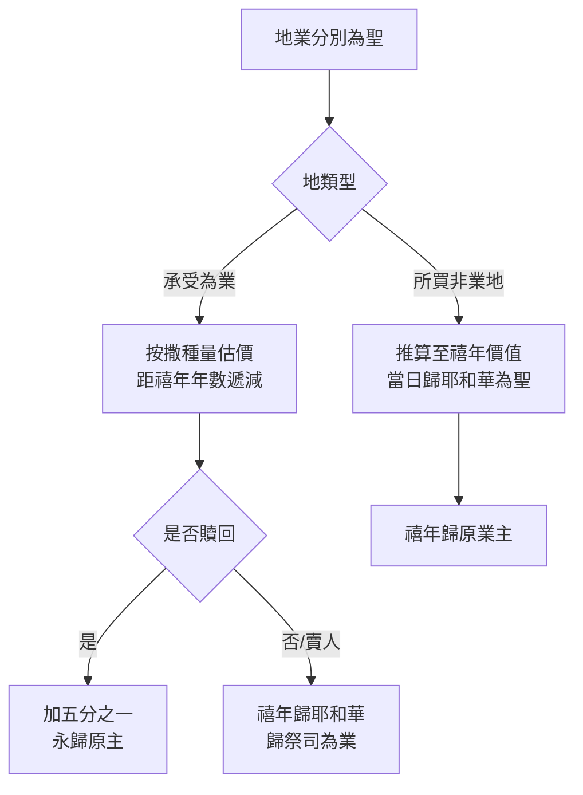

# 利未記 第27章

1. [[摩西|耶和華對摩西說]]：
2. 你[[以色列|曉諭以色列人]]說：[[許願估價條例|人還特許的願]]，[[許願估價條例|被許的人]]要[[許願估價條例|按你所估的價值]]歸給[[我是耶和華你們的神|耶和華]]。
3. 你估定的，從二十歲到六十歲的男人，要按[[許願估價條例|聖所的平]]，估定價銀[[許願估價條例|五十舍客勒]]。
4. 若是女人，你要估定[[許願估價條例|三十舍客勒]]。
5. 若是從五歲到二十歲，男子你要估定[[許願估價條例|二十舍客勒]]，女子估定十舍客勒。
6. 若是從一月到五歲，男子你要估定[[許願估價條例|五舍客勒]]，女子估定[[許願估價條例|三舍客勒]]。
7. 若是從六十歲以上，男人你要估定[[許願估價條例|十五舍客勒]]，女人估定[[許願估價條例|十舍客勒]]。
8. 他若[[寄居的（ger）|貧窮]]，不能照你所估定的價，就要把他帶到[[亞倫和他兒子（祭司）|祭司]]面前，祭司要按許願人的力量估定他的價。
9. [[牲畜許願不可更換|所許的若是牲畜]]，就是人[[牲畜許願不可更換|獻給耶和華為供物]]的，凡這一類獻給耶和華的，[[牲畜許願不可更換|都要成為聖]]。
10. 人[[牲畜許願不可更換|不可改換]]，也不可更換，或是[[牲畜許願不可更換|好的換壞的]]，或是[[牲畜許願不可更換|壞的換好的]]。若[[牲畜許願不可更換|以牲畜更換牲畜]]，所許的與所換的[[牲畜許願不可更換|都要成為聖]]。
11. 若[[不潔淨牲畜估價贖回|牲畜不潔淨]]，是[[不潔淨牲畜估價贖回|不可獻給耶和華為供物]]的，就要把牲畜[[不潔淨牲畜估價贖回|安置在祭司面前]]。
12. [[亞倫和他兒子（祭司）|祭司]]就要估定價值；[[不潔淨牲畜估價贖回|牲畜是好是壞]]，[[亞倫和他兒子（祭司）|祭司怎樣估定]]，就要以怎樣為是。
13. 他若[[不潔淨牲畜估價贖回|一定要贖回]]，就要在你所估定的價值以外加上五分之一。
14. [[房屋分別為聖估價贖回|人將房屋分別為聖]]，歸給[[我是耶和華你們的神|耶和華]]，[[亞倫和他兒子（祭司）|祭司]]就要估定價值。[[房屋分別為聖估價贖回|房屋是好是壞]]，[[亞倫和他兒子（祭司）|祭司怎樣估定]]，就要以怎樣為定。
15. 將[[房屋分別為聖估價贖回|房屋分別為聖]]的人，若要[[房屋分別為聖估價贖回|贖回房屋]]，就必在你所估定的價值以外加上五分之一，[[房屋分別為聖估價贖回|房屋仍舊歸他]]。
16. 人若[[地業分別為聖估價贖回|將承受為業的幾分地分別為聖]]，歸給[[我是耶和華你們的神|耶和華]]，你要[[地業分別為聖估價贖回|按這地撒種多少估定價值]]，若[[地業分別為聖估價贖回|撒大麥一賀梅珥]]，要[[地業分別為聖估價贖回|估價五十舍客勒]]。
17. 他若從[[禧年（yobel）|禧年]]將地分別為聖，就要以你所估定的價為定。
18. 倘若他[[地業分別為聖估價贖回|在禧年以後將地分別為聖]]，[[亞倫和他兒子（祭司）|祭司]]就要[[地業分別為聖估價贖回|按著未到禧年所剩的年數推算價值]]，也要[[地業分別為聖估價贖回|從你所估的減去價值]]。
19. 將地分別為聖的人若定要把地[[贖回加五分之一|贖回]]，他便要在你所估的價值以外加上五分之一，[[地業分別為聖估價贖回|地就准定歸他]]。
20. 他[[不潔淨牲畜頭生贖回|若不贖回]]那地，或是[[地業分別為聖估價贖回|將地賣給別人]]，[[地業分別為聖估價贖回|就再不能贖了]]。
21. 但到了[[禧年（yobel）|禧年]]，那地從買主手下出來的時候，就要歸[[我是耶和華你們的神|耶和華]]為聖，[[地業分別為聖估價贖回|和永獻的地一樣]]，要[[地業分別為聖估價贖回|歸祭司為業]]。
22. 他若將[[地業分別為聖估價贖回|所買的一塊地]]，[[地業分別為聖估價贖回|不是承受為業的]]，分別為聖歸給[[我是耶和華你們的神|耶和華]]，
23. [[亞倫和他兒子（祭司）|祭司]]就要將你所估的價值給他[[地業分別為聖估價贖回|推算到禧年]]。當日，他要以你所估的價銀為聖，歸給[[我是耶和華你們的神|耶和華]]。
24. 到了[[禧年（yobel）|禧年]]，那地要歸賣主，就是那[[地業分別為聖估價贖回|承受為業的原主]]。
25. 凡你所估定的價銀都要按著[[許願估價條例|聖所的平]]：二十季拉為一舍客勒。
26. 惟獨[[頭生牲畜不可再分別為聖|牲畜中頭生的]]，[[頭生牲畜不可再分別為聖|無論是牛是羊]]，[[頭生牲畜不可再分別為聖|既歸耶和華]]，[[頭生牲畜不可再分別為聖|誰也不可再分別為聖]]，[[頭生牲畜不可再分別為聖|因為這是耶和華的]]。
27. 若是[[不潔淨牲畜頭生贖回|不潔淨的牲畜生的]]，就要[[不潔淨牲畜頭生贖回|按你所估定的價值加上五分之一贖回]]；[[不潔淨牲畜頭生贖回|若不贖回]]，就要[[不潔淨牲畜頭生贖回|按你所估定的價值賣了]]。
28. 但[[永獻條例|一切永獻的]]，就是[[永獻條例|人從他所有永獻給耶和華的]]，無論是人，是牲畜，是他承受為業的地，[[永獻條例|都不可賣]]，[[永獻條例|也不可贖]]。[[永獻條例|凡永獻的是歸給耶和華為至聖]]。
29. [[永獻條例|凡從人中當滅的]][[永獻條例|都不可贖]]，必被治死。
30. [[什一條例|地上所有的]]，無論是[[什一條例|地上的種子]]是[[什一條例|樹上的果子]]，十分之一[[什一條例|是耶和華的]]，是歸給耶和華為聖的。
31. 人若要贖這十分之一的什麼物，就要加上五分之一。
32. 凡牛群羊群中，一切從[[杖下經過（taḥat haššēḇeṭ）|杖下經過]]的，每第十隻要歸給[[我是耶和華你們的神|耶和華]]為聖。
33. 不可問是好是壞，也不可更換；若定要更換，所更換的與本來的牲畜[[牲畜許願不可更換|都要成為聖]]，不可[[贖回加五分之一|贖回]]。
34. 這就是[[律例|耶和華在西乃山]]為[[以色列|以色列人]]所吩咐[[摩西]]的命令。

---

## 本章知識節點

### 神學
- [[許願估價條例]]
- [[牲畜許願不可更換]]
- [[不潔淨牲畜估價贖回]]
- [[房屋分別為聖估價贖回]]
- [[地業分別為聖估價贖回]]
- [[頭生牲畜不可再分別為聖]]
- [[不潔淨牲畜頭生贖回]]
- [[永獻條例]]
- [[什一條例]]
- [[永獻（cherem）]]
- [[贖回加五分之一]]
- [[更換牲畜雙方成聖]]
- [[杖下經過（taḥat haššēḇeṭ）]]
- [[當滅的必被治死]]
- [[什一]]
- [[不可問好壞不可更換]]

---

## 本章整理

### 人身許願估價（v1-8）
本章開啟 **[[許願估價條例]]**，規範以色列人因許願將人、牲畜、房屋、地業「分別為聖」歸給耶和華後的估價與贖回機制。祭司依「聖所的平」（二十季拉為一舍客勒，v25）估定價值。人身估價按年齡、性別分級（見下表），若許願人貧窮，祭司可按其力量酌減（v8），顯示神對窮人的體恤。

| 類別 | 年齡 | 男（舍客勒） | 女（舍客勒） |
|------|------|--------------|--------------|
| 成年 | 20–60 歲 | 50 | 30 |
| 青年 | 5–20 歲 | 20 | 10 |
| 幼童 | 1 月–5 歲 | 5 | 3 |
| 老年 | 60 歲以上 | 15 | 10 |

### 牲畜許願與更換條例（v9-13）
潔淨牲畜一經許願即成聖，**[[牲畜許願不可更換]]**；若強行更換，**[[更換牲畜雙方成聖]]**（v10）。不潔淨牲畜不可作壇上供物，須呈祭司估價，**[[不潔淨牲畜估價贖回]]** 時**[[贖回加五分之一]]**（v11-13）。此條例強調許願的嚴肅性與聖物不可輕易變更的原則。

### 房屋與地業分別為聖（v14-25）
房屋由祭司估價，**[[房屋分別為聖估價贖回]]** 同樣**[[贖回加五分之一]]**（v14-15）。地業分「承受為業的地」與「所買的地」兩類，**[[地業分別為聖估價贖回]]** 以撒種量（大麥一賀梅珥 = 五十舍客勒）為基準，並依距 **[[禧年（yobel）|禧年]]** 年數遞減（v16-19）。
- **承受地**：若不贖回或賣與他人，禧年歸耶和華為聖，歸祭司為業（v20-21）。
- **所買地**：禧年歸原業主（v22-24）。

### 頭生牲畜與永獻之物（v26-29）
**[[頭生牲畜不可再分別為聖]]**，因本屬耶和華（v26）。不潔淨頭生牲畜可**[[不潔淨牲畜頭生贖回]]**（加五分之一），否則按估價賣出（v27）。**[[永獻（cherem）|永獻]]**（cherem）之人、牲畜、地業**[[永獻條例]]** 規定**不可賣、不可贖**，屬 **[[至聖]]** 歸耶和華（v28）；**[[當滅的必被治死]]** 指被永獻滅絕之人不可贖回（v29）。

### 什一奉獻條例（v30-33）
**[[什一條例]]** 規定地產（種子、果子）與牲畜（牛羊）的十分之一歸耶和華為聖（**[[什一]]**）。地產什一若贖回**[[贖回加五分之一]]**（v31）。牲畜什一以 **[[杖下經過（taḥat haššēḇeṭ）|杖下經過]]** 第十隻為準，**[[不可問好壞不可更換]]**；若更換，**[[更換牲畜雙方成聖]]** 且不可贖回（v32-33）。此法確保什一奉獻的公義與隨機性。

### 總結：西乃山的命令（v34）
本章作為利未記的附錄，以「這就是耶和華在西乃山為以色列人所吩咐摩西的命令」收尾，將許願、永獻、什一等自願與義務奉獻納入 **[[盟約]]** 法度，提醒 **[[世世代代]]** 遵守 **[[律例]]**、**[[典章]]**、**[[誡命]]**，承認 **[[我是耶和華你們的神]]**。

**參考資料**
https://www.ccbiblestudy.org/Old%20Testament/03Lev/03CT27.htm
https://www.ccbiblestudy.org/Old%20Testament/03Lev/03GT27.htm
https://www.kingcomments.com/en/bible-studies/Lev/27
https://biblehub.com/study/leviticus/27.htm
