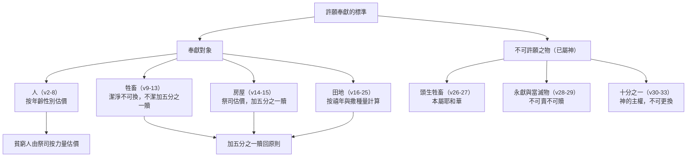

# 利未記 第27章

1. [[摩西|耶和華對摩西說]]：
2. 你曉諭以色列人說：[[許願|人還特許的願，被許的人要按你所估的價值歸給耶和華]]。
3. [[許願獻人估價表（年齡性別分級）|你估定的，從二十歲到六十歲的男人，要按聖所的平，估定價銀五十舍客勒]]。
4. [[三十舍客勒|若是女人，你要估定三十舍客勒]]。
5. 若是從五歲到二十歲，男子你要估定二十[[舍客勒]]，女子估定十舍客勒。
6. 若是從一月到五歲，男子你要估定五[[舍客勒]]，女子估定三舍客勒。
7. [[許願獻人估價表（年齡性別分級）|若是從六十歲以上，男人你要估定十五舍客勒，女人估定十舍客勒]]。
8. [[貧窮人由祭司按力量估價|他若貧窮，不能照你所估定的價，就要把他帶到祭司面前，祭司要按許願人的力量估定他的價]]。
9. 所許的若是牲畜，就是人獻給耶和華為供物的，凡這一類獻給耶和華的，都要成為聖。
10. [[奉獻牲畜不可更換條例|人不可改換，也不可更換，或是好的換壞的，或是壞的換好的]]。若以牲畜更換牲畜，所許的與所換的都要成為聖。
11. 若牲畜不潔淨，是不可獻給耶和華為供物的，就要把牲畜安置在祭司面前。
12. 祭司就要估定價值；牲畜是好是壞，祭司怎樣估定，就要以怎樣為是。
13. [[加五分之一贖回原則|他若一定要贖回，就要在你所估定的價值以外加上五分之一]]。
14. [[奉獻房屋估價贖回條例|人將房屋分別為聖，歸給耶和華，祭司就要估定價值]]。房屋是好是壞，祭司怎樣估定，就要以怎樣為定。
15. 將房屋分別為聖的人，若要贖回房屋，就必在你所估定的價值以外[[加五分之一贖回原則|加上五分之一]]，房屋仍舊歸他。
16. 人若將承受為業的幾分地分別為聖，歸給耶和華，[[奉獻田地的複雜計算（承受之地與買來之地的差別）|你要按這地撒種多少估定價值，若撒大麥一賀梅珥，要估價五十舍客勒]]。
17. 他若從禧年將地分別為聖，就要以你所估定的價為定。
18. 倘若他在禧年以後將地分別為聖，祭司就要按著未到禧年所剩的年數推算價值，也要從你所估的減去價值。
19. 將地分別為聖的人若定要把地贖回，他便要在你所估的價值以外[[加五分之一贖回原則|加上五分之一]]，地就准定歸他。
20. 他若不贖回那地，或是將地賣給別人，就再不能贖了。
21. 但到了禧年，那地從買主手下出來的時候，就要歸耶和華為聖，和永獻的地一樣，要歸祭司為業。
22. [[奉獻田地的複雜計算（承受之地與買來之地的差別）|他若將所買的一塊地，不是承受為業的，分別為聖歸給耶和華]]，
23. 祭司就要將你所估的價值給他推算到禧年。當日，他要以你所估的價銀為聖，歸給耶和華。
24. 到了禧年，那地要歸賣主，就是那承受為業的原主。
25. 凡你所估定的價銀都要按著聖所的平：[[舍客勒|二十季拉為一舍客勒]]。
26. [[頭生歸神|惟獨牲畜中頭生的，無論是牛是羊，既歸耶和華，誰也不可再分別為聖]]，因為這是耶和華的。
27. [[頭生歸神為聖|若是不潔淨的牲畜生的，就要按你所估定的價值加上五分之一贖回]]；若不贖回，就要按你所估定的價值賣了。
28. [[滅絕（herem）|但一切永獻的，就是人從他所有永獻給耶和華的]]，無論是人，是牲畜，是他承受為業的地，都不可賣，也不可贖。凡永獻的是歸給耶和華為至聖。
29. [[滅絕（herem）|凡從人中當滅的都不可贖，必被治死]]。
30. 地上所有的，無論是地上的種子是樹上的果子，[[十分之一|十分之一是耶和華的，是歸給耶和華為聖的]]。
31. [[加五分之一贖回原則|人若要贖這十分之一的什麼物，就要加上五分之一]]。
32. [[十分之一|凡牛群羊群中，一切從杖下經過的，每第十隻要歸給耶和華為聖]]。
33. 不可問是好是壞，也不可更換；若定要更換，所更換的與本來的牲畜都要成為聖，不可贖回。
34. [[摩西|這就是耶和華在西乃山為以色列人所吩咐摩西的命令]]。

---

## 本章知識節點

### 主題
- [[許願]]
- [[十分之一]]
- [[頭生歸神]]
- [[頭生歸神為聖]]
- [[滅絕（herem）]]

### 人物
- [[摩西]]

### 原文
- [[舍客勒]]
- [[三十舍客勒]]

### 文化
- [[許願獻人估價表（年齡性別分級）]]
- [[貧窮人由祭司按力量估價]]
- [[奉獻牲畜不可更換條例]]
- [[奉獻房屋估價贖回條例]]
- [[奉獻田地的複雜計算（承受之地與買來之地的差別）]]
- [[加五分之一贖回原則]]

---

## 本章整理

### 許願獻人與奉獻牲畜的條例（v1-13）

利未記全書以獻祭與聖潔生活開始，最終以[[許願]]奉獻的條例作結。本章論及人如何自願將自己、家人、牲畜、房屋或土地透過「特許的願」奉獻給神。CT指出，這裏的「特許的願」意指一個人把自己或家人、牲畜、房子或田地奉獻給耶和華。許願的人不需要把擁有權轉移，只要以合理的價錢代替；但若所許的是潔淨的牲畜，便不能贖回。GT補充說明，人通常在危急或困難時向神許願，事後卻容易後悔，因此聖經多次警告不可輕誓（申二十三21-23；箴二十25；傳五4-5）。

當人許願奉獻自己或家人時，需按[[許願獻人估價表（年齡性別分級）|年齡與性別的差異]]估定贖價。CT在靈意解經上指出，不同年齡與性別的估價表徵不同的靈性狀態：二十至六十歲男人估定五十[[舍客勒]]，表徵靈命成熟、能投入屬靈爭戰；六十歲以上估價反而降至十五舍客勒，表徵靈命衰老。CT強調：「在神的救贖裏沒有程度之分，但在奉獻裏卻有程度之分。」然而BH從歷史文化背景指出，這些數額是按照被贖之人的工作能力與預期勞動產值來評定，並不涉及靈性高低的暗示。若許願人貧窮無力支付，則適用[[貧窮人由祭司按力量估價|祭司按其力量特別估定]]的恩典條款。GT評論此條例顯明神體恤窮人，准他們按著力量服侍祂。

至於奉獻牲畜，潔淨的牲畜一經奉獻便[[奉獻牲畜不可更換條例|絕對不可更換]]。CT強調這說出神是何等急切希望得到人的奉獻，一奉獻就永不能更改。若奉獻不潔淨的牲畜，祭司需估定其價值，若物主定意贖回，則需適用[[加五分之一贖回原則|加五分之一贖回原則]]。GT說明，這加五分之一的規定無非是叫人小心，不冒失許願。

### 房屋、田地與不可贖之物的條例（v14-29）

人若將房屋分別為聖，祭司就要[[奉獻房屋估價贖回條例|估定價值並據此贖回]]。CT在靈意上將房屋預表為教會，指出在教會問題上的奉獻需要人出代價，而估價的祭司預表作中保的主耶穌，因此這代價是我們出得起的。奉獻田地的計算則更為複雜，涉及[[奉獻田地的複雜計算（承受之地與買來之地的差別）|承受之地與買來之地的差別]]。GT詳細解釋，承受為業的地要按撒種多少估定，並以禧年為基準計算剩餘年數；若不贖回或賣給別人，到了禧年那地就歸祭司為業。若是買來的地，到了禧年則要歸回原主。CT對此應用指出，有的人屬靈經歷是從別的業主暫時借來的，只有自己出代價得的那一分才算自己的。

本章後段論及三類不可再作為許願對象的「已屬神之物」。首先是[[頭生歸神|頭生的牲畜]]，因為牠們本就屬於耶和華。GT說明，頭生的公牛公羊若無殘疾要獻為祭物，若有殘疾則在自己家裏宰了吃。其次是[[滅絕（herem）|永獻與當滅之物]]。CT特別澄清，「永獻」與「當滅」在希伯來文均用 herem 一字，指歸與神不能取回之物，與人一般奉獻給神的有別。KC則從基督論的角度應用，指出當滅之物代表主耶穌在十字架上被當作罪受咒詛。對於人中當滅的，GT指出這多指犯了死罪或神定為當毀滅的敵人，必被治死，不可贖回。

### 十一奉獻與全書總結（v30-34）

最後，經文論及[[十分之一]]的條例。地上所有的種子、樹上的果子及牛羊群中每第十隻，都歸給耶和華為聖。GT強調，十分之一的物既是耶和華的，人就不得再將其分別為聖來還願。CT指出，十一奉獻是將神的物奉還給神，而非用來投資或換取祝福。KC則指出，繳納十一意味著承認神對我們所有財產擁有主權，祂有權得到最初與最好的。若人要贖回農產的十分之一，需加上五分之一；但牲畜的十分之一不可更換，若定要更換，兩隻都必歸為聖。

第34節作為全書總結：「這就是耶和華在西乃山為以色列人所吩咐摩西的命令。」CT指出，利未記全是神在西奈山賜給百姓的命令，神並沒有改變，祂的原則適用於世世代代。KC總結本章的屬靈意義時說：「這卷關於聖所的書，以我們個人和團體生活的奉獻作為結束，就是我們如何過奉獻的生活。」這是對「主，祢要我們如何與祢相交並事奉祢？」這問題的具體回答。

> [!quote] CT的靈意解經與BH的歷史背景對照
> CT將估價表靈意解讀為信徒靈命的強弱階級，並強調「在神的救贖裏沒有程度之分，但在奉獻裏卻有程度之分」。然而BH指出，古代近東文化（如吾珥南模法典、漢摩拉比法律）中，此類人身估價是按照年齡、性別與工作能力來評定賠償或贖價的慣例，屬於社會經濟層面的制度，而非靈性高低的隱喻。兩者詮釋角度截然不同。

> [!important] 不可贖回的「當滅之物」
> GT特別指出，「永獻」與「當滅」在希伯來文均用 herem 一字。亞干的罪正是因為取了當滅之物（書七10-26），招致神烈怒。這類物一旦獻上，便不可賣也不可贖，人中當滅的甚至必被治死，彰顯神對罪的嚴厲審判。

**參考資料**
https://www.ccbiblestudy.org/Old%20Testament/03Lev/03CT27.htm
https://www.ccbiblestudy.org/Old%20Testament/03Lev/03GT27.htm
https://www.kingcomments.com/en/bible-studies/Lev/27
https://biblehub.com/study/leviticus/27.htm
