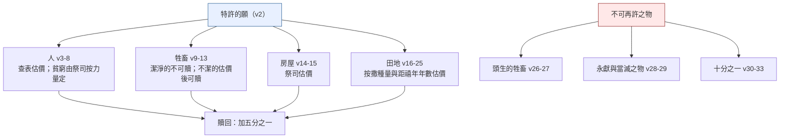

# 利未記 第27章

<!-- chapter-navigation:start -->
| [前一章](../03%20利未記/第26章.md) | [回目錄](../03%20利未記/全書目錄及綱要.md) |  |
| :--- | :---: | ---: |
<!-- chapter-navigation:end -->

1. [[摩西|耶和華對摩西說]]：
2. 你曉諭以色列人說：[[許願|人還特許的願，被許的人要按你所估的價值歸給耶和華]]。
3. [[許願獻人估價表（年齡性別分級）|你估定的，從二十歲到六十歲的男人，要按聖所的平，估定價銀五十舍客勒]]。
4. [[三十舍客勒|若是女人，你要估定三十舍客勒]]。
5. 若是從五歲到二十歲，男子你要估定二十[[舍客勒]]，女子估定十舍客勒。
6. 若是從一月到五歲，男子你要估定五[[舍客勒]]，女子估定三舍客勒。
7. [[許願獻人估價表（年齡性別分級）|若是從六十歲以上，男人你要估定十五舍客勒，女人估定十舍客勒]]。
8. [[貧窮人由祭司按力量估價|他若貧窮，不能照你所估定的價，就要把他帶到祭司面前，祭司要按許願人的力量估定他的價]]。
9. 所許的若是牲畜，就是人獻給耶和華為供物的，凡這一類獻給耶和華的，都要成為聖。
10. [[奉獻牲畜不可更換條例|人不可改換，也不可更換，或是好的換壞的，或是壞的換好的]]。若以牲畜更換牲畜，所許的與所換的都要成為聖。
11. 若牲畜不潔淨，是不可獻給耶和華為供物的，就要把牲畜安置在祭司面前。
12. 祭司就要估定價值；牲畜是好是壞，祭司怎樣估定，就要以怎樣為是。
13. [[加五分之一贖回原則|他若一定要贖回，就要在你所估定的價值以外加上五分之一]]。
14. [[奉獻房屋估價贖回條例|人將房屋分別為聖，歸給耶和華，祭司就要估定價值]]。房屋是好是壞，祭司怎樣估定，就要以怎樣為定。
15. 將[[奉獻房屋估價贖回條例|房屋分別為聖]]的人，若要贖回房屋，就必在你所估定的價值以外[[加五分之一贖回原則|加上五分之一]]，房屋仍舊歸他。
16. 人若將承受為業的幾分地分別為聖，歸給耶和華，[[奉獻田地的複雜計算（承受之地與買來之地的差別）|你要按這地撒種多少估定價值，若撒大麥一賀梅珥，要估價五十舍客勒]]。
17. 他若從[[禧年（第五十年）|禧年]]將地分別為聖，就要以你所估定的價為定。
18. 倘若他在[[禧年（第五十年）|禧年]]以後將地分別為聖，祭司就要按著未到禧年所剩的年數推算價值，也要從你所估的減去價值。
19. 將地分別為聖的人若定要把地贖回，他便要在你所估的價值以外[[加五分之一贖回原則|加上五分之一]]，地就准定歸他。
20. 他若不贖回那地，或是將地賣給別人，就再不能贖了。
21. 但到了[[禧年（第五十年）|禧年]]，那地從買主手下出來的時候，就要歸耶和華為聖，和永獻的地一樣，要歸祭司為業。
22. [[奉獻田地的複雜計算（承受之地與買來之地的差別）|他若將所買的一塊地，不是承受為業的，分別為聖歸給耶和華]]，
23. 祭司就要將你所估的價值給他推算到[[禧年（第五十年）|禧年]]。當日，他要以你所估的價銀為聖，歸給耶和華。
24. 到了[[禧年（第五十年）|禧年]]，那地要歸賣主，就是那承受為業的原主。
25. 凡你所估定的價銀都要按著聖所的平：[[舍客勒|二十季拉為一舍客勒]]。
26. [[頭生歸神|惟獨牲畜中頭生的，無論是牛是羊，既歸耶和華，誰也不可再分別為聖]]，因為這是耶和華的。
27. [[頭生歸神為聖|若是不潔淨的牲畜生的，就要按你所估定的價值加上五分之一贖回]]；若不贖回，就要按你所估定的價值賣了。
28. [[滅絕（herem）|但一切永獻的，就是人從他所有永獻給耶和華的]]，無論是人，是牲畜，是他承受為業的地，都不可賣，也不可贖。凡永獻的是歸給耶和華為至聖。
29. [[滅絕（herem）|凡從人中當滅的都不可贖，必被治死]]。
30. 地上所有的，無論是地上的種子是樹上的果子，[[十分之一|十分之一是耶和華的，是歸給耶和華為聖的]]。
31. [[加五分之一贖回原則|人若要贖這十分之一的什麼物，就要加上五分之一]]。
32. [[十分之一|凡牛群羊群中，一切從杖下經過的，每第十隻要歸給耶和華為聖]]。
33. 不可問是好是壞，也不可更換；若定要更換，所更換的與本來的牲畜都要成為聖，不可贖回。
34. [[摩西|這就是耶和華在西乃山為以色列人所吩咐摩西的命令]]。

---

## 本章知識節點

### 主題
- [[許願獻人估價表（年齡性別分級）]]
- [[貧窮人由祭司按力量估價]]
- [[奉獻牲畜不可更換條例]]
- [[奉獻房屋估價贖回條例]]
- [[奉獻田地的複雜計算（承受之地與買來之地的差別）]]
- [[加五分之一贖回原則]]
- [[禧年土地贖回計算法（按距禧年年數定價）]]

### 原文
- [[舍客勒]]
- [[十分之一]]
- [[禧年（第五十年）]]

### 神學
- [[滅絕（herem）]]
- [[頭生歸神]]

### 歷史
- [[頭生歸神為聖]]

### 文化
- [[許願]]

### 背景
- [[古代近東法典]]

### 互文
- [[三十舍客勒]]

### 人物
- [[摩西]]

---

## 本章整理

### 許願是什麼，為什麼要立法管它（v1-2）

利未記第26章講完了祝福與咒詛，全書其實已經收尾（26:46）。第27章是接在結語之後的附篇，題目只有一個：人主動向神許的願，該怎麼還。

GT《串珠聖經註釋》點出兩章之間的呼應：「上章論及神向子民的『許願』，本章則論及以色列民向神許願的律例。」它接著說明立法的理由很現實：「人通常比較容易在危急或困難時候向神許願，而事後卻後悔甚至不願還願。」GT《聖經精讀本》把制度的分寸講清楚：「不許願並不是罪。一旦許願，就應該誠實地按良心履行。」

[[許願|許願]]這件事本身不是以色列獨有的。GT《舊約聖經背景註釋》說：「古代近東大部分文化，都有關乎許願的資料。這些文化包括了赫人、烏加列、美索不達米亞，和埃及。」它並定義了願的性質：「願是自動與神明建立的協定……願通常是有條件的，並同時向神明祈求。」KC 從動機面補上一句：許願的人「通常是在患病或危險迫近的時候」這樣做，條件是得醫治或得拯救。

STEP語言資料顯示，第2節「特許的願」的動詞是 פָּלָא 的 Hiphil יַפְלִא（H6381），詞典義是 to wonder；CT 的〔原文字義〕給的是「奇妙的，卓越的，超凡的」，方向一致。「願」是 נֶדֶר（H5088），「所估的價值」是 עֵרֶךְ（H6187，詞典義 valuation），而「被許的人」是 נֶפֶשׁ 的複數 נְפָשֹׁת（H5315J，本節譯作 persons）。

### 人的估價：一張表與兩種讀法（v3-8）

[[許願獻人估價表（年齡性別分級）|估價表]]按性別與年齡分成四段。

| 年齡 | 男 | 女 |
| --- | --- | --- |
| 一月至五歲 | 5 [[舍客勒]] | 3 舍客勒 |
| 五歲至二十歲 | 20 舍客勒 | 10 舍客勒 |
| 二十歲至六十歲 | 50 舍客勒 | 30 舍客勒 |
| 六十歲以上 | 15 舍客勒 | 10 舍客勒 |

**這張表按什麼定價，來源分成兩派，而且兩派都說得很明白。**

一派讀經濟。GT《舊約聖經背景註釋》：「決定那奉獻在聖殿事奉之人贖身的相對數額，所根據的條件有四：年齡、性別、工作能力、付款能力。其背後的假設，是成年男子從二十至六十歲勞工的總值是五十舍客勒。」同一則註釋把這張表放進古代法律的傳統：「吾珥南模法典，以及埃施嫩納和漢摩拉比法律中，按照被害人所受的傷害、年齡、社會地位和性別規定罰款的人身傷害條例，都與之相近」——[[古代近東法典|同型的人身估價條例]]在鄰邦法典裡並不罕見。GT《利未記雷氏研讀本》說得更直接：「奉獻給耶和華之男人或女人的估值，顯然是根據他在某個年限作雇工的工價。」BH 也屬這一派，並補上一句分寸：這反映的是「當時社會的規範，而非神對不平等的認可」。

另一派讀靈意。CT 逐格解釋：二十至六十歲的男人「表徵靈命成熟，靈性剛強，能投入屬靈爭戰的人」，六十歲以上「表徵靈命衰老，靈性有問題的人」。他並把這張表與出埃及記三十章的贖價明確切開：「這裏是講還特許的願的估價，與出三十11~16的生命價銀不同。生命的價銀是指救恩。從救恩看來，神看我們都值半舍客勒，貧富老幼都是一樣的價值。」KC 走同一條路，卻自己補上反例：年老估價暴跌「可能與屬靈生命的退落有關」，但緊接著說「摩西一百二十歲、迦勒八十五歲，他們屬靈生命的力量卻沒有衰減」。

有兩個數字值得單獨看。GT 丁良才指出女人的[[三十舍客勒]]「本是奴婢的代價（出二十一32），也是猶大賣耶穌所得之價銀的數目（太二十七9）」；BH 也提到同一組數字。KC 把它推到基督身上：「按祂的年齡，主耶穌本當被估價五十舍客勒。然而祂被估定的價銀只有三十舍客勒。」

GT《舊約聖經背景註釋》另外算了一筆帳，說明這種願有多罕見：贖價最高的五十舍客勒「達僱工年薪的多倍。由此可見許下這種願的人不多，因為願一旦許下，就不可不還。他們根本付不起這個價錢」。

也正因如此，第8節的[[貧窮人由祭司按力量估價|貧窮條款]]才是這張表的關鍵出口。丁良才：「這是顯明神體恤窮人，准他們按著力量服侍祂。」BH 把它連到馬可福音十二41-44 寡婦的兩個小錢，並說祭司訂價的角色「凸顯了律法之中的彈性與體恤」。

### 牲畜、房屋、田地：三種對象，一套機制（v9-25）

從第9節起，估價的對象換成財物，機制卻是同一套：祭司估價，原主想贖回就[[加五分之一贖回原則|加五分之一]]。

```mermaid
flowchart TD
    A["特許的願（v2）"] --> B["人 v3-8<br/>查表估價；貧窮由祭司按力量定"]
    A --> C["牲畜 v9-13<br/>潔淨的不可贖；不潔的估價後可贖"]
    A --> D["房屋 v14-15<br/>祭司估價"]
    A --> E["田地 v16-25<br/>按撒種量與距禧年年數估價"]
    B --> F["贖回：加五分之一"]
    C --> F
    D --> F
    E --> F
    G["不可再許之物"] --> G1["頭生的牲畜 v26-27"]
    G --> G2["永獻與當滅之物 v28-29"]
    G --> G3["十分之一 v30-33"]
    style A fill:#e8f0ff,stroke:#369
    style G fill:#ffe8e8,stroke:#933
```

[[奉獻牲畜不可更換條例|牲畜這一段]]有全章語氣最硬的一條禁令：「人不可改換，也不可更換，或是好的換壞的，或是壞的換好的。」==兩個動詞是不是同一個意思，來源之間有分歧。== GT 丁良才主張同義：「『改換』和『更換』兩樣動字的意思是相同的，因為希伯來的文法常用兩樣的字重複一樣的意思。」CT 則並列兩種可能：「(1)意思相同；(2)改換指改換牲畜的種類，更換指同種牲畜的更換。」STEP語言資料能確認的是：這是兩個不同的字——「改換」是 חָלַף（H2498，本節譯作 substitute），「更換」是 מוּר（H4171，本節譯作 exchange）；而後半句「若定要更換」用的是 מוּר 的不定詞絕對式加未完成式連用，是希伯來文加強語氣的結構，句末「所換的」則是同字根的名詞 תְּמוּרָה（H8545）。至於兩個動詞在本節是同義並列還是各指一類，仍是註釋家的判斷。丁良才把兩個方向的動機都點了出來：好換壞「是出於吝嗇和為己的心」，壞換好「這雖是出於好意，按例也是不可的」。

[[奉獻房屋估價贖回條例|房屋]]只用了兩節，丁良才卻補上一個經文沒說的範圍：「這大概是論城裡的房屋說的。至於分別鄉下住宅為聖的條例和分別承受為業之地的條例是一樣的。」KC 注意到房屋這題目在利未記出現過兩次而方向相反：「在利未記十四章，房屋可能長大痲瘋，那是消極的；在這裡，房屋卻可以分別為聖歸給神，那是積極的。」

[[奉獻田地的複雜計算（承受之地與買來之地的差別）|田地]]最複雜，因為牽涉三個變數。**面積用種子量來算**，丁良才解釋原因：「肥沃之地既複得密，行列也近，所以用得子粒就多；蹺瘠之地雖然地面一樣大，卻因行列遠，種得稀，用得種子就少，按此法定地的價值，是最相宜的。」**時間用[[禧年（第五十年）|禧年]]來算**，照[[禧年土地贖回計算法（按距禧年年數定價）|距禧年剩幾年折價]]，與利未記二十五章買賣土地的算法是同一套。丁良才並算出這個地價其實低得離譜——五十舍客勒攤到五十年，每年只合一舍客勒；CT 記下同一觀察並補上用意：「用意是要地主不隨便出賣田地。」

**祖業與買來的地，結局完全相反。** 祖業若不贖回，到禧年永久歸祭司；買來的地到禧年歸回原賣主。第20節那句「或是將地賣給別人」到底指什麼，丁良才並列了四種解法：原主奉獻後未贖回又賣掉、原主按估價陸續付租錢後因使用不便賣掉、原主在奉獻以前就已賣掉、或是祭司按估價把地賣了。四種解法的結局相同——到禧年那地歸祭司。GT《舊約聖經背景註釋》為這個結局補上外部證據：「赫人、埃及和美索不達米亞的文獻，證明了廟宇團體擁有土地，並且藉其出產得利」，但同時指出以色列的不同——「在聖經裡，惟有在業主未能贖回土地的情況下，這種事才會發生」。

第25節把所有數字的基準訂死：「凡你所估定的價銀都要按著聖所的平：二十季拉為一舍客勒。」KC 把這一節讀成全章的準則：「一切據以判斷的標準，就是聖潔的舍客勒，聖所的舍客勒，就是神居住之處的舍客勒。」GT《聖經精讀本》指出當時通行的舍客勒不只一種：「有三種：①只在聖所通用的舍客勒；②一般人通用的舍客勒；③王室使用的舍客勒。」而聖所舍客勒到底比常用的重還是輕，GT《舊約聖經背景註釋》承認沒有定論：「學者大致認為秤銀子所用的聖所舍客勒比常用的舍客勒為輕，但卻沒有確實的證據。考古學家挖掘到的舍客勒法碼，重量在九又十分之三至十又二分之一克之間。」丁良才另記下「季拉」的來歷：「『季拉』兩個字的原文，本是豆子的意思，後來卻成了一個法碼的名字。」

### 三樣不可以許的：本來就是神的（v26-33）

第26節起換了題目。丁良才把結構標得很清楚：前面二十四節論四種可以許的東西，這一段論**三種不可許之物**——[[頭生歸神|頭生的牲畜]]、[[滅絕（herem）|永獻和當滅的物]]、[[十分之一]]。理由只有一個：它們本來就已經屬於神，不能再拿來當作自己的奉獻。

頭生的牲畜屬耶和華是出埃及記十三2 就定下的。KC 由此推出一個原則：「奉獻同時也是一種義務。我們不是自己的人，我們是『重價買來的』，因此有責任榮耀神。」至於[[頭生歸神為聖|不潔淨牲畜所生的頭生]]（v27），丁良才指出這裡的規定比舊例寬鬆：從前是「用羊羔贖驢，若不代贖，就要打折他的頸項」（出十三13、三十四20），本章則「將這條例略加更改推廣，使這條例包括一切不潔淨之頭生的牲畜，神准物主用銀贖回，也准祭司賣與別人」。

**「永獻」與「當滅」在原文是同一個字，這一點各家都指出過，而 STEP 可以把它釘死。** CT〔話中之光〕：「『永獻』與『當滅』在希伯來文均用herem一字，指歸與神不能取回之物，與人奉獻給神的有別。」GT《啟導本聖經利未記註釋》說法相同，並舉出實例：「在以色列人歷史上，神指定某些戰利品或俘虜要完全歸祂，人不可佔有（書六17）。亞干的罪招神烈怒，正是因為取了永獻之物。」STEP語言資料顯示，第28與29節都用名詞 חֵרֶם（H2764A）與動詞 חָרַם（H2763A）；差別在語態——第28節是 Hiphil יַחֲרִם（人主動把東西獻上毀滅），第29節是 Hophal יָחֳרַם（人被獻上毀滅）。這個語態差別正好對上丁良才對兩節的分工：「在28節是論各人隨意行的，在本節是論官長所可以行的。」

同樣值得留意的是「不可贖」在這兩節用了兩個不同的字：第28節是 גָּאַל（H1350A），與前面房屋、田地贖回同字；第29節是 פָּדָה（H6299，詞典義 to ransom）。GT《舊約聖經背景註釋》列出哪些罪落在第29節的範圍：「被判犯了拜假神（出二十二19）、違犯當滅之物的禁令（書七13～26）、謀殺（民三十五31～34），或故意觸犯潔淨禮儀（如赫人文獻）的人，不可贖回。」KC 則把這一節接到十字架：當滅之物歸耶和華，「主耶穌在祂於十字架上成為罪的那幾個小時裡，是在咒詛之下」。

### 十分之一與全書的結語（v30-34）

第三樣不可許的是十分之一。STEP語言資料顯示，第30與32節用的都是 מַעֲשֵׂר（H4643，詞典義 tithe），一次指地的出產、一次指牛群羊群。

丁良才指出這條例在律法裡出現得很晚，但實踐得很早：「在摩西的律法上，本處以前沒有提到十分之一的條例，但自古以來，敬畏神的人就已經按十分之一捐給神（創十四20，二十八22）。」GT《啟導本聖經利未記註釋》把舊約的三種什一奉獻列出來：每年出產的十分之一給利未人、節期慶典中奉獻者自己享用的、以及每三年一次周濟窮人的。

第32節「一切從杖下經過的」是一個具體到可以看見的畫面。丁良才記下猶太人的做法：「以色列人從牲畜中取十分之一的時候，就將當年所生的牛羊圈在圈內，牧人要在放出的時候用杖點數，每數到第十只就用紅色點印，凡被點印的就是應歸耶和華的。」GT《利未記雷氏研讀本》的說法相同——用沾了顏料的杖在每第十隻身上作記號。BH 讀出這個做法的用意：「每隻牲畜是在牠經過杖下的那一刻被選中的，而不是由主人挑選的」，因此十分之一無法被動手腳。

**十分之一該不該原封搬進新約，丁良才給了一段很清楚的保留。** 他先說明律法時代為什麼要定額，接著說：「新約上雖常提到信徒捐輸的本分，卻沒有一次規定十分之－為信徒捐輸的額數，這無非是因為律法如訓蒙的師傅，嚴定了－切的條例，但神既使信徒脫離律法的轄制，得著兒子的名分，就不容所規定的律例再束縛一切相信祂名的人。」他的結論不是少捐，而是「現在的信徒既然得了更高的名分，蒙了更大的恩典，也就應當在捐輸的事上比以色列人更熱心」。CT 的角度不同但不衝突：「所謂的『十一奉獻』，其實是將神的物奉還給神，歸給祂為聖。」KC 的說法最短：「繳納十分之一意味著承認神對我們一切所有的主權。」

全書的最後一節是第34節：「這就是耶和華在西乃山為以色列人所吩咐[[摩西]]的命令。」丁良才指出這個「這」字管的不只是本章：「本節的『這』字是指著利未記全書說的。」KC 也把本章讀成全書問題的答案：「這卷關於聖所的書，以我們個人和團體生活的奉獻作為結束，就是我們如何過奉獻的生活。這是對本書一路提出的那個問題的回答——主啊，祢要我們如何與祢相交、如何事奉祢？」

> [!note] 為什麼利未記要用這一章收尾
> 丁良才在第26章46節下就先解釋過：「有好些注釋家以本節為利未記全書的總結，這樣，第二十七1至34節就可說是附篇，正如約二十一章是約翰福音的附篇一樣。」附篇不等於次要——全書從第1章的「人怎樣獻祭親近神」開始，到這裡收在「人怎樣把自己交給神」。CT 的話可以放在一起讀：「本章開始於人如何親近神、享受神，結束於人如何許願奉獻給神、讓神享受。」

**參考資料**
https://www.ccbiblestudy.org/Old%20Testament/03Lev/03CT27.htm
https://www.ccbiblestudy.org/Old%20Testament/03Lev/03GT27.htm
https://www.kingcomments.com/en/bible-studies/Lev/27
https://biblehub.com/study/leviticus/27.htm
https://github.com/STEPBible/STEPBible-Data

<!-- chapter-navigation:start -->
| [前一章](../03%20利未記/第26章.md) | [回目錄](../03%20利未記/全書目錄及綱要.md) |  |
| :--- | :---: | ---: |
<!-- chapter-navigation:end -->
