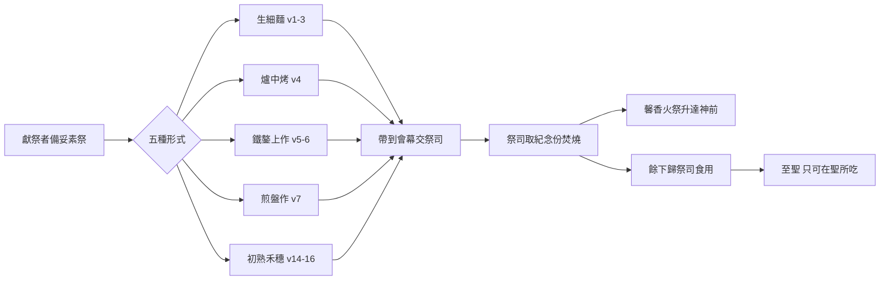
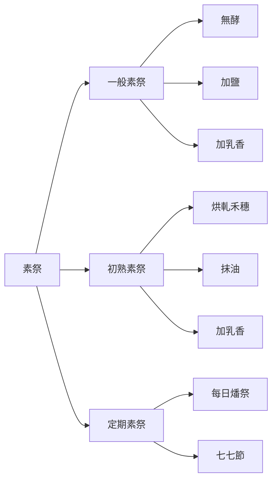

# 利未記 第2章

1. 若有人獻[[素祭（minchah）|素祭]]為[[供物（qorban）|供物]]給耶和華，要用細麵澆上油，加上乳香，
2. 帶到[[亞倫和他兒子（祭司）|亞倫子孫作祭司]]的那裡；祭司就要從細麵中取出一把來，並取些油和所有的乳香，然後要把所取的這些[[紀念份|作為紀念]]，燒在壇上，是獻與耶和華為[[馨香之氣|馨香]]的火祭。
3. [[素祭（minchah）|素祭]]所剩的要歸給[[亞倫和他兒子（祭司）|亞倫和他的子孫]]；這是獻與耶和華的火祭中為[[至聖的供物（聖與至聖之分）|至聖]]的。
4. 若用爐中烤的物為[[素祭（minchah）|素祭]]，就要用調油的無酵細麵餅，或是抹油的無酵薄餅。
5. 若用鐵鏊上做的物為[[素祭（minchah）|素祭]]，就要用調油的無酵細麵，
6. 分成塊子，澆上油；這是[[素祭（minchah）|素祭]]。
7. 若用煎盤做的物為[[素祭（minchah）|素祭]]，就要用油與細麵做成。
8. 要把這些東西做的[[素祭（minchah）|素祭]]帶到耶和華面前，並奉給[[亞倫和他兒子（祭司）|祭司]]，帶到壇前。
9. [[亞倫和他兒子（祭司）|祭司]]要從[[素祭（minchah）|素祭]]中取出[[紀念份|作為紀念]]的，燒在壇上，是獻與耶和華為[[馨香之氣|馨香]]的火祭。
10. [[素祭（minchah）|素祭]]所剩的要歸給[[亞倫和他兒子（祭司）|亞倫和他的子孫]]。這是獻與耶和華的火祭中為[[至聖的供物（聖與至聖之分）|至聖]]的。
11. 凡獻給耶和華的[[素祭（minchah）|素祭]]都不可有酵；因為你們不可燒[[素祭不可有酵與蜜|一點酵]]、[[素祭不可有酵與蜜|一點蜜]]當作火祭獻給耶和華。
12. 這些物要獻給耶和華作為[[初熟（bikkurim）|初熟]]的[[供物（qorban）|供物]]，只是不可在壇上獻為[[馨香之氣|馨香]]的祭。
13. 凡獻為[[素祭（minchah）|素祭]]的[[供物（qorban）|供物]]都要用鹽調和，在素祭上不可缺了你神[[立約的鹽]]。一切的供物都要配鹽而獻。
14. 若向耶和華獻[[初熟（bikkurim）|初熟]]之物為[[素祭（minchah）|素祭]]，要獻上烘了的禾穗子，就是軋了的新穗子，當作初熟之物的素祭。
15. 並要抹上油，加上乳香；這是[[素祭（minchah）|素祭]]。
16. [[亞倫和他兒子（祭司）|祭司]]要把其中[[紀念份|作為紀念]]的，就是一些軋了的禾穗子和一些油，並所有的乳香，都焚燒，是向耶和華獻的火祭。

---

## 本章知識節點

### 原文
- [[供物（qorban）]]
- [[初熟（bikkurim）]]
- [[素祭（minchah）]]
- [[紀念份]]

### 神學
- [[馨香之氣]]
- [[初熟果子]]
- [[燔祭]]

### 人物
- [[亞倫和他兒子（祭司）]]

### 主題
- [[素祭的五種形式]]
- [[素祭不可有酵與蜜]]
- [[立約的鹽]]
- [[至聖的供物（聖與至聖之分）]]

### 背景
- [[古代近東的獻祭與燔祭習俗]]

### 文化
- [[香料乳香沒藥貿易]]

---

## 本章整理

### 素祭的材料與基本手續（v1-3）

利未記第二章承接燔祭條例，轉向**唯一無血的自願獻祭——[[素祭（minchah）|素祭]]**。經文開宗明義：「若有人獻素祭為[[供物（qorban）|供物]]給耶和華，要用細麵澆上油，加上乳香」（v1）。三樣核心材料各有神學指涉：細麵經過多次篩選，象徵基督完美無瑕、均勻一致的人性（CT 靈意註解：「預表基督的清潔，精細和無過與不及的品格」）；油為橄欖油，表徵聖靈的膏抹與同在（GT 丁良才：「預表耶穌所受的聖靈」）；乳香產自阿拉伯半島南部與索馬利蘭一帶，雨量氣溫土壤不合便不生長，是[[香料乳香沒藥貿易|近東駱駝商隊貿易]]的主要商品，全數焚燒升為馨香之氣（GT《舊約聖經背景註釋》）。

獻祭流程嚴謹：獻祭者將素祭帶到會幕交給[[亞倫和他兒子（祭司）|祭司]]，祭司從細麵中取「一把」（滿手掌）連同油與**所有乳香**，在壇上焚燒作為**[[紀念份]]**，成為「獻與耶和華為馨香的火祭」（v2）。其餘細麵歸祭司食用，屬「[[至聖的供物（聖與至聖之分）|至聖]]」，只可在聖所吃，不可攙酵（v3, 10）。CT 指出：祭司若為自己獻素祭，全數焚燒不可吃（參利 6:23），這區別於平安祭「聖物」可給祭司家屬食用的規定；GT《舊約聖經背景註釋》並指出，猶太拉比認為素祭是為窮人而設，可取代燔祭，美索不達米亞亦有為窮人作類似安排的記錄。

> [!quote] 來源對照
> - **CT 文意註解**：「素祭此名詞在希伯來文含有禮物或貢物的意味，是一種自願的獻祭，敬拜者藉此向所敬拜的神表明忠貞與感恩的心意，也間接供應祭司們生活所需的食物。」
> - **GT 丁良才**：「素祭的材料就是人從地裡勞力所得的出產，因此也就表示人的工作，教訓我們當把自己的工獻與神。」
> - **BH**：「素祭，又稱『穀物祭』或希伯來文『minchah』，是一種自願的敬拜與奉獻之舉，有別於動物獻祭，象徵將自己的勞力與生活所需獻給神。」

### 五種烹製形式與火的試驗（v4-10）

本章列出[[素祭的五種形式|素祭的五種形式]]，對應不同烹飪器具與火候，預表基督受苦的層面（CT 靈意註解、GT 丁良才）：

| 形式 | 經文 | 器具 | 預表重點 |
|------|------|------|----------|
| 1. 生細麵 | v1-3 | — | 基督純潔人性的根基 |
| 2. 爐中烤 | v4 | 罐形瓦爐（高熱、隱藏） | 隱藏的苦難、人眼看不到 |
| 3. 鐵鏊上作 | v5-6 | 鐵板/烙盤（中火、可見） | 從人來的難處、被擘開分成塊子 |
| 4. 煎盤作 | v7 | 深鍋（大火） | 從魔鬼來的試探、劇烈痛苦 |
| 5. 初熟禾穗 | v14-16 | 火烘、手軋 | 復活初熟果子、十字架對付 |

所有烤製餅餌皆須「無酵」（v4, 5），這與後文[[素祭不可有酵與蜜|不可有酵與蜜]]的總則相呼應（太 16:6；林前 5:6-8）。**鹽**卻是必須的：「一切的供物都要配鹽而獻」（v13），鹽防腐、持久，稱為「[[立約的鹽|你神立約的鹽]]」，見證神約的永恆不渝（民 18:19；代下 13:5）。KC 指出：「鹽代表持久和不腐敗的性質」，基督十字架功效歷久彌新。

> [!note] 來源差異提示
> - **CT** 強調五種形式預表基督受苦的不同層面（爐＝神側隱藏苦難、鐵鏊＝人側難處、煎盤＝魔鬼試探）。
> - **KC** 則較保守：「用煎盤做的素祭是最小的獻祭……甚至連『無酵』這字眼都沒有出現，這表明對主耶穌完全無罪的認識有所欠缺。」
> - **BH** 著重歷史背景：「爐子通常是共用的、以泥土製成，反映敬拜生活的群體性。」

### 一般總則：酵、蜜與立約的鹽（v11-13）

v11-13 為**普遍條例**，[[素祭不可有酵與蜜|不可有酵與蜜]]是其中最重要的一項：
1. **不可有酵、蜜**焚燒於壇上（v11）——CT：「酵是一種真菌，能使麵團發起來，亦會使它發霉變壞，所以預表罪」；蜜是天然發甜的，古時有用蜜做酵素，故與酵同樣當為不潔。
2. **酵、蜜可作初熟供物**獻給神，但不上壇為馨香火祭（v12）——GT 丁良才：「因為酵和蜜列在初熟的供物中（二十三17，申二十六2、12，參代下三十一5)」，歸祭司食用（民 18:13）。
3. **一切素祭必加鹽**，不可缺「[[立約的鹽]]」（v13）——CT：鹽有防腐作用，所有祭品都要加上鹽，表示神與以色列人的盟約是永恆不渝的；古代近東立約時常共食含鹽的筵宴，聖經也用「鹽約」形容主和以色列所立的約（民 18:19；代下 13:5）。

### 初熟之物的素祭（v14-16）

v14-16 處理**初熟之物素祭**：獻上「烘了的禾穗子，就是軋了的新穗子」（v14），抹油加乳香，祭司取[[紀念份]]焚燒（v15-16）。CT 靈意註解：「初熟之物表徵基督復活成了初熟的果子」（林前 15:20, 23），也預表信徒須經十字架對付（烘、軋），使復活生命成熟方能為神所用。這是[[初熟（bikkurim）|初熟（bikkurim）總則]]下首次出現的具體操作程序，也深化了[[初熟果子]]在利未記祭禮體系中的具體分類——v12 酵蜜製的初熟供物只能歸祭司食用、不可上壇；本段的禾穗初熟素祭則可正式獻在壇上為馨香的火祭。

### 跨章脈絡：素祭與燔祭的次序、與信徒事奉的預表

GT／丁良才指出：「素祭和燔祭原是相連的……因為這兩種祭都是獻心祭，故此素祭的條例接續燔祭的條例也是合宜的」——[[燔祭]]與素祭常同獻（民二十九6,11,16等「常獻的燔祭」同獻「同獻的素祭」；民二十八1-5每日早晚燔祭同獻素祭）。KC 更進一步指出兩者的神學次序：「從歷史角度看，素祭——基督生平的圖畫——原本在燔祭——基督受死的圖畵——之先；但經文卻先講燔祭、後講素祭，這顯明：若不先看見祂的死所代表的意義，就無法明白主耶穌生平的任何意義。」素祭不流血、不能單獨贖罪，卻常與燔祭同獻，正表明**基督完美人生（素祭）是祂贖罪之死（燔祭）的根基**。

素祭的核心動作——**擘開、澆油、焚燒紀念份、餘下歸祭司**——在新約得到雙重應驗：一是基督論：主耶穌擘開餅說「這是我的身體」，對應「分成塊子，澆上油」（v6，GT 丁良才引太廿六26），祂被聖靈膏抹（徒十38），一生為父神馨香之氣（弗五2）；二是信徒論：保羅勸勉「將身體獻上，當作活祭，是聖潔的，是神所喜悅的」（羅十二1），即屬靈的素祭；彼得稱信徒為「君尊的祭司」（彼前二9），領受「至聖」的靈糧（約六35，CT：「亞倫和他的子孫表徵愛神、事神的信徒；全句表徵基督是信徒的生命之糧」），在世上作「世上的鹽」（太五13），見證[[立約的鹽|神約的信實]]。

> [!important] 本章樞紐
> 素祭是**唯一無血、自願、表達感恩與奉獻**的祭。它不贖罪（無血），卻常與[[燔祭]]同獻，表明基督完美人生是祂贖罪之死的根基——這也呼應[[古代近東的獻祭與燔祭習俗|古代近東的獻祭習俗]]中「供物」一詞在烏加列語、亞喀得語中同樣有「禮物、貢品」之意，顯示利未記祭禮用語與近東文化背景的共通性，但利未記把這獻祭制度提升為神親自啟示、與祂立約的百姓專屬的敬拜體系。

**參考資料**
https://www.ccbiblestudy.org/Old%20Testament/03Lev/03CT02.htm
https://www.ccbiblestudy.org/Old%20Testament/03Lev/03GT02.htm
https://www.kingcomments.com/en/bible-studies/Lev/2
https://biblehub.com/study/leviticus/2.htm
