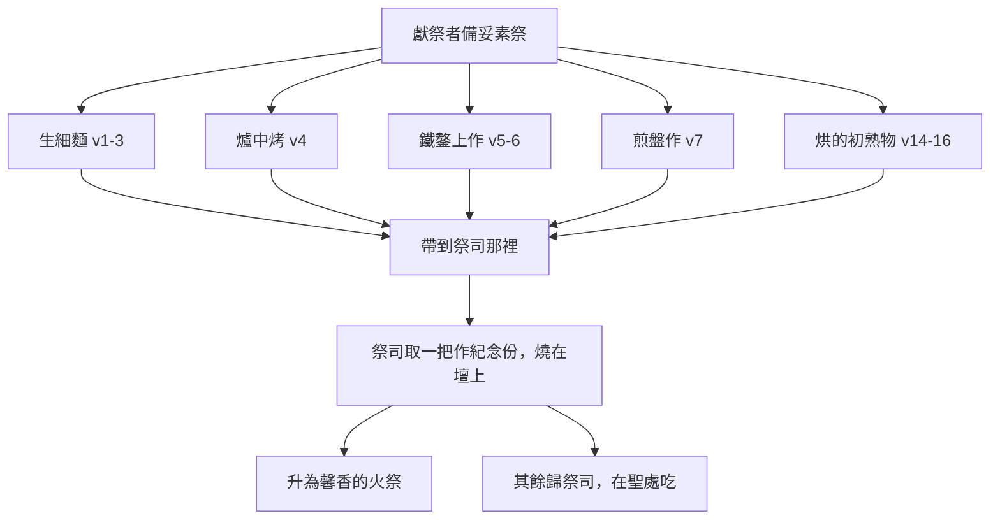

# 利未記 第2章

<!-- chapter-navigation:start -->
| [前一章](../03%20利未記/第1章.md) | [回目錄](../03%20利未記/全書目錄及綱要.md) | [下一章](../03%20利未記/第3章.md) |
| :--- | :---: | ---: |
<!-- chapter-navigation:end -->

1. 若有人獻[[素祭（minchah）|素祭]]為[[供物（qorban）|供物]]給耶和華，要用[[細麵]]澆上油，加上乳香，
2. 帶到[[亞倫和他兒子（祭司）|亞倫子孫作祭司]]的那裡；祭司就要從[[細麵]]中取出一把來，並取些油和所有的乳香，然後要把所取的這些[[紀念份|作為紀念]]，燒在壇上，是獻與耶和華為[[馨香之氣|馨香]]的火祭。
3. [[素祭（minchah）|素祭]]所剩的要歸給[[亞倫和他兒子（祭司）|亞倫和他的子孫]]；這是獻與耶和華的火祭中為[[至聖的供物（聖與至聖之分）|至聖]]的。
4. 若用爐中烤的物為[[素祭（minchah）|素祭]]，就要用調油的無酵[[細麵]]餅，或是抹油的無酵薄餅。
5. 若用鐵鏊上做的物為[[素祭（minchah）|素祭]]，就要用調油的無酵[[細麵]]，
6. 分成塊子，澆上油；這是[[素祭（minchah）|素祭]]。
7. 若用煎盤做的物為[[素祭（minchah）|素祭]]，就要用油與[[細麵]]做成。
8. 要把這些東西做的[[素祭（minchah）|素祭]]帶到耶和華面前，並奉給[[亞倫和他兒子（祭司）|祭司]]，帶到壇前。
9. [[亞倫和他兒子（祭司）|祭司]]要從[[素祭（minchah）|素祭]]中取出[[紀念份|作為紀念]]的，燒在壇上，是獻與耶和華為[[馨香之氣|馨香]]的火祭。
10. [[素祭（minchah）|素祭]]所剩的要歸給[[亞倫和他兒子（祭司）|亞倫和他的子孫]]。這是獻與耶和華的火祭中為[[至聖的供物（聖與至聖之分）|至聖]]的。
11. 凡獻給耶和華的[[素祭（minchah）|素祭]]都不可有酵；因為你們不可燒[[素祭不可有酵與蜜|一點酵]]、[[素祭不可有酵與蜜|一點蜜]]當作火祭獻給耶和華。
12. 這些物要獻給耶和華作為[[初熟]]的[[供物（qorban）|供物]]，只是不可在壇上獻為[[馨香之氣|馨香]]的祭。
13. 凡獻為[[素祭（minchah）|素祭]]的[[供物（qorban）|供物]]都要用鹽調和，在素祭上不可缺了你神[[立約的鹽]]。一切的供物都要配鹽而獻。
14. 若向耶和華獻[[初熟]]之物為[[素祭（minchah）|素祭]]，要獻上烘了的禾穗子，就是軋了的新穗子，當作初熟之物的素祭。
15. 並要抹上油，加上乳香；這是[[素祭（minchah）|素祭]]。
16. [[亞倫和他兒子（祭司）|祭司]]要把其中[[紀念份|作為紀念]]的，就是一些軋了的禾穗子和一些油，並所有的乳香，都焚燒，是向耶和華獻的火祭。

---

## 本章知識節點

### 原文
- [[供物（qorban）]]
- [[初熟]]
- [[素祭（minchah）]]
- [[紀念份]]

### 神學
- [[馨香之氣]]
- [[初熟果子]]
- [[燔祭]]

### 人物
- [[亞倫和他兒子（祭司）]]

### 主題
- [[素祭的五種形式]]
- [[素祭不可有酵與蜜]]
- [[立約的鹽]]
- [[至聖的供物（聖與至聖之分）]]
- [[細麵]]
- [[嗎哪]]

### 背景
- [[古代近東的獻祭與燔祭習俗]]

### 文化
- [[香料乳香沒藥貿易]]

---

## 本章整理

### 素祭是什麼：唯一不流血的祭（v1-3）

第一章講燔祭，第二章接著講[[素祭（minchah）|素祭]]。四份來源都指出同一件事：**這是五祭中唯一不流血的祭**，所以它本身不能贖罪。

這個祭的原文是 minchah，核心意思是「禮物」。CT 說它「在希伯來文含有禮物或貢物的意味，是一種自願的獻祭」。丁良才指出同一個字用在人與人之間就是送禮（創32:20、43:11），「若論到送禮物與人，就可表明受者的尊貴和威榮，有時也包含送者求恩的意思」。GT《舊約聖經背景註釋》補上旁證：這個字在烏加列語和亞喀得語中同樣是「禮物、貢品」，而且這種祭「通常是在慶典而非憂傷或哀悼之時獻上」。至於中文譯名，《啟導本》說原文其實是「穀物祭」，《和合本》是依中國「素食」「素餐」的習慣才譯成「素祭」。

**它能不能單獨獻上，兩份 GT 子來源的判斷相反：**
- 《啟導本》：素祭「雖然多與他祭同獻，似為可以單獨獻的祭」，是貧苦人家獻給神的禮物——他並引寡婦的兩個小錢（可12:42）說明神看重的是動機而非禮物輕重。
- 《聖經精讀本》：素祭「不能獨自獻上，一般與燔祭和平安祭一同獻上，因此素祭也等於與血一同獻上」。

獻的程序不長：把素祭帶到[[亞倫和他兒子（祭司）|祭司]]那裡，祭司取一把細麵、一些油、加上**所有**的乳香，燒在壇上作[[紀念份|紀念]]，其餘歸祭司（v2-3）。

### 三樣材料：[[細麵]]、油、乳香

**細麵到底有多細，四份來源說法不一。** CT 說要篩三次以上、第四次更精細；丁良才說是「麥子的精粹……最精細、最潔白」；BH 說是精製品、也是奢侈品；但 GT《舊約聖經背景註釋》卻說那其實是「小麥磨成麵粉之後留在篩子中的粗麵粉（grit 或 semolina）」——也就是篩剩下來留在網上的顆粒。前三家講的是篩到最細，第四家講的是篩剩的那一份。丁良才另給了分量下限：至少一俄梅珥，即伊法十分之一、約六磅（民15:4-12）。

油是橄欖油。乳香則是本章最貴的一項材料：GT《舊約聖經背景註釋》說明它取自 Boswellia 屬樹木的膠脂，只長在阿拉伯半島南部和索馬利蘭、亞丁灣兩岸，「雨量、氣溫、土壤不合，就不會生長」；產量低而需求高，因此十分昂貴，是[[香料乳香沒藥貿易|駱駝商隊貿易]]的主要商品，連法老圖坦卡門的墓中都挖到過。素祭只用少量，「全數用悶火慢慢燒盡」。丁良才另指出一個細節：乳香不是和細麵、油攙在一起的，而是加在上面，或者另外盛在小金杯子裡（參利24:7）。

> [!note] 烤的餅到底加不加乳香？
> 這一點兩邊講法相反。GT《舊約聖經背景註釋》說爐、鐵鏊、煎盤三種做法「用的是同樣的油和粗麵粉，但不加乳香」，GT《聖經精讀本》也說這三種「都不加乳香，只用細麵和油」，並解釋這是「神為貧窮人著想，沒有貴重的乳香也能獻素祭」。丁良才卻在v9下推論：「在細麵（1）和初熟之物的素祭上（15）既要加乳香，在這些餅上大概也必要加乳香。」經文本身在v4-7 確實沒有提乳香。

### 幾種做法？三樣還是五種（v4-10）

本章依製法分列[[素祭的五種形式|幾種形式]]，但**分幾類，兩份 GT 子來源數法不同**：《聖經精讀本》數為五種（生細麵、爐中烤、鐵鏊上作、煎盤作、烘的初熟物）；丁良才只數三樣（生麵v1-3、餅v4-10、初熟之物v14-16），把三種廚具併成一類。

| 器具 | 說明 |
|---|---|
| 爐（v4） | 丁良才：可移動的罐形瓦爐，高約三尺、直徑約尺半，燒熱後把餅放進去蓋上蓋子 |
| 鐵鏊（v5-6） | 《啟導本》記其原文為 mahabat，原是陶土製的烙盤；銅器時代中期起有銅製，鐵器時代初期巴勒斯坦中產家庭也有鐵製的（結4:3），但不普遍 |
| 煎盤（v7） | 丁良才：不是平板式器皿，而是能盛油的深鍋；《啟導本》說作出來的餅很像今天的油炸圈或粵人所說的「煎堆」 |

**這幾種形式代表什麼，CT 與 KC 的方向相反：**
- **CT 讀的是苦難的來源。** 爐中烤「人眼看不到」，是隱藏的一面；鐵鏊「用的是中火，表明從人來的難處」；煎盤「用的是大火，表明從魔鬼來的試探」。
- **KC 讀的是獻祭者認識多少。** 他注意到經文對三種形式的描述**越來越簡略**，並據此說這指出「獻素祭的人有多少屬靈的洞察」；煎盤是最小的一種，連「無酵」兩個字都沒出現，他認為那表示「對主耶穌完全無罪的認識有所欠缺」——但仍然是馨香的。

```mermaid
flowchart TD
    A["獻祭者備妥素祭"] --> B["生細麵 v1-3"]
    A --> C["爐中烤 v4"]
    A --> D["鐵鏊上作 v5-6"]
    A --> E["煎盤作 v7"]
    A --> F["烘的初熟物 v14-16"]
    B & C & D & E & F --> G["帶到祭司那裡"]
    G --> H["祭司取一把作紀念份，燒在壇上"]
    H --> I["升為馨香的火祭"]
    H --> J["其餘歸祭司，在聖處吃"]
```

### 誰吃、在哪裡吃：至聖的規矩（v3, 10）

素祭剩下的是「[[至聖的供物（聖與至聖之分）|火祭中為至聖的]]」。供物分兩等：平安祭那一等是「聖」，丁良才說祭司可以「在任何潔淨的地方，和他全家男女同吃」；素祭、贖罪祭、贖愆祭與陳設餅這一等是「至聖」，只許亞倫和他的子孫吃，而且要在聖處吃。

**誰能吃，兩份 GT 子來源的措辭不一致。** 丁良才與 CT 的界線是「只有祭司、只在聖處」，CT 並明說不能給祭司的家屬吃（民18:9-10）；GT《串珠》的說法卻是「祭司及其家屬可在清潔的地方吃至聖的供物；惟獨祭司才可在會幕的院內吃至聖的供物」（引同一處經文）。丁良才另補一條細則：有殘疾、不能供職的祭司男丁也可以吃（利21:21-22）。

這條規矩的用意，兩家從不同方向說明。《啟導本》看的是防弊：素祭剩下的只可在聖所中吃、不可用以供養家庭，是「在祭司職位應享的特權與祭司私人的財產之間劃清界限，防止人濫用特權」，日後確有祭司利用身分圖利（撒上2:12-22）。BH 看的是供養：祭司沒有像其他支派那樣的地業，這些供物正是他們的生活來源，好讓他們專心於屬靈職責（林前9:13-14）。

### 不可有酵與蜜（v11-12）

[[素祭不可有酵與蜜|酵和蜜]]都不可燒在壇上，卻都可以作「初熟的供物」獻給神、歸祭司食用。

**酵是不是一定代表罪？三家答案不同，而且引的是同一節經文：**
- **CT：酵就是罪。** 「酵是一種真菌，能使麵團發起來，亦會使它發霉變壞，所以預表罪。」
- **《啟導本》：酵是中立的。** 耶穌固然用酵比喻壞教訓（太16:6），「但祂也曾把酵比喻天國，說福音的力量開始很小，但擴展異常迅速（太13:33）」，所以酵的性質是滲透，「為中立的，本身無所謂好壞，全看人如何用它」。
- **KC：太13:33 那段講的是敗壞。** 他讀同一節卻認為那三斗麵正是素祭裡基督完全人性的圖畫，「婦人代表假教會」，酵藏在麵中表明關於基督的真理被假教會敗壞。

**蜜是什麼蜜？** GT《舊約聖經背景註釋》認為「所指的大概是指蜜棗的糖漿，而非蜂蜜」，《雷氏研讀本》也註明「不是蜜蜂的蜜」（參創43:11）；該背景註釋並指出赫人成功馴養蜜蜂、在獻祭中使用蜂蜜（迦南人亦然），「在以色列卻沒有類似的證據」。禁蜜的理由，丁良才說是古人造醋時用蜜做酵，所以神把蜜與酵當作同類；《啟導本》則提出可能與異教用蜜敬神有關。

KC 對蜜的讀法比其他三家溫和：蜜本身是好的、能給人新力量（撒上14:27；箴24:13），它代表「生活中天然事物的甜美」——家庭關係、夫妻之情、親子之愛，而且「我們天然的情感並沒有錯，缺了反而不對」（提後3:1-4）。問題不在情感本身，而在它不能在事奉神的工作裡佔位置。

### 不可缺立約的鹽（v13）

短短一節裡「鹽」出現三次。鹽的性質與酵相反：酵使東西發起來、變壞，鹽防腐、保存、持久。**[[立約的鹽|鹽]]在古代至少有三層意思：**

1. **立約的憑據。** 丁良才記下亞拉伯人的風俗：立約時把鹽放在刀上，「立約的人各都取一點吃，從此就算是至厚的朋友，所以俗語叫做鹽約」；以斯拉記四14「我們既食禦鹽，不忍見王吃虧」就是這個意思。GT《舊約聖經背景註釋》補上文獻證據：巴比倫、波斯、阿拉伯、希臘的文獻都反映這個用法。
2. **抑制敗壞。** 同一份註釋指出鹽能防止發酵——「酵若是悖逆的象徵，鹽自然就代表抑制悖逆的事物」。這正是v11禁酵與v13必加鹽被排在一起的理由。
3. **不產的咒詛。** 鹽也象徵土地不生產，因此出現在條約的咒詛裡。一份赫人條約的見證人這樣宣告：若是毀約，「願這人和這人的家和他的土地，像鹽沒有種子一樣沒有後嗣」。

《雷氏研讀本》一句話收束：「鹽代表持久和不腐敗的性質」（民18:19；代下13:5）。KC 把這一點連到基督：加鹽表示這祭的價值永遠存留，那香氣不是短暫的。

### 初熟之物的素祭（v14-16）

最後一種形式是[[初熟|初熟之物]]：「烘了的禾穗子，就是軋了的新穗子」，抹上油、加上乳香，祭司取紀念份焚燒。GT《舊約聖經背景註釋》說明這一種的特別之處——「這祭的五穀不經加工，而是穗子尚在青綠的成熟階段時整個烘了獻上」，並判斷那可能是大麥而非小麥。

這裡有一個容易被略過的分別：**v12 的「初熟的供物」不可上壇，v14 的「初熟之物」卻要上壇。** KC 是四份來源中唯一把這個矛盾講開的：他對照利23章指出，v12 那一種對應利23:17 兩個有酵的搖祭餅，代表教會（其中仍有罪），所以不能上壇；v14 這一種對應利23:10 的初熟莊稼一捆，代表主耶穌（林前15:20），所以可以上壇。他並指出前者是每年例行的義務祭，後者則是隨時可獻的自願祭。

CT 的落點在預表：初熟之物表徵基督復活成了[[初熟果子|初熟的果子]]（林前15:20、23），而「烘」和「軋」表徵十字架的對付。KC 的角度略有不同——他認為烘烤的禾穗說的不是十字架，而是主在世上行走時就已經受神試驗的聖潔所鑒察；他引主背十字架時說的「這些事既行在有汁水的樹上，那枯乾的樹將來怎麼樣呢」（路23:31），指出「有汁水的樹」正是祂自己正當壯年的生命。

### 素祭與燔祭的次序，素祭與嗎哪的分別

丁良才指出素祭條例接續[[燔祭]]條例是合宜的，因為「這兩種祭都是獻心祭」；兩者也常成對出現（民29:6、11、16 等處的「常獻的燔祭」與「同獻的素祭」；民28:1-5 每日早晚燔祭同獻素祭）。

KC 進一步問了一個次序上的問題：從歷史看，主耶穌先有完全的一生（素祭），才有十字架的死（燔祭）；但經文卻先講燔祭、後講素祭。他的解釋是——若不先看見祂的死代表什麼，就無法明白祂一生的任何意義。他並補上反向的一句：「若沒有一個先前完全獻給神的生命，基督贖罪的死也不可能成就。」

KC 另有一組本章其他來源都沒有的對比：素祭與[[嗎哪]]。兩者都預表主耶穌、都可以吃，但嗎哪說的是祂「走過這世界的路」，是曠野旅程的食物（約6:48-51）；素祭說的卻是「祂本身是誰，是祂完全人性的榮美」。而且嗎哪祭司與百姓都能吃，素祭所剩的卻只有祭司能吃。KC 由此下了一個條件：「要看見這個分別，你必須是祭司——也就是說，習慣活在神的面前。」

> [!note] 原文能證明什麼，不能證明什麼
> 本章有幾處爭議，原文只能定住語言事實，不能替註釋作結。可以直接查證的有：「素祭」（minchah）逐字解作「穀物之祭」，詞典義域則是廣義的「禮物」；「取出一把」的原文結構字面是「他一把的滿」；「至聖」是同一個字疊用，字面「聖中之聖」；v11 的「不可有酵」與「一點酵」用的是兩個不同的字（前者指發起來的狀態，後者指那塊老麵引子）；v12「初熟的供物」與 v14「初熟之物」在原文也是兩個不同的字；v4 的「調油」是「混合」，「抹油」則是「膏抹」那個動詞。至於細麵究竟是最細的還是篩剩的粗粒、酵是否必然代表罪、烤餅要不要加乳香——原文不提供答案，那些是註釋之間、以及考古材料與傳統讀法之間的分歧。

> [!important] 本章樞紐
> 素祭是把**人勞力所得的出產**獻給神。丁良才說得最直接：「素祭的材料就是人從地裡勞力所得的出產，因此也就表示人的工作，教訓我們當把自己的工獻與神。」它不流血、不贖罪，卻與流血的祭連在一起——正如基督完全的一生與祂贖罪的死不能分開。新約把同一件事交到信徒手上：「將身體獻上，當作活祭，是聖潔的，是神所喜悅的」（羅十二1）。

**參考資料**
https://www.ccbiblestudy.org/Old%20Testament/03Lev/03CT02.htm
https://www.ccbiblestudy.org/Old%20Testament/03Lev/03GT02.htm
https://www.kingcomments.com/en/bible-studies/Lev/2
https://biblehub.com/study/leviticus/2.htm
https://github.com/STEPBible/STEPBible-Data

<!-- chapter-navigation:start -->
| [前一章](../03%20利未記/第1章.md) | [回目錄](../03%20利未記/全書目錄及綱要.md) | [下一章](../03%20利未記/第3章.md) |
| :--- | :---: | ---: |
<!-- chapter-navigation:end -->
