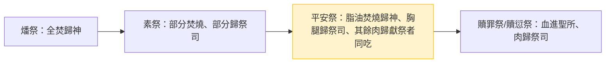

# 利未記 第3章

1. 人獻供物為[[平安祭]]（平安：或作[[平安祭|酬恩]]；下同），若是從牛群中獻，無論是公的是母的，必用[[無殘疾（tamim）|沒有殘疾的]]獻在耶和華面前。
2. 他要[[按手（samak）|按手]]在供物的頭上，宰於[[會幕門口]]。[[亞倫的子孫|亞倫子孫]]作[[亞倫的子孫|祭司]]的，要[[灑血（zaraq）|把血灑在壇的周圍]]。
3. 從[[平安祭]]中，將[[火祭（isheh）|火祭]]獻給耶和華，也要把[[脂油（chelev）|蓋臟的脂油]]和[[脂油（chelev）|臟上所有的脂油]]，
4. 並[[腰子（kilyah）|兩個腰子]]和[[腰子（kilyah）|腰子上的脂油]]，就是靠腰兩旁的脂油，與[[肝上的網子（yoteret ha-kaved）|肝上的網子]]和腰子，一概取下。
5. [[亞倫的子孫]]要把這些燒在[[燔祭|壇的燔祭上]]，就是在火的柴上，是獻與耶和華為[[馨香之氣|馨香的火祭]]。
6. 人向耶和華獻供物為[[平安祭]]，若是從羊群中獻，無論是公的是母的，必用[[無殘疾（tamim）|沒有殘疾的]]。
7. 若獻一隻[[綿羊|羊羔]]為供物，必在耶和華面前獻上，
8. 並要[[按手（samak）|按手]]在供物的頭上，宰於[[會幕門口|會幕前]]。[[亞倫的子孫]]要[[灑血（zaraq）|把血灑在壇的周圍]]。
9. 從[[平安祭]]中，將[[火祭（isheh）|火祭]]獻給耶和華，其中的[[脂油（chelev）|脂油]]和[[肥尾巴（alyah）|整肥尾巴]]都要在靠近脊骨處取下，並要把[[脂油（chelev）|蓋臟的脂油]]和[[脂油（chelev）|臟上所有的脂油]]，
10. [[腰子（kilyah）|兩個腰子]]和[[腰子（kilyah）|腰子上的脂油]]，就是靠腰兩旁的脂油，並[[肝上的網子（yoteret ha-kaved）|肝上的網子]]和腰子，一概取下。
11. [[亞倫的子孫|祭司]]要在壇上焚燒，是獻給耶和華為食物的[[火祭（isheh）|火祭]]。
12. 人的供物若是山羊，必在耶和華面前獻上。
13. 要[[按手（samak）|按手]]在山羊頭上，宰於[[會幕門口|會幕前]]。[[亞倫的子孫]]要[[灑血（zaraq）|把血灑在壇的周圍]]，
14. 又把[[脂油（chelev）|蓋臟的脂油]]和[[脂油（chelev）|臟上所有的脂油]]，[[腰子（kilyah）|兩個腰子]]和[[腰子（kilyah）|腰子上的脂油]]，就是靠腰兩旁的脂油，並[[肝上的網子（yoteret ha-kaved）|肝上的網子]]和腰子，一概取下，[[火祭（isheh）|獻給耶和華為火祭]]。
15. 併於上節。
16. [[亞倫的子孫|祭司]]要在壇上焚燒，作為[[馨香之氣|馨香火祭的食物]]。[[脂油（chelev）|脂油]]都是耶和華的。
17. 在你們一切的住處，[[脂油和血都不可吃]]；這要成為你們[[永遠的定例（chuqqat olam）|世世代代永遠的定例]]。

---

## 本章知識節點

### 神學
- [[平安祭]]
- [[按手（samak）]]
- [[灑血（zaraq）]]
- [[脂油（chelev）]]
- [[腰子（kilyah）]]
- [[肝上的網子（yoteret ha-kaved）]]
- [[肥尾巴（alyah）]]
- [[馨香之氣]]
- [[無殘疾（tamim）]]
- [[火祭（isheh）]]
- [[會幕門口]]
- [[亞倫的子孫]]
- [[燔祭]]
- [[搖祭（tenufah）]]
- [[舉祭（terumah）]]
- [[永遠的定例（chuqqat olam）]]
- [[脂油和血都不可吃]]
- [[素祭（minchah）]]

### 原文
- [[平安祭（shelamim）]]
- [[按手（samak）]]
- [[灑血（zaraq）]]
- [[脂油（chelev）]]
- [[腰子（kilyah）]]
- [[肝上的網子（yoteret ha-kaved）]]
- [[肥尾巴（alyah）]]
- [[馨香之氣]]
- [[無殘疾（tamim）]]
- [[火祭（isheh）]]
- [[會幕門口]]
- [[燔祭（olah）]]
- [[素祭（minchah）]]

---

## 本章整理

### 平安祭的三類供物與共同禮儀（v1-16）

利未記第 3 章詳細規定 **[[平安祭]]**（或譯「酬恩祭」）的條例，這是五大祭中唯一讓獻祭者、祭司與神三方同享的祭。《串珠聖經註釋》指出：「此祭為一私人的獻祭，所獻的可為感謝、還願或甘心獻的（7:15-16），表明獻祭者對神的感恩、虔敬與奉獻，並藉此顯明神與人及人與鄰舍的和諧關係。」本章按供物種類分三段：牛群（v1-5）、羊群綿羊（v6-11）、山羊（v12-16），每段結構幾乎相同——**[[無殘疾（tamim）]]的公母皆可**、**[[按手（samak）]]認同**、**宰於[[會幕門口]]**、**[[亞倫的子孫]][[灑血（zaraq）]]於壇周圍**、**取下[[脂油（chelev）]]、[[腰子（kilyah）]]、[[肝上的網子（yoteret ha-kaved）]]焚燒**，綿羊另加 **[[肥尾巴（alyah）]]**。CT 註解強調：「平安祭供物與燔祭供物的不同點乃在於前者不能以鳥類作為供物，而可用雄或雌的家畜……乃由於該祭的禮儀包括聚餐，獻祭者與他的親朋（特別是貧窮的）共用供物。」GT《丁良才註釋》補充：「平安祭有三樣：（一）感恩，（二）還願，（三）樂獻……教訓現在的信徒，單有感恩的心是不夠的，必須在行為方面做出報恩的事來。」

| 供物種類 | 經文段落 | 特殊部位 | 共同步驟 |
|----------|----------|----------|----------|
| 牛（公/母） | v1-5 | 蓋臟脂油、臟上脂油、兩腰子、腰子脂油、肝網 | 按手、宰殺、灑血、焚燒脂油在燔祭上 |
| 綿羊/羊羔 | v6-11 | 上述加 **整肥尾巴**（靠近脊骨取下） | 同上 |
| 山羊 | v12-16 | 與牛相同（無肥尾巴） | 同上 |

KC 指出：「平安祭是獻祭者能分享的惟一一種祭（七15）。因此，它說明神與人之間（以及人與人之間），以血祭為基礎的相交。」BH 研讀本補充：「和平祭反映信徒渴望與神建立和諧關係，強調平安與感恩在敬拜中的重要性。」

### 脂油歸耶和華、血作贖罪——神的份與人的禁忌（v16-17）

v16 宣告：「脂油都是耶和華的」；v17 立下 **[[永遠的定例（chuqqat olam）]]**：「在你們一切的住處，脂油和血都不可吃」。CT 文意註解：「『脂油』是為焚燒獻給神的；『血』是為贖罪，故兩者都不可吃。」GT《啟導本》註釋：「脂油為動物上好的部分，屬耶和華（參申32:14）。禁吃脂油可能也和健康有關……《利未記》七23且禁止吃不是獻祭用的牛羊脂油，吃了當火祭牲畜脂油的須從民中剪除。」KC 則從神學角度說：「脂油被視為維持生命的力量根源，血被視為生命本身或生命的根源（17:11；創6:4-5）。承認所有生物的生命都屬於神，嚴格禁止使用脂油和血。」

> [!important] 本章樞紐
> **脂油焚燒為[[馨香之氣]][[火祭（isheh）]]，血灑壇周圍**——這雙重動作確立了平安祭的神學核心：神收納最好的內在豐盛（脂油），血遮蓋罪過使交通成為可能。KC：「血說明贖罪、赦免和除滅罪惡（來9:22）。任何被神接納的攔阻因此被除去。這是我們站在神面前的基礎，藉此我們可以與祂有交通。」

### 預表與屬靈功課：基督是我們的平安

CT 靈意註解將平安祭三重預表化：「平安祭預表基督是神與人之間的和睦（弗2:14-15）與平安……無論是公的是母：公母均可，表示男女均應感恩……必用沒有殘疾的：表徵奉獻給神的，必須是完好的。」KC 進一步連結新約：「對新約的信徒來說，這祭闡明他們借基督在十字架上所流的血而與神和好（西1:20），以及他們與其它信徒的相交（約壹1:3）。」GT《丁良才》列出八項靈訓要義，其中第 5、6、7 項：「脂油……燒在壇的燔祭上：表徵奉獻生命的豐盛與最好的給神；是獻與耶和華為馨香的火祭：表徵這是神所欣悅的奉獻；是獻給耶和華為食物的火祭：表徵這是供神享用的奉獻。」

> [!note] 來源解讀非經文明言
> CT、KC、GT 的「預表基督」屬靈註解屬於屬靈解經傳統，非經文字面所言；古代近東背景（如《舊約背景註釋》提到的烏加列、亞馬拿文獻）屬歷史考古補充，非啟示本身。

### 跨章脈絡：從獨享到共享的祭儀動線

平安祭處於五祭中央，承接[[燔祭]]「完全獻上」與[[素祭（minchah）]]「生命供獻」，開啟 **神人共食** 的交通圖景。利未記 7 章將進一步規定：感恩祭當日吃盡、還願祭次日可吃、第三天必焚燒；獻祭者須潔淨、在耶和華面前歡樂（申12:17-18）。這條祭儀動線最終指向新約的 **主餐**——KC：「和平祭對我們的意義在哥林多前書 10 章得到解釋……對我們意指主的桌子，在那里神與主耶穌和祂所有自己人的交通在主的晚餐中被慶祝。」

**參考資料**
https://www.ccbiblestudy.org/Old%20Testament/03Lev/03CT03.htm
https://www.ccbiblestudy.org/Old%20Testament/03Lev/03GT03.htm
https://www.kingcomments.com/en/bible-studies/Lev/3
https://biblehub.com/study/leviticus/3.htm
