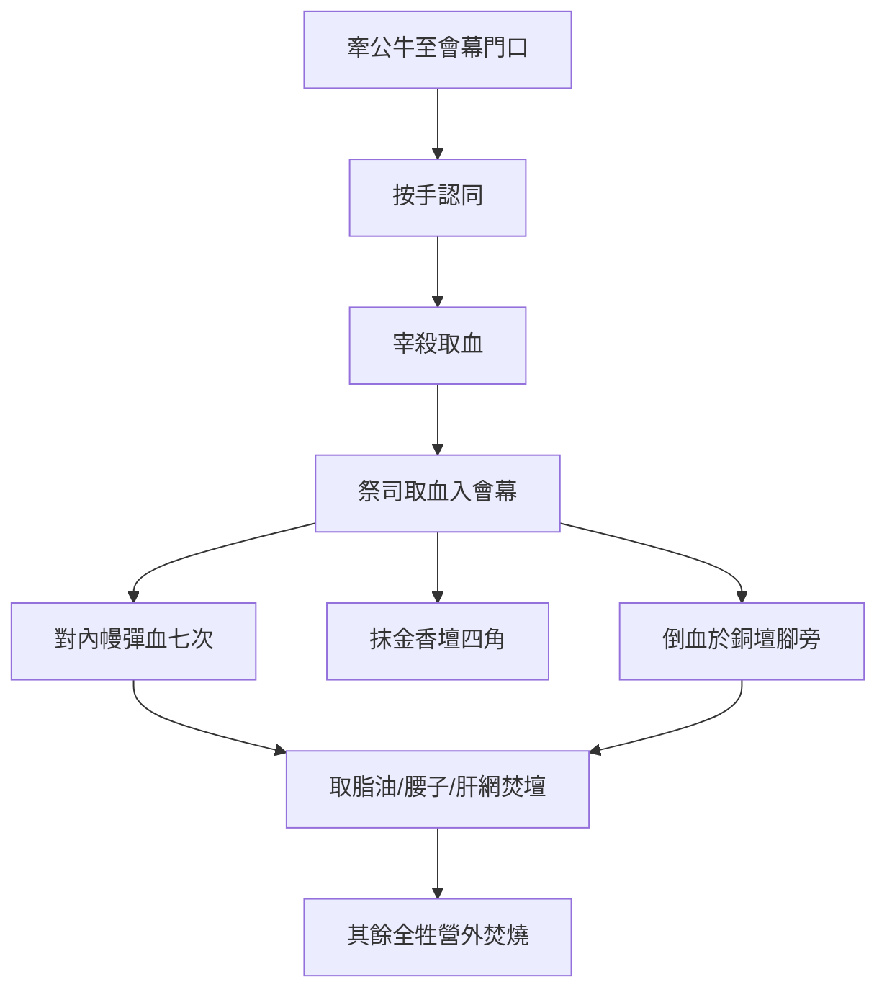

# 利未記 第4章

1. 耶和華對摩西說：
2. 你曉諭以色列人說：若有人在耶和華所吩咐不可行的什麼事上[[誤犯（shagagah）|誤犯]]了一件，
3. 或是[[受膏的祭司（mashiach kohen）|受膏的祭司]]犯罪，使百姓陷在罪裡，就當為他所犯的罪把[[無殘疾（tamim）|沒有殘疾的]][[公牛犢（par ben baqar）|公牛犢]]獻給耶和華為[[贖罪祭]]。
4. 他要牽[[公牛犢（par ben baqar）|公牛]]到[[會幕門口]]，在耶和華面前[[按手（samak）|按手]]在牛的頭上，把牛宰於耶和華面前。
5. [[受膏的祭司（mashiach kohen）|受膏的祭司]]要取些[[公牛犢（par ben baqar）|公牛]]的血帶到會幕，
6. 把指頭蘸於血中，在耶和華面前對著[[內幔（隔聖所至聖所的幔子）|聖所的幔子]][[灑血（zaraq）|彈血]]七次，
7. 又要把些血抹在會幕內、耶和華面前[[金香壇（香壇）|香壇]]的四角上，再把[[公牛犢（par ben baqar）|公牛]]所有的血倒在[[會幕門口]]、[[銅壇（燔祭壇）|燔祭壇]]的腳那裡。
8. 要把[[贖罪祭]][[公牛犢（par ben baqar）|公牛]][[脂油（chelev）|所有的脂油]]，乃是[[脂油（chelev）|蓋臟的脂油]]和[[脂油（chelev）|臟上所有的脂油]]，
9. 並[[腰子（kilyah）|兩個腰子]]和腰子上的[[脂油（chelev）|脂油]]，就是靠腰兩旁的脂油，與[[肝上的網子（yoteret ha-kaved）|肝上的網子]]和腰子，一概取下，
10. 與平安祭[[公牛犢（par ben baqar）|公牛]]上所取的一樣；祭司要把這些燒在燔祭的壇上。
11. [[公牛犢（par ben baqar）|公牛]]的皮和所有的肉，並頭、腿、臟、腑、糞，
12. 就是全[[公牛犢（par ben baqar）|公牛]]，要搬到[[營外焚燒（machutz la-machaneh saraf）|營外潔淨之地]]、[[潔淨之地（maqom tahor）|倒灰之所]]，用火燒在柴上。
13. [[全會眾（kol ha-edah）|以色列全會眾]]若行了耶和華所吩咐不可行的什麼事，[[誤犯（shagagah）|誤犯了罪]]，是隱而未現，會眾看不出來的，
14. [[全會眾（kol ha-edah）|會眾]]一知道所犯的罪就要獻一隻[[公牛犢（par ben baqar）|公牛犢]]為[[贖罪祭]]，牽到[[會幕門口|會幕前]]。
15. [[以色列的眾長老|會中的長老]]就要在耶和華面前[[按手（samak）|按手]]在牛的頭上，將牛在耶和華面前宰了。
16. [[受膏的祭司（mashiach kohen）|受膏的祭司]]要取些[[公牛犢（par ben baqar）|公牛]]的血帶到會幕，
17. 把指頭蘸於血中，在耶和華面前對著[[內幔（隔聖所至聖所的幔子）|幔子]][[灑血（zaraq）|彈血]]七次，
18. 又要把些血抹在會幕內、[[金香壇（香壇）|耶和華面前壇]]的四角上，再把所有的血倒在[[會幕門口]]、[[銅壇（燔祭壇）|燔祭壇]]的腳那裡。
19. 把牛[[脂油（chelev）|所有的脂油]]都取下，燒在壇上；
20. 收拾這牛，與那[[贖罪祭]]的牛一樣。祭司要[[贖罪|為他們贖罪]]，他們必[[赦免（salach）|蒙赦免]]。
21. 他要把牛[[營外焚燒（machutz la-machaneh saraf）|搬到營外燒了]]，像燒頭一個牛一樣；這是[[全會眾（kol ha-edah）|會眾]]的[[贖罪祭]]。
22. [[以色列人的官長|官長]]若行了耶和華─他神所吩咐不可行的什麼事，[[誤犯（shagagah）|誤犯了罪]]，
23. 所犯的罪自己知道了，就要牽一隻[[無殘疾（tamim）|沒有殘疾的]][[山羊|公山羊]]為供物，
24. [[按手（samak）|按手]]在羊的頭上，宰於耶和華面前、宰燔祭牲的地方；這是[[贖罪祭]]。
25. 祭司要用指頭蘸些[[贖罪祭]]牲的血，抹在[[銅壇（燔祭壇）|燔祭壇]]的四角上，把血倒在燔祭[[銅壇（燔祭壇）|壇的腳]]那裡。
26. [[脂油（chelev）|所有的脂油]]，祭司都要燒在壇上，正如平安祭的脂油一樣。至於他的罪，祭司要[[贖罪|為他贖了]]，他必[[赦免（salach）|蒙赦免]]。
27. 民中若有人行了耶和華所吩咐不可行的什麼事，[[誤犯（shagagah）|誤犯了罪]]，
28. 所犯的罪自己知道了，就要為所犯的罪牽一隻[[無殘疾（tamim）|沒有殘疾的]][[山羊|母山羊]]為供物，
29. [[按手（samak）|按手]]在[[贖罪祭]]牲的頭上，在那宰燔祭牲的地方宰了。
30. 祭司要用指頭蘸些羊的血，抹在[[銅壇（燔祭壇）|燔祭壇]]的四角上，所有的血都要倒在[[銅壇（燔祭壇）|壇的腳]]那裡，
31. 又要把羊[[脂油（chelev）|所有的脂油]]都取下，正如取平安祭牲的脂油一樣。祭司要在壇上焚燒，在耶和華面前作為馨香的祭，為他[[贖罪]]，他必[[赦免（salach）|蒙赦免]]。
32. 人若牽一隻[[綿羊|綿羊羔]]為[[贖罪祭]]的供物，必要牽一隻[[無殘疾（tamim）|沒有殘疾的]][[綿羊|母羊]]，
33. [[按手（samak）|按手]]在[[贖罪祭]]牲的頭上，在那宰燔祭牲的地方宰了作贖罪祭。
34. 祭司要用指頭蘸些[[贖罪祭]]牲的血，抹在[[銅壇（燔祭壇）|燔祭壇]]的四角上，所有的血都要倒在[[銅壇（燔祭壇）|壇的腳]]那裡，
35. 又要把[[脂油（chelev）|所有的脂油]]都取下，正如取平安祭[[綿羊|羊羔]]的脂油一樣。祭司要按獻給耶和華火祭的條例，燒在壇上。至於所犯的罪，祭司要[[贖罪|為他贖了]]，他必[[赦免（salach）|蒙赦免]]。

---

## 本章知識節點

### 神學
- [[贖罪]]
- [[赦免（salach）]]
- [[誤犯（shagagah）]]

### 原文
- [[誤犯（shagagah）]]
- [[贖罪祭]]
- [[按手（samak）]]
- [[灑血（zaraq）]]
- [[脂油（chelev）]]
- [[腰子（kilyah）]]
- [[肝上的網子（yoteret ha-kaved）]]
- [[無殘疾（tamim）]]

### 儀式
- [[贖罪祭]]
- [[按手（samak）]]
- [[灑血（zaraq）]]
- [[營外焚燒（machutz la-machaneh saraf）]]

### 人物
- [[受膏的祭司（mashiach kohen）]]
- [[以色列的眾長老]]
- [[以色列人的官長]]
- [[全會眾（kol ha-edah）]]

### 祭物
- [[公牛犢（par ben baqar）]]
- [[山羊]]
- [[綿羊]]

### 地點
- [[會幕門口]]
- [[內幔（隔聖所至聖所的幔子）]]
- [[金香壇（香壇）]]
- [[銅壇（燔祭壇）]]
- [[潔淨之地（maqom tahor）]]

---

## 本章整理

### 贖罪祭的分級與誤犯之罪（v1-2）

本章開啟「贖罪祭」新單元，耶和華對摩西說：「若有人在耶和華所吩咐不可行的什麼事上誤犯了一件」（v2）。CT 指出：「『吩咐不可行的…事』即指律法明文規定的各種條例；『誤犯』意指不是故意違犯；『一件』意指不是累犯，只要偶犯一件。」GT《丁良才》補充：「贖罪祭所贖的罪是人因軟弱或錯誤所致的」。KC 則嚴厲劃界：「沒有任何祭物是為故意犯罪、『藐視』或『蓄意』犯罪之人預備的……這樣的人必從民中剪除（民15:30；來10:26）。」BH 解釋：「誤犯的概念凸顯了明知故犯與因無知或意外而犯的罪之間的區別。」這顯示神對「誤犯」（shagagah）與「故犯」有明確區分，贖罪祭專為前者預備。

贖罪祭另一大特點是「按犯罪者身分分級」：CT 列表——「受膏的祭司…公牛犢；全會眾…公牛犢；官長…公山羊；平民…母山羊或母羊，貧窮則用班鳩、雛鴿甚至細麵」。這反映「多給誰就向誰多取」（路12:48），KC 稱「祭物的區別代表了神子民中不同成員之間洞察力的差異。」。

| 犯罪者 | 祭物 | 血灑處 | 肉處理 |
|---|---|---|---|
| [[受膏的祭司（mashiach kohen）]] | [[公牛犢（par ben baqar）]] | 會幕內：[[內幔（隔聖所至聖所的幔子）]] 彈七次、[[金香壇（香壇）]] 四角 | 全焚 [[營外焚燒（machutz la-machaneh saraf）]] |
| [[全會眾（kol ha-edah）]] | 公牛犢 | 同上 | 全焚營外 |
| [[以色列人的官長]] | 公山羊 | [[銅壇（燔祭壇）]] 四角 | 歸祭司食用 |
| 平民 | 母山羊/[[綿羊]] | 銅壇四角 | 歸祭司食用 |

### 祭司與全會眾的贖罪祭：血進聖所、體焚營外（v3-21）

#### 受膏的祭司（v3-12）
大祭司犯罪「使百姓陷在罪裡」（v3），CT 解釋：「大祭司在神面前肩負以色列眾百姓…故他一人犯罪，即連累眾百姓叫他們也陷在罪裡。」KC 同調：「他若犯罪，不只影響自己，全體百姓也因他的罪而有罪。」祭物必為「沒有殘疾的公牛犢」（v3），CT 指出「表徵基督聖潔、無邪惡、無玷污（來七26）」。儀程：牽牛至[[會幕門口]]，[[按手（samak）]]，宰殺；祭司取血入會幕，在[[內幔（隔聖所至聖所的幔子）]]前[[灑血（zaraq）]]七次，又抹於[[金香壇（香壇）]]四角，餘血倒在[[銅壇（燔祭壇）]]腳旁（v5-7）。CT 強調：「贖罪祭的重點不只贖罪，也潔淨崇拜的地方，以致神可降臨住在其間，恢復與人的交通。因此，灑血的禮儀乃是此祭的特點。」KC 則著重交通恢復：「因受膏祭司的罪，通往聖所的道路被阻塞了。藉著灑血，通往聖所和在聖所內的道路再次被分別為聖。」BH 注釋：「灑血七次表明贖罪過程的徹底與完全。」

[[脂油（chelev）]]、[[腰子（kilyah）]]、[[肝上的網子（yoteret ha-kaved）]] 焚於壇上（v8-10），CT 認為「表徵基督使神滿足」。其餘皮肉頭腿臟腑糞，全牽往[[潔淨之地（maqom tahor）]]（即[[營外焚燒（machutz la-machaneh saraf）]]）焚燒（v11-12），CT 引來13:12 指出「預表基督在耶路撒冷城門外為我們犧牲」。

#### 全會眾（v13-21）
會眾「誤犯了罪，是隱而未現、會眾看不出來的」（v13），一旦「知道所犯的罪」（v14）便獻公牛犢。長老代表[[按手（samak）]]（v15），血儀與祭司同（v16-18），脂油焚壇（v19），肉同樣全焚營外（v21）。CT 指出：「全會眾贖罪的祭物，只能、也必須用公牛為贖罪祭，這表明不能輕忽了事。」KC 應用至教會：「全會眾犯罪的情形可應用於哥林多教會的處境……神帶著祂的管教來到他們中間（林前11:30）。」

### 官長與平民的贖罪祭：血灑銅壇、肉歸祭司（v22-35）

#### 官長（v22-26）
官長犯罪「誤犯了罪」（v22），獻「沒有殘疾的公山羊」（v23）。GT《丁良才》解釋：「官長若犯了罪，他們的罪就比平民的罪關係更重」。KC 指出：「領袖的罪不會危及全體百姓與神的相交，因此可以獻較小的祭物。」血儀簡化：祭司以指蘸血抹[[銅壇（燔祭壇）]]四角，餘血倒壇腳（v25），不進會幕。脂油焚壇（v26），肉歸祭司（CT：「為官長或庶民所獻之贖罪祭，所有的肉都成為祭司的分」）。

#### 平民（v27-35）
平民獻「母山羊」（v28）或「母綿羊」（v32），儀程同官長：[[按手（samak）]]、宰於[[銅壇（燔祭壇）]]北、血抹壇角倒壇腳（v29-30,33-34）、脂油焚壇為「馨香的祭」（v31,35）。KC 注意到：「這贖罪祭還有另一個特點……被焚燒的脂油是獻給耶和華的馨香之祭。雖然每一樣罪在神眼中都是可憎的……但與此同時，神全部的喜悅都安息在祂（基督）身上。」CT 則強調「祭司要為他贖了，他必蒙赦免」（v26,31,35）四次重複，顯示 [[赦免（salach）]] 確據。

### 跨章預表：基督作完全贖罪祭（整理）

CT 總結：「贖罪祭預表背負人的罪（約1:29），在十字架上犧牲的耶穌基督。可以使我們在他裡面坦然無懼地來到神的面前（弗3:2；來10:19），事奉神（來9:12-14）。」KC 深化：「贖罪祭是主耶穌和祂在十字架上之工的圖畫，藉著祂，罪得以赦免（約壹2:2）。」來13:11-13 明確連結：「獻贖罪祭的牲畜血被帶入聖所…牲畜的身體被燒在營外。所以耶穌也要在城門外受苦，使百姓因自己的血成聖。我們也當出到營外就了他去，忍受他所受的凌辱。」這將 [[營外焚燒（machutz la-machaneh saraf）]] 從儀式轉為門徒跟隨的呼召。

> [!note] 來源差異提示
> CT 著重「潔淨聖所」功能（灑血七次、抹香壇），KC 著重「恢復交通與禱告道路」（血遮蓋幔子、香壇代表代求），BH 著重「七表完全」。三者互補，未見矛盾。
> 關於祭司吃贖罪祭肉：GT《串珠》說「凡贖罪祭中把祭牲的血帶入聖所的（大祭司和全會眾獻的贖罪祭），其餘的肉都不可吃，要用火焚燒」；KC 則說「The priest shall make atonement… and they will be forgiven」並未明說肉歸屬，但引來13:10-13 指出「那些供奉帳幕的人無權在壇上吃肉」。兩家皆指向「營外焚燒」預表基督受苦。

> [!question] 待探討
> - 「誤犯」（shagagah）是否包含「明知故犯後悔」？經文僅限「隱而未現」（v13）、「自己知道了」（v23,28,32）。
> - 平民獻母羊與官長獻公羊，是否暗示贖罪代價與權柄關係？KC 認為「代表了洞察力的差異」，GT《丁良才》則強調「神分別貧富、尊卑，是顯明祂的公義」。

**參考資料**
https://www.ccbiblestudy.org/Old%20Testament/03Lev/03CT04.htm
https://www.ccbiblestudy.org/Old%20Testament/03Lev/03GT04.htm
https://www.kingcomments.com/en/bible-studies/Lev/4
https://biblehub.com/study/leviticus/4.htm
