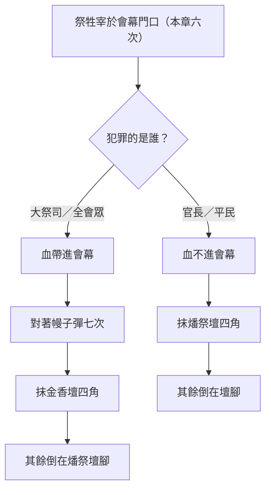

# 利未記 第4章

<!-- chapter-navigation:start -->
| [前一章](../03%20利未記/第3章.md) | [回目錄](../03%20利未記/全書目錄及綱要.md) | [下一章](../03%20利未記/第5章.md) |
| :--- | :---: | ---: |
<!-- chapter-navigation:end -->

1. 耶和華對摩西說：
2. 你曉諭以色列人說：若有人在耶和華所吩咐不可行的什麼事上[[誤犯]]了一件，
3. 或是[[受膏的祭司]]犯罪，使百姓陷在罪裡，就當為他所犯的罪把[[無殘疾（tamim）|沒有殘疾的]][[公牛犢]]獻給耶和華為[[贖罪祭]]。
4. 他要牽[[公牛犢|公牛]]到[[會幕門口]]，在耶和華面前[[按手]]在牛的頭上，把牛宰於耶和華面前。
5. [[受膏的祭司]]要取些[[公牛犢|公牛]]的血帶到會幕，
6. 把指頭蘸於血中，在耶和華面前對著[[內幔（隔聖所至聖所的幔子）|聖所的幔子]][[彈血七次]]，
7. 又要把些血抹在會幕內、耶和華面前[[金香壇（香壇）|香壇]]的四角上，再把[[公牛犢|公牛]]所有的血倒在[[會幕門口]]、[[銅壇（燔祭壇）|燔祭壇]]的腳那裡。
8. 要把[[贖罪祭]][[公牛犢|公牛]][[脂油|所有的脂油]]，乃是[[脂油|蓋臟的脂油]]和[[脂油|臟上所有的脂油]]，
9. 並[[腰子|兩個腰子]]和腰子上的[[脂油]]，就是靠腰兩旁的脂油，與[[肝上的網子]]和腰子，一概取下，
10. 與平安祭[[公牛犢|公牛]]上所取的一樣；祭司要把這些燒在燔祭的壇上。
11. [[公牛犢|公牛]]的[[皮肉頭腿臟腑糞|皮和所有的肉]]，並頭、腿、臟、腑、糞，
12. 就是全[[公牛犢|公牛]]，要搬到[[營外焚燒|營外潔淨之地]]、[[潔淨之地|倒灰之所]]，用火燒在柴上。
13. [[全會眾|以色列全會眾]]若行了耶和華所吩咐不可行的什麼事，[[誤犯|誤犯了罪]]，是隱而未現，會眾看不出來的，
14. [[全會眾|會眾]]一知道所犯的罪就要獻一隻[[公牛犢]]為[[贖罪祭]]，牽到[[會幕門口|會幕前]]。
15. [[以色列的眾長老|會中的長老]]就要在耶和華面前[[按手]]在牛的頭上，將牛在耶和華面前宰了。
16. [[受膏的祭司]]要取些[[公牛犢|公牛]]的血帶到會幕，
17. 把指頭蘸於血中，在耶和華面前對著[[內幔（隔聖所至聖所的幔子）|幔子]][[彈血七次]]，
18. 又要把些血抹在會幕內、[[金香壇（香壇）|耶和華面前壇]]的四角上，再把所有的血倒在[[會幕門口]]、[[銅壇（燔祭壇）|燔祭壇]]的腳那裡。
19. 把牛[[脂油|所有的脂油]]都取下，燒在壇上；
20. 收拾這牛，與那[[贖罪祭]]的牛一樣。祭司要[[贖罪|為他們贖罪]]，他們必[[赦免|蒙赦免]]。
21. 他要把牛[[營外焚燒|搬到營外燒了]]，像燒頭一個牛一樣；這是[[全會眾|會眾]]的[[贖罪祭]]。
22. [[以色列人的官長|官長]]若行了耶和華─他神所吩咐不可行的什麼事，[[誤犯|誤犯了罪]]，
23. 所犯的罪自己知道了，就要牽一隻[[無殘疾（tamim）|沒有殘疾的]][[山羊|公山羊]]為供物，
24. [[按手]]在羊的頭上，宰於耶和華面前、宰燔祭牲的地方；這是[[贖罪祭]]。
25. 祭司要用指頭蘸些[[贖罪祭]]牲的血，抹在[[銅壇（燔祭壇）|燔祭壇]]的四角上，把血倒在燔祭[[銅壇（燔祭壇）|壇的腳]]那裡。
26. [[脂油|所有的脂油]]，祭司都要燒在壇上，正如平安祭的脂油一樣。至於他的罪，祭司要[[贖罪|為他贖了]]，他必[[赦免|蒙赦免]]。
27. 民中若有人行了耶和華所吩咐不可行的什麼事，[[誤犯|誤犯了罪]]，
28. 所犯的罪自己知道了，就要為所犯的罪牽一隻[[無殘疾（tamim）|沒有殘疾的]][[山羊|母山羊]]為供物，
29. [[按手]]在[[贖罪祭]]牲的頭上，在那宰燔祭牲的地方宰了。
30. 祭司要用指頭蘸些羊的血，抹在[[銅壇（燔祭壇）|燔祭壇]]的四角上，所有的血都要倒在[[銅壇（燔祭壇）|壇的腳]]那裡，
31. 又要把羊[[脂油|所有的脂油]]都取下，正如取平安祭牲的脂油一樣。祭司要在壇上焚燒，在耶和華面前作為馨香的祭，為他[[贖罪]]，他必[[赦免|蒙赦免]]。
32. 人若牽一隻[[綿羊|綿羊羔]]為[[贖罪祭]]的供物，必要牽一隻[[無殘疾（tamim）|沒有殘疾的]][[綿羊|母羊]]，
33. [[按手]]在[[贖罪祭]]牲的頭上，在那宰燔祭牲的地方宰了作贖罪祭。
34. 祭司要用指頭蘸些[[贖罪祭]]牲的血，抹在[[銅壇（燔祭壇）|燔祭壇]]的四角上，所有的血都要倒在[[銅壇（燔祭壇）|壇的腳]]那裡，
35. 又要把[[脂油|所有的脂油]]都取下，正如取平安祭[[綿羊|羊羔]]的脂油一樣。祭司要按獻給耶和華火祭的條例，燒在壇上。至於所犯的罪，祭司要[[贖罪|為他贖了]]，他必[[赦免|蒙赦免]]。

---

## 本章知識節點

### 神學
- [[贖罪祭]]
- [[贖罪]]
- [[赦免]]
- [[誤犯]]
- [[故意犯罪沒有贖罪祭]]

### 主題
- [[彈血七次]]
- [[灑血]]
- [[公牛犢]]
- [[內幔（隔聖所至聖所的幔子）]]
- [[金香壇（香壇）]]
- [[銅壇（燔祭壇）]]
- [[營外焚燒]]
- [[皮肉頭腿臟腑糞]]
- [[無殘疾（tamim）]]
- [[綿羊]]

### 原文
- [[按手]]
- [[脂油]]
- [[腰子]]
- [[肝上的網子]]

### 人物
- [[受膏的祭司]]
- [[全會眾]]
- [[以色列的眾長老]]
- [[以色列人的官長]]

### 地點
- [[會幕門口]]
- [[潔淨之地]]

### 文化
- [[山羊]]

---

## 本章整理

### 從甘心到必須（v1-2）

利未記前三章的祭都是自願的——燔祭、素祭、平安祭，經文一律說「你們中間若有人獻供物」。從第 4 章起，語氣變了。丁良才注意到這個轉折：本章開始的是「人若自覺是違背了神的吩咐，就必須獻贖罪祭」。獻祭從一件可以選的事，變成一件不得不做的事。連程序裡的[[按手]]也一樣——同一個動作，在前三章是與祭牲的蒙悅納合一，在本章是把自己的不蒙悅納交給祭牲（KC）。

KC 把這個分界說得最完整：前三章的祭是甘心的，是「馨香的祭」；[[贖罪祭]]與贖愆祭則不同——「神吩咐這些祭……也沒有選擇的自由……來獻祭的人不是以敬拜者的身分親近，而是以罪人的身分」。同一個會幕門口，前三章走進去的是敬拜者，本章走進去的是有罪的人。

**這祭到底在贖什麼？兩種讀法並存。** CT 與 GT《串珠》都指出「贖罪」的希伯來字根有「潔淨」的意思，並強調「犯罪不單得罪神，更玷污了敬拜的地方；贖罪祭的重點不只贖罪，也潔淨崇拜的地方，以致神可降臨住在其間，恢復與人的交通」。GT《舊約聖經背景註釋》把這一點推到底，認為它根本該改名：「贖罪祭是『潔淨祭』（NIV；purification offering）的傳統稱呼。學者了解到它不是針對道德上的罪行，而是淨化儀式上的嚴重不潔……這祭能夠淨化或洗淨聖所（而非獻祭者）。」

### 「誤犯」畫出的範圍（v2）

四段條例共同的前提是[[誤犯|誤犯了罪]]。CT 的字義註解給「誤」為無心所犯的、疏忽造成的；GT《啟導本》另補上「罪」這個字本身的意思：「『罪』的希伯來原文作hata，是『矢不中的』的意思。」

**它涵蓋到哪裡，各家的寬窄不同：**
- **只算無心之失。** CT：「『誤犯』意指不是故意違犯。」GT《精讀本》：「因人的軟弱,無意間所犯的罪。」
- **也包含明知而犯的軟弱。** GT《利未記雷氏研讀本》：即「由於軟弱或任性而犯了已知的罪」。GT《啟導本》同樣把範圍拉寬：「或者由於人的軟弱，有意識地違犯了規例（五1～4），都屬此範圍。」

分界其實不在知不知道，而在有沒有公然背叛。丁良才指出這詞「不但是指現於外的動作，也是關係人心裡的情形」，而「擅敢行事」的人「未必常犯形式方面顯然的大罪，就是暗中故意背逆耶和華的，也必被剪除」。這條界線的另一面就是[[故意犯罪沒有贖罪祭|本章沒有為故意的罪預備祭]]——丁良才說贖罪祭「不是為放膽作惡的人預備的」，並列出姦淫、殺人、頑梗背逆、褻瀆聖名等該死的罪，神並沒有設立贖罪的祭。

不知道並不減輕罪責。KC 說得直接：以為神不追究無意識的罪是一種誤解——祂為這種罪設了祭，正說明祂把它算為罪。

### 四個階層，四種祭牲（v3-35）

本章最鮮明的特徵是分級：罪責按犯罪者的身分而不同，供物、血禮與祭肉處理也跟著不同。

| 犯罪者 | 供物 | 血怎麼處理 | 祭肉怎麼處理 |
|--------|------|------------|--------------|
| [[受膏的祭司]]（v3-12） | [[無殘疾（tamim）]]的[[公牛犢]] | 帶進會幕：彈幔子七次、抹香壇四角、倒燔祭壇腳 | 全牛搬到營外燒 |
| [[全會眾]]（v13-21） | 公牛犢 | 同上 | 同上 |
| [[以色列人的官長]]（v22-26） | 沒有殘疾的公[[山羊]] | 不進會幕：抹燔祭壇四角、倒壇腳 | 歸祭司 |
| 平民（v27-35） | 沒有殘疾的母山羊或母[[綿羊]] | 同官長 | 歸祭司 |

**本章只到四級，整套其實更多。** 丁良才把利4-5 合起來數成六等，最後兩等是貧民獻斑鳩雛鴿、極貧者獻細麵。KC 的數法又不同：利4 的四類加上利5:1-13 的三種具體情形，共七種。

分級的理由是影響範圍，不是官階。CT 指出大祭司「在神面前肩負以色列眾百姓，故他一人犯罪，即連累眾百姓」；GT《精讀本》說官長犯罪「只會波及到所代表的支派」；KC 則說個人的罪不使全民與神的相交中斷。所以大祭司與全會眾同列一等——一個人的罪，效果等同全體。

本章也是[[以色列的眾長老|長老]]第一次在獻祭程序裡承擔具體動作的地方——全會眾犯罪時由他們代表按手（v15）。

**這裡有一個人名上的陷阱值得說明。** 本章的「官長」與出埃及記 5 章那批埃及督工指派的以色列工頭，中文同名，原文卻是兩個不同的字：本章的原文是 נָשִׂיא（H5387A，STEP 詞典義「領袖」），出5 用的則是另一個字（H7860，工頭）。丁良才為本章的「官長」列了兩種解法——各級首領，或專指以色列的王——他自己判定前者較近。

### 血走多遠，由誰犯罪決定

```mermaid
flowchart TD
    A["祭牲宰於會幕門口（本章六次）"] --> B{"犯罪的是誰？"}
    B -->|"大祭司／全會眾"| C["血帶進會幕"]
    C --> D["對著幔子彈七次"]
    D --> E["抹金香壇四角"]
    E --> F["其餘倒在燔祭壇腳"]
    B -->|"官長／平民"| G["血不進會幕"]
    G --> H["抹燔祭壇四角"]
    H --> I["其餘倒在壇腳"]
```

**本章其實沒有用「灑」這個字。** 利1-3 的血是整盆潑向壇的四周，用的是一個字；本章換成三個不同的動詞——[[彈血七次|彈]]、抹、倒。CT 的字義註解正好逐一對上：v6「彈」是噴出、灑、淋，v7「抹在」是給、置、放，「倒在」是傾倒、澆。丁良才描述了彈血的動作：「祭司每用指頭彈一次，就將指頭蘸在血中一次。」這三個動作在本章合稱[[灑血]]的變體，但嚴格說，本章沒有一處用到利1-3 那個「灑」字。

彈的對象是[[內幔（隔聖所至聖所的幔子）]]，也就是隔開聖所與至聖所的那道幔子。血只彈在幔子前，不進至聖所——進至聖所要等到大贖罪日，一年一次。丁良才推想血是彈在幔前的地上，因為「所彈的面積既然不大，大祭司進至聖所的時候，就能從左右繞過去，不至於踏在其上」。

為什麼是七次？CT、丁良才、GT《精讀本》與 BH 都讀為完全；GT《舊約聖經背景註釋》給的則是功能上的解釋，與象徵無關：「彈血七次是同時淨化聖所每一部分，不必分別處理的方法。」

血抹在[[金香壇（香壇）|香壇]]四角的只有前兩級。KC 給的理由很具體：大祭司的罪使獻香的路被堵住，而香代表禱告，血抹在香壇的角上是為了讓代求的路重新打開。低兩級的血則抹在[[銅壇（燔祭壇）|燔祭壇]]上——KC 說那是因為平安祭也在這裡獻，那是個人親近神的地方。CT 在〔話中之光〕把三個動作分開讀：「彈血是對著神面前彈在幔子上，這是恢復交通。抹血在香壇的角上，那是說到不允許人在神面前的事奉敬拜打岔。把血倒在祭壇的腳上，這是滿足神公義的要求。」

### 兩個不同的「燒」（v8-12, 19-21）

祭牲一律宰於[[會幕門口]]，血處理完之後分成兩份：[[脂油]]、[[腰子]]、[[肝上的網子]]燒在壇上；其餘的——[[皮肉頭腿臟腑糞|皮、肉、頭、腿、臟、腑、糞]]——搬到[[潔淨之地|營外潔淨之地、倒灰之所]][[營外焚燒|燒掉]]。

**中文都寫「燒」，原文是兩個字。** 丁良才注意到了：v12、21 的「燒」是燒成灰燼的意思，而 v10、19、26、31、35 的「燒」是「使煙或香氣上升」的意思。他據此推想：「被燒在燔祭壇上的是表示神的喜悅，被燒在營外的是表示神的震怒。」KC 的讀法一致：「使冒煙上升」連於神的喜悅，「焚燒」連於神的忿怒。

為什麼要搬到營外？GT《啟導本》給的理由是這祭的目的：「贖罪祭的目的是洗去大祭司因誤犯了罪對聖所造成的污穢，大過贖他自己的罪，所以不可把祭牲燒在壇上。」丁良才給的理由更硬——按律法，獻贖罪祭的人不能吃自己所獻之贖罪祭牲的肉；祭司與大祭司是一家的，會眾的贖罪祭祭司自己也在會眾之內，所以這兩級的肉沒有人可以吃。GT《舊約聖經背景註釋》從結果面說同一件事：「這祭是沒有祭筵的。」

CT 從犯罪的機制讀那份逐項清單：「祭物的頭和腿，是犯罪行動的執行器官，臟腑是犯罪動機的來源，因為罪非同疥癬之疾，僅從皮膚著手可以治癒，必須由深心悔改。」

### 四次相同的結語（v20, 26, 31, 35）

四段條例都以同一句話收尾：「祭司要為他[[贖罪]]，他必[[赦免|蒙赦免]]」。丁良才提醒次序不可顛倒：「注意，須先贖罪，才能蒙赦免。」

**赦免的主語永遠是神。** GT《舊約聖經背景註釋》給了本章最值得記住的一段：「動詞赦免的主語永遠是神，不會是人，並且不排除懲罰（見：民十四19～24）。因此赦免是關係性而非法律懲處的概念……獻祭者所尋求的是與神和好，不是刑罰得寬宥。」民14 就是現成的例子：神赦免了百姓，那一代仍倒斃曠野。

祭牲的大小按身分而異，這句應許卻一字不改。丁良才據此讀出本章的用意之一：「貧窮的、富足的、尊貴的、卑賤的、或個人、或大家，都可以獻贖罪祭，使罪得赦。」他另注意到一處措辭上的分別：v31（平民）說「在耶和華面前作為馨香的祭」，而前三級都沒有這句話；他引注釋家的推想——這話特別列在庶民這一段，「特要表明神悅納最貧苦的人所獻最賤價的祭物，正如祂悅納最富足和上級人所獻最值錢的祭物一樣」。KC 也注意到同一點。

### 原文層能證明什麼、不能證明什麼

**原文層（STEP Bible）能直接證實的語言事實**

| 經文 | 原文與編號 | STEP 的說明 | 對得上哪一家 |
|------|------------|-------------|--------------|
| v2 | H7684 | 逐字解「因疏忽」 | CT 字義「無心所犯的、疏忽造成的」 |
| v3 | H4899 | 「受膏的」，與「祭司」連用 | CT：僅大祭司受膏 |
| v3 | H6499＋H1121H＋H1241 | 「一隻公牛，牛群中年幼的一隻」 | 三個字疊用，丁良才另辨其年紀 |
| v6 | H5137A | 「他要彈灑」，與利1-3 的 H2236 不同字 | CT 字義「噴出、灑、淋」 |
| v7 | H5414H／H8210G | 「放上去」／「傾倒」 | CT 字義「給、置、放」／「傾倒、澆」 |
| v11 | H5785／H1320／H7218A／H3767／H7130H／H6569 | 皮／肉／頭／腿／內臟／糞各有專字 | 六項逐字對得上經文 |
| v12 | H8313 vs v10 H6999A | 「焚燒」與「使冒煙」是兩個字 | 丁良才對兩種「燒」的分辨成立 |
| v20 | H3722A＋H5545 | 「贖罪」與「赦免」，後者為被動 | 丁良才「須先贖罪，才能蒙赦免」 |
| v22 | H5387A | 「領袖」，與出5 的 H7860（工頭）不同字 | 本章的官長不是出5 那批人 |

**原文層不能證明的**——脂油代表「工作的能力」、腰子代表「智慧」、頭代表「思想」、腿代表「行事」，這幾項出自 KC 的靈意讀法，不是詞典義。CT 的靈意註解說彈血七次預表基督寶血完全遮蓋人的罪行，那同樣是解讀。至於贖罪祭該不該改稱「潔淨祭」，那是 GT《舊約聖經背景註釋》綜合學界研究的判斷，不是原文本身能定的事。詞典給的是這個字可能的意思範圍，語法給的是詞形，兩者都不會自己長出神學結論。

**參考資料**
https://www.ccbiblestudy.org/Old%20Testament/03Lev/03CT04.htm
https://www.ccbiblestudy.org/Old%20Testament/03Lev/03GT04.htm
https://www.kingcomments.com/en/bible-studies/Lev/4
https://biblehub.com/study/leviticus/4.htm
https://github.com/STEPBible/STEPBible-Data

<!-- chapter-navigation:start -->
| [前一章](../03%20利未記/第3章.md) | [回目錄](../03%20利未記/全書目錄及綱要.md) | [下一章](../03%20利未記/第5章.md) |
| :--- | :---: | ---: |
<!-- chapter-navigation:end -->
