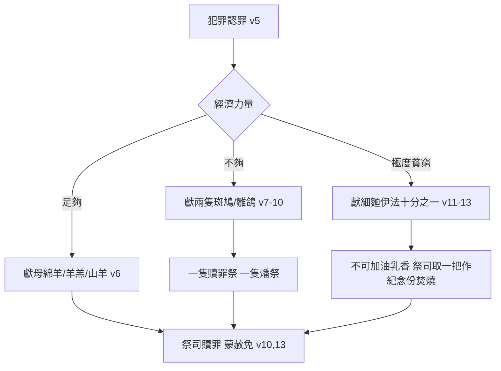

# 利未記 第5章

1. 若有人聽見發誓的聲音（或作：若有人聽見叫人發誓的聲音），他本是見證，卻不把所看見的、所知道的說出來，這就是罪；他要擔當他的罪孽。
2. 或是有人摸了[[污穢|不潔的物]]，無論是不潔的死獸，是不潔的死畜，是不潔的死蟲，他卻不知道，因此成了不潔，就有了罪。
3. 或是他摸了[[污穢|別人的污穢]]，無論是染了什麼污穢，他卻不知道，一知道了就有了罪。
4. 或是有人嘴裡[[冒失發誓]]，要行惡，要行善，無論人在什麼事上冒失發誓，他卻不知道，一知道了就要在這其中的一件上有了罪。
5. 他有了罪的時候，就要[[認罪|承認所犯的罪]]，
6. 並要因所犯的罪，把他的[[贖愆祭（asham）|贖愆祭牲]]─就是羊群中的[[母綿羊|母羊]]，或是一隻羊羔，或是一隻山羊─牽到耶和華面前為贖罪祭。至於他的罪，[[亞倫和他兒子（祭司）|祭司]]要為他贖了。
7. 他的力量若不夠獻一隻羊羔，就要因所犯的罪，把兩隻[[斑鳩]]或是兩隻[[雛鴿]]帶到耶和華面前為[[贖愆祭（asham）|贖愆祭]]：一隻作贖罪祭，一隻作燔祭。
8. 把這些帶到[[亞倫和他兒子（祭司）|祭司]]那裡，祭司就要先把那贖罪祭獻上，從鳥的頸項上揪下頭來，只是不可把鳥撕斷，
9. 也把些贖罪祭牲的[[血]]彈在壇的旁邊，剩下的血要流在壇的腳那裡；這是贖罪祭。
10. 他要照例獻第二隻為燔祭。至於他所犯的罪，[[亞倫和他兒子（祭司）|祭司]]要為他贖了，他必蒙赦免。
11. 他的力量若不夠獻兩隻[[斑鳩]]或是兩隻[[雛鴿]]，就要因所犯的罪帶[[供物（qorban）|供物]]來，就是[[細麵]][[伊法|伊法十分之一]]為贖罪祭；不可加上油，也不可加上乳香，因為是贖罪祭。
12. 他要把[[供物（qorban）|供物]]帶到[[亞倫和他兒子（祭司）|祭司]]那裡，祭司要取出自己的[[紀念份|一把]]來作為[[紀念份|紀念]]，按獻給耶和華火祭的條例燒在壇上；這是贖罪祭。
13. 至於他在這幾件事中所犯的罪，[[亞倫和他兒子（祭司）|祭司]]要為他贖了，他必蒙赦免。剩下的麵都歸與祭司，和素祭一樣。
14. 耶和華曉諭摩西說：
15. 人若在[[聖物|耶和華的聖物]]上誤犯了罪，有了過犯，就要照你所估的，按[[舍客勒|聖所的舍客勒]]拿銀子，將[[贖愆祭（asham）|贖愆祭牲]]─就是羊群中一隻沒有殘疾的[[公綿羊]]─牽到耶和華面前為贖愆祭；
16. 並且他因在[[聖物]]上的差錯要[[賠償（shalem）|償還]]，另外[[賠償（shalem）|加五分之一]]，都給[[亞倫和他兒子（祭司）|祭司]]。祭司要用[[贖愆祭（asham）|贖愆祭]]的[[公綿羊]]為他贖罪，他必蒙赦免。
17. 若有人犯罪，行了耶和華所吩咐不可行的什麼事，他雖然不知道，還是有了罪，就要擔當他的罪孽；
18. 也要照你所估定的價，從羊群中牽一隻沒有殘疾的[[公綿羊]]來，給[[亞倫和他兒子（祭司）|祭司]]作[[贖愆祭（asham）|贖愆祭]]。至於他誤行的那錯事，祭司要為他贖罪，他必蒙赦免。
19. 這是[[贖愆祭（asham）|贖愆祭]]，因他在耶和華面前實在有了罪。

---

## 本章知識節點

### 神學
- [[贖愆祭（asham）]]
- [[贖罪祭]]
- [[認罪]]
- [[賠償（shalem）]]

### 主題
- [[公綿羊]]
- [[母綿羊]]
- [[斑鳩]]
- [[雛鴿]]
- [[細麵]]
- [[血]]
- [[紀念份]]
- [[供物（qorban）]]

### 原文
- [[伊法]]
- [[舍客勒]]
- [[冒失發誓]]
- [[污穢]]
- [[聖物]]
- [[脂油（chelev）]]

---

## 本章整理

### 贖愆祭的觸發條件：三類無意之罪（v1-4）

利未記第五章開篇即列舉三種「誤犯」情境，皆屬無預謀卻在神面前構成實質罪愆。第一類是**見證人隱匿不報**（v1）：當審判官發誓聲音響起、傳喚知情者出庭作證，若親眼看見或親耳聽聞卻推託不知、不把真相說出來，便「要擔當他的罪孽」。《舊約聖經背景註釋》指出，這在古代近東極為常見，公開徵詢證據屬法庭常規程序；《聖經精讀本》補充摩西律法要求至少兩位見證人（民35:30；申17:6），見證人拒絕作證實質上護庇罪人、違背公義。第二類是**無意接觸不潔之物**（v2-3）：無論摸了不潔死獸、死畜、死蟲，或是摸了別人身上流出的[[污穢]]（如漏症、經血、屍體污穢），當事人「卻不知道」，事後一旦「知道了就有了罪」。《啟導本》強調這與故意觸摸不同，故意者只不潔到晚上、洗衣服即可（利11:24-39），無知者卻須獻祭贖罪，顯示神對禮儀潔淨的嚴格要求。第三類是**[[冒失發誓]]**（v4）：嘴裡輕率起誓「要行惡、要行善」，當下不覺得是發誓、或不覺得隨口發誓得罪神、或不覺得自己做不到，事後一旦醒悟，「就要在這其中的一件上有了罪」。《丁良才註釋》列舉耶弗他、掃羅、希律等負面例子，說明冒失發誓易陷自己於更大罪中；主耶穌在太5:37教導「你們的話，『是』就說『是』，『不是』就說『不是』」，正是針對此類輕率起誓的惡習。

### 分級供物與獻祭流程：神體恤貧窮的恩典（v5-13）

犯罪者「有了罪的時候，就要承認所犯的罪」（v5），[[認罪]]是獻祭前不可省略的步驟。《CT註解》引詩51:16-17指出：不肯悔改認罪，獻什麼祭物都不能除去罪；認罪乃表明認清罪惡、承認神聖潔、謙卑願意離棄罪。供物依經濟力量分三級：**第一級**（v6）獻[[母綿羊]]或一隻羊羔、或一隻山羊作贖罪祭；**第二級**（v7-10）力量不夠獻羊，帶兩隻[[斑鳩]]或兩隻[[雛鴿]]，一隻作贖罪祭、一隻作燔祭——《CT》解釋因鳥類脂油極少無法分離，故須雙鳥並獻，一隻全燒代替脂油、一隻歸祭司享用；**第三級**（v11-13）連雙鳥也買不起，帶[[細麵]][[伊法]]十分之一（約2.2公升）作贖罪祭，**不可加油、不可加乳香**，以區別於素祭的喜慶性質。《啟導本》註明細麵雖無血，但獻在燔祭壇上與他人祭牲之血同焚，符合「若不流血罪便不得赦免」（來9:22）的原則。祭司取一把細麵作[[紀念份]]焚於壇上，餘下歸祭司，如同素祭條例（利2:4-10）。這三級供物體現神「不按人的經濟力量定赦免，卻按誠實認罪的心定赦免」的恩典（KC）。

### 聖物誤犯與不可行之事的贖愆祭：賠償原則與基督預表（v14-19）

第14節起另起新段，專論[[贖愆祭（asham）]]——針對**侵犯神聖物**或**誤犯禁令**須「賠償加五分之一」的祭。第一類（v15-16）是「在耶和華的聖物上誤犯了罪」：如誤吃聖物、不獻初熟之物、不納[[舍客勒]]十分之一、不贖頭生的、用頭生公牛耕地剪頭生羊毛、不履行許願等（CT列舉七項）。犯罪者須按祭司估價（按[[舍客勒]]），牽一隻無殘疾的[[公綿羊]]作贖愆祭，**並償還虧欠額外加五分之一給祭司**，祭司用公綿羊為他贖罪才蒙赦免。第二類（v17-19）是「行了耶和華所吩咐不可行的什麼事，他雖然不知道，還是有了罪」：無知不能免責（林前4:4；路12:47-48），同樣獻無殘疾公綿羊，祭司為他誤行的錯事贖罪。KC深入指出：公綿羊預表基督完全獻上自己、將一切分別為聖歸神；「加五分之一」預表信徒認罪後當以更大熱心事奉（如彼得三次不認主後更殷勤牧養，彼後1:12-15）。《舊約背景註釋》補充古代近東赫人《廟宇官員指南》也將私取廟物、平民怠獻視為瀆聖，顯見贖愆祭處理「失信、瀆聖」屬跨文化法律共識。

### 跨章脈絡：贖罪祭與贖愆祭的神學分野與基督論整合

| 維度 | 贖罪祭 | 贖愆祭 |
|------|--------|--------|
| 英文名 | Sin Offering | Trespass/Guilt Offering |
| 對象 | 罪性（單數，根本得罪神） | 罪行（複數，具體虧損神或人） |
| 供物 | 公牛、公山羊、母綿羊、斑鳩/雛鴿、細麵 | 唯一指定無殘疾公綿羊 |
| 血禮 | 依身分灑幔前、抹香壇角、彈壇旁 | 僅灑壇周圍（如燔祭、平安祭） |
| 賠償 | 無 | 必須如數歸還、外加五分之一 |
| 基督預表 | 替罪人死、白白贖罪 | 償還人因罪所虧損、完全賠償 |

《CT靈訓》總結：贖罪祭預表基督替人死、白白贖罪；贖愆祭預表基督償還人因罪所虧損。賽53:10稱彌賽亞「以自己為贖愆祭」，新約在羅8:3、來13:11-12、彼前3:18見基督作贖罪祭，在太20:28、可10:45見基督捨命作多人的贖價（賠償）。利未記5章由此成為舊約獻祭制度中「認罪→分級供物→賠償加罰→祭司贖罪→蒙赦免」最完整的微縮圖景，直指十字架上「一次成就、永遠有效」的大祭司工作（來10:10-14）。

> [!important] 本章樞紐
> 1. **無知不免責**：三類誤犯（隱匿見證、觸污穢、冒失發誓）皆須認罪獻祭，神的聖潔標準不因人主觀無知而降低。
> 2. **分級供物彰顯恩典**：從母綿羊到雙鳥到細麵，神看重誠實認罪的心，超過供物的物質價值。
> 3. **贖愆祭核心是「賠償」**：侵犯聖物或誤犯禁令，必須「如數歸還、外加五分之一」，才能在神面前得赦免——這預表基督不僅除罪、更完全償還人對神與人的虧欠。

> [!question] 待釐清問題
> - 第6節稱「贖愆祭牲……為贖罪祭」，第7-10節又交替使用「贖愆祭」「贖罪祭」「燔祭」，諸家解經對「贖愆祭」與「贖罪祭」在本章的術語界限有不同切法（CT視本章前半為贖罪祭延伸、後半才是正式贖愆祭；KC則視全章為贖罪祭與贖愆祭中介形式），實際祭儀操作上兩祭血禮不同，經文卻混用術語，需結合利4-7章整體祭儀系統再研讀。
> - 「聖所的舍客勒」具體重量學界仍有爭議（考古出土舍客勒法碼介於9.3-10.5克），影響對「公綿羊至少值二舍客勒」傳統的評估。

**參考資料**
https://www.ccbiblestudy.org/Old%20Testament/03Lev/03CT05.htm
https://www.ccbiblestudy.org/Old%20Testament/03Lev/03GT05.htm
https://www.kingcomments.com/en/bible-studies/Lev/5
https://biblehub.com/study/leviticus/5.htm
