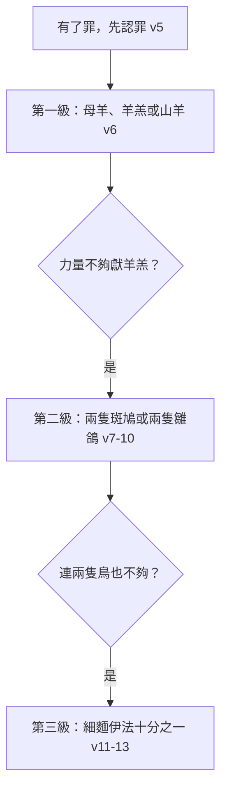

# 利未記 第5章

<!-- chapter-navigation:start -->
| [前一章](../03%20利未記/第4章.md) | [回目錄](../03%20利未記/全書目錄及綱要.md) | [下一章](../03%20利未記/第6章.md) |
| :--- | :---: | ---: |
<!-- chapter-navigation:end -->

1. 若有人聽見發誓的聲音（或作：若有人聽見叫人發誓的聲音），[[不作見證的罪|他本是見證]]，卻不把所看見的、所知道的說出來，這就是罪；他要擔當他的罪孽。
2. 或是有人摸了[[污穢|不潔的物]]，無論是不潔的死獸，是不潔的死畜，是不潔的死蟲，他卻不知道，因此成了不潔，就有了罪。
3. 或是他摸了[[污穢|別人的污穢]]，無論是染了什麼污穢，他卻不知道，一知道了就有了罪。
4. 或是有人嘴裡[[冒失發誓]]，要行惡，要行善，無論人在什麼事上冒失發誓，他卻不知道，一知道了就要在這其中的一件上有了罪。
5. 他有了罪的時候，就要[[認罪|承認所犯的罪]]，
6. 並要因所犯的罪，把他的[[贖愆祭（asham）|贖愆祭牲]]─就是羊群中的[[母綿羊|母羊]]，或是一隻羊羔，或是一隻山羊─牽到耶和華面前為[[贖罪祭]]。至於他的罪，[[亞倫和他兒子（祭司）|祭司]]要為他贖了。
7. 他的力量若不夠獻一隻羊羔，就要因所犯的罪，把兩隻[[斑鳩]]或是兩隻[[雛鴿]]帶到耶和華面前為[[贖愆祭（asham）|贖愆祭]]：一隻作[[贖罪祭]]，一隻作[[燔祭]]。
8. 把這些帶到[[亞倫和他兒子（祭司）|祭司]]那裡，祭司就要先把那[[贖罪祭]]獻上，從鳥的頸項上揪下頭來，只是不可把鳥撕斷，
9. 也把些[[贖罪祭]]牲的[[血]]彈在[[銅壇（燔祭壇）|壇的旁邊]]，剩下的血要流在[[銅壇（燔祭壇）|壇的腳]]那裡；這是贖罪祭。
10. 他要照例獻第二隻為[[燔祭]]。至於他所犯的罪，[[亞倫和他兒子（祭司）|祭司]]要為他贖了，他[[赦免|必蒙赦免]]。
11. 他的力量若不夠獻兩隻[[斑鳩]]或是兩隻[[雛鴿]]，就要因所犯的罪帶[[供物（qorban）|供物]]來，就是[[細麵]][[伊法|伊法十分之一]]為[[贖罪祭]]；不可加上油，也不可加上乳香，因為是贖罪祭。
12. 他要把[[供物（qorban）|供物]]帶到[[亞倫和他兒子（祭司）|祭司]]那裡，祭司要取出自己的[[紀念份|一把]]來作為[[紀念份|紀念]]，按獻給耶和華[[火祭（isheh）|火祭]]的條例燒在壇上；這是[[贖罪祭]]。
13. 至於他在這幾件事中所犯的罪，[[亞倫和他兒子（祭司）|祭司]]要為他贖了，他[[赦免|必蒙赦免]]。剩下的麵都歸與祭司，和素祭一樣。
14. 耶和華曉諭摩西說：
15. 人若在[[聖物|耶和華的聖物]]上[[誤犯|誤犯了罪]]，有了過犯，就要照你所估的，按[[舍客勒|聖所的舍客勒]]拿銀子，將[[贖愆祭（asham）|贖愆祭牲]]─就是羊群中一隻[[無殘疾（tamim）|沒有殘疾]]的[[公綿羊]]─牽到耶和華面前為贖愆祭；
16. 並且他因在[[聖物]]上的差錯要[[賠償|償還]]，另外[[賠償|加五分之一]]，都給[[亞倫和他兒子（祭司）|祭司]]。祭司要用[[贖愆祭（asham）|贖愆祭]]的[[公綿羊]]為他贖罪，他[[赦免|必蒙赦免]]。
17. 若有人犯罪，行了耶和華所吩咐不可行的什麼事，他雖然不知道，還是有了罪，就要擔當他的罪孽；
18. 也要照你所估定的價，從羊群中牽一隻[[無殘疾（tamim）|沒有殘疾]]的[[公綿羊]]來，給[[亞倫和他兒子（祭司）|祭司]]作[[贖愆祭（asham）|贖愆祭]]。至於他誤行的那錯事，祭司要為他贖罪，他[[赦免|必蒙赦免]]。
19. 這是[[贖愆祭（asham）|贖愆祭]]，因他在耶和華面前實在有了罪。

---

## 本章知識節點

### 神學
- [[贖罪祭]]
- [[贖罪祭與贖愆祭的分別]]
- [[不作見證的罪]]
- [[誤犯]]
- [[赦免]]
- [[燔祭]]
- [[馨香之氣]]

### 原文
- [[贖愆祭（asham）]]
- [[賠償]]
- [[舍客勒]]
- [[伊法]]
- [[供物（qorban）]]
- [[紀念份]]
- [[脂油]]

### 主題
- [[認罪]]
- [[冒失發誓]]
- [[污穢]]
- [[母綿羊]]
- [[公綿羊]]
- [[斑鳩]]
- [[雛鴿]]
- [[細麵]]
- [[血]]
- [[聖物]]
- [[銅壇（燔祭壇）]]
- [[火祭（isheh）]]
- [[無殘疾（tamim）]]

### 人物
- [[亞倫和他兒子（祭司）]]

---

## 本章整理

### 一章兩個祭名（v1-19）

利未記第 5 章讀起來容易混，因為它同時用了兩個祭名。v6 一句話裡就有兩個：「把他的**贖愆祭牲**……牽到耶和華面前**為贖罪祭**」。原文也的確是兩個字。

**[[贖罪祭與贖愆祭的分別|這兩種祭差在哪裡]]？** CT 用一句話概括：「贖罪祭的罪是指在根本上籠統得罪了神，而[[贖愆祭（asham）|贖愆祭]]的愆是指在零碎的行為上得罪了神。」他並引 F.B. Meyer 的分段：贖罪祭是利4:1-35，贖愆祭是利5:1-6:7，前者對付罪性，後者對付罪行。丁良才則整理出三個相同、五個不同——最實質的一項是[[賠償]]：[[贖罪祭]]沒有，贖愆祭有。

**本章前半到底算哪一種？各家判斷不一致：**
- **GT 丁良才：仍是贖罪祭。** 兩個證據——這祭在 6-9、11-12 節都稱為贖罪祭；祭牲也本來就是贖罪祭的祭牲。他甚至主張這一段本該歸在第四章。
- **GT《啟導本》**：「這裡雖用『贖愆祭』一詞，指的都是賠償的祭物……14～19節才是正式的『贖愆祭』。」
- **GT《精讀本》**：5:6 的「贖愆祭」是「單純奉獻祭物的意思」。
- **KC**：1-13 節是「贖罪祭與贖愆祭之間的一種中間形態」。
- **CT**：綱要把 1-19 節整段列為贖愆祭的條例。

### 三件具體的過犯（v1-4）

利4 講的是「誤犯」這個範疇，本章一開頭就給出三件具體的事。丁良才把它們列成：匿事不報、沾染污穢、[[冒失發誓]]。

| 過犯 | 經文 | 性質 |
|------|------|------|
| 該作見證卻不作 | v1 | 沒有做該做的事 |
| 摸了不潔的物、摸了別人的[[污穢]] | v2-3 | 做了不該做的事（身體） |
| 冒失發誓 | v4 | 做了不該做的事（口） |

**第一件與另外兩件不同。** v2-4 都以「他卻不知道」為條件，v1 卻不是——知情正是構成罪的前提。CT 說得很硬：「被召為見證人的若是匿事不報，便是護庇罪人……在真理上不能中立，是非是絕對的。」KC 把它與第九誡對照：不作假見證還不夠，「神也要求祂的百姓把真相說出來」。

**摸了不潔為什麼要獻祭？** 丁良才給了關鍵的一句：人若染了污穢，當場理會就有現成的潔淨辦法；「若當時忽略了，就必須獻本段所論的贖罪祭」。獻祭補的是那段「不知道所以沒有處理」的空窗。GT《精讀本》另提醒這種不潔「不是指道德和良心上的不潔、是指宗教儀式上的不潔」。

**冒失發誓的「不知道」有三種解法**（CT 與丁良才給的清單幾乎相同）：不知道冒失發誓是得罪神；因生氣或焦躁說話太急，自己不覺得是在發誓；不覺悟所發的誓是自己辦不到的。丁良才並舉了一串實例——耶弗他因危急、掃羅因事急、大衛因生氣、希律因高興、猶太人因妒恨；他指出這種話還容易連累別人：「希律發誓害了施洗的約翰。」

### 先認罪，再獻祭（v5）

第 5 節插進一句話：「他有了罪的時候，就要承認所犯的罪。」CT 的字義註解給「[[認罪|承認]]」為認罪、告白。

**這一步是本章新加的。** GT《舊約聖經背景註釋》把它點成本章與第四章的分界：這祭「與第四章的祭不同之處，在於認罪是必經步驟」。丁良才則留了一個保留：這裡的認罪與獻祭時按手的認罪「未必是一事」，並給認罪下了定義——「認罪就是將榮耀歸與神，使祂顯為公義」。

CT 的話中之光說得更直接：「獻祭的人若不肯悔改認罪，他獻甚麼祭物都不能除去罪。」

### 獻不起怎麼辦（v6-13）

本章往下開了三級，條件只有一個字：力量。

```mermaid
flowchart TD
    A["有了罪，先認罪 v5"] --> B["第一級：母羊、羊羔或山羊 v6"]
    B --> C{"力量不夠獻羊羔？"}
    C -->|"是"| D["第二級：兩隻斑鳩或兩隻雛鴿 v7-10"]
    D --> E{"連兩隻鳥也不夠？"}
    E -->|"是"| F["第三級：細麵伊法十分之一 v11-13"]
```

**第一級是[[母綿羊]]或山羊**（v6）。丁良才指出母羊比公羊便宜，對庶民更合適。

**第二級是兩隻鳥**（v7-10）：[[斑鳩]]或[[雛鴿]]，一隻作贖罪祭，一隻作[[燔祭]]。為什麼獻燔祭只要一隻、這裡卻要兩隻？四家的答案一致，都指向[[脂油]]——CT：「因為獻鳥時，不能分開脂油和肉，分別兩種用途，故須獻上兩隻。」丁良才講得更完整：獻牛羊時壇上所燒的脂油就代表獻祭者把自己獻給神（那正是燔祭的意思），但鳥沒有多少脂油，所以拆成兩隻。KC 的說法相同：第二隻鳥的燔祭是「較大贖罪祭中脂油的替代」。

獻法也不一樣：祭司「從鳥的頸項上揪下頭來，只是不可把鳥撕斷」，[[血]]「彈在壇的旁邊」，剩下的流在[[銅壇（燔祭壇）|壇的腳]]那裡。丁良才解釋為何不像牛羊那樣灑在壇的四周——「贖罪祭之鳥的血是不多的」。他並把贖罪祭牲的血整理成三種用法：鳥彈壇旁、羊抹壇角、公牛帶進會幕彈幔子。次序也不可顛倒：CT 與丁良才都特別點出 v8 的「先」字，先獻贖罪祭，然後才獻燔祭。

**第三級是[[細麵]]**（v11-13）：[[伊法]]十分之一，約 2.2 公升。這是整套獻祭條例裡唯一一次讓不流血的東西作贖罪祭。丁良才明說：「本來血祭才算是贖罪祭，但神在此是特要體恤最貧窮的人。」而它仍附在血祭的原則之下——GT《啟導本》與《精讀本》都指出這一把要燒在燔祭壇上、與壇上的[[火祭（isheh）|火祭]]同焚。祭司取的那一把叫[[紀念份|作為紀念]]，其餘歸祭司，「和素祭一樣」。

**這一級的[[供物（qorban）|供物]]明令不可加油、不可加乳香。** CT 與 GT《串珠》說是為了與素祭區別；CT 的話中之光另讀出態度上的分別：「是表明為罪刻苦憂痛，與獻祭榮耀神不同」；GT《舊約聖經背景註釋》講得最白：「油和乳香與喜慶有關，這不是慶典，所以不當獻。」

KC 從另一個角度看這三級：祭物的大小反映的是獻祭者對這罪、對主耶穌受苦有多少認識——但赦免不是按人的領悟深淺，「是按神在那祭物上所看見的價值」。

### 贖愆祭：先賠償，再獻祭（v14-19）

第 14 節重新起頭，這才是正式的贖愆祭條例。兩段各處理一種情形：

**一、在耶和華的[[聖物]]上誤犯**（v15-16）。CT 與丁良才列出同一份七項清單：誤吃了聖物、不獻初熟之物、不納十分之一、不贖頭生的、用頭生的公牛耕地或剪頭生公羊的毛、不承認所許之願，以及其他叫神或會幕受虧損的事。處理方式是三步：按祭司的估價如數償還、另加五分之一、再獻[[無殘疾（tamim）|沒有殘疾]]的[[公綿羊]]。

**二、行了耶和華所吩咐不可行的事**（v17-19）。同樣獻公綿羊，但沒有罰金。丁良才推想理由：「這或者因為銀子不能賠補本段所論的罪。」

**祭牲只有一種，而且要估價。** 丁良才把「只有一種祭牲」列為兩祭五個差別之一；KC 讀出其中的意思：「這指明這祭對每一個人都是一樣的」——贖罪祭按身分與財力分級，贖愆祭不分。估價用的是聖所的[[舍客勒]]，CT 說明那是聖所內使用的砝碼，每一舍客勒約折合 11.5 公克；GT《舊約聖經背景註釋》補上考古數據：「考古學家挖掘到的舍客勒法碼，重量在九又十分之三至十又二分之一克之間。」丁良才另點出一個原則：「有過犯的人不能定自已差錯的大小，也就不可定自己所該獻之祭牲的價值。」

**加的五分之一是什麼？** GT《串珠》分成兩面：「一方面是補償合法物主的損失，另一方面則作為犯罪者的刑罰。」

**次序不可顛倒。** 丁良才寫得很明白：「人若在聖物上有差錯，或虧損了別人，就要先償還所虧損的，然後祭司才可以獻他所牽來的贖愆祭牲，為他贖罪。」四段條例最後都以同一句作結：他必[[赦免|蒙赦免]]。

v15 說公綿羊「牽到耶和華面前」，v18 卻說「給[[亞倫和他兒子（祭司）|祭司]]作贖愆祭」，兩處看似不一。GT 收錄的《聖經難解經文詮釋手冊》解答：這是把羊交給祭司、由祭司獻給耶和華——「在以色列，祭司是代表人向著神，而先知是神對人的代表」。丁良才用一個比方說同一件事：「人納稅給稅務處，也可說是給了國家。」

### 原文層能證明什麼、不能證明什麼

**原文層（STEP Bible）能直接證實的語言事實**

| 經文 | 原文與編號 | STEP 的說明 | 對得上哪一家 |
|------|------------|-------------|--------------|
| v6 | H817 與 H2403H 同節並用 | 「他的贖愆祭」＋「作為贖罪祭」 | 兩個祭名確實同時出現，非譯者疏失 |
| v6 | H3776／H8166 | 「母羊羔」／「母山羊」 | 兩種都是雌的，丁良才「母羊比公羊少值錢」 |
| v15 | H4603＋H4604 | 「他行了不忠」＋「不忠」 | 背景註釋讀為「失信」的依據 |
| v15 | H352A | 「公綿羊」，與前半的母羊羔不同字 | 贖愆祭只有一種祭牲 |
| v15 | H6187 | 「估價」自成一個專詞 | CT／丁良才論聖所舍客勒估價 |
| v15 | H6944G | 「聖物」與「聖所」同一個字 | 干犯聖物與聖所的舍客勒用同一詞根 |
| v1 | H5315J | 「人」字面是「魂、人」 | 本章與利4:2 起頭用同一個字 |

**原文層不能證明的**——本章前半究竟該算贖罪祭還是贖愆祭，原文只能顯示兩個字都在，判斷仍是各家的解讀。GT《利未記背景注釋》說「古代近東其他獻祭系統都沒有這兩樣祭的存在」，那是綜合外部文獻得出的判斷，不是本章原文能定的事。另有兩處屬靈意讀法：細麵預表對主耶穌的工作認識極淺的人，以及加五分之一預表更深的委身，兩者都出自 KC。詞典給的是這個字可能的意思範圍，語法給的是詞形，兩者都不會自己長出神學結論。

**參考資料**
https://www.ccbiblestudy.org/Old%20Testament/03Lev/03CT05.htm
https://www.ccbiblestudy.org/Old%20Testament/03Lev/03GT05.htm
https://www.kingcomments.com/en/bible-studies/Lev/5
https://biblehub.com/study/leviticus/5.htm
https://github.com/STEPBible/STEPBible-Data

<!-- chapter-navigation:start -->
| [前一章](../03%20利未記/第4章.md) | [回目錄](../03%20利未記/全書目錄及綱要.md) | [下一章](../03%20利未記/第6章.md) |
| :--- | :---: | ---: |
<!-- chapter-navigation:end -->
