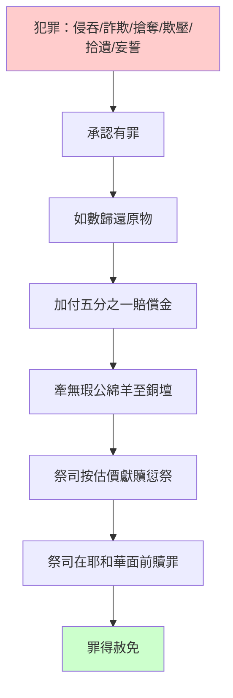
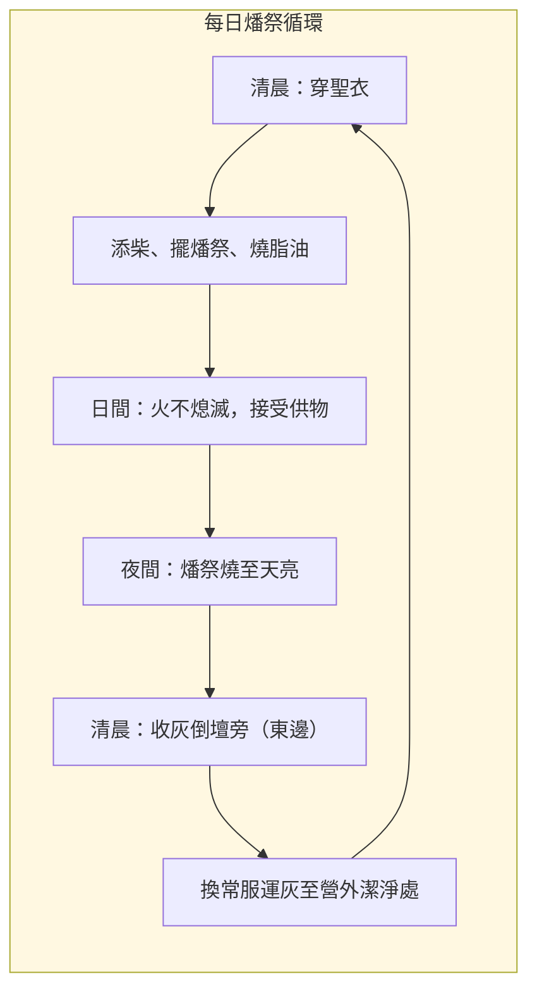
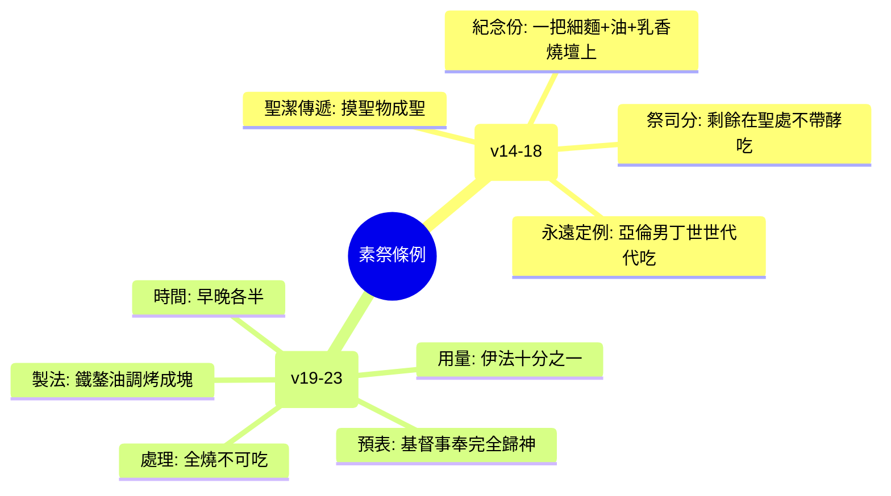
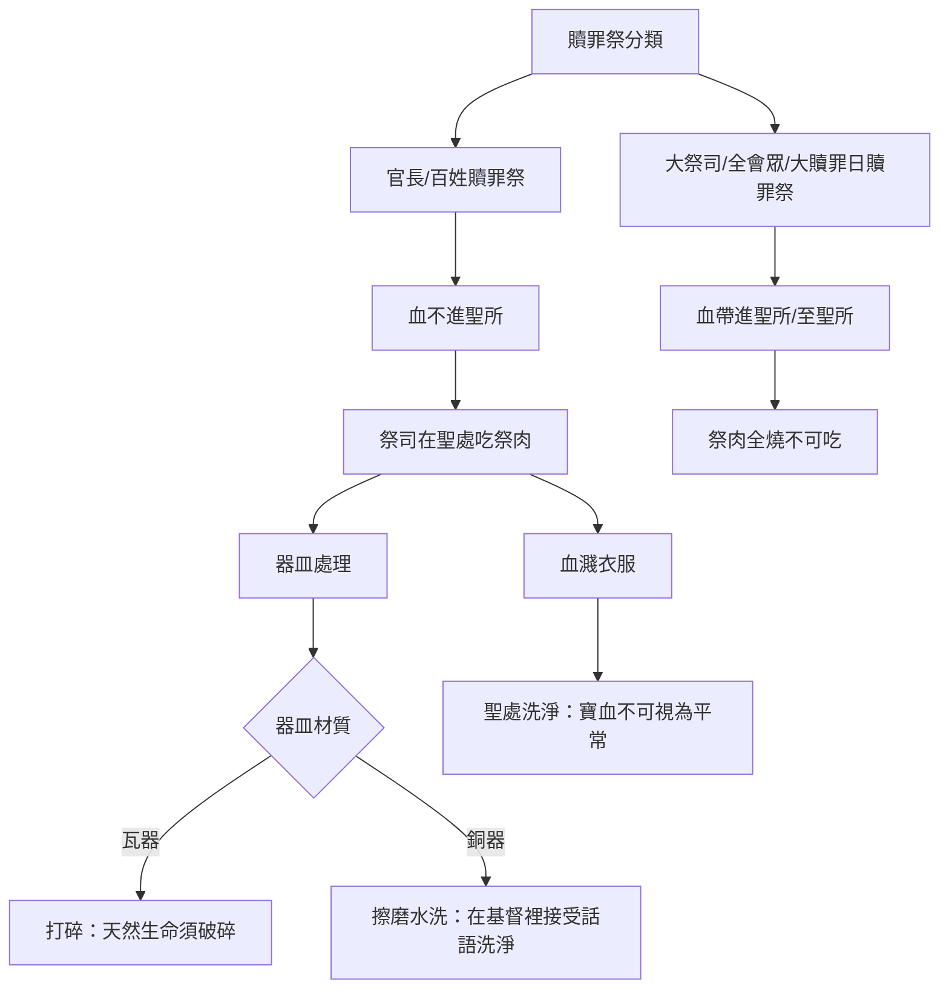

# 利未記 第6章

1. 耶和華曉諭摩西說：
2. 若有人犯罪，[[虧負鄰舍即干犯耶和華|干犯耶和華]]，在鄰舍交付他的物上，或是在交易上行了詭詐，或是搶奪人的財物，或是欺壓鄰舍，
3. 或是在撿了遺失的物上行了詭詐，說謊起誓，在這一切的事上犯了什麼罪；
4. 他既犯了罪，有了過犯，就要歸還他所搶奪的，或是因欺壓所得的，或是人交付他的，或是人遺失他所撿的物，
5. 或是他因什麼物起了假誓，就要如數歸還，另外加上五分之一，在查出他有罪的日子要交還本主。
6. 也要照你所估定的價，把[[贖愆祭（asham）|贖愆祭]]牲─就是羊群中一隻沒有殘疾的[[公綿羊]]─牽到耶和華面前，給祭司為贖愆祭。
7. 祭司要在耶和華面前為他贖罪；他無論行了什麼事，使他有了罪，都必蒙赦免。
8. 耶和華曉諭摩西說：
9. 你要吩咐[[亞倫子孫|亞倫和他的子孫]]說，[[燔祭]]的條例乃是這樣：燔祭要放在壇的柴上，從晚上到天亮，壇上的火要常常燒著。
10. 祭司要穿上細麻布衣服，又要把[[褲子（細麻布褲子）|細麻布褲子]]穿在身上，把壇上所燒的[[燔祭]]灰收起來，倒在壇的旁邊；
11. 隨後要脫去這衣服，穿上別的衣服，把灰拿到[[潔淨之地（maqom tahor）|營外潔淨之處]]。
12. 壇上的火要在其上常常燒著，不可熄滅。祭司要每日早晨在上面燒柴，並要把[[燔祭]]擺在壇上，在其上燒平安祭牲的[[脂油（chelev）|脂油]]。
13. 在壇上必有常常燒著的火，不可熄滅。
14. [[素祭（minchah）|素祭]]的條例乃是這樣：亞倫的子孫要在壇前把這祭獻在耶和華面前。
15. 祭司要從其中─就是從[[素祭（minchah）|素祭]]的細麵中─取出自己的一把，又要取些油和素祭上所有的乳香，燒在壇上，奉給耶和華為馨香素祭的紀念。
16. 所剩下的，亞倫和他子孫要吃，必在聖處不帶酵而吃，要在會幕的院子裡吃。
17. 烤的時候不可攙酵。這是從所獻給我的火祭中賜給他們的分，是[[至聖的供物（聖與至聖之分）|至聖的]]，和[[贖罪祭]]並[[贖愆祭（asham）|贖愆祭]]一樣。
18. 凡獻給耶和華的火祭，[[亞倫子孫|亞倫子孫中的男丁]]都要吃這一分，直到萬代，作他們[[永遠的定例（chuqqat olam）|永得的分]]。摸這些祭物的，都要成為聖。
19. 耶和華曉諭摩西說：
20. 當亞倫受膏的日子，[[亞倫子孫|他和他子孫]]所要獻給耶和華的[[供物（qorban）|供物]]，就是細麵[[伊法]]十分之一，為常獻的[[素祭（minchah）|素祭]]：早晨一半，晚上一半。
21. 要在鐵鏊上用油調和做成，調勻了，你就拿進來；烤好了分成塊子，獻給耶和華為馨香的[[素祭（minchah）|素祭]]。
22. 亞倫的子孫中，接續他為[[受膏的祭司（mashiach kohen）|受膏的祭司]]，要把這[[素祭（minchah）|素祭]]獻上，要全燒給耶和華。這是[[永遠的定例（chuqqat olam）|永遠的定例]]。
23. 祭司的[[素祭（minchah）|素祭]]都要燒了，卻不可吃。
24. 耶和華曉諭摩西說：
25. 你對[[亞倫子孫|亞倫和他的子孫]]說，[[贖罪祭]]的條例乃是這樣：要在耶和華面前、宰[[燔祭]]牲的地方宰贖罪祭牲；這是[[至聖的供物（聖與至聖之分）|至聖的]]。
26. 為贖罪獻這祭的祭司要吃，要在聖處，就是在會幕的院子裡吃。
27. 凡摸這祭肉的要成為聖；這祭牲的[[血]]若彈在什麼衣服上，所彈的那一件要在聖處洗淨。
28. 惟有煮祭物的瓦器要打碎；若是煮在銅器裡，這銅器要擦磨，在水中涮淨。
29. 凡祭司中的男丁都可以吃；這是[[至聖的供物（聖與至聖之分）|至聖的]]。
30. 凡[[贖罪祭]]，若將[[血]]帶進會幕在聖所贖罪，那肉都不可吃，必用火焚燒。

---

## 本章知識節點

### 神學
- [[虧負鄰舍即干犯耶和華]]
- [[摸聖物成聖]]
- [[燔祭]]
- [[馨香之氣]]
- [[永遠的定例（chuqqat olam）]]
- [[贖罪祭]]
- [[每日獻祭（常獻燔祭）]]

### 主題
- [[壇火常燒不熄滅]]
- [[瓦器打碎銅器擦淨]]
- [[大祭司受膏日常獻的素祭]]
- [[公綿羊]]
- [[銅壇（燔祭壇）]]
- [[至聖的供物（聖與至聖之分）]]
- [[血]]
- [[聖衣（祭司聖服）]]
- [[褲子（細麻布褲子）]]

### 原文
- [[贖愆祭（asham）]]
- [[賠償（shalem）]]
- [[供物（qorban）]]
- [[脂油（chelev）]]
- [[素祭（minchah）]]
- [[紀念份]]
- [[伊法]]

### 人物
- [[亞倫子孫]]
- [[受膏的祭司（mashiach kohen）]]
- [[全會眾（kol ha-edah）]]

### 地點
- [[潔淨之地（maqom tahor）]]

---

## 本章整理

### 贖愆祭：虧負鄰舍即干犯耶和華（v1-7）

利未記第六章開篇即確立一項核心神學原則：**[[虧負鄰舍即干犯耶和華]]**。經文列舉六類具體罪行——侵吞託付之物、交易詭詐、搶奪、欺壓、拾遺不報、妄誓（v2-3）——皆屬「干犯耶和華」的不忠行為。CT 指出：「人任何得罪別人的事，都是干犯神的」；GT 引丁良才註釋：「做害人的事，也是干犯神（出二十12-17）」。這與雅各書4:4「與世俗為友就是與神為敵」的邏輯一致：破壞人際關係即破壞約關係。

[[贖愆祭（asham）|贖愆祭]]程序分兩階段：**先向人賠償，再向神獻祭**。v4-5 規定「如數歸還，另外加上五分之一」，這「五分之一」是懲罰性[[賠償（shalem）|賠償]]，KC 解釋：「我必須歸還多於我造成的傷害……不只停止毀謗，還要尊榮對方」。GT 引《啟導本》強調：「賠償也須用銀子支付，要犯罪的人明白，破壞人際關係、失信背約，須付出高代價」。v6-7 再要求牽「沒有殘疾的[[公綿羊]]」至[[銅壇（燔祭壇）|銅壇]]前，由[[亞倫子孫|祭司]]按估定價獻為[[贖愆祭（asham）|贖愆祭]]，[[亞倫子孫|祭司]]在耶和華面前贖罪，罪便得赦免。

KC 深刻對比：「審判罪在神光中固然必要，除此之外，我還得補上我虧欠的」。這預表基督作完全的[[贖愆祭（asham）|贖愆祭]]（西2:13），祂不僅除去罪債，更恢復被破壞的關係。CT「話中之光」警告：「若遲延不還，良心越過越沒有聲音……或是越過越厲害，叫你在人的面前不能開口」。真實悔改必結出「與悔改相稱的果子」（太3:8）。

### 燔祭條例：壇火常燒不熄滅（v8-13）

自 v8 起轉向**[[亞倫子孫|祭司]]視角**的獻祭條例（KC：「這裡開始的是針對祭司的律法……更主觀，關乎祭司如何處理供物」）。[[燔祭]]條例核心在**[[壇火常燒不熄滅]]**，本章三次重複（v9,12,13），CT 靈意註解：「表徵『要殷勤不可懶惰，靈裡火熱，常常服事主』（羅十二11）」。CT《話中之光》：「神要祂的百姓知道，他們與神交通的門路是常常開著的」。

[[亞倫子孫|祭司]]每日流程形成嚴謹循環：
1. **清晨**：穿[[聖衣（祭司聖服）|聖衣]]（細麻布長袍、[[褲子（細麻布褲子）|褲子]]），添柴，擺上[[燔祭]]，燒平安祭的[[脂油（chelev）|脂油]]（v12）。
2. **日間**：火持續燃燒，接受百姓各樣[[供物（qorban）|供物]]。
3. **夜間**：[[燔祭]]在柴上燒至天亮（v9）。
4. **清晨**：換[[聖衣（祭司聖服）|聖衣]]收灰倒壇旁（東邊），再換常服將灰運至營外[[潔淨之地（maqom tahor）|潔淨之地]]（v10-11）。

CT 靈意註解灰的處理：「灰倒在祭壇東邊日出方向，表徵死不是結局，而要帶進復活」；「營外表徵世界；信徒當把身體獻上，活著事奉神（羅十二1）」。KC 則著重[[亞倫子孫|祭司]]換衣服的意義：「細麻布長袍代表義行（啟19:8）……換常服出營外，代表另一面的生活——『營外』（來13:13）意指承認我們站在被棄絕的主一邊」。

| 祭司動作 | 經文 | 屬靈意義（CT/KC） |
|----------|------|-------------------|
| 穿細麻布聖衣 | v10 | 義行、聖潔分別 |
| 收灰倒壇東邊 | v10 | 死非結局，指向復活 |
| 換常服出營外 | v11 | 與基督同受凌辱（來13:13） |
| 添柴使火不熄 | v12-13 | 靈裡火熱，常常服事主 |
| 燒平安祭脂油 | v12 | 將上好的、因感恩獻給神 |

### 素祭條例：祭司的分與大祭司受膏日常獻的素祭（v14-23）

[[素祭（minchah）|素祭]]條例分兩層：**一般[[素祭（minchah）|素祭]]**（v14-18）與**[[大祭司受膏日常獻的素祭]]**（v19-23）。前者「所剩下的，[[亞倫子孫]]要吃，必在聖處不帶酵而吃，要在會幕的院子裡吃」（v16），CT 指出：「表徵唯有事奉神的人（[[亞倫子孫|祭司]]），可以在聖潔原則下享用基督的豐富」。GT 引丁良才：「神為現在的教會也是這樣命定，叫傳福音的靠著福音養生（林前九7,11,13-14,18）」。

關鍵規定：
- **[[紀念份]]**：[[亞倫子孫|祭司]]取一把細麵、油、乳香燒在壇上，作「[[馨香之氣]]」（v15）。
- **不可帶酵**：無論烤或吃都不可攙酵（v17），酵象徵罪的傳染性（林前5:7-8）。
- **[[至聖的供物（聖與至聖之分）|至聖的供物]]**：[[素祭（minchah）|素祭]]屬「至聖」，與[[贖罪祭]]、[[贖愆祭（asham）|贖愆祭]]同列（v17）；「摸這些祭物的，都要成為聖」（v18）——**[[摸聖物成聖]]**原則，CT 解為「凡與祭物接觸過的人與物都成為聖」，KC 則強調「外在的聖潔（林前7:14），不等於永生」。

[[大祭司受膏日常獻的素祭]]（v19-23）獨特處在於**「要全燒給耶和華，卻不可吃」**（v22-23）。[[伊法]]十分之一細麵（約2.2公升），早晚各半，在鐵鏊上用油調和烤成塊子（v20-21）。CT 解釋：「大祭司若吃自己所獻的，那祭就與沒有獻上一樣……表徵基督在肉身裡的事奉完全為著神的（太三16-17）」。這預表基督作[[受膏的祭司（mashiach kohen）|大祭司]]，祂的獻身完全歸神，無人可分享。

### 贖罪祭條例：摸聖物成聖與器皿處理（v24-30）

[[贖罪祭]]條例著重**[[亞倫子孫|祭司]]吃祭肉的規範**與**聖潔傳遞的機制**。v25-26 規定[[贖罪祭]]在[[銅壇（燔祭壇）|燔祭壇]]北邊宰殺，屬「至聖」；獻祭的[[亞倫子孫|祭司]]在會幕院子（聖處）吃祭肉。但 v30 劃出例外：**「若將血帶進會幕在聖所贖罪，那肉都不可吃，必用火焚燒」**，這針對[[受膏的祭司（mashiach kohen）|大祭司]][[贖罪祭]]、[[全會眾（kol ha-edah）|全會眾]][[贖罪祭]]、大贖罪日[[贖罪祭]]（四3-11,13-21,十六27）。

**器皿處理**極具神學張力（v28）：
- **[[瓦器打碎銅器擦淨|瓦器打碎]]**：陶器多孔，吸收祭肉汁液無法淨化，須打碎——CT 靈意：「瓦器表徵人天然生命，須十字架破碎」。
- **[[瓦器打碎銅器擦淨|銅器擦淨]]**：銅不吸收，擦磨水洗即可——CT 靈意：「銅器表徵審判；基督已滿足神公義審判，信徒在基督裡只要接受話語光照（詩119:130）與水洗（弗5:26）」。

**[[血]]的處理**（v27）同樣嚴謹：祭牲[[血]]若濺在衣服上，須在聖處洗淨。KC 指出：「這顯示血對我行為的大能影響……我若再次領悟基督寶血的意義，生命必更謙卑，話語之水洗淨與謙卑衝突的事物」。GT 引《舊約背景註釋》補充古代近東背景：「這祭的血吸收了不潔，衣物亦因此成為不潔，所以需要洗淨」。

### 跨章脈絡：獻祭制度的祭司視角與基督預表

利未記6-7 章將前五章「獻祭者視角」的條例轉為「[[亞倫子孫|祭司]]視角」的執行細則（KC：「前段較客觀，關乎神心意的對象；此段較主觀，關乎祭司如何處理供物、效果如何臨到我們」）。這雙重視角對應約翰福音4:23-24：特權是「父尋找這樣的人拜祂」，規範是「神是靈，拜祂的必須用靈和真理」。

**五祭次序重排**極具啟示：[[燔祭]]→[[素祭（minchah）|素祭]]→[[贖罪祭]]→[[贖愆祭（asham）|贖愆祭]]→平安祭（KC：「先是神聞之馨香的，然後是人必須潔淨無罪，最後在平安祭裡表達神與祂百姓、百姓彼此的團契」）。平安祭指向「主的桌子」。

**[[亞倫子孫|祭司]]分與聖潔傳遞**形成完整神學圖景：
- [[燔祭]]：全燒，無人分（神獨得）
- [[素祭（minchah）|素祭]]：[[紀念份]]歸神，餘分歸[[亞倫子孫|祭司]]在聖處吃（事奉者享用基督豐富）
- [[贖罪祭]]/[[贖愆祭（asham）|贖愆祭]]：[[脂油（chelev）|脂油]]歸神，肉歸[[亞倫子孫|祭司]]在聖處吃（代贖恩典供應事奉者）
- 平安祭：胸腿歸[[亞倫子孫|祭司]]，其餘歸獻祭者同吃（團契分享）

**[[摸聖物成聖]]**（v18,27）與**[[瓦器打碎銅器擦淨]]**（v28）共同揭示：聖潔具有傳遞性，但傳遞管道須經十字架破碎（瓦器）或基督審判滿足（銅器）。這預表新約信徒「作聖潔的祭司，藉著耶穌基督獻上神所悅納的靈祭」（彼前2:5）。

| 供物類別 | 神的分 | 祭司的分 | 獻祭者的分 | 吃的地點 | 聖潔等級 |
|----------|--------|----------|------------|----------|----------|
| 燔祭 | 全燒 | 無 | 無 | — | 至聖 |
| 素祭 | 紀念份(一把細麵+油+乳香) | 剩餘細麵餅 | 無 | 聖處(會幕院子) | 至聖 |
| 贖罪祭(官長/民) | 脂油 | 祭肉 | 無 | 聖處 | 至聖 |
| 贖罪祭(大祭司/會眾/贖罪日) | 全燒(含肉) | 無 | 無 | — | 至聖 |
| 贖愆祭 | 脂油 | 祭肉 | 無 | 聖處 | 至聖 |
| 平安祭(會眾) | 脂油+胸腿 | 胸腿(搖祭/舉祭) | 其餘肉 | 潔淨處 | 聖(非至聖) |

**本章樞紐**：[[亞倫子孫|祭司]]制度不是特權階級，乃是「被分別為聖以事奉神、並將神的聖潔傳遞給百姓」的管道。每日[[壇火常燒不熄滅]]、早晚[[素祭（minchah）|素祭]]不斷、[[贖罪祭]]肉在聖處吃、器皿嚴格分別，都指向一個中心：**神與人交通的道路必須時刻敞開、絲毫不馬虎**。基督作[[受膏的祭司（mashiach kohen）|大祭司]]、[[供物（qorban）|祭物]]、[[銅壇（燔祭壇）|壇]]、火，一次成就了這一切，使我們今日能「坦然無懼地來到施恩的寶座前」（來4:16）。

**參考資料**
https://www.ccbiblestudy.org/Old%20Testament/03Lev/03CT06.htm
https://www.ccbiblestudy.org/Old%20Testament/03Lev/03GT06.htm
https://www.kingcomments.com/en/bible-studies/Lev/6
https://biblehub.com/study/leviticus/6.htm
