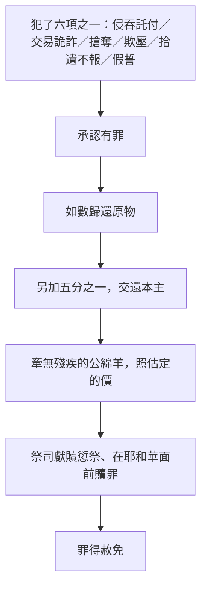
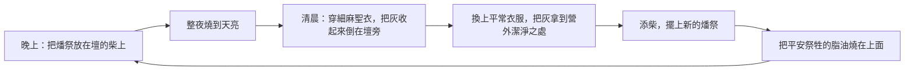
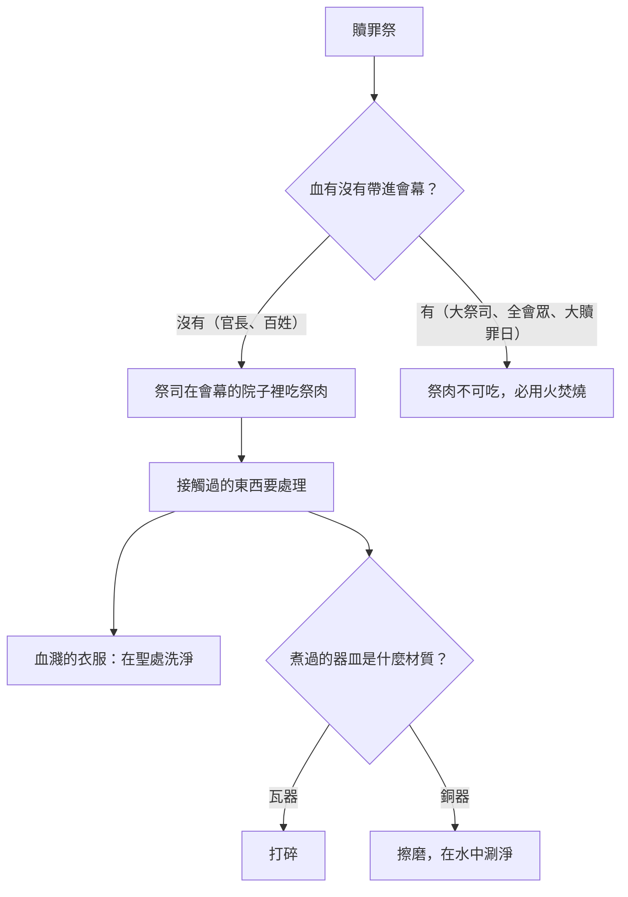

# 利未記 第6章

<!-- chapter-navigation:start -->
| [前一章](../03%20利未記/第5章.md) | [回目錄](../03%20利未記/全書目錄及綱要.md) | [下一章](../03%20利未記/第7章.md) |
| :--- | :---: | ---: |
<!-- chapter-navigation:end -->

1. 耶和華曉諭摩西說：
2. 若有人犯罪，[[虧負鄰舍即干犯耶和華|干犯耶和華]]，在鄰舍交付他的物上，或是在交易上行了詭詐，或是搶奪人的財物，或是欺壓鄰舍，
3. 或是在撿了遺失的物上行了詭詐，說謊起誓，在這一切的事上犯了什麼罪；
4. 他既犯了罪，有了過犯，就要歸還他所搶奪的，或是因欺壓所得的，或是人交付他的，或是人遺失他所撿的物，
5. 或是他因什麼物起了假誓，就要如數歸還，另外加上五分之一，在查出他有罪的日子要交還本主。
6. 也要照你所估定的價，把[[贖愆祭（asham）|贖愆祭]]牲─就是羊群中一隻沒有殘疾的[[公綿羊]]─牽到耶和華面前，給祭司為贖愆祭。
7. 祭司要在耶和華面前為他贖罪；他無論行了什麼事，使他有了罪，都必蒙赦免。
8. 耶和華曉諭摩西說：
9. 你要吩咐[[亞倫和他兒子（祭司）|亞倫和他的子孫]]說，[[燔祭]]的條例乃是這樣：燔祭要放在壇的柴上，從晚上到天亮，壇上的火要常常燒著。
10. 祭司要穿上細麻布衣服，又要把[[褲子（細麻布褲子）|細麻布褲子]]穿在身上，把壇上所燒的[[燔祭]]灰收起來，倒在壇的旁邊；
11. 隨後要脫去這衣服，穿上別的衣服，把灰拿到[[潔淨之地|營外潔淨之處]]。
12. 壇上的火要在其上常常燒著，不可熄滅。祭司要每日早晨在上面燒柴，並要把[[燔祭]]擺在壇上，在其上燒平安祭牲的[[脂油]]。
13. 在壇上必有常常燒著的火，不可熄滅。
14. [[素祭（minchah）|素祭]]的條例乃是這樣：亞倫的子孫要在壇前把這祭獻在耶和華面前。
15. 祭司要從其中─就是從[[素祭（minchah）|素祭]]的細麵中─取出自己的一把，又要取些油和素祭上所有的乳香，燒在壇上，奉給耶和華為馨香素祭的紀念。
16. 所剩下的，亞倫和他子孫要吃，必在聖處不帶酵而吃，要在會幕的院子裡吃。
17. 烤的時候不可攙酵。這是從所獻給我的火祭中賜給他們的分，是[[至聖的供物（聖與至聖之分）|至聖的]]，和[[贖罪祭]]並[[贖愆祭（asham）|贖愆祭]]一樣。
18. 凡獻給耶和華的火祭，[[亞倫和他兒子（祭司）|亞倫子孫中的男丁]]都要吃這一分，直到萬代，作他們[[永遠的定例|永得的分]]。摸這些祭物的，都要成為聖。
19. 耶和華曉諭摩西說：
20. 當亞倫受膏的日子，[[亞倫和他兒子（祭司）|他和他子孫]]所要獻給耶和華的[[供物（qorban）|供物]]，就是細麵[[伊法]]十分之一，為常獻的[[素祭（minchah）|素祭]]：早晨一半，晚上一半。
21. 要在鐵鏊上用油調和做成，調勻了，你就拿進來；烤好了分成塊子，獻給耶和華為馨香的[[素祭（minchah）|素祭]]。
22. 亞倫的子孫中，接續他為[[受膏的祭司]]，要把這[[素祭（minchah）|素祭]]獻上，要全燒給耶和華。這是[[永遠的定例]]。
23. 祭司的[[素祭（minchah）|素祭]]都要燒了，卻不可吃。
24. 耶和華曉諭摩西說：
25. 你對[[亞倫和他兒子（祭司）|亞倫和他的子孫]]說，[[贖罪祭]]的條例乃是這樣：要在耶和華面前、宰[[燔祭]]牲的地方宰贖罪祭牲；這是[[至聖的供物（聖與至聖之分）|至聖的]]。
26. 為贖罪獻這祭的祭司要吃，要在聖處，就是在會幕的院子裡吃。
27. 凡摸這祭肉的要成為聖；這祭牲的[[血]]若彈在什麼衣服上，所彈的那一件要在聖處洗淨。
28. 惟有煮祭物的瓦器要打碎；若是煮在銅器裡，這銅器要擦磨，在水中涮淨。
29. 凡祭司中的男丁都可以吃；這是[[至聖的供物（聖與至聖之分）|至聖的]]。
30. 凡[[贖罪祭]]，若將[[血]]帶進會幕在聖所贖罪，那肉都不可吃，必用火焚燒。

---

## 本章知識節點

### 神學
- [[虧負鄰舍即干犯耶和華]]
- [[摸聖物成聖]]
- [[燔祭]]
- [[馨香之氣]]
- [[永遠的定例]]
- [[贖罪祭]]
- [[每日獻祭（常獻燔祭）]]
- [[聖俗潔淨不潔淨的分別]]
- [[祭司吃贖罪祭的意義]]

### 主題
- [[壇火常燒不熄滅]]
- [[瓦器打碎銅器擦淨]]
- [[大祭司受膏日常獻的素祭]]
- [[祭司的分（靠祭物養生）]]
- [[公綿羊]]
- [[銅壇（燔祭壇）]]
- [[至聖的供物（聖與至聖之分）]]
- [[血]]
- [[聖衣（祭司聖服）]]
- [[褲子（細麻布褲子）]]
- [[會幕院子]]
- [[細麵]]
- [[素祭不可有酵與蜜]]

### 原文
- [[贖愆祭（asham）]]
- [[賠償]]
- [[供物（qorban）]]
- [[脂油]]
- [[素祭（minchah）]]
- [[紀念份]]
- [[伊法]]

### 人物
- [[亞倫和他兒子（祭司）]]
- [[受膏的祭司]]
- [[全會眾]]

### 地點
- [[潔淨之地]]

---

## 本章整理

### 欺負鄰舍，聖經算成得罪神（v1-7）

這一段列的都是很日常的糾紛：別人寄放在你這裡的東西你吞了、做買賣時使詐、搶奪、欺壓、撿到東西不還，然後為這些事發假誓。放在今天，這些是民事案件。但經文開頭第一句就把它定成別的性質——「若有人犯罪，[[虧負鄰舍即干犯耶和華|干犯耶和華]]」（v2）。

CT 把這幾節的罪行點成六項：沒有忠實保管別人託付的東西、買賣中欺騙、侵佔財物、欺壓鄰人、撿到失物不誠實申報、說謊作假見證。他的結論只有一句：「人任何得罪別人的事，都是干犯神的。」KC 的說法幾乎一樣——每一件得罪鄰舍的罪，首先都是得罪神的罪。GT 引丁良才則舉了一個大家都熟的例子：大衛害的是烏利亞，經文卻說他藐視耶和華的命令、行祂眼中看為惡的事。

原文把「不忠」這個字重複了兩次。v2「干犯耶和華」用的是動詞 מָעַל（H4603）配同源名詞 מַעַל（H4604），STEP 的逐字解是「it will act unfaithfully」與「unfaithfulness」——重點不在觸法，在**背信**。這正好對上丁良才對本段的定位：「五14至18節是論在聖物上的愆尤，就是虧損神和虧損祭司的事，本段是論在俗事上的愆尤，就是虧損人的事。」兩段用同一個字，只是背信的對象換了。另外 v2 的「行了詭詐」是 כָּחַשׁ（H3584），STEP 在本節解作「he will deny」——罪的核心動作是**否認**。

這類案子怎麼查？GT《舊約聖經背景註釋》指出關鍵在宣誓：「本段所列的罪行嫌犯是否無辜只能藉宣誓斷定，因為在大部分情況下，物證都是不存在或無法認明的。」它並注意到處罰的分量——罰款了事表示這罪行是在民事的層面處理，視為輕罪而非重罪。

==真正的重點在處理順序：先還人，再獻祭。== v4-5 要求如數歸還、另外加五分之一，「在查出他有罪的日子要交還本主」；到 v6-7 才輪到牽一隻沒有殘疾的[[公綿羊]]來獻[[贖愆祭（asham）|贖愆祭]]，由[[亞倫和他兒子（祭司）|祭司]]贖罪。GT《啟導本》說明這個設計的用意：「這些賠償也須是用銀子支付，要犯罪的人明白，破壞人際關係，失信背約，須付出高代價。」CT 用一個字面上的對照把兩端接起來：贖愆祭的「還」和挽回祭（羅3:25）的「挽」是同一個意思，「一面在神面前要『挽』，一面在人面前要『還』」。他還轉述了復興佈道家愛文羅伯斯常問人的一句話：「你末了一次向人的賠罪，是在甚麼時候？」

```mermaid
flowchart TD
    A["犯了六項之一：侵吞託付／交易詭詐／搶奪／欺壓／拾遺不報／假誓"] --> B["承認有罪"]
    B --> C["如數歸還原物"]
    C --> D["另加五分之一，交還本主"]
    D --> E["牽無殘疾的公綿羊，照估定的價"]
    E --> F["祭司獻贖愆祭、在耶和華面前贖罪"]
    F --> G["罪得赦免"]
```

### 從第8節起，說話的對象換人了（v8-13）

前面五章多半是講給獻祭的人聽的：你要帶什麼來、怎麼按手、怎麼宰。從 v8 開始，神吩咐摩西的話改成「你要吩咐[[亞倫和他兒子（祭司）|亞倫和他的子孫]]」——接下來兩章是給[[亞倫和他兒子（祭司）|祭司]]看的工作手冊。KC 把這個轉折講得很清楚：前面的描述比較客觀，講的是神心意所注視的那個對象；這裡的描述比較主觀，講的是祭司該怎麼處理供物、這件事該在他心裡起什麼作用。

[[燔祭]]這一段的核心只有一件事：**壇上的火不准熄**。要維持它，祭司得做三個動作——晚上把燔祭放在柴上燒到天亮（v9）；早晨清掉壇灰（v10-11）；再添柴、擺上新的燔祭，順帶把平安祭牲的[[脂油]]燒在上面（v12）。

「這件事重複了幾次」各家算法不同。GT《串珠聖經註釋》說「『壇上的火永不可熄滅』這重點在本段出現五次之多（9，12-13）」；KC 點的是第 9、12、13 三節。回到原文可以看清楚基底：「不可熄滅」（לֹא תִכְבֶּה，H3518）出現兩次，在 v12 與 v13；「常常」（תָּמִיד，H8548）在本章只出現一次，就是 v13；v9 的原文說的是壇的火要在其上燒著（תּוּקַד，H3344），配上「整夜到早晨」。三節指向同一個要求，用字則各有不同。

這火最初是誰點的，GT 內部兩家的判斷相反：

| GT 子來源 | 判斷 | 依據 |
|---|---|---|
| 《串珠聖經註釋》 | 是神自己點著的聖火 | 利9:24；代下7:1 |
| 丁良才 | 存疑 | 祭司承接聖職時，聖火未降以先摩西就已經生了獻祭的火（出40:29；利8:16、21、28） |

維持這火的實務細節相當具體。GT《啟導本》說「祭物的脂油不斷滴在柴上，使壇上的火可以燒到天明」，並指出一條容易被忽略的例外——會幕燒壇火的工作不因安息日停火的規例而停止，因為每天要獻祭兩次，安息日也不例外。丁良才則記下行軍時的辦法：以色列人起營的時候，把壇上的火收在手爐中，免得這火熄滅。GT《舊約聖經背景註釋》從時段解釋為什麼要燒整夜：「燔祭是全日最後獻上的祭，本節規定它要徹夜焚燒，並且等到早上才清潔祭壇。如此為以色列的祈求才不致在晚間中斷。」

==火不熄的意思，不是壇上有一團永遠不用管的火，而是有人整夜整日在管它。== CT 說得直接：「這火要常常燒著，表明它是藉人維持的……需要人不住的儆醒。」他從時間讀出另一層：燔祭從晚上燒到天亮，「這就是說，主耶穌救贖的功勞，在這世代中，是繼續不斷為我們請求！以色列人在帳幕裏，或者還會發怨言，但是，祭壇上的燔祭還是不止息的為他們獻上」。BH 把它連到帖前5:17「不住地禱告」。

```mermaid
flowchart LR
    A["晚上：把燔祭放在壇的柴上"] --> B["整夜燒到天亮"]
    B --> C["清晨：穿細麻聖衣，把灰收起來倒在壇旁"]
    C --> D["換上平常衣服，把灰拿到營外潔淨之處"]
    D --> E["添柴，擺上新的燔祭"]
    E --> F["把平安祭牲的脂油燒在上面"]
    F --> A
```

### 換一件衣服：界線畫在場合上（v10-11）

清灰這件事本身不起眼，經文卻為它規定了兩套衣服。祭司收[[銅壇（燔祭壇）|壇]]上的灰時要穿[[聖衣（祭司聖服）|細麻布衣服]]和[[褲子（細麻布褲子）|細麻布褲子]]；等到要把灰拿到營外[[潔淨之地|潔淨之處]]，就得先脫下這身衣服、換上別的。

丁良才列出這套供職聖衣共四件：細麻褲子、細麻袍子、細麻帶子、細麻裹頭巾。他給的換衣理由不是怕弄髒，而是「免得因聖衣使人成聖」（結44:19）——這與本章稍後的[[摸聖物成聖]]是同一個顧慮。GT《聖經精讀本》說得更白：祭司服是聖潔的，不能與他人接觸。GT《串珠聖經註釋》則把這個動作直接扣到利未記的核心命題上：祭司在會幕內穿祭服，運灰出營時穿回平常衣服，「因為[[聖俗潔淨不潔淨的分別|聖的俗的應該分別出來]]（參10:10）」。

分別的依據值得留意：不是衣服髒不髒，也不是工作高不高尚，而是人走到哪裡。同一個人、同一天、同一件差事，跨出營就得換裝。CT 從這裡讀出兩個教訓：不問工作貴賤，只要是出乎神的差遣，同樣重要、同樣尊嚴；人對神的態度如何，也表現在他的外表上。KC 則注意到換下聖衣之後的處境——「營外」（來13:13）意味著站到一個受羞辱的位置，公開承認自己站在被棄絕的主那一邊。

### 素祭：祭司吃的那一份（v14-18）

[[素祭（minchah）|素祭]]的條例在利未記第2章已經講過怎麼獻，這裡補上的是祭司怎麼處理。祭司從[[細麵]]中取「自己的一把」，加上油和全部乳香，燒在壇上作[[紀念份|紀念]]，成為[[馨香之氣|馨香]]的火祭（v15）；剩下的歸[[亞倫和他兒子（祭司）]]吃，而且限定在[[會幕院子|會幕的院子]]裡、不可帶酵（v16-17）。

「不可有酵」在本章其實用了兩個不同的字。v16「[[素祭不可有酵與蜜|不帶酵]]而吃」的原文是名詞 מַצּוֹת（H4682，無酵餅，複數）；v17「烤的時候不可攙酵」才是 חָמֵץ（H2557A，酵）。一句從正面說（要吃無酵餅），一句從反面說（不可攙酵）。CT 抓的正是這個雙重性：「前句是不可帶酵而『吃』，本句是不可攙酵而『烤』。」

這一段也第一次把[[祭司的分（靠祭物養生）|祭司的生計]]寫成制度。神親口稱這些是「從所獻給我的火祭中賜給他們的分」（v17）、「作他們永得的分」（v18）。丁良才把制度的兩端扣在一起：「神叫伺候壇的祭司分領壇上的物（林前九13，民十八9），因此將迦南地分給十二支派的時候，祭司和其餘的利未人就沒有份。」BH 講的是同一件事——祭司沒有像其他支派那樣的地業，這些供物就是他們的生活來源。CT 與丁良才都把這條線拉到教會：「神為現在的教會也是這樣命定，叫傳福音的靠著福音養生。」

古代近東也有類似安排。GT《舊約聖經背景註釋》指出：「巴比倫的慣例也是如此，君王、祭司，和廟宇的其他人員都可以收取祭物的一部分。」但它接著點出另一面——早至蘇美時代的文獻，已經表示私吃分別為聖之物是滔天的罪行。制度允許祭司吃，吃的地點、方式與資格卻被逐一限定。

v18 末了那句「摸這些祭物的，都要成為聖」引出全章最難翻的一句話。丁良才並列了兩種讀法：一是命令式——唯獨聖潔的器具和潔淨的人才可以摸這至聖的祭物；二是敘述式——凡摸著的，無論人或物都必成為聖。他最後表示「第一個解法也許是不錯的」。原文正好解釋了分歧為何存在：v18 與 v27 的「成為聖」都是 יִקְדָּשׁ（קָדַשׁ，H6942G）的 Qal 未完成式，這個時態本來就兼容「將會如此」與「應當如此」兩種讀法。GT《利未記背景注釋》另劃出範圍：「這些聖物具有傳染能力，但只限於直接接觸，間接接觸是無效的」，而實務上祭司必須把「患了」聖潔的物件充公，從此限於聖用。KC 提醒這裡講的是外在的聖潔，並不表示凡與祂接觸的人都因此得著永生。

### 大祭司自己的那一份，一點都不能吃（v19-23）

同樣是[[素祭（minchah）|素祭]]，換成[[受膏的祭司|大祭司]]為自己獻的，結局完全相反。[[大祭司受膏日常獻的素祭|這一份]]用[[伊法]]十分之一的細麵，早晨一半、晚上一半，在鐵鏊上用油調勻做成、烤好分成塊子（v20-21），然後**全燒給耶和華，一點也不可吃**（v22-23）。

CT 給的理由很直白：「正如百姓不能吃自己所獻的祭物，若吃了，就等於收回不獻；同樣，大祭司也不能吃為他自己所獻的祭物，否則就像沒有獻上一樣。」GT《利未記讀經綱目》一句話收尾：「一個事奉神的人給神的享受該是絕對的。」

這祭是天天獻還是就職那天獻一次，各家並不一致：

| 來源 | 判斷 |
|---|---|
| CT、GT《啟導本》《雷氏研讀本》 | 天天獻，早晚各半 |
| GT 丁良才 | 採天天獻，並記下另一種看法：也有注釋家以為每位大祭司只在就職那天獻一次 |
| KC | 只在新的大祭司受膏時才獻，第一次就是利未記8、9章的亞倫 |

份量的換算也有三個版本：CT 說伊法十分之一約 2.2 公升；GT《啟導本》說約 2.3 公升；GT《舊約聖經背景註釋》換成廚房裡的說法——「兩個祭的用量約是五杯麵粉。每次調製一個直徑八至十吋的扁麵包。」丁良才另引文理譯本作「必以粉六升」。不論採哪個數字，這都是很小的分量，《啟導本》因此說它「屬象徵性的獻祭」。

原文有幾處細節值得看。v20 稱它為「常獻的素祭」，「常獻」是 תָּמִיד（H8548），與 v13 壇上「常常」燒著的火同一個字；v21「調勻了」是 מֻרְבֶּכֶת（出自 רָבַךְ，H7246，STEP 詞典義「to stir」，攪拌），KC 正是據此指出這份素祭「只與油調和，而不是把油澆在上面」；v22「要全燒」用的是 כָּלִיל（H3632，STEP 逐字解「a whole offering」），與[[燔祭]]（עֹלָה）不是同一個字，強調的是整份、無保留。

==同一種祭，因為獻的人身分不同，處置就從「祭司可吃」翻轉成「一點不留」。== KC 把亞倫讀成大祭司基督的圖像——祂是由聖靈成孕、在地上為神而活的那一位，「我們無法參透聖靈感孕的奧祕（不可吃），卻可以讚嘆，並把這份讚嘆告訴神」。GT《啟導本》則從制度面補一句：這些條例告訴祭司，雖有聖職，在法律前與百姓平等，不可濫用特權。

### 贖罪祭：吃下去，然後處理鍋子和衣服（v24-30）

[[贖罪祭]]這一段的重點同樣落在祭司身上。祭牲要在宰[[燔祭]]牲的地方宰（v25），辦這祭的祭司要在[[會幕院子|會幕的院子]]裡把祭肉吃掉（v26）。經文沒有解釋為什麼要吃，[[祭司吃贖罪祭的意義|四家給的答案不一樣]]：

- KC：吃，就是與犯罪的人站在一起。他舉以斯拉與但以理為例——兩人本身對百姓的光景是無辜的，卻認同了它，把百姓的罪當作自己的罪來承認，「這就是吃贖罪祭」。
- GT 丁良才：吃，是給獻祭的人一個保證——「這或者是要叫獻這祭的人放心，他的罪已經完全被贖了。」
- BH：吃，顯出祭司在制度中擔當會眾罪孽的角色。
- CT：吃，是祭司分內的權利——為官長和百姓所獻的贖罪祭牲，除了脂油須全燒之外，祭肉歸祭司享用。

丁良才另記下這條例被濫用的一次：「當何西阿年間，有些祭司因起貪心，錯看遺條例，滿必願意人犯罪，好吃贖罪祭的肉（何四8）。」該吃的，變成希望有人犯罪。

v30 劃出例外：血若被帶進會幕、在聖所贖罪，那肉一概不可吃，必須用火焚燒。這種情形共三種——[[受膏的祭司|大祭司]]的贖罪祭、[[全會眾]]的贖罪祭、大贖罪日的贖罪祭。KC 的理由很直接：這種時候沒有人有資格吃，因為所有人都有罪。原文在這裡還藏了一個分辨：v17、v25、v29 的「至聖的」都是 קֹדֶשׁ קָדָשִׁים（兩詞皆 H6944G，字面「聖中之聖」），但 v30「在聖所贖罪」的[[至聖的供物（聖與至聖之分）|「聖所」]]，STEP 給的編號是 H6944J——同樣的子音，卻標成不同的編號，指出它在這裡說的是聖所這個地方。

祭司既然要親手處理、還要吃下去，接觸過的東西就得有交代。[[血|祭牲的血]]若濺在衣服上，那件衣服要在聖處洗淨（v27）；煮過祭肉的[[瓦器打碎銅器擦淨|瓦器要打碎、銅器要擦磨並在水中涮淨]]（v28）。CT 說明理由很實際：當時的瓦器沒有磁釉、會滲透，肉汁滲進去洗不出來，所以只能打碎；銅器不吸收，擦磨就乾淨。GT《舊約聖經背景註釋》講的是同一個道理：「陶器本質多孔，能夠吸收所裝之物的不潔。反之，銅或青銅容器則易於清洗潔淨，供日後使用。」

v27 的「彈」在原文是 נָזָה（H5137A，STEP 詞典義「to sprinkle」，本節逐字解「he will spatter」），與利4:6、4:17 大祭司對著幔子彈血七次是同一個動詞；丁良才在本節把它讀成無意的濺灑——「這『彈』字的原文和王下九33、賽六十三3 節的『濺』字同，不是有意彈的，乃是無意濺的」。同一個字，在利未記裡既用於刻意的儀式，也用於意外的沾染。

```mermaid
flowchart TD
    A["贖罪祭"] --> B{"血有沒有帶進會幕？"}
    B -->|"沒有（官長、百姓）"| C["祭司在會幕的院子裡吃祭肉"]
    B -->|"有（大祭司、全會眾、大贖罪日）"| D["祭肉不可吃，必用火焚燒"]
    C --> E["接觸過的東西要處理"]
    E --> F["血濺的衣服：在聖處洗淨"]
    E --> G{"煮過的器皿是什麼材質？"}
    G -->|"瓦器"| H["打碎"]
    G -->|"銅器"| I["擦磨，在水中涮淨"]
```

### 這一章其實在講：祭司怎麼過日子

把六章讀完會看到一個轉折。利未記1-5章回答的是「我該帶什麼來」，第6章開始回答的是「收了這些東西的人，接下來要做什麼」。KC 把這兩面連到約翰福音4:23-24：一面是特權——父要尋找這樣的人來拜祂；一面是規範——拜祂的必須用靈和真理。

五祭的排列順序在這裡也重排了。KC 指出，這裡的條例先講神所悅納的[[馨香之氣|馨香]]（[[燔祭]]與[[素祭（minchah）|素祭]]），再講人必須潔淨無罪（[[贖罪祭]]與[[贖愆祭（asham）|贖愆祭]]），最後才在平安祭裡表達神與百姓、百姓彼此之間的團契。

把本章各祭的歸屬排開，會看到一個很整齊的分配：

| 供物 | 燒給神的部分 | 祭司的部分 | 吃的地點 |
|---|---|---|---|
| 燔祭 | 全部 | 無 | — |
| 素祭（一般） | 一把細麵加油與全部乳香 | 其餘的細麵 | 會幕的院子，不帶酵 |
| 素祭（大祭司自獻） | 全部 | 無 | — |
| 贖罪祭（官長、百姓） | 脂油 | 祭肉 | 會幕的院子 |
| 贖罪祭（血入聖所者） | 全部，肉在營外焚燒 | 無 | — |

這張表上，[[祭司的分（靠祭物養生）|祭司的份]]全部來自壇。他們沒有田地——丁良才指出分迦南地時祭司與利未人沒有份——所以祭壇就是他們的產業。而[[永遠的定例|這個安排是永久的]]：v18「作他們永得的分」與 v22「這是永遠的定例」，原文其實是同一個詞組——חֹק（H2706G）接 עוֹלָם（H5769G），只是和合本譯成了兩種中文。它與利3:17 的「永遠的定例」用字也不同：那裡是另一個陰性的字（H2708），這裡是陽性的 חֹק。

==全章的骨架其實只有一件事：神與人來往的門路必須時刻開著，而維持它是有人在做的工作。== 火要有人添柴，灰要有人清、有人搬出營外，祭肉要有人吃、器皿要有人處理，衣服要按場合換。丁良才把這件事的意義說得最清楚：這火常燒不熄，「或者是因為神要祂的百姓知道，他們與神接交的門路是常常開著的」——蒙恩要獻[[燔祭]]、[[素祭（minchah）|素祭]]或平安祭，覺悟己罪要獻[[贖罪祭]]或[[贖愆祭（asham）|贖愆祭]]，隨時都來得及。

**參考資料**
https://www.ccbiblestudy.org/Old%20Testament/03Lev/03CT06.htm
https://www.ccbiblestudy.org/Old%20Testament/03Lev/03GT06.htm
https://www.kingcomments.com/en/bible-studies/Lev/6
https://biblehub.com/study/leviticus/6.htm
https://github.com/STEPBible/STEPBible-Data

<!-- chapter-navigation:start -->
| [前一章](../03%20利未記/第5章.md) | [回目錄](../03%20利未記/全書目錄及綱要.md) | [下一章](../03%20利未記/第7章.md) |
| :--- | :---: | ---: |
<!-- chapter-navigation:end -->
