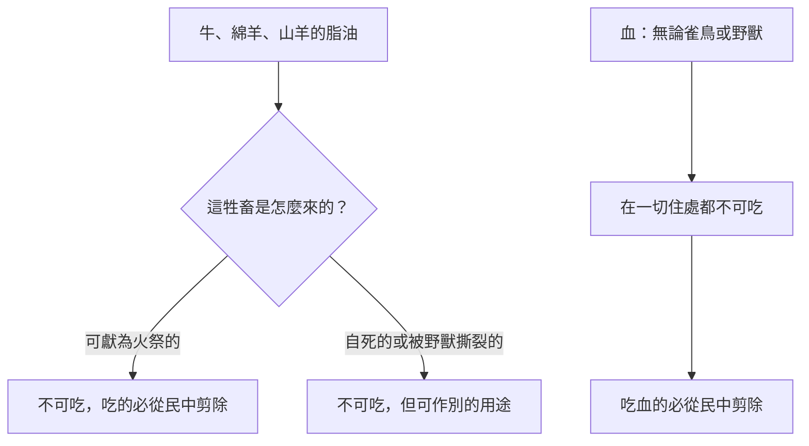

# 利未記 第7章

<!-- chapter-navigation:start -->
| [前一章](../03%20利未記/第6章.md) | [回目錄](../03%20利未記/全書目錄及綱要.md) | [下一章](../03%20利未記/第8章.md) |
| :--- | :---: | ---: |
<!-- chapter-navigation:end -->

1. [[贖愆祭（asham）|贖愆祭]]的條例乃是如此：這祭是至聖的。
2. 人在哪裡宰[[燔祭]]牲，也要在那裡宰[[贖愆祭（asham）|贖愆祭]]牲；其血，[[亞倫和他兒子（祭司）|祭司]]要灑在壇的周圍。
3. 又要將[[肥尾巴]]和蓋臟的[[脂油]]，
4. [[腰子|兩個腰子]]和腰子上的[[脂油]]，就是靠腰兩旁的脂油，並[[肝上的網子]]和腰子，一概取下。
5. [[亞倫和他兒子（祭司）|祭司]]要在壇上焚燒，為獻給耶和華的[[火祭（isheh）|火祭]]，是[[贖愆祭（asham）|贖愆祭]]。
6. [[亞倫和他兒子（祭司）|祭司]]中的男丁都可以吃這祭物；要在聖處吃，是至聖的。
7. [[贖罪祭]]怎樣，[[贖愆祭（asham）|贖愆祭]]也是怎樣，兩個祭是一個條例。獻贖愆祭贖罪的[[亞倫和他兒子（祭司）|祭司]]要得這祭物。
8. 獻[[燔祭]]的[[亞倫和他兒子（祭司）|祭司]]，無論為誰奉獻，要親自得他所獻那燔祭牲的皮。
9. 凡在爐中烤的[[素祭（minchah）|素祭]]和煎盤中做的，並鐵鏊上做的，都要歸那獻祭的[[亞倫和他兒子（祭司）|祭司]]。
10. 凡[[素祭（minchah）|素祭]]，無論是油調和的是乾的，都要歸亞倫的子孫，大家均分。
11. 人獻與耶和華[[平安祭]]的條例乃是這樣：
12. 他若為感謝獻上，就要用調油的無酵餅和抹油的無酵薄餅，並用油調勻細麵做的餅，與感謝祭一同獻上。
13. 要用有酵的餅和為感謝獻的[[平安祭]]，與[[供物（qorban）|供物]]一同獻上。
14. 從各樣的[[供物（qorban）|供物]]中，他要把一個餅獻給耶和華為[[舉祭]]，是要歸給灑[[平安祭]]牲血的[[亞倫和他兒子（祭司）|祭司]]。
15. 為感謝獻[[平安祭]]牲的肉，要在獻的日子吃，一點不可留到早晨。
16. 若所獻的是為還願，或是甘心獻的，必在獻祭的日子吃，所剩下的第二天也可以吃。
17. 但所剩下的祭肉，到第三天要用火焚燒；
18. 第三天若吃了[[平安祭]]的肉，這祭必不蒙悅納，人所獻的也不算為祭，反為可憎嫌的，吃這祭肉的，就必擔當他的罪孽。
19. 挨了[[污穢]]物的肉就不可吃，要用火焚燒。至於[[平安祭]]的肉，凡潔淨的人都要吃；
20. 只是獻與耶和華[[平安祭]]的肉，人若不潔淨而吃了，這人必從民中[[剪除]]。
21. 有人摸了什麼不潔淨的物，或是人的不潔淨，或是不潔淨的牲畜，或是不潔可憎之物，吃了獻與耶和華[[平安祭]]的肉，這人必從民中[[剪除]]。
22. 耶和華對摩西說：
23. 你曉諭以色列人說：牛的[[脂油]]、綿羊的脂油、山羊的脂油，你們都不可吃。
24. 自死的和被野獸撕裂的，那[[脂油]]可以做別的使用，只是你們萬不可吃。
25. 無論何人吃了獻給耶和華當[[火祭（isheh）|火祭]]牲畜的[[脂油]]，那人必從民中[[剪除]]。
26. 在你們一切的住處，無論是雀鳥的血是野獸的血，你們都不可吃。
27. 無論是誰吃血，那人必從民中[[剪除]]。
28. 耶和華對摩西說：
29. 你曉諭以色列人說：獻[[平安祭]]給耶和華的，要從平安祭中取些來奉給耶和華。
30. 他親手獻給耶和華的[[火祭（isheh）|火祭]]，就是[[脂油]]和胸，要帶來，好把胸在耶和華面前作[[搖祭]]，搖一搖。
31. [[亞倫和他兒子（祭司）|祭司]]要把[[脂油]]在壇上焚燒，但胸要歸亞倫和他的子孫。
32. 你們要從[[平安祭]]中把右腿作[[舉祭]]，奉給[[亞倫和他兒子（祭司）|祭司]]。
33. 亞倫子孫中，獻[[平安祭]]牲血和[[脂油]]的，要得這右腿為分；
34. 因為我從以色列人的[[平安祭]]中，取了這搖的胸和舉的腿給[[亞倫和他兒子（祭司）|祭司]]亞倫和他子孫，作他們從以色列人中所永得的分。
35. 這是從耶和華[[火祭（isheh）|火祭]]中，作亞倫受膏的分和他子孫受膏的分，正在摩西（原文是他）叫他們前來給耶和華供[[亞倫和他兒子（祭司）|祭司]]職分的日子，
36. 就是在摩西（原文是他）膏他們的日子，耶和華吩咐以色列人給他們的。這是他們世世代代永得的分。
37. 這就是[[燔祭]]、[[素祭（minchah）|素祭]]、[[贖罪祭]]、[[贖愆祭（asham）|贖愆祭]]，和[[平安祭]]的條例，並[[承接聖職（分別為聖）|承接聖職]]的禮，
38. 都是耶和華在西乃山所吩咐摩西的，就是他在西乃曠野吩咐以色列人獻[[供物（qorban）|供物]]給耶和華之日所說的。

---

## 本章知識節點

### 原文
- [[贖愆祭（asham）]]
- [[搖祭]]
- [[舉祭]]
- [[剪除]]
- [[脂油]]
- [[供物（qorban）]]
- [[素祭（minchah）]]
- [[腰子]]
- [[肝上的網子]]
- [[肥尾巴]]

### 神學
- [[平安祭]]
- [[贖罪祭]]
- [[燔祭]]
- [[脂油和血都不可吃]]
- [[血的尊重]]
- [[承接聖職（分別為聖）]]
- [[摸聖物成聖]]
- [[永遠當祭司的職任]]
- [[皮衣與血祭]]
- [[獻祭不蒙悅納]]

### 主題
- [[祭司的分（靠祭物養生）]]
- [[平安祭的三類（感謝祭、還願祭、甘心祭）]]
- [[平安祭的聚餐（神人同席）]]
- [[至聖的供物（聖與至聖之分）]]
- [[素祭不可有酵與蜜]]
- [[火祭（isheh）]]
- [[灑血]]
- [[污穢]]
- [[細麵]]
- [[會幕院子]]

### 人物
- [[亞倫和他兒子（祭司）]]

### 解經爭議
- [[從民中剪除的含義]]

### 互文
- [[贖價（基督作贖價）（來9：22）]]
- [[常以頌讚為祭（來13：15）]]

### 背景
- [[近東泥版跋語格式]]

---

## 本章整理

### 贖愆祭：怎麼獻，誰吃（v1-10）

第七章接著第六章往下講，講的仍是[[亞倫和他兒子（祭司）|祭司]]這一端。KC 注意到一個編排上的小意外：[[贖愆祭（asham）|贖愆祭]]的實際操作照理該寫在第六章，但第六章的重點是賠償，這裡的重點才是祭司的分——所以拖到本章才寫。

這祭與[[贖罪祭]]的關係，v7 用一句話說完：「贖罪祭怎樣，贖愆祭也是怎樣，兩個祭是一個條例。」兩者的祭司分例完全相同。但 GT 丁良才在本章列出兩祭的**五點不同**：表意不同（贖愆祭為賠償所致的虧損而獻）、性質不同（多有罰金）、用血不同、祭牲不同（只用公綿羊）、條例不同（不按貧富尊卑分級）。

其中「用血不同」在原文裡看得最清楚。v2 說「其血，[[亞倫和他兒子（祭司）|祭司]]要[[灑血|灑]]在壇的周圍」，這個「灑」是 זָרַק（H2236，STEP 詞典義「to scatter」，指從盆裡潑出去）；而利4 章[[贖罪祭]]抹壇角、對著幔子彈血用的是另一個動詞。==兩種祭的差別不只在血抹到哪裡，連動作本身的字都不一樣。== 丁良才因此說贖愆祭的灑法「像[[燔祭]]、和[[平安祭]]的血一樣」。

該燒的部分和平安祭同一份清單：[[肥尾巴]]、蓋臟的[[脂油]]、兩個[[腰子]]和腰子上的脂油、[[肝上的網子]]，一概取下焚燒為[[火祭（isheh）|火祭]]（v3-5）。剩下的祭肉歸[[亞倫和他兒子（祭司）|祭司]]中的男丁，在[[會幕院子|聖處]]吃，因為這是[[至聖的供物（聖與至聖之分）|至聖]]的（v6）——丁良才在此註明，這個「聖處」指的就是會幕的院子。

v8-10 接著把[[祭司的分（靠祭物養生）|祭司的份]]逐項列開，[[素祭（minchah）|素祭]]還因做法不同而分成兩種規則：

| 供物 | 誰拿 | 規則 |
|---|---|---|
| 燔祭牲的皮 | 獻這祭的祭司 | 獨得 |
| 爐中烤的、煎盤做的、鐵鏊做的素祭 | 主祭的那位祭司 | 獨得 |
| 油調和的與乾的細麵 | 亞倫的子孫 | 大家均分 |

這三種做素祭的器具在原文是三個不同的名詞——爐是 תַּנּוּר（H8574H）、煎盤是 מַרְחֶשֶׁת（H4802）、鐵鏊是 מַחֲבַת（H4227），正好對上 CT 所說的「爐烤、煎盤做、鐵鏊烙三種做法」。而 v10 的「大家均分」，CT 的〔原文字義〕早就註明原文沒有這個詞；STEP 顯示那句話字面是 אִישׁ כְּאָחִיו，「各人像他的弟兄一樣」。

那張[[皮衣與血祭|皮]]的去處也值得一提。燔祭本來要全燒，皮是唯一的例外。GT 丁良才把這件事一路追到伊甸園：「神在伊甸園給亞當夏娃作衣服所用的皮子，大概是被獻之祭牲的皮子，獻燔祭的祭司要得他所獻之祭牲的皮，或者是從此傳起的。」GT《舊約聖經背景註釋》則指出這不是以色列獨有的做法：祭牲的皮歸祭司，「從巴比倫至整個地中海地區，都找得著這習慣的例證」。

### [[平安祭的三類（感謝祭、還願祭、甘心祭）|平安祭分三類]]，吃法各不相同（v11-18）

[[平安祭]]是五祭中唯一獻祭的人也能吃的祭。本章第一次把它正式分成三類，並且給了不同的期限：

| 類別 | 為什麼獻 | 吃到什麼時候 |
|---|---|---|
| 感謝祭 | 蒙了恩要謝神（丁良才舉例：病得痊癒、行路平安） | 當天吃完，一點不可留到早晨 |
| 還願祭 | 為還先前所許的願 | 當天與第二天 |
| 甘心獻的 | 不為什麼特別的緣故，樂意就獻 | 當天與第二天 |

三類在原文是三個各自獨立的名詞：תּוֹדָה（H8426，感謝）、נֶדֶר（H5088，所許的願）、נְדָבָה（H5071，STEP 詞典義「voluntariness」，甘心）。

感謝祭要配三種餅（v12）：調油的無酵餅、抹油的無酵薄餅、用油調勻[[細麵]]做的餅。GT《舊約聖經背景註釋》把這兩種餅的樣子描述得很具體：「『餅』大概是指烘製時打過孔的辮狀環形麵包。『薄餅』是圓盤狀的餅，厚約半吋。」原文用的兩個詞正好對得上——חַלָּה（H2471）STEP 逐字解作「round perforated breads」（打過孔的圓餅），רָקִיק（H7550）詞典義是「flatbread」（薄餅）。CT 與丁良才另引猶太傳說：三種餅通常各獻十個，祭司從每樣取一個作[[舉祭]]。

==然後 v13 出現全利未記唯一的例外：「要用有酵的餅」。== [[素祭不可有酵與蜜|素祭一律不可有酵]]，這裡卻要求配上有酵的餅。CT 在〔問題改正〕裡把界線劃清楚：這有酵餅表示獻祭的人自己是有罪的、不配蒙恩，「不能因為感謝祭中獻上有酵餅，就認為酵是好的。這有酵餅只限用於平安祭」。丁良才補上關鍵的一點：這些有酵的餅**不可燒在祭壇上**，先知阿摩司責備以色列人，正是因為他們犯了這條例（摩4:5）。KC 讀的是同一件事的另一面：有酵的餅不能說到主耶穌，因為祂裡面沒有罪；它們說的是我們——我們帶著「罪仍在我們裡面」的自覺前來。

時間到了卻捨不得燒掉，後果很重。v18 一連四個否定：[[獻祭不蒙悅納|這祭必不蒙悅納、人所獻的也不算為祭、反為可憎嫌的、吃這祭肉的就必擔當他的罪孽]]。丁良才說得最實際：「他若忽略這條例，甚至有人在第三天吃了這肉，就不算為祭，須要另獻一個。」GT《聖經精讀本》把它提到原則的高度：事奉神的標準是聽從神的話語，離開神的話語就等於離開事奉的標準（撒上15:22）。原文的四個字都很具體：「不蒙悅納」是 רָצָה（H7521）的被動、「不算為」是記帳用的 חָשַׁב（H2803H）、「可憎嫌的」是罕見的 פִּגּוּל（H6292），「擔當罪孽」則是 נָשָׂא（H5375J）配 עָוֺן（H5771G）。

KC 把這條期限讀成屬靈生活的提醒：我們不能靠昨天的經歷活著，神期待我們每天帶新的讚美祭來到壇前——這也正是[[常以頌讚為祭（來13：15）|來13:15「常以頌讚為祭獻給神」]]所承接的。

### 誰能上這張桌子（v19-21）

[[平安祭的聚餐（神人同席）|平安祭的聚餐]]有兩道門檻，一道在食物，一道在人。祭肉若挨了[[污穢|污穢物]]就不可吃，要用火燒掉（v19）；人若身上不潔淨而吃了，「這人必從民中[[剪除]]」（v20）；摸過不潔之物、不潔的牲畜或可憎之物以後再吃的，同樣[[從民中剪除的含義|剪除]]（v21）。

丁良才分辨這兩節的差別：v20 講的是本身的不潔（如漏症一類的疾病），v21 講的是外來的不潔（摸到不潔之物或不潔之人）。CT 則把「吃」讀成交往的比喻：這條例告訴信徒不可與污穢的人親密相交，以免被沾染。

「剪除」這件事誰執行？原文沒有寫出動作者——וְנִכְרְתָה 是 כָּרַת（H3772I，STEP 詞典義「to cut: eliminate」）的被動式。GT《舊約聖經背景註釋》正是據此判斷：「本節所提的不是要人執行的刑罰，而是神的作為。」被剪除的對象在原文是「那個人」，剪除的來源則是「從她的族人中」（עַם，H5971B，STEP 詞典義「kinsman」）——字面強調的是與親族的連結被切斷。至於實際後果是逐出還是死亡，各家仍無定論。

==這一段與第六章正好互為鏡像。== 利6:18、27 說潔淨的人或物碰到聖物就[[摸聖物成聖|成聖]]；本章說不潔淨的人碰了聖物，被剪除的是他自己。聖潔會傳，不潔也會傳，只是方向相反。

### [[脂油和血都不可吃|脂油和血]]：神留給自己的兩樣（v22-27）

這一段從祭司轉回全民——v23 開頭是「你曉諭以色列人說」。禁令有兩條：

兩樣東西被留下的理由不同。CT 分得很清楚：「血指主救贖的工作有非常的價值與地位，人不可隨意對待。脂油重在主耶穌身位的寶貴，是特別保留為著神的。」GT《舊約聖經背景註釋》把兩者並列：「板油和血同列為歸耶和華所有。血怎樣是祭牲生命的表徵，板油亦同樣是祭肉的表徵。」KC 說得最短：生命（血）與內在的力量（脂油）完全屬於神。

[[血的尊重|血的禁令比脂油的更寬]]。丁良才指出：神雖然禁止吃牛羊的脂油，卻准許吃羚羊與鹿等野獸的脂油；但血是「無論什麼血，連雀鳥和野獸的血，都是絕對不可吃的」。他另記下猶太傳說裡的量刑：故意吃脂油的從民中剪除，無意吃的則鞭打三十九下，還要獻贖罪祭。

v24 那句「可以做別的使用」是什麼用途？CT 說是燈油、潤滑油這類日常用途；GT《啟導本》舉了一個更具體的例子——燒在毒蛇的洞口把蛇趕走，免得牠傷害牛羊。原文的「自死的」是 נְבֵלָה（H5038，屍體）、「被野獸撕裂的」是 טְרֵפָה（H2966），是兩個各自獨立的法律用語。

### 搖的胸與舉的腿（v28-36）

最後一段回到[[平安祭]]，交代[[祭司的分（靠祭物養生）|祭司拿哪兩塊肉]]：胸作[[搖祭]]，右腿作[[舉祭]]。

獻祭的人要「親手」把火祭帶來（v29-30）。這個「親手」在原文相當醒目：יָדָיו תְּבִיאֶינָה——動詞是第三人稱複數陰性，主詞正是他那雙手，字面就是「他的兩隻手要帶來」。CT 解為獻祭的人要親自帶到壇前交給祭司；KC 由此讀出一項要求：平安祭不能託人代獻，「神要從每一個人心裡領受」。

這兩個動作到底怎麼做，各家說法不一：

| 來源 | 對搖祭的描述 |
|---|---|
| CT | 前後擺動；並記下有人說搖祭是水平、舉祭是垂直，兩者合成十字架的形狀 |
| GT《利未記雷氏研讀本》 | 把胸搖一搖、來回移動，向祭壇又離開祭壇，象徵獻給神、神又交回給祭司 |
| GT 丁良才 | 另記一說：祭司托著獻祭者的手，一同在耶和華面前搖動 |
| GT《舊約聖經背景註釋》 | 對「搖」存疑：「對經文詳細的研究，證明這些祭並沒有搖什麼東西」，但在神面前抬起作為奉獻是有可能的 |

同一份背景註釋也修正了「舉祭」這個譯名：這個字新國際本作「捐獻」，指捐贈的禮物，「亞喀得語／巴比倫語和烏加列語的同源字，都證實了這個用法」。==STEP 的詞典義正好給同一個答案：תְּרוּמָה（H8641）＝「contribution」（捐獻）。== 至於搖祭 תְּנוּפָה（H8573），它的動詞 נוּף（H5130B）詞典義確實是「to wave」。兩個字的分野也在此：背景註釋指出搖祭一定是在神面前、即聖所獻上的，舉祭的地點則不限。

丁良才另列出聖經中被搖過的祭物共七樣：平安祭的胸、承接聖職的祭物、初熟的莊稼一捆、疑妻行淫的素祭、離俗歸主之人的祭、被潔淨之長大痲瘋者的公羊羔和油、五旬節初熟麥子作的餅與同獻的祭牲。

這兩塊肉是怎麼切下來的？GT《舊約聖經背景註釋》給了一個很具體的推論：「由於沒有提到左胸還是右胸，學者相信祭牲不是左右劈為兩半，而是在肋骨底下腰斬。這一大塊完整的胸，是供祭司分享的上等鮮肉。腿是單人份的上肉，留給主持獻祭的祭司享用。」分配也因此不同——丁良才指出胸歸眾祭司與他們的兒女，右腿則歸那位實際灑血燒脂油的祭司。

CT 與 KC 對這兩塊肉的讀法接近：胸是心所在的位置，說到主的愛；右腿說到力量與所走的路。CT 的話中之光說右腿「表明行走天路的能力。事奉神的人越事奉就越有能力，可以快跑跟隨主」。

v34-36 把這份供給的性質定死：這是[[永遠當祭司的職任|世世代代永得的分]]，從摩西[[承接聖職（分別為聖）|膏立亞倫和他子孫]]那一天起就設立了。有意思的是，這三節的中文都作「分」，原文卻換了三個字——v33 是 מָנָה（H4490）、v34 是 חֹק（H2706H）、v35 是 מִשְׁחָה（H4888A，字面就是「受膏」）、到 v36 又換成 חֻקָּה（H2708）。

### 跋語：七章條例的落款（v37-38）

最後兩節看似只是重複，其實是一份正式的文件結尾。GT《啟導本聖經利未記註釋》指出這是[[近東泥版跋語格式|古代近東泥版文書的「跋」]]——抄寫者寫在文末的書後序，包含四個要素（其中「獻[[供物（qorban）|供物]]給耶和華之日」正是寫作日期那一欄）：

| 跋語要素 | 對應經文 |
|---|---|
| 題目 | 「耶和華所吩咐摩西的」 |
| 作者 | 摩西 |
| 寫作日期 | 「他在西乃曠野吩咐以色列人獻供物給耶和華之日所說的」 |
| 內容綜述 | 「這就是燔祭、素祭、贖罪祭、贖愆祭和平安祭的條例」 |

同一份註釋說明它的年代：「這種寫跋的形式流行於巴比倫時代，早於摩西不過百年，當為在埃及受有良好教育的摩西所熟悉。」v37 列的五祭之外還加了一項「承接聖職的禮」，原文是 מִלּוּאִים（H4394，STEP 逐字解「installation offering」）——這正好預告了下一章：條例講完了，接下來是照著條例執行。

==把利未記1-7 章合起來看，這七章其實回答了兩個不同的問題。== 前六章多半在回答「我該帶什麼來、怎麼獻」，第六、七章轉向「收下這些的人接下來要做什麼、拿哪一份、什麼時候吃、什麼情況不能吃」。丁良才在 v37 逐項標出兩套條例的對應段落：燔祭（利1:3-17／6:8-13）、素祭（利2／6:14-18）、贖罪祭（利4:1-5:13／6:24-30）、贖愆祭（利5:14-6:7／7:1-7）、平安祭（利3／7:11-21、28-36）。兩套並排，制度才算完整。

**參考資料**
https://www.ccbiblestudy.org/Old%20Testament/03Lev/03CT07.htm
https://www.ccbiblestudy.org/Old%20Testament/03Lev/03GT07.htm
https://www.kingcomments.com/en/bible-studies/Lev/7
https://biblehub.com/study/leviticus/7.htm
https://github.com/STEPBible/STEPBible-Data

<!-- chapter-navigation:start -->
| [前一章](../03%20利未記/第6章.md) | [回目錄](../03%20利未記/全書目錄及綱要.md) | [下一章](../03%20利未記/第8章.md) |
| :--- | :---: | ---: |
<!-- chapter-navigation:end -->
