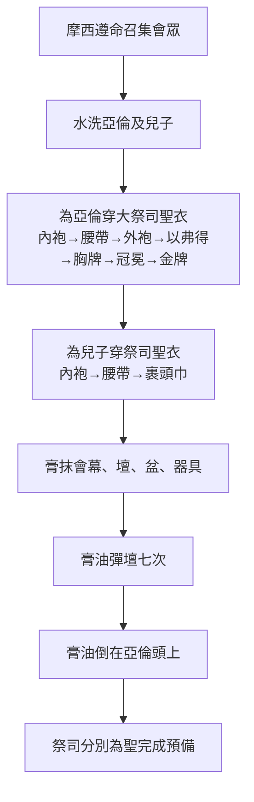
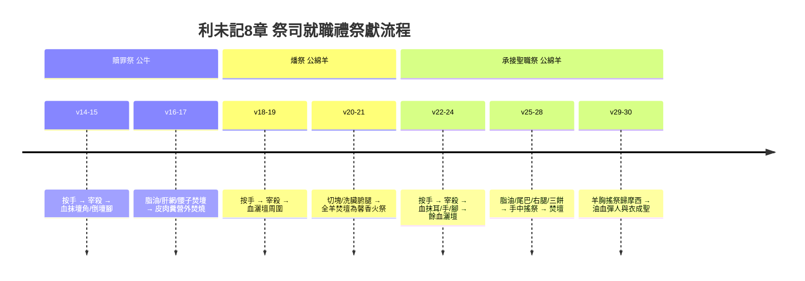
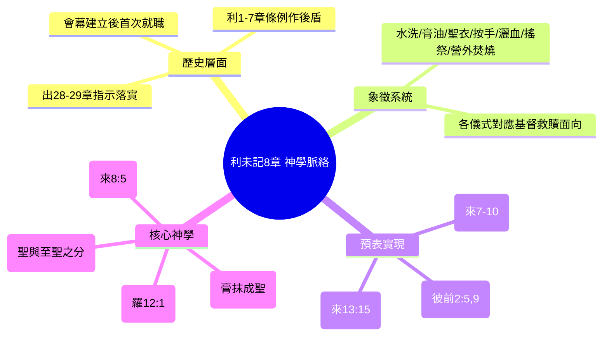

# 利未記 第8章

1. 耶和華曉諭[[摩西]]說：
2. 你將[[亞倫和他兒子（祭司）|亞倫和他兒子]]一同帶來，並將[[聖衣（祭司聖服）|聖衣]]、[[膏油（聖膏油）|膏油]]，與[[贖罪祭]]的一隻公牛、兩隻公綿羊、一筐無酵餅都帶來，
3. 又招聚[[全會眾（kol ha-edah）|會眾]]到[[會幕門口]]。
4. [[摩西]]就照耶和華所吩咐的行了；於是[[全會眾（kol ha-edah）|會眾]]聚集在[[會幕門口]]。
5. [[摩西]]告訴[[全會眾（kol ha-edah）|會眾]]說：這就是耶和華所吩咐當行的事。
6. [[摩西]]帶了[[亞倫和他兒子（祭司）|亞倫和他兒子]]來，用[[洗身（水洗）|水洗]]了他們。
7. 給[[亞倫]]穿上[[內袍（雜色內袍）|內袍]]，束上[[腰帶（繡花腰帶）|腰帶]]，穿上[[外袍（以弗得的外袍）|外袍]]，又加上[[以弗得]]，用其上巧工織的帶子把以弗得繫在他身上，
8. 又給他戴上[[胸牌（決斷胸牌）|胸牌]]，把[[烏陵和土明]]放在胸牌內，
9. 把[[冠冕（裹頭巾）|冠冕]]戴在他頭上，在冠冕的前面釘上[[牌子（冠冕牌）|金牌]]，就是聖冠，都是照耶和華所吩咐[[摩西]]的。
10. [[摩西]]用[[膏油（聖膏油）|膏油]]抹帳幕和其中所有的，使他成聖；
11. 又用[[膏油（聖膏油）|膏油]]在壇上彈了七次，又抹了壇和壇的一切器皿，並[[洗濯盆（銅盆）|洗濯盆和盆座]]，使他成聖；
12. 又把[[膏油（聖膏油）|膏油]]倒在[[亞倫]]的頭上膏他，使他成聖。
13. [[摩西]]帶了[[亞倫]]的兒子來，給他們穿上[[內袍（雜色內袍）|內袍]]，束上[[腰帶（繡花腰帶）|腰帶]]，包上[[冠冕（裹頭巾）|裹頭巾]]，都是照耶和華所吩咐摩西的。
14. 他牽了[[贖罪祭]]的公牛來，[[亞倫和他兒子（祭司）|亞倫和他兒子]][[按手（samak）|按手]]在贖罪祭公牛的頭上，
15. 就宰了公牛。[[摩西]]用指頭蘸血，抹在壇上四角的周圍，使壇潔淨，把血倒在壇的腳那裡，使壇成聖，壇就潔淨了；
16. 又取臟上所有的[[脂油（chelev）|脂油]]和[[肝上的網子（yoteret ha-kaved）|肝上的網子]]，並[[腰子（kilyah）|兩個腰子]]與腰子上的脂油，都燒在壇上；
17. 惟有公牛，連皮帶肉並糞，用火燒在營外，都是照耶和華所吩咐[[摩西]]的。
18. 他奉上[[燔祭（olah）|燔祭]]的公綿羊；[[亞倫和他兒子（祭司）|亞倫和他兒子]][[按手（samak）|按手]]在羊的頭上，
19. 就宰了公羊。[[摩西]]把血灑在壇的周圍，
20. 把羊切成塊子，把頭和肉塊並[[脂油（chelev）|脂油]]都燒了。
21. 用[[洗身（水洗）|水洗]]了臟腑和腿，就把全羊燒在壇上為馨香的[[燔祭（olah）|燔祭]]，是獻給耶和華的[[火祭（isheh）|火祭]]，都是照耶和華所吩咐[[摩西]]的。
22. 他又奉上第二隻公綿羊，就是[[承接聖職（分別為聖）|承接聖職]]之禮的羊；[[亞倫和他兒子（祭司）|亞倫和他兒子]][[按手（samak）|按手]]在羊的頭上，
23. 就宰了羊。[[摩西]]把些血抹在[[亞倫]]的右耳垂上和右手的大拇指上，並右腳的大拇指上，
24. 又帶了[[亞倫]]的兒子來，把些血抹在他們的右耳垂上和右手的大拇指上，並右腳的大拇指上，又把血灑在壇的周圍。
25. 取[[脂油（chelev）|脂油]]和[[肥尾巴（alyah）|肥尾巴]]，並臟上一切的脂油與[[肝上的網子（yoteret ha-kaved）|肝上的網子]]，[[腰子（kilyah）|兩個腰子]]和腰子上的脂油，並右腿，
26. 再從耶和華面前、盛無酵餅的筐子裡取出一個無酵餅，一個油餅，一個薄餅，都放在[[脂油（chelev）|脂油]]和右腿上，
27. 把這一切放在[[亞倫]]的手上和他兒子的手上作[[搖祭（tenufah）|搖祭]]，在耶和華面前搖一搖。
28. [[摩西]]從他們的手上拿下來，燒在壇上的[[燔祭（olah）|燔祭]]上，都是為[[承接聖職（分別為聖）|承接聖職]]獻給耶和華馨香的[[火祭（isheh）|火祭]]。
29. [[摩西]]拿羊的胸作為[[搖祭（tenufah）|搖祭]]，在耶和華面前搖一搖，是[[承接聖職（分別為聖）|承接聖職]]之禮，歸摩西的分，都是照耶和華所吩咐摩西的。
30. [[摩西]]取點[[膏油（聖膏油）|膏油]]和壇上的血，彈在[[亞倫]]和他的衣服上，並他兒子和他兒子的衣服上，使他和他們的衣服一同成聖。
31. [[摩西]]對[[亞倫和他兒子（祭司）|亞倫和他兒子]]說：把肉煮在[[會幕門口]]，在那裡吃，又吃[[承接聖職（分別為聖）|承接聖職]]筐子裡的餅，按我所吩咐的說（或作：按所吩咐我的說）：這是亞倫和他兒子要吃的。
32. 剩下的肉和餅，你們要用火焚燒。
33. 你們七天不可出會幕的門，等到你們[[承接聖職（分別為聖）|承接聖職]]的日子滿了，因為主叫你們七天承接聖職。
34. 像今天所行的都是耶和華吩咐行的，為你們贖罪。
35. 七天你們要晝夜住在[[會幕門口]]，遵守耶和華的吩咐，免得你們死亡，因為所吩咐我的就是這樣。
36. 於是[[亞倫和他兒子（祭司）|亞倫和他兒子]]行了耶和華藉著[[摩西]]所吩咐的一切事。

---

## 本章知識節點

### 神學
- [[山上的樣式]]
- [[膏抹成聖]]
- [[受膏的祭司（mashiach kohen）]]
- [[至聖的供物（聖與至聖之分）]]

### 人物
- [[亞倫和他兒子（祭司）]]
- [[亞倫]]
- [[摩西]]
- [[全會眾（kol ha-edah）]]

### 事件
- [[承接聖職（分別為聖）]]
- [[洗身（水洗）]]
- [[按手（samak）]]
- [[贖罪祭]]
- [[燔祭（olah）]]
- [[平安祭（shelamim）]]
- [[搖祭（tenufah）]]
- [[灑血（zaraq）]]
- [[營外焚燒（machutz la-machaneh saraf）]]

### 原文
- [[烏陵和土明]]
- [[以弗得]]
- [[胸牌（決斷胸牌）]]
- [[冠冕（裹頭巾）]]
- [[內袍（雜色內袍）]]
- [[外袍（以弗得的外袍）]]
- [[腰帶（繡花腰帶）]]
- [[牌子（冠冕牌）]]
- [[膏油（聖膏油）]]
- [[洗濯盆（銅盆）]]
- [[銅壇（燔祭壇）]]
- [[脂油（chelev）]]
- [[肝上的網子（yoteret ha-kaved）]]
- [[腰子（kilyah）]]
- [[皮肉頭腿臟腑糞（or basar rosh regel qereb pereq）]]
- [[肥尾巴（alyah）]]
- [[馨香之氣]]
- [[火祭（isheh）]]

### 地點
- [[會幕門口]]

### 互文
- [[出29：20|出29：20 血抹右耳右手右腳]]

---

## 本章整理

### 祭司就職禮的啟動與會眾見證（v1-5）

本章開啟利未記「祭司職任建立」的歷史敘事單元（利8-10章）。耶和華曉諭摩西，命他將[[亞倫和他兒子（祭司）|亞倫及其子]]、[[聖衣（祭司聖服）|聖衣]]、[[膏油（聖膏油）|膏油]]、[[贖罪祭|贖罪祭]]公牛、兩隻[[燔祭（olah）|燔祭]]公綿羊、一筐無酵餅帶來，並招聚[[全會眾（kol ha-edah）|全會眾]]到[[會幕門口|會幕門口]]見證（v1-3）。摩西遵命行事，會眾聚集，摩西宣告：「這就是耶和華所吩咐當行的事」（v4-5）。CT 指出此舉「為要觀禮以見證他們的任職出於神」；GT《丁良才利未記註釋》強調祭司職分「不是亞倫自取的，也不是摩西因亞倫是哥哥就給他的，乃是神召他作祭司」。KC 則指出本段與《出埃及記》28-29章緊密相連，祭司就職必須建立在獻祭條例（利1-7章）之上。CT 註釋補充會幕門口空間有限，實際參與者可能為長老與百姓代表，或七日輪流觀禮。

> [!quote] CT 逐節詳解（利8:3）
> 「又招聚會眾到會幕門口：為要觀禮以見證他們的任職出於神。」

> [!quote] GT 《啟導本聖經利未記註釋》（利8:1-5）
> 「授亞倫及諸子祭司職務的命令來自神，祭司因此掌握精神與道德方面的最高權威。」

### 潔淨、聖衣與膏抹：祭司分別為聖的預備（v6-13）

儀式進入核心階段：[[洗身（水洗）|水洗]]、穿[[聖衣（祭司聖服）|聖衣]]、[[膏抹成聖|膏抹]]。摩西用水洗亞倫和他兒子（v6），CT 靈意註解指向「聖靈的洗淨（林前6:11）與『話中之水』的洗滌（弗5:26）」。隨後為亞倫穿上[[內袍（雜色內袍）|內袍]]、[[腰帶（繡花腰帶）|腰帶]]、[[外袍（以弗得的外袍）|外袍]]、[[以弗得|以弗得]]、[[胸牌（決斷胸牌）|胸牌]]（內置[[烏陵和土明|烏陵和土明]]）、[[冠冕（裹頭巾）|冠冕]]與[[牌子（冠冕牌）|金牌]]（v7-9）；亞倫兒子則穿內袍、繫腰帶、包[[冠冕（裹頭巾）|裹頭巾]]（v13）。GT《聖經精讀本》將各件聖衣對應基督屬性：內袍表人性、外袍表神性、以弗得表榮耀、胸牌表恩典公義、冠冕表順服權柄。摩西隨後用[[膏油（聖膏油）|膏油]]抹會幕、[[銅壇（燔祭壇）|壇]]、[[洗濯盆（銅盆）|洗濯盆]]及器具（v10-11），在壇上彈油七次，最後將膏油倒在亞倫頭上（v12）。KC 指出「膏油倒在頭上，必定會往下流（詩133:2），聖靈倒在元首基督身上，我們持定祂自然得著引導」。CT 靈意層面將膏抹會幕對應「教會和一切事奉相關的人事物蒙聖靈分別為聖（羅15:16）」，膏抹亞倫對應「聖靈厚厚的澆灌（多3:6）」。

### 三獻祭與血油灑濺：承接聖職的核心儀式（v14-30）

儀式高潮為三獻祭：[[贖罪祭|贖罪祭]]公牛（v14-17）、[[燔祭（olah）|燔祭]]公綿羊（v18-21）、[[平安祭（shelamim）|承接聖職祭]]公綿羊（v22-30）。亞倫父子在每隻祭牲頭上[[按手（samak）|按手]]，表徵認同與轉嫁。贖罪祭血抹[[銅壇（燔祭壇）|壇角]]、倒壇腳，[[脂油（chelev）|脂油]]、[[肝上的網子（yoteret ha-kaved）|肝網]]、[[腰子（kilyah）|腰子]]焚於壇上，[[皮肉頭腿臟腑糞（or basar rosh regel qereb pereq）|皮肉糞]]在[[營外焚燒（machutz la-machaneh saraf）|營外焚燒]]（v15-17）。燔祭羊血灑壇周圍，全羊洗淨後焚燒為[[馨香之氣|馨香之氣]]的[[火祭（isheh）|火祭]]（v18-21）。承接聖職羊血抹亞倫父子右耳垂、右手大拇指、右腳大拇指，餘血灑壇周圍（v22-24）；取[[脂油（chelev）|脂油]]、[[肥尾巴（alyah）|肥尾巴]]、肝網、腰子、右腿，配三樣無酵餅置於亞倫父子手中作[[搖祭（tenufah）|搖祭]]，後焚於壇上（v25-28）；羊胸作搖祭歸摩西（v29）。最後摩西取[[膏油（聖膏油）|膏油]]與壇上血彈在亞倫父子及其衣服上，使人與衣同成聖（v30）。CT 逐節詳解指出「右耳表聽神話、右手表作神工、右腳行神路」；KC 強調「血先抹耳，後手、腳，聽從是事奉起點」；BH 註釋說明此灑血儀式獨特於就職禮，平安祭常規只灑壇邊。GT《舊約背景註釋》補充古代近東「充滿其手」授職語意，與烏陵土明決策功能呼應。

### 七日住會幕門口：職任確立與順服的見證（v31-36）

摩西吩咐亞倫父子在[[會幕門口|會幕門口]]煮肉、吃餅，剩餘焚燒（v31-32），七日不得出門，晝夜遵守耶和華吩咐，免得死亡（v33-35）。CT 指出「七天表徵完全，即指一生活在聖潔原則下」；GT《聖經精讀本》強調「不可出會幕門為保證聖潔，會幕外是不聖潔之地」。v36 總結：「亞倫和他兒子行了耶和華藉著摩西所吩咐的一切事」。KC 將此順服視為「印象深刻且榜樣」，但緊接利10章拿答、亞比戶獻凡火即死亡，顯示須持續謹守。BH 註釋引用蘇美文獻，指出七日奉獻典禮在古代近東常見，祭司離開聖區即面臨不潔威脅。

> [!note] 來源綜合觀察
> CT、GT、KC、BH 四家對「七日重複獻祭」有不同解讀：CT 傾向「每天重複全套就職禮」；GT《丁良才註釋》列舉兩種說法並傾向第一種；KC 未明確表態；BH《舊約背景註釋》視為古代近東常態七日奉獻。此分歧本身即為本章重要釋經議題。

### 跨章神學脈絡：從亞倫祭司到基督大祭司與信徒祭司體系

本章是舊約祭司制度建立的歷史錨點，與《出埃及記》28-29、40章形成互文閉環（[[出29：20|出29：20]] 灑血耳/手/腳細節在此實現）。神學主題層層遞進：
1. **[[山上的樣式|天上樣式]]的地上實踐**：會幕、聖衣、膏油、獻祭皆照山上指示（來8:5；9:23）。
2. **[[受膏的祭司（mashiach kohen）|受膏祭司]]預表基督**：亞倫膏油倒頭（v12）預表基督受聖靈無限澆灌（約3:34；來1:9）；基督作大祭司須「遠離罪人、聖潔歸主」（來7:26），「不是獻贖罪的血祭，這是耶穌已經獻過的」（來10:1-10），成就贖罪祭、燔祭、平安祭三重意義。
3. **[[承接聖職（分別為聖）|分別為聖]]延伸至信徒祭司**：彼得前書2:5,9 宣告信徒為「聖潔的祭司」「有君尊的祭司」；羅12:1 呼召「將身體獻上當作活祭」，對應燔祭全然獻上；來13:13 勸勉「出到營外就了祂去」，呼應贖罪祭營外焚燒。
4. **[[膏抹成聖|膏抹]]與[[洗身（水洗）|水洗]]雙重潔淨**：GT《丁良才利未記註釋》引弗5:25-27、約13:3-10，指大祭司水洗預表「大祭司每到大贖罪日也必須如此行」的潔淨；弗5:26「藉著水中之道洗淨教會」。

**參考資料**
https://www.ccbiblestudy.org/Old%20Testament/03Lev/03CT08.htm
https://www.ccbiblestudy.org/Old%20Testament/03Lev/03GT08.htm
https://www.kingcomments.com/en/bible-studies/Lev/8
https://biblehub.com/study/leviticus/8.htm
